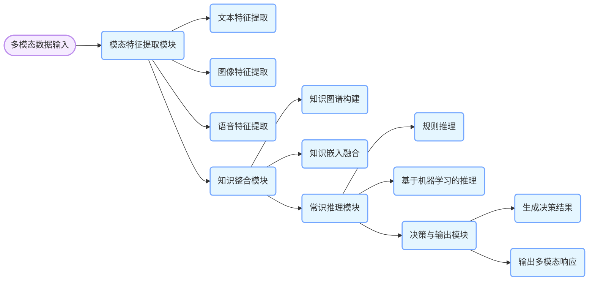

# AI Agent的多模态常识推理与知识整合

> 关键词：AI Agent、多模态、常识推理、知识整合、人工智能

> 摘要：本文聚焦于AI Agent的多模态常识推理与知识整合这一前沿领域。首先介绍了该研究的背景、目的、预期读者以及文档结构等内容。接着详细阐述了多模态、常识推理、知识整合等核心概念及其联系，给出了原理和架构的文本示意图与Mermaid流程图。通过Python源代码深入讲解了核心算法原理和具体操作步骤，并运用数学模型和公式进行了理论分析与举例说明。结合实际项目，给出了开发环境搭建、源代码实现及解读。探讨了其实际应用场景，推荐了学习资源、开发工具框架和相关论文著作。最后总结了未来发展趋势与挑战，提供了常见问题解答和扩展阅读参考资料，旨在为相关领域的研究者和开发者提供全面且深入的技术指导。

## 1. 背景介绍 
### 1.1 目的和范围
随着人工智能技术的不断发展，AI Agent在各个领域的应用越来越广泛。然而，现有的AI Agent往往只能处理单一模态的数据，如文本、图像或语音等，这限制了其在复杂现实场景中的应用能力。多模态常识推理与知识整合旨在让AI Agent能够同时处理多种模态的数据，并结合常识知识进行推理和决策，从而提高其智能水平和实用性。本文的范围涵盖了多模态常识推理与知识整合的核心概念、算法原理、数学模型、项目实战、应用场景以及相关的工具和资源推荐等方面。

### 1.2 预期读者
本文预期读者包括人工智能领域的研究者、开发者、学生以及对多模态技术和常识推理感兴趣的专业人士。对于有一定编程基础和人工智能知识的读者，本文可以帮助他们深入理解多模态常识推理与知识整合的原理和实现方法；对于初学者，本文可以作为入门指南，引导他们了解该领域的基本概念和研究方向。

### 1.3 文档结构概述
本文共分为十个部分。第一部分为背景介绍，阐述了研究的目的、范围、预期读者和文档结构；第二部分介绍核心概念与联系，包括多模态、常识推理、知识整合等概念的原理和架构；第三部分讲解核心算法原理和具体操作步骤，通过Python代码进行详细说明；第四部分给出数学模型和公式，并进行详细讲解和举例；第五部分进行项目实战，包括开发环境搭建、源代码实现和代码解读；第六部分探讨实际应用场景；第七部分推荐相关的工具和资源，包括学习资源、开发工具框架和论文著作；第八部分总结未来发展趋势与挑战；第九部分为附录，提供常见问题与解答；第十部分列出扩展阅读和参考资料。

### 1.4 术语表
#### 1.4.1 核心术语定义
- **AI Agent**：人工智能代理，是一种能够感知环境、进行决策并采取行动的智能实体。
- **多模态**：指同时使用多种不同类型的数据模态，如文本、图像、语音、视频等。
- **常识推理**：基于人类常识知识进行推理和决策的能力，常识知识包括日常生活中的事实、规律和经验等。
- **知识整合**：将不同来源、不同模态的知识进行融合和统一，以便更好地进行推理和应用。

#### 1.4.2 相关概念解释
- **模态转换**：将一种模态的数据转换为另一种模态的数据，例如将图像转换为文本描述。
- **知识图谱**：一种用于表示知识的图结构，其中节点表示实体，边表示实体之间的关系。
- **注意力机制**：一种在神经网络中用于突出重要信息的机制，能够帮助模型更好地关注关键部分的数据。

#### 1.4.3 缩略词列表
- **CNN**：Convolutional Neural Network，卷积神经网络
- **RNN**：Recurrent Neural Network，循环神经网络
- **LSTM**：Long Short-Term Memory，长短期记忆网络
- **Transformer**：一种基于注意力机制的神经网络架构
- **NLP**：Natural Language Processing，自然语言处理

## 2. 核心概念与联系 
### 核心概念原理

#### 多模态
多模态数据是指包含多种不同类型信息的数据，如文本、图像、语音等。不同模态的数据具有不同的特点和表达方式，例如文本数据具有明确的语义信息，图像数据则包含丰富的视觉特征。多模态技术的核心在于如何有效地融合这些不同模态的数据，以获取更全面、准确的信息。

#### 常识推理
常识推理是基于人类常识知识进行推理和决策的过程。常识知识是人类在日常生活中积累的大量事实、规律和经验，这些知识对于理解和处理各种问题至关重要。AI Agent需要具备常识推理能力，才能在复杂的现实场景中做出合理的决策。

#### 知识整合
知识整合是将不同来源、不同模态的知识进行融合和统一的过程。在多模态常识推理中，需要将来自文本、图像等不同模态的知识进行整合，以便更好地进行推理和应用。知识整合可以通过构建知识图谱、使用知识嵌入等方法来实现。

### 架构的文本示意图
```plaintext
多模态数据输入
|
|-- 模态特征提取模块
|   |-- 文本特征提取（如BERT）
|   |-- 图像特征提取（如ResNet）
|   |-- 语音特征提取（如Mel spectrogram）
|
|-- 知识整合模块
|   |-- 知识图谱构建
|   |-- 知识嵌入融合
|
|-- 常识推理模块
|   |-- 规则推理
|   |-- 基于机器学习的推理（如神经网络）
|
|-- 决策与输出模块
|   |-- 生成决策结果
|   |-- 输出多模态响应
```

### Mermaid流程图


## 3. 核心算法原理 & 具体操作步骤 
### 模态特征提取
#### 文本特征提取
我们可以使用预训练的语言模型如BERT来提取文本特征。以下是一个使用Hugging Face的`transformers`库进行文本特征提取的Python示例代码：
```python
from transformers import AutoTokenizer, AutoModel
import torch

# 加载预训练的BERT模型和分词器
tokenizer = AutoTokenizer.from_pretrained('bert-base-uncased')
model = AutoModel.from_pretrained('bert-base-uncased')

# 输入文本
text = "This is an example sentence."

# 对文本进行分词
inputs = tokenizer(text, return_tensors='pt')

# 通过模型获取特征
with torch.no_grad():
    outputs = model(**inputs)

# 获取[CLS]标记的特征表示
text_features = outputs.last_hidden_state[:, 0, :]
print(text_features.shape)
```
#### 图像特征提取
对于图像特征提取，我们可以使用预训练的卷积神经网络如ResNet。以下是一个使用`torchvision`库进行图像特征提取的Python示例代码：
```python
import torch
import torchvision.models as models
import torchvision.transforms as transforms
from PIL import Image

# 加载预训练的ResNet模型
model = models.resnet18(pretrained=True)
# 移除最后一层全连接层
feature_extractor = torch.nn.Sequential(*list(model.children())[:-1])
feature_extractor.eval()

# 定义图像预处理步骤
preprocess = transforms.Compose([
    transforms.Resize(256),
    transforms.CenterCrop(224),
    transforms.ToTensor(),
    transforms.Normalize(mean=[0.485, 0.456, 0.406], std=[0.229, 0.224, 0.225])
])

# 加载图像
image = Image.open('example.jpg')
# 预处理图像
input_tensor = preprocess(image)
input_batch = input_tensor.unsqueeze(0)

# 通过模型获取特征
with torch.no_grad():
    image_features = feature_extractor(input_batch)
    image_features = image_features.view(image_features.size(0), -1)
print(image_features.shape)
```

### 知识整合
#### 知识图谱构建
知识图谱可以使用图数据库如Neo4j来构建。以下是一个简单的示例代码，展示如何使用`py2neo`库创建一个简单的知识图谱：
```python
from py2neo import Graph, Node, Relationship

# 连接到Neo4j数据库
graph = Graph("bolt://localhost:7687", auth=("neo4j", "password"))

# 创建节点
person = Node("Person", name="John")
city = Node("City", name="New York")

# 创建关系
lives_in = Relationship(person, "LIVES_IN", city)

# 将节点和关系添加到知识图谱中
graph.create(person)
graph.create(city)
graph.create(lives_in)
```
#### 知识嵌入融合
知识嵌入可以将知识图谱中的实体和关系表示为低维向量。我们可以使用TransE算法来进行知识嵌入。以下是一个简单的示例代码：
```python
import torch
import torch.nn as nn

# 定义TransE模型
class TransE(nn.Module):
    def __init__(self, entity_num, relation_num, embedding_dim):
        super(TransE, self).__init__()
        self.entity_embeddings = nn.Embedding(entity_num, embedding_dim)
        self.relation_embeddings = nn.Embedding(relation_num, embedding_dim)

    def forward(self, head, relation, tail):
        head_emb = self.entity_embeddings(head)
        relation_emb = self.relation_embeddings(relation)
        tail_emb = self.entity_embeddings(tail)
        score = torch.norm(head_emb + relation_emb - tail_emb, p=1, dim=1)
        return score

# 示例参数
entity_num = 100
relation_num = 20
embedding_dim = 50

# 创建模型实例
model = TransE(entity_num, relation_num, embedding_dim)

# 示例输入
head = torch.tensor([0])
relation = torch.tensor([1])
tail = torch.tensor([2])

# 前向传播
score = model(head, relation, tail)
print(score)
```

### 常识推理
#### 规则推理
规则推理可以使用基于规则的推理引擎如Drools。以下是一个简单的Drools规则示例：
```java
package com.example.rules;

import com.example.model.Person;

rule "Adult Rule"
    when
        $person: Person(age >= 18)
    then
        System.out.println($person.getName() + " is an adult.");
end
```
#### 基于机器学习的推理
我们可以使用神经网络进行常识推理。以下是一个简单的全连接神经网络示例：
```python
import torch
import torch.nn as nn

# 定义神经网络模型
class SimpleNet(nn.Module):
    def __init__(self, input_dim, hidden_dim, output_dim):
        super(SimpleNet, self).__init__()
        self.fc1 = nn.Linear(input_dim, hidden_dim)
        self.relu = nn.ReLU()
        self.fc2 = nn.Linear(hidden_dim, output_dim)

    def forward(self, x):
        out = self.fc1(x)
        out = self.relu(out)
        out = self.fc2(out)
        return out

# 示例参数
input_dim = 10
hidden_dim = 20
output_dim = 2

# 创建模型实例
model = SimpleNet(input_dim, hidden_dim, output_dim)

# 示例输入
x = torch.randn(1, input_dim)

# 前向传播
output = model(x)
print(output)
```

## 4. 数学模型和公式 & 详细讲解 & 举例说明 
### 模态特征提取的数学模型
#### 文本特征提取
在使用BERT进行文本特征提取时，BERT模型可以表示为一个函数 $f_{BERT}(x)$，其中 $x$ 是输入的文本序列。BERT模型通过多层的Transformer编码器对输入序列进行处理，最终输出每个词元的特征表示。对于输入序列 $x = [x_1, x_2, \cdots, x_n]$，BERT模型的输出可以表示为 $h = [h_1, h_2, \cdots, h_n]$，其中 $h_i$ 是第 $i$ 个词元的特征向量。通常，我们会使用 $h_0$（即`[CLS]`标记的特征表示）作为整个文本序列的特征表示。

#### 图像特征提取
在使用ResNet进行图像特征提取时，ResNet模型可以表示为一个函数 $f_{ResNet}(I)$，其中 $I$ 是输入的图像。ResNet模型通过多层的卷积层和池化层对图像进行特征提取，最终输出一个固定维度的特征向量。假设输入图像的大小为 $H \times W \times C$（高度、宽度、通道数），经过ResNet模型处理后，输出的特征向量维度为 $D$。

### 知识嵌入的数学模型
#### TransE算法
TransE算法的目标是将知识图谱中的实体和关系嵌入到低维向量空间中，使得对于每个三元组 $(h, r, t)$（头实体 $h$、关系 $r$、尾实体 $t$），满足 $h + r \approx t$。具体来说，TransE算法通过最小化以下损失函数来学习实体和关系的嵌入：
$$L = \sum_{(h, r, t) \in S} \sum_{(h', r, t') \in S'} [\gamma + d(h + r, t) - d(h' + r, t')]_+$$
其中，$S$ 是正样本三元组的集合，$S'$ 是负样本三元组的集合，$\gamma$ 是一个边界超参数，$d(x, y)$ 是向量 $x$ 和 $y$ 之间的距离度量（通常使用 $L_1$ 或 $L_2$ 距离），$[z]_+ = \max(0, z)$ 是取正函数。

#### 举例说明
假设我们有一个知识图谱，其中包含三个实体 $e_1, e_2, e_3$ 和一个关系 $r_1$，有一个正样本三元组 $(e_1, r_1, e_2)$。我们随机初始化实体和关系的嵌入向量，例如 $e_1 = [0.1, 0.2]$，$r_1 = [0.3, 0.4]$，$e_2 = [0.4, 0.6]$。计算 $e_1 + r_1 = [0.4, 0.6]$，$d(e_1 + r_1, e_2) = 0$。假设一个负样本三元组 $(e_1, r_1, e_3)$，$e_3 = [0.7, 0.8]$，计算 $e_1 + r_1 = [0.4, 0.6]$，$d(e_1 + r_1, e_3) = \sqrt{(0.7 - 0.4)^2 + (0.8 - 0.6)^2} = 0.36$。如果 $\gamma = 1$，则损失函数中的一项为 $[1 + 0 - 0.36]_+ = 0.64$。

### 常识推理的数学模型
#### 基于神经网络的推理
在使用全连接神经网络进行常识推理时，假设输入向量为 $x \in \mathbb{R}^n$，神经网络的第一层权重矩阵为 $W_1 \in \mathbb{R}^{m \times n}$，偏置向量为 $b_1 \in \mathbb{R}^m$，则第一层的输出 $h_1$ 可以表示为：
$$h_1 = \sigma(W_1x + b_1)$$
其中，$\sigma$ 是激活函数（如ReLU函数）。假设第二层的权重矩阵为 $W_2 \in \mathbb{R}^{k \times m}$，偏置向量为 $b_2 \in \mathbb{R}^k$，则最终的输出 $y$ 可以表示为：
$$y = W_2h_1 + b_2$$

#### 举例说明
假设输入向量 $x = [0.1, 0.2]$，$n = 2$，$W_1 = \begin{bmatrix} 0.3 & 0.4 \\ 0.5 & 0.6 \end{bmatrix}$，$b_1 = [0.1, 0.2]$，则：
$$W_1x + b_1 = \begin{bmatrix} 0.3 & 0.4 \\ 0.5 & 0.6 \end{bmatrix} \begin{bmatrix} 0.1 \\ 0.2 \end{bmatrix} + \begin{bmatrix} 0.1 \\ 0.2 \end{bmatrix} = \begin{bmatrix} 0.11 \\ 0.17 \end{bmatrix} + \begin{bmatrix} 0.1 \\ 0.2 \end{bmatrix} = \begin{bmatrix} 0.21 \\ 0.37 \end{bmatrix}$$
假设使用ReLU激活函数，$\sigma(W_1x + b_1) = \begin{bmatrix} 0.21 \\ 0.37 \end{bmatrix}$。假设 $W_2 = \begin{bmatrix} 0.7 & 0.8 \end{bmatrix}$，$b_2 = [0.1]$，则：
$$y = W_2h_1 + b_2 = \begin{bmatrix} 0.7 & 0.8 \end{bmatrix} \begin{bmatrix} 0.21 \\ 0.37 \end{bmatrix} + 0.1 = 0.463$$

## 5. 项目实战：代码实际案例和详细解释说明 
### 5.1  开发环境搭建
#### 安装Python和相关库
首先，确保你已经安装了Python 3.x。然后，使用`pip`安装以下必要的库：
```sh
pip install torch torchvision transformers py2neo
```
#### 安装Neo4j数据库
下载并安装Neo4j数据库，可以从Neo4j官方网站（https://neo4j.com/download/）下载适合你操作系统的版本。安装完成后，启动Neo4j服务，并创建一个新的数据库实例。

### 5.2  源代码详细实现和代码解读
以下是一个完整的项目示例，实现了一个简单的多模态常识推理系统。
```python
import torch
import torchvision.models as models
import torchvision.transforms as transforms
from transformers import AutoTokenizer, AutoModel
from py2neo import Graph, Node, Relationship
from PIL import Image

# 文本特征提取
def extract_text_features(text):
    tokenizer = AutoTokenizer.from_pretrained('bert-base-uncased')
    model = AutoModel.from_pretrained('bert-base-uncased')
    inputs = tokenizer(text, return_tensors='pt')
    with torch.no_grad():
        outputs = model(**inputs)
    text_features = outputs.last_hidden_state[:, 0, :]
    return text_features

# 图像特征提取
def extract_image_features(image_path):
    model = models.resnet18(pretrained=True)
    feature_extractor = torch.nn.Sequential(*list(model.children())[:-1])
    feature_extractor.eval()
    preprocess = transforms.Compose([
        transforms.Resize(256),
        transforms.CenterCrop(224),
        transforms.ToTensor(),
        transforms.Normalize(mean=[0.485, 0.456, 0.406], std=[0.229, 0.224, 0.225])
    ])
    image = Image.open(image_path)
    input_tensor = preprocess(image)
    input_batch = input_tensor.unsqueeze(0)
    with torch.no_grad():
        image_features = feature_extractor(input_batch)
        image_features = image_features.view(image_features.size(0), -1)
    return image_features

# 知识图谱构建
def build_knowledge_graph():
    graph = Graph("bolt://localhost:7687", auth=("neo4j", "password"))
    person = Node("Person", name="John")
    city = Node("City", name="New York")
    lives_in = Relationship(person, "LIVES_IN", city)
    graph.create(person)
    graph.create(city)
    graph.create(lives_in)

# 主函数
def main():
    # 提取文本特征
    text = "John lives in New York."
    text_features = extract_text_features(text)
    print("Text features shape:", text_features.shape)

    # 提取图像特征
    image_path = "example.jpg"
    image_features = extract_image_features(image_path)
    print("Image features shape:", image_features.shape)

    # 构建知识图谱
    build_knowledge_graph()

if __name__ == "__main__":
    main()
```
### 5.3  代码解读与分析
- **文本特征提取函数`extract_text_features`**：使用预训练的BERT模型对输入的文本进行分词和特征提取，最终返回`[CLS]`标记的特征表示。
- **图像特征提取函数`extract_image_features`**：使用预训练的ResNet模型对输入的图像进行预处理和特征提取，最终返回一个固定维度的特征向量。
- **知识图谱构建函数`build_knowledge_graph`**：使用`py2neo`库连接到Neo4j数据库，并创建一个简单的知识图谱，包含一个人物节点、一个城市节点和一个`LIVES_IN`关系。
- **主函数`main`**：调用上述三个函数，依次进行文本特征提取、图像特征提取和知识图谱构建，并打印出提取的特征向量的形状。

## 6. 实际应用场景 
### 智能客服
在智能客服系统中，多模态常识推理与知识整合可以帮助客服机器人更好地理解用户的问题。用户可以通过文本、语音或图像等多种方式提出问题，客服机器人可以结合多模态数据和常识知识进行推理，提供更准确、全面的回答。例如，用户上传一张产品图片并询问相关问题，客服机器人可以识别图片中的产品特征，并结合产品知识库进行解答。

### 自动驾驶
在自动驾驶领域，多模态常识推理与知识整合可以提高自动驾驶车辆的安全性和智能性。车辆可以通过摄像头、雷达等多种传感器获取多模态数据，如图像、点云等。结合常识知识，如交通规则、道路状况等，车辆可以进行更准确的环境感知和决策。例如，当遇到特殊的交通标志或路况时，车辆可以根据常识知识做出合理的应对。

### 智能家居
在智能家居系统中，多模态常识推理与知识整合可以实现更智能的家居控制。用户可以通过语音、手势等多种方式与智能家居设备进行交互，系统可以结合多模态数据和常识知识理解用户的意图。例如，用户说“我感觉有点冷”，系统可以根据常识知识自动调节空调温度。

### 医疗诊断
在医疗诊断领域，多模态常识推理与知识整合可以辅助医生进行更准确的诊断。医生可以通过患者的病历、影像（如X光、CT等）、症状描述等多模态数据进行综合分析。结合医学常识和知识库，系统可以提供诊断建议和治疗方案。例如，通过分析患者的影像数据和症状描述，结合医学知识判断患者可能患有的疾病。

## 7. 工具和资源推荐
### 7.1 学习资源推荐
#### 7.1.1 书籍推荐
- 《人工智能：一种现代的方法》：全面介绍了人工智能的各个领域，包括知识表示、推理、机器学习等，是人工智能领域的经典教材。
- 《深度学习》：由深度学习领域的三位先驱Ian Goodfellow、Yoshua Bengio和Aaron Courville撰写，详细介绍了深度学习的理论和实践。
- 《自然语言处理入门》：适合初学者的自然语言处理入门书籍，介绍了自然语言处理的基本概念和方法。

#### 7.1.2 在线课程
- Coursera上的“人工智能基础”课程：由知名高校的教授授课，系统介绍了人工智能的基础知识和方法。
- edX上的“深度学习”课程：提供了深度学习的理论和实践教学，包括神经网络、卷积神经网络等内容。
- 吴恩达的“机器学习”课程：经典的机器学习入门课程，通过实际案例讲解机器学习的基本算法和应用。

#### 7.1.3 技术博客和网站
- Medium：有许多人工智能领域的专业博主分享最新的研究成果和技术实践。
- arXiv：提供了大量的学术论文预印本，涵盖了人工智能的各个领域。
- Towards Data Science：专注于数据科学和人工智能领域的技术博客，有很多实用的教程和案例分析。

### 7.2 开发工具框架推荐
#### 7.2.1 IDE和编辑器
- PyCharm：功能强大的Python集成开发环境，提供了代码编辑、调试、版本控制等功能。
- Jupyter Notebook：交互式的编程环境，适合进行数据分析和模型实验，方便代码的编写和展示。
- Visual Studio Code：轻量级的代码编辑器，支持多种编程语言和插件扩展，具有丰富的功能和良好的用户体验。

#### 7.2.2 调试和性能分析工具
- Py-Spy：用于分析Python程序的性能，找出性能瓶颈。
- TensorBoard：TensorFlow提供的可视化工具，可以用于监控模型的训练过程、可视化模型结构等。
- PDB：Python自带的调试器，可以帮助开发者调试Python代码。

#### 7.2.3 相关框架和库
- PyTorch：深度学习框架，提供了丰富的神经网络层和优化算法，易于使用和扩展。
- TensorFlow：另一个流行的深度学习框架，具有强大的分布式训练和部署能力。
- Hugging Face Transformers：提供了大量的预训练语言模型和工具，方便进行自然语言处理任务。

### 7.3 相关论文著作推荐
#### 7.3.1 经典论文
- “Attention Is All You Need”：提出了Transformer架构，是自然语言处理领域的重要突破。
- “BERT: Pre-training of Deep Bidirectional Transformers for Language Understanding”：介绍了BERT模型，推动了自然语言处理预训练模型的发展。
- “ImageNet Classification with Deep Convolutional Neural Networks”：提出了AlexNet模型，开启了深度学习在计算机视觉领域的热潮。

#### 7.3.2 最新研究成果
- 关注顶级学术会议如NeurIPS、ICML、CVPR、ACL等的最新论文，了解多模态常识推理与知识整合领域的最新研究进展。
- 关注知名研究机构如OpenAI、DeepMind等的研究成果发布。

#### 7.3.3 应用案例分析
- 一些行业报告和学术论文会对多模态常识推理与知识整合在实际应用中的案例进行分析，可以从中学习到实际应用的经验和方法。

## 8. 总结：未来发展趋势与挑战
### 未来发展趋势
#### 更强大的多模态融合方法
未来，研究人员将致力于开发更强大的多模态融合方法，能够更好地处理不同模态数据之间的差异和关联，提高多模态数据的利用效率。例如，结合注意力机制、图神经网络等技术，实现更细粒度的多模态特征融合。

#### 常识知识的大规模整合
随着知识图谱技术的不断发展，未来将实现常识知识的大规模整合。将不同领域、不同来源的常识知识进行统一表示和管理，为AI Agent提供更丰富、准确的常识知识支持。

#### 跨领域应用拓展
多模态常识推理与知识整合将在更多的领域得到应用，如教育、金融、娱乐等。例如，在教育领域，开发智能教育助手，根据学生的学习情况和多模态输入提供个性化的学习建议。

### 挑战
#### 数据标注和获取
多模态数据的标注和获取是一个挑战。不同模态的数据需要不同的标注方法和工具，而且标注成本较高。此外，获取大规模、高质量的多模态数据也存在一定的困难。

#### 计算资源需求
多模态常识推理与知识整合通常需要大量的计算资源。处理多模态数据和进行复杂的推理计算需要强大的硬件支持，这对于一些小型企业和研究机构来说是一个挑战。

#### 常识知识的表示和推理
常识知识具有复杂性和不确定性，如何准确地表示和推理常识知识是一个难题。目前的知识表示方法和推理算法还存在一定的局限性，需要进一步的研究和改进。

## 9. 附录：常见问题与解答
### 多模态数据融合有哪些常见方法？
常见的多模态数据融合方法包括早期融合、晚期融合和中间融合。早期融合是在特征提取之前将不同模态的数据进行融合；晚期融合是在各个模态的数据分别进行特征提取和处理后，再将结果进行融合；中间融合则是在特征提取的过程中进行融合。

### 如何评估多模态常识推理系统的性能？
可以使用准确率、召回率、F1值等指标来评估多模态常识推理系统的性能。此外，还可以进行人工评估，通过让人类专家对系统的输出进行评价，来判断系统的推理结果是否合理。

### 知识图谱构建需要注意哪些问题？
在知识图谱构建过程中，需要注意数据的质量和一致性。确保知识图谱中的实体和关系准确无误，避免出现重复和矛盾的信息。此外，还需要考虑知识图谱的可扩展性和更新性，以便能够不断添加和更新知识。

### 多模态常识推理与知识整合在实际应用中面临哪些困难？
在实际应用中，多模态常识推理与知识整合面临着数据多样性、计算资源限制、常识知识的不确定性等困难。需要根据具体的应用场景，选择合适的方法和技术来解决这些问题。

## 10. 扩展阅读 & 参考资料
### 扩展阅读
- 《多模态机器学习：综述与分类》：深入介绍了多模态机器学习的各种方法和技术。
- 《知识图谱：概念与技术》：详细讲解了知识图谱的构建、表示和推理等方面的内容。
- 《深度学习中的注意力机制》：对注意力机制在深度学习中的应用进行了全面的介绍。

### 参考资料
- Hugging Face官方文档：https://huggingface.co/docs
- PyTorch官方文档：https://pytorch.org/docs/stable/index.html
- Neo4j官方文档：https://neo4j.com/docs/

作者：AI天才研究院/AI Genius Institute & 禅与计算机程序设计艺术 /Zen And The Art of Computer Programming