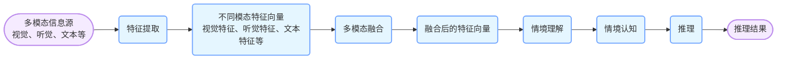

# AI Agent的多模态情境理解与推理

> 关键词：AI Agent、多模态、情境理解、推理、多模态融合

> 摘要：本文聚焦于AI Agent的多模态情境理解与推理这一前沿领域。首先介绍了该领域的研究背景，明确目的、范围、预期读者和文档结构。接着阐述了核心概念及它们之间的联系，给出了原理和架构的文本示意图与Mermaid流程图。详细讲解了核心算法原理，并用Python代码进行了示例。深入探讨了相关数学模型和公式，并举例说明。通过项目实战，从开发环境搭建到源代码实现与解读，全面展示了多模态情境理解与推理在实际中的应用。还列举了实际应用场景，推荐了学习资源、开发工具框架和相关论文著作。最后对未来发展趋势与挑战进行了总结，同时在附录中解答了常见问题，并提供了扩展阅读与参考资料，旨在为该领域的研究者和开发者提供全面且深入的指导。

## 1. 背景介绍 
### 1.1 目的和范围
随着人工智能技术的飞速发展，AI Agent的能力不断拓展。单模态信息处理已经难以满足复杂现实场景的需求，多模态情境理解与推理成为提升AI Agent智能水平的关键。本文的目的在于深入探讨AI Agent如何融合多种模态（如视觉、听觉、文本等）的信息，实现对情境的准确理解和有效推理。范围涵盖核心概念的解析、算法原理的阐述、数学模型的构建、项目实战的演示以及实际应用场景的分析等方面。

### 1.2 预期读者
本文预期读者包括人工智能领域的研究者、开发者、相关专业的学生以及对AI Agent多模态技术感兴趣的技术爱好者。对于研究者，本文提供了前沿的研究思路和方法；对于开发者，有助于他们在实际项目中应用多模态情境理解与推理技术；对于学生，可作为学习该领域知识的参考资料；对于技术爱好者，能帮助他们了解该领域的核心内容和发展趋势。

### 1.3 文档结构概述
本文首先介绍背景信息，让读者了解研究的目的和范围。接着阐述核心概念及联系，使读者对多模态情境理解与推理有清晰的认识。然后详细讲解核心算法原理和具体操作步骤，并用Python代码示例辅助理解。随后介绍相关数学模型和公式，并举例说明其应用。通过项目实战部分，展示如何将理论应用于实际。之后列举实际应用场景，体现该技术的实用性。推荐学习资源、开发工具框架和相关论文著作，方便读者深入学习。最后总结未来发展趋势与挑战，在附录中解答常见问题，并提供扩展阅读与参考资料。

### 1.4 术语表
#### 1.4.1 核心术语定义
- **AI Agent**：人工智能代理，是一种能够感知环境、进行决策并采取行动以实现特定目标的软件实体。
- **多模态**：指包含多种不同类型信息的模式，如视觉、听觉、文本、触觉等。
- **情境理解**：AI Agent对周围环境和相关信息进行感知、分析和解释，以形成对当前情境的准确认知。
- **推理**：基于已有的知识和信息，通过逻辑或统计方法得出新的结论或预测的过程。

#### 1.4.2 相关概念解释
- **多模态融合**：将不同模态的信息进行整合，以获取更全面、准确的信息表示。
- **特征提取**：从原始数据中提取出具有代表性和区分性的特征，以便后续的处理和分析。
- **语义理解**：对信息的语义含义进行理解，包括词汇、句子和篇章的语义分析。

#### 1.4.3 缩略词列表
- **CNN**：Convolutional Neural Network，卷积神经网络
- **RNN**：Recurrent Neural Network，循环神经网络
- **LSTM**：Long Short-Term Memory，长短期记忆网络
- **Transformer**：一种基于注意力机制的深度学习模型

## 2. 核心概念与联系 
### 核心概念原理
AI Agent的多模态情境理解与推理涉及多个核心概念。多模态信息源（如视觉图像、听觉语音、文本数据等）为情境理解提供了丰富的素材。首先，需要对不同模态的数据进行特征提取，将原始数据转换为计算机能够处理的特征向量。例如，对于图像数据，可以使用卷积神经网络（CNN）提取图像的视觉特征；对于文本数据，可以使用词嵌入技术将文本转换为向量表示。

然后，进行多模态融合，将不同模态的特征向量进行整合。常见的融合方法有早期融合、晚期融合和混合融合。早期融合是在特征提取之前将不同模态的数据进行拼接；晚期融合是在特征提取之后，将不同模态的特征向量进行拼接或加权求和；混合融合则结合了早期融合和晚期融合的优点。

情境理解是在多模态融合的基础上，对整合后的信息进行分析和解释，以形成对当前情境的认知。推理则是基于情境理解的结果，利用已有的知识和规则，得出新的结论或预测。

### 架构的文本示意图
```plaintext
多模态信息源（视觉、听觉、文本等）
    |
    | 特征提取
    v
不同模态特征向量（视觉特征、听觉特征、文本特征等）
    |
    | 多模态融合
    v
融合后的特征向量
    |
    | 情境理解
    v
情境认知
    |
    | 推理
    v
推理结果
```

### Mermaid流程图


## 3. 核心算法原理 & 具体操作步骤 
### 特征提取算法原理
#### 图像特征提取
对于图像数据，常用的特征提取方法是卷积神经网络（CNN）。CNN通过卷积层、池化层和全连接层对图像进行特征提取。卷积层通过卷积核在图像上滑动，提取图像的局部特征；池化层用于降低特征图的维度，减少计算量；全连接层将提取的特征进行整合，输出最终的特征向量。

以下是使用Python和PyTorch实现的简单CNN图像特征提取代码示例：
```python
import torch
import torch.nn as nn

class SimpleCNN(nn.Module):
    def __init__(self):
        super(SimpleCNN, self).__init__()
        self.conv1 = nn.Conv2d(3, 16, kernel_size=3, padding=1)
        self.relu1 = nn.ReLU()
        self.pool1 = nn.MaxPool2d(2)
        self.conv2 = nn.Conv2d(16, 32, kernel_size=3, padding=1)
        self.relu2 = nn.ReLU()
        self.pool2 = nn.MaxPool2d(2)
        self.fc = nn.Linear(32 * 8 * 8, 128)

    def forward(self, x):
        x = self.pool1(self.relu1(self.conv1(x)))
        x = self.pool2(self.relu2(self.conv2(x)))
        x = x.view(-1, 32 * 8 * 8)
        x = self.fc(x)
        return x

# 示例使用
model = SimpleCNN()
input_image = torch.randn(1, 3, 32, 32)  # 输入图像
image_features = model(input_image)
print("图像特征向量形状:", image_features.shape)
```
#### 文本特征提取
对于文本数据，常用的特征提取方法是词嵌入技术，如Word2Vec、GloVe等。此外，还可以使用基于深度学习的模型，如Transformer。以下是使用Hugging Face的Transformers库进行文本特征提取的代码示例：
```python
from transformers import AutoTokenizer, AutoModel
import torch

tokenizer = AutoTokenizer.from_pretrained('bert-base-uncased')
model = AutoModel.from_pretrained('bert-base-uncased')

text = "This is a sample sentence."
inputs = tokenizer(text, return_tensors='pt')
outputs = model(**inputs)
text_features = outputs.last_hidden_state.mean(dim=1)
print("文本特征向量形状:", text_features.shape)
```
### 多模态融合算法原理
#### 晚期融合
晚期融合是在特征提取之后进行的。将不同模态的特征向量进行拼接或加权求和。以下是一个简单的晚期融合代码示例：
```python
import torch

# 假设已经提取了图像特征和文本特征
image_features = torch.randn(1, 128)
text_features = torch.randn(1, 128)

# 拼接特征向量
fused_features = torch.cat((image_features, text_features), dim=1)
print("融合后的特征向量形状:", fused_features.shape)
```
### 情境理解与推理算法原理
情境理解和推理可以使用基于规则的方法或基于机器学习的方法。基于规则的方法通过定义一系列的规则和条件，对融合后的特征进行判断和推理；基于机器学习的方法则使用深度学习模型，如循环神经网络（RNN）、长短期记忆网络（LSTM）或Transformer，对融合后的特征进行学习和预测。

以下是一个使用LSTM进行情境推理的简单代码示例：
```python
import torch
import torch.nn as nn

class LSTMReasoner(nn.Module):
    def __init__(self, input_size, hidden_size, output_size):
        super(LSTMReasoner, self).__init__()
        self.lstm = nn.LSTM(input_size, hidden_size, batch_first=True)
        self.fc = nn.Linear(hidden_size, output_size)

    def forward(self, x):
        _, (h_n, _) = self.lstm(x)
        output = self.fc(h_n.squeeze(0))
        return output

# 示例使用
input_size = 256  # 融合后的特征维度
hidden_size = 128
output_size = 10  # 推理结果的类别数
model = LSTMReasoner(input_size, hidden_size, output_size)
input_features = torch.randn(1, 1, input_size)  # 输入融合后的特征
reasoning_result = model(input_features)
print("推理结果形状:", reasoning_result.shape)
```

## 4. 数学模型和公式 & 详细讲解 & 举例说明 
### 特征提取数学模型
#### 卷积神经网络（CNN）
在卷积神经网络中，卷积层的数学模型可以表示为：
$$y_{i,j}^k = \sum_{m=0}^{M-1}\sum_{n=0}^{N-1}x_{i+m,j+n}w_{m,n}^k + b^k$$
其中，$y_{i,j}^k$ 是卷积层输出特征图中第 $k$ 个通道在位置 $(i,j)$ 的值，$x_{i+m,j+n}$ 是输入图像在位置 $(i+m,j+n)$ 的值，$w_{m,n}^k$ 是第 $k$ 个卷积核在位置 $(m,n)$ 的权重，$b^k$ 是第 $k$ 个通道的偏置，$M$ 和 $N$ 是卷积核的大小。

例如，假设输入图像是一个 $32\times32$ 的彩色图像（通道数为 3），使用一个 $3\times3$ 的卷积核进行卷积操作，卷积核的数量为 16。则输出特征图的大小为 $32\times32$（假设使用了合适的填充），通道数为 16。

#### 词嵌入
词嵌入将单词映射到一个低维向量空间中。假设词汇表的大小为 $V$，词嵌入的维度为 $d$，则词嵌入矩阵 $W$ 的形状为 $V\times d$。对于一个单词 $w$，其对应的词向量 $v_w$ 可以通过查找词嵌入矩阵 $W$ 得到：
$$v_w = W_{idx(w)}$$
其中，$idx(w)$ 是单词 $w$ 在词汇表中的索引。

### 多模态融合数学模型
#### 晚期融合
晚期融合可以通过拼接或加权求和的方式进行。假设图像特征向量为 $\mathbf{x}_i$，文本特征向量为 $\mathbf{x}_t$，融合后的特征向量为 $\mathbf{x}_f$。

拼接融合的公式为：
$$\mathbf{x}_f = [\mathbf{x}_i; \mathbf{x}_t]$$
加权求和融合的公式为：
$$\mathbf{x}_f = \alpha\mathbf{x}_i + (1 - \alpha)\mathbf{x}_t$$
其中，$\alpha$ 是权重系数，$0\leq\alpha\leq1$。

例如，假设图像特征向量 $\mathbf{x}_i = [0.1, 0.2, 0.3]$，文本特征向量 $\mathbf{x}_t = [0.4, 0.5, 0.6]$，$\alpha = 0.6$，则加权求和融合后的特征向量为：
$$\mathbf{x}_f = 0.6\times[0.1, 0.2, 0.3] + (1 - 0.6)\times[0.4, 0.5, 0.6] = [0.22, 0.32, 0.42]$$
### 情境理解与推理数学模型
#### 循环神经网络（RNN）
RNN的数学模型可以表示为：
$$\mathbf{h}_t = \tanh(\mathbf{W}_{hh}\mathbf{h}_{t-1} + \mathbf{W}_{xh}\mathbf{x}_t + \mathbf{b}_h)$$
$$\mathbf{y}_t = \mathbf{W}_{hy}\mathbf{h}_t + \mathbf{b}_y$$
其中，$\mathbf{h}_t$ 是时刻 $t$ 的隐藏状态，$\mathbf{x}_t$ 是时刻 $t$ 的输入，$\mathbf{W}_{hh}$、$\mathbf{W}_{xh}$ 和 $\mathbf{W}_{hy}$ 是权重矩阵，$\mathbf{b}_h$ 和 $\mathbf{b}_y$ 是偏置向量，$\tanh$ 是激活函数。

例如，假设输入序列的长度为 $T$，输入向量的维度为 $d_x$，隐藏状态的维度为 $d_h$，输出向量的维度为 $d_y$。则在每个时刻 $t$，RNN根据当前输入 $\mathbf{x}_t$ 和上一时刻的隐藏状态 $\mathbf{h}_{t-1}$ 计算当前时刻的隐藏状态 $\mathbf{h}_t$，并输出 $\mathbf{y}_t$。

## 5. 项目实战：代码实际案例和详细解释说明 
### 5.1  开发环境搭建
#### 安装Python
首先，需要安装Python。建议使用Python 3.7及以上版本。可以从Python官方网站（https://www.python.org/downloads/）下载并安装。

#### 安装深度学习框架
本项目使用PyTorch作为深度学习框架。可以使用以下命令安装PyTorch：
```sh
pip install torch torchvision
```
#### 安装其他依赖库
还需要安装一些其他的依赖库，如Hugging Face的Transformers库、NumPy等。可以使用以下命令安装：
```sh
pip install transformers numpy
```
### 5.2  源代码详细实现和代码解读
以下是一个完整的项目示例，实现了AI Agent的多模态情境理解与推理。该示例使用图像和文本数据进行多模态融合，并进行情境推理。
```python
import torch
import torch.nn as nn
from transformers import AutoTokenizer, AutoModel

# 图像特征提取模型
class SimpleCNN(nn.Module):
    def __init__(self):
        super(SimpleCNN, self).__init__()
        self.conv1 = nn.Conv2d(3, 16, kernel_size=3, padding=1)
        self.relu1 = nn.ReLU()
        self.pool1 = nn.MaxPool2d(2)
        self.conv2 = nn.Conv2d(16, 32, kernel_size=3, padding=1)
        self.relu2 = nn.ReLU()
        self.pool2 = nn.MaxPool2d(2)
        self.fc = nn.Linear(32 * 8 * 8, 128)

    def forward(self, x):
        x = self.pool1(self.relu1(self.conv1(x)))
        x = self.pool2(self.relu2(self.conv2(x)))
        x = x.view(-1, 32 * 8 * 8)
        x = self.fc(x)
        return x

# 文本特征提取模型
tokenizer = AutoTokenizer.from_pretrained('bert-base-uncased')
text_model = AutoModel.from_pretrained('bert-base-uncased')

# 多模态融合与推理模型
class MultiModalReasoner(nn.Module):
    def __init__(self, input_size, hidden_size, output_size):
        super(MultiModalReasoner, self).__init__()
        self.fc1 = nn.Linear(input_size, hidden_size)
        self.relu = nn.ReLU()
        self.fc2 = nn.Linear(hidden_size, output_size)

    def forward(self, x):
        x = self.relu(self.fc1(x))
        x = self.fc2(x)
        return x

# 初始化模型
image_model = SimpleCNN()
input_size = 128 + 768  # 图像特征维度 + 文本特征维度
hidden_size = 256
output_size = 10
reasoner = MultiModalReasoner(input_size, hidden_size, output_size)

# 示例数据
input_image = torch.randn(1, 3, 32, 32)
text = "This is a sample sentence."
inputs = tokenizer(text, return_tensors='pt')

# 特征提取
image_features = image_model(input_image)
text_outputs = text_model(**inputs)
text_features = text_outputs.last_hidden_state.mean(dim=1)

# 多模态融合
fused_features = torch.cat((image_features, text_features), dim=1)

# 情境推理
reasoning_result = reasoner(fused_features)
print("推理结果形状:", reasoning_result.shape)
```
### 5.3  代码解读与分析
- **图像特征提取模型（SimpleCNN）**：该模型使用了两个卷积层和两个池化层，最后通过一个全连接层输出图像特征向量。
- **文本特征提取模型**：使用Hugging Face的BERT模型进行文本特征提取。通过tokenizer将文本转换为输入格式，然后输入到BERT模型中，取最后一层隐藏状态的平均值作为文本特征向量。
- **多模态融合与推理模型（MultiModalReasoner）**：该模型接收融合后的特征向量，通过两个全连接层进行情境推理，输出推理结果。
- **特征提取**：分别对图像和文本数据进行特征提取。
- **多模态融合**：使用拼接的方式将图像特征向量和文本特征向量进行融合。
- **情境推理**：将融合后的特征向量输入到推理模型中，得到推理结果。

## 6. 实际应用场景 
### 智能客服
在智能客服系统中，AI Agent可以同时处理用户的文本咨询和语音反馈，结合用户的历史交互记录和当前的业务场景，实现多模态情境理解与推理。例如，当用户通过语音咨询某个产品的价格时，系统可以同时参考用户之前的浏览记录（文本信息）和当前的市场价格数据，给出准确的回答。

### 自动驾驶
在自动驾驶领域，AI Agent需要融合多种传感器的数据，如摄像头的视觉信息、雷达的距离信息和超声波传感器的接近信息等。通过多模态情境理解与推理，AI Agent可以准确识别道路状况、交通标志和其他车辆的行为，做出合理的驾驶决策。

### 智能家居
在智能家居系统中，AI Agent可以感知多种模态的信息，如摄像头的图像信息、麦克风的语音指令和传感器的环境数据等。根据这些信息，AI Agent可以理解用户的需求和当前的家居情境，实现智能控制，如自动调节温度、开关灯光等。

### 医疗诊断
在医疗诊断中，AI Agent可以结合患者的病历（文本信息）、医学影像（视觉信息）和生命体征数据（数值信息）等多模态信息，进行情境理解和推理。帮助医生更准确地诊断疾病，制定治疗方案。

## 7. 工具和资源推荐
### 7.1 学习资源推荐
#### 7.1.1 书籍推荐
- 《深度学习》（Deep Learning）：由Ian Goodfellow、Yoshua Bengio和Aaron Courville所著，是深度学习领域的经典教材，涵盖了神经网络、卷积神经网络、循环神经网络等基础知识。
- 《Python深度学习》（Deep Learning with Python）：作者是Francois Chollet，介绍了如何使用Python和Keras进行深度学习开发，包含了许多实际案例。
- 《多模态机器学习：基础与应用》（Multimodal Machine Learning: A Survey and Taxonomy）：对多模态机器学习的基本概念、方法和应用进行了全面的介绍。

#### 7.1.2 在线课程
- Coursera上的“深度学习专项课程”（Deep Learning Specialization）：由Andrew Ng教授授课，包括神经网络基础、卷积神经网络、循环神经网络等内容。
- edX上的“人工智能基础”（Foundations of Artificial Intelligence）：介绍了人工智能的基本概念、算法和应用。
- 中国大学MOOC上的“人工智能”课程：国内多所高校联合开设，涵盖了人工智能的各个方面。

#### 7.1.3 技术博客和网站
- Medium：上面有许多人工智能领域的技术博客和文章，涵盖了最新的研究成果和实践经验。
- arXiv：是一个预印本平台，提供了大量的学术论文，包括多模态机器学习领域的最新研究。
- Hugging Face的博客：发布了许多关于自然语言处理和深度学习的技术文章和教程。

### 7.2 开发工具框架推荐
#### 7.2.1 IDE和编辑器
- PyCharm：是一款专门为Python开发设计的集成开发环境，提供了代码编辑、调试、版本控制等功能。
- Jupyter Notebook：是一个交互式的开发环境，适合进行数据探索、模型训练和实验。
- Visual Studio Code：是一款轻量级的代码编辑器，支持多种编程语言和插件扩展。

#### 7.2.2 调试和性能分析工具
- PyTorch Profiler：可以帮助开发者分析模型的性能瓶颈，找出耗时较长的操作。
- TensorBoard：是TensorFlow的可视化工具，也可以用于PyTorch模型的可视化和性能分析。
- cProfile：是Python的内置性能分析工具，可以分析代码的执行时间和函数调用次数。

#### 7.2.3 相关框架和库
- PyTorch：是一个开源的深度学习框架，提供了丰富的神经网络模块和优化算法。
- TensorFlow：是另一个广泛使用的深度学习框架，具有强大的分布式训练和部署能力。
- Hugging Face的Transformers库：提供了预训练的语言模型和工具，方便进行自然语言处理任务。

### 7.3 相关论文著作推荐
#### 7.3.1 经典论文
- “Attention Is All You Need”：提出了Transformer模型，是自然语言处理领域的重要突破。
- “Multimodal Deep Learning”：首次提出了多模态深度学习的概念，并介绍了一些基本的融合方法。
- “Faster R-CNN: Towards Real-Time Object Detection with Region Proposal Networks”：提出了Faster R-CNN目标检测算法，是计算机视觉领域的经典论文。

#### 7.3.2 最新研究成果
- 关注arXiv上的最新论文，特别是关于多模态机器学习、AI Agent等领域的研究。
- 参加相关的学术会议，如NeurIPS、ICML、CVPR等，了解最新的研究动态。

#### 7.3.3 应用案例分析
- 一些科技公司的官方博客会分享他们在多模态技术应用方面的案例，如Google、Facebook等。
- 学术论文中也会有一些实际应用案例的分析，可以从中学习到如何将多模态技术应用到实际场景中。

## 8. 总结：未来发展趋势与挑战
### 未来发展趋势
- **更复杂的多模态融合方法**：未来的研究将致力于开发更高效、更准确的多模态融合方法，能够更好地处理不同模态之间的语义关联和互补信息。
- **跨领域应用拓展**：多模态情境理解与推理技术将在更多的领域得到应用，如教育、金融、娱乐等，为这些领域带来新的发展机遇。
- **与人类智能的融合**：AI Agent将更加注重与人类智能的融合，实现更加自然、高效的人机交互。例如，结合人类的知识和经验，提高AI Agent的决策能力和创造力。
- **强化学习与多模态的结合**：将强化学习与多模态情境理解与推理相结合，使AI Agent能够在动态环境中进行更智能的决策和行动。

### 挑战
- **数据获取与标注**：多模态数据的获取和标注是一个挑战，因为不同模态的数据需要不同的采集设备和标注方法。同时，标注数据的成本较高，需要大量的人力和时间。
- **计算资源需求**：多模态情境理解与推理需要处理大量的数据和复杂的模型，对计算资源的需求较高。如何在有限的计算资源下实现高效的模型训练和推理是一个亟待解决的问题。
- **语义理解的一致性**：不同模态的数据具有不同的语义表示，如何实现多模态语义理解的一致性是一个挑战。需要开发新的语义融合方法，将不同模态的语义信息进行统一表示和处理。
- **可解释性和可靠性**：AI Agent的决策和推理过程往往缺乏可解释性和可靠性，这在一些关键领域（如医疗、自动驾驶等）是一个重要的问题。如何提高AI Agent的可解释性和可靠性是未来研究的重点方向。

## 9. 附录：常见问题与解答
### 问题1：多模态融合有哪些常见的方法？
答：常见的多模态融合方法有早期融合、晚期融合和混合融合。早期融合是在特征提取之前将不同模态的数据进行拼接；晚期融合是在特征提取之后，将不同模态的特征向量进行拼接或加权求和；混合融合则结合了早期融合和晚期融合的优点。

### 问题2：如何选择合适的特征提取方法？
答：选择合适的特征提取方法需要考虑数据的类型和特点。对于图像数据，常用的特征提取方法是卷积神经网络（CNN）；对于文本数据，常用的特征提取方法是词嵌入技术和基于深度学习的模型，如Transformer。此外，还可以根据具体的任务需求和数据规模选择合适的特征提取方法。

### 问题3：多模态情境理解与推理在实际应用中有哪些困难？
答：多模态情境理解与推理在实际应用中面临一些困难，如数据获取与标注、计算资源需求、语义理解的一致性和可解释性与可靠性等问题。数据获取与标注需要大量的人力和时间；计算资源需求较高，需要在有限的资源下实现高效的模型训练和推理；不同模态的数据具有不同的语义表示，需要实现语义理解的一致性；AI Agent的决策和推理过程缺乏可解释性和可靠性，在一些关键领域需要解决这个问题。

### 问题4：如何提高AI Agent的多模态情境理解与推理能力？
答：可以从以下几个方面提高AI Agent的多模态情境理解与推理能力：使用更先进的特征提取和多模态融合方法；增加训练数据的规模和多样性；引入先验知识和规则，提高推理的准确性；采用强化学习等方法，使AI Agent能够在动态环境中学习和优化。

## 10. 扩展阅读 & 参考资料
### 扩展阅读
- 《人工智能：现代方法》（Artificial Intelligence: A Modern Approach）：全面介绍了人工智能的基本概念、算法和应用。
- 《计算机视觉：算法与应用》（Computer Vision: Algorithms and Applications）：深入讲解了计算机视觉领域的各种算法和应用。
- 《自然语言处理入门》（Natural Language Processing with Python）：介绍了使用Python进行自然语言处理的基础知识和方法。

### 参考资料
- Goodfellow, I., Bengio, Y., & Courville, A. (2016). Deep Learning. MIT Press.
- Chollet, F. (2017). Deep Learning with Python. Manning Publications.
- Ngiam, J., Khosla, A., Kim, M., Nam, J., Lee, H., & Ng, A. Y. (2011). Multimodal deep learning. In Proceedings of the 28th International Conference on Machine Learning (ICML-11).
- Vaswani, A., Shazeer, N., Parmar, N., Uszkoreit, J., Jones, L., Gomez, A. N.,... & Polosukhin, I. (2017). Attention is all you need. In Advances in neural information processing systems.

作者：AI天才研究院/AI Genius Institute & 禅与计算机程序设计艺术 /Zen And The Art of Computer Programming