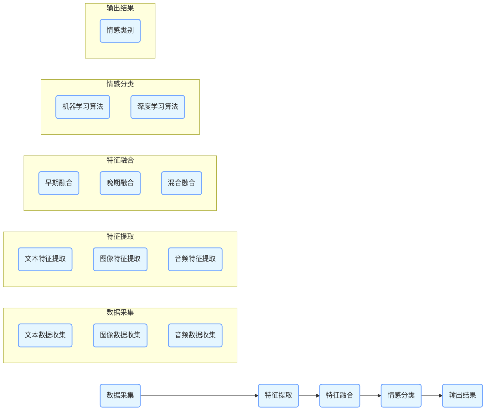

# AI Agent的多模态情感分析系统

> 关键词：AI Agent、多模态情感分析、自然语言处理、计算机视觉、音频处理

> 摘要：本文围绕AI Agent的多模态情感分析系统展开，详细介绍了该系统的背景知识、核心概念、算法原理、数学模型、实际案例、应用场景等内容。多模态情感分析结合了文本、图像、音频等多种信息源，能更准确地识别情感。文章旨在帮助读者全面了解该系统的原理和应用，为相关领域的研究和开发提供有价值的参考。

## 1. 背景介绍 
### 1.1 目的和范围
随着人工智能技术的不断发展，人们对于情感分析的需求越来越高。传统的单模态情感分析仅基于文本信息，存在一定的局限性。多模态情感分析系统结合了文本、图像、音频等多种模态的信息，能够更全面、准确地识别和理解人类的情感状态。本文章的目的是深入探讨AI Agent的多模态情感分析系统的原理、实现方法和应用场景，为相关领域的研究和开发提供理论支持和实践指导。

本文的范围涵盖了多模态情感分析系统的各个方面，包括核心概念、算法原理、数学模型、实际案例、应用场景等。同时，还会介绍相关的工具和资源，以及该领域的未来发展趋势和挑战。

### 1.2 预期读者
本文的预期读者包括但不限于以下几类人群：
- 人工智能领域的研究人员和开发者，希望了解多模态情感分析系统的最新技术和发展趋势。
- 计算机科学、信息工程等相关专业的学生，作为学习和研究的参考资料。
- 对情感分析技术感兴趣的企业和机构，了解该技术在实际应用中的价值和潜力。
- 从事人机交互、智能客服等领域的从业人员，探索如何利用多模态情感分析技术提升服务质量和用户体验。

### 1.3 文档结构概述
本文的结构如下：
- 背景介绍：介绍多模态情感分析系统的目的、范围、预期读者和文档结构。
- 核心概念与联系：阐述多模态情感分析的核心概念，包括不同模态的信息表示和融合方式，并通过文本示意图和Mermaid流程图展示其架构。
- 核心算法原理 & 具体操作步骤：详细讲解多模态情感分析的核心算法，并用Python源代码进行说明。
- 数学模型和公式 & 详细讲解 & 举例说明：介绍多模态情感分析中涉及的数学模型和公式，并通过具体例子进行解释。
- 项目实战：代码实际案例和详细解释说明：通过一个实际项目，展示多模态情感分析系统的开发过程，包括开发环境搭建、源代码实现和代码解读。
- 实际应用场景：介绍多模态情感分析系统在不同领域的实际应用场景。
- 工具和资源推荐：推荐学习多模态情感分析的相关资源，包括书籍、在线课程、技术博客、开发工具和框架，以及相关的论文著作。
- 总结：未来发展趋势与挑战：总结多模态情感分析系统的发展趋势和面临的挑战。
- 附录：常见问题与解答：解答读者在学习和实践过程中可能遇到的常见问题。
- 扩展阅读 & 参考资料：提供相关的扩展阅读材料和参考资料。

### 1.4 术语表
#### 1.4.1 核心术语定义
- **AI Agent**：人工智能代理，是一种能够感知环境、自主决策并采取行动的智能实体。
- **多模态情感分析**：结合文本、图像、音频等多种模态的信息，对人类的情感状态进行识别和分析的技术。
- **模态**：指信息的表现形式，如文本、图像、音频等。
- **特征提取**：从原始数据中提取出能够代表数据特征的信息。
- **特征融合**：将不同模态的特征进行合并，以便进行统一的分析和处理。
- **情感分类**：将情感状态划分为不同的类别，如积极、消极、中性等。

#### 1.4.2 相关概念解释
- **深度学习**：一种基于神经网络的机器学习方法，能够自动从大量数据中学习特征和模式。
- **自然语言处理（NLP）**：研究如何让计算机理解和处理人类语言的技术。
- **计算机视觉**：研究如何让计算机理解和处理图像和视频的技术。
- **音频处理**：研究如何对音频信号进行采集、处理和分析的技术。

#### 1.4.3 缩略词列表
- **CNN**：卷积神经网络（Convolutional Neural Network）
- **RNN**：循环神经网络（Recurrent Neural Network）
- **LSTM**：长短期记忆网络（Long Short-Term Memory）
- **GRU**：门控循环单元（Gated Recurrent Unit）
- **NLP**：自然语言处理（Natural Language Processing）
- **CV**：计算机视觉（Computer Vision）
- **MFCC**：梅尔频率倒谱系数（Mel-Frequency Cepstral Coefficients）

## 2. 核心概念与联系 

### 2.1 核心概念原理
多模态情感分析系统的核心原理是结合多种模态的信息来更准确地识别和理解人类的情感状态。不同模态的信息包含了不同方面的情感线索，例如：
- **文本模态**：通过分析文本中的词汇、语法和语义信息，可以了解说话者的意图和情感倾向。例如，使用积极的词汇（如“开心”、“兴奋”）通常表示积极的情感，而消极的词汇（如“难过”、“愤怒”）则表示消极的情感。
- **图像模态**：图像中的面部表情、肢体语言等可以传达丰富的情感信息。例如，微笑的面部表情通常表示积极的情感，而皱眉、流泪等则可能表示消极的情感。
- **音频模态**：音频的语调、语速、音量等特征可以反映说话者的情感状态。例如，高亢、快速的语调可能表示兴奋或愤怒，而低沉、缓慢的语调则可能表示悲伤或沮丧。

多模态情感分析系统的工作流程通常包括以下几个步骤：
1. **数据采集**：收集不同模态的情感数据，如文本、图像、音频等。
2. **特征提取**：从原始数据中提取出能够代表数据特征的信息。不同模态的数据需要使用不同的特征提取方法，例如文本数据可以使用词向量、TF-IDF等方法，图像数据可以使用卷积神经网络提取特征，音频数据可以使用MFCC等方法。
3. **特征融合**：将不同模态的特征进行合并，以便进行统一的分析和处理。特征融合的方法有很多种，例如早期融合、晚期融合、混合融合等。
4. **情感分类**：使用机器学习或深度学习算法对融合后的特征进行分类，将情感状态划分为不同的类别，如积极、消极、中性等。

### 2.2 架构的文本示意图
```plaintext
多模态情感分析系统架构

|-----------------------|
|        数据采集       |
|-----------------------|
| - 文本数据收集        |
| - 图像数据收集        |
| - 音频数据收集        |
|-----------------------|
|        特征提取       |
|-----------------------|
| - 文本特征提取（词向量、TF-IDF等） |
| - 图像特征提取（CNN等）         |
| - 音频特征提取（MFCC等）        |
|-----------------------|
|        特征融合       |
|-----------------------|
| - 早期融合           |
| - 晚期融合           |
| - 混合融合           |
|-----------------------|
|        情感分类       |
|-----------------------|
| - 机器学习算法（SVM、决策树等） |
| - 深度学习算法（神经网络等）   |
|-----------------------|
|        输出结果       |
|-----------------------|
| - 情感类别（积极、消极、中性等） |
|-----------------------|
```

### 2.3 Mermaid流程图


## 3. 核心算法原理 & 具体操作步骤 

### 3.1 特征提取算法
#### 3.1.1 文本特征提取
在文本特征提取中，我们可以使用词向量来表示文本。词向量是一种将单词映射到低维向量空间的技术，使得语义相似的单词在向量空间中距离较近。以下是使用Python和`gensim`库进行词向量训练和特征提取的示例代码：
```python
from gensim.models import Word2Vec
import numpy as np

# 示例文本数据
sentences = [['this', 'is', 'a', 'sample'], ['another', 'sample', 'sentence']]

# 训练Word2Vec模型
model = Word2Vec(sentences, min_count=1)

# 提取文本特征
def get_text_features(text):
    feature_vector = np.zeros(model.vector_size)
    word_count = 0
    for word in text:
        if word in model.wv:
            feature_vector += model.wv[word]
            word_count += 1
    if word_count > 0:
        feature_vector /= word_count
    return feature_vector

# 示例文本
text = ['this', 'is', 'a', 'test']
text_feature = get_text_features(text)
print("文本特征向量:", text_feature)
```
#### 3.1.2 图像特征提取
对于图像特征提取，我们可以使用预训练的卷积神经网络（CNN），如ResNet。以下是使用Python和`torchvision`库进行图像特征提取的示例代码：
```python
import torch
import torchvision.models as models
import torchvision.transforms as transforms
from PIL import Image

# 加载预训练的ResNet模型
model = models.resnet18(pretrained=True)
model.eval()

# 定义图像预处理
preprocess = transforms.Compose([
    transforms.Resize(256),
    transforms.CenterCrop(224),
    transforms.ToTensor(),
    transforms.Normalize(mean=[0.485, 0.456, 0.406], std=[0.229, 0.224, 0.225])
])

# 加载图像
image = Image.open('example.jpg')
input_tensor = preprocess(image)
input_batch = input_tensor.unsqueeze(0)

# 提取图像特征
with torch.no_grad():
    features = model(input_batch)
    features = features.squeeze().numpy()

print("图像特征向量:", features)
```
#### 3.1.3 音频特征提取
在音频特征提取中，我们可以使用梅尔频率倒谱系数（MFCC）。以下是使用Python和`librosa`库进行音频特征提取的示例代码：
```python
import librosa
import numpy as np

# 加载音频文件
audio_file = 'example.wav'
y, sr = librosa.load(audio_file)

# 提取MFCC特征
mfccs = librosa.feature.mfcc(y=y, sr=sr, n_mfcc=13)

# 计算MFCC特征的均值作为音频特征
audio_feature = np.mean(mfccs, axis=1)

print("音频特征向量:", audio_feature)
```

### 3.2 特征融合算法
#### 3.2.1 早期融合
早期融合是在特征提取阶段将不同模态的特征进行合并。以下是一个简单的早期融合示例代码：
```python
# 假设已经提取了文本、图像和音频特征
text_feature = np.random.rand(100)
image_feature = np.random.rand(200)
audio_feature = np.random.rand(50)

# 早期融合
early_fusion_feature = np.concatenate((text_feature, image_feature, audio_feature))

print("早期融合特征向量:", early_fusion_feature)
```
#### 3.2.2 晚期融合
晚期融合是在情感分类阶段将不同模态的分类结果进行合并。以下是一个简单的晚期融合示例代码：
```python
from sklearn.linear_model import LogisticRegression
import numpy as np

# 假设已经训练了文本、图像和音频的分类器
text_clf = LogisticRegression()
image_clf = LogisticRegression()
audio_clf = LogisticRegression()

# 生成示例数据
X_text = np.random.rand(100, 10)
y_text = np.random.randint(0, 2, 100)
X_image = np.random.rand(100, 20)
y_image = np.random.randint(0, 2, 100)
X_audio = np.random.rand(100, 5)
y_audio = np.random.randint(0, 2, 100)

# 训练分类器
text_clf.fit(X_text, y_text)
image_clf.fit(X_image, y_image)
audio_clf.fit(X_audio, y_audio)

# 预测分类结果
text_pred = text_clf.predict_proba(X_text)
image_pred = image_clf.predict_proba(X_image)
audio_pred = audio_clf.predict_proba(X_audio)

# 晚期融合（简单平均）
late_fusion_pred = (text_pred + image_pred + audio_pred) / 3
final_pred = np.argmax(late_fusion_pred, axis=1)

print("晚期融合分类结果:", final_pred)
```

### 3.3 情感分类算法
我们可以使用深度学习模型，如多层感知机（MLP）进行情感分类。以下是一个使用Python和`torch`库实现的MLP情感分类示例代码：
```python
import torch
import torch.nn as nn
import torch.optim as optim
from torch.utils.data import TensorDataset, DataLoader

# 生成示例数据
X = torch.randn(100, 350)  # 假设融合后的特征维度为350
y = torch.randint(0, 2, (100,))

# 创建数据集和数据加载器
dataset = TensorDataset(X, y)
dataloader = DataLoader(dataset, batch_size=10, shuffle=True)

# 定义MLP模型
class MLP(nn.Module):
    def __init__(self):
        super(MLP, self).__init__()
        self.fc1 = nn.Linear(350, 128)
        self.relu = nn.ReLU()
        self.fc2 = nn.Linear(128, 2)

    def forward(self, x):
        out = self.fc1(x)
        out = self.relu(out)
        out = self.fc2(out)
        return out

# 初始化模型、损失函数和优化器
model = MLP()
criterion = nn.CrossEntropyLoss()
optimizer = optim.Adam(model.parameters(), lr=0.001)

# 训练模型
num_epochs = 10
for epoch in range(num_epochs):
    for inputs, labels in dataloader:
        optimizer.zero_grad()
        outputs = model(inputs)
        loss = criterion(outputs, labels)
        loss.backward()
        optimizer.step()
    print(f'Epoch {epoch+1}/{num_epochs}, Loss: {loss.item()}')

# 预测
test_input = torch.randn(1, 350)
with torch.no_grad():
    test_output = model(test_input)
    predicted = torch.argmax(test_output, dim=1)
    print("预测结果:", predicted.item())
```

## 4. 数学模型和公式 & 详细讲解 & 举例说明 

### 4.1 词向量模型
#### 4.1.1 Word2Vec原理
Word2Vec是一种常用的词向量模型，它基于神经网络来学习单词的向量表示。Word2Vec有两种主要的训练方法：连续词袋模型（CBOW）和跳字模型（Skip-gram）。

**连续词袋模型（CBOW）**
CBOW模型的目标是根据上下文单词预测当前单词。假设我们有一个上下文窗口大小为 $C$，当前单词为 $w_t$，上下文单词为 $w_{t - C}, \cdots, w_{t - 1}, w_{t + 1}, \cdots, w_{t + C}$。CBOW模型的数学公式如下：

1. 首先，将上下文单词的词向量相加求平均：
$$\mathbf{h} = \frac{1}{2C} \sum_{i = -C, i \neq 0}^{C} \mathbf{v}_{w_{t + i}}$$
其中，$\mathbf{v}_{w_{t + i}}$ 是上下文单词 $w_{t + i}$ 的词向量。

2. 然后，通过一个线性变换和softmax函数计算预测单词的概率分布：
$$P(w_j | \mathbf{h}) = \frac{\exp(\mathbf{u}_{w_j}^T \mathbf{h})}{\sum_{k = 1}^{V} \exp(\mathbf{u}_{w_k}^T \mathbf{h})}$$
其中，$\mathbf{u}_{w_j}$ 是单词 $w_j$ 的输出向量，$V$ 是词汇表的大小。

3. 最后，通过最大化似然函数来训练模型：
$$L = \prod_{t = 1}^{T} P(w_t | w_{t - C}, \cdots, w_{t - 1}, w_{t + 1}, \cdots, w_{t + C})$$

**跳字模型（Skip-gram）**
Skip-gram模型的目标是根据当前单词预测上下文单词。假设当前单词为 $w_t$，上下文单词为 $w_{t - C}, \cdots, w_{t - 1}, w_{t + 1}, \cdots, w_{t + C}$。Skip-gram模型的数学公式如下：

1. 首先，将当前单词的词向量表示为 $\mathbf{v}_{w_t}$。

2. 然后，通过一个线性变换和softmax函数计算预测上下文单词的概率分布：
$$P(w_j | \mathbf{v}_{w_t}) = \frac{\exp(\mathbf{u}_{w_j}^T \mathbf{v}_{w_t})}{\sum_{k = 1}^{V} \exp(\mathbf{u}_{w_k}^T \mathbf{v}_{w_t})}$$

3. 最后，通过最大化似然函数来训练模型：
$$L = \prod_{t = 1}^{T} \prod_{i = -C, i \neq 0}^{C} P(w_{t + i} | w_t)$$

#### 4.1.2 举例说明
假设我们有一个简单的文本语料库：["the", "dog", "runs", "fast"]，上下文窗口大小 $C = 1$。

对于CBOW模型，当预测单词 "dog" 时，上下文单词为 "the" 和 "runs"。我们首先将 "the" 和 "runs" 的词向量相加求平均得到 $\mathbf{h}$，然后通过softmax函数计算预测 "dog" 的概率。

对于Skip-gram模型，当以 "dog" 为中心词时，我们要预测上下文单词 "the" 和 "runs"。我们将 "dog" 的词向量输入到模型中，通过softmax函数计算预测 "the" 和 "runs" 的概率。

### 4.2 卷积神经网络（CNN）
#### 4.2.1 CNN原理
卷积神经网络（CNN）是一种专门用于处理具有网格结构数据（如图像）的深度学习模型。CNN的核心操作包括卷积层、池化层和全连接层。

**卷积层**
卷积层通过卷积核在输入数据上滑动进行卷积操作，提取局部特征。假设输入数据为 $X \in \mathbb{R}^{H \times W \times C}$，其中 $H$ 是高度，$W$ 是宽度，$C$ 是通道数。卷积核为 $K \in \mathbb{R}^{h \times w \times C}$，其中 $h$ 和 $w$ 是卷积核的高度和宽度。卷积操作的数学公式如下：
$$Y_{i, j, k} = \sum_{m = 0}^{h - 1} \sum_{n = 0}^{w - 1} \sum_{l = 0}^{C - 1} K_{m, n, l} \cdot X_{i + m, j + n, l} + b_k$$
其中，$Y_{i, j, k}$ 是输出特征图的第 $(i, j)$ 位置的第 $k$ 个通道的值，$b_k$ 是偏置项。

**池化层**
池化层用于降低特征图的维度，减少计算量。常见的池化操作有最大池化和平均池化。以最大池化为例，假设池化窗口大小为 $p \times p$，步长为 $s$。最大池化操作的数学公式如下：
$$Y_{i, j, k} = \max_{m = 0}^{p - 1} \max_{n = 0}^{p - 1} X_{i \cdot s + m, j \cdot s + n, k}$$

**全连接层**
全连接层将卷积层和池化层提取的特征进行整合，用于分类或回归任务。全连接层的数学公式如下：
$$\mathbf{y} = \mathbf{W} \mathbf{x} + \mathbf{b}$$
其中，$\mathbf{x}$ 是输入向量，$\mathbf{W}$ 是权重矩阵，$\mathbf{b}$ 是偏置向量，$\mathbf{y}$ 是输出向量。

#### 4.2.2 举例说明
假设我们有一个输入图像 $X$ 大小为 $28 \times 28 \times 1$（灰度图像），使用一个 $3 \times 3$ 的卷积核进行卷积操作，步长为 1，填充为 0。卷积核的数量为 16。经过卷积层后，输出特征图的大小为 $(28 - 3 + 1) \times (28 - 3 + 1) \times 16 = 26 \times 26 \times 16$。

然后，我们使用一个 $2 \times 2$ 的最大池化层，步长为 2。经过池化层后，输出特征图的大小为 $(26 \div 2) \times (26 \div 2) \times 16 = 13 \times 13 \times 16$。

最后，将池化层的输出展平为一维向量，输入到全连接层进行分类。

### 4.3 梅尔频率倒谱系数（MFCC）
#### 4.3.1 MFCC原理
梅尔频率倒谱系数（MFCC）是一种广泛用于音频特征提取的方法。MFCC的计算步骤如下：

1. **预加重**：对音频信号进行预加重，增强高频部分的能量。预加重的公式如下：
$$y(n) = x(n) - \alpha x(n - 1)$$
其中，$x(n)$ 是原始音频信号，$y(n)$ 是预加重后的音频信号，$\alpha$ 是预加重系数，通常取 0.97。

2. **分帧**：将预加重后的音频信号分成若干帧，每帧的长度通常为 20 - 40 毫秒。

3. **加窗**：对每帧音频信号加窗，减少频谱泄漏。常用的窗函数有汉明窗。

4. **快速傅里叶变换（FFT）**：对加窗后的每帧音频信号进行FFT，得到频谱。

5. **梅尔滤波**：将频谱转换到梅尔频率尺度上，通过一组梅尔滤波器组进行滤波。梅尔频率和线性频率的转换公式如下：
$$m = 2595 \log_{10}(1 + \frac{f}{700})$$
其中，$m$ 是梅尔频率，$f$ 是线性频率。

6. **对数运算**：对滤波后的频谱取对数。

7. **离散余弦变换（DCT）**：对取对数后的频谱进行DCT，得到MFCC系数。

#### 4.3.2 举例说明
假设我们有一个音频信号，采样率为 16000 Hz，时长为 1 秒。我们将音频信号分帧，每帧长度为 25 毫秒，帧移为 10 毫秒。经过预加重、加窗、FFT、梅尔滤波、对数运算和DCT后，得到一组MFCC系数。这些系数可以作为音频特征用于情感分析。

### 4.4 多层感知机（MLP）
#### 4.4.1 MLP原理
多层感知机（MLP）是一种基本的神经网络模型，由输入层、隐藏层和输出层组成。假设输入层有 $n$ 个神经元，隐藏层有 $m$ 个神经元，输出层有 $k$ 个神经元。MLP的数学公式如下：

1. **隐藏层计算**：
$$\mathbf{h} = f(\mathbf{W}_1 \mathbf{x} + \mathbf{b}_1)$$
其中，$\mathbf{x}$ 是输入向量，$\mathbf{W}_1$ 是输入层到隐藏层的权重矩阵，$\mathbf{b}_1$ 是隐藏层的偏置向量，$f$ 是激活函数，如ReLU、Sigmoid等。

2. **输出层计算**：
$$\mathbf{y} = g(\mathbf{W}_2 \mathbf{h} + \mathbf{b}_2)$$
其中，$\mathbf{W}_2$ 是隐藏层到输出层的权重矩阵，$\mathbf{b}_2$ 是输出层的偏置向量，$g$ 是激活函数，如Softmax函数用于分类任务。

#### 4.4.2 举例说明
假设我们有一个二分类问题，输入向量 $\mathbf{x}$ 的维度为 10，隐藏层有 20 个神经元，输出层有 2 个神经元。我们将输入向量 $\mathbf{x}$ 输入到MLP中，经过隐藏层的计算得到隐藏层输出 $\mathbf{h}$，再经过输出层的计算得到输出向量 $\mathbf{y}$。通过Softmax函数将 $\mathbf{y}$ 转换为概率分布，选择概率最大的类别作为预测结果。

## 5. 项目实战：代码实际案例和详细解释说明 

### 5.1  开发环境搭建
#### 5.1.1 安装Python
首先，确保你已经安装了Python 3.x版本。你可以从Python官方网站（https://www.python.org/downloads/）下载并安装适合你操作系统的Python版本。

#### 5.1.2 创建虚拟环境
为了避免不同项目之间的依赖冲突，建议使用虚拟环境。在命令行中执行以下命令创建并激活虚拟环境：
```bash
# 创建虚拟环境
python -m venv myenv

# 激活虚拟环境（Windows）
myenv\Scripts\activate

# 激活虚拟环境（Linux/Mac）
source myenv/bin/activate
```

#### 5.1.3 安装依赖库
在虚拟环境中，使用`pip`安装项目所需的依赖库：
```bash
pip install gensim torch torchvision librosa scikit-learn
```

### 5.2  源代码详细实现和代码解读
#### 5.2.1 数据准备
假设我们有一个包含文本、图像和音频数据的数据集，我们需要对数据进行预处理和加载。以下是一个简单的数据加载示例代码：
```python
import os
import numpy as np
from PIL import Image
import librosa

# 文本数据加载
def load_text_data(text_dir):
    text_files = os.listdir(text_dir)
    texts = []
    for file in text_files:
        with open(os.path.join(text_dir, file), 'r', encoding='utf-8') as f:
            text = f.read().split()
            texts.append(text)
    return texts

# 图像数据加载
def load_image_data(image_dir):
    image_files = os.listdir(image_dir)
    images = []
    for file in image_files:
        image = Image.open(os.path.join(image_dir, file))
        images.append(image)
    return images

# 音频数据加载
def load_audio_data(audio_dir):
    audio_files = os.listdir(audio_dir)
    audios = []
    for file in audio_files:
        audio, sr = librosa.load(os.path.join(audio_dir, file))
        audios.append(audio)
    return audios

# 加载数据
text_dir = 'data/text'
image_dir = 'data/image'
audio_dir = 'data/audio'

texts = load_text_data(text_dir)
images = load_image_data(image_dir)
audios = load_audio_data(audio_dir)
```
#### 5.2.2 特征提取
使用前面介绍的特征提取方法对文本、图像和音频数据进行特征提取：
```python
from gensim.models import Word2Vec
import torch
import torchvision.models as models
import torchvision.transforms as transforms
import librosa

# 文本特征提取
def get_text_features(texts):
    model = Word2Vec(texts, min_count=1)
    text_features = []
    for text in texts:
        feature_vector = np.zeros(model.vector_size)
        word_count = 0
        for word in text:
            if word in model.wv:
                feature_vector += model.wv[word]
                word_count += 1
        if word_count > 0:
            feature_vector /= word_count
        text_features.append(feature_vector)
    return np.array(text_features)

# 图像特征提取
def get_image_features(images):
    model = models.resnet18(pretrained=True)
    model.eval()
    preprocess = transforms.Compose([
        transforms.Resize(256),
        transforms.CenterCrop(224),
        transforms.ToTensor(),
        transforms.Normalize(mean=[0.485, 0.456, 0.406], std=[0.229, 0.224, 0.225])
    ])
    image_features = []
    for image in images:
        input_tensor = preprocess(image)
        input_batch = input_tensor.unsqueeze(0)
        with torch.no_grad():
            features = model(input_batch)
            features = features.squeeze().numpy()
        image_features.append(features)
    return np.array(image_features)

# 音频特征提取
def get_audio_features(audios):
    audio_features = []
    for audio in audios:
        mfccs = librosa.feature.mfcc(y=audio, sr=16000, n_mfcc=13)
        audio_feature = np.mean(mfccs, axis=1)
        audio_features.append(audio_feature)
    return np.array(audio_features)

# 提取特征
text_features = get_text_features(texts)
image_features = get_image_features(images)
audio_features = get_audio_features(audios)
```
#### 5.2.3 特征融合
使用早期融合方法将不同模态的特征进行融合：
```python
# 早期融合
def early_fusion(text_features, image_features, audio_features):
    fused_features = np.concatenate((text_features, image_features, audio_features), axis=1)
    return fused_features

fused_features = early_fusion(text_features, image_features, audio_features)
```
#### 5.2.4 情感分类
使用多层感知机（MLP）进行情感分类：
```python
import torch
import torch.nn as nn
import torch.optim as optim
from torch.utils.data import TensorDataset, DataLoader

# 假设我们有对应的标签
labels = np.random.randint(0, 2, len(fused_features))

# 创建数据集和数据加载器
X = torch.tensor(fused_features, dtype=torch.float32)
y = torch.tensor(labels, dtype=torch.long)
dataset = TensorDataset(X, y)
dataloader = DataLoader(dataset, batch_size=10, shuffle=True)

# 定义MLP模型
class MLP(nn.Module):
    def __init__(self):
        super(MLP, self).__init__()
        input_size = fused_features.shape[1]
        self.fc1 = nn.Linear(input_size, 128)
        self.relu = nn.ReLU()
        self.fc2 = nn.Linear(128, 2)

    def forward(self, x):
        out = self.fc1(x)
        out = self.relu(out)
        out = self.fc2(out)
        return out

# 初始化模型、损失函数和优化器
model = MLP()
criterion = nn.CrossEntropyLoss()
optimizer = optim.Adam(model.parameters(), lr=0.001)

# 训练模型
num_epochs = 10
for epoch in range(num_epochs):
    for inputs, labels in dataloader:
        optimizer.zero_grad()
        outputs = model(inputs)
        loss = criterion(outputs, labels)
        loss.backward()
        optimizer.step()
    print(f'Epoch {epoch+1}/{num_epochs}, Loss: {loss.item()}')

# 预测
test_input = torch.tensor(fused_features[:1], dtype=torch.float32)
with torch.no_grad():
    test_output = model(test_input)
    predicted = torch.argmax(test_output, dim=1)
    print("预测结果:", predicted.item())
```

### 5.3  代码解读与分析
#### 5.3.1 数据准备部分
- `load_text_data` 函数用于加载文本数据，将每个文本文件的内容按单词分割并存储在列表中。
- `load_image_data` 函数用于加载图像数据，使用`PIL`库打开图像文件。
- `load_audio_data` 函数用于加载音频数据，使用`librosa`库读取音频文件。

#### 5.3.2 特征提取部分
- `get_text_features` 函数使用`Word2Vec`模型训练词向量，并计算每个文本的平均词向量作为文本特征。
- `get_image_features` 函数使用预训练的`ResNet18`模型提取图像特征。
- `get_audio_features` 函数使用`librosa`库提取音频的MFCC特征，并计算均值作为音频特征。

#### 5.3.3 特征融合部分
- `early_fusion` 函数将文本、图像和音频特征按列拼接，实现早期融合。

#### 5.3.4 情感分类部分
- 定义了一个简单的MLP模型，包含一个输入层、一个隐藏层和一个输出层。
- 使用`CrossEntropyLoss`作为损失函数，`Adam`作为优化器进行模型训练。
- 最后对测试数据进行预测，输出预测结果。

## 6. 实际应用场景 
### 6.1 智能客服
在智能客服系统中，多模态情感分析可以帮助客服更好地理解用户的情感状态。通过分析用户的文本咨询、语音语调以及面部表情（如果有视频交互），智能客服可以更准确地判断用户的满意度和需求，提供更个性化的服务。例如，如果用户在语音中表现出愤怒或不满，客服可以及时调整沟通策略，采取安抚措施，提高用户满意度。

### 6.2 市场调研
在市场调研中，多模态情感分析可以用于分析消费者对产品或服务的反馈。通过收集消费者的文本评论、视频评价和音频反馈，分析其中的情感倾向，可以了解消费者的喜好和不满，为产品改进和市场推广提供有价值的参考。例如，分析消费者在社交媒体上发布的产品评测视频，了解他们对产品外观、性能等方面的情感态度。

### 6.3 教育领域
在教育领域，多模态情感分析可以用于评估学生的学习状态和情绪。通过分析学生的课堂表现视频、语音回答问题的语调以及书面作业中的文本表达，教师可以了解学生的学习积极性、困惑和压力，及时调整教学方法和提供个性化的辅导。例如，当发现学生在视频中表现出沮丧或困惑的表情时，教师可以主动与学生沟通，帮助他们解决问题。

### 6.4 心理健康监测
多模态情感分析可以用于心理健康监测。通过收集个体的文本日记、语音记录和面部表情视频，分析其中的情感变化，可以及时发现潜在的心理健康问题。例如，长期表现出消极情感的个体可能存在抑郁倾向，系统可以及时提醒专业人员进行干预。

### 6.5 娱乐产业
在娱乐产业中，多模态情感分析可以用于评估观众对电影、音乐、游戏等娱乐产品的反馈。通过分析观众的社交媒体评论、观影时的面部表情和语音反应，了解他们的情感体验，为娱乐产品的制作和推广提供参考。例如，电影制作公司可以根据观众的情感反馈对电影进行剪辑和宣传策略的调整。

## 7. 工具和资源推荐
### 7.1 学习资源推荐
#### 7.1.1 书籍推荐
- 《深度学习》（Deep Learning）：由Ian Goodfellow、Yoshua Bengio和Aaron Courville撰写，是深度学习领域的经典教材，涵盖了神经网络、卷积神经网络、循环神经网络等内容。
- 《自然语言处理入门》：作者何晗，适合初学者了解自然语言处理的基本概念和方法。
- 《计算机视觉：算法与应用》（Computer Vision: Algorithms and Applications）：Richard Szeliski所著，介绍了计算机视觉的各种算法和应用。
- 《音频信号处理与合成的MATLAB实现》：帮助读者了解音频处理的基本原理和方法，以及如何使用MATLAB进行实现。

#### 7.1.2 在线课程
- Coursera上的“深度学习专项课程”（Deep Learning Specialization）：由Andrew Ng教授授课，包括神经网络和深度学习、改善深层神经网络、结构化机器学习项目、卷积神经网络、序列模型等课程。
- edX上的“自然语言处理基础”（Foundations of Natural Language Processing）：介绍自然语言处理的基本概念和技术。
- Udemy上的“计算机视觉实战：从基础到高级”（Computer Vision A-Z™: Hands-On Computer Vision with Python）：通过实际项目帮助学习者掌握计算机视觉技术。
- 网易云课堂上的“音频处理与分析”课程：讲解音频处理的基本理论和实践方法。

#### 7.1.3 技术博客和网站
- Medium：有许多关于人工智能、深度学习、自然语言处理等领域的优秀博客文章。
- Towards Data Science：专注于数据科学和机器学习领域的技术分享和讨论。
- arXiv：提供大量的学术论文预印本，涵盖了人工智能的各个领域。
- AI开源社区：如GitHub、GitLab等，有许多开源的多模态情感分析项目和代码可供学习和参考。

### 7.2 开发工具框架推荐
#### 7.2.1 IDE和编辑器
- PyCharm：是一款专门为Python开发设计的集成开发环境（IDE），具有代码自动补全、调试、版本控制等功能。
- Jupyter Notebook：一个交互式的开发环境，适合进行数据探索、模型训练和可视化。
- Visual Studio Code：一款轻量级的代码编辑器，支持多种编程语言和插件扩展，可用于Python开发。

#### 7.2.2 调试和性能分析工具
- TensorBoard：是TensorFlow的可视化工具，可用于监控模型训练过程中的损失函数、准确率等指标，以及可视化模型的结构和参数。
- PyTorch Profiler：PyTorch提供的性能分析工具，可帮助开发者找出代码中的性能瓶颈。
- cProfile：Python标准库中的性能分析模块，可用于分析Python代码的运行时间和函数调用情况。

#### 7.2.3 相关框架和库
- PyTorch：一个开源的深度学习框架，具有动态图机制，易于使用和调试，广泛应用于自然语言处理、计算机视觉等领域。
- TensorFlow：另一个流行的深度学习框架，提供了丰富的工具和模型库，支持分布式训练。
- scikit-learn：一个简单易用的机器学习库，提供了各种机器学习算法和工具，可用于数据预处理、模型选择和评估等。
- OpenCV：一个开源的计算机视觉库，提供了各种图像处理和计算机视觉算法，可用于图像特征提取、目标检测等任务。
- librosa：一个用于音频处理和分析的Python库，可用于音频特征提取、音频分类等任务。

### 7.3 相关论文著作推荐
#### 7.3.1 经典论文
- "Efficient Estimation of Word Representations in Vector Space"：介绍了Word2Vec模型的原理和训练方法。
- "ImageNet Classification with Deep Convolutional Neural Networks"：提出了AlexNet卷积神经网络，开启了深度学习在计算机视觉领域的热潮。
- "Long Short-Term Memory"：介绍了长短期记忆网络（LSTM）的原理和应用。
- "Attention Is All You Need"：提出了Transformer模型，在自然语言处理领域取得了巨大成功。

#### 7.3.2 最新研究成果
- 关注顶级学术会议，如NeurIPS（神经信息处理系统大会）、ICML（国际机器学习会议）、ACL（计算语言学协会年会）、CVPR（计算机视觉与模式识别会议）等，这些会议上会发布多模态情感分析领域的最新研究成果。
- 查阅相关的学术期刊，如Journal of Artificial Intelligence Research（JAIR）、Artificial Intelligence、IEEE Transactions on Pattern Analysis and Machine Intelligence等。

#### 7.3.3 应用案例分析
- 一些知名企业和研究机构会发布多模态情感分析在实际应用中的案例分析报告，如Google、Microsoft、IBM等公司的技术博客和研究报告。
- 可以在学术数据库中搜索相关的应用案例研究论文，了解多模态情感分析在不同领域的具体应用和效果评估。

## 8. 总结：未来发展趋势与挑战
### 8.1 未来发展趋势
#### 8.1.1 多模态融合技术的改进
未来，多模态情感分析系统将不断改进多模态融合技术，以更有效地整合不同模态的信息。例如，采用更复杂的深度学习架构，如多模态Transformer，来捕捉不同模态之间的深层次关联。同时，研究人员也会探索新的特征融合方法，提高情感分析的准确性和可靠性。

#### 8.1.2 跨领域应用的拓展
多模态情感分析技术将在更多领域得到应用，如智能家居、智能交通、医疗保健等。在智能家居中，通过分析用户的语音、表情和行为，实现更智能的家居控制和个性化服务；在智能交通中，监测驾驶员的情感状态，提高交通安全。随着技术的不断发展，多模态情感分析将为各个领域带来更多的创新和变革。

#### 8.1.3 与其他技术的融合
多模态情感分析将与其他技术，如虚拟现实（VR）、增强现实（AR）、物联网（IoT）等进行融合。例如，在VR/AR场景中，通过多模态情感分析技术，实时感知用户的情感状态，提供更加沉浸式和个性化的体验；在物联网环境中，结合传感器数据和多模态情感分析，实现对环境和用户状态的更全面监测和管理。

#### 8.1.4 情感理解的深入
未来的多模态情感分析系统将不仅仅局限于情感分类，还将深入理解情感的语义和上下文。例如，能够识别不同情感的强度、情感的变化趋势以及情感背后的原因。这将有助于实现更智能的人机交互和情感交流。

### 8.2 挑战
#### 8.2.1 数据获取和标注的困难
多模态情感分析需要大量的标注数据来训练模型，但数据的获取和标注是一个具有挑战性的任务。不同模态的数据采集需要不同的设备