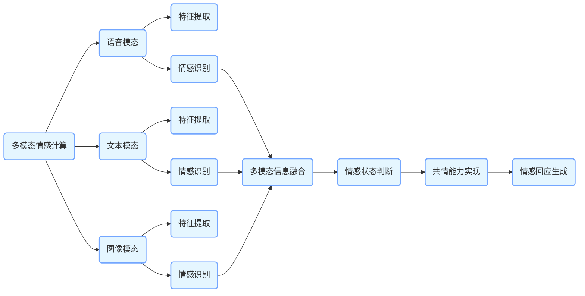

# AI Agent的多模态情感计算与共情能力

> 关键词：AI Agent、多模态情感计算、共情能力、情感识别、情感交互

> 摘要：本文聚焦于AI Agent的多模态情感计算与共情能力。随着人工智能技术的不断发展，使AI Agent具备理解和回应人类情感的能力变得愈发重要。多模态情感计算通过融合多种信息源，如语音、文本、图像等，能更准确地捕捉人类情感状态，而共情能力则让AI Agent能更好地与人类进行情感交互。文章将深入探讨相关核心概念、算法原理、数学模型，通过项目实战展示具体实现，并分析实际应用场景，最后对未来发展趋势与挑战进行总结。

## 1. 背景介绍 
### 1.1 目的和范围
本文章的目的在于全面且深入地剖析AI Agent的多模态情感计算与共情能力。范围涵盖了从基本概念的阐释、算法原理的讲解、数学模型的推导，到实际项目的实现与应用场景的分析，以及对未来发展趋势和挑战的探讨。旨在为研究人员、开发者和对该领域感兴趣的读者提供一个系统而全面的参考，助力他们更好地理解和应用相关技术。

### 1.2 预期读者
本文的预期读者包括但不限于人工智能领域的研究人员、软件开发者、计算机科学专业的学生、对情感计算和AI Agent感兴趣的爱好者等。无论是想要深入研究该领域的专业人士，还是初步接触相关知识的初学者，都能从本文中获取有价值的信息。

### 1.3 文档结构概述
本文按照逻辑结构依次展开。首先介绍背景信息，让读者对文章的目的、读者对象和整体结构有初步了解。接着阐述核心概念与联系，明确多模态情感计算和共情能力的内涵及相互关系。然后讲解核心算法原理和具体操作步骤，结合Python代码进行详细说明。随后介绍数学模型和公式，并通过举例加深理解。再通过项目实战展示实际代码案例和详细解释。之后分析实际应用场景，介绍相关工具和资源。最后总结未来发展趋势与挑战，提供常见问题解答和扩展阅读参考资料。

### 1.4 术语表
#### 1.4.1 核心术语定义
- **AI Agent**：即人工智能代理，是一种能够感知环境、进行决策并采取行动以实现特定目标的智能实体。
- **多模态情感计算**：综合利用多种模态（如语音、文本、图像等）的信息来识别和分析人类情感状态的技术。
- **共情能力**：AI Agent理解人类情感并做出适当情感回应的能力，类似于人类之间的情感共鸣。
- **情感识别**：从各种信息源中提取情感特征并判断情感类型（如高兴、悲伤、愤怒等）的过程。
- **情感交互**：AI Agent与人类之间基于情感的交流和互动过程。

#### 1.4.2 相关概念解释
- **模态**：指信息的表现形式，如视觉模态（图像、视频）、听觉模态（语音）、文本模态等。不同模态包含着不同的情感信息线索。
- **特征提取**：从原始数据中提取出具有代表性和区分性的特征，以便后续的情感分析和识别。
- **机器学习模型**：用于处理和分析数据，通过学习大量数据的特征和模式来实现情感识别和共情回应的算法模型。

#### 1.4.3 缩略词列表
- **CNN**：Convolutional Neural Network，卷积神经网络
- **RNN**：Recurrent Neural Network，循环神经网络
- **LSTM**：Long Short - Term Memory，长短期记忆网络
- **SVM**：Support Vector Machine，支持向量机

## 2. 核心概念与联系 

### 2.1 多模态情感计算原理
多模态情感计算的核心在于融合多种模态的信息，以更全面、准确地理解人类的情感状态。人类在表达情感时，往往会通过多种方式同时传达信息，例如在说话时会带有特定的语调、表情和肢体动作。单一模态的信息可能存在局限性，而多模态融合可以弥补这些不足。

例如，文本信息可以提供语义层面的情感线索，如“我今天很开心”直接表达了积极的情感；语音信息中的语调、语速、音量等可以反映出情感的强度和类型，欢快的语调可能表示高兴，低沉缓慢的语调可能表示悲伤；图像信息中的面部表情、肢体姿态等也能直观地体现情感状态，微笑的表情通常表示愉悦。

### 2.2 共情能力原理
共情能力要求AI Agent不仅能够识别人类的情感，还能对这些情感做出适当的回应，让人类感受到被理解和关心。这需要AI Agent具备一定的情感知识和推理能力。

AI Agent可以通过学习大量的情感案例和人类的情感反应模式，建立情感知识库。当识别到人类的某种情感时，AI Agent可以根据知识库中的信息，结合具体的情境，生成合适的回应。例如，当用户表达悲伤时，AI Agent可以给予安慰和鼓励的话语。

### 2.3 多模态情感计算与共情能力的联系
多模态情感计算是实现共情能力的基础。只有准确地识别出人类的情感状态，AI Agent才能做出恰当的共情回应。而共情能力则是多模态情感计算的应用和拓展，它将情感识别的结果转化为有意义的交互行为，增强了AI Agent与人类之间的情感连接。

### 2.4 核心概念架构的文本示意图
```plaintext
            多模态情感计算
           /             |             \
        语音模态       文本模态       图像模态
        /     \        /     \        /     \
    特征提取  情感识别  特征提取  情感识别  特征提取  情感识别
           \             |             /
             多模态信息融合
                    |
              情感状态判断
                    |
              共情能力实现
                    |
              情感回应生成
```

### 2.5 Mermaid流程图


## 3. 核心算法原理 & 具体操作步骤 

### 3.1 语音模态情感识别算法原理
语音模态的情感识别主要基于语音信号的声学特征，如音高、音长、音量、音色等。常用的算法有支持向量机（SVM）和深度学习模型（如卷积神经网络CNN和循环神经网络RNN）。

以SVM为例，其基本原理是在特征空间中找到一个最优的超平面，将不同情感类别的样本分开。具体步骤如下：
1. **特征提取**：从语音信号中提取声学特征，如MFCC（Mel - Frequency Cepstral Coefficients）。
2. **特征选择**：选择对情感识别最有区分性的特征。
3. **训练SVM模型**：使用标注好的语音样本进行训练，调整模型参数以达到最优分类效果。
4. **预测**：对新的语音样本进行特征提取和特征选择，然后使用训练好的SVM模型进行情感分类预测。

以下是使用Python和`librosa`库进行语音特征提取和`sklearn`库进行SVM训练和预测的示例代码：
```python
import librosa
import numpy as np
from sklearn.svm import SVC
from sklearn.model_selection import train_test_split
from sklearn.preprocessing import StandardScaler

# 加载语音文件并提取MFCC特征
def extract_mfcc(file_path):
    audio, sr = librosa.load(file_path)
    mfccs = librosa.feature.mfcc(y=audio, sr=sr, n_mfcc=13)
    mfccs_mean = np.mean(mfccs, axis=1)
    return mfccs_mean

# 准备数据集
file_paths = [...]  # 语音文件路径列表
labels = [...]  # 对应的情感标签列表

features = []
for file_path in file_paths:
    mfccs = extract_mfcc(file_path)
    features.append(mfccs)

X = np.array(features)
y = np.array(labels)

# 划分训练集和测试集
X_train, X_test, y_train, y_test = train_test_split(X, y, test_size=0.2, random_state=42)

# 数据标准化
scaler = StandardScaler()
X_train = scaler.fit_transform(X_train)
X_test = scaler.transform(X_test)

# 训练SVM模型
svm_model = SVC(kernel='rbf')
svm_model.fit(X_train, y_train)

# 预测
y_pred = svm_model.predict(X_test)
```

### 3.2 文本模态情感识别算法原理
文本模态的情感识别主要基于文本的语义信息。常用的算法有基于机器学习的方法（如朴素贝叶斯、逻辑回归）和深度学习方法（如循环神经网络RNN、长短期记忆网络LSTM）。

以LSTM为例，其能够处理序列数据，捕捉文本中的上下文信息。具体步骤如下：
1. **文本预处理**：包括分词、去除停用词、词向量化等。
2. **构建LSTM模型**：定义模型的结构，包括输入层、LSTM层、全连接层等。
3. **训练模型**：使用标注好的文本数据进行训练，调整模型参数。
4. **预测**：对新的文本进行预处理，然后使用训练好的模型进行情感分类预测。

以下是使用Python和`Keras`库实现LSTM文本情感识别的示例代码：
```python
from keras.preprocessing.text import Tokenizer
from keras.preprocessing.sequence import pad_sequences
from keras.models import Sequential
from keras.layers import Embedding, LSTM, Dense
from sklearn.model_selection import train_test_split
import numpy as np

# 文本数据
texts = [...]  # 文本列表
labels = [...]  # 对应的情感标签列表

# 文本预处理
tokenizer = Tokenizer(num_words=10000)
tokenizer.fit_on_texts(texts)
sequences = tokenizer.texts_to_sequences(texts)
max_sequence_length = 100
padded_sequences = pad_sequences(sequences, maxlen=max_sequence_length)

# 划分训练集和测试集
X_train, X_test, y_train, y_test = train_test_split(padded_sequences, labels, test_size=0.2, random_state=42)

# 构建LSTM模型
model = Sequential()
model.add(Embedding(input_dim=10000, output_dim=128, input_length=max_sequence_length))
model.add(LSTM(128))
model.add(Dense(1, activation='sigmoid'))

# 编译模型
model.compile(optimizer='adam', loss='binary_crossentropy', metrics=['accuracy'])

# 训练模型
model.fit(X_train, y_train, epochs=10, batch_size=32, validation_data=(X_test, y_test))

# 预测
y_pred = model.predict(X_test)
```

### 3.3 图像模态情感识别算法原理
图像模态的情感识别主要基于面部表情、肢体动作等视觉信息。常用的算法有卷积神经网络（CNN）。

CNN通过卷积层提取图像的特征，池化层进行降维，全连接层进行分类。具体步骤如下：
1. **图像预处理**：包括图像缩放、归一化等。
2. **构建CNN模型**：定义模型的结构，包括卷积层、池化层、全连接层等。
3. **训练模型**：使用标注好的图像数据进行训练，调整模型参数。
4. **预测**：对新的图像进行预处理，然后使用训练好的模型进行情感分类预测。

以下是使用Python和`TensorFlow`库实现CNN图像情感识别的示例代码：
```python
import tensorflow as tf
from tensorflow.keras.preprocessing.image import ImageDataGenerator
from tensorflow.keras.models import Sequential
from tensorflow.keras.layers import Conv2D, MaxPooling2D, Flatten, Dense

# 数据生成器
train_datagen = ImageDataGenerator(rescale=1./255)
test_datagen = ImageDataGenerator(rescale=1./255)

train_generator = train_datagen.flow_from_directory(
    'train_data_directory',
    target_size=(150, 150),
    batch_size=32,
    class_mode='categorical')

test_generator = test_datagen.flow_from_directory(
    'test_data_directory',
    target_size=(150, 150),
    batch_size=32,
    class_mode='categorical')

# 构建CNN模型
model = Sequential([
    Conv2D(32, (3, 3), activation='relu', input_shape=(150, 150, 3)),
    MaxPooling2D(2, 2),
    Conv2D(64, (3, 3), activation='relu'),
    MaxPooling2D(2, 2),
    Conv2D(128, (3, 3), activation='relu'),
    MaxPooling2D(2, 2),
    Flatten(),
    Dense(128, activation='relu'),
    Dense(5, activation='softmax')  # 假设5种情感类别
])

# 编译模型
model.compile(optimizer='adam', loss='categorical_crossentropy', metrics=['accuracy'])

# 训练模型
model.fit(
    train_generator,
    steps_per_epoch=train_generator.samples // train_generator.batch_size,
    epochs=10,
    validation_data=test_generator,
    validation_steps=test_generator.samples // test_generator.batch_size)

# 预测
predictions = model.predict(test_generator)
```

### 3.4 多模态信息融合算法原理
多模态信息融合的目的是将不同模态的情感识别结果进行整合，以得到更准确的情感判断。常用的融合方法有早期融合、晚期融合和混合融合。

- **早期融合**：在特征提取阶段将不同模态的特征进行拼接，然后使用统一的模型进行训练和分类。
- **晚期融合**：分别对不同模态的信息进行情感识别，然后将各个模态的分类结果进行融合，如投票法、加权平均法等。
- **混合融合**：结合早期融合和晚期融合的优点，在不同阶段进行信息融合。

以下是一个简单的晚期融合示例代码，使用投票法进行融合：
```python
import numpy as np

# 假设语音、文本、图像的预测结果
voice_pred = np.array([0, 1, 2, 1])
text_pred = np.array([0, 1, 2, 1])
image_pred = np.array([0, 1, 2, 1])

# 投票法融合
final_pred = []
for i in range(len(voice_pred)):
    votes = [voice_pred[i], text_pred[i], image_pred[i]]
    unique, counts = np.unique(votes, return_counts=True)
    final_pred.append(unique[np.argmax(counts)])

final_pred = np.array(final_pred)
```

### 3.5 共情回应生成算法原理
共情回应生成基于情感状态判断的结果和预设的情感知识库。可以使用规则引擎或基于深度学习的生成模型（如生成对抗网络GAN、Transformer等）。

以规则引擎为例，根据不同的情感类别和情境，定义相应的回应规则。例如，当识别到用户处于悲伤情绪时，规则引擎可以从知识库中选择合适的安慰话语进行回应。

以下是一个简单的规则引擎示例代码：
```python
emotion_rules = {
    'sad': ['别难过啦，一切都会好起来的。', '我在这里陪着你，有什么不开心都可以跟我说。'],
    'happy': ['太好啦，祝你一直这么开心！', '开心的时光要好好享受哦！']
}

def generate_response(emotion):
    if emotion in emotion_rules:
        responses = emotion_rules[emotion]
        import random
        return random.choice(responses)
    else:
        return '我不太理解你的情绪，你可以说得更清楚一些。'
```

## 4. 数学模型和公式 & 详细讲解 & 举例说明 

### 4.1 语音模态情感识别的数学模型
#### 4.1.1 MFCC特征提取公式
MFCC是一种广泛应用于语音信号处理的特征提取方法。其主要步骤包括预加重、分帧、加窗、快速傅里叶变换（FFT）、Mel滤波、对数运算和离散余弦变换（DCT）。

- **预加重**：通过一阶有限脉冲响应（FIR）滤波器对语音信号进行高频提升，公式为：
$$y(n)=x(n)-\alpha x(n - 1)$$
其中，$x(n)$ 是原始语音信号，$y(n)$ 是预加重后的信号，$\alpha$ 是预加重系数，通常取值为 0.97。

- **分帧**：将语音信号分成若干个短帧，每帧长度一般为 20 - 30ms。第 $i$ 帧的起始时间为 $t_i$，帧长为 $N$，则第 $i$