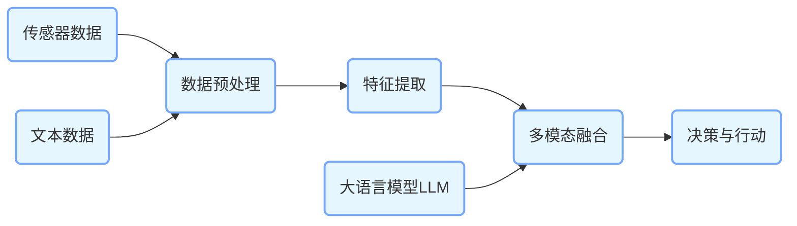

# AI Agent的多模态理解：整合LLM与传感器数据

> 关键词：AI Agent、多模态理解、大语言模型（LLM）、传感器数据、数据整合

> 摘要：本文聚焦于AI Agent的多模态理解，深入探讨如何将大语言模型（LLM）与传感器数据进行整合。首先介绍相关背景知识，包括目的、预期读者等内容。接着阐述核心概念与联系，分析多模态理解的原理和架构。然后详细讲解核心算法原理及具体操作步骤，通过Python源代码进行说明。给出数学模型和公式并举例。通过项目实战展示代码实现与解读。探讨实际应用场景，推荐相关工具和资源。最后总结未来发展趋势与挑战，提供常见问题解答和参考资料，旨在为相关领域的研究和实践提供全面的技术指导。

## 1. 背景介绍 
### 1.1 目的和范围
随着人工智能技术的不断发展，AI Agent在各个领域的应用越来越广泛。然而，单一模态的数据处理已经难以满足复杂场景的需求。多模态理解作为一种新兴的技术，旨在整合不同类型的数据，提高AI Agent的智能水平。本文的目的是深入研究如何将大语言模型（LLM）与传感器数据进行整合，以实现AI Agent的多模态理解。范围涵盖相关核心概念、算法原理、数学模型、项目实战、应用场景等多个方面。

### 1.2 预期读者
本文预期读者包括人工智能领域的研究人员、工程师、开发者，以及对AI Agent多模态理解技术感兴趣的学生和爱好者。希望通过本文，为他们提供深入的技术知识和实践指导，帮助他们在该领域开展相关工作。

### 1.3 文档结构概述
本文将按照以下结构进行阐述：首先介绍背景知识，包括目的、读者和文档结构等；接着讲解核心概念与联系，分析多模态理解的原理和架构；然后详细说明核心算法原理及操作步骤，给出Python源代码；介绍数学模型和公式并举例；通过项目实战展示代码实现与解读；探讨实际应用场景；推荐相关工具和资源；最后总结未来发展趋势与挑战，提供常见问题解答和参考资料。

### 1.4 术语表
#### 1.4.1 核心术语定义
- **AI Agent**：智能体，是一种能够感知环境、进行决策并采取行动的人工智能实体。
- **多模态理解**：指AI Agent能够同时处理和理解多种不同类型的数据，如文本、图像、音频、传感器数据等。
- **大语言模型（LLM）**：一种基于深度学习的语言模型，能够处理自然语言任务，如文本生成、问答系统等。
- **传感器数据**：由各种传感器收集到的数据，如温度、湿度、加速度、图像、音频等。

#### 1.4.2 相关概念解释
- **数据整合**：将不同来源、不同格式的数据进行融合，以获取更全面、更准确的信息。
- **特征提取**：从原始数据中提取出具有代表性的特征，以便后续的处理和分析。
- **模型融合**：将多个不同的模型进行组合，以发挥各自的优势，提高整体性能。

#### 1.4.3 缩略词列表
- **LLM**：Large Language Model（大语言模型）
- **AI**：Artificial Intelligence（人工智能）

## 2. 核心概念与联系 
### 2.1 多模态理解的原理
多模态理解的核心在于将不同模态的数据进行有效的整合和分析。不同模态的数据包含着不同的信息，通过整合可以获取更丰富、更全面的信息。例如，文本数据可以提供语义信息，图像数据可以提供视觉信息，传感器数据可以提供环境信息。将这些信息结合起来，可以使AI Agent更好地理解环境和任务，做出更准确的决策。

### 2.2 大语言模型（LLM）与传感器数据的联系
大语言模型（LLM）具有强大的自然语言处理能力，可以处理文本数据并生成自然语言响应。传感器数据则可以提供关于环境的实时信息。将LLM与传感器数据整合，可以使AI Agent在处理自然语言任务的同时，结合环境信息做出更智能的决策。例如，在智能家居场景中，LLM可以理解用户的语音指令，传感器数据可以提供房间的温度、湿度等信息，AI Agent可以根据这些信息自动调节空调、加湿器等设备。

### 2.3 多模态理解的架构
以下是多模态理解的架构示意图：



该架构主要包括以下几个部分：
1. **数据采集**：通过传感器收集环境数据，同时获取文本数据。
2. **数据预处理**：对采集到的数据进行清洗、归一化等处理，以提高数据质量。
3. **特征提取**：从预处理后的数据中提取出具有代表性的特征。
4. **多模态融合**：将不同模态的特征进行融合，以获取更全面的信息。
5. **大语言模型（LLM）**：利用大语言模型处理文本信息，并结合融合后的特征进行推理。
6. **决策与行动**：根据推理结果，AI Agent做出决策并采取相应的行动。

## 3. 核心算法原理 & 具体操作步骤 
### 3.1 数据预处理算法
数据预处理是多模态理解的重要步骤，主要包括数据清洗、归一化等操作。以下是一个简单的数据预处理Python代码示例：

```python
import numpy as np

def data_cleaning(data):
    """
    数据清洗函数，去除缺失值
    :param data: 输入数据
    :return: 清洗后的数据
    """
    cleaned_data = []
    for row in data:
        if not np.isnan(row).any():
            cleaned_data.append(row)
    return np.array(cleaned_data)

def data_normalization(data):
    """
    数据归一化函数，将数据缩放到[0, 1]区间
    :param data: 输入数据
    :return: 归一化后的数据
    """
    min_val = np.min(data, axis=0)
    max_val = np.max(data, axis=0)
    normalized_data = (data - min_val) / (max_val - min_val)
    return normalized_data

# 示例数据
data = np.array([[1, 2, np.nan], [4, 5, 6], [7, 8, 9]])

# 数据清洗
cleaned_data = data_cleaning(data)
print("清洗后的数据：", cleaned_data)

# 数据归一化
normalized_data = data_normalization(cleaned_data)
print("归一化后的数据：", normalized_data)
```

### 3.2 特征提取算法
特征提取是从原始数据中提取出具有代表性的特征，常用的方法包括主成分分析（PCA）、卷积神经网络（CNN）等。以下是一个使用PCA进行特征提取的Python代码示例：

```python
from sklearn.decomposition import PCA

def feature_extraction(data, n_components=2):
    """
    特征提取函数，使用PCA进行特征提取
    :param data: 输入数据
    :param n_components: 提取的特征数量
    :return: 提取的特征
    """
    pca = PCA(n_components=n_components)
    features = pca.fit_transform(data)
    return features

# 示例数据
data = np.array([[1, 2, 3], [4, 5, 6], [7, 8, 9]])

# 特征提取
features = feature_extraction(data)
print("提取的特征：", features)
```

### 3.3 多模态融合算法
多模态融合是将不同模态的特征进行融合，常用的方法包括早期融合、晚期融合等。以下是一个简单的早期融合Python代码示例：

```python
import numpy as np

def early_fusion(feature1, feature2):
    """
    早期融合函数，将两个特征向量拼接在一起
    :param feature1: 第一个特征向量
    :param feature2: 第二个特征向量
    :return: 融合后的特征向量
    """
    fused_feature = np.concatenate((feature1, feature2), axis=1)
    return fused_feature

# 示例特征向量
feature1 = np.array([[1, 2], [3, 4]])
feature2 = np.array([[5, 6], [7, 8]])

# 多模态融合
fused_feature = early_fusion(feature1, feature2)
print("融合后的特征向量：", fused_feature)
```

### 3.4 结合大语言模型（LLM）进行推理
在多模态融合后，可以结合大语言模型（LLM）进行推理。以下是一个简单的示例，假设使用OpenAI的GPT模型：

```python
import openai

# 设置OpenAI API密钥
openai.api_key = "your_api_key"

def llm_inference(prompt):
    """
    使用OpenAI GPT模型进行推理
    :param prompt: 输入的文本提示
    :return: 模型的输出结果
    """
    response = openai.Completion.create(
        engine="text-davinci-003",
        prompt=prompt,
        max_tokens=100
    )
    return response.choices[0].text.strip()

# 示例提示
prompt = "根据传感器数据和相关信息，判断当前环境是否适宜人类居住"

# 进行推理
result = llm_inference(prompt)
print("推理结果：", result)
```

## 4. 数学模型和公式 & 详细讲解 & 举例说明 
### 4.1 数据归一化公式
数据归一化是将数据缩放到[0, 1]区间，常用的公式为：

$$x_{norm}=\frac{x - x_{min}}{x_{max}-x_{min}}$$

其中，$x$ 是原始数据，$x_{min}$ 是数据的最小值，$x_{max}$ 是数据的最大值，$x_{norm}$ 是归一化后的数据。

举例说明：假设有一组数据 $[1, 2, 3, 4, 5]$，$x_{min}=1$，$x_{max}=5$，则归一化后的数据为：

$x_{norm}=\frac{[1, 2, 3, 4, 5] - 1}{5 - 1}=\frac{[0, 1, 2, 3, 4]}{4}=[0, 0.25, 0.5, 0.75, 1]$

### 4.2 主成分分析（PCA）公式
主成分分析（PCA）的目标是找到数据的主成分，即数据的最大方差方向。PCA的数学模型可以表示为：

给定一个 $n\times p$ 的数据矩阵 $X$，其中 $n$ 是样本数量，$p$ 是特征数量。PCA的目标是找到一个 $p\times k$ 的投影矩阵 $W$，使得投影后的数据 $Y = XW$ 的方差最大。

投影矩阵 $W$ 的列向量是数据矩阵 $X$ 的协方差矩阵 $S=\frac{1}{n - 1}X^TX$ 的前 $k$ 个特征向量。

举例说明：假设有一个 $3\times 2$ 的数据矩阵 $X=\begin{bmatrix}1 & 2\\3 & 4\\5 & 6\end{bmatrix}$，首先计算协方差矩阵 $S$：

$S=\frac{1}{3 - 1}\begin{bmatrix}1 & 3 & 5\\2 & 4 & 6\end{bmatrix}\begin{bmatrix}1 & 2\\3 & 4\\5 & 6\end{bmatrix}=\frac{1}{2}\begin{bmatrix}35 & 44\\44 & 56\end{bmatrix}=\begin{bmatrix}17.5 & 22\\22 & 28\end{bmatrix}$

然后计算 $S$ 的特征向量和特征值，选择前 $k$ 个特征向量作为投影矩阵 $W$。

### 4.3 多模态融合公式
早期融合是将不同模态的特征向量拼接在一起，假设两个特征向量分别为 $\mathbf{f}_1$ 和 $\mathbf{f}_2$，则融合后的特征向量 $\mathbf{f}_{fused}$ 为：

$\mathbf{f}_{fused}=\begin{bmatrix}\mathbf{f}_1\\\mathbf{f}_2\end{bmatrix}$

举例说明：假设有两个特征向量 $\mathbf{f}_1=[1, 2]$ 和 $\mathbf{f}_2=[3, 4]$，则融合后的特征向量为 $\mathbf{f}_{fused}=[1, 2, 3, 4]$。

## 5. 项目实战：代码实际案例和详细解释说明 
### 5.1  开发环境搭建
- **Python环境**：建议使用Python 3.7及以上版本，可以通过Anaconda或官方网站下载安装。
- **依赖库安装**：安装必要的Python库，如numpy、scikit-learn、openai等。可以使用以下命令进行安装：

```bash
pip install numpy scikit-learn openai
```

### 5.2  源代码详细实现和代码解读
以下是一个完整的项目实战代码示例，实现了AI Agent的多模态理解，整合LLM与传感器数据：

```python
import numpy as np
from sklearn.decomposition import PCA
import openai

# 设置OpenAI API密钥
openai.api_key = "your_api_key"

def data_cleaning(data):
    """
    数据清洗函数，去除缺失值
    :param data: 输入数据
    :return: 清洗后的数据
    """
    cleaned_data = []
    for row in data:
        if not np.isnan(row).any():
            cleaned_data.append(row)
    return np.array(cleaned_data)

def data_normalization(data):
    """
    数据归一化函数，将数据缩放到[0, 1]区间
    :param data: 输入数据
    :return: 归一化后的数据
    """
    min_val = np.min(data, axis=0)
    max_val = np.max(data, axis=0)
    normalized_data = (data - min_val) / (max_val - min_val)
    return normalized_data

def feature_extraction(data, n_components=2):
    """
    特征提取函数，使用PCA进行特征提取
    :param data: 输入数据
    :param n_components: 提取的特征数量
    :return: 提取的特征
    """
    pca = PCA(n_components=n_components)
    features = pca.fit_transform(data)
    return features

def early_fusion(feature1, feature2):
    """
    早期融合函数，将两个特征向量拼接在一起
    :param feature1: 第一个特征向量
    :param feature2: 第二个特征向量
    :return: 融合后的特征向量
    """
    fused_feature = np.concatenate((feature1, feature2), axis=1)
    return fused_feature

def llm_inference(prompt):
    """
    使用OpenAI GPT模型进行推理
    :param prompt: 输入的文本提示
    :return: 模型的输出结果
    """
    response = openai.Completion.create(
        engine="text-davinci-003",
        prompt=prompt,
        max_tokens=100
    )
    return response.choices[0].text.strip()

# 示例传感器数据
sensor_data = np.array([[1, 2, 3], [4, 5, 6], [7, 8, 9]])

# 示例文本数据
text_data = "当前环境的温度和湿度是否适宜"

# 数据清洗
cleaned_sensor_data = data_cleaning(sensor_data)

# 数据归一化
normalized_sensor_data = data_normalization(cleaned_sensor_data)

# 特征提取
sensor_features = feature_extraction(normalized_sensor_data)

# 假设文本特征已经提取
text_features = np.array([[0.1, 0.2]])

# 多模态融合
fused_features = early_fusion(sensor_features, text_features)

# 生成提示
prompt = f"根据传感器特征 {fused_features} 和文本信息 '{text_data}'，判断当前环境的状态"

# 进行推理
result = llm_inference(prompt)
print("推理结果：", result)
```

### 5.3  代码解读与分析
1. **数据预处理**：使用 `data_cleaning` 函数去除传感器数据中的缺失值，使用 `data_normalization` 函数将数据归一化到[0, 1]区间。
2. **特征提取**：使用 `feature_extraction` 函数对归一化后的传感器数据进行特征提取，这里使用了主成分分析（PCA）方法。
3. **多模态融合**：使用 `early_fusion` 函数将传感器特征和文本特征进行早期融合，将两个特征向量拼接在一起。
4. **LLM推理**：使用 `llm_inference` 函数调用OpenAI GPT模型进行推理，根据融合后的特征和文本信息生成提示，获取模型的输出结果。

## 6. 实际应用场景 
### 6.1 智能家居
在智能家居场景中，AI Agent可以整合传感器数据（如温度、湿度、光照等）和用户的语音指令（通过大语言模型处理），实现智能控制。例如，当用户说“我感觉有点热”时，AI Agent可以结合温度传感器数据，自动调节空调的温度。

### 6.2 自动驾驶
在自动驾驶领域，AI Agent可以