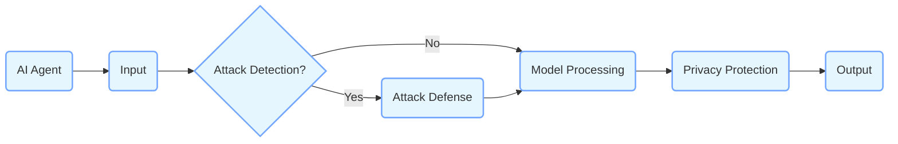

# AI Agent的安全性设计：防御攻击和隐私保护

> 关键词：AI Agent、安全性设计、防御攻击、隐私保护、安全机制

> 摘要：本文围绕AI Agent的安全性设计展开，深入探讨了防御攻击和隐私保护两个关键方面。首先介绍了相关背景知识，包括目的、预期读者、文档结构和术语表。接着阐述了AI Agent的核心概念与联系，给出了原理和架构的文本示意图及Mermaid流程图。详细讲解了核心算法原理及具体操作步骤，并使用Python代码进行阐述。同时，给出了数学模型和公式，结合实例进行说明。通过项目实战，展示了代码的实际案例并进行详细解释。分析了AI Agent在不同场景下的实际应用，推荐了学习资源、开发工具框架和相关论文著作。最后总结了未来发展趋势与挑战，提供了常见问题解答和扩展阅读参考资料，旨在为读者全面深入地了解AI Agent的安全性设计提供有价值的参考。

## 1. 背景介绍 
### 1.1 目的和范围
随着人工智能技术的飞速发展，AI Agent在各个领域的应用越来越广泛，如智能客服、智能家居、自动驾驶等。然而，AI Agent的安全性问题也日益凸显，包括遭受各种攻击以及用户隐私泄露等风险。本文的目的在于深入探讨AI Agent的安全性设计，重点关注如何防御攻击和保护用户隐私。范围涵盖了AI Agent安全性设计的核心概念、算法原理、实际应用场景以及相关工具和资源等方面。

### 1.2 预期读者
本文预期读者包括人工智能领域的研究人员、开发者、安全专家，以及对AI Agent安全性感兴趣的技术爱好者。研究人员可以从中获取最新的研究思路和方法，开发者能够学习到具体的安全设计实现技巧，安全专家可以参考相关的防御策略，技术爱好者则可以对AI Agent的安全性有一个全面的了解。

### 1.3 文档结构概述
本文首先介绍背景知识，为读者搭建理解的基础。接着阐述核心概念与联系，帮助读者掌握AI Agent安全性设计的基本原理。然后详细讲解核心算法原理和具体操作步骤，并给出数学模型和公式。通过项目实战，展示如何将理论应用到实际中。分析实际应用场景，让读者了解AI Agent安全性设计的实际价值。推荐相关的工具和资源，方便读者进一步学习和研究。最后总结未来发展趋势与挑战，提供常见问题解答和扩展阅读参考资料。

### 1.4 术语表
#### 1.4.1 核心术语定义
- **AI Agent**：是指能够感知环境、做出决策并采取行动以实现特定目标的人工智能实体。它可以是软件程序、机器人等形式。
- **攻击**：指对AI Agent的正常运行造成干扰、破坏或获取非法信息的行为，包括恶意输入、模型窃取、数据投毒等。
- **隐私保护**：确保AI Agent处理的用户数据不被泄露、滥用，保护用户的个人信息安全。
- **安全机制**：为保障AI Agent的安全性而采取的一系列技术和策略，如加密、访问控制、异常检测等。

#### 1.4.2 相关概念解释
- **模型窃取攻击**：攻击者试图获取AI Agent所使用的机器学习模型的结构和参数，以便复制或利用该模型。
- **数据投毒攻击**：攻击者向AI Agent的训练数据中注入恶意数据，导致模型在训练过程中出现偏差，从而影响其正常决策。
- **差分隐私**：一种用于保护数据隐私的数学框架，通过在数据处理过程中添加噪声，使得攻击者难以从输出结果中推断出单个数据点的信息。

#### 1.4.3 缩略词列表
- **ML**：Machine Learning，机器学习
- **DL**：Deep Learning，深度学习
- **API**：Application Programming Interface，应用程序编程接口
- **DP**：Differential Privacy，差分隐私

## 2. 核心概念与联系 

### 核心概念原理
AI Agent的安全性设计主要围绕防御攻击和隐私保护两个核心方面。在防御攻击方面，需要识别可能的攻击类型，并采取相应的措施来抵御攻击。常见的攻击类型包括基于输入的攻击（如恶意输入、对抗样本攻击）、基于模型的攻击（如模型窃取、模型反转攻击）和基于数据的攻击（如数据投毒攻击）。针对这些攻击，可以采用输入验证、模型加密、数据清洗等安全机制。

在隐私保护方面，主要目标是确保用户数据的机密性、完整性和可用性。可以通过数据加密、匿名化处理、差分隐私等技术来实现。例如，使用加密算法对用户数据进行加密，使得数据在传输和存储过程中不被窃取；采用匿名化处理技术，去除数据中的敏感信息，保护用户的身份隐私；运用差分隐私技术，在数据发布和使用过程中添加噪声，防止攻击者通过数据分析推断出用户的个人信息。

### 架构的文本示意图
```plaintext
+----------------------+
|       AI Agent       |
| +------------------+ |
| |    Input Module  | |
| +------------------+ |
| |    Model Module  | |
| +------------------+ |
| |    Output Module | |
| +------------------+ |
+----------------------+
|      Security Layer    |
| +------------------+ |
| |  Attack Defense  | |
| +------------------+ |
| | Privacy Protection | |
| +------------------+ |
+----------------------+
|      Environment       |
+----------------------+
```
该示意图展示了AI Agent的基本架构，包括输入模块、模型模块和输出模块。安全层位于AI Agent和环境之间，负责防御攻击和保护隐私。环境包括用户输入、数据来源等。

### Mermaid流程图

该流程图描述了AI Agent在处理输入时的安全流程。首先对输入进行攻击检测，如果检测到攻击，则进行攻击防御；如果没有检测到攻击，则进行模型处理。在模型处理之后，进行隐私保护，最后输出结果。

## 3. 核心算法原理 & 具体操作步骤 

### 输入验证算法
输入验证是防御基于输入的攻击的重要手段。下面是一个简单的Python代码示例，用于验证输入是否为合法的数字：
```python
def validate_input(input_value):
    try:
        num = float(input_value)
        return True
    except ValueError:
        return False

# 测试输入验证
input_data = "123.45"
if validate_input(input_data):
    print("输入有效")
else:
    print("输入无效")
```
### 操作步骤：
1. 定义一个函数`validate_input`，接受一个输入值作为参数。
2. 在函数内部，尝试将输入值转换为浮点数。
3. 如果转换成功，则返回`True`，表示输入有效；如果转换失败（抛出`ValueError`异常），则返回`False`，表示输入无效。

### 差分隐私算法
差分隐私是一种常用的隐私保护技术。下面是一个简单的差分隐私算法示例，用于在数据发布时添加噪声：
```python
import numpy as np

def add_differential_privacy(data, epsilon):
    sensitivity = 1.0  # 敏感度
    noise = np.random.laplace(0, sensitivity / epsilon)
    return data + noise

# 测试差分隐私
original_data = 10.0
epsilon = 0.1
noisy_data = add_differential_privacy(original_data, epsilon)
print(f"原始数据: {original_data}, 加噪后数据: {noisy_data}")
```
### 操作步骤：
1. 定义一个函数`add_differential_privacy`，接受数据和隐私预算`epsilon`作为参数。
2. 设置敏感度`sensitivity`，通常根据具体的数据处理任务确定。
3. 从拉普拉斯分布中采样一个噪声值。
4. 将噪声值添加到原始数据上，得到加噪后的数据。

## 4. 数学模型和公式 & 详细讲解 & 举例说明 

### 差分隐私的数学定义
差分隐私的正式定义如下：
$$
\forall S \subseteq Range(M), \forall x, x' \in D: \frac{Pr[M(x) \in S]}{Pr[M(x') \in S]} \leq e^{\epsilon}
$$
其中，$M$是一个随机算法，$D$是数据集，$x$和$x'$是两个相邻的数据集（即它们只在一个数据点上不同），$S$是$M$的输出范围的一个子集，$\epsilon$是隐私预算。该公式表示，对于任意两个相邻的数据集，算法$M$输出在某个子集$S$中的概率之比不超过$e^{\epsilon}$。

### 详细讲解
差分隐私的核心思想是通过添加噪声来模糊数据，使得攻击者难以区分不同数据集的输出。隐私预算$\epsilon$控制了噪声的大小，$\epsilon$越小，噪声越大，隐私保护程度越高，但数据的可用性也会降低。

### 举例说明
假设我们有一个数据集$D$，包含用户的年龄信息。我们要发布这个数据集的均值，但需要保护用户的隐私。我们可以使用差分隐私算法在均值计算过程中添加噪声。例如，当$\epsilon = 0.1$时，添加的噪声会比较大，攻击者很难从发布的均值中推断出单个用户的年龄信息；当$\epsilon = 1$时，噪声相对较小，数据的可用性会提高，但隐私保护程度会降低。

### 攻击检测的数学模型
攻击检测可以基于统计模型，例如异常检测。一种常用的方法是基于高斯分布的异常检测。假设数据$x$服从高斯分布$N(\mu, \sigma^2)$，则异常得分可以定义为：
$$
score(x) = \frac{(x - \mu)^2}{\sigma^2}
$$
如果$score(x)$超过某个阈值$t$，则认为$x$是异常值，可能是攻击输入。

### 详细讲解
该模型的原理是，正常数据点通常会落在高斯分布的中心区域，而异常数据点会偏离中心。通过计算数据点与均值的距离（用平方误差表示），并除以方差，得到异常得分。阈值$t$可以根据具体的应用场景和数据集进行调整。

### 举例说明
假设我们有一个AI Agent用于处理用户的登录请求，登录时间间隔的历史数据服从高斯分布，均值$\mu = 10$分钟，方差$\sigma^2 = 4$。当一个新的登录请求的时间间隔为$20$分钟时，计算异常得分：
$$
score(20) = \frac{(20 - 10)^2}{4} = 25
$$
如果我们设置阈值$t = 10$，则该登录请求的异常得分超过了阈值，可能是异常登录，需要进行进一步的验证。

## 5. 项目实战：代码实际案例和详细解释说明 

### 5.1  开发环境搭建
本项目使用Python进行开发，需要安装以下库：
- `numpy`：用于数值计算
- `scikit-learn`：用于机器学习算法
- `tensorflow`或`pytorch`：用于深度学习模型

可以使用以下命令进行安装：
```bash
pip install numpy scikit-learn tensorflow
```

### 5.2  源代码详细实现和代码解读
我们将实现一个简单的AI Agent，用于处理手写数字识别任务，并添加攻击防御和隐私保护机制。

```python
import numpy as np
import tensorflow as tf
from tensorflow.keras.datasets import mnist
from tensorflow.keras.models import Sequential
from tensorflow.keras.layers import Dense, Flatten

# 加载MNIST数据集
(x_train, y_train), (x_test, y_test) = mnist.load_data()

# 数据预处理
x_train = x_train / 255.0
x_test = x_test / 255.0

# 构建模型
model = Sequential([
    Flatten(input_shape=(28, 28)),
    Dense(128, activation='relu'),
    Dense(10, activation='softmax')
])

# 编译模型
model.compile(optimizer='adam',
              loss='sparse_categorical_crossentropy',
              metrics=['accuracy'])

# 训练模型
model.fit(x_train, y_train, epochs=5)

# 攻击防御：输入验证
def validate_input_image(image):
    if image.shape!= (28, 28):
        return False
    if np.max(image) > 1.0 or np.min(image) < 0.0:
        return False
    return True

# 隐私保护：差分隐私
def add_differential_privacy(image, epsilon):
    sensitivity = 1.0
    noise = np.random.laplace(0, sensitivity / epsilon, image.shape)
    return image + noise

# 测试模型
test_image = x_test[0]
if validate_input_image(test_image):
    noisy_image = add_differential_privacy(test_image, epsilon=0.1)
    predictions = model.predict(np.array([noisy_image]))
    predicted_label = np.argmax(predictions)
    print(f"预测标签: {predicted_label}")
else:
    print("输入无效")
```
### 代码解读
1. **数据加载和预处理**：使用`tensorflow.keras.datasets.mnist`加载MNIST手写数字数据集，并将像素值归一化到$[0, 1]$范围。
2. **模型构建和训练**：构建一个简单的神经网络模型，包含一个展平层、一个全连接层和一个输出层。使用`adam`优化器和`sparse_categorical_crossentropy`损失函数进行编译，并训练模型5个epoch。
3. **攻击防御**：定义`validate_input_image`函数，用于验证输入图像的形状和像素值范围是否合法。
4. **隐私保护**：定义`add_differential_privacy`函数，用于在输入图像上添加差分隐私噪声。
5. **测试模型**：选择一个测试图像，先进行输入验证，然后添加差分隐私噪声，最后使用模型进行预测。

### 5.3  代码解读与分析
- **输入验证的重要性**：通过输入验证，可以防止恶意输入对模型造成损害。例如，如果输入图像的形状不符合要求或像素值超出范围，可能会导致模型崩溃或产生错误的预测结果。
- **差分隐私的效果**：差分隐私可以在一定程度上保护用户的隐私，但会引入噪声，可能会影响模型的预测准确性。可以通过调整隐私预算$\epsilon$来平衡隐私保护和数据可用性。

## 6. 实际应用场景 
### 智能客服
在智能客服系统中，AI Agent需要处理大量的用户咨询信息。为了保护用户隐私，客服系统可以对用户的敏感信息进行加密处理，如姓名、电话号码等。同时，需要防御攻击，例如防止恶意用户通过发送恶意输入来干扰客服系统的正常运行。例如，使用输入验证机制，确保用户输入的信息符合系统的要求。

### 智能家居
智能家居系统中的AI Agent可以控制各种设备，如灯光、门锁、摄像头等。为了保证用户的隐私安全，智能家居系统需要对用户的设备使用数据进行匿名化处理，防止数据泄露。同时，需要防御攻击，例如防止黑客通过网络攻击入侵智能家居系统，控制用户的设备。可以使用加密通信协议和访问控制机制来保障系统的安全性。

### 自动驾驶
在自动驾驶领域，AI Agent需要实时处理大量的传感器数据，如摄像头图像、雷达数据等。为了保护用户的隐私，自动驾驶系统可以对传感器数据进行差分隐私处理，防止攻击者通过分析数据推断出车辆的行驶路线和用户的出行习惯。同时，需要防御攻击，例如防止黑客通过干扰传感器数据来影响自动驾驶系统的决策。可以使用异常检测机制来及时发现和处理异常输入。

## 7. 工具和资源推荐
### 7.1 学习资源推荐
#### 7.1.1 书籍推荐
- 《人工智能安全》：全面介绍了人工智能领域的安全问题，包括攻击类型、防御策略和隐私保护技术。
- 《深度学习》：深入讲解了深度学习的原理和应用，对于理解AI Agent的模型结构和训练过程有很大帮助。
- 《隐私计算》：详细介绍了隐私保护的理论和技术，如差分隐私、同态加密等。

#### 7.1.2 在线课程
- Coursera上的“人工智能安全”课程：由知名学者授课，涵盖了AI Agent安全性设计的各个方面。
- edX上的“深度学习基础”课程：提供了深度学习的基础知识和实践经验，有助于掌握AI Agent的核心技术。

#### 7.1.3 技术博客和网站
- Medium上的人工智能安全专栏：分享了最新的人工智能安全研究成果和实践经验。
- arXiv.org：提供了大量的人工智能相关的学术论文，包括安全性设计方面的研究。

### 7.2 开发工具框架推荐
#### 7.2.1 IDE和编辑器
- PyCharm：功能强大的Python集成开发环境，提供了代码编辑、调试、版本控制等功能。
- Jupyter Notebook：交互式笔记本，适合进行数据分析和模型开发，方便代码的展示和分享。

#### 7.2.2 调试和性能分析工具
- TensorBoard：TensorFlow的可视化工具，可以用于查看模型的训练过程、性能指标等。
- PyTorch Profiler：PyTorch的性能分析工具，帮助开发者优化模型的性能。

#### 7.2.3 相关框架和库
- TensorFlow Privacy：TensorFlow的隐私保护库，提供了差分隐私等隐私保护技术的实现。
- OpenAI Gym：用于开发和比较强化学习算法的工具包，对于开发AI Agent的决策模块有很大帮助。

### 7.3 相关论文著作推荐
#### 7.3.1 经典论文
- “Explaining and Harnessing Adversarial Examples”：首次提出了对抗样本的概念，并分析了其产生的原因和影响。
- “Differential Privacy: A Survey of Results”：对差分隐私技术进行了全面的综述，介绍了其理论基础和应用场景。

#### 7.3.2 最新研究成果
- “Towards Robust AI: Defending Against Adversarial Attacks”：提出了一种新的防御对抗攻击的方法，提高了AI Agent的鲁棒性。
- “Privacy-Preserving Machine Learning: A Review”：对隐私保护机器学习的最新研究成果进行了总结和分析。

#### 7.3.3 应用案例分析
- “AI Security in Healthcare: Challenges and Solutions”：分析了人工智能在医疗领域的安全问题，并提出了相应的解决方案。
- “Securing Autonomous Vehicles: A Comprehensive Approach”：探讨了自动驾驶汽车的安全问题，包括攻击类型和防御策略。

## 8. 总结：未来发展趋势与挑战
### 未来发展趋势
- **多模态安全防护**：随着AI Agent处理的数据类型越来越多样化，如文本、图像、音频等，未来需要发展多模态的安全防护技术，综合考虑不同数据类型的安全问题。
- **自适应安全机制**：AI Agent面临的攻击方式不断变化，未来需要开发自适应的安全机制，能够实时检测和应对新出现的攻击。
- **隐私增强技术的融合**：将差分隐私、同态加密等多种隐私增强技术融合使用，提供更高级别的隐私保护。

### 挑战
- **攻击技术的不断演变**：攻击者会不断开发新的攻击技术，使得防御难度越来越大。需要持续研究和创新安全防御策略。
- **隐私保护与性能的平衡**：在保护用户隐私的同时，需要保证AI Agent的性能和可用性。如何在两者之间找到平衡是一个挑战。
- **法律法规和伦理问题**：随着AI Agent的广泛应用，相关的法律法规和伦理问题也日益凸显。如何确保AI Agent的安全性设计符合法律法规和伦理要求是一个重要的挑战。

## 9. 附录：常见问题与解答
### 1. 如何选择合适的隐私预算$\epsilon$？
隐私预算$\epsilon$的选择需要根据具体的应用场景和隐私保护需求来确定。一般来说，$\epsilon$越小，隐私保护程度越高，但数据的可用性会降低。可以通过实验和评估来选择合适的$\epsilon$值。

### 2. 如何检测和防御未知类型的攻击？
可以使用异常检测技术，建立正常行为的模型，当检测到异常行为时，及时采取措施。同时，需要不断更新和改进安全机制，以应对新出现的攻击类型。

### 3. 差分隐私会对模型的性能产生多大影响？
差分隐私会引入噪声，可能会对模型的性能产生一定的影响。影响的大小取决于隐私预算$\epsilon$和数据的特点。可以通过调整$\epsilon$值和优化模型结构来平衡隐私保护和模型性能。

## 10. 扩展阅读 & 参考资料
- Goodfellow, I. J., Shlens, J., & Szegedy, C. (2014). Explaining and harnessing adversarial examples. arXiv preprint arXiv:1412.6572.
- Dwork, C. (2006). Differential privacy. In International colloquium on automata, languages, and programming (pp. 1-12). Springer, Berlin, Heidelberg.
- Abadi, M., Chu, A., Goodfellow, I., McMahan, H. B., Mironov, I., Talwar, K., & Zhang, L. (2016). Deep learning with differential privacy. In Proceedings of the 2016 ACM SIGSAC conference on computer and communications security (pp. 308-318).
- 《人工智能安全实战》，机械工业出版社

作者：AI天才研究院/AI Genius Institute & 禅与计算机程序设计艺术 /Zen And The Art of Computer Programming