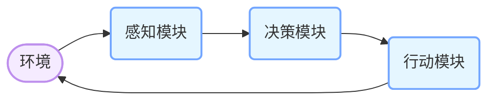
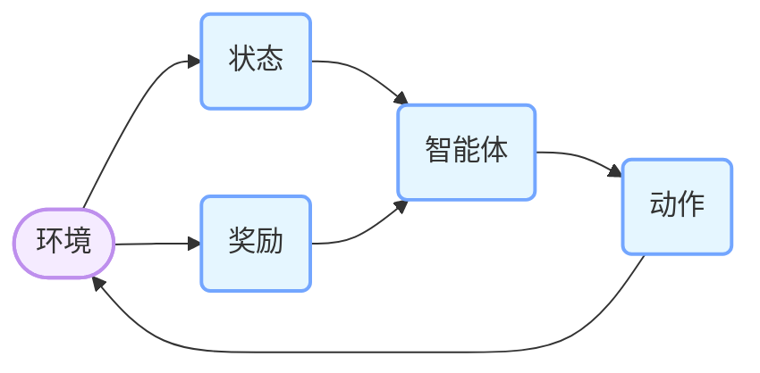

# AI Agent的安全性设计：防范潜在风险

> 关键词：AI Agent、安全性设计、潜在风险、风险防范、安全机制

> 摘要：本文围绕AI Agent的安全性设计展开，深入探讨了如何防范AI Agent在运行过程中可能面临的潜在风险。首先介绍了文章的背景信息，包括目的、预期读者、文档结构和相关术语。接着阐述了AI Agent的核心概念、联系以及其架构原理，并给出了相应的示意图和流程图。详细讲解了核心算法原理，结合Python代码进行说明，同时介绍了相关的数学模型和公式。通过项目实战，展示了AI Agent安全性设计的具体实现过程。分析了AI Agent的实际应用场景，推荐了相关的学习资源、开发工具框架和论文著作。最后总结了AI Agent安全性设计的未来发展趋势与挑战，并对常见问题进行了解答，提供了扩展阅读和参考资料。

## 1. 背景介绍 
### 1.1 目的和范围
随着人工智能技术的飞速发展，AI Agent在各个领域的应用越来越广泛。然而，AI Agent在运行过程中可能会面临各种潜在风险，如数据泄露、恶意攻击、错误决策等，这些风险可能会对个人、组织甚至社会造成严重的影响。因此，对AI Agent进行安全性设计，防范潜在风险具有重要的现实意义。

本文的目的是深入探讨AI Agent的安全性设计方法，帮助开发者和研究人员了解如何识别、评估和防范AI Agent可能面临的潜在风险。文章将涵盖AI Agent的核心概念、算法原理、数学模型、项目实战等方面，并分析其在不同应用场景中的安全性需求。

### 1.2 预期读者
本文预期读者包括人工智能领域的开发者、研究人员、安全专家、系统架构师以及对AI Agent安全性感兴趣的技术爱好者。对于有一定编程基础和人工智能知识的读者，本文将提供深入的技术分析和实践指导；对于初学者，本文也会对相关概念和技术进行详细解释，帮助他们建立对AI Agent安全性设计的基本认识。

### 1.3 文档结构概述
本文将按照以下结构进行组织：
1. **背景介绍**：介绍文章的目的、预期读者、文档结构和相关术语。
2. **核心概念与联系**：阐述AI Agent的核心概念、联系以及其架构原理，并给出相应的示意图和流程图。
3. **核心算法原理 & 具体操作步骤**：详细讲解AI Agent的核心算法原理，结合Python代码进行说明。
4. **数学模型和公式 & 详细讲解 & 举例说明**：介绍AI Agent相关的数学模型和公式，并通过具体例子进行详细讲解。
5. **项目实战：代码实际案例和详细解释说明**：通过项目实战，展示AI Agent安全性设计的具体实现过程。
6. **实际应用场景**：分析AI Agent在不同应用场景中的安全性需求。
7. **工具和资源推荐**：推荐相关的学习资源、开发工具框架和论文著作。
8. **总结：未来发展趋势与挑战**：总结AI Agent安全性设计的未来发展趋势与挑战。
9. **附录：常见问题与解答**：对常见问题进行解答。
10. **扩展阅读 & 参考资料**：提供扩展阅读和参考资料。

### 1.4 术语表
#### 1.4.1 核心术语定义
- **AI Agent**：人工智能代理，是一种能够感知环境、做出决策并采取行动以实现特定目标的智能实体。
- **安全性设计**：为了确保系统或组件在各种环境下能够安全、可靠地运行而进行的设计过程。
- **潜在风险**：可能对系统或组件的安全性、可靠性、性能等方面造成不利影响的因素。
- **风险评估**：对潜在风险的可能性和影响程度进行评估的过程。
- **风险防范**：采取措施降低潜在风险的可能性和影响程度的过程。

#### 1.4.2 相关概念解释
- **机器学习**：一门多领域交叉学科，涉及概率论、统计学、逼近论、凸分析、算法复杂度理论等多门学科。它专门研究计算机怎样模拟或实现人类的学习行为，以获取新的知识或技能，重新组织已有的知识结构使之不断改善自身的性能。
- **深度学习**：机器学习的一个分支领域，它是一种基于对数据进行表征学习的方法。深度学习通过构建具有很多层的神经网络模型，自动从数据中学习特征和模式。
- **强化学习**：一种机器学习范式，智能体通过与环境进行交互，根据环境反馈的奖励信号来学习最优的行为策略。

#### 1.4.3 缩略词列表
- **AI**：Artificial Intelligence，人工智能
- **ML**：Machine Learning，机器学习
- **DL**：Deep Learning，深度学习
- **RL**：Reinforcement Learning，强化学习

## 2. 核心概念与联系 

### 2.1 AI Agent的定义和特点
AI Agent是一种能够感知环境、做出决策并采取行动以实现特定目标的智能实体。它可以是软件程序、机器人或其他形式的智能系统。AI Agent具有以下特点：
- **自主性**：能够在没有人类干预的情况下自主地感知环境、做出决策并采取行动。
- **反应性**：能够对环境的变化做出及时的反应。
- **目标导向性**：具有明确的目标，并能够采取行动以实现这些目标。
- **适应性**：能够根据环境的变化和自身的经验不断调整自己的行为策略。

### 2.2 AI Agent的架构原理
AI Agent的架构通常包括感知模块、决策模块和行动模块三个部分，如图1所示。


图1：AI Agent架构原理示意图

- **感知模块**：负责感知环境的信息，如传感器数据、文本信息、图像信息等。感知模块可以使用各种传感器和数据采集设备来获取环境信息，并将其转换为AI Agent能够处理的格式。
- **决策模块**：根据感知模块提供的环境信息，结合自身的目标和知识，做出决策。决策模块可以使用各种机器学习和人工智能算法来进行决策，如深度学习、强化学习等。
- **行动模块**：根据决策模块做出的决策，采取相应的行动。行动模块可以控制机器人的运动、执行软件程序的指令等。

### 2.3 AI Agent与其他概念的联系
AI Agent与机器学习、深度学习、强化学习等概念密切相关。机器学习是AI Agent实现智能决策的重要手段，通过机器学习算法，AI Agent可以从数据中学习到模式和规律，从而做出更加准确的决策。深度学习是机器学习的一个分支领域，它通过构建深度神经网络模型，自动从数据中学习到高级特征和模式，提高了AI Agent的智能水平。强化学习是一种机器学习范式，它通过智能体与环境的交互，根据环境反馈的奖励信号来学习最优的行为策略，使AI Agent能够在动态环境中实现自主决策。

## 3. 核心算法原理 & 具体操作步骤 

### 3.1 决策算法原理
在AI Agent的决策模块中，常用的决策算法包括基于规则的决策算法、基于机器学习的决策算法和基于强化学习的决策算法。下面以基于强化学习的决策算法为例，详细介绍其原理和具体操作步骤。

#### 3.1.1 强化学习基本概念
强化学习是一种机器学习范式，它通过智能体与环境的交互，根据环境反馈的奖励信号来学习最优的行为策略。强化学习的基本要素包括智能体（Agent）、环境（Environment）、状态（State）、动作（Action）和奖励（Reward），如图2所示。


图2：强化学习基本要素示意图

- **智能体**：需要学习最优行为策略的实体。
- **环境**：智能体所处的外部世界，智能体通过与环境进行交互来获取信息和执行动作。
- **状态**：描述环境在某一时刻的特征信息，智能体根据当前状态来选择动作。
- **动作**：智能体在某一状态下可以采取的行为。
- **奖励**：环境对智能体采取的动作的反馈，用于指导智能体学习最优的行为策略。

#### 3.1.2 Q学习算法原理
Q学习是一种经典的强化学习算法，它通过学习一个动作价值函数 $Q(s,a)$ 来实现最优行为策略的学习。动作价值函数 $Q(s,a)$ 表示在状态 $s$ 下采取动作 $a$ 所能获得的最大期望累积奖励。Q学习算法的更新公式如下：

$$Q(s_t,a_t) \leftarrow Q(s_t,a_t) + \alpha [r_{t+1} + \gamma \max_{a} Q(s_{t+1},a) - Q(s_t,a_t)]$$

其中，$s_t$ 表示当前状态，$a_t$ 表示当前动作，$r_{t+1}$ 表示执行动作 $a_t$ 后获得的奖励，$s_{t+1}$ 表示执行动作 $a_t$ 后转移到的下一个状态，$\alpha$ 表示学习率，$\gamma$ 表示折扣因子。

#### 3.1.3 Q学习算法具体操作步骤
Q学习算法的具体操作步骤如下：
1. 初始化动作价值函数 $Q(s,a)$ 为随机值。
2. 循环执行以下步骤，直到达到终止条件：
    - 观察当前状态 $s_t$。
    - 根据当前状态 $s_t$ 和动作价值函数 $Q(s,a)$ 选择一个动作 $a_t$。可以使用 $\epsilon$-贪心策略来选择动作，即有 $\epsilon$ 的概率随机选择一个动作，有 $1 - \epsilon$ 的概率选择使 $Q(s_t,a)$ 最大的动作。
    - 执行动作 $a_t$，并观察环境反馈的奖励 $r_{t+1}$ 和下一个状态 $s_{t+1}$。
    - 根据Q学习算法的更新公式更新动作价值函数 $Q(s_t,a_t)$。
    - 将当前状态 $s_t$ 更新为下一个状态 $s_{t+1}$。

### 3.2 Python代码实现
以下是一个使用Python实现的简单Q学习算法示例：

```python
import numpy as np

# 定义环境参数
num_states = 5
num_actions = 2
gamma = 0.9
alpha = 0.1
epsilon = 0.1
num_episodes = 1000

# 初始化Q表
Q = np.zeros((num_states, num_actions))

# 定义环境转移函数和奖励函数
def get_next_state_and_reward(state, action):
    if action == 0:
        next_state = max(0, state - 1)
    else:
        next_state = min(num_states - 1, state + 1)
    if next_state == num_states - 1:
        reward = 1
    else:
        reward = 0
    return next_state, reward

# Q学习算法主循环
for episode in range(num_episodes):
    state = 0
    done = False
    while not done:
        # 根据epsilon-贪心策略选择动作
        if np.random.uniform(0, 1) < epsilon:
            action = np.random.randint(0, num_actions)
        else:
            action = np.argmax(Q[state, :])
        
        # 执行动作，获取下一个状态和奖励
        next_state, reward = get_next_state_and_reward(state, action)
        
        # 更新Q表
        Q[state, action] = Q[state, action] + alpha * (reward + gamma * np.max(Q[next_state, :]) - Q[state, action])
        
        # 更新当前状态
        state = next_state
        
        # 判断是否到达终止状态
        if state == num_states - 1:
            done = True

# 输出最终的Q表
print("Final Q-table:")
print(Q)
```

### 3.3 代码解释
- **环境参数定义**：定义了环境的状态数、动作数、折扣因子、学习率、探索率和训练轮数。
- **Q表初始化**：将Q表初始化为全零矩阵。
- **环境转移函数和奖励函数**：定义了根据当前状态和动作获取下一个状态和奖励的函数。
- **Q学习算法主循环**：在每一轮训练中，智能体从初始状态开始，根据 $\epsilon$-贪心策略选择动作，执行动作并获取下一个状态和奖励，然后更新Q表，直到到达终止状态。
- **输出最终的Q表**：训练结束后，输出最终的Q表。

## 4. 数学模型和公式 & 详细讲解 & 举例说明 

### 4.1 马尔可夫决策过程（MDP）
马尔可夫决策过程（Markov Decision Process，MDP）是强化学习的数学基础，它描述了一个智能体在具有马尔可夫性质的环境中进行决策的过程。一个MDP可以用一个五元组 $(S,A,P,R,\gamma)$ 来表示，其中：
- $S$ 是有限的状态集合。
- $A$ 是有限的动作集合。
- $P(s'|s,a)$ 是状态转移概率，表示在状态 $s$ 下采取动作 $a$ 后转移到状态 $s'$ 的概率。
- $R(s,a)$ 是奖励函数，表示在状态 $s$ 下采取动作 $a$ 所能获得的即时奖励。
- $\gamma \in [0,1]$ 是折扣因子，用于权衡即时奖励和未来奖励的重要性。

#### 4.1.1 状态价值函数和动作价值函数
在MDP中，状态价值函数 $V^\pi(s)$ 表示在策略 $\pi$ 下，从状态 $s$ 开始所能获得的期望累积奖励，定义如下：

$$V^\pi(s) = \mathbb{E}_\pi \left[ \sum_{t=0}^{\infty} \gamma^t r_{t+1} \big| s_0 = s \right]$$

动作价值函数 $Q^\pi(s,a)$ 表示在策略 $\pi$ 下，从状态 $s$ 开始采取动作 $a$ 后所能获得的期望累积奖励，定义如下：

$$Q^\pi(s,a) = \mathbb{E}_\pi \left[ \sum_{t=0}^{\infty} \gamma^t r_{t+1} \big| s_0 = s, a_0 = a \right]$$

#### 4.1.2 贝尔曼方程
状态价值函数和动作价值函数满足贝尔曼方程，具体如下：

**状态价值函数的贝尔曼方程**：

$$V^\pi(s) = \sum_{a \in A} \pi(a|s) \sum_{s' \in S} P(s'|s,a) [R(s,a) + \gamma V^\pi(s')]$$

**动作价值函数的贝尔曼方程**：

$$Q^\pi(s,a) = \sum_{s' \in S} P(s'|s,a) [R(s,a) + \gamma \sum_{a' \in A} \pi(a'|s') Q^\pi(s',a')]$$

### 4.2 举例说明
假设有一个简单的MDP，状态集合 $S = \{s_0, s_1, s_2\}$，动作集合 $A = \{a_0, a_1\}$，状态转移概率和奖励函数如下表所示：

| $s$ | $a$ | $s'$ | $P(s'|s,a)$ | $R(s,a)$ |
| --- | --- | --- | --- | --- |
| $s_0$ | $a_0$ | $s_0$ | 0.5 | 0 |
| $s_0$ | $a_0$ | $s_1$ | 0.5 | 0 |
| $s_0$ | $a_1$ | $s_1$ | 1 | 1 |
| $s_1$ | $a_0$ | $s_2$ | 1 | 2 |
| $s_1$ | $a_1$ | $s_0$ | 1 | -1 |
| $s_2$ | $a_0$ | $s_2$ | 1 | 0 |
| $s_2$ | $a_1$ | $s_2$ | 1 | 0 |

假设折扣因子 $\gamma = 0.9$，策略 $\pi$ 为：在状态 $s_0$ 下选择动作 $a_1$，在状态 $s_1$ 下选择动作 $a_0$，在状态 $s_2$ 下选择动作 $a_0$。

#### 4.2.1 计算状态价值函数
根据状态价值函数的贝尔曼方程，我们可以计算出各个状态的价值：

- 对于状态 $s_0$：
  由于在状态 $s_0$ 下选择动作 $a_1$，则：
  $$V^\pi(s_0) = R(s_0,a_1) + \gamma V^\pi(s_1)$$
  其中，$R(s_0,a_1) = 1$。

- 对于状态 $s_1$：
  由于在状态 $s_1$ 下选择动作 $a_0$，则：
  $$V^\pi(s_1) = R(s_1,a_0) + \gamma V^\pi(s_2)$$
  其中，$R(s_1,a_0) = 2$。

- 对于状态 $s_2$：
  由于在状态 $s_2$ 下选择动作 $a_0$，则：
  $$V^\pi(s_2) = R(s_2,a_0) + \gamma V^\pi(s_2)$$
  即 $(1 - \gamma) V^\pi(s_2) = R(s_2,a_0)$，因为 $R(s_2,a_0) = 0$，所以 $V^\pi(s_2) = 0$。

  将 $V^\pi(s_2) = 0$ 代入 $V^\pi(s_1)$ 的公式中，可得 $V^\pi(s_1) = 2 + 0.9 \times 0 = 2$。

  将 $V^\pi(s_1) = 2$ 代入 $V^\pi(s_0)$ 的公式中，可得 $V^\pi(s_0) = 1 + 0.9 \times 2 = 2.8$。

#### 4.2.2 计算动作价值函数
同样，根据动作价值函数的贝尔曼方程，我们可以计算出各个状态动作对的价值：

- 对于状态动作对 $(s_0,a_1)$：
  $$Q^\pi(s_0,a_1) = R(s_0,a_1) + \gamma V^\pi(s_1) = 1 + 0.9 \times 2 = 2.8$$

通过这个例子，我们可以更直观地理解马尔可夫决策过程、状态价值函数、动作价值函数和贝尔曼方程的概念和应用。

## 5. 项目实战：代码实际案例和详细解释说明 

### 5.1  开发环境搭建
在进行AI Agent安全性设计的项目实战之前，需要搭建相应的开发环境。以下是具体的搭建步骤：

#### 5.1.1 安装Python
Python是一种广泛使用的编程语言，许多人工智能和机器学习库都基于Python开发。可以从Python官方网站（https://www.python.org/downloads/）下载并安装Python 3.x版本。

#### 5.1.2 安装必要的库
在项目中，我们需要使用一些常用的Python库，如NumPy、Pandas、Scikit-learn、TensorFlow等。可以使用pip命令来安装这些库：

```bash
pip install numpy pandas scikit-learn tensorflow
```

#### 5.1.3 选择开发工具
可以选择使用PyCharm、Jupyter Notebook等开发工具来进行代码的编写和调试。PyCharm是一款功能强大的Python集成开发环境，适合开发大型项目；Jupyter Notebook是一种交互式的开发环境，适合进行数据分析和模型实验。

### 5.2  源代码详细实现和代码解读
以下是一个简单的AI Agent安全性设计的项目实战案例，该案例主要实现了一个基于机器学习的恶意行为检测AI Agent。

#### 5.2.1 数据准备
首先，我们需要准备用于训练和测试的数据集。假设我们有一个包含正常行为和恶意行为的数据集，数据集的每一行表示一个样本，每一列表示一个特征。

```python
import numpy as np
import pandas as pd
from sklearn.model_selection import train_test_split

# 加载数据集
data = pd.read_csv('malicious_behavior_dataset.csv')

# 分离特征和标签
X = data.drop('label', axis=1).values
y = data['label'].values

# 划分训练集和测试集
X_train, X_test, y_train, y_test = train_test_split(X, y, test_size=0.2, random_state=42)
```

#### 5.2.2 模型训练
接下来，我们使用一个简单的逻辑回归模型来训练AI Agent。

```python
from sklearn.linear_model import LogisticRegression

# 创建逻辑回归模型
model = LogisticRegression()

# 训练模型
model.fit(X_train, y_train)
```

#### 5.2.3 模型评估
训练完成后，我们需要对模型进行评估，以检验其在测试集上的性能。

```python
from sklearn.metrics import accuracy_score, precision_score, recall_score, f1_score

# 在测试集上进行预测
y_pred = model.predict(X_test)

# 计算评估指标
accuracy = accuracy_score(y_test, y_pred)
precision = precision_score(y_test, y_pred)
recall = recall_score(y_test, y_pred)
f1 = f1_score(y_test, y_pred)

print(f"Accuracy: {accuracy}")
print(f"Precision: {precision}")
print(f"Recall: {recall}")
print(f"F1-score: {f1}")
```

#### 5.2.4 安全性设计
为了提高AI Agent的安全性，我们可以采取以下措施：

- **数据加密**：对训练数据和测试数据进行加密处理，防止数据泄露。
- **模型加密**：对训练好的模型进行加密，防止模型被恶意篡改。
- **访问控制**：对AI Agent的访问进行严格的控制，只允许授权用户访问。

以下是一个简单的数据加密示例：

```python
from cryptography.fernet import Fernet

# 生成加密密钥
key = Fernet.generate_key()
cipher_suite = Fernet(key)

# 加密数据
encrypted_X_train = cipher_suite.encrypt(X_train.tobytes())
encrypted_y_train = cipher_suite.encrypt(y_train.tobytes())

# 解密数据
decrypted_X_train = np.frombuffer(cipher_suite.decrypt(encrypted_X_train)).reshape(X_train.shape)
decrypted_y_train = np.frombuffer(cipher_suite.decrypt(encrypted_y_train))
```

### 5.3  代码解读与分析
- **数据准备**：使用Pandas库加载数据集，并使用Scikit-learn库的`train_test_split`函数将数据集划分为训练集和测试集。
- **模型训练**：使用Scikit-learn库的`LogisticRegression`类创建一个逻辑回归模型，并使用训练集对模型进行训练。
- **模型评估**：使用Scikit-learn库的评估指标函数，如`accuracy_score`、`precision_score`、`recall_score`和`f1_score`，对模型在测试集上的性能进行评估。
- **安全性设计**：使用`cryptography`库对数据进行加密处理，提高数据的安全性。

通过这个项目实战案例，我们可以看到如何使用机器学习技术构建一个简单的AI Agent，并采取相应的安全措施来提高其安全性。

## 6. 实际应用场景 
AI Agent在各个领域都有广泛的应用，不同的应用场景对AI Agent的安全性有不同的需求。以下是一些常见的应用场景及其安全性需求分析：

### 6.1 金融领域
在金融领域，AI Agent可以用于风险评估、欺诈检测、投资决策等方面。由于金融数据的敏感性和重要性，对AI Agent的安全性要求非常高。具体的安全性需求包括：
- **数据保护**：对客户的个人信息、交易记录等敏感数据进行严格的保护，防止数据泄露和滥用。
- **模型可靠性**：确保AI Agent所使用的模型具有高度的可靠性和准确性，避免因模型错误导致的金融风险。
- **对抗攻击防范**：防范恶意攻击者对AI Agent进行对抗攻击，如输入恶意数据来误导模型的决策。

### 6.2 医疗领域
在医疗领域，AI Agent可以用于疾病诊断、治疗方案推荐、药物研发等方面。由于医疗决策直接关系到患者的生命健康，对AI Agent的安全性要求也非常严格。具体的安全性需求包括：
- **数据隐私**：保护患者的医疗记录、个人健康信息等隐私数据，防止数据泄露和侵犯患者的隐私权。
- **模型可解释性**：要求AI Agent所使用的模型具有良好的可解释性，医生能够理解模型的决策过程和依据，以便做出合理的医疗决策。
- **安全审计**：对AI Agent的使用过程进行安全审计，确保其符合相关的法律法规和伦理标准。

### 6.3 交通领域
在交通领域，AI Agent可以用于自动驾驶、交通流量控制、智能交通系统等方面。由于交通系统的安全性直接关系到人们的生命财产安全，对AI Agent的安全性要求极高。具体的安全性需求包括：
- **实时响应**：AI Agent需要能够实时感知交通环境的变化，并做出及时的决策和反应，以确保交通安全。
- **系统可靠性**：确保AI Agent所使用的系统具有高度的可靠性和稳定性，避免因系统故障导致的交通事故。
- **网络安全**：防范网络攻击对AI Agent的影响，确保交通系统的网络安全。

### 6.4 工业领域
在工业领域，AI Agent可以用于生产过程监控、质量控制、设备故障预测等方面。由于工业生产的连续性和稳定性对企业的经济效益至关重要，对AI Agent的安全性也有较高的要求。具体的安全性需求包括：
- **数据完整性**：确保工业生产数据的完整性和准确性，防止数据丢失或错误导致的生产事故。
- **系统稳定性**：保证AI Agent所使用的系统具有良好的稳定性，能够在复杂的工业环境下稳定运行。
- **安全防护**：对工业控制系统进行安全防护，防止黑客攻击和恶意软件入侵。

## 7. 工具和资源推荐
### 7.1 学习资源推荐
#### 7.1.1 书籍推荐
- 《人工智能：一种现代的方法》（Artificial Intelligence: A Modern Approach）：这是一本经典的人工智能教材，涵盖了人工智能的各个方面，包括搜索算法、知识表示、机器学习、自然语言处理等。
- 《深度学习》（Deep Learning）：由Ian Goodfellow、Yoshua Bengio和Aaron Courville合著，是深度学习领域的权威著作，详细介绍了深度学习的基本原理、算法和应用。
- 《强化学习：原理与Python实现》（Reinforcement Learning: An Introduction）：由Richard S. Sutton和Andrew G. Barto合著，是强化学习领域的经典教材，全面介绍了强化学习的理论和算法。

#### 7.1.2 在线课程
- Coursera上的“机器学习”课程：由斯坦福大学的Andrew Ng教授授课，是一门非常受欢迎的机器学习入门课程，涵盖了机器学习的基本概念、算法和应用。
- edX上的“深度学习微硕士学位项目”：由伯克利大学、哥伦比亚大学等多所知名高校联合推出，提供了深度学习领域的系统学习课程。
- Udemy上的“强化学习实战”课程：通过实际案例和项目，帮助学员掌握强化学习的算法和应用。

#### 7.1.3 技术博客和网站
- Towards Data Science：一个专注于数据科学和人工智能领域的技术博客，提供了大量的技术文章和案例分析。
- Medium上的AI相关专栏：如AI in Plain English、The AI Edge等，分享了人工智能领域的最新研究成果和实践经验。
- arXiv：一个预印本数据库，收录了大量的人工智能领域的研究论文，是获取最新研究成果的重要渠道。

### 7.2 开发工具框架推荐
#### 7.2.1 IDE和编辑器
- PyCharm：一款功能强大的Python集成开发环境，提供了代码编辑、调试、版本控制等丰富的功能，适合开发大型Python项目。
- Jupyter Notebook：一种交互式的开发环境，支持代码、文本、图像等多种格式的展示，适合进行数据分析和模型实验。
- Visual Studio Code：一款轻量级的代码编辑器，支持多种编程语言，具有丰富的插件生态系统，可以根据需要进行扩展。

#### 7.2.2 调试和性能分析工具
- TensorBoard：TensorFlow提供的可视化工具，可以帮助用户直观地观察模型的训练过程、性能指标等。
- Py-Spy：一个Python性能分析工具，可以实时监控Python程序的CPU使用率、函数调用时间等，帮助用户找出性能瓶颈。
- PDB：Python自带的调试器，可以帮助用户在代码中设置断点、单步执行代码，方便进行调试。

#### 7.2.3 相关框架和库
- TensorFlow：一个开源的机器学习框架，由Google开发，提供了丰富的深度学习模型和工具，支持分布式训练和部署。
- PyTorch：一个开源的深度学习框架，由Facebook开发，具有动态计算图、易于使用等特点，在学术界和工业界都有广泛的应用。
- Scikit-learn：一个开源的机器学习库，提供了丰富的机器学习算法和工具，如分类、回归、聚类等，适合初学者和快速开发。

### 7.3 相关论文著作推荐
#### 7.3.1 经典论文
- “Playing Atari with Deep Reinforcement Learning”：由DeepMind团队发表，介绍了使用深度强化学习算法在Atari游戏上取得了超越人类水平的成绩，开创了深度强化学习的先河。
- “Attention Is All You Need”：提出了Transformer模型，是自然语言处理领域的重要突破，Transformer模型在机器翻译、文本生成等任务上取得了优异的成绩。
- “Generative Adversarial Nets”：提出了生成对抗网络（GAN）的概念，GAN是一种强大的生成模型，在图像生成、数据增强等领域有广泛的应用。

#### 7.3.2 最新研究成果
- 可以关注顶级人工智能会议和期刊上的最新研究成果，如NeurIPS（神经信息处理系统大会）、ICML（国际机器学习会议）、CVPR（计算机视觉与模式识别会议）、JMLR（机器学习研究杂志）等。
- 一些知名的研究机构和实验室也会发布最新的研究成果，如OpenAI、DeepMind、斯坦福大学人工智能实验室等。

#### 7.3.3 应用案例分析
- 《人工智能应用案例集》：收集了人工智能在各个领域的应用案例，包括金融、医疗、交通、工业等，通过实际案例分析，帮助读者了解人工智能的实际应用场景和解决问题的方法。
- 各大科技公司的技术博客和官方网站也会分享一些人工智能的应用案例，如Google AI Blog、Microsoft AI等。

## 8. 总结：未来发展趋势与挑战
### 8.1 未来发展趋势
- **融合化发展**：AI Agent将与物联网、大数据、云计算等技术深度融合，实现更加智能化、自动化的系统。例如，在智能家居领域，AI Agent可以通过与物联网设备的连接，实现对家居环境的智能控制和管理。
- **可解释性增强**：随着AI Agent在关键领域的应用越来越广泛，对其决策过程的可解释性要求也越来越高。未来的AI Agent将更加注重可解释性，以便用户能够理解其决策依据和过程。
- **多智能体协同**：多个AI Agent之间的协同工作将成为未来的发展趋势。例如，在自动驾驶领域，多辆自动驾驶汽车之间可以通过协同工作，实现更加高效、安全的交通流量控制。
- **安全防护技术升级**：为了应对不断变化的安全威胁，AI Agent的安全防护技术将不断升级。例如，采用更加先进的加密算法、入侵检测技术等，提高AI Agent的安全性。

### 8.2 挑战
- **安全漏洞难以防范**：AI Agent的复杂性和不确定性使得其安全漏洞难以被完全发现和防范。恶意攻击者可以利用这些安全漏洞对AI Agent进行攻击，导致数据泄露、系统故障等问题。
- **数据隐私保护困难**：AI Agent的训练和运行需要大量的数据，这些数据中可能包含用户的敏感信息。如何在保证AI Agent性能的前提下，保护用户的数据隐私是一个亟待解决的问题。
- **伦理和法律问题**：AI Agent的应用可能会引发一系列的伦理和法律问题，如责任归属、道德决策等。如何制定相应的伦理和法律规范，引导AI Agent的健康发展是一个重要的挑战。
- **性能和资源消耗**：随着AI Agent的功能不断增强，其性能和资源消耗也会相应增加。如何在有限的资源条件下，提高AI Agent的性能和效率是一个需要解决的问题。

## 9. 附录：常见问题与解答
### 9.1 什么是AI Agent的安全性设计？
AI Agent的安全性设计是指为了确保AI Agent在运行过程中能够安全、可靠地工作，采取一系列的技术和管理措施，防范潜在的安全风险。这些措施包括数据保护、模型加密、访问控制、对抗攻击防范等。

### 9.2 如何评估AI Agent的安全性？
可以从以下几个方面评估AI Agent的安全性：
- **数据安全性**：检查数据是否进行了加密处理，是否存在数据泄露的风险。
- **模型可靠性**：评估模型的准确性、稳定性和鲁棒性，检查模型是否容易受到对抗攻击。
- **系统安全性**：检查系统的访问控制、漏洞管理等方面，确保系统的安全性。
- **合规性**：检查AI Agent的使用是否符合相关的法律法规和伦理标准。

### 9.3 如何防范AI Agent的对抗攻击？
可以采取以下措施防范AI Agent的对抗攻击：
- **数据增强**：在训练数据中添加一些对抗样本，提高模型的鲁棒性。
- **模型正则化**：使用正则化技术，如L1和L2正则化，减少模型的过拟合，提高模型的稳定性。
- **防御性蒸馏**：通过对模型进行蒸馏，生成一个更加鲁棒的模型。
- **监测和检测**：建立对抗攻击监测和检测机制，及时发现和处理对抗攻击。

### 9.4 AI Agent的安全性设计与传统软件的安全性设计有什么区别？
AI Agent的安全性设计与传统软件的安全性设计有以下区别：
- **复杂性**：AI Agent通常具有更高的复杂性，其决策过程受到多种因素的影响，如数据、模型、算法等，因此其安全性设计更加复杂。
- **不确定性**：AI Agent的决策过程具有一定的不确定性，其输出结果可能会受到输入数据的微小变化的影响，这给安全性设计带来了更大的挑战。
- **动态性**：AI Agent通常需要在动态的环境中工作，其安全性设计需要考虑环境的变化和不确定性。
- **可解释性**：AI Agent的决策过程通常难以解释，这给安全性评估和审计带来了困难，因此在安全性设计中需要更加注重可解释性。

## 10. 扩展阅读 & 参考资料
### 10.1 扩展阅读
- 《人工智能安全》：深入探讨了人工智能领域的安全问题，包括数据安全、模型安全、系统安全等方面。
- 《智能时代的安全与隐私》：介绍了智能时代下各种新兴技术的安全与隐私问题，以及相应的解决方案。
- 《机器学习安全与隐私》：专注于机器学习领域的安全与隐私问题，包括对抗攻击、数据隐私保护等方面的研究成果。

### 10.2 参考资料
- Goodfellow, I. J., Bengio, Y., & Courville, A. (2016). Deep Learning. MIT Press.
- Sutton, R. S., & Barto, A. G. (2018). Reinforcement Learning: An Introduction. The MIT Press.
- McCarthy, J. (2007). What Is Artificial Intelligence? Stanford Artificial Intelligence Laboratory.

作者：AI天才研究院/AI Genius Institute & 禅与计算机程序设计艺术 /Zen And The Art of Computer Programming