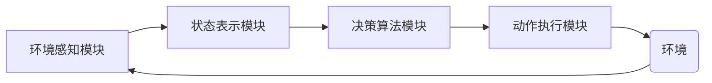

# AI Agent的实时决策系统设计

> 关键词：AI Agent、实时决策系统、决策算法、数学模型、项目实战

> 摘要：本文围绕AI Agent的实时决策系统设计展开深入探讨。首先介绍了该系统设计的背景，包括目的、预期读者等内容。接着详细阐述了核心概念、算法原理、数学模型等基础知识。通过项目实战展示了系统的具体实现过程，包括开发环境搭建、代码实现与解读。还探讨了实际应用场景，推荐了相关的工具和资源。最后对未来发展趋势与挑战进行总结，并提供常见问题解答和扩展阅读参考资料，旨在为相关领域的开发者和研究者提供全面且深入的技术指导。

## 1. 背景介绍 
### 1.1 目的和范围
在当今复杂多变的环境中，AI Agent需要具备实时做出合理决策的能力。实时决策系统设计的目的在于让AI Agent能够根据不断变化的环境信息，快速、准确地做出最优决策，以实现特定的目标。其范围涵盖了多个领域，如自动驾驶、游戏开发、智能机器人控制等。在自动驾驶领域，AI Agent需要实时根据路况、交通信号等信息决定车辆的行驶速度、方向等；在游戏开发中，AI Agent要根据游戏场景和对手的行动实时调整自己的策略；在智能机器人控制方面，机器人需要根据周围环境的变化实时做出移动、操作等决策。

### 1.2 预期读者
本文的预期读者主要包括人工智能领域的开发者、软件架构师、研究人员以及对AI Agent实时决策系统感兴趣的技术爱好者。开发者可以从本文中获取系统设计的详细思路和实现方法，用于实际项目开发；软件架构师能够借鉴相关架构设计理念，优化系统架构；研究人员可以在本文的基础上开展更深入的学术研究；技术爱好者则可以通过本文了解AI Agent实时决策系统的基本原理和应用场景。

### 1.3 文档结构概述
本文将按照以下结构进行阐述：首先介绍背景知识，包括目的、预期读者和文档结构概述等；接着讲解核心概念与联系，通过文本示意图和Mermaid流程图展示核心概念的原理和架构；然后详细阐述核心算法原理和具体操作步骤，并使用Python源代码进行说明；再介绍数学模型和公式，通过详细讲解和举例说明加深理解；通过项目实战展示系统的具体实现，包括开发环境搭建、源代码实现和代码解读；探讨实际应用场景；推荐相关的工具和资源；最后总结未来发展趋势与挑战，提供常见问题解答和扩展阅读参考资料。

### 1.4 术语表
#### 1.4.1 核心术语定义
- **AI Agent**：人工智能代理，是一种能够感知环境、做出决策并执行动作的实体。它可以是软件程序、机器人等。
- **实时决策系统**：能够在极短的时间内根据实时环境信息做出决策的系统。
- **决策算法**：用于指导AI Agent如何根据环境信息做出决策的算法，如强化学习算法、决策树算法等。

#### 1.4.2 相关概念解释
- **环境感知**：AI Agent通过各种传感器获取周围环境的信息，如摄像头获取图像信息、雷达获取距离信息等。
- **状态空间**：AI Agent所处环境的所有可能状态的集合。
- **动作空间**：AI Agent可以执行的所有可能动作的集合。

#### 1.4.3 缩略词列表
- **RL**：Reinforcement Learning，强化学习
- **MDP**：Markov Decision Process，马尔可夫决策过程

## 2. 核心概念与联系 

### 核心概念原理
AI Agent的实时决策系统主要基于环境感知、状态表示、决策算法和动作执行四个核心概念。环境感知是系统的输入部分，AI Agent通过各种传感器收集环境信息。状态表示是将感知到的环境信息转化为系统能够处理的状态向量，以便决策算法进行分析。决策算法根据当前状态选择最优的动作，常见的决策算法有强化学习算法、决策树算法等。动作执行是将决策算法选择的动作应用到实际环境中。

### 架构的文本示意图
```plaintext
+----------------+       +----------------+       +----------------+       +----------------+
| 环境感知模块   | ----> | 状态表示模块   | ----> | 决策算法模块   | ----> | 动作执行模块   |
+----------------+       +----------------+       +----------------+       +----------------+
```

### Mermaid流程图


## 3. 核心算法原理 & 具体操作步骤 

### 强化学习算法原理
强化学习是一种基于奖励机制的机器学习算法，AI Agent通过与环境进行交互，不断尝试不同的动作，根据环境给予的奖励信号来学习最优的策略。在强化学习中，通常使用马尔可夫决策过程（MDP）来描述环境和Agent的交互过程。

马尔可夫决策过程由一个四元组 $(S, A, P, R)$ 表示，其中：
- $S$ 是状态空间，即环境的所有可能状态的集合。
- $A$ 是动作空间，即Agent可以执行的所有可能动作的集合。
- $P(s'|s, a)$ 是状态转移概率，表示在状态 $s$ 下执行动作 $a$ 后转移到状态 $s'$ 的概率。
- $R(s, a)$ 是奖励函数，表示在状态 $s$ 下执行动作 $a$ 后获得的奖励。

Agent的目标是学习一个策略 $\pi(a|s)$，使得在长期的交互过程中获得的累积奖励最大。

### Python代码实现
```python
import numpy as np

# 定义状态空间和动作空间
state_space = 10
action_space = 3

# 初始化Q表
Q_table = np.zeros((state_space, action_space))

# 定义超参数
learning_rate = 0.1
discount_factor = 0.9
epsilon = 0.1
num_episodes = 1000

# 定义奖励函数
def reward_function(state, action):
    # 这里简单定义一个奖励函数，实际应用中需要根据具体问题进行设计
    if state == 5 and action == 1:
        return 1
    else:
        return 0

# 定义epsilon-greedy策略
def epsilon_greedy(state):
    if np.random.uniform(0, 1) < epsilon:
        return np.random.choice(action_space)
    else:
        return np.argmax(Q_table[state, :])

# 训练过程
for episode in range(num_episodes):
    state = np.random.randint(0, state_space)
    done = False
    while not done:
        action = epsilon_greedy(state)
        reward = reward_function(state, action)
        # 这里简单假设下一个状态是随机的，实际应用中需要根据状态转移概率计算
        next_state = np.random.randint(0, state_space)
        # Q表更新公式
        Q_table[state, action] = (1 - learning_rate) * Q_table[state, action] + \
                                 learning_rate * (reward + discount_factor * np.max(Q_table[next_state, :]))
        state = next_state
        if reward == 1:
            done = True

# 测试过程
test_state = 0
for _ in range(10):
    test_action = np.argmax(Q_table[test_state, :])
    print(f"State: {test_state}, Action: {test_action}")
    test_state = np.random.randint(0, state_space)
```

### 具体操作步骤
1. **初始化**：初始化状态空间、动作空间、Q表和超参数。
2. **训练过程**：
    - 随机选择一个初始状态。
    - 使用epsilon-greedy策略选择动作。
    - 执行动作，获取奖励和下一个状态。
    - 根据Q表更新公式更新Q表。
    - 重复上述步骤，直到达到终止条件。
3. **测试过程**：
    - 选择一个初始状态。
    - 根据Q表选择最优动作。
    - 输出状态和动作。
    - 更新状态，重复上述步骤。

## 4. 数学模型和公式 & 详细讲解 & 举例说明 

### 马尔可夫决策过程（MDP）
如前所述，MDP由四元组 $(S, A, P, R)$ 表示。状态转移概率 $P(s'|s, a)$ 描述了在状态 $s$ 下执行动作 $a$ 后转移到状态 $s'$ 的概率，满足：
$$\sum_{s' \in S} P(s'|s, a) = 1$$

奖励函数 $R(s, a)$ 表示在状态 $s$ 下执行动作 $a$ 后获得的奖励。

### 价值函数
在强化学习中，常用价值函数来评估状态或状态-动作对的价值。状态价值函数 $V^{\pi}(s)$ 表示在策略 $\pi$ 下从状态 $s$ 开始的期望累积奖励：
$$V^{\pi}(s) = \mathbb{E}_{\pi} \left[ \sum_{t=0}^{\infty} \gamma^t R(S_t, A_t) \big| S_0 = s \right]$$
其中，$\gamma$ 是折扣因子，用于平衡即时奖励和未来奖励的重要性。

状态-动作价值函数 $Q^{\pi}(s, a)$ 表示在策略 $\pi$ 下从状态 $s$ 执行动作 $a$ 后开始的期望累积奖励：
$$Q^{\pi}(s, a) = \mathbb{E}_{\pi} \left[ \sum_{t=0}^{\infty} \gamma^t R(S_t, A_t) \big| S_0 = s, A_0 = a \right]$$

### Q学习算法公式
Q学习是一种无模型的强化学习算法，用于学习最优的状态-动作价值函数 $Q^*(s, a)$。Q学习的更新公式为：
$$Q(s, a) \leftarrow Q(s, a) + \alpha \left[ r + \gamma \max_{a'} Q(s', a') - Q(s, a) \right]$$
其中，$\alpha$ 是学习率，$r$ 是即时奖励，$\gamma$ 是折扣因子，$s'$ 是下一个状态。

### 举例说明
假设有一个简单的网格世界，Agent的目标是从起点到达终点。状态空间 $S$ 是网格世界中的所有位置，动作空间 $A$ 是上下左右四个方向的移动。奖励函数 $R(s, a)$ 可以定义为：如果到达终点，奖励为1；否则，奖励为0。

初始时，Q表中的所有值都为0。Agent在每个状态下根据epsilon-greedy策略选择动作，执行动作后获得奖励和下一个状态，然后根据Q学习的更新公式更新Q表。经过多次训练，Q表中的值会逐渐收敛到最优的状态-动作价值函数。

## 5. 项目实战：代码实际案例和详细解释说明 

### 5.1  开发环境搭建
#### 安装Python
首先需要安装Python，可以从Python官方网站（https://www.python.org/downloads/）下载适合自己操作系统的Python版本。安装完成后，打开命令行工具，输入 `python --version` 检查Python是否安装成功。

#### 安装必要的库
在这个项目中，我们需要使用 `numpy` 库进行数值计算。可以使用以下命令安装 `numpy`：
```sh
pip install numpy
```

### 5.2  源代码详细实现和代码解读
```python
import numpy as np

# 定义状态空间和动作空间
state_space = 10
action_space = 3

# 初始化Q表
Q_table = np.zeros((state_space, action_space))

# 定义超参数
learning_rate = 0.1
discount_factor = 0.9
epsilon = 0.1
num_episodes = 1000

# 定义奖励函数
def reward_function(state, action):
    # 这里简单定义一个奖励函数，实际应用中需要根据具体问题进行设计
    if state == 5 and action == 1:
        return 1
    else:
        return 0

# 定义epsilon-greedy策略
def epsilon_greedy(state):
    if np.random.uniform(0, 1) < epsilon:
        return np.random.choice(action_space)
    else:
        return np.argmax(Q_table[state, :])

# 训练过程
for episode in range(num_episodes):
    state = np.random.randint(0, state_space)
    done = False
    while not done:
        action = epsilon_greedy(state)
        reward = reward_function(state, action)
        # 这里简单假设下一个状态是随机的，实际应用中需要根据状态转移概率计算
        next_state = np.random.randint(0, state_space)
        # Q表更新公式
        Q_table[state, action] = (1 - learning_rate) * Q_table[state, action] + \
                                 learning_rate * (reward + discount_factor * np.max(Q_table[next_state, :]))
        state = next_state
        if reward == 1:
            done = True

# 测试过程
test_state = 0
for _ in range(10):
    test_action = np.argmax(Q_table[test_state, :])
    print(f"State: {test_state}, Action: {test_action}")
    test_state = np.random.randint(0, state_space)
```

### 代码解读与分析
1. **导入必要的库**：使用 `import numpy as np` 导入 `numpy` 库，用于数值计算。
2. **定义状态空间和动作空间**：`state_space` 和 `action_space` 分别表示状态空间和动作空间的大小。
3. **初始化Q表**：使用 `np.zeros` 函数初始化Q表，Q表的大小为 `(state_space, action_space)`。
4. **定义超参数**：`learning_rate` 是学习率，`discount_factor` 是折扣因子，`epsilon` 是epsilon-greedy策略中的探索率，`num_episodes` 是训练的总轮数。
5. **定义奖励函数**：`reward_function` 函数根据当前状态和动作返回相应的奖励。
6. **定义epsilon-greedy策略**：`epsilon_greedy` 函数根据epsilon-greedy策略选择动作，以一定的概率进行探索，以一定的概率选择Q表中值最大的动作。
7. **训练过程**：使用 `for` 循环进行多轮训练，每一轮训练中，随机选择一个初始状态，然后使用epsilon-greedy策略选择动作，执行动作后获取奖励和下一个状态，根据Q表更新公式更新Q表，直到达到终止条件。
8. **测试过程**：选择一个初始状态，根据Q表选择最优动作，输出状态和动作，更新状态，重复上述步骤。

## 6. 实际应用场景 
### 自动驾驶
在自动驾驶领域，AI Agent需要实时根据路况、交通信号、其他车辆和行人的位置等信息做出决策，如加速、减速、转弯等。实时决策系统可以帮助自动驾驶车辆在复杂的交通环境中安全、高效地行驶。

### 游戏开发
在游戏开发中，AI Agent可以作为游戏中的对手或队友，实时根据游戏场景和玩家的行动做出决策。例如，在策略游戏中，AI Agent可以根据地图信息、资源情况和敌方部队的位置等信息制定战略和战术。

### 智能机器人控制
智能机器人在执行任务时需要实时根据周围环境的变化做出决策，如避开障碍物、抓取物体等。实时决策系统可以帮助机器人在不同的环境中灵活地执行任务。

### 金融交易
在金融交易领域，AI Agent可以实时根据市场行情、新闻资讯等信息做出交易决策，如买入、卖出、持有等。实时决策系统可以帮助投资者在瞬息万变的金融市场中获取最大的收益。

## 7. 工具和资源推荐
### 7.1 学习资源推荐
#### 7.1.1 书籍推荐
- 《Reinforcement Learning: An Introduction》：这本书是强化学习领域的经典教材，详细介绍了强化学习的基本概念、算法和应用。
- 《Artificial Intelligence: A Modern Approach》：这本书全面介绍了人工智能的各个领域，包括机器学习、自然语言处理、计算机视觉等，其中也包含了AI Agent和决策系统的相关内容。

#### 7.1.2 在线课程
- Coursera上的《Reinforcement Learning Specialization》：由知名教授授课，系统地介绍了强化学习的理论和实践。
- edX上的《Artificial Intelligence》：涵盖了人工智能的多个方面，包括AI Agent和决策系统的设计。

#### 7.1.3 技术博客和网站
- OpenAI博客（https://openai.com/blog/）：提供了人工智能领域的最新研究成果和技术动态。
- Medium上的AI相关博客：有很多关于AI Agent和实时决策系统的技术文章。

### 7.2 开发工具框架推荐
#### 7.2.1 IDE和编辑器
- PyCharm：是一款专业的Python集成开发环境，提供了丰富的代码编辑、调试和项目管理功能。
- Jupyter Notebook：是一个交互式的开发环境，适合进行数据分析和机器学习实验。

#### 7.2.2 调试和性能分析工具
- TensorBoard：是TensorFlow提供的可视化工具，可以用于调试和分析深度学习模型的训练过程。
- Py-Spy：是一个用于分析Python代码性能的工具，可以帮助开发者找出代码中的性能瓶颈。

#### 7.2.3 相关框架和库
- TensorFlow：是一个开源的深度学习框架，提供了丰富的工具和库，可用于实现AI Agent的实时决策系统。
- PyTorch：是另一个流行的深度学习框架，具有简洁易用的特点，适合快速开发和实验。

### 7.3 相关论文著作推荐
#### 7.3.1 经典论文
- “Q-learning” by Christopher J. C. H. Watkins and Peter Dayan：这篇论文提出了Q学习算法，是强化学习领域的经典之作。
- “Markov Decision Processes” by Richard Bellman：这篇论文介绍了马尔可夫决策过程的基本概念和理论，为强化学习的发展奠定了基础。

#### 7.3.2 最新研究成果
- 每年的NeurIPS、ICML等顶级机器学习会议上都会有关于AI Agent和实时决策系统的最新研究成果发表。
- arXiv预印本平台上也有很多关于该领域的最新研究论文。

#### 7.3.3 应用案例分析
- 《AI in Action》：这本书介绍了人工智能在各个领域的应用案例，包括AI Agent的实时决策系统在自动驾驶、游戏开发等领域的应用。

## 8. 总结：未来发展趋势与挑战
### 未来发展趋势
- **多智能体协同决策**：未来的AI Agent将不仅仅是单个智能体的决策，而是多个智能体之间的协同决策。例如，在自动驾驶领域，多辆自动驾驶车辆之间需要协同决策，以提高交通效率和安全性。
- **结合人类知识和经验**：将人类的知识和经验融入到AI Agent的决策过程中，可以提高决策的准确性和可靠性。例如，在医疗诊断领域，AI Agent可以结合医生的经验和医学知识进行诊断。
- **自适应决策**：AI Agent需要具备自适应决策的能力，能够根据环境的变化实时调整决策策略。例如，在气候变化监测中，AI Agent需要根据气候数据的变化实时调整监测策略。

### 挑战
- **实时性要求**：实时决策系统对决策的实时性要求很高，需要在极短的时间内做出决策。这对算法的效率和硬件的性能提出了很高的要求。
- **不确定性处理**：现实环境中存在很多不确定性因素，如传感器噪声、环境变化等。AI Agent需要能够有效地处理这些不确定性，做出合理的决策。
- **可解释性**：AI Agent的决策过程往往是黑盒的，难以解释决策的原因。在一些关键领域，如医疗、金融等，需要AI Agent的决策具有可解释性，以便用户信任和接受。

## 9. 附录：常见问题与解答
### 问题1：如何选择合适的决策算法？
解答：选择合适的决策算法需要考虑多个因素，如问题的复杂度、实时性要求、数据的可用性等。如果问题比较简单，可以选择一些传统的决策算法，如决策树算法；如果问题比较复杂，需要考虑使用强化学习等机器学习算法。

### 问题2：如何处理实时决策系统中的不确定性？
解答：可以采用概率模型来处理不确定性，如贝叶斯网络、马尔可夫决策过程等。此外，还可以使用传感器融合技术，将多个传感器的数据进行融合，提高环境感知的准确性。

### 问题3：如何提高实时决策系统的效率？
解答：可以采用优化算法来提高决策算法的效率，如剪枝算法、近似算法等。此外，还可以使用硬件加速技术，如GPU、FPGA等，提高系统的计算能力。

## 10. 扩展阅读 & 参考资料
### 扩展阅读
- 《Deep Reinforcement Learning Hands-On》：深入介绍了深度强化学习的原理和实践，适合进一步学习强化学习算法。
- 《Artificial Intelligence for Games》：专门介绍了人工智能在游戏开发中的应用，包括AI Agent的设计和决策系统的实现。

### 参考资料
- Sutton, R. S., & Barto, A. G. (2018). Reinforcement Learning: An Introduction. MIT Press.
- Russell, S. J., & Norvig, P. (2016). Artificial Intelligence: A Modern Approach. Pearson.

作者：AI天才研究院/AI Genius Institute & 禅与计算机程序设计艺术 /Zen And The Art of Computer Programming