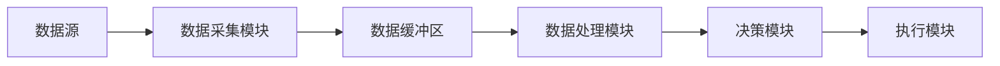

# AI Agent的实时数据处理技术

> 关键词：AI Agent、实时数据处理、数据流、算法原理、应用场景

> 摘要：本文深入探讨了AI Agent的实时数据处理技术。首先介绍了相关背景，包括目的、预期读者等内容。接着详细阐述了核心概念与联系，分析了核心算法原理并给出Python代码示例，同时讲解了数学模型和公式。通过项目实战展示了代码的实际应用和解读，探讨了实际应用场景。还推荐了学习资源、开发工具框架以及相关论文著作。最后总结了未来发展趋势与挑战，并给出常见问题解答和扩展阅读参考资料，旨在帮助读者全面了解AI Agent实时数据处理技术。

## 1. 背景介绍 
### 1.1 目的和范围
随着人工智能技术的飞速发展，AI Agent在各个领域的应用越来越广泛。实时数据处理是AI Agent能够及时做出准确决策的关键环节。本文的目的在于全面深入地介绍AI Agent的实时数据处理技术，涵盖从基本概念、算法原理到实际应用等多个方面，帮助读者系统地了解该领域的核心知识和技术要点。范围包括对实时数据处理技术的理论分析、算法实现以及在实际项目中的应用案例。

### 1.2 预期读者
本文预期读者包括人工智能领域的研究人员、开发者、数据科学家以及对AI Agent和实时数据处理技术感兴趣的技术爱好者。对于初学者，本文可以作为入门指南，帮助他们建立起对该领域的基本认识；对于有一定经验的专业人士，本文提供的深入分析和实际案例也能为他们的工作和研究提供有价值的参考。

### 1.3 文档结构概述
本文将按照以下结构进行阐述：首先介绍背景信息，让读者了解文章的目的和适用范围；接着讲解核心概念与联系，通过文本示意图和Mermaid流程图清晰展示相关原理和架构；然后详细分析核心算法原理并给出具体操作步骤，同时结合Python源代码进行说明；再介绍数学模型和公式，并通过举例进行详细讲解；之后通过项目实战展示代码的实际应用和详细解释；探讨实际应用场景，让读者了解该技术在不同领域的应用方式；推荐学习资源、开发工具框架以及相关论文著作；最后总结未来发展趋势与挑战，给出常见问题解答和扩展阅读参考资料。

### 1.4 术语表
#### 1.4.1 核心术语定义
- **AI Agent**：人工智能代理，是一种能够感知环境、根据感知信息做出决策并采取行动以实现特定目标的智能实体。
- **实时数据处理**：指在数据产生的同时对其进行即时处理和分析，以获取有价值的信息并及时做出响应。
- **数据流**：连续不断产生和传输的数据序列，通常具有实时性和无限性的特点。
- **事件驱动**：一种编程范式，程序的执行流程由事件的发生来决定，当特定事件发生时，相应的处理程序会被触发执行。

#### 1.4.2 相关概念解释
- **批处理与实时处理**：批处理是将一段时间内收集到的数据集中起来进行处理，处理结果具有一定的延迟；而实时处理则是对数据进行即时处理，能够快速响应数据的变化。
- **数据缓冲区**：用于临时存储数据的区域，在实时数据处理中，数据缓冲区可以起到平衡数据产生和处理速度差异的作用。
- **数据过滤**：从大量数据中筛选出符合特定条件的数据，以减少后续处理的工作量。

#### 1.4.3 缩略词列表
- **ETL**：Extract, Transform, Load，即数据抽取、转换和加载，是将数据从源系统提取出来，经过转换处理后加载到目标系统的过程。
- **KPI**：Key Performance Indicator，关键绩效指标，用于衡量业务流程或系统性能的重要指标。

## 2. 核心概念与联系 

### 核心概念原理
AI Agent的实时数据处理涉及多个核心概念，主要包括数据采集、数据处理和决策执行。数据采集是指从各种数据源（如传感器、网络日志、数据库等）实时获取数据；数据处理则是对采集到的数据进行清洗、转换、分析等操作，以提取有价值的信息；决策执行是根据处理后的数据，AI Agent做出相应的决策并采取行动。

### 架构的文本示意图
```plaintext
+---------------------+
|     数据源           |
| (传感器、日志等)    |
+---------------------+
        |
        v
+---------------------+
|    数据采集模块      |
+---------------------+
        |
        v
+---------------------+
|    数据缓冲区        |
+---------------------+
        |
        v
+---------------------+
|    数据处理模块      |
| (清洗、转换、分析)  |
+---------------------+
        |
        v
+---------------------+
|    决策模块          |
+---------------------+
        |
        v
+---------------------+
|    执行模块          |
| (采取行动)          |
+---------------------+
```

### Mermaid流程图


## 3. 核心算法原理 & 具体操作步骤 

### 算法原理
在AI Agent的实时数据处理中，常用的算法包括流式数据处理算法和机器学习算法。流式数据处理算法用于处理连续不断的数据流，常见的有滑动窗口算法、过滤器算法等；机器学习算法则用于对数据进行分析和预测，如决策树、神经网络等。

### 具体操作步骤
1. **数据采集**：使用合适的工具和技术从数据源实时获取数据。例如，对于传感器数据，可以使用传感器接口库进行数据读取；对于网络日志数据，可以使用日志收集工具进行采集。
2. **数据存储**：将采集到的数据存储到数据缓冲区中，以便后续处理。数据缓冲区可以使用内存数据库或消息队列来实现。
3. **数据处理**：对数据缓冲区中的数据进行清洗、转换和分析。清洗是去除数据中的噪声和错误数据；转换是将数据转换为适合分析的格式；分析则是使用流式数据处理算法和机器学习算法对数据进行处理。
4. **决策制定**：根据数据处理的结果，AI Agent使用预定义的规则或机器学习模型做出决策。
5. **行动执行**：根据决策结果，AI Agent采取相应的行动，如控制设备、发送通知等。

### Python源代码示例
```python
import random
from collections import deque

# 模拟数据采集
def data_collection():
    return random.randint(0, 100)

# 数据缓冲区
data_buffer = deque(maxlen=10)

# 数据处理函数
def data_processing(data):
    # 简单的数据清洗：去除小于10的数据
    if data >= 10:
        data_buffer.append(data)
        # 简单的数据分析：计算平均值
        if len(data_buffer) > 0:
            average = sum(data_buffer) / len(data_buffer)
            return average
    return None

# 决策制定函数
def decision_making(average):
    if average is not None and average > 50:
        return "采取行动A"
    else:
        return "采取行动B"

# 执行函数
def action_execution(decision):
    print(f"执行决策: {decision}")

# 主循环
for _ in range(20):
    data = data_collection()
    average = data_processing(data)
    decision = decision_making(average)
    action_execution(decision)
```

## 4. 数学模型和公式 & 详细讲解 & 举例说明 

### 滑动窗口算法的数学模型
滑动窗口算法是流式数据处理中常用的算法，用于在数据流上进行局部计算。假设数据流为 $x_1, x_2, \cdots, x_n$，窗口大小为 $w$，则在时刻 $t$ 的窗口内的数据为 $x_{t - w + 1}, x_{t - w + 2}, \cdots, x_t$。

### 窗口内数据的平均值计算公式
窗口内数据的平均值 $\bar{x}_t$ 可以通过以下公式计算：
$$\bar{x}_t = \frac{1}{w} \sum_{i = t - w + 1}^{t} x_i$$

### 举例说明
假设数据流为 $[10, 20, 30, 40, 50, 60, 70, 80, 90, 100]$，窗口大小 $w = 3$。

- 当 $t = 3$ 时，窗口内的数据为 $[10, 20, 30]$，平均值 $\bar{x}_3 = \frac{10 + 20 + 30}{3} = 20$。
- 当 $t = 4$ 时，窗口内的数据为 $[20, 30, 40]$，平均值 $\bar{x}_4 = \frac{20 + 30 + 40}{3} = 30$。

### Python代码实现滑动窗口算法
```python
data_stream = [10, 20, 30, 40, 50, 60, 70, 80, 90, 100]
window_size = 3
for i in range(len(data_stream)):
    if i >= window_size - 1:
        window = data_stream[i - window_size + 1:i + 1]
        average = sum(window) / window_size
        print(f"时刻 {i + 1} 的窗口平均值: {average}")
```

## 5. 项目实战：代码实际案例和详细解释说明 

### 5.1  开发环境搭建
- **操作系统**：推荐使用Linux系统，如Ubuntu 20.04。
- **编程语言**：Python 3.8及以上版本。
- **开发工具**：可以使用PyCharm或VS Code作为集成开发环境。
- **相关库**：安装`numpy`、`pandas`、`scikit-learn`等库，用于数据处理和机器学习。可以使用以下命令进行安装：
```sh
pip install numpy pandas scikit-learn
```

### 5.2  源代码详细实现和代码解读
以下是一个基于Python的实时数据处理项目示例，模拟了一个传感器数据的实时处理过程。

```python
import numpy as np
import pandas as pd
from sklearn.linear_model import LinearRegression

# 模拟传感器数据生成
def generate_sensor_data():
    # 生成随机数据
    time = np.linspace(0, 10, 100)
    temperature = 20 + 5 * np.sin(time) + np.random.normal(0, 1, 100)
    data = pd.DataFrame({'time': time, 'temperature': temperature})
    return data

# 实时数据处理函数
def real_time_data_processing(data):
    # 数据清洗：去除缺失值
    data = data.dropna()
    # 特征工程：提取时间特征
    X = data[['time']]
    y = data['temperature']
    # 训练线性回归模型
    model = LinearRegression()
    model.fit(X, y)
    # 预测未来温度
    future_time = np.array([[11]])
    predicted_temperature = model.predict(future_time)
    return predicted_temperature

# 主函数
def main():
    sensor_data = generate_sensor_data()
    predicted_temp = real_time_data_processing(sensor_data)
    print(f"预测的未来温度: {predicted_temp[0]}")

if __name__ == "__main__":
    main()
```

### 代码解读与分析
1. **数据生成**：`generate_sensor_data`函数模拟了传感器数据的生成，生成了一个包含时间和温度信息的DataFrame。
2. **数据处理**：`real_time_data_processing`函数对生成的数据进行清洗，去除缺失值，并进行特征工程，提取时间作为特征。然后使用线性回归模型进行训练，并预测未来的温度。
3. **主函数**：`main`函数调用数据生成和数据处理函数，并打印出预测的未来温度。

## 6. 实际应用场景 
### 工业物联网
在工业物联网中，AI Agent的实时数据处理技术可以用于监控设备状态、预测设备故障。通过实时采集设备的传感器数据，如温度、压力、振动等，AI Agent可以对数据进行实时分析，及时发现设备的异常情况，并提前采取维护措施，减少设备故障停机时间，提高生产效率。

### 金融交易
在金融交易领域，实时数据处理技术可以帮助AI Agent快速分析市场行情、预测价格走势。通过实时获取股票、期货等金融产品的交易数据，AI Agent可以根据预设的交易策略进行实时决策，实现自动化交易，提高交易效率和收益。

### 智能交通
在智能交通系统中，AI Agent可以实时处理交通流量数据、车辆位置数据等，实现交通信号灯的智能控制、车辆路径规划等功能。通过实时分析交通数据，AI Agent可以优化交通流量，减少交通拥堵，提高交通运输效率。

### 医疗健康
在医疗健康领域，实时数据处理技术可以用于监测患者的生命体征、疾病诊断等。通过实时采集患者的心电图、血压、血糖等数据，AI Agent可以对数据进行实时分析，及时发现患者的健康问题，并提供相应的治疗建议。

## 7. 工具和资源推荐
### 7.1 学习资源推荐
#### 7.1.1 书籍推荐
- 《Python数据分析实战》：本书介绍了使用Python进行数据分析的方法和技巧，包括数据清洗、数据可视化、机器学习等内容，适合初学者入门。
- 《Streaming Systems: The What, Where, When, and How of Large-Scale Data Processing》：详细介绍了流式数据处理的原理、算法和系统架构，是学习实时数据处理的经典书籍。
- 《Artificial Intelligence: A Modern Approach》：全面介绍了人工智能的基本概念、算法和应用，对于理解AI Agent的原理和技术有很大帮助。

#### 7.1.2 在线课程
- Coursera上的“Machine Learning”课程：由斯坦福大学教授Andrew Ng主讲，是机器学习领域的经典课程，涵盖了机器学习的基本算法和应用。
- edX上的“Data Science MicroMasters Program”：提供了全面的数据科学课程，包括数据处理、数据分析、机器学习等内容。
- Udemy上的“Python for Data Science and Machine Learning Bootcamp”：通过实际项目介绍了使用Python进行数据科学和机器学习的方法和技巧。

#### 7.1.3 技术博客和网站
- Towards Data Science：一个专注于数据科学和机器学习的技术博客，提供了大量的技术文章和案例分析。
- Medium上的AI相关专栏：如“AI in Plain English”、“The AI Blog”等，分享了人工智能领域的最新技术和研究成果。
- Kaggle：一个数据科学竞赛平台，提供了丰富的数据集和竞赛项目，可以通过参与竞赛提高自己的技术水平。

### 7.2 开发工具框架推荐
#### 7.2.1 IDE和编辑器
- PyCharm：一款专业的Python集成开发环境，提供了代码编辑、调试、版本控制等功能，适合Python开发。
- VS Code：一款轻量级的代码编辑器，支持多种编程语言，通过安装插件可以实现Python开发的各种功能。
- Jupyter Notebook：一个交互式的开发环境，适合数据探索和分析，支持Python、R等多种编程语言。

#### 7.2.2 调试和性能分析工具
- Py-Spy：一个Python性能分析工具，可以实时监测Python程序的CPU使用情况和函数调用情况。
- cProfile：Python标准库中的性能分析模块，可以分析Python程序的运行时间和函数调用次数。
- PDB：Python标准库中的调试模块，可以用于调试Python程序，设置断点、查看变量值等。

#### 7.2.3 相关框架和库
- Apache Flink：一个开源的流式数据处理框架，支持高吞吐量、低延迟的实时数据处理。
- Kafka：一个分布式消息队列系统，用于处理高吞吐量的数据流，常与实时数据处理框架结合使用。
- TensorFlow：一个开源的机器学习框架，提供了丰富的机器学习算法和工具，可用于AI Agent的模型训练和推理。

### 7.3 相关论文著作推荐
#### 7.3.1 经典论文
- “MapReduce: Simplified Data Processing on Large Clusters”：介绍了MapReduce编程模型，为大规模数据处理提供了一种简单有效的方法。
- “The Google File System”：描述了Google的分布式文件系统，为分布式数据存储和处理提供了基础。
- “ResNet: Deep Residual Learning for Image Recognition”：提出了残差网络（ResNet），解决了深度神经网络训练中的梯度消失问题。

#### 7.3.2 最新研究成果
- “Transformers: State-of-the-Art Natural Language Processing”：介绍了Transformer架构，在自然语言处理领域取得了巨大成功。
- “Graph Neural Networks: A Review of Methods and Applications”：对图神经网络的方法和应用进行了综述，为图数据的处理提供了新的思路。
- “Meta-Learning: A Survey”：对元学习的概念、方法和应用进行了全面的综述，为快速学习和自适应学习提供了理论基础。

#### 7.3.3 应用案例分析
- “Industrial Internet of Things (IIoT): Challenges, Opportunities, and Directions”：分析了工业物联网的挑战、机遇和发展方向，提供了工业物联网应用的实际案例。
- “Real-Time Analytics in Financial Services: Challenges and Solutions”：探讨了金融服务领域实时数据分析的挑战和解决方案，介绍了实时数据处理在金融交易中的应用案例。
- “Intelligent Transportation Systems: A Review of Recent Developments”：对智能交通系统的最新发展进行了综述，包括交通流量预测、智能驾驶等应用案例。

## 8. 总结：未来发展趋势与挑战
### 未来发展趋势
- **与边缘计算的结合**：将AI Agent的实时数据处理能力与边缘计算相结合，在数据产生的源头进行实时处理和分析，减少数据传输延迟，提高系统的响应速度和可靠性。
- **多模态数据处理**：随着传感器技术的发展，未来AI Agent将能够处理更多类型的多模态数据，如图像、语音、视频等，从而实现更加复杂和智能的决策。
- **强化学习的应用**：强化学习可以使AI Agent在动态环境中通过与环境的交互不断学习和优化决策策略，未来在实时数据处理领域的应用将越来越广泛。

### 挑战
- **数据隐私和安全**：实时数据处理涉及大量的敏感数据，如何保障数据的隐私和安全是一个重要的挑战。需要采用先进的加密技术和访问控制机制，防止数据泄露和恶意攻击。
- **算法复杂度和计算资源**：随着数据量的不断增加和算法的不断复杂，实时数据处理对计算资源的需求也越来越高。如何在有限的计算资源下实现高效的实时数据处理是一个亟待解决的问题。
- **模型可解释性**：在一些关键领域，如医疗、金融等，AI Agent的决策需要具有可解释性。如何提高模型的可解释性，让用户理解模型的决策过程和依据，是未来需要研究的重要方向。

## 9. 附录：常见问题与解答
### 问题1：实时数据处理和批处理有什么区别？
实时数据处理是对数据进行即时处理，能够快速响应数据的变化，适用于对时效性要求较高的场景；而批处理是将一段时间内收集到的数据集中起来进行处理，处理结果具有一定的延迟，适用于对时效性要求不高的场景。

### 问题2：如何选择合适的实时数据处理框架？
选择合适的实时数据处理框架需要考虑多个因素，如数据处理的吞吐量、延迟要求、数据类型、编程难度等。例如，Apache Flink适用于高吞吐量、低延迟的实时数据处理；Kafka Streams则更适合简单的实时数据处理任务。

### 问题3：如何保证实时数据处理的准确性？
保证实时数据处理的准确性需要从多个方面入手，包括数据采集的准确性、数据清洗和预处理的有效性、模型训练的合理性等。同时，还需要进行实时监测和评估，及时发现和纠正处理过程中的错误。

### 问题4：AI Agent的实时数据处理技术在实际应用中面临哪些挑战？
AI Agent的实时数据处理技术在实际应用中面临的数据隐私和安全、算法复杂度和计算资源、模型可解释性等挑战，需要采取相应的措施进行解决。

## 10. 扩展阅读 & 参考资料
- 《大数据技术原理与应用》
- 《深度学习》（Ian Goodfellow等著）
- “https://www.oreilly.com/library/view/streaming-systems/9781491983867/”
- “https://www.tensorflow.org/”
- “https://flink.apache.org/”

作者：AI天才研究院/AI Genius Institute & 禅与计算机程序设计艺术 /Zen And The Art of Computer Programming