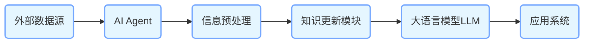

# AI Agent的实时知识更新：保持LLM信息的时效性

> 关键词：AI Agent、实时知识更新、大语言模型（LLM）、信息时效性、知识管理

> 摘要：本文聚焦于AI Agent的实时知识更新，旨在探讨如何保持大语言模型（LLM）信息的时效性。首先介绍了相关背景，包括目的、预期读者、文档结构和术语表。接着阐述了核心概念与联系，给出了原理和架构的示意图与流程图。详细讲解了核心算法原理及具体操作步骤，使用Python代码进行说明。通过数学模型和公式深入剖析，并举例说明。在项目实战部分，进行了开发环境搭建、源代码实现与解读。探讨了实际应用场景，推荐了学习资源、开发工具框架和相关论文著作。最后总结了未来发展趋势与挑战，提供了常见问题解答和扩展阅读参考资料，为解决LLM信息时效性问题提供了全面的技术指导。

## 1. 背景介绍 
### 1.1 目的和范围
随着人工智能技术的飞速发展，大语言模型（LLM）在自然语言处理等多个领域取得了显著的成果。然而，LLM的知识往往存在时效性问题，其训练数据通常具有一定的时间局限性，无法及时反映最新的信息。AI Agent作为一种能够自主执行任务的智能实体，可以通过实时知识更新来弥补LLM的这一不足。本文的目的在于深入探讨如何利用AI Agent实现LLM信息的实时更新，以保持其信息的时效性。

本文的范围涵盖了AI Agent实时知识更新的核心概念、算法原理、数学模型、项目实战、实际应用场景以及相关的工具和资源推荐等方面，旨在为研究人员和开发者提供全面的技术参考。

### 1.2 预期读者
本文预期读者包括人工智能领域的研究人员、开发者、数据科学家、软件工程师以及对AI Agent和LLM技术感兴趣的爱好者。这些读者希望深入了解如何解决LLM信息时效性问题，掌握AI Agent实时知识更新的技术方法。

### 1.3 文档结构概述
本文共分为十个部分。第一部分为背景介绍，阐述了文章的目的、预期读者、文档结构和术语表。第二部分介绍核心概念与联系，包括相关概念的原理和架构，并给出示意图和流程图。第三部分详细讲解核心算法原理和具体操作步骤，使用Python代码进行说明。第四部分通过数学模型和公式深入剖析，并举例说明。第五部分进行项目实战，包括开发环境搭建、源代码实现与解读。第六部分探讨实际应用场景。第七部分推荐学习资源、开发工具框架和相关论文著作。第八部分总结未来发展趋势与挑战。第九部分提供常见问题解答。第十部分给出扩展阅读和参考资料。

### 1.4 术语表
#### 1.4.1 核心术语定义
- **AI Agent**：一种能够感知环境、做出决策并采取行动以实现特定目标的智能实体。它可以与外部环境进行交互，自主执行各种任务。
- **大语言模型（LLM）**：基于大量文本数据进行训练的语言模型，能够生成自然语言文本，在语言理解和生成方面具有强大的能力。
- **实时知识更新**：指及时获取最新的知识信息，并将其融入到系统中，以保证系统所使用的知识具有时效性。

#### 1.4.2 相关概念解释
- **知识图谱**：一种以图的形式表示知识的结构化数据模型，用于存储和管理知识，方便知识的查询和推理。
- **知识蒸馏**：将大型模型的知识迁移到小型模型中的技术，以提高小型模型的性能。
- **增量学习**：在已有模型的基础上，不断学习新的数据，以更新模型的参数，而无需重新训练整个模型。

#### 1.4.3 缩略词列表
- **LLM**：Large Language Model（大语言模型）
- **API**：Application Programming Interface（应用程序编程接口）
- **NLP**：Natural Language Processing（自然语言处理）

## 2. 核心概念与联系 

### 核心概念原理
AI Agent的实时知识更新的核心原理是通过与外部数据源进行交互，获取最新的知识信息，并将这些信息融入到LLM中。具体来说，AI Agent可以利用网络爬虫技术从互联网上获取最新的新闻、文章等文本信息，也可以通过调用各种API接口获取专业领域的最新数据。然后，对获取到的信息进行预处理，如清洗、分类、标注等，将其转化为适合LLM处理的格式。最后，采用增量学习或知识蒸馏等技术将新的知识信息融入到LLM中，实现知识的实时更新。

### 架构示意图


### 架构说明
- **外部数据源**：包括互联网、专业数据库、API接口等，是获取最新知识信息的来源。
- **AI Agent**：负责与外部数据源进行交互，获取信息，并将其传递给信息预处理模块。
- **信息预处理**：对获取到的信息进行清洗、分类、标注等处理，使其适合LLM处理。
- **知识更新模块**：采用增量学习或知识蒸馏等技术将新的知识信息融入到LLM中。
- **大语言模型LLM**：经过知识更新后，为应用系统提供更具时效性的知识服务。
- **应用系统**：使用更新后的LLM进行各种自然语言处理任务，如问答系统、文本生成等。

## 3. 核心算法原理 & 具体操作步骤 

### 核心算法原理
这里主要介绍基于增量学习的知识更新算法原理。增量学习的核心思想是在已有模型的基础上，不断学习新的数据，以更新模型的参数。假设已有LLM的参数为 $\theta_0$，新获取的知识数据为 $D_{new}$，我们的目标是通过对 $D_{new}$ 进行学习，更新模型的参数为 $\theta_1$。

具体来说，我们可以使用梯度下降算法来更新模型的参数。梯度下降算法的基本思想是沿着损失函数的负梯度方向更新模型的参数，以最小化损失函数。损失函数 $L(\theta)$ 衡量了模型在数据上的预测误差，我们的目标是找到一组参数 $\theta$ 使得 $L(\theta)$ 最小。

### Python代码实现
```python
import torch
import torch.nn as nn
import torch.optim as optim

# 假设已有LLM模型
class LLM(nn.Module):
    def __init__(self):
        super(LLM, self).__init__()
        # 简单示例，实际的LLM结构会更复杂
        self.fc = nn.Linear(100, 10)

    def forward(self, x):
        return self.fc(x)

# 初始化LLM模型
model = LLM()

# 定义损失函数和优化器
criterion = nn.CrossEntropyLoss()
optimizer = optim.SGD(model.parameters(), lr=0.01)

# 模拟新的知识数据
new_data = torch.randn(100, 100)
new_labels = torch.randint(0, 10, (100,))

# 增量学习过程
num_epochs = 10
for epoch in range(num_epochs):
    # 前向传播
    outputs = model(new_data)
    loss = criterion(outputs, new_labels)

    # 反向传播和优化
    optimizer.zero_grad()
    loss.backward()
    optimizer.step()

    print(f'Epoch {epoch+1}/{num_epochs}, Loss: {loss.item()}')
```

### 具体操作步骤
1. **数据获取**：AI Agent通过网络爬虫或API接口从外部数据源获取最新的知识信息。
2. **数据预处理**：对获取到的信息进行清洗、分类、标注等处理，将其转化为适合LLM处理的格式。
3. **模型加载**：加载已有LLM模型。
4. **增量学习**：使用新的知识数据对LLM模型进行增量学习，更新模型的参数。
5. **模型保存**：保存更新后的LLM模型，以便后续使用。

## 4. 数学模型和公式 & 详细讲解 & 举例说明 

### 数学模型
假设已有LLM的参数为 $\theta_0$，新获取的知识数据为 $D_{new}=\{(x_i, y_i)\}_{i=1}^{n}$，其中 $x_i$ 是输入数据，$y_i$ 是对应的标签。我们的目标是通过对 $D_{new}$ 进行学习，更新模型的参数为 $\theta_1$。

损失函数 $L(\theta)$ 可以定义为交叉熵损失函数：
$$L(\theta)=-\frac{1}{n}\sum_{i=1}^{n}\sum_{j=1}^{m}y_{ij}\log(p_{ij}(\theta))$$
其中，$m$ 是类别数，$y_{ij}$ 是第 $i$ 个样本属于第 $j$ 类的真实标签（0或1），$p_{ij}(\theta)$ 是模型在参数 $\theta$ 下对第 $i$ 个样本属于第 $j$ 类的预测概率。

### 详细讲解
梯度下降算法的更新公式为：
$$\theta_{t+1}=\theta_t-\alpha\nabla L(\theta_t)$$
其中，$\theta_t$ 是第 $t$ 次迭代时的模型参数，$\alpha$ 是学习率，$\nabla L(\theta_t)$ 是损失函数 $L(\theta)$ 在 $\theta_t$ 处的梯度。

在增量学习过程中，我们不断重复上述更新过程，直到损失函数收敛或达到预设的迭代次数。

### 举例说明
假设我们有一个简单的二分类问题，输入数据 $x$ 是一个二维向量，标签 $y$ 是0或1。已有LLM模型的参数 $\theta_0$ 是一个长度为3的向量。新获取的知识数据有10个样本，我们使用交叉熵损失函数和梯度下降算法对模型进行增量学习。

首先，我们计算损失函数 $L(\theta_0)$ 及其梯度 $\nabla L(\theta_0)$。然后，根据梯度下降算法的更新公式，更新模型的参数为 $\theta_1=\theta_0-\alpha\nabla L(\theta_0)$。重复这个过程，直到损失函数收敛。

## 5. 项目实战：代码实际案例和详细解释说明 

### 5.1  开发环境搭建
1. **安装Python**：建议使用Python 3.7及以上版本，可以从Python官方网站（https://www.python.org/downloads/）下载并安装。
2. **安装深度学习框架**：本文使用PyTorch作为深度学习框架，可以使用以下命令进行安装：
```bash
pip install torch torchvision
```
3. **安装其他依赖库**：根据具体需求，安装其他必要的依赖库，如`requests`用于网络请求，`beautifulsoup4`用于网页解析等。
```bash
pip install requests beautifulsoup4
```

### 5.2  源代码详细实现和代码解读
```python
import requests
from bs4 import BeautifulSoup
import torch
import torch.nn as nn
import torch.optim as optim

# 定义LLM模型
class LLM(nn.Module):
    def __init__(self):
        super(LLM, self).__init__()
        # 简单示例，实际的LLM结构会更复杂
        self.fc = nn.Linear(100, 10)

    def forward(self, x):
        return self.fc(x)

# 数据获取函数
def get_new_data():
    url = 'https://example.com/news'  # 替换为实际的新闻网站URL
    response = requests.get(url)
    soup = BeautifulSoup(response.text, 'html.parser')
    # 假设新闻文本存储在<p>标签中
    news_texts = [p.text for p in soup.find_all('p')]
    # 简单示例，将文本转换为随机向量
    new_data = [torch.randn(100) for _ in news_texts]
    new_labels = [torch.randint(0, 10, (1,)) for _ in news_texts]
    return new_data, new_labels

# 主函数
def main():
    # 初始化LLM模型
    model = LLM()

    # 定义损失函数和优化器
    criterion = nn.CrossEntropyLoss()
    optimizer = optim.SGD(model.parameters(), lr=0.01)

    # 获取新的知识数据
    new_data, new_labels = get_new_data()

    # 增量学习过程
    num_epochs = 10
    for epoch in range(num_epochs):
        for i in range(len(new_data)):
            # 前向传播
            output = model(new_data[i].unsqueeze(0))
            loss = criterion(output, new_labels[i])

            # 反向传播和优化
            optimizer.zero_grad()
            loss.backward()
            optimizer.step()

        print(f'Epoch {epoch+1}/{num_epochs}, Loss: {loss.item()}')

if __name__ == '__main__':
    main()
```

### 代码解读与分析
- **LLM模型定义**：定义了一个简单的LLM模型，包含一个全连接层。
- **数据获取函数**：使用`requests`库和`beautifulsoup4`库从新闻网站获取最新的新闻文本，并将其转换为随机向量作为示例数据。
- **主函数**：初始化LLM模型，定义损失函数和优化器，获取新的知识数据，然后进行增量学习过程。在每个epoch中，遍历所有新的数据样本，进行前向传播、反向传播和参数更新。

## 6. 实际应用场景 
### 智能客服
在智能客服系统中，LLM可以用于回答用户的问题。然而，由于业务规则和产品信息可能会不断更新，LLM的知识需要实时更新以提供准确的回答。AI Agent可以通过监控公司的内部知识库、产品文档等数据源，实时获取最新的信息，并将其融入到LLM中，从而提高智能客服的服务质量。

### 新闻推荐
在新闻推荐系统中，LLM可以用于理解新闻内容并为用户推荐相关的新闻。为了提供最新的新闻推荐，需要及时更新LLM的知识。AI Agent可以通过网络爬虫技术从各大新闻网站获取最新的新闻信息，并将其融入到LLM中，以保证推荐的新闻具有时效性。

### 金融投资分析
在金融投资分析领域，市场信息和金融数据瞬息万变。LLM可以用于分析金融市场趋势、预测股票价格等。为了保证分析结果的准确性，需要实时更新LLM的知识。AI Agent可以通过调用金融数据API接口，获取最新的金融数据，并将其融入到LLM中，为投资者提供更及时、准确的投资建议。

## 7. 工具和资源推荐
### 7.1 学习资源推荐
#### 7.1.1 书籍推荐
- 《深度学习》（Deep Learning）：由Ian Goodfellow、Yoshua Bengio和Aaron Courville所著，是深度学习领域的经典教材，涵盖了深度学习的基本原理、算法和应用。
- 《自然语言处理入门》：介绍了自然语言处理的基本概念、方法和技术，适合初学者入门。

#### 7.1.2 在线课程
- Coursera上的“深度学习专项课程”（Deep Learning Specialization）：由Andrew Ng教授主讲，系统地介绍了深度学习的各个方面，包括神经网络、卷积神经网络、循环神经网络等。
- edX上的“自然语言处理”（Natural Language Processing）课程：由多个知名高校的教授联合授课，深入讲解了自然语言处理的理论和实践。

#### 7.1.3 技术博客和网站
- Medium上的AI相关博客：有很多专业的AI技术博客，如Towards Data Science、AI in Plain English等，提供了最新的AI技术文章和案例分析。
- 机器之心（https://www.alldatasheet.com/）：专注于人工智能领域的技术报道和分析，提供了丰富的AI技术资源和行业动态。

### 7.2 开发工具框架推荐
#### 7.2.1 IDE和编辑器
- PyCharm：一款专业的Python集成开发环境，提供了丰富的代码编辑、调试和项目管理功能。
- Jupyter Notebook：一种交互式的开发环境，适合进行数据分析、模型训练和实验。

#### 7.2.2 调试和性能分析工具
- TensorBoard：TensorFlow提供的可视化工具，可以用于监控模型的训练过程、分析模型的性能。
- PyTorch Profiler：PyTorch提供的性能分析工具，可以帮助开发者找出代码中的性能瓶颈。

#### 7.2.3 相关框架和库
- PyTorch：一个开源的深度学习框架，具有动态图特性，易于使用和调试。
- Hugging Face Transformers：一个流行的自然语言处理库，提供了预训练的语言模型和相关的工具，方便进行自然语言处理任务。

### 7.3 相关论文著作推荐
#### 7.3.1 经典论文
- “Attention Is All You Need”：提出了Transformer架构，是自然语言处理领域的里程碑式论文。
- “BERT: Pre-training of Deep Bidirectional Transformers for Language Understanding”：介绍了BERT模型，显著提升了自然语言处理任务的性能。

#### 7.3.2 最新研究成果
- 关注顶级学术会议如NeurIPS、ICML、ACL等的最新论文，了解AI Agent和LLM领域的最新研究进展。

#### 7.3.3 应用案例分析
- 可以参考一些知名科技公司的技术博客，如Google AI Blog、OpenAI Blog等，了解他们在AI Agent和LLM应用方面的实践经验。

## 8. 总结：未来发展趋势与挑战
### 未来发展趋势
- **多模态知识更新**：未来的AI Agent不仅可以更新文本知识，还可以更新图像、视频、音频等多模态知识，以提供更全面、准确的信息服务。
- **自主学习与决策**：AI Agent将具备更强的自主学习和决策能力，能够自动判断哪些知识需要更新，并自主选择合适的更新方法。
- **与物联网的融合**：AI Agent可以与物联网设备进行深度融合，实时获取物联网设备产生的数据，并将其融入到LLM中，为智能物联网应用提供更强大的支持。

### 挑战
- **数据质量和安全性**：实时获取的知识数据可能存在质量参差不齐、安全隐患等问题，需要解决数据清洗、验证和加密等技术难题。
- **模型更新效率**：随着LLM模型规模的不断增大，模型更新的计算成本和时间成本也会增加，需要研究高效的模型更新算法。
- **知识冲突处理**：新获取的知识可能与已有知识存在冲突，需要解决知识冲突处理的问题，以保证LLM知识的一致性和准确性。

## 9. 附录：常见问题与解答
### 问题1：AI Agent如何保证获取的知识信息的准确性？
解答：AI Agent可以通过多源数据验证、专家审核等方式来保证获取的知识信息的准确性。同时，可以使用知识图谱等技术对知识进行结构化管理，便于知识的验证和推理。

### 问题2：增量学习会导致模型过拟合吗？
解答：增量学习可能会导致模型过拟合，尤其是当新的数据与已有数据分布差异较大时。为了避免过拟合，可以采用正则化方法、数据增强等技术，同时控制增量学习的步长和迭代次数。

### 问题3：如何选择合适的学习率？
解答：学习率的选择需要根据具体的任务和数据集进行调整。一般可以采用学习率衰减策略，即在训练初期使用较大的学习率，随着训练的进行逐渐减小学习率。也可以使用网格搜索、随机搜索等方法来寻找最优的学习率。

## 10. 扩展阅读 & 参考资料
### 扩展阅读
- 《人工智能：一种现代的方法》：全面介绍了人工智能的各个领域，包括搜索、知识表示、推理、机器学习等。
- 《深度学习实战》：通过实际案例介绍了深度学习的应用，帮助读者更好地理解和掌握深度学习技术。

### 参考资料
- Goodfellow, I., Bengio, Y., & Courville, A. (2016). Deep Learning. MIT Press.
- Devlin, J., Chang, M. W., Lee, K., & Toutanova, K. (2018). BERT: Pre-training of Deep Bidirectional Transformers for Language Understanding. arXiv preprint arXiv:1810.04805.

作者：AI天才研究院/AI Genius Institute & 禅与计算机程序设计艺术 /Zen And The Art of Computer Programming