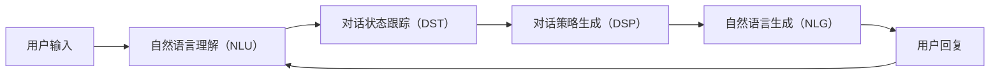

# AI Agent的实时自适应对话管理系统

> 关键词：AI Agent、实时自适应、对话管理系统、自然语言处理、机器学习

> 摘要：本文聚焦于AI Agent的实时自适应对话管理系统，旨在深入探讨该系统的核心原理、算法实现、数学模型以及实际应用场景等方面。实时自适应对话管理系统能够让AI Agent在与用户的交互过程中，根据实时对话内容和场景变化动态调整对话策略，提高对话的质量和用户满意度。文章将详细介绍系统的各个组成部分，通过Python代码示例展示具体实现，同时分析其在不同领域的应用，并对未来发展趋势和面临的挑战进行展望。

## 1. 背景介绍 
### 1.1 目的和范围
AI Agent的实时自适应对话管理系统的主要目的是构建一个智能、灵活且高效的对话管理机制，使AI Agent能够在各种复杂的对话场景中与用户进行自然、流畅的交互。该系统的范围涵盖了从自然语言的理解到对话策略的生成，再到自然语言的生成等多个环节，涉及自然语言处理、机器学习、人工智能等多个领域的技术。

### 1.2 预期读者
本文预期读者包括从事人工智能、自然语言处理、机器学习等领域的研究人员和开发者，对AI Agent和对话系统感兴趣的技术爱好者，以及希望将对话系统应用于实际业务的企业从业者。

### 1.3 文档结构概述
本文首先介绍AI Agent的实时自适应对话管理系统的背景知识，包括目的、预期读者和文档结构。接着阐述系统的核心概念与联系，通过文本示意图和Mermaid流程图进行说明。然后详细讲解核心算法原理和具体操作步骤，并给出Python源代码。随后介绍系统的数学模型和公式，并举例说明。再通过项目实战展示代码实际案例和详细解释。之后分析系统的实际应用场景。接着推荐相关的工具和资源。最后对系统的未来发展趋势与挑战进行总结，并提供常见问题与解答以及扩展阅读和参考资料。

### 1.4 术语表
#### 1.4.1 核心术语定义
- **AI Agent**：人工智能代理，是一种能够感知环境、做出决策并采取行动的智能实体。
- **实时自适应**：指系统能够在实时对话过程中，根据用户输入和对话上下文动态调整自身的行为和策略。
- **对话管理系统**：负责管理AI Agent与用户之间对话流程的系统，包括对话状态的维护、对话策略的选择和生成等。
- **自然语言处理（NLP）**：研究如何让计算机理解和处理人类自然语言的技术领域。
- **机器学习（ML）**：让计算机通过数据和算法自动学习模式和规律的技术。

#### 1.4.2 相关概念解释
- **对话状态**：表示当前对话的进展和上下文信息，包括用户的意图、历史对话内容等。
- **对话策略**：根据对话状态选择的一系列行动，用于指导AI Agent的回复和行为。
- **意图识别**：从用户输入的自然语言中识别出用户的意图，例如查询信息、请求服务等。
- **槽填充**：从用户输入中提取出与特定意图相关的关键信息，例如时间、地点等。

#### 1.4.3 缩略词列表
- **NLP**：自然语言处理（Natural Language Processing）
- **ML**：机器学习（Machine Learning）
- **RNN**：循环神经网络（Recurrent Neural Network）
- **LSTM**：长短期记忆网络（Long Short-Term Memory）
- **GRU**：门控循环单元（Gated Recurrent Unit）

## 2. 核心概念与联系 
### 核心概念原理
AI Agent的实时自适应对话管理系统主要由以下几个核心部分组成：
1. **自然语言理解（NLU）**：负责将用户输入的自然语言转换为计算机能够理解的语义表示，包括意图识别和槽填充等任务。
2. **对话状态跟踪（DST）**：维护当前对话的状态，根据用户输入和系统回复更新对话状态。
3. **对话策略生成（DSP）**：根据对话状态选择合适的对话策略，决定AI Agent的回复和行为。
4. **自然语言生成（NLG）**：将对话策略生成的结果转换为自然语言回复。

### 架构的文本示意图
```plaintext
用户输入 ---> 自然语言理解（NLU） ---> 对话状态跟踪（DST） ---> 对话策略生成（DSP） ---> 自然语言生成（NLG） ---> 用户回复
```

### Mermaid流程图


## 3. 核心算法原理 & 具体操作步骤 
### 自然语言理解（NLU）
自然语言理解的主要任务是意图识别和槽填充。我们可以使用深度学习模型，如循环神经网络（RNN）、长短期记忆网络（LSTM）或门控循环单元（GRU）来实现。以下是一个使用Python和PyTorch实现的简单意图识别示例：

```python
import torch
import torch.nn as nn
import torch.optim as optim
from torch.utils.data import Dataset, DataLoader

# 定义数据集类
class IntentDataset(Dataset):
    def __init__(self, texts, labels):
        self.texts = texts
        self.labels = labels

    def __len__(self):
        return len(self.texts)

    def __getitem__(self, idx):
        text = self.texts[idx]
        label = self.labels[idx]
        return text, label

# 定义意图识别模型
class IntentClassifier(nn.Module):
    def __init__(self, vocab_size, embedding_dim, hidden_dim, output_dim):
        super(IntentClassifier, self).__init__()
        self.embedding = nn.Embedding(vocab_size, embedding_dim)
        self.lstm = nn.LSTM(embedding_dim, hidden_dim, batch_first=True)
        self.fc = nn.Linear(hidden_dim, output_dim)

    def forward(self, x):
        embedded = self.embedding(x)
        output, _ = self.lstm(embedded)
        last_output = output[:, -1, :]
        logits = self.fc(last_output)
        return logits

# 训练模型
def train_model(model, dataloader, criterion, optimizer, epochs):
    model.train()
    for epoch in range(epochs):
        total_loss = 0
        for texts, labels in dataloader:
            optimizer.zero_grad()
            logits = model(texts)
            loss = criterion(logits, labels)
            loss.backward()
            optimizer.step()
            total_loss += loss.item()
        print(f'Epoch {epoch + 1}, Loss: {total_loss / len(dataloader)}')

# 示例数据
texts = [torch.tensor([1, 2, 3]), torch.tensor([4, 5, 6])]
labels = [torch.tensor(0), torch.tensor(1)]
dataset = IntentDataset(texts, labels)
dataloader = DataLoader(dataset, batch_size=2)

# 模型参数
vocab_size = 10
embedding_dim = 16
hidden_dim = 32
output_dim = 2

# 初始化模型、损失函数和优化器
model = IntentClassifier(vocab_size, embedding_dim, hidden_dim, output_dim)
criterion = nn.CrossEntropyLoss()
optimizer = optim.Adam(model.parameters(), lr=0.001)

# 训练模型
train_model(model, dataloader, criterion, optimizer, epochs=10)
```

### 对话状态跟踪（DST）
对话状态跟踪的目的是维护当前对话的状态。一种常见的方法是使用基于规则的方法或基于机器学习的方法。以下是一个简单的基于规则的对话状态跟踪示例：

```python
# 初始对话状态
dialog_state = {
    'intent': None,
    'slots': {}
}

# 模拟用户输入
user_input = {
    'intent': 'query_info',
    'slots': {'topic': 'weather'}
}

# 更新对话状态
dialog_state['intent'] = user_input['intent']
dialog_state['slots'].update(user_input['slots'])

print(dialog_state)
```

### 对话策略生成（DSP）
对话策略生成根据对话状态选择合适的对话策略。可以使用基于规则的方法、基于强化学习的方法或基于深度学习的方法。以下是一个简单的基于规则的对话策略生成示例：

```python
# 对话策略规则
dialog_policies = {
    'query_info': {
        'weather': 'The weather is sunny today.'
    }
}

# 根据对话状态选择对话策略
if dialog_state['intent'] in dialog_policies and dialog_state['slots'].get('topic') in dialog_policies[dialog_state['intent']]:
    response = dialog_policies[dialog_state['intent']][dialog_state['slots']['topic']]
else:
    response = 'I don\'t understand your request.'

print(response)
```

### 自然语言生成（NLG）
自然语言生成将对话策略生成的结果转换为自然语言回复。可以使用模板生成、基于深度学习的生成模型等方法。以下是一个简单的模板生成示例：

```python
# 模板
templates = {
    'query_info': 'The {topic} information is as follows: {content}'
}

# 填充模板
if dialog_state['intent'] in templates:
    template = templates[dialog_state['intent']]
    response = template.format(topic=dialog_state['slots'].get('topic', 'unknown'), content=response)
else:
    response = 'I don\'t understand your request.'

print(response)
```

## 4. 数学模型和公式 & 详细讲解 & 举例说明 
### 自然语言理解（NLU）
在意图识别中，我们通常使用交叉熵损失函数来训练模型。交叉熵损失函数的公式为：

$$
H(p, q) = -\sum_{i=1}^{n} p_i \log(q_i)
$$

其中，$p$ 是真实标签的概率分布，$q$ 是模型预测的概率分布。

举例说明：假设我们有两个类别，真实标签为 $[1, 0]$，模型预测的概率分布为 $[0.8, 0.2]$，则交叉熵损失为：

$$
H([1, 0], [0.8, 0.2]) = - (1 \times \log(0.8) + 0 \times \log(0.2)) \approx 0.223
$$

### 对话状态跟踪（DST）
在基于机器学习的对话状态跟踪中，我们可以使用隐马尔可夫模型（HMM）或条件随机场（CRF）来建模对话状态的转移。

隐马尔可夫模型的数学模型可以表示为一个五元组 $(\mathcal{S}, \mathcal{O}, A, B, \pi)$，其中：
- $\mathcal{S}$ 是状态集合
- $\mathcal{O}$ 是观测集合
- $A$ 是状态转移概率矩阵
- $B$ 是观测概率矩阵
- $\pi$ 是初始状态概率分布

### 对话策略生成（DSP）
在基于强化学习的对话策略生成中，我们通常使用马尔可夫决策过程（MDP）来建模对话过程。马尔可夫决策过程可以表示为一个五元组 $(\mathcal{S}, \mathcal{A}, P, R, \gamma)$，其中：
- $\mathcal{S}$ 是状态集合
- $\mathcal{A}$ 是动作集合
- $P$ 是状态转移概率函数
- $R$ 是奖励函数
- $\gamma$ 是折扣因子

### 自然语言生成（NLG）
在基于深度学习的自然语言生成中，我们通常使用序列到序列（Seq2Seq）模型。Seq2Seq模型由编码器和解码器组成，编码器将输入序列编码为一个固定长度的向量，解码器根据这个向量生成输出序列。

## 5. 项目实战：代码实际案例和详细解释说明 
### 5.1  开发环境搭建
1. **安装Python**：推荐使用Python 3.7及以上版本。
2. **安装依赖库**：使用pip安装PyTorch、numpy、pandas等必要的库。
```bash
pip install torch numpy pandas
```

### 5.2  源代码详细实现和代码解读
以下是一个完整的AI Agent实时自适应对话管理系统的示例代码：

```python
import torch
import torch.nn as nn
import torch.optim as optim
from torch.utils.data import Dataset, DataLoader

# 定义数据集类
class IntentDataset(Dataset):
    def __init__(self, texts, labels):
        self.texts = texts
        self.labels = labels

    def __len__(self):
        return len(self.texts)

    def __getitem__(self, idx):
        text = self.texts[idx]
        label = self.labels[idx]
        return text, label

# 定义意图识别模型
class IntentClassifier(nn.Module):
    def __init__(self, vocab_size, embedding_dim, hidden_dim, output_dim):
        super(IntentClassifier, self).__init__()
        self.embedding = nn.Embedding(vocab_size, embedding_dim)
        self.lstm = nn.LSTM(embedding_dim, hidden_dim, batch_first=True)
        self.fc = nn.Linear(hidden_dim, output_dim)

    def forward(self, x):
        embedded = self.embedding(x)
        output, _ = self.lstm(embedded)
        last_output = output[:, -1, :]
        logits = self.fc(last_output)
        return logits

# 训练模型
def train_model(model, dataloader, criterion, optimizer, epochs):
    model.train()
    for epoch in range(epochs):
        total_loss = 0
        for texts, labels in dataloader:
            optimizer.zero_grad()
            logits = model(texts)
            loss = criterion(logits, labels)
            loss.backward()
            optimizer.step()
            total_loss += loss.item()
        print(f'Epoch {epoch + 1}, Loss: {total_loss / len(dataloader)}')

# 对话状态跟踪
dialog_state = {
    'intent': None,
    'slots': {}
}

# 对话策略规则
dialog_policies = {
    'query_info': {
        'weather': 'The weather is sunny today.'
    }
}

# 自然语言生成模板
templates = {
    'query_info': 'The {topic} information is as follows: {content}'
}

# 模拟用户输入
texts = [torch.tensor([1, 2, 3]), torch.tensor([4, 5, 6])]
labels = [torch.tensor(0), torch.tensor(1)]
dataset = IntentDataset(texts, labels)
dataloader = DataLoader(dataset, batch_size=2)

# 模型参数
vocab_size = 10
embedding_dim = 16
hidden_dim = 32
output_dim = 2

# 初始化模型、损失函数和优化器
model = IntentClassifier(vocab_size, embedding_dim, hidden_dim, output_dim)
criterion = nn.CrossEntropyLoss()
optimizer = optim.Adam(model.parameters(), lr=0.001)

# 训练模型
train_model(model, dataloader, criterion, optimizer, epochs=10)

# 模拟用户输入
user_input = {
    'intent': 'query_info',
    'slots': {'topic': 'weather'}
}

# 更新对话状态
dialog_state['intent'] = user_input['intent']
dialog_state['slots'].update(user_input['slots'])

# 根据对话状态选择对话策略
if dialog_state['intent'] in dialog_policies and dialog_state['slots'].get('topic') in dialog_policies[dialog_state['intent']]:
    response = dialog_policies[dialog_state['intent']][dialog_state['slots']['topic']]
else:
    response = 'I don\'t understand your request.'

# 自然语言生成
if dialog_state['intent'] in templates:
    template = templates[dialog_state['intent']]
    response = template.format(topic=dialog_state['slots'].get('topic', 'unknown'), content=response)
else:
    response = 'I don\'t understand your request.'

print(response)
```

### 5.3  代码解读与分析
1. **自然语言理解（NLU）**：通过定义 `IntentClassifier` 模型进行意图识别，使用交叉熵损失函数和Adam优化器进行训练。
2. **对话状态跟踪（DST）**：使用字典 `dialog_state` 维护对话状态，根据用户输入更新对话状态。
3. **对话策略生成（DSP）**：使用字典 `dialog_policies` 存储对话策略规则，根据对话状态选择合适的对话策略。
4. **自然语言生成（NLG）**：使用字典 `templates` 存储自然语言生成模板，根据对话状态和对话策略生成自然语言回复。

## 6. 实际应用场景 
### 客服聊天机器人
在客服场景中，AI Agent的实时自适应对话管理系统可以帮助企业快速响应客户的咨询和问题，提供个性化的服务。系统可以根据客户的问题自动识别意图，跟踪对话状态，选择合适的对话策略，并生成自然语言回复，提高客户满意度。

### 智能语音助手
智能语音助手如Siri、小爱同学等都使用了对话管理系统。系统可以实时理解用户的语音指令，跟踪对话状态，根据用户的需求提供相应的服务，如查询信息、设置提醒、控制设备等。

###