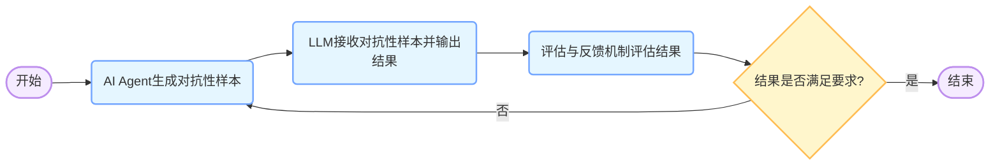

# AI Agent的对抗性学习：提高LLM的鲁棒性

> 关键词：AI Agent、对抗性学习、大语言模型（LLM）、鲁棒性、机器学习

> 摘要：本文围绕AI Agent的对抗性学习展开，旨在深入探讨如何通过这种学习方式提高大语言模型（LLM）的鲁棒性。首先介绍了研究的背景、目的、预期读者以及文档结构等基础信息，接着详细阐述了AI Agent、对抗性学习和LLM鲁棒性的核心概念及其联系，给出了相应的原理和架构示意图与流程图。在核心算法原理部分，使用Python源代码进行了详细说明。同时，通过数学模型和公式进一步解释了对抗性学习的机制，并举例说明。在项目实战中，提供了开发环境搭建、源代码实现和解读。还探讨了实际应用场景，推荐了相关的学习资源、开发工具框架和论文著作。最后总结了未来发展趋势与挑战，并对常见问题进行了解答，为相关领域的研究和实践提供了全面而深入的参考。

## 1. 背景介绍 
### 1.1 目的和范围
随着大语言模型（LLM）在自然语言处理的多个领域取得显著成果，如问答系统、文本生成、机器翻译等，其在实际应用中的鲁棒性问题逐渐凸显。LLM可能会受到对抗性攻击的影响，导致输出结果出现错误或偏差，影响系统的可靠性和可用性。本研究的目的是探索如何利用AI Agent的对抗性学习来提高LLM的鲁棒性。研究范围涵盖了对抗性学习的基本原理、核心算法、数学模型，以及如何将这些理论应用到实际项目中，通过具体的代码实现来验证和改进LLM的鲁棒性。

### 1.2 预期读者
本文预期读者包括自然语言处理领域的研究人员、人工智能开发者、对AI Agent和LLM鲁棒性感兴趣的技术爱好者。对于研究人员，本文可以为他们的学术研究提供新的思路和方法；对于开发者，能够帮助他们在实际项目中应用对抗性学习来提高LLM的性能；对于技术爱好者，有助于他们了解AI Agent对抗性学习的前沿知识。

### 1.3 文档结构概述
本文将按照以下结构展开：首先介绍核心概念，包括AI Agent、对抗性学习和LLM鲁棒性，并说明它们之间的联系；接着详细阐述核心算法原理，并给出Python源代码示例；然后通过数学模型和公式深入解释对抗性学习的机制，并举例说明；在项目实战部分，会介绍开发环境搭建、源代码实现和解读；之后探讨实际应用场景；再推荐相关的学习资源、开发工具框架和论文著作；最后总结未来发展趋势与挑战，并解答常见问题。

### 1.4 术语表
#### 1.4.1 核心术语定义
- **AI Agent**：是一种能够感知环境、做出决策并采取行动以实现特定目标的智能实体。在本文中，AI Agent主要用于与LLM进行交互，通过对抗性学习来提高LLM的鲁棒性。
- **对抗性学习**：是一种机器学习技术，通过让两个或多个模型相互对抗，以提高模型的性能和鲁棒性。在对抗性学习中，一个模型（生成器）试图生成能够欺骗另一个模型（判别器）的样本，而判别器则试图准确区分真实样本和生成样本。
- **大语言模型（LLM）**：是一类基于深度学习的自然语言处理模型，通常具有大量的参数和强大的语言理解与生成能力。例如GPT-3、BERT等。
- **鲁棒性**：指模型在面对噪声、对抗性攻击或其他异常输入时，仍能保持稳定和准确的性能。

#### 1.4.2 相关概念解释
- **对抗性攻击**：是一种故意设计的输入，旨在欺骗模型并导致其输出错误的结果。常见的对抗性攻击方法包括添加微小的噪声、修改输入文本的某些部分等。
- **生成对抗网络（GAN）**：是一种典型的对抗性学习模型，由生成器和判别器组成。生成器试图生成与真实数据分布相似的样本，而判别器则试图区分生成样本和真实样本。
- **强化学习**：是一种机器学习方法，通过智能体与环境进行交互，根据环境反馈的奖励信号来学习最优的行为策略。

#### 1.4.3 缩略词列表
- **AI**：Artificial Intelligence，人工智能
- **LLM**：Large Language Model，大语言模型
- **GAN**：Generative Adversarial Network，生成对抗网络

## 2. 核心概念与联系 
### 核心概念原理
#### AI Agent
AI Agent可以被看作是一个自主的智能实体，它具有感知环境、决策和行动的能力。在对抗性学习的场景中，AI Agent可以扮演不同的角色，例如生成对抗性样本的攻击者或评估LLM鲁棒性的评估者。AI Agent通过不断地与LLM进行交互，学习如何生成更有效的对抗性样本或如何评估LLM的鲁棒性。

#### 对抗性学习
对抗性学习的核心思想是通过让两个或多个模型相互对抗来提高模型的性能。在提高LLM鲁棒性的场景中，通常会有一个攻击者模型（AI Agent）和一个防御者模型（LLM）。攻击者模型试图生成能够欺骗LLM的对抗性样本，而LLM则需要学习如何识别和抵御这些攻击。通过不断的对抗训练，LLM可以提高其在面对对抗性攻击时的鲁棒性。

#### LLM鲁棒性
LLM的鲁棒性是指模型在面对各种异常输入时，仍能保持稳定和准确的性能。异常输入可能包括对抗性攻击、噪声、错误的语法等。提高LLM的鲁棒性可以增强模型的可靠性和可用性，使其在实际应用中更加稳定。

### 架构的文本示意图
```plaintext
          +-----------------+
          |     AI Agent    |
          | (攻击者模型)    |
          +-----------------+
                   |
                   | 生成对抗性样本
                   v
          +-----------------+
          |     LLM         |
          | (防御者模型)    |
          +-----------------+
                   |
                   | 输出结果
                   v
          +-----------------+
          | 评估与反馈机制  |
          +-----------------+
                   |
                   | 反馈信息
                   v
          +-----------------+
          |     AI Agent    |
          | (攻击者模型)    |
          +-----------------+
```

### Mermaid流程图


## 3. 核心算法原理 & 具体操作步骤 
### 核心算法原理
在提高LLM鲁棒性的对抗性学习中，常用的算法是基于梯度的攻击算法，例如快速梯度符号法（FGSM）。FGSM的核心思想是通过计算损失函数相对于输入的梯度，然后根据梯度的符号对输入进行微小的扰动，从而生成对抗性样本。

### 具体操作步骤
1. **初始化**：初始化LLM和AI Agent的参数。
2. **生成对抗性样本**：AI Agent使用FGSM算法生成对抗性样本。
3. **训练LLM**：将对抗性样本输入到LLM中，计算损失函数，并使用反向传播算法更新LLM的参数。
4. **评估与反馈**：评估LLM在对抗性样本上的性能，并将评估结果反馈给AI Agent。
5. **更新AI Agent**：AI Agent根据反馈信息更新自身的参数，以生成更有效的对抗性样本。
6. **重复步骤2-5**：重复上述步骤，直到LLM的鲁棒性达到满意的水平。

### Python源代码示例
```python
import torch
import torch.nn as nn
import torch.optim as optim

# 定义LLM模型
class LLM(nn.Module):
    def __init__(self):
        super(LLM, self).__init__()
        self.fc = nn.Linear(10, 1)

    def forward(self, x):
        return self.fc(x)

# 初始化LLM和优化器
llm = LLM()
optimizer = optim.Adam(llm.parameters(), lr=0.001)

# 定义损失函数
criterion = nn.MSELoss()

# 生成随机输入
x = torch.randn(1, 10)
y = torch.randn(1, 1)

# FGSM算法生成对抗性样本
epsilon = 0.01
llm.eval()
x.requires_grad = True
output = llm(x)
loss = criterion(output, y)
llm.zero_grad()
loss.backward()
sign_data_grad = x.grad.sign()
perturbed_x = x + epsilon * sign_data_grad
perturbed_x = torch.clamp(perturbed_x, -1, 1)

# 训练LLM
llm.train()
optimizer.zero_grad()
output = llm(perturbed_x)
loss = criterion(output, y)
loss.backward()
optimizer.step()

print("LLM训练完成")
```

## 4. 数学模型和公式 & 详细讲解 & 举例说明 
### 数学模型和公式
#### 快速梯度符号法（FGSM）
FGSM的核心公式如下：
$$
\mathbf{x}_{adv}=\mathbf{x}+\epsilon \cdot \text{sign}(\nabla_{\mathbf{x}}J(\theta,\mathbf{x},y))
$$
其中，$\mathbf{x}$ 是原始输入，$\mathbf{x}_{adv}$ 是对抗性样本，$\epsilon$ 是扰动强度，$\nabla_{\mathbf{x}}J(\theta,\mathbf{x},y)$ 是损失函数 $J(\theta,\mathbf{x},y)$ 相对于输入 $\mathbf{x}$ 的梯度，$\text{sign}$ 是符号函数。

#### 损失函数
在对抗性学习中，常用的损失函数是交叉熵损失函数，其公式如下：
$$
J(\theta,\mathbf{x},y)=-\sum_{i=1}^{C}y_{i}\log(p_{i})
$$
其中，$C$ 是类别数，$y_{i}$ 是真实标签的第 $i$ 个分量，$p_{i}$ 是模型预测的第 $i$ 个类别的概率。

### 详细讲解
#### FGSM公式讲解
FGSM的核心思想是通过在原始输入上添加一个微小的扰动，使得损失函数的值最大化。具体来说，我们首先计算损失函数相对于输入的梯度，然后根据梯度的符号对输入进行扰动。这样做的目的是让模型在对抗性样本上的预测结果与真实标签之间的差异最大化。

#### 损失函数讲解
交叉熵损失函数是一种常用的分类损失函数，它衡量了模型预测的概率分布与真实标签之间的差异。当模型的预测结果与真实标签越接近时，交叉熵损失函数的值越小；反之，当模型的预测结果与真实标签越远时，交叉熵损失函数的值越大。

### 举例说明
假设我们有一个二分类问题，真实标签 $y = [1, 0]$，模型预测的概率分布 $p = [0.8, 0.2]$。则交叉熵损失函数的值为：
$$
J(\theta,\mathbf{x},y)=-(1\times\log(0.8)+0\times\log(0.2))\approx 0.223
$$
现在，我们使用FGSM算法生成对抗性样本。假设原始输入 $\mathbf{x} = [0.1, 0.2, \cdots, 0.10]$，损失函数相对于输入的梯度 $\nabla_{\mathbf{x}}J(\theta,\mathbf{x},y) = [0.01, -0.02, \cdots, 0.05]$，扰动强度 $\epsilon = 0.01$。则对抗性样本为：
$$
\mathbf{x}_{adv}=\mathbf{x}+\epsilon \cdot \text{sign}(\nabla_{\mathbf{x}}J(\theta,\mathbf{x},y)) = [0.1 + 0.01\times\text{sign}(0.01), 0.2 + 0.01\times\text{sign}(-0.02), \cdots, 0.10 + 0.01\times\text{sign}(0.05)]
$$
$$
= [0.11, 0.19, \cdots, 0.105]
$$

## 5. 项目实战：代码实际案例和详细解释说明 
### 5.1  开发环境搭建
#### 安装Python
首先，确保你已经安装了Python 3.7或更高版本。你可以从Python官方网站（https://www.python.org/downloads/）下载并安装Python。

#### 安装必要的库
使用以下命令安装必要的库：
```sh
pip install torch numpy pandas scikit-learn
```

### 5.2  源代码详细实现和代码解读
```python
import torch
import torch.nn as nn
import torch.optim as optim
import numpy as np
from sklearn.datasets import make_classification
from sklearn.model_selection import train_test_split

# 生成数据集
X, y = make_classification(n_samples=1000, n_features=10, n_informative=5, n_redundant=0, random_state=42)
X_train, X_test, y_train, y_test = train_test_split(X, y, test_size=0.2, random_state=42)

X_train = torch.FloatTensor(X_train)
y_train = torch.FloatTensor(y_train).unsqueeze(1)
X_test = torch.FloatTensor(X_test)
y_test = torch.FloatTensor(y_test).unsqueeze(1)

# 定义LLM模型
class LLM(nn.Module):
    def __init__(self):
        super(LLM, self).__init__()
        self.fc1 = nn.Linear(10, 20)
        self.relu = nn.ReLU()
        self.fc2 = nn.Linear(20, 1)
        self.sigmoid = nn.Sigmoid()

    def forward(self, x):
        x = self.fc1(x)
        x = self.relu(x)
        x = self.fc2(x)
        x = self.sigmoid(x)
        return x

# 初始化LLM和优化器
llm = LLM()
optimizer = optim.Adam(llm.parameters(), lr=0.001)

# 定义损失函数
criterion = nn.BCELoss()

# 训练LLM
num_epochs = 100
for epoch in range(num_epochs):
    optimizer.zero_grad()
    outputs = llm(X_train)
    loss = criterion(outputs, y_train)
    loss.backward()
    optimizer.step()

    if (epoch + 1) % 10 == 0:
        print(f'Epoch [{epoch+1}/{num_epochs}], Loss: {loss.item():.4f}')

# FGSM算法生成对抗性样本
epsilon = 0.01
X_test.requires_grad = True
outputs = llm(X_test)
loss = criterion(outputs, y_test)
llm.zero_grad()
loss.backward()
sign_data_grad = X_test.grad.sign()
perturbed_X_test = X_test + epsilon * sign_data_grad
perturbed_X_test = torch.clamp(perturbed_X_test, -1, 1)

# 评估LLM在对抗性样本上的性能
with torch.no_grad():
    outputs = llm(perturbed_X_test)
    predicted = (outputs >= 0.5).float()
    accuracy = (predicted == y_test).sum().item() / y_test.size(0)
    print(f'Accuracy on adversarial samples: {accuracy:.4f}')
```

### 5.3  代码解读与分析
#### 数据集生成
使用 `sklearn.datasets.make_classification` 函数生成一个二分类数据集，并将其划分为训练集和测试集。

#### LLM模型定义
定义了一个简单的神经网络模型 `LLM`，包含两个全连接层和一个ReLU激活函数。

#### 训练过程
使用Adam优化器和二元交叉熵损失函数对LLM进行训练，训练100个epoch。

#### 对抗性样本生成
使用FGSM算法生成对抗性样本，并将其输入到LLM中进行评估。

#### 性能评估
计算LLM在对抗性样本上的准确率，以评估其鲁棒性。

## 6. 实际应用场景 
### 问答系统
在问答系统中，LLM需要能够准确回答用户的问题。然而，恶意用户可能会使用对抗性攻击来干扰系统的正常运行。通过AI Agent的对抗性学习，可以提高LLM在面对对抗性攻击时的鲁棒性，确保问答系统的可靠性和可用性。

### 文本生成
在文本生成任务中，LLM需要生成自然流畅的文本。对抗性学习可以帮助LLM更好地理解语言的结构和语义，提高生成文本的质量和稳定性。同时，也可以增强LLM在面对对抗性输入时的鲁棒性，避免生成错误或不合理的文本。

### 机器翻译
在机器翻译中，LLM需要将一种语言翻译成另一种语言。对抗性攻击可能会导致翻译结果出现错误或不准确。通过对抗性学习，可以提高LLM在翻译任务中的鲁棒性，确保翻译结果的准确性和可靠性。

## 7. 工具和资源推荐
### 7.1 学习资源推荐
#### 7.1.1 书籍推荐
- 《深度学习》（Deep Learning）：由Ian Goodfellow、Yoshua Bengio和Aaron Courville撰写，是深度学习领域的经典教材，涵盖了深度学习的基本原理、算法和应用。
- 《自然语言处理入门》（Natural Language Processing with Python）：由Steven Bird、Ewan Klein和Edward Loper撰写，介绍了使用Python进行自然语言处理的基本方法和技术。
- 《人工智能：一种现代的方法》（Artificial Intelligence: A Modern Approach）：由Stuart Russell和Peter Norvig撰写，是人工智能领域的经典教材，涵盖了人工智能的各个方面，包括搜索算法、机器学习、自然语言处理等。

#### 7.1.2 在线课程
- Coursera上的“深度学习专项课程”（Deep Learning Specialization）：由Andrew Ng教授授课，包括五门课程，涵盖了深度学习的基础知识、卷积神经网络、循环神经网络等内容。
- edX上的“自然语言处理”（Natural Language Processing）：由Columbia University提供，介绍了自然语言处理的基本概念、算法和应用。
- Udemy上的“人工智能实战课程”（Artificial Intelligence A-Z™: Learn How To Build An AI）：通过实际项目介绍了人工智能的各个方面，包括机器学习、深度学习、强化学习等。

#### 7.1.3 技术博客和网站
- Medium：是一个技术博客平台，有很多关于人工智能、自然语言处理的优秀文章。
- Towards Data Science：专注于数据科学和机器学习领域，提供了很多有价值的技术文章和教程。
- arXiv：是一个预印本服务器，包含了很多最新的学术研究论文，特别是在人工智能和机器学习领域。

### 7.2 开发工具框架推荐
#### 7.2.1 IDE和编辑器
- PyCharm：是一款专门为Python开发设计的集成开发环境，具有代码编辑、调试、版本控制等功能。
- Jupyter Notebook：是一个交互式的开发环境，适合进行数据分析、模型训练和实验。
- Visual Studio Code：是一款轻量级的代码编辑器，支持多种编程语言和插件扩展，非常适合Python开发。

#### 7.2.2 调试和性能分析工具
- TensorBoard：是TensorFlow提供的一个可视化工具，用于监控模型的训练过程、可视化模型结构和性能指标。
- PyTorch Profiler：是PyTorch提供的一个性能分析工具，用于分析模型的运行时间、内存使用等情况。
- cProfile：是Python标准库中的一个性能分析工具，用于分析Python代码的执行时间和调用关系。

#### 7.2.3 相关框架和库
- PyTorch：是一个开源的深度学习框架，具有动态图机制、易于使用和高效等特点。
- TensorFlow：是另一个广泛使用的开源深度学习框架，具有丰富的工具和库，适合大规模的深度学习项目。
- Hugging Face Transformers：是一个专门用于自然语言处理的开源库，提供了很多预训练的大语言模型和工具。

### 7.3 相关论文著作推荐
#### 7.3.1 经典论文
- “Generative Adversarial Nets”：由Ian Goodfellow等人发表，介绍了生成对抗网络（GAN）的基本原理和算法。
- “Explaining and Harnessing Adversarial Examples”：由Ian Goodfellow等人发表，首次提出了快速梯度符号法（FGSM），并对对抗性样本进行了深入的研究。
- “Attention Is All You Need”：由Ashish Vaswani等人发表，介绍了Transformer架构，是当前自然语言处理领域的重要突破。

#### 7.3.2 最新研究成果
- 在arXiv和各大人工智能学术会议（如NeurIPS、ICML、ACL等）上可以找到很多关于AI Agent对抗性学习和LLM鲁棒性的最新研究成果。

#### 7.3.3 应用案例分析
- 可以关注一些实际应用案例的研究论文，了解如何将AI Agent的对抗性学习应用到实际项目中，提高LLM的鲁棒性。

## 8. 总结：未来发展趋势与挑战
### 未来发展趋势
- **多模态对抗性学习**：未来的研究可能会将对抗性学习扩展到多模态领域，如结合图像、语音和文本等多种模态的信息，提高模型在复杂环境下的鲁棒性。
- **自适应对抗性学习**：开发能够自适应调整对抗性攻击策略的AI Agent，使模型能够更好地应对不同类型的攻击。
- **与强化学习的结合**：将对抗性学习与强化学习相结合，通过智能体与环境的交互来提高模型的鲁棒性和性能。

### 挑战
- **计算资源需求**：对抗性学习通常需要大量的计算资源，特别是在处理大规模的LLM时。如何在有限的计算资源下进行高效的对抗性学习是一个挑战。
- **攻击策略的多样性**：随着攻击策略的不断发展和多样化，模型需要具备更强的鲁棒性来应对各种未知的攻击。
- **可解释性**：对抗性学习模型的可解释性较差，如何解释模型的决策过程和对抗性样本的生成机制是一个需要解决的问题。

## 9. 附录：常见问题与解答
### 问题1：对抗性学习一定会提高LLM的鲁棒性吗？
答：不一定。对抗性学习的效果取决于多个因素，如攻击策略的选择、训练数据的质量和数量、模型的架构等。如果攻击策略不够强大或训练数据不够充分，对抗性学习可能无法显著提高LLM的鲁棒性。

### 问题2：如何选择合适的扰动强度 $\epsilon$？
答：扰动强度 $\epsilon$ 的选择需要根据具体的任务和模型进行调整。一般来说，可以通过实验的方法来选择合适的 $\epsilon$ 值，使得生成的对抗性样本既能有效地攻击模型，又不会过于明显地改变原始输入。

### 问题3：对抗性学习会影响LLM的正常性能吗？
答：在一定程度上可能会影响。对抗性学习会让模型学习如何抵御对抗性攻击，但也可能会导致模型在正常输入上的性能略有下降。因此，需要在提高鲁棒性和保持正常性能之间进行权衡。

## 10. 扩展阅读 & 参考资料
- Goodfellow, I. J., Bengio, Y., & Courville, A. (2016). Deep Learning. MIT Press.
- Bird, S., Klein, E., & Loper, E. (2009). Natural Language Processing with Python. O'Reilly Media.
- Russell, S. J., & Norvig, P. (2010). Artificial Intelligence: A Modern Approach. Pearson Education.
- Goodfellow, I. J., Shlens, J., & Szegedy, C. (2014). Explaining and Harnessing Adversarial Examples. arXiv preprint arXiv:1412.6572.
- Vaswani, A., Shazeer, N., Parmar, N., Uszkoreit, J., Jones, L., Gomez, A. N.,... & Polosukhin, I. (2017). Attention Is All You Need. Advances in Neural Information Processing Systems.

作者：AI天才研究院/AI Genius Institute & 禅与计算机程序设计艺术 /Zen And The Art of Computer Programming