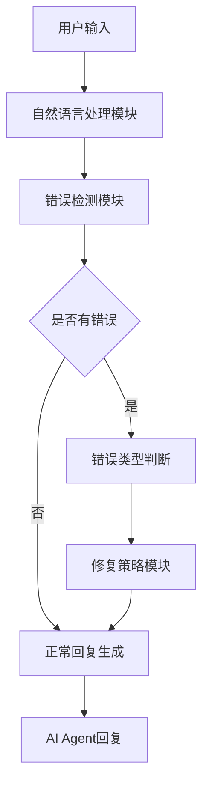

# AI Agent的对话修复：处理交互中的错误

> 关键词：AI Agent、对话修复、交互错误处理、自然语言处理、机器学习

> 摘要：本文围绕AI Agent的对话修复展开，深入探讨如何处理交互中的错误。首先介绍相关背景知识，包括目的范围、预期读者等；接着阐述核心概念与联系，通过文本示意图和Mermaid流程图展示；详细讲解核心算法原理并给出Python代码示例；介绍相关数学模型和公式；通过项目实战说明代码的实际应用和解读；分析实际应用场景；推荐学习、开发工具等资源；最后总结未来发展趋势与挑战，并提供常见问题解答和参考资料。旨在为开发者和研究者提供全面的关于AI Agent对话修复的技术指导。

## 1. 背景介绍 
### 1.1 目的和范围
在当今数字化时代，AI Agent在各种领域的应用日益广泛，如智能客服、智能助手等。然而，在与用户的交互过程中，由于语言的复杂性、用户表达的多样性以及AI Agent自身能力的限制，不可避免地会出现各种错误。本文章的目的在于深入探讨如何对AI Agent在对话交互中出现的错误进行修复，提高对话的质量和用户体验。范围涵盖了从核心概念的理解、算法原理的分析到实际项目的应用，以及未来发展趋势的展望。

### 1.2 预期读者
本文预期读者主要包括从事人工智能、自然语言处理领域的开发者、研究者，以及对AI Agent对话交互感兴趣的技术爱好者。对于正在开发或计划开发智能对话系统的人员，本文提供了实用的技术指导和解决方案；对于研究者，有助于他们深入了解该领域的前沿知识和研究方向；对于技术爱好者，能够帮助他们拓宽对AI Agent的认知和理解。

### 1.3 文档结构概述
本文将按照以下结构进行组织：首先介绍背景知识，让读者对文章的目的、预期读者和文档结构有清晰的认识；接着阐述核心概念与联系，通过直观的示意图和流程图帮助读者理解关键概念；详细讲解核心算法原理，并使用Python代码进行示例；介绍相关的数学模型和公式，并举例说明；通过项目实战展示代码的实际应用和详细解读；分析实际应用场景，说明该技术在不同领域的应用价值；推荐学习、开发所需的工具和资源；最后总结未来发展趋势与挑战，提供常见问题解答和参考资料，方便读者进一步学习和研究。

### 1.4 术语表
#### 1.4.1 核心术语定义
- **AI Agent**：即人工智能代理，是一种能够感知环境、自主决策并采取行动以实现特定目标的智能实体。在对话系统中，AI Agent可以理解用户的输入并生成相应的回复。
- **对话修复**：指的是在AI Agent与用户的对话交互中，当出现错误（如理解错误、回复不准确等）时，采取相应的措施对对话进行修正和改进，以保证对话的流畅性和准确性。
- **交互错误**：在AI Agent与用户的交互过程中，由于各种原因导致的信息传递不准确、理解偏差或回复不合理等问题。

#### 1.4.2 相关概念解释
- **自然语言处理（NLP）**：是人工智能的一个重要分支，主要研究如何让计算机理解、处理和生成自然语言。在AI Agent的对话修复中，NLP技术用于对用户输入的文本进行解析、语义理解和回复生成。
- **机器学习**：是一门多领域交叉学科，涉及概率论、统计学、逼近论、凸分析、算法复杂度理论等多门学科。它专门研究计算机怎样模拟或实现人类的学习行为，以获取新的知识或技能，重新组织已有的知识结构使之不断改善自身的性能。在对话修复中，机器学习算法可以用于训练模型，以提高AI Agent的理解和回复能力。

#### 1.4.3 缩略词列表
- **NLP**：Natural Language Processing（自然语言处理）
- **ML**：Machine Learning（机器学习）

## 2. 核心概念与联系 
### 核心概念原理
AI Agent的对话修复主要基于对用户输入的理解、错误检测和修复策略的应用。当用户与AI Agent进行对话时，AI Agent首先使用自然语言处理技术对用户输入进行解析，提取语义信息。然后，通过预定义的规则或机器学习模型判断是否存在交互错误。如果检测到错误，AI Agent会根据不同的错误类型采取相应的修复策略，如重新理解用户意图、调整回复内容等。

### 架构的文本示意图
```plaintext
用户输入 -> 自然语言处理模块（解析、语义理解） -> 错误检测模块（规则或模型判断） -> 错误类型判断 -> 修复策略模块（重新理解、调整回复等） -> AI Agent回复
```

### Mermaid流程图


## 3. 核心算法原理 & 具体操作步骤 
### 错误检测算法原理
错误检测可以基于规则或机器学习模型。下面以基于规则的错误检测为例，使用Python代码进行详细阐述。

```python
# 定义规则字典，用于判断常见错误
error_rules = {
    "关键词缺失": ["应该包含的关键词1", "应该包含的关键词2"],
    "语法错误": ["常见语法错误模式1", "常见语法错误模式2"]
}

def detect_error(user_input):
    for error_type, rules in error_rules.items():
        for rule in rules:
            if rule not in user_input and error_type == "关键词缺失":
                return error_type
            if rule in user_input and error_type == "语法错误":
                return error_type
    return None

# 示例使用
user_input = "这是一个没有关键词的句子"
error = detect_error(user_input)
if error:
    print(f"检测到错误：{error}")
else:
    print("未检测到错误")
```

### 修复策略算法原理
根据不同的错误类型，采取不同的修复策略。例如，对于关键词缺失的错误，可以提示用户补充关键词；对于语法错误，可以尝试重新解析用户输入。

```python
def repair_error(error_type, user_input):
    if error_type == "关键词缺失":
        missing_keywords = error_rules["关键词缺失"]
        return f"您的输入中缺少关键词：{', '.join(missing_keywords)}，请补充后再试。"
    elif error_type == "语法错误":
        # 这里可以使用更复杂的自然语言处理技术重新解析输入
        return "您的输入存在语法错误，请检查后重新输入。"

# 示例使用
if error:
    repair_message = repair_error(error, user_input)
    print(repair_message)
```

### 具体操作步骤
1. **用户输入**：用户向AI Agent发送对话内容。
2. **错误检测**：调用`detect_error`函数对用户输入进行检查，判断是否存在错误。
3. **错误类型判断**：如果检测到错误，确定错误的类型。
4. **修复策略应用**：根据错误类型调用`repair_error`函数生成修复信息。
5. **回复生成**：将修复信息或正常回复发送给用户。

## 4. 数学模型和公式 & 详细讲解 & 举例说明 
### 基于机器学习的错误检测模型
在基于机器学习的错误检测中，常用的模型有逻辑回归、支持向量机等。这里以逻辑回归为例进行说明。

#### 数学模型
逻辑回归的数学模型可以表示为：

$$P(y = 1|x) = \frac{1}{1 + e^{-(w_0 + w_1x_1 + w_2x_2 + \cdots + w_nx_n)}}$$

其中，$P(y = 1|x)$ 表示输入 $x$ 属于正类（存在错误）的概率，$w_0, w_1, \cdots, w_n$ 是模型的参数，$x_1, x_2, \cdots, x_n$ 是输入的特征。

#### 详细讲解
逻辑回归通过对输入特征进行线性组合，然后使用 sigmoid 函数将结果映射到 $[0, 1]$ 区间，得到输入属于正类的概率。如果概率大于某个阈值（通常为 0.5），则判断输入存在错误。

#### 举例说明
假设我们使用逻辑回归模型对文本进行错误检测，输入特征为文本中某些关键词的出现频率。训练数据包含正确和错误的文本样本，通过训练得到模型的参数 $w_0, w_1, \cdots, w_n$。对于一个新的文本输入，计算其特征值 $x_1, x_2, \cdots, x_n$，代入上述公式计算 $P(y = 1|x)$。如果 $P(y = 1|x) > 0.5$，则判断该文本存在错误。

### 损失函数
在训练逻辑回归模型时，常用的损失函数是对数损失函数：

$$L(w) = -\frac{1}{m}\sum_{i = 1}^{m}[y^{(i)}\log(P(y^{(i)} = 1|x^{(i)})) + (1 - y^{(i)})\log(1 - P(y^{(i)} = 1|x^{(i)}))]$$

其中，$m$ 是训练样本的数量，$y^{(i)}$ 是第 $i$ 个样本的真实标签（0 或 1），$x^{(i)}$ 是第 $i$ 个样本的输入特征。

### 模型训练
通过最小化损失函数 $L(w)$ 来更新模型的参数 $w$，常用的优化算法有梯度下降法：

$$w_j := w_j - \alpha\frac{\partial L(w)}{\partial w_j}$$

其中，$\alpha$ 是学习率，$\frac{\partial L(w)}{\partial w_j}$ 是损失函数关于参数 $w_j$ 的偏导数。

## 5. 项目实战：代码实际案例和详细解释说明 
### 5.1  开发环境搭建
- **操作系统**：可以选择 Windows、Linux 或 macOS。
- **Python 版本**：建议使用 Python 3.7 及以上版本。
- **安装依赖库**：使用以下命令安装必要的库：
```bash
pip install numpy pandas scikit-learn nltk
```

### 5.2  源代码详细实现和代码解读
```python
import numpy as np
import pandas as pd
from sklearn.feature_extraction.text import TfidfVectorizer
from sklearn.linear_model import LogisticRegression
from sklearn.model_selection import train_test_split
import nltk
from nltk.corpus import stopwords
nltk.download('stopwords')

# 加载数据集
data = pd.read_csv('dialogue_data.csv')
X = data['text']
y = data['error_label']

# 数据预处理
stop_words = set(stopwords.words('english'))
vectorizer = TfidfVectorizer(stop_words=stop_words)
X = vectorizer.fit_transform(X)

# 划分训练集和测试集
X_train, X_test, y_train, y_test = train_test_split(X, y, test_size=0.2, random_state=42)

# 训练逻辑回归模型
model = LogisticRegression()
model.fit(X_train, y_train)

# 评估模型
accuracy = model.score(X_test, y_test)
print(f"模型准确率: {accuracy}")

# 定义错误检测和修复函数
def detect_and_repair(user_input):
    input_vector = vectorizer.transform([user_input])
    prediction = model.predict(input_vector)
    if prediction[0] == 1:
        return "检测到错误，请检查您的输入。"
    else:
        return "未检测到错误，正常回复。"

# 示例使用
user_input = "This is a test sentence."
result = detect_and_repair(user_input)
print(result)
```

### 代码解读与分析
1. **数据加载**：使用`pandas`库加载包含对话文本和错误标签的数据集。
2. **数据预处理**：使用`TfidfVectorizer`将文本转换为 TF-IDF 特征向量，并去除停用词。
3. **模型训练**：使用`LogisticRegression`训练逻辑回归模型。
4. **模型评估**：使用测试集评估模型的准确率。
5. **错误检测和修复**：定义`detect_and_repair`函数，对用户输入进行错误检测，并根据检测结果生成相应的回复。

## 6. 实际应用场景 
### 智能客服
在智能客服系统中，AI Agent可能会因为用户表达的模糊性或专业术语的使用而出现理解错误。通过对话修复技术，可以及时纠正错误，提供准确的解决方案，提高客户满意度。例如，当用户询问“你们的产品A的保修政策是什么”，AI Agent可能因为没有理解“产品A”而给出错误回复。通过对话修复，可以重新询问用户关于“产品A”的具体信息，从而提供准确的保修政策。

### 智能助手
智能助手如 Siri、小爱同学等，在与用户交互时也会遇到各种错误。对话修复技术可以帮助智能助手更好地理解用户意图，提供更精准的服务。例如，当用户说“打开音乐应用”，但智能助手错误地打开了视频应用，通过对话修复可以重新打开正确的音乐应用，并向用户道歉。

### 教育领域
在在线教育平台中，AI Agent可以作为学习伙伴与学生进行交互。当学生提出问题或表达观点时，AI Agent可能会出现理解偏差。对话修复技术可以帮助AI Agent纠正错误，提供正确的指导和反馈，促进学生的学习效果。例如，学生在讨论数学问题时，AI Agent可能误解了学生的思路，通过对话修复可以重新理解问题，给出正确的解题方法。

## 7. 工具和资源推荐
### 7.1 学习资源推荐
#### 7.1.1 书籍推荐
- 《自然语言处理入门》：介绍了自然语言处理的基本概念、算法和应用，适合初学者入门。
- 《机器学习》：详细讲解了机器学习的各种算法和理论，对于理解对话修复中的机器学习模型有很大帮助。
- 《深度学习》：深度学习在自然语言处理中有着广泛的应用，这本书可以帮助读者深入了解深度学习的原理和应用。

#### 7.1.2 在线课程
- Coursera 上的“Natural Language Processing Specialization”：由顶尖高校的教授授课，系统地介绍了自然语言处理的各个方面。
- edX 上的“Machine Learning Fundamentals”：帮助学习者掌握机器学习的基础知识和技能。
- 网易云课堂上的“深度学习实战”：通过实际项目让学习者掌握深度学习的应用。

#### 7.1.3 技术博客和网站
- 机器之心：提供人工智能领域的最新技术动态和研究成果。
- 开源中国：有大量的技术文章和代码示例，对于开发者有很大的参考价值。
- Medium 上的人工智能相关博客：有很多专业人士分享的经验和见解。

### 7.2 开发工具框架推荐
#### 7.2.1 IDE和编辑器
- PyCharm：功能强大的 Python 集成开发环境，提供代码编辑、调试、版本控制等功能。
- Jupyter Notebook：适合进行数据分析和模型训练的交互式开发环境，方便代码的编写和展示。
- Visual Studio Code：轻量级的代码编辑器，支持多种编程语言和插件扩展。

#### 7.2.2 调试和性能分析工具
- PDB：Python 自带的调试工具，可以帮助开发者定位代码中的问题。
- cProfile：用于分析 Python 代码的性能，找出性能瓶颈。
- TensorBoard：用于可视化深度学习模型的训练过程和性能指标。

#### 7.2.3 相关框架和库
- NLTK：自然语言处理工具包，提供了丰富的语料库和处理工具。
- SpaCy：高效的自然语言处理库，支持多种语言和任务。
- Scikit-learn：机器学习库，包含了各种常用的机器学习算法和工具。

### 7.3 相关论文著作推荐
#### 7.3.1 经典论文
- "A Neural Probabilistic Language Model"：提出了神经网络语言模型的概念，对自然语言处理的发展产生了深远影响。
- "Attention Is All You Need"：介绍了 Transformer 模型，是当前自然语言处理领域的重要基础。
- "Convolutional Neural Networks for Sentence Classification"：探讨了卷积神经网络在句子分类任务中的应用。

#### 7.3.2 最新研究成果
- 关注 ACL（Association for Computational Linguistics）、EMNLP（Conference on Empirical Methods in Natural Language Processing）等顶级会议的最新论文，了解该领域的前沿研究。

#### 7.3.3 应用案例分析
- 查看相关的行业报告和案例研究，了解AI Agent对话修复技术在实际应用中的效果和经验。

## 8. 总结：未来发展趋势与挑战
### 未来发展趋势
- **多模态融合**：未来的AI Agent将不仅局限于文本对话，还会融合语音、图像、视频等多种模态信息。对话修复技术也需要适应多模态的特点，处理更加复杂的交互错误。
- **个性化修复**：根据用户的历史对话记录、偏好和习惯，提供个性化的对话修复方案，提高用户体验。
- **强化学习应用**：利用强化学习技术，让AI Agent在与用户的交互中不断学习和优化对话修复策略，提高修复的准确性和效率。

### 挑战
- **语义理解的复杂性**：自然语言的语义非常复杂，存在大量的歧义、隐喻和文化背景信息。准确理解用户意图并进行错误修复仍然是一个巨大的挑战。
- **数据质量和规模**：训练高质量的对话修复模型需要大量的标注数据。数据的质量和规模直接影响模型的性能，如何获取和标注高质量的数据是一个关键问题。
- **实时性要求**：在实时对话场景中，如智能客服和智能助手，需要快速地检测和修复错误，对系统的实时性要求较高。如何在保证修复质量的前提下提高系统的响应速度是一个挑战。

## 9. 附录：常见问题与解答
### 问题1：如何选择合适的错误检测算法？
答：选择合适的错误检测算法需要考虑多个因素，如数据规模、错误类型、计算资源等。如果数据规模较小且错误类型比较明确，可以选择基于规则的算法；如果数据规模较大且错误类型复杂，可以考虑使用机器学习算法。

### 问题2：如何提高对话修复的准确率？
答：可以从以下几个方面提高对话修复的准确率：
- 收集和标注更多高质量的数据，用于训练模型。
- 采用更复杂的自然语言处理技术，如深度学习模型，提高语义理解能力。
- 结合多种错误检测和修复策略，综合判断和处理错误。

### 问题3：对话修复技术在多语言场景下的应用有哪些挑战？
答：在多语言场景下，对话修复技术面临以下挑战：
- 不同语言的语法、词汇和语义结构差异较大，需要针对不同语言进行模型训练和优化。
- 多语言数据的获取和标注更加困难，需要更多的资源和时间。
- 跨语言的文化背景和语境差异可能导致理解错误，增加了对话修复的难度。

## 10. 扩展阅读 & 参考资料
### 扩展阅读
- 《人工智能：现代方法》：全面介绍了人工智能的各个领域，包括自然语言处理和机器学习。
- 《Python自然语言处理实战》：通过实际项目介绍如何使用Python进行自然语言处理。

### 参考资料
- ACL Anthology：自然语言处理领域的论文数据库，包含了大量的研究成果。
- arXiv：预印本平台，提供了最新的学术研究论文。

作者：AI天才研究院/AI Genius Institute & 禅与计算机程序设计艺术 /Zen And The Art of Computer Programming