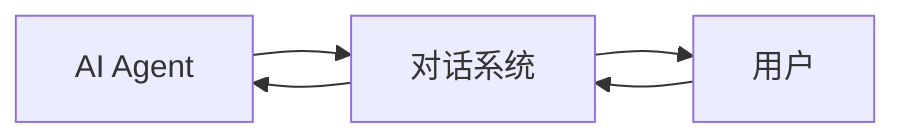

# AI Agent的对话系统在远程医疗中的应用

> 关键词：AI Agent、对话系统、远程医疗、自然语言处理、智能诊断

> 摘要：本文深入探讨了AI Agent的对话系统在远程医疗中的应用。首先介绍了相关背景，包括目的范围、预期读者等内容。接着阐述了AI Agent和对话系统的核心概念及联系，分析了核心算法原理并给出Python代码示例。详细讲解了涉及的数学模型和公式，通过实际案例展示了该系统在远程医疗中的具体应用。探讨了实际应用场景，推荐了学习、开发所需的工具和资源，最后总结了未来发展趋势与挑战，并提供了常见问题解答和扩展阅读资料。旨在为相关领域的研究者和开发者提供全面而深入的参考。

## 1. 背景介绍 
### 1.1 目的和范围
随着信息技术的飞速发展，远程医疗成为了医疗领域的一个重要发展方向。AI Agent的对话系统作为一种先进的交互技术，为远程医疗提供了更加便捷、高效的沟通方式。本文的目的在于全面探讨AI Agent的对话系统在远程医疗中的应用，包括其原理、算法、实际案例等方面。范围涵盖了从基础概念到实际应用的各个环节，旨在为读者提供一个系统而深入的了解。

### 1.2 预期读者
本文预期读者包括医疗行业从业者，如医生、护士等，他们可以了解如何利用AI Agent的对话系统提升远程医疗服务质量；计算机科学领域的研究者和开发者，他们可以从中获取技术灵感和实践经验；以及对远程医疗和人工智能感兴趣的普通读者，帮助他们了解这一前沿技术的应用。

### 1.3 文档结构概述
本文首先介绍相关背景信息，让读者对主题有初步认识。接着阐述核心概念与联系，为后续内容奠定基础。然后详细讲解核心算法原理和具体操作步骤，并给出数学模型和公式。通过项目实战展示代码实际案例，分析其在远程医疗中的应用。探讨实际应用场景，推荐相关工具和资源。最后总结未来发展趋势与挑战，提供常见问题解答和扩展阅读资料。

### 1.4 术语表
#### 1.4.1 核心术语定义
- **AI Agent**：人工智能代理，是一种能够感知环境、自主决策并采取行动以实现特定目标的软件实体。
- **对话系统**：能够与用户进行自然语言交互的计算机系统，可分为任务型对话系统和闲聊型对话系统等。
- **远程医疗**：通过信息技术，医疗机构之间或医疗机构与患者之间进行远距离的医疗服务。

#### 1.4.2 相关概念解释
- **自然语言处理（NLP）**：是计算机科学与语言学的交叉领域，旨在让计算机理解和处理人类语言。在AI Agent的对话系统中，NLP技术用于实现语音识别、语义理解、文本生成等功能。
- **智能诊断**：利用人工智能技术，对患者的症状、检查结果等信息进行分析，辅助医生做出诊断。

#### 1.4.3 缩略词列表
- **NLP**：Natural Language Processing（自然语言处理）
- **ML**：Machine Learning（机器学习）
- **DL**：Deep Learning（深度学习）

## 2. 核心概念与联系 

### 2.1 AI Agent的概念
AI Agent是一个具有自主性、反应性、社会性和主动性的智能实体。它能够感知周围环境的信息，根据自身的目标和知识进行决策，并采取相应的行动。在远程医疗中，AI Agent可以作为一个虚拟助手，与患者进行交互，收集信息，提供建议等。

### 2.2 对话系统的概念
对话系统是实现人与计算机自然语言交互的关键技术。它可以分为基于规则的对话系统和基于机器学习的对话系统。基于规则的对话系统通过预先定义的规则来处理用户输入，而基于机器学习的对话系统则通过大量的数据进行训练，学习语言模式和语义信息。

### 2.3 AI Agent与对话系统的联系
AI Agent可以利用对话系统与用户进行交互，对话系统为AI Agent提供了与用户沟通的接口。AI Agent通过对话系统获取用户的需求和信息，并根据这些信息做出决策和响应。同时，对话系统的性能也会影响AI Agent的交互效果。

### 2.4 文本示意图
```plaintext
              +----------------+
              |    AI Agent    |
              +----------------+
              |  - 自主性       |
              |  - 反应性       |
              |  - 社会性       |
              |  - 主动性       |
              +----------------+
                     |
                     | 利用
                     v
              +----------------+
              |  对话系统      |
              +----------------+
              |  - 自然语言交互 |
              |  - 语义理解    |
              |  - 文本生成    |
              +----------------+
                     |
                     | 与用户交互
                     v
              +----------------+
              |    用户        |
              +----------------+
```

### 2.5 Mermaid流程图


## 3. 核心算法原理 & 具体操作步骤 

### 3.1 自然语言处理基础算法
#### 3.1.1 分词算法
分词是自然语言处理的基础任务之一，其目的是将连续的文本序列分割成有意义的词语。常见的分词算法有基于规则的分词算法和基于统计的分词算法。

基于规则的分词算法通过预先定义的规则来进行分词，例如正向最大匹配法、逆向最大匹配法等。以下是正向最大匹配法的Python实现：
```python
def forward_max_match(sentence, word_dict, max_len):
    result = []
    index = 0
    while index < len(sentence):
        for i in range(min(len(sentence) - index, max_len), 0, -1):
            word = sentence[index:index + i]
            if word in word_dict:
                result.append(word)
                index += i
                break
        else:
            result.append(sentence[index])
            index += 1
    return result

# 示例
word_dict = {"我们", "是", "中国人"}
sentence = "我们是中国人"
max_len = 3
print(forward_max_match(sentence, word_dict, max_len))
```

#### 3.1.2 词性标注算法
词性标注是为文本中的每个词语标注其词性，如名词、动词、形容词等。常见的词性标注算法有基于统计的隐马尔可夫模型（HMM）和条件随机场（CRF）。

以下是使用Python的`jieba`库进行词性标注的示例：
```python
import jieba.posseg as pseg

sentence = "我们是中国人"
words = pseg.cut(sentence)
for word, flag in words:
    print(f"{word}: {flag}")
```

### 3.2 对话系统核心算法
#### 3.2.1 意图识别算法
意图识别是对话系统的关键环节，其目的是判断用户输入的意图。常见的意图识别算法有基于机器学习的算法，如支持向量机（SVM）、朴素贝叶斯分类器等。

以下是使用Python的`sklearn`库实现朴素贝叶斯分类器进行意图识别的示例：
```python
from sklearn.feature_extraction.text import TfidfVectorizer
from sklearn.naive_bayes import MultinomialNB
from sklearn.pipeline import Pipeline

# 示例数据
train_data = ["我想预约挂号", "我想查询药品信息"]
train_labels = ["预约挂号", "查询药品信息"]

# 构建模型
model = Pipeline([
    ('tfidf', TfidfVectorizer()),
    ('clf', MultinomialNB())
])

# 训练模型
model.fit(train_data, train_labels)

# 预测
test_data = ["我要预约挂号"]
predicted = model.predict(test_data)
print(predicted)
```

#### 3.2.2 回复生成算法
回复生成算法用于根据用户的意图和上下文生成合适的回复。常见的回复生成算法有基于模板的方法和基于深度学习的方法。

以下是一个简单的基于模板的回复生成示例：
```python
intent_reply_dict = {
    "预约挂号": "请提供您的姓名、身份证号和预约科室，我们将为您办理挂号。",
    "查询药品信息": "请告诉我您要查询的药品名称，我将为您提供相关信息。"
}

def generate_reply(intent):
    return intent_reply_dict.get(intent, "抱歉，我不理解您的意思。")

# 示例
intent = "预约挂号"
print(generate_reply(intent))
```

### 3.3 具体操作步骤
1. **数据收集**：收集远程医疗相关的对话数据，包括患者的问题、医生的回复等。
2. **数据预处理**：对收集到的数据进行清洗、分词、词性标注等预处理操作。
3. **模型训练**：使用预处理后的数据训练意图识别模型和回复生成模型。
4. **系统集成**：将训练好的模型集成到对话系统中，实现与AI Agent的交互。
5. **测试和优化**：对系统进行测试，根据测试结果进行优化和改进。

## 4. 数学模型和公式 & 详细讲解 & 举例说明 

### 4.1 隐马尔可夫模型（HMM）
#### 4.1.1 模型定义
隐马尔可夫模型是一个双重随机过程，包括一个隐藏的马尔可夫链和一个与隐藏状态相关的观测序列。HMM可以用三元组 $\lambda=(A, B, \pi)$ 表示，其中：
- $A$ 是状态转移概率矩阵，$A_{ij}=P(q_{t + 1}=j|q_t = i)$，表示在时刻 $t$ 处于状态 $i$ 的条件下，在时刻 $t + 1$ 转移到状态 $j$ 的概率。
- $B$ 是观测概率矩阵，$B_{jk}=P(o_t = k|q_t = j)$，表示在时刻 $t$ 处于状态 $j$ 的条件下，生成观测值 $k$ 的概率。
- $\pi$ 是初始状态概率向量，$\pi_i = P(q_1 = i)$，表示在时刻 $t = 1$ 处于状态 $i$ 的概率。

#### 4.1.2 前向算法
前向算法用于计算观测序列 $O = (o_1, o_2, \cdots, o_T)$ 在模型 $\lambda$ 下的概率 $P(O|\lambda)$。

定义前向变量 $\alpha_t(i)=P(o_1, o_2, \cdots, o_t, q_t = i|\lambda)$，则前向算法的步骤如下：
1. **初始化**：$\alpha_1(i)=\pi_i B_{i o_1}$，$i = 1, 2, \cdots, N$。
2. **递推**：$\alpha_{t + 1}(j)=\left(\sum_{i = 1}^{N}\alpha_t(i)A_{ij}\right)B_{j o_{t + 1}}$，$t = 1, 2, \cdots, T - 1$，$j = 1, 2, \cdots, N$。
3. **终止**：$P(O|\lambda)=\sum_{i = 1}^{N}\alpha_T(i)$。

#### 4.1.3 举例说明
假设有一个简单的HMM模型，状态集合 $Q = \{S_1, S_2\}$，观测集合 $V = \{v_1, v_2\}$，初始状态概率向量 $\pi = [0.6, 0.4]$，状态转移概率矩阵 $A=\begin{bmatrix}0.7 & 0.3\\0.4 & 0.6\end{bmatrix}$，观测概率矩阵 $B=\begin{bmatrix}0.5 & 0.5\\0.1 & 0.9\end{bmatrix}$，观测序列 $O = (v_1, v_2)$。

1. **初始化**：
   - $\alpha_1(1)=\pi_1 B_{1 o_1}=0.6\times0.5 = 0.3$
   - $\alpha_1(2)=\pi_2 B_{2 o_1}=0.4\times0.1 = 0.04$

2. **递推**：
   - $\alpha_2(1)=\left(\alpha_1(1)A_{11}+\alpha_1(2)A_{21}\right)B_{1 o_2}=(0.3\times0.7 + 0.04\times0.4)\times0.5 = 0.121$
   - $\alpha_2(2)=\left(\alpha_1(1)A_{12}+\alpha_1(2)A_{22}\right)B_{2 o_2}=(0.3\times0.3 + 0.04\times0.6)\times0.9 = 0.1026$

3. **终止**：
   - $P(O|\lambda)=\alpha_2(1)+\alpha_2(2)=0.121 + 0.1026 = 0.2236$

### 4.2 条件随机场（CRF）
#### 4.2.1 模型定义
条件随机场是一种判别式概率图模型，用于对序列数据进行建模。给定输入序列 $X = (x_1, x_2, \cdots, x_n)$ 和输出序列 $Y = (y_1, y_2, \cdots, y_n)$，CRF定义了条件概率 $P(Y|X)$。

$P(Y|X)=\frac{1}{Z(X)}\exp\left(\sum_{i = 1}^{n}\sum_{k}\lambda_k t_k(y_{i - 1}, y_i, X, i)+\sum_{i = 1}^{n}\sum_{l}\mu_l s_l(y_i, X, i)\right)$

其中，$Z(X)$ 是归一化因子，$t_k$ 是转移特征函数，$s_l$ 是状态特征函数，$\lambda_k$ 和 $\mu_l$ 是对应的权重。

#### 4.2.2 模型训练
CRF的训练通常使用最大似然估计方法，通过最大化对数似然函数来求解模型参数。

对数似然函数为：
$L(\theta)=\sum_{i = 1}^{N}\log P(Y^{(i)}|X^{(i)})=\sum_{i = 1}^{N}\left(\sum_{j = 1}^{n}\sum_{k}\lambda_k t_k(y_{j - 1}^{(i)}, y_j^{(i)}, X^{(i)}, j)+\sum_{j = 1}^{n}\sum_{l}\mu_l s_l(y_j^{(i)}, X^{(i)}, j)-\log Z(X^{(i)})\right)$

#### 4.2.3 举例说明
假设我们要对一个句子进行词性标注，输入序列 $X$ 是句子中的词语，输出序列 $Y$ 是对应的词性标签。我们可以定义转移特征函数和状态特征函数，例如：
- 转移特征函数 $t_1(y_{i - 1}, y_i, X, i)$ 表示从词性 $y_{i - 1}$ 转移到词性 $y_i$ 的特征。
- 状态特征函数 $s_1(y_i, X, i)$ 表示词语 $x_i$ 具有词性 $y_i$ 的特征。

通过训练数据来估计这些特征函数的权重，从而得到一个能够对新句子进行词性标注的CRF模型。

## 5. 项目实战：代码实际案例和详细解释说明 

### 5.1  开发环境搭建
#### 5.1.1 安装Python
首先需要安装Python，建议使用Python 3.7及以上版本。可以从Python官方网站（https://www.python.org/downloads/）下载安装包进行安装。

#### 5.1.2 安装必要的库
使用`pip`命令安装必要的库，如`jieba`、`sklearn`、`tensorflow`等。
```sh
pip install jieba sklearn tensorflow
```

### 5.2  源代码详细实现和代码解读
以下是一个简单的AI Agent对话系统在远程医疗中的实现示例：

```python
import jieba
from sklearn.feature_extraction.text import TfidfVectorizer
from sklearn.naive_bayes import MultinomialNB
from sklearn.pipeline import Pipeline

# 示例数据
train_data = ["我想预约挂号", "我想查询药品信息", "我感觉头疼", "我咳嗽很严重"]
train_labels = ["预约挂号", "查询药品信息", "症状描述", "症状描述"]

# 构建模型
model = Pipeline([
    ('tfidf', TfidfVectorizer(tokenizer=lambda x: jieba.lcut(x))),
    ('clf', MultinomialNB())
])

# 训练模型
model.fit(train_data, train_labels)

# 回复模板
intent_reply_dict = {
    "预约挂号": "请提供您的姓名、身份证号和预约科室，我们将为您办理挂号。",
    "查询药品信息": "请告诉我您要查询的药品名称，我将为您提供相关信息。",
    "症状描述": "请您详细描述一下症状出现的时间、频率等情况，我们会为您进一步分析。"
}

def generate_reply(user_input):
    intent = model.predict([user_input])[0]
    return intent_reply_dict.get(intent, "抱歉，我不理解您的意思。")

# 主循环
while True:
    user_input = input("请输入您的问题：")
    if user_input.lower() == 'exit':
        break
    reply = generate_reply(user_input)
    print(reply)
```

### 5.3  代码解读与分析
1. **数据准备**：定义了训练数据`train_data`和对应的标签`train_labels`，用于训练意图识别模型。
2. **模型构建**：使用`Pipeline`将`TfidfVectorizer`和`MultinomialNB`组合在一起，构建了一个简单的意图识别模型。
3. **模型训练**：调用`fit`方法对模型进行训练。
4. **回复模板**：定义了一个回复模板字典`intent_reply_dict`，根据不同的意图生成相应的回复。
5. **回复生成**：`generate_reply`函数根据用户输入预测意图，并从回复模板中获取相应的回复。
6. **主循环**：通过一个无限循环，不断接收用户输入，直到用户输入`exit`退出程序。

## 6. 实际应用场景 
### 6.1 患者咨询
患者可以通过AI Agent的对话系统向医生咨询病情、症状、治疗方法等问题。系统可以根据患者的描述提供初步的诊断建议和注意事项，帮助患者更好地了解自己的病情。

### 6.2 预约挂号
患者可以使用对话系统进行预约挂号，提供个人信息和预约科室，系统可以自动处理预约请求，并反馈预约结果。

### 6.3 药品信息查询
患者可以查询药品的名称、功效、用法用量、不良反应等信息。系统可以根据患者的需求提供详细的药品信息，帮助患者正确使用药品。

### 6.4 健康管理
对话系统可以提醒患者按时服药、进行体检等，帮助患者进行健康管理。同时，系统可以根据患者的健康数据，如血压、血糖等，提供个性化的健康建议。

## 7. 工具和资源推荐
### 7.1 学习资源推荐
#### 7.1.1 书籍推荐
- 《自然语言处理入门》：详细介绍了自然语言处理的基础算法和技术，适合初学者。
- 《深度学习》：全面阐述了深度学习的原理和应用，对于理解对话系统中的深度学习算法有很大帮助。
- 《医疗信息学》：介绍了医疗领域的信息技术应用，包括远程医疗、电子病历等方面的知识。

#### 7.1.2 在线课程
- Coursera上的“Natural Language Processing Specialization”：由顶尖大学的教授授课，系统讲解自然语言处理的各个方面。
- edX上的“Deep Learning Specialization”：深入介绍深度学习的理论和实践，对于提高对话系统的性能有很大帮助。
- 中国大学MOOC上的“远程医疗技术与应用”：介绍远程医疗的技术原理和应用案例，适合医疗行业从业者学习。

#### 7.1.3 技术博客和网站
- 博客园：有很多开发者分享自然语言处理和人工智能的技术文章。
- 机器之心：专注于人工智能领域的资讯和技术分享，提供最新的研究成果和应用案例。
- 丁香园：医疗行业的专业网站，提供医学知识、临床指南等内容，对于了解远程医疗的业务需求有很大帮助。

### 7.2 开发工具框架推荐
#### 7.2.1 IDE和编辑器
- PyCharm：功能强大的Python集成开发环境，提供代码编辑、调试、版本控制等功能。
- Visual Studio Code：轻量级的代码编辑器，支持多种编程语言和插件扩展，适合快速开发。

#### 7.2.2 调试和性能分析工具
- TensorBoard：用于可视化深度学习模型的训练过程和性能指标，帮助开发者调试和优化模型。
- Profiler：Python自带的性能分析工具，可以分析代码的运行时间和内存使用情况，找出性能瓶颈。

#### 7.2.3 相关框架和库
- NLTK：自然语言处理工具包，提供了丰富的语料库和算法实现，方便开发者进行自然语言处理任务。
- SpaCy：高效的自然语言处理库，具有快速的分词、词性标注、命名实体识别等功能。
- Rasa：开源的对话系统框架，提供了意图识别、回复生成等功能，支持快速开发对话系统。

### 7.3 相关论文著作推荐
#### 7.3.1 经典论文
- 《A Statistical Approach to Machine Translation》：提出了统计机器翻译的基本框架，对于理解自然语言处理中的统计方法有重要意义。
- 《Long Short-Term Memory》：介绍了长短期记忆网络（LSTM）的原理和应用，LSTM在对话系统中被广泛应用于处理序列数据。

#### 7.3.2 最新研究成果
- 关注ACL（Association for Computational Linguistics）、EMNLP（Conference on Empirical Methods in Natural Language Processing）等顶级自然语言处理会议的论文，了解最新的研究成果和技术趋势。

#### 7.3.3 应用案例分析
- 查阅相关的医疗信息技术期刊，如《Journal of Medical Internet Research》，了解AI Agent的对话系统在远程医疗中的实际应用案例和效果评估。

## 8. 总结：未来发展趋势与挑战
### 8.1 未来发展趋势
- **多模态交互**：未来的AI Agent对话系统将支持语音、图像、视频等多模态交互方式，提供更加丰富和便捷的用户体验。
- **个性化服务**：根据患者的个人信息、健康数据和历史记录，提供个性化的医疗建议和服务。
- **与其他技术融合**：与物联网、区块链等技术融合，实现医疗数据的安全共享和远程医疗设备的智能控制。

### 8.2 挑战
- **数据质量和安全**：远程医疗涉及大量的患者敏感数据，如何保证数据的质量和安全是一个重要挑战。
- **模型泛化能力**：对话系统需要在不同的医疗场景和用户需求下都能表现良好，提高模型的泛化能力是关键。
- **医疗伦理和法律问题**：AI Agent的对话系统在远程医疗中的应用涉及到医疗伦理和法律问题，如责任界定、隐私保护等，需要建立相应的规范和制度。

## 9. 附录：常见问题与解答
### 9.1 如何提高对话系统的准确性？
可以通过增加训练数据的数量和质量、优化模型结构和参数、使用更先进的算法等方式来提高对话系统的准确性。

### 9.2 对话系统能否替代医生进行诊断？
目前的对话系统还不能完全替代医生进行诊断，只能提供初步的建议和参考。医生的专业知识和临床经验仍然是诊断的关键。

### 9.3 如何保证对话系统的安全性？
可以采用数据加密、访问控制、安全审计等技术手段来保证对话系统的安全性。同时，需要建立完善的安全管理制度，加强人员培训和管理。

## 10. 扩展阅读 & 参考资料
- 《人工智能：现代方法》
- 《自然语言处理实战：基于Python和深度学习》
- ACL、EMNLP等会议的相关论文
- 丁香园、医脉通等医疗行业网站的相关文章

作者：AI天才研究院/AI Genius Institute & 禅与计算机程序设计艺术 /Zen And The Art of Computer Programming