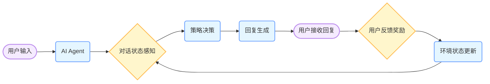

# AI Agent的强化学习在对话策略优化中的应用

> 关键词：AI Agent、强化学习、对话策略优化、马尔可夫决策过程、策略梯度算法

> 摘要：本文深入探讨了AI Agent的强化学习在对话策略优化中的应用。首先介绍了相关背景知识，包括目的、预期读者和文档结构等。接着阐述了核心概念，如AI Agent、强化学习和对话策略的原理与联系。详细讲解了核心算法原理，通过Python代码示例展示了具体操作步骤。同时给出了相关数学模型和公式，并举例说明。在项目实战部分，提供了开发环境搭建、源代码实现及代码解读。分析了实际应用场景，推荐了学习资源、开发工具框架和相关论文著作。最后总结了未来发展趋势与挑战，解答了常见问题，并列出了扩展阅读和参考资料。

## 1. 背景介绍 
### 1.1 目的和范围
在当今数字化时代，智能对话系统的应用越来越广泛，如智能客服、智能助手等。然而，要使对话系统能够自然、高效地与用户进行交互，就需要优化其对话策略。本文章的目的在于深入研究AI Agent的强化学习在对话策略优化中的应用，详细介绍相关理论、算法和实践方法。范围涵盖从核心概念的阐述到实际项目的开发，以及应用场景的分析和未来趋势的探讨。

### 1.2 预期读者
本文预期读者包括人工智能领域的研究人员、开发者、学生，以及对智能对话系统和强化学习感兴趣的技术爱好者。对于初学者，本文可以作为入门教程，帮助他们了解AI Agent强化学习在对话策略优化中的基本概念和方法；对于有一定经验的开发者和研究人员，本文提供了深入的技术分析和实际案例，可作为进一步研究和实践的参考。

### 1.3 文档结构概述
本文将按照以下结构进行组织：首先介绍背景知识，包括目的、预期读者和文档结构等。然后阐述核心概念，分析AI Agent、强化学习和对话策略之间的联系。接着详细讲解核心算法原理，通过Python代码展示具体操作步骤。之后给出相关数学模型和公式，并举例说明。在项目实战部分，提供开发环境搭建、源代码实现及代码解读。分析实际应用场景，推荐学习资源、开发工具框架和相关论文著作。最后总结未来发展趋势与挑战，解答常见问题，并列出扩展阅读和参考资料。

### 1.4 术语表
#### 1.4.1 核心术语定义
- **AI Agent**：能够感知环境并根据感知到的信息采取行动以实现特定目标的智能实体。在对话系统中，AI Agent可以理解用户的输入并生成合适的回复。
- **强化学习**：一种机器学习方法，智能体通过与环境进行交互，根据环境反馈的奖励信号来学习最优策略，以最大化长期累积奖励。
- **对话策略**：决定AI Agent在不同对话状态下应采取何种回复行动的规则或方法。
- **马尔可夫决策过程（MDP）**：一种用于描述强化学习问题的数学模型，由状态、动作、状态转移概率和奖励函数组成。
- **策略梯度算法**：一类用于优化强化学习策略的算法，通过计算策略的梯度来更新策略参数，以提高策略的性能。

#### 1.4.2 相关概念解释
- **状态**：在对话系统中，状态可以表示当前对话的上下文信息，如用户的历史输入、AI Agent的历史回复等。
- **动作**：AI Agent在当前状态下可以采取的回复行动，如选择不同的回复语句。
- **奖励函数**：用于评估AI Agent采取某个动作后环境给予的奖励，奖励的大小反映了该动作的好坏。
- **策略**：是一个从状态到动作的映射，决定了AI Agent在每个状态下选择动作的概率分布。

#### 1.4.3 缩略词列表
- **MDP**：Markov Decision Process（马尔可夫决策过程）
- **DQN**：Deep Q-Network（深度Q网络）
- **A2C**：Advantage Actor-Critic（优势演员-评论家算法）
- **PPO**：Proximal Policy Optimization（近端策略优化算法）

## 2. 核心概念与联系 
### 核心概念原理
#### AI Agent
AI Agent是一个具有感知、决策和行动能力的智能实体。在对话系统中，它可以接收用户的输入信息，对其进行理解和分析，然后根据自身的策略选择合适的回复。AI Agent的核心是其内部的决策机制，即对话策略，它决定了在不同的对话状态下应该采取何种行动。

#### 强化学习
强化学习是一种通过智能体与环境进行交互来学习最优策略的机器学习方法。智能体在每个时间步观察环境的状态，选择一个动作执行，环境会根据智能体的动作反馈一个奖励信号和下一个状态。智能体的目标是学习一个策略，使得长期累积奖励最大化。强化学习的核心在于通过不断地试错和学习，优化策略以适应环境。

#### 对话策略
对话策略是AI Agent在对话过程中选择回复行动的规则或方法。一个好的对话策略应该能够根据不同的对话状态生成自然、合理、有效的回复，以满足用户的需求。对话策略可以基于规则、基于机器学习或基于强化学习等方法来实现。

### 架构的文本示意图
```plaintext
+---------------------+
|      用户输入       |
+---------------------+
         |
         v
+---------------------+
|     AI Agent        |
|  - 对话状态感知      |
|  - 策略决策         |
|  - 回复生成         |
+---------------------+
         |
         v
+---------------------+
|      环境（用户）    |
|  - 接收回复         |
|  - 反馈奖励         |
+---------------------+
```

### Mermaid流程图


## 3. 核心算法原理 & 具体操作步骤 
### 马尔可夫决策过程（MDP）
马尔可夫决策过程是强化学习中常用的数学模型，用于描述智能体与环境的交互过程。一个MDP可以用一个五元组 $(S, A, P, R, \gamma)$ 表示：
- $S$ 是状态空间，表示环境的所有可能状态。
- $A$ 是动作空间，表示智能体在每个状态下可以采取的所有可能动作。
- $P(s'|s, a)$ 是状态转移概率，表示在状态 $s$ 下采取动作 $a$ 后转移到状态 $s'$ 的概率。
- $R(s, a)$ 是奖励函数，表示在状态 $s$ 下采取动作 $a$ 后获得的即时奖励。
- $\gamma$ 是折扣因子，用于权衡即时奖励和未来奖励的重要性，取值范围为 $[0, 1]$。

### 策略梯度算法
策略梯度算法是一类用于优化强化学习策略的算法，其核心思想是通过计算策略的梯度来更新策略参数，以提高策略的性能。常见的策略梯度算法包括REINFORCE、A2C和PPO等。

以下是一个使用Python和PyTorch实现的简单REINFORCE算法示例：

```python
import torch
import torch.nn as nn
import torch.optim as optim
import numpy as np

# 定义策略网络
class PolicyNetwork(nn.Module):
    def __init__(self, input_size, output_size):
        super(PolicyNetwork, self).__init__()
        self.fc1 = nn.Linear(input_size, 128)
        self.fc2 = nn.Linear(128, output_size)
        self.softmax = nn.Softmax(dim=1)

    def forward(self, x):
        x = torch.relu(self.fc1(x))
        x = self.fc2(x)
        x = self.softmax(x)
        return x

# 定义环境（简化示例）
class Environment:
    def __init__(self):
        self.state = np.random.randn(10)

    def step(self, action):
        # 简单模拟状态转移和奖励
        next_state = np.random.randn(10)
        reward = np.random.randn()
        return next_state, reward

# 训练函数
def train():
    input_size = 10
    output_size = 5
    policy = PolicyNetwork(input_size, output_size)
    optimizer = optim.Adam(policy.parameters(), lr=0.001)
    env = Environment()

    num_episodes = 1000
    gamma = 0.99

    for episode in range(num_episodes):
        states = []
        actions = []
        rewards = []

        state = env.state
        done = False

        while not done:
            state_tensor = torch.FloatTensor(state).unsqueeze(0)
            action_probs = policy(state_tensor)
            action = torch.multinomial(action_probs, 1).item()

            next_state, reward = env.step(action)

            states.append(state)
            actions.append(action)
            rewards.append(reward)

            state = next_state

        # 计算累积奖励
        discounted_rewards = []
        cumulative_reward = 0
        for reward in reversed(rewards):
            cumulative_reward = reward + gamma * cumulative_reward
            discounted_rewards.insert(0, cumulative_reward)

        discounted_rewards = torch.FloatTensor(discounted_rewards)
        discounted_rewards = (discounted_rewards - discounted_rewards.mean()) / (discounted_rewards.std() + 1e-9)

        # 计算损失
        loss = 0
        for i in range(len(states)):
            state_tensor = torch.FloatTensor(states[i]).unsqueeze(0)
            action_probs = policy(state_tensor)
            log_prob = torch.log(action_probs.squeeze(0)[actions[i]])
            loss += -log_prob * discounted_rewards[i]

        # 更新策略网络
        optimizer.zero_grad()
        loss.backward()
        optimizer.step()

        if episode % 100 == 0:
            print(f"Episode {episode}: Loss = {loss.item()}")

if __name__ == "__main__":
    train()
```

### 具体操作步骤
1. **定义策略网络**：使用神经网络来表示策略，输入为当前状态，输出为动作的概率分布。
2. **初始化环境**：创建一个模拟对话环境，包括状态空间、动作空间、状态转移概率和奖励函数。
3. **训练过程**：
    - 在每个回合中，智能体根据当前策略选择动作与环境进行交互，记录状态、动作和奖励。
    - 计算累积折扣奖励。
    - 根据累积折扣奖励计算损失，使用梯度下降法更新策略网络的参数。
4. **重复训练**：重复步骤3，直到策略收敛或达到最大训练回合数。

## 4. 数学模型和公式 & 详细讲解 & 举例说明 
### 马尔可夫决策过程（MDP）公式
#### 状态价值函数
状态价值函数 $V^\pi(s)$ 表示在策略 $\pi$ 下，从状态 $s$ 开始的长期累积折扣奖励的期望：
$$V^\pi(s) = \mathbb{E}_\pi\left[\sum_{t=0}^{\infty} \gamma^t R_{t+1} \mid S_0 = s\right]$$
其中，$R_{t+1}$ 是在时间步 $t + 1$ 获得的奖励，$\gamma$ 是折扣因子。

#### 动作价值函数
动作价值函数 $Q^\pi(s, a)$ 表示在策略 $\pi$ 下，从状态 $s$ 采取动作 $a$ 后，长期累积折扣奖励的期望：
$$Q^\pi(s, a) = \mathbb{E}_\pi\left[\sum_{t=0}^{\infty} \gamma^t R_{t+1} \mid S_0 = s, A_0 = a\right]$$

#### 贝尔曼方程
状态价值函数和动作价值函数满足贝尔曼方程：
$$V^\pi(s) = \sum_{a \in A} \pi(a \mid s) Q^\pi(s, a)$$
$$Q^\pi(s, a) = R(s, a) + \gamma \sum_{s' \in S} P(s' \mid s, a) V^\pi(s')$$

### 策略梯度定理
策略梯度定理给出了策略梯度的计算公式：
$$\nabla J(\theta) = \mathbb{E}_\pi\left[\nabla \log \pi(a \mid s; \theta) Q^\pi(s, a)\right]$$
其中，$J(\theta)$ 是策略 $\pi(a \mid s; \theta)$ 的性能指标，$\theta$ 是策略网络的参数。

### 举例说明
假设一个简单的对话场景，状态空间 $S = \{s_1, s_2\}$，动作空间 $A = \{a_1, a_2\}$，状态转移概率和奖励函数如下：

| $s$ | $a$ | $P(s' \mid s, a)$ | $R(s, a)$ |
| --- | --- | --- | --- |
| $s_1$ | $a_1$ | $P(s_1 \mid s_1, a_1) = 0.7, P(s_2 \mid s_1, a_1) = 0.3$ | $R(s_1, a_1) = 1$ |
| $s_1$ | $a_2$ | $P(s_1 \mid s_1, a_2) = 0.2, P(s_2 \mid s_1, a_2) = 0.8$ | $R(s_1, a_2) = -1$ |
| $s_2$ | $a_1$ | $P(s_1 \mid s_2, a_1) = 0.4, P(s_2 \mid s_2, a_1) = 0.6$ | $R(s_2, a_1) = 2$ |
| $s_2$ | $a_2$ | $P(s_1 \mid s_2, a_2) = 0.9, P(s_2 \mid s_2, a_2) = 0.1$ | $R(s_2, a_2) = -2$ |

假设策略 $\pi$ 为：
$$\pi(a_1 \mid s_1) = 0.6, \pi(a_2 \mid s_1) = 0.4$$
$$\pi(a_1 \mid s_2) = 0.3, \pi(a_2 \mid s_2) = 0.7$$

使用贝尔曼方程计算状态价值函数 $V^\pi(s)$：
对于状态 $s_1$：
$$
\begin{align*}
V^\pi(s_1) &= \pi(a_1 \mid s_1) Q^\pi(s_1, a_1) + \pi(a_2 \mid s_1) Q^\pi(s_1, a_2)\\
Q^\pi(s_1, a_1) &= R(s_1, a_1) + \gamma \left[P(s_1 \mid s_1, a_1) V^\pi(s_1) + P(s_2 \mid s_1, a_1) V^\pi(s_2)\right]\\
Q^\pi(s_1, a_2) &= R(s_1, a_2) + \gamma \left[P(s_1 \mid s_1, a_2) V^\pi(s_1) + P(s_2 \mid s_1, a_2) V^\pi(s_2)\right]
\end{align*}
$$
对于状态 $s_2$：
$$
\begin{align*}
V^\pi(s_2) &= \pi(a_1 \mid s_2) Q^\pi(s_2, a_1) + \pi(a_2 \mid s_2) Q^\pi(s_2, a_2)\\
Q^\pi(s_2, a_1) &= R(s_2, a_1) + \gamma \left[P(s_1 \mid s_2, a_1) V^\pi(s_1) + P(s_2 \mid s_2, a_1) V^\pi(s_2)\right]\\
Q^\pi(s_2, a_2) &= R(s_2, a_2) + \gamma \left[P(s_1 \mid s_2, a_2) V^\pi(s_1) + P(s_2 \mid s_2, a_2) V^\pi(s_2)\right]
\end{align*}
$$
假设 $\gamma = 0.9$，可以通过迭代求解上述方程组得到 $V^\pi(s_1)$ 和 $V^\pi(s_2)$ 的值。

## 5. 项目实战：代码实际案例和详细解释说明 
### 5.1  开发环境搭建
#### 安装Python
首先，确保你已经安装了Python 3.6或更高版本。可以从Python官方网站（https://www.python.org/downloads/）下载并安装适合你操作系统的Python版本。

#### 安装依赖库
使用以下命令安装所需的依赖库：
```sh
pip install torch numpy
```
`torch` 是PyTorch深度学习框架，用于构建和训练神经网络；`numpy` 是Python的数值计算库，用于处理数组和矩阵运算。

### 5.2  源代码详细实现和代码解读
以下是一个完整的基于强化学习的对话策略优化项目的代码示例：

```python
import torch
import torch.nn as nn
import torch.optim as optim
import numpy as np

# 定义策略网络
class PolicyNetwork(nn.Module):
    def __init__(self, input_size, output_size):
        super(PolicyNetwork, self).__init__()
        self.fc1 = nn.Linear(input_size, 128)
        self.fc2 = nn.Linear(128, output_size)
        self.softmax = nn.Softmax(dim=1)

    def forward(self, x):
        x = torch.relu(self.fc1(x))
        x = self.fc2(x)
        x = self.softmax(x)
        return x

# 定义对话环境
class DialogueEnvironment:
    def __init__(self):
        # 初始化状态
        self.state = np.random.randn(10)
        # 动作空间大小
        self.action_space_size = 5

    def step(self, action):
        # 简单模拟状态转移和奖励
        next_state = np.random.randn(10)
        # 奖励函数，这里简单随机生成奖励
        reward = np.random.randn()
        # 判断对话是否结束，这里简单假设永远不结束
        done = False
        return next_state, reward, done

# 训练函数
def train():
    # 输入状态的维度
    input_size = 10
    # 动作空间的大小
    output_size = 5
    # 创建策略网络
    policy = PolicyNetwork(input_size, output_size)
    # 定义优化器
    optimizer = optim.Adam(policy.parameters(), lr=0.001)
    # 创建对话环境
    env = DialogueEnvironment()

    # 训练的回合数
    num_episodes = 1000
    # 折扣因子
    gamma = 0.99

    for episode in range(num_episodes):
        states = []
        actions = []
        rewards = []

        state = env.state
        done = False

        while not done:
            # 将状态转换为张量
            state_tensor = torch.FloatTensor(state).unsqueeze(0)
            # 通过策略网络计算动作概率分布
            action_probs = policy(state_tensor)
            # 根据动作概率分布采样一个动作
            action = torch.multinomial(action_probs, 1).item()

            # 与环境进行交互，得到下一个状态、奖励和是否结束的标志
            next_state, reward, done = env.step(action)

            # 记录状态、动作和奖励
            states.append(state)
            actions.append(action)
            rewards.append(reward)

            state = next_state

        # 计算累积折扣奖励
        discounted_rewards = []
        cumulative_reward = 0
        for reward in reversed(rewards):
            cumulative_reward = reward + gamma * cumulative_reward
            discounted_rewards.insert(0, cumulative_reward)

        discounted_rewards = torch.FloatTensor(discounted_rewards)
        # 对累积折扣奖励进行标准化处理
        discounted_rewards = (discounted_rewards - discounted_rewards.mean()) / (discounted_rewards.std() + 1e-9)

        # 计算损失
        loss = 0
        for i in range(len(states)):
            state_tensor = torch.FloatTensor(states[i]).unsqueeze(0)
            action_probs = policy(state_tensor)
            # 计算选择动作的对数概率
            log_prob = torch.log(action_probs.squeeze(0)[actions[i]])
            # 累积损失
            loss += -log_prob * discounted_rewards[i]

        # 清空优化器的梯度
        optimizer.zero_grad()
        # 反向传播计算梯度
        loss.backward()
        # 更新策略网络的参数
        optimizer.step()

        if episode % 100 == 0:
            print(f"Episode {episode}: Loss = {loss.item()}")

if __name__ == "__main__":
    train()
```

### 5.3  代码解读与分析
#### 策略网络（PolicyNetwork）
- `__init__` 方法：初始化策略网络的结构，包括两个全连接层和一个Softmax层。
- `forward` 方法：定义了网络的前向传播过程，输入状态经过两个全连接层和ReLU激活函数，最后通过Softmax层输出动作的概率分布。

#### 对话环境（DialogueEnvironment）
- `__init__` 方法：初始化对话环境的状态和动作空间大小。
- `step` 方法：模拟对话环境的状态转移和奖励反馈，输入动作，返回下一个状态、奖励和是否结束的标志。

#### 训练函数（train）
- 初始化策略网络、优化器和对话环境。
- 进行多个回合的训练，每个回合中智能体与环境进行交互，记录状态、动作和奖励。
- 计算累积折扣奖励，并进行标准化处理。
- 根据累积折扣奖励计算损失，使用梯度下降法更新策略网络的参数。

通过不断地训练，策略网络会逐渐学习到最优的对话策略，使得智能体在对话中能够获得更高的累积奖励。

## 6. 实际应用场景 
### 智能客服系统
在智能客服系统中，AI Agent可以使用强化学习优化对话策略，以更好地回答用户的问题。通过与用户的交互，AI Agent可以根据用户的反馈（如满意度评分）获得奖励，从而不断调整自己的回复策略。例如，当用户对回复表示满意时，给予正奖励；当用户表示不满意时，给予负奖励。这样，AI Agent可以逐渐学习到如何提供更准确、更有用的回复，提高用户满意度。

### 智能助手
智能助手（如语音助手）可以利用强化学习优化对话策略，以提供更自然、更个性化的交互体验。AI Agent可以根据用户的历史交互记录、偏好和上下文信息，选择最合适的回复。例如，当用户询问天气时，智能助手可以根据用户所在的位置和时间，提供准确的天气信息；当用户进行多次交互后，智能助手可以根据用户的偏好，推荐相关的内容或服务。

### 聊天机器人
聊天机器人可以使用强化学习优化对话策略，以提高对话的流畅性和趣味性。通过与用户的对话，AI Agent可以学习到用户的语言习惯和兴趣爱好，从而生成更符合用户需求的回复。例如，在聊天过程中，AI Agent可以根据用户的话题，主动发起新的话题，引导对话的进行；同时，AI Agent可以使用幽默、调侃等方式，增加对话的趣味性。

### 教育领域
在教育领域，智能辅导系统可以使用强化学习优化对话策略，以更好地帮助学生学习。AI Agent可以根据学生的学习情况和问题，提供个性化的辅导和建议。例如，当学生回答问题正确时，给予正奖励；当学生回答错误时，给予负奖励，并提供正确的解答和相关的知识点。这样，AI Agent可以逐渐学习到如何针对不同的学生提供最合适的辅导，提高学生的学习效果。

## 7. 工具和资源推荐
### 7.1 学习资源推荐
#### 7.1.1 书籍推荐
- 《Reinforcement Learning: An Introduction》（《强化学习：原理与Python实现》）：这是一本强化学习领域的经典教材，详细介绍了强化学习的基本概念、算法和应用。
- 《Deep Reinforcement Learning Hands-On》（《深度强化学习实战》）：该书结合实际案例，介绍了深度强化学习的算法和实现方法，适合有一定编程基础的读者。
- 《Artificial Intelligence: A Modern Approach》（《人工智能：一种现代的方法》）：这是一本全面介绍人工智能领域的经典教材，其中包含了强化学习的相关内容。

#### 7.1.2 在线课程
- Coursera上的“Reinforcement Learning Specialization”：由UC Berkeley的教授授课，系统介绍了强化学习的理论和实践。
- edX上的“Deep Reinforcement Learning”：由OpenAI的研究人员授课，深入讲解了深度强化学习的算法和应用。
- 网易云课堂上的“强化学习实战教程”：结合Python代码，详细介绍了强化学习的基本算法和实现方法。

#### 7.1.3 技术博客和网站
- OpenAI官方博客（https://openai.com/blog/）：发布了许多关于强化学习的最新研究成果和应用案例。
- DeepMind官方博客（https://deepmind.com/blog/）：DeepMind是强化学习领域的领先研究机构，其博客上有很多高质量的技术文章。
- Medium上的“Towards Data Science”：该网站上有很多关于强化学习的技术文章和教程，适合初学者和有一定经验的开发者。

### 7.2 开发工具框架推荐
#### 7.2.1 IDE和编辑器
- PyCharm：一款专门为Python开发设计的集成开发环境，具有强大的代码编辑、调试和项目管理功能。
- Jupyter Notebook：一个交互式的开发环境，适合进行数据探索、模型训练和结果展示。
- Visual Studio Code：一款轻量级的代码编辑器，支持多种编程语言和插件，可用于强化学习项目的开发。

#### 7.2.2 调试和性能分析工具
- TensorBoard：一个可视化工具，可用于监控深度学习模型的训练过程，如损失函数的变化、梯度的分布等。
- Py-Spy：一个用于分析Python程序性能的工具，可帮助开发者找出程序中的性能瓶颈。
- cProfile：Python内置的性能分析工具，可用于分析函数的调用时间和调用次数。

#### 7.2.3 相关框架和库
- PyTorch：一个开源的深度学习框架，具有动态计算图、易于使用等优点，广泛应用于强化学习领域。
- TensorFlow：另一个流行的深度学习框架，具有强大的分布式训练和模型部署能力。
- Gym：OpenAI开发的一个开源的强化学习环境库，提供了多种模拟环境，可用于强化学习算法的测试和验证。

### 7.3 相关论文著作推荐
#### 7.3.1 经典论文
- “Playing Atari with Deep Reinforcement Learning”（《通过深度强化学习玩雅达利游戏》）：该论文提出了深度Q网络（DQN）算法，开创了深度强化学习的先河。
- “Asynchronous Methods for Deep Reinforcement Learning”（《深度强化学习的异步方法》）：提出了A3C算法，解决了DQN算法的训练效率问题。
- “Proximal Policy Optimization Algorithms”（《近端策略优化算法》）：提出了PPO算法，是一种高效、稳定的策略梯度算法。

#### 7.3.2 最新研究成果
- 每年的NeurIPS（神经信息处理系统大会）、ICML（国际机器学习会议）和AAAI（美国人工智能协会年会）等顶级学术会议上都会有很多关于强化学习的最新研究成果。
- arXiv（https://arxiv.org/）是一个预印本平台，上面有很多关于强化学习的最新研究论文。

#### 7.3.3 应用案例分析
- “AlphaGo Zero: Learning from Scratch”（《AlphaGo Zero：从零开始学习》）：介绍了AlphaGo Zero使用强化学习在围棋领域取得的巨大成功。
- “Deep Reinforcement Learning for Dialogue Generation”（《深度强化学习在对话生成中的应用》）：探讨了强化学习在对话系统中的应用和优化方法。

## 8. 总结：未来发展趋势与挑战
### 未来发展趋势
#### 多模态对话
未来的对话系统将不仅仅局限于文本交互，还将支持语音、图像、视频等多模态输入和输出。强化学习可以用于优化多模态对话策略，使得AI Agent能够更好地理解和处理多模态信息，提供更丰富、更自然的交互体验。

#### 个性化对话
随着用户数据的不断积累，未来的对话系统将能够实现更加个性化的交互。强化学习可以根据用户的历史交互记录、偏好和上下文信息，学习到每个用户的个性化对话策略，提供更符合用户需求的回复。

#### 与其他技术的融合
强化学习将与其他技术（如自然语言处理、计算机视觉、知识图谱等）进行更深入的融合。例如，结合知识图谱可以为对话系统提供更丰富的知识支持，使得AI Agent能够回答更复杂的问题；结合计算机视觉可以实现对图像和视频的理解，应用于智能客服、智能助手等领域。

#### 大规模分布式训练
为了处理更复杂的对话任务和大规模的数据集，未来的强化学习算法将需要进行大规模分布式训练。通过分布式计算，可以提高训练效率，加快模型的收敛速度。

### 挑战
#### 奖励设计困难
在对话策略优化中，奖励函数的设计是一个关键问题。如何定义一个合理的奖励函数，使得AI Agent能够学习到最优的对话策略，是一个具有挑战性的任务。奖励函数不仅要考虑用户的满意度，还要考虑对话的流畅性、合理性等多个因素。

#### 数据获取和标注成本高
强化学习需要大量的训练数据来学习最优策略。在对话系统中，获取高质量的对话数据并进行标注是一个成本较高的过程。此外，由于对话数据的多样性和复杂性，如何对数据进行有效的预处理和特征提取也是一个挑战。

#### 模型可解释性差
深度强化学习模型通常是黑盒模型，其决策过程难以解释。在一些对安全性和可靠性要求较高的应用场景（如医疗、金融等）中，模型的可解释性是一个重要的问题。如何提高强化学习模型的可解释性，使得用户能够理解模型的决策过程，是未来需要解决的挑战之一。

#### 环境动态变化
在实际应用中，对话环境是动态变化的，用户的需求和语言习惯也会随着时间的推移而发生变化。如何使AI Agent能够快速适应环境的变化，保持良好的对话性能，是一个具有挑战性的问题。

## 9. 附录：常见问题与解答
### 1. 强化学习在对话策略优化中的优势是什么？
强化学习的优势在于它可以通过与环境进行交互，根据环境反馈的奖励信号来学习最优策略。在对话策略优化中，强化学习可以根据用户的反馈动态调整对话策略，使得AI Agent能够逐渐学习到如何提供更自然、更合理、更有效的回复，提高用户满意度。

### 2. 如何设计一个合理的奖励函数？
设计合理的奖励函数需要考虑多个因素，如用户的满意度、对话的流畅性、回复的准确性等。可以通过以下方法来设计奖励函数：
- 直接根据用户的反馈（如满意度评分）给予奖励。
- 考虑对话的长度和轮数，避免过长或过短的对话。
- 评估回复的准确性和相关性，给予相应的奖励。
- 引入一些先验知识，如语言规则、领域知识等，作为奖励的一部分。

### 3. 强化学习算法的训练时间通常需要多久？
强化学习算法的训练时间取决于多个因素，如算法的复杂度、数据集的大小、计算资源等。一般来说，简单的算法和小规模的数据集可能只需要几个小时或几天的训练时间；而复杂的算法和大规模的数据集可能需要数周甚至数月的训练时间。可以通过优化算法、使用分布式计算等方法来缩短训练时间。

### 4. 如何评估强化学习优化后的对话策略的性能？
可以使用以下指标来评估强化学习优化后的对话策略的性能：
- 用户满意度：通过用户调查或反馈来评估用户对对话系统的满意度。
- 对话成功率：计算对话能够达到预期目标的比例。
- 回复质量：评估回复的准确性、相关性、流畅性等指标。
- 平均对话轮数：反映对话的效率和流畅性。

### 5. 强化学习在对话策略优化中存在哪些局限性？
强化学习在对话策略优化中存在以下局限性：
- 奖励设计困难：合理的奖励函数设计是一个挑战，需要考虑多个因素。
- 数据获取和标注成本高：需要大量的训练数据，并且数据的标注成本较高。
- 模型可解释性差：深度强化学习模型通常是黑盒模型，决策过程难以解释。
- 环境动态变化适应性差：难以快速适应环境的动态变化。

## 10. 扩展阅读 & 参考资料
### 扩展阅读
- Sutton, R. S., & Barto, A. G. (2018). Reinforcement Learning: An Introduction. MIT Press.
- Lapan, M. (2018). Deep Reinforcement Learning Hands-On. Packt Publishing.
- Russell, S. J., & Norvig, P. (2016). Artificial Intelligence: A Modern Approach. Pearson.

### 参考资料
- Mnih, V., Kavukcuoglu, K., Silver, D., et al. (2013). Playing Atari with Deep Reinforcement Learning. arXiv preprint arXiv:1312.5602.
- Mnih, V., Badia, A. P., Mirza, M., et al. (2016). Asynchronous Methods for Deep Reinforcement Learning. In Proceedings of the 33rd International Conference on Machine Learning.
- Schulman, J., Wolski, F., Dhariwal, P., et al. (2017). Proximal Policy Optimization Algorithms. arXiv preprint arXiv:1707.06347.

作者：AI天才研究院/AI Genius Institute & 禅与计算机程序设计艺术 /Zen And The Art of Computer Programming