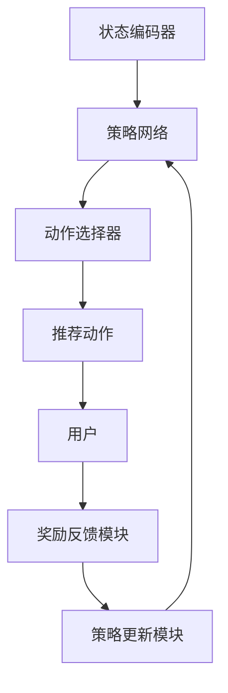

# AI Agent的强化学习在推荐系统中的应用

> 关键词：AI Agent、强化学习、推荐系统、策略优化、奖励机制

> 摘要：本文深入探讨了AI Agent的强化学习在推荐系统中的应用。首先介绍了相关背景知识，包括目的、预期读者、文档结构和术语表。接着阐述了核心概念与联系，分析了核心算法原理并给出Python代码示例，详细讲解了数学模型和公式。通过项目实战展示了代码实现和解读，探讨了实际应用场景。同时推荐了学习资源、开发工具框架和相关论文著作。最后总结了未来发展趋势与挑战，还包含常见问题解答和扩展阅读参考资料，旨在为读者全面理解和应用这一技术提供深入的指导。

## 1. 背景介绍 
### 1.1 目的和范围
随着互联网和信息技术的飞速发展，推荐系统在各个领域得到了广泛应用，如电商、社交媒体、新闻资讯等。然而，传统的推荐系统方法往往存在一些局限性，如难以适应动态变化的用户偏好和环境。AI Agent的强化学习为解决这些问题提供了新的思路和方法。本文的目的是深入研究AI Agent的强化学习在推荐系统中的应用，探讨其原理、算法、实际应用场景等方面的内容，为相关研究和实践提供参考。范围涵盖了从理论基础到实际应用的多个层面，包括核心概念的解释、算法原理的分析、代码实现的展示以及实际案例的讨论。

### 1.2 预期读者
本文的预期读者包括从事推荐系统开发、研究的专业人员，如数据科学家、算法工程师、软件开发者等；对人工智能、强化学习领域感兴趣的研究人员和学生；以及希望了解如何利用AI Agent的强化学习提升推荐系统性能的企业管理人员和技术决策者。

### 1.3 文档结构概述
本文共分为十个部分。第一部分为背景介绍，包括目的和范围、预期读者、文档结构概述和术语表；第二部分阐述核心概念与联系，给出核心概念原理和架构的文本示意图和Mermaid流程图；第三部分讲解核心算法原理并给出具体操作步骤，使用Python源代码详细阐述；第四部分介绍数学模型和公式，并进行详细讲解和举例说明；第五部分是项目实战，包括开发环境搭建、源代码详细实现和代码解读、代码解读与分析；第六部分探讨实际应用场景；第七部分推荐工具和资源，包括学习资源、开发工具框架和相关论文著作；第八部分总结未来发展趋势与挑战；第九部分为附录，包含常见问题与解答；第十部分提供扩展阅读和参考资料。

### 1.4 术语表
#### 1.4.1 核心术语定义
- **AI Agent**：人工智能代理，是一种能够感知环境、做出决策并执行动作的智能实体。在推荐系统中，AI Agent可以根据用户的行为和环境信息，选择合适的推荐内容。
- **强化学习**：一种机器学习方法，通过智能体与环境进行交互，根据环境反馈的奖励信号来学习最优策略，以最大化长期累积奖励。
- **推荐系统**：一种信息过滤系统，旨在根据用户的历史行为、偏好等信息，为用户提供个性化的推荐内容。
- **策略**：强化学习中智能体选择动作的规则，通常用函数表示。
- **奖励**：环境对智能体动作的反馈，用于指导智能体学习最优策略。

#### 1.4.2 相关概念解释
- **状态**：在强化学习中，状态表示环境的当前情况。在推荐系统中，状态可以包括用户的历史行为、当前的上下文信息等。
- **动作**：智能体在某个状态下采取的行为。在推荐系统中，动作可以是推荐给用户的具体内容。
- **价值函数**：用于评估某个状态或状态 - 动作对的价值，反映了从该状态或状态 - 动作对开始，遵循某个策略所能获得的长期累积奖励。

#### 1.4.3 缩略词列表
- **Q - learning**：一种无模型的强化学习算法，用于学习最优动作价值函数。
- **DQN**：深度Q网络，将深度学习与Q - learning相结合的算法。
- **PPO**：近端策略优化算法，一种基于策略梯度的强化学习算法。

## 2. 核心概念与联系 

### 核心概念原理
在推荐系统中应用AI Agent的强化学习，其核心思想是将推荐过程看作是一个强化学习问题。AI Agent作为推荐系统的决策者，通过与用户（环境）进行交互，不断学习用户的偏好和行为模式，以提供更符合用户需求的推荐内容。

AI Agent在每个时间步观察用户的状态（如历史浏览记录、购买记录等），根据当前策略选择一个推荐动作（如推荐某件商品、某条新闻等）。用户对推荐内容的反馈（如点击、购买、忽略等）作为奖励信号返回给AI Agent。AI Agent根据奖励信号调整策略，以最大化长期累积奖励。

### 架构的文本示意图
推荐系统中的AI Agent强化学习架构主要包括以下几个部分：
- **状态编码器**：将用户的历史行为和当前上下文信息编码为AI Agent能够理解的状态表示。
- **策略网络**：根据状态信息输出推荐动作的概率分布。
- **动作选择器**：根据策略网络输出的概率分布选择具体的推荐动作。
- **奖励反馈模块**：收集用户对推荐内容的反馈，将其转化为奖励信号。
- **策略更新模块**：根据奖励信号更新策略网络的参数，以优化策略。

### Mermaid流程图


## 3. 核心算法原理 & 具体操作步骤 

### 核心算法原理
这里以Q - learning算法为例进行讲解。Q - learning是一种无模型的强化学习算法，其目标是学习一个最优动作价值函数 $Q(s,a)$，表示在状态 $s$ 下采取动作 $a$ 所能获得的最大长期累积奖励。

Q - learning的更新公式为：
$$Q(s_t,a_t) \leftarrow Q(s_t,a_t) + \alpha [r_{t+1} + \gamma \max_{a} Q(s_{t+1},a) - Q(s_t,a_t)]$$
其中，$s_t$ 是当前状态，$a_t$ 是当前动作，$r_{t+1}$ 是执行动作 $a_t$ 后获得的奖励，$s_{t+1}$ 是下一个状态，$\alpha$ 是学习率，$\gamma$ 是折扣因子。

### 具体操作步骤
1. **初始化**：初始化动作价值函数 $Q(s,a)$ 为任意值，通常初始化为零。
2. **循环执行以下步骤**：
    - 观察当前状态 $s_t$。
    - 根据当前的 $Q$ 函数和某种策略（如 $\epsilon$-贪心策略）选择动作 $a_t$。
    - 执行动作 $a_t$，观察奖励 $r_{t+1}$ 和下一个状态 $s_{t+1}$。
    - 根据Q - learning更新公式更新 $Q(s_t,a_t)$。
    - 更新当前状态 $s_t = s_{t+1}$。

### Python源代码实现
```python
import numpy as np

# 定义Q - learning类
class QLearningAgent:
    def __init__(self, state_size, action_size, learning_rate=0.1, discount_factor=0.9, epsilon=0.1):
        self.state_size = state_size
        self.action_size = action_size
        self.learning_rate = learning_rate
        self.discount_factor = discount_factor
        self.epsilon = epsilon
        self.q_table = np.zeros((state_size, action_size))

    def choose_action(self, state):
        if np.random.uniform(0, 1) < self.epsilon:
            # 探索：随机选择动作
            action = np.random.choice(self.action_size)
        else:
            # 利用：选择Q值最大的动作
            action = np.argmax(self.q_table[state, :])
        return action

    def update_q_table(self, state, action, reward, next_state):
        # Q - learning更新公式
        max_q_next = np.max(self.q_table[next_state, :])
        self.q_table[state, action] += self.learning_rate * (reward + self.discount_factor * max_q_next - self.q_table[state, action])
```

## 4. 数学模型和公式 & 详细讲解 & 举例说明 

### 数学模型和公式
#### 马尔可夫决策过程（MDP）
推荐系统中的强化学习问题可以用马尔可夫决策过程来建模。一个MDP可以用一个五元组 $(S,A,P,R,\gamma)$ 表示，其中：
- $S$ 是状态空间，表示所有可能的状态集合。
- $A$ 是动作空间，表示所有可能的动作集合。
- $P(s_{t+1}|s_t,a_t)$ 是状态转移概率，表示在状态 $s_t$ 下执行动作 $a_t$ 后转移到状态 $s_{t+1}$ 的概率。
- $R(s_t,a_t,s_{t+1})$ 是奖励函数，表示在状态 $s_t$ 下执行动作 $a_t$ 并转移到状态 $s_{t+1}$ 时获得的奖励。
- $\gamma$ 是折扣因子，用于平衡短期奖励和长期奖励。

#### 价值函数
- **状态价值函数**：$V^{\pi}(s) = \mathbb{E}_{\pi} \left[ \sum_{t=0}^{\infty} \gamma^t r_{t+1} | s_0 = s \right]$，表示从状态 $s$ 开始，遵循策略 $\pi$ 所能获得的长期累积奖励的期望值。
- **动作价值函数**：$Q^{\pi}(s,a) = \mathbb{E}_{\pi} \left[ \sum_{t=0}^{\infty} \gamma^t r_{t+1} | s_0 = s, a_0 = a \right]$，表示在状态 $s$ 下采取动作 $a$，然后遵循策略 $\pi$ 所能获得的长期累积奖励的期望值。

#### 最优价值函数
- 最优状态价值函数：$V^*(s) = \max_{\pi} V^{\pi}(s)$
- 最优动作价值函数：$Q^*(s,a) = \max_{\pi} Q^{\pi}(s,a)$

### 详细讲解
马尔可夫决策过程是强化学习的基础模型，它假设未来的状态只与当前状态和动作有关，而与过去的状态和动作无关。价值函数用于评估状态或状态 - 动作对的价值，是强化学习算法学习的目标。最优价值函数表示在所有可能的策略中，能够获得的最大长期累积奖励。

### 举例说明
假设我们有一个简单的推荐系统，状态空间 $S = \{s_1, s_2\}$，动作空间 $A = \{a_1, a_2\}$。状态转移概率和奖励函数如下：
- $P(s_2|s_1,a_1) = 0.8$，$P(s_1|s_1,a_1) = 0.2$，$R(s_1,a_1,s_2) = 1$，$R(s_1,a_1,s_1) = 0$
- $P(s_2|s_1,a_2) = 0.2$，$P(s_1|s_1,a_2) = 0.8$，$R(s_1,a_2,s_2) = 2$，$R(s_1,a_2,s_1) = 0$

折扣因子 $\gamma = 0.9$。

我们可以计算在状态 $s_1$ 下采取动作 $a_1$ 的动作价值函数：
$$Q(s_1,a_1) = 0.8\times(1 + 0.9\times V(s_2)) + 0.2\times(0 + 0.9\times V(s_1))$$

通过不断迭代更新 $Q$ 函数，我们可以找到最优的动作价值函数，从而确定最优策略。

## 5. 项目实战：代码实际案例和详细解释说明 

### 5.1  开发环境搭建
#### 安装Python
首先需要安装Python，建议使用Python 3.6及以上版本。可以从Python官方网站（https://www.python.org/downloads/）下载并安装。

#### 安装必要的库
使用以下命令安装必要的库：
```sh
pip install numpy pandas matplotlib
```

### 5.2  源代码详细实现和代码解读
```python
import numpy as np
import pandas as pd
import matplotlib.pyplot as plt

# 生成模拟数据
def generate_data(num_users, num_items):
    data = []
    for user in range(num_users):
        for item in range(num_items):
            rating = np.random.randint(1, 6)  # 随机生成1 - 5的评分
            data.append([user, item, rating])
    df = pd.DataFrame(data, columns=['user_id', 'item_id', 'rating'])
    return df

# 实现Q - learning推荐系统
class QLearningRecommender:
    def __init__(self, num_users, num_items, learning_rate=0.1, discount_factor=0.9, epsilon=0.1):
        self.num_users = num_users
        self.num_items = num_items
        self.learning_rate = learning_rate
        self.discount_factor = discount_factor
        self.epsilon = epsilon
        self.q_table = np.zeros((num_users, num_items))

    def choose_item(self, user_id):
        if np.random.uniform(0, 1) < self.epsilon:
            # 探索：随机选择物品
            item_id = np.random.choice(self.num_items)
        else:
            # 利用：选择Q值最大的物品
            item_id = np.argmax(self.q_table[user_id, :])
        return item_id

    def update_q_table(self, user_id, item_id, rating):
        # Q - learning更新公式
        max_q_next = np.max(self.q_table[user_id, :])
        self.q_table[user_id, item_id] += self.learning_rate * (rating + self.discount_factor * max_q_next - self.q_table[user_id, item_id])

# 主函数
def main():
    num_users = 10
    num_items = 20
    df = generate_data(num_users, num_items)
    recommender = QLearningRecommender(num_users, num_items)

    for _, row in df.iterrows():
        user_id = row['user_id']
        item_id = row['item_id']
        rating = row['rating']
        recommender.update_q_table(user_id, item_id, rating)

    # 为每个用户推荐物品
    for user in range(num_users):
        recommended_item = recommender.choose_item(user)
        print(f"为用户 {user} 推荐物品 {recommended_item}")

    # 绘制Q表热力图
    plt.imshow(recommender.q_table, cmap='hot', interpolation='nearest')
    plt.colorbar()
    plt.xlabel('物品ID')
    plt.ylabel('用户ID')
    plt.title('Q表热力图')
    plt.show()

if __name__ == "__main__":
    main()
```

### 代码解读与分析
#### 数据生成部分
`generate_data` 函数用于生成模拟的用户 - 物品评分数据。通过随机生成1 - 5的评分，模拟用户对物品的评价。

#### Q - learning推荐系统类
`QLearningRecommender` 类实现了Q - learning推荐系统的核心功能。
- `__init__` 方法初始化Q表和相关参数。
- `choose_item` 方法根据 $\epsilon$-贪心策略选择推荐物品。
- `update_q_table` 方法根据Q - learning更新公式更新Q表。

#### 主函数部分
`main` 函数完成了整个推荐系统的训练和推荐过程。
- 首先生成模拟数据。
- 然后创建Q - learning推荐系统实例。
- 遍历数据，更新Q表。
- 为每个用户推荐物品并打印推荐结果。
- 最后绘制Q表的热力图，直观展示Q表的情况。

## 6. 实际应用场景 
### 电商推荐系统
在电商平台中，AI Agent的强化学习可以根据用户的浏览历史、购买记录、搜索关键词等信息，实时调整推荐策略。例如，当用户浏览了某类商品后，推荐系统可以通过强化学习快速学习用户的兴趣，推荐相关的商品，提高用户的购买转化率。同时，强化学习可以适应不同用户在不同时间段的需求变化，提供更加个性化的推荐。

### 新闻资讯推荐
对于新闻资讯类应用，强化学习可以帮助推荐系统根据用户的阅读习惯、停留时间、分享行为等反馈信息，优化新闻推荐策略。通过不断调整推荐的新闻内容和顺序，提高用户对新闻的点击率和阅读时长，增加用户的粘性。

### 音乐视频推荐
在音乐和视频平台上，AI Agent可以根据用户的播放记录、收藏、点赞等行为，学习用户的音乐和视频偏好。强化学习可以动态调整推荐列表，为用户推荐更符合其口味的音乐和视频内容，提升用户的使用体验。

### 个性化广告推荐
在广告投放领域，强化学习可以根据用户对广告的点击、转化等反馈，优化广告的展示策略。通过不断调整广告的投放位置、时间和内容，提高广告的点击率和转化率，为广告主带来更高的收益。

## 7. 工具和资源推荐
### 7.1 学习资源推荐
#### 7.1.1 书籍推荐
- 《强化学习：原理与Python实现》：本书详细介绍了强化学习的基本原理和常用算法，并通过Python代码进行了实现，适合初学者入门。
- 《深度学习》：虽然主要介绍深度学习，但其中也包含了强化学习的相关内容，对于理解强化学习与深度学习的结合有很大帮助。
- 《动手学强化学习》：提供了丰富的实践案例和代码，帮助读者快速掌握强化学习的应用。

#### 7.1.2 在线课程
- Coursera上的“Reinforcement Learning Specialization”：由知名教授授课，系统介绍了强化学习的理论和实践。
- edX上的“Introduction to Artificial Intelligence”：包含了强化学习的基础知识，适合初学者。
- 哔哩哔哩上有很多关于强化学习的教程视频，如李宏毅老师的“机器学习”课程中也有强化学习的讲解。

#### 7.1.3 技术博客和网站
- OpenAI博客：提供了很多关于强化学习的最新研究成果和应用案例。
- DeepMind博客：在强化学习领域有很多前沿的研究和实践经验分享。
- 知乎上有很多关于强化学习的讨论和技术文章，可以从中获取不同的观点和思路。

### 7.2 开发工具框架推荐
#### 7.2.1 IDE和编辑器
- PyCharm：功能强大的Python集成开发环境，提供了代码编辑、调试、版本控制等一系列功能，适合开发大型的Python项目。
- Jupyter Notebook：交互式的开发环境，非常适合进行数据探索和算法实验，方便代码的编写和展示。
- Visual Studio Code：轻量级的代码编辑器，支持多种编程语言和插件，具有良好的扩展性。

#### 7.2.2 调试和性能分析工具
- TensorBoard：TensorFlow的可视化工具，可以用于监控训练过程中的损失函数、准确率等指标，还可以查看模型的结构和参数分布。
- Py-Spy：用于分析Python代码的性能瓶颈，找出耗时较长的代码段。
- cProfile：Python自带的性能分析工具，可以统计函数的调用次数和执行时间。

#### 7.2.3 相关框架和库
- TensorFlow：开源的深度学习框架，提供了丰富的工具和接口，支持强化学习算法的实现。
- PyTorch：另一个流行的深度学习框架，以其简洁的API和动态图机制受到广泛关注，也可以用于强化学习的开发。
- Stable Baselines：基于OpenAI Gym的强化学习库，提供了多种预训练的强化学习算法和环境，方便快速进行实验和开发。

### 7.3 相关论文著作推荐
#### 7.3.1 经典论文
- “Q - learning”：Watkins和Dayan于1992年发表的论文，介绍了Q - learning算法的基本原理和实现。
- “Playing Atari with Deep Reinforcement Learning”：Mnih等人于2013年发表的论文，提出了深度Q网络（DQN）算法，开启了深度学习与强化学习结合的新时代。
- “Asynchronous Methods for Deep Reinforcement Learning”：Mnih等人于2016年发表的论文，提出了异步优势演员 - 评论家（A3C）算法，提高了强化学习的训练效率。

#### 7.3.2 最新研究成果
- 关注NeurIPS、ICML、AAAI等顶级人工智能会议上关于强化学习的最新研究论文，了解该领域的前沿技术和发展趋势。
- arXiv上也有很多关于强化学习在推荐系统等领域应用的预印本论文，可以及时获取最新的研究成果。

#### 7.3.3 应用案例分析
- 可以参考一些知名公司的技术博客，如阿里巴巴、腾讯等在推荐系统中应用强化学习的案例分析，了解实际应用中的挑战和解决方案。
- 一些研究机构发布的报告和案例也可以提供有价值的参考，如OpenAI关于强化学习在游戏、机器人等领域的应用案例。

## 8. 总结：未来发展趋势与挑战
### 未来发展趋势
#### 多模态信息融合
未来的推荐系统将不仅仅依赖于用户的文本信息，还会融合图像、音频、视频等多模态信息。AI Agent的强化学习可以更好地处理这些多模态信息，提供更加全面和精准的推荐。

#### 与其他技术的融合
强化学习将与深度学习、迁移学习、元学习等技术进一步融合，提高推荐系统的学习能力和泛化能力。例如，迁移学习可以将在一个领域学到的知识迁移到另一个领域，减少数据的需求和训练时间。

#### 实时个性化推荐
随着用户行为的实时变化，推荐系统需要能够实时调整推荐策略。强化学习的在线学习能力可以满足这一需求，实现实时个性化推荐，提高用户的满意度和参与度。

#### 可解释性强化学习
为了让用户和开发者更好地理解推荐系统的决策过程，可解释性强化学习将成为一个重要的研究方向。通过引入可解释性技术，如注意力机制、规则提取等，可以提高推荐系统的透明度和可信度。

### 挑战
#### 数据稀疏性
在实际应用中，用户的行为数据往往是稀疏的，这给强化学习带来了挑战。如何在数据稀疏的情况下，学习到有效的策略是一个需要解决的问题。可以采用数据增强、迁移学习等方法来缓解数据稀疏性的影响。

#### 奖励设计
奖励函数的设计直接影响到强化学习的效果。在推荐系统中，如何设计合理的奖励函数来准确反映用户的满意度是一个难题。奖励函数不仅要考虑用户的短期行为，还要考虑长期的影响，如用户的忠诚度和留存率。

#### 计算资源需求
强化学习算法通常需要大量的计算资源来进行训练，特别是在处理大规模数据和复杂环境时。如何优化算法的计算效率，减少计算资源的需求，是一个亟待解决的问题。可以采用分布式计算、模型压缩等技术来提高计算效率。

#### 环境的动态变化
现实世界的环境是动态变化的，用户的偏好和行为也会随着时间和情境的变化而变化。强化学习算法需要能够快速适应这种动态变化，及时调整推荐策略。这需要研究更加灵活和鲁棒的算法。

## 9. 附录：常见问题与解答
### 问题1：强化学习在推荐系统中的应用与传统推荐算法有什么区别？
解答：传统推荐算法，如基于内容的推荐、协同过滤等，主要是基于用户的历史数据进行静态的推荐。而强化学习在推荐系统中的应用可以根据用户的实时反馈动态调整推荐策略，更加适应环境的变化和用户偏好的动态性。强化学习通过不断与用户进行交互，学习到最优的推荐策略，以最大化长期累积奖励。

### 问题2：如何设计适合推荐系统的奖励函数？
解答：设计适合推荐系统的奖励函数需要综合考虑多个因素。可以将用户的直接反馈，如点击、购买、收藏等作为奖励的一部分。同时，还可以考虑用户的长期行为，如用户的留存率、活跃度等。例如，可以设置一个综合奖励函数，包括点击奖励、购买奖励和用户留存奖励等。此外，奖励函数的设计还需要根据具体的业务目标进行调整。

### 问题3：强化学习在推荐系统中的应用需要大量的数据吗？
解答：强化学习通常需要一定量的数据来学习有效的策略。但是，相比于一些传统的机器学习算法，强化学习可以通过与环境的交互不断获取新的数据，从而在较少的数据下也能取得较好的效果。此外，还可以采用一些技术来缓解数据不足的问题，如数据增强、迁移学习等。

### 问题4：如何评估强化学习在推荐系统中的性能？
解答：可以使用多种指标来评估强化学习在推荐系统中的性能。常见的指标包括准确率、召回率、F1值、平均准确率均值（MAP）、归一化折损累计增益（NDCG）等。这些指标可以从不同的角度评估推荐系统的性能，如推荐的准确性、多样性等。此外，还可以通过用户的实际反馈，如点击率、转化率等指标来评估推荐系统的实际效果。

## 10. 扩展阅读 & 参考资料
### 扩展阅读
- 《人工智能：一种现代的方法》：全面介绍了人工智能的各个领域，包括强化学习，对于理解强化学习的背景和应用有很大帮助。
- 《Python深度学习》：详细介绍了深度学习的理论和实践，结合Python代码进行讲解，适合进一步学习深度学习与强化学习的结合。
- 《强化学习精要：核心算法与TensorFlow实现》：深入介绍了强化学习的核心算法，并通过TensorFlow进行实现，适合有一定基础的读者深入学习。

### 参考资料
- Sutton, R. S., & Barto, A. G. (2018). Reinforcement learning: An introduction. MIT press.
- Mnih, V., Kavukcuoglu, K., Silver, D., Rusu, A. A., Veness, J., Bellemare, M. G.,... & Petersen, S. (2015). Human - level control through deep reinforcement learning. Nature, 518(7540), 529 - 533.
- Schulman, J., Wolski, F., Dhariwal, P., Radford, A., & Klimov, O. (2017). Proximal policy optimization algorithms. arXiv preprint arXiv:1707.06347.

作者：AI天才研究院/AI Genius Institute & 禅与计算机程序设计艺术 /Zen And The Art of Computer Programming