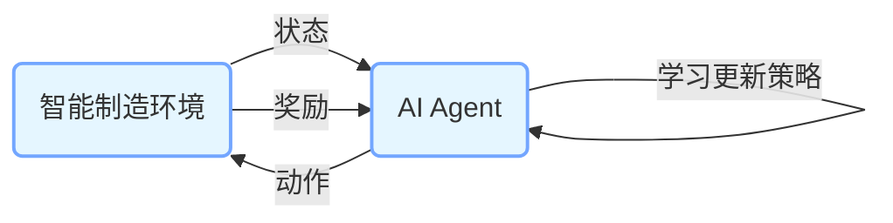

# AI Agent的强化学习在智能制造中的应用

> 关键词：AI Agent、强化学习、智能制造、智能决策、工业自动化

> 摘要：本文深入探讨了AI Agent的强化学习在智能制造中的应用。首先介绍了相关背景知识，包括目的范围、预期读者、文档结构和术语表。接着阐述了核心概念与联系，分析了核心算法原理并给出Python代码示例，还详细讲解了数学模型和公式。通过项目实战，展示了如何在实际开发环境中运用相关技术，并对代码进行解读分析。同时列举了实际应用场景，推荐了学习资源、开发工具框架以及相关论文著作。最后总结了未来发展趋势与挑战，并提供了常见问题解答和扩展阅读参考资料，旨在为读者全面呈现AI Agent强化学习在智能制造领域的应用全貌。

## 1. 背景介绍 
### 1.1 目的和范围
本文章的目的在于深入探讨AI Agent的强化学习在智能制造领域的应用。随着智能制造的快速发展，如何利用先进的人工智能技术提高生产效率、优化生产流程、降低成本成为了关键问题。强化学习作为一种强大的机器学习方法，能够让AI Agent在与环境的交互中不断学习并做出最优决策，为智能制造带来了新的解决方案。

文章的范围涵盖了AI Agent强化学习的核心概念、算法原理、数学模型，以及在智能制造中的实际应用案例。同时，还会介绍相关的开发工具、学习资源和未来发展趋势。

### 1.2 预期读者
本文预期读者包括智能制造领域的工程师、技术人员、研究人员，以及对人工智能和强化学习在工业应用感兴趣的学生和爱好者。对于那些希望了解如何将先进的人工智能技术应用于实际生产场景，提高生产效率和质量的人员，本文将提供有价值的参考。

### 1.3 文档结构概述
本文将按照以下结构进行组织：
1. **背景介绍**：介绍文章的目的、范围、预期读者、文档结构和术语表。
2. **核心概念与联系**：阐述AI Agent、强化学习和智能制造的核心概念，以及它们之间的联系。
3. **核心算法原理 & 具体操作步骤**：详细讲解强化学习的核心算法原理，并给出Python代码示例。
4. **数学模型和公式 & 详细讲解 & 举例说明**：介绍强化学习的数学模型和公式，并通过具体例子进行说明。
5. **项目实战：代码实际案例和详细解释说明**：通过一个实际的项目案例，展示如何在智能制造中应用AI Agent的强化学习。
6. **实际应用场景**：列举AI Agent强化学习在智能制造中的实际应用场景。
7. **工具和资源推荐**：推荐相关的学习资源、开发工具框架和论文著作。
8. **总结：未来发展趋势与挑战**：总结AI Agent强化学习在智能制造中的应用现状，分析未来发展趋势和面临的挑战。
9. **附录：常见问题与解答**：解答读者在阅读过程中可能遇到的常见问题。
10. **扩展阅读 & 参考资料**：提供相关的扩展阅读材料和参考资料。

### 1.4 术语表
#### 1.4.1 核心术语定义
- **AI Agent**：人工智能代理，是一个能够感知环境、做出决策并执行动作的实体。在强化学习中，AI Agent通过与环境的交互来学习最优策略。
- **强化学习**：一种机器学习方法，Agent在环境中执行动作，根据环境反馈的奖励信号来学习最优策略，以最大化长期累积奖励。
- **智能制造**：一种基于先进信息技术和智能装备的制造模式，通过智能化的生产过程和管理系统，实现生产效率、质量和灵活性的提升。
- **策略**：Agent在给定状态下选择动作的规则。在强化学习中，目标是学习一个最优策略，使得长期累积奖励最大。
- **状态**：环境的一种表示，Agent根据当前状态来选择动作。
- **动作**：Agent在环境中可以执行的操作。
- **奖励**：环境对Agent执行动作的反馈，用于评估动作的好坏。

#### 1.4.2 相关概念解释
- **马尔可夫决策过程（MDP）**：是强化学习的数学基础，描述了一个具有马尔可夫性质的决策过程。在MDP中，环境的下一个状态只取决于当前状态和Agent执行的动作。
- **Q学习**：一种无模型的强化学习算法，通过学习状态-动作对的价值函数Q来找到最优策略。
- **深度Q网络（DQN）**：将深度学习与Q学习相结合的算法，使用神经网络来近似Q函数，适用于处理高维状态空间。

#### 1.4.3 缩略词列表
- **AI**：Artificial Intelligence，人工智能
- **MDP**：Markov Decision Process，马尔可夫决策过程
- **Q-Learning**：Q学习
- **DQN**：Deep Q-Network，深度Q网络

## 2. 核心概念与联系 
### 核心概念原理
#### AI Agent
AI Agent是一个能够自主感知环境、做出决策并执行动作的实体。它可以是一个机器人、一个软件程序或者其他具有智能的系统。AI Agent通过传感器感知环境的状态，然后根据一定的策略选择合适的动作执行，最后根据环境的反馈来调整自己的行为。

#### 强化学习
强化学习是一种机器学习方法，其核心思想是Agent在环境中不断尝试不同的动作，并根据环境给予的奖励信号来学习最优策略。在强化学习中，Agent的目标是最大化长期累积奖励。强化学习的过程可以用马尔可夫决策过程（MDP）来描述，MDP由状态空间、动作空间、状态转移概率、奖励函数和折扣因子组成。

#### 智能制造
智能制造是一种基于先进信息技术和智能装备的制造模式，它将人工智能、物联网、大数据等技术应用于制造过程中，实现生产过程的自动化、智能化和柔性化。智能制造的核心是通过智能化的决策和控制，提高生产效率、质量和灵活性，降低成本和资源消耗。

### 架构的文本示意图
AI Agent的强化学习在智能制造中的应用架构可以描述如下：

智能制造系统作为环境，包含生产设备、传感器、控制系统等。AI Agent通过传感器感知环境的状态，例如设备的运行状态、生产进度、质量指标等。然后，AI Agent根据强化学习算法选择合适的动作，例如调整设备参数、安排生产计划、调度物流等。动作执行后，环境会反馈奖励信号，例如生产效率的提升、质量的改善、成本的降低等。AI Agent根据奖励信号更新自己的策略，不断学习以提高决策的质量。

### Mermaid流程图


该流程图展示了AI Agent与智能制造环境之间的交互过程。AI Agent从环境中获取状态信息，根据当前策略选择动作并执行，环境根据动作反馈奖励信号，AI Agent根据奖励信号学习更新自己的策略。

## 3. 核心算法原理 & 具体操作步骤 
### 核心算法原理
在强化学习中，最经典的算法之一是Q学习。Q学习的目标是学习一个状态-动作对的价值函数Q，该函数表示在给定状态下执行某个动作的预期累积奖励。Q学习的更新公式如下：

$$Q(s_t, a_t) \leftarrow Q(s_t, a_t) + \alpha [r_{t+1} + \gamma \max_{a} Q(s_{t+1}, a) - Q(s_t, a_t)]$$

其中，$s_t$ 是当前状态，$a_t$ 是当前动作，$r_{t+1}$ 是执行动作后获得的奖励，$s_{t+1}$ 是下一个状态，$\alpha$ 是学习率，$\gamma$ 是折扣因子。

### 具体操作步骤
1. **初始化Q表**：对于每个状态-动作对，初始化Q值为0。
2. **选择动作**：根据当前状态，使用某种策略（例如 $\epsilon$-贪心策略）选择一个动作。
3. **执行动作**：在环境中执行选择的动作，获得下一个状态和奖励。
4. **更新Q表**：根据Q学习的更新公式更新当前状态-动作对的Q值。
5. **重复步骤2-4**：直到达到终止条件。

### Python源代码示例
```python
import numpy as np

# 定义环境参数
num_states = 5
num_actions = 2
learning_rate = 0.1
discount_factor = 0.9
epsilon = 0.1
num_episodes = 100

# 初始化Q表
Q = np.zeros((num_states, num_actions))

# 定义环境的状态转移和奖励函数
def get_next_state_and_reward(state, action):
    # 简单示例，实际应用中需要根据具体环境定义
    if action == 0:
        next_state = (state + 1) % num_states
        reward = 1 if next_state == 0 else 0
    else:
        next_state = (state - 1) % num_states
        reward = 1 if next_state == 0 else 0
    return next_state, reward

# Q学习算法
for episode in range(num_episodes):
    state = np.random.randint(0, num_states)
    done = False
    while not done:
        # $\epsilon$-贪心策略选择动作
        if np.random.uniform(0, 1) < epsilon:
            action = np.random.randint(0, num_actions)
        else:
            action = np.argmax(Q[state, :])
        
        # 执行动作，获得下一个状态和奖励
        next_state, reward = get_next_state_and_reward(state, action)
        
        # 更新Q表
        Q[state, action] = Q[state, action] + learning_rate * (reward + discount_factor * np.max(Q[next_state, :]) - Q[state, action])
        
        state = next_state
        
        # 判断是否终止
        if state == 0:
            done = True

print("Final Q table:")
print(Q)
```

在上述代码中，我们实现了一个简单的Q学习算法。首先初始化Q表，然后使用 $\epsilon$-贪心策略选择动作，执行动作后更新Q表，直到达到终止条件。最后输出最终的Q表。

## 4. 数学模型和公式 & 详细讲解 & 举例说明 
### 马尔可夫决策过程（MDP）
马尔可夫决策过程是强化学习的数学基础，它可以用一个五元组 $(S, A, P, R, \gamma)$ 来表示：
- $S$：状态空间，表示环境的所有可能状态。
- $A$：动作空间，表示Agent可以执行的所有可能动作。
- $P$：状态转移概率，$P(s_{t+1} | s_t, a_t)$ 表示在状态 $s_t$ 执行动作 $a_t$ 后转移到状态 $s_{t+1}$ 的概率。
- $R$：奖励函数，$R(s_t, a_t, s_{t+1})$ 表示在状态 $s_t$ 执行动作 $a_t$ 转移到状态 $s_{t+1}$ 时获得的奖励。
- $\gamma$：折扣因子，用于权衡即时奖励和未来奖励，取值范围为 $[0, 1]$。

### 价值函数
在强化学习中，有两个重要的价值函数：状态价值函数 $V(s)$ 和状态-动作价值函数 $Q(s, a)$。

#### 状态价值函数
状态价值函数 $V(s)$ 表示从状态 $s$ 开始，遵循某个策略 $\pi$ 时的预期累积奖励：

$$V^{\pi}(s) = \mathbb{E}_{\pi} \left[ \sum_{t=0}^{\infty} \gamma^t r_{t+1} | s_0 = s \right]$$

#### 状态-动作价值函数
状态-动作价值函数 $Q(s, a)$ 表示在状态 $s$ 执行动作 $a$，然后遵循某个策略 $\pi$ 时的预期累积奖励：

$$Q^{\pi}(s, a) = \mathbb{E}_{\pi} \left[ \sum_{t=0}^{\infty} \gamma^t r_{t+1} | s_0 = s, a_0 = a \right]$$

### Q学习公式推导
Q学习的目标是学习最优的状态-动作价值函数 $Q^*(s, a)$。根据贝尔曼方程，最优的状态-动作价值函数满足以下关系：

$$Q^*(s, a) = \mathbb{E} \left[ r + \gamma \max_{a'} Q^*(s', a') | s, a \right]$$

Q学习通过迭代更新Q值来逼近最优的Q函数。Q学习的更新公式为：

$$Q(s_t, a_t) \leftarrow Q(s_t, a_t) + \alpha [r_{t+1} + \gamma \max_{a} Q(s_{t+1}, a) - Q(s_t, a_t)]$$

其中，$\alpha$ 是学习率，控制每次更新的步长。

### 举例说明
假设有一个简单的网格世界环境，Agent的目标是从起点到达终点。环境的状态可以用Agent在网格中的位置表示，动作可以是上下左右移动。奖励函数可以设置为：到达终点获得正奖励，撞到障碍物获得负奖励，每移动一步获得一个小的负奖励。

在这个环境中，我们可以使用Q学习算法来学习最优策略。初始时，Q表中的所有值都为0。Agent在环境中不断尝试不同的动作，根据获得的奖励更新Q表。随着学习的进行，Q表中的值会逐渐收敛到最优的Q函数，Agent可以根据Q表选择最优的动作。

## 5. 项目实战：代码实际案例和详细解释说明 
### 5.1  开发环境搭建
#### 安装Python
首先需要安装Python，建议使用Python 3.7及以上版本。可以从Python官方网站（https://www.python.org/downloads/）下载安装包进行安装。

#### 安装必要的库
在本项目中，我们需要使用一些Python库，如NumPy、OpenAI Gym等。可以使用以下命令进行安装：
```sh
pip install numpy gym
```

### 5.2  源代码详细实现和代码解读
#### 项目背景
我们将使用OpenAI Gym中的`FrozenLake-v1`环境来演示AI Agent的强化学习应用。`FrozenLake-v1`是一个简单的网格世界环境，Agent需要在冰面上移动，避免掉入洞中，最终到达目标位置。

#### 源代码实现
```python
import gym
import numpy as np

# 创建环境
env = gym.make('FrozenLake-v1', is_slippery=False)

# 定义超参数
learning_rate = 0.1
discount_factor = 0.9
epsilon = 0.1
num_episodes = 1000

# 初始化Q表
num_states = env.observation_space.n
num_actions = env.action_space.n
Q = np.zeros((num_states, num_actions))

# Q学习算法
for episode in range(num_episodes):
    state = env.reset()
    done = False
    while not done:
        # $\epsilon$-贪心策略选择动作
        if np.random.uniform(0, 1) < epsilon:
            action = env.action_space.sample()
        else:
            action = np.argmax(Q[state, :])
        
        # 执行动作，获得下一个状态和奖励
        next_state, reward, done, _ = env.step(action)
        
        # 更新Q表
        Q[state, action] = Q[state, action] + learning_rate * (reward + discount_factor * np.max(Q[next_state, :]) - Q[state, action])
        
        state = next_state

# 测试训练好的策略
total_rewards = 0
num_test_episodes = 10
for episode in range(num_test_episodes):
    state = env.reset()
    done = False
    while not done:
        action = np.argmax(Q[state, :])
        next_state, reward, done, _ = env.step(action)
        total_rewards += reward
        state = next_state

print(f"Average reward over {num_test_episodes} test episodes: {total_rewards / num_test_episodes}")

# 关闭环境
env.close()
```

#### 代码解读
1. **创建环境**：使用`gym.make`函数创建`FrozenLake-v1`环境。
2. **定义超参数**：包括学习率、折扣因子、探索率和训练回合数。
3. **初始化Q表**：根据环境的状态空间和动作空间大小初始化Q表。
4. **Q学习算法**：在每个回合中，Agent根据 $\epsilon$-贪心策略选择动作，执行动作后更新Q表，直到回合结束。
5. **测试训练好的策略**：使用训练好的Q表选择动作，进行多次测试，计算平均奖励。
6. **关闭环境**：使用`env.close()`关闭环境。

### 5.3  代码解读与分析
#### 探索与利用的平衡
在Q学习中，使用 $\epsilon$-贪心策略来平衡探索和利用。在训练初期，Agent需要更多地探索环境，尝试不同的动作，因此以一定的概率随机选择动作。随着训练的进行，Agent逐渐了解环境，更多地利用已经学习到的知识，选择Q值最大的动作。

#### Q表的更新
Q表的更新是Q学习的核心。每次执行动作后，根据Q学习的更新公式更新当前状态-动作对的Q值。更新公式中的学习率控制每次更新的步长，折扣因子权衡即时奖励和未来奖励。

#### 训练效果评估
通过测试训练好的策略，计算平均奖励来评估训练效果。如果平均奖励较高，说明Agent已经学习到了较好的策略。

## 6. 实际应用场景 
### 生产调度优化
在智能制造中，生产调度是一个关键问题。AI Agent的强化学习可以用于优化生产调度，根据生产设备的状态、订单需求、原材料供应等信息，动态地安排生产任务，提高生产效率和设备利用率。例如，在一个多工序的生产线上，AI Agent可以根据每个工序的加工时间、设备可用性等因素，实时调整生产顺序，减少生产周期和库存成本。

### 设备维护预测
设备的故障和停机是影响生产效率的重要因素。强化学习可以用于设备维护预测，通过监测设备的运行状态数据，如温度、振动、压力等，预测设备的故障概率。AI Agent可以根据预测结果，制定最优的维护计划，避免设备故障和停机。例如，在一个电力设备监测系统中，AI Agent可以根据设备的实时数据，提前预测设备的故障风险，并及时安排维护人员进行检修。

### 质量控制
质量控制是智能制造的重要环节。强化学习可以用于质量控制，通过对生产过程中的数据进行分析，实时调整生产参数，保证产品质量的稳定性。例如，在一个化工生产过程中，AI Agent可以根据产品的质量指标和生产过程中的温度、压力、流量等参数，动态调整生产工艺，提高产品的合格率。

### 物流调度
物流调度是智能制造中的一个复杂问题，涉及到原材料的采购、运输、存储和成品的配送等环节。强化学习可以用于物流调度，优化物流路径、车辆调度和库存管理，降低物流成本和提高物流效率。例如，在一个电商仓库中，AI Agent可以根据订单信息、库存水平和车辆状态，实时调度车辆进行货物的配送，减少配送时间和成本。

## 7. 工具和资源推荐
### 7.1 学习资源推荐
#### 7.1.1 书籍推荐
- 《强化学习：原理与Python实现》：本书系统地介绍了强化学习的基本原理、算法和应用，并提供了大量的Python代码示例，适合初学者入门。
- 《Reinforcement Learning: An Introduction》：这是强化学习领域的经典教材，由Richard S. Sutton和Andrew G. Barto编写，全面介绍了强化学习的理论和方法。
- 《Deep Reinforcement Learning Hands-On》：本书结合深度学习和强化学习，介绍了深度强化学习的算法和应用，适合有一定机器学习基础的读者。

#### 7.1.2 在线课程
- Coursera上的《Reinforcement Learning Specialization》：由University of Alberta的教授授课，系统地介绍了强化学习的理论和实践。
- edX上的《Introduction to Artificial Intelligence》：课程中包含了强化学习的相关内容，适合初学者了解人工智能的基础知识。
- 吴恩达的《Machine Learning》：虽然不是专门的强化学习课程，但可以帮助读者建立机器学习的基础。

#### 7.1.3 技术博客和网站
- OpenAI Blog：OpenAI发布的关于人工智能和强化学习的最新研究成果和应用案例。
- Medium上的Towards Data Science：有很多关于强化学习的技术文章和教程。
- 强化学习中文社区：提供了强化学习的相关资料、论坛和交流平台。

### 7.2 开发工具框架推荐
#### 7.2.1 IDE和编辑器
- PyCharm：一款功能强大的Python集成开发环境，支持代码调试、版本控制等功能，适合开发Python项目。
- Jupyter Notebook：一种交互式的开发环境，适合进行数据分析和模型实验，可以实时查看代码的运行结果。
- Visual Studio Code：一款轻量级的代码编辑器，支持多种编程语言和插件扩展，适合快速开发和调试代码。

#### 7.2.2 调试和性能分析工具
- TensorBoard：TensorFlow的可视化工具，可以用于可视化训练过程中的损失函数、准确率等指标，帮助调试和优化模型。
- Py-Spy：一个Python性能分析工具，可以实时监测Python程序的CPU使用情况和函数调用时间，帮助找出性能瓶颈。
- cProfile：Python标准库中的性能分析模块，可以统计函数的调用次数和执行时间，用于分析代码的性能。

#### 7.2.3 相关框架和库
- OpenAI Gym：一个用于开发和比较强化学习算法的工具包，提供了各种环境和基准测试。
- Stable Baselines3：一个基于PyTorch的强化学习库，提供了多种强化学习算法的实现，方便用户进行快速开发和实验。
- TensorFlow和PyTorch：深度学习框架，可用于实现深度强化学习算法。

### 7.3 相关论文著作推荐
#### 7.3.1 经典论文
- “Q-Learning” by Watkins and Dayan：这是Q学习算法的经典论文，首次提出了Q学习的概念和算法。
- “Playing Atari with Deep Reinforcement Learning” by Mnih et al.：该论文首次将深度学习与强化学习相结合，提出了深度Q网络（DQN）算法，在Atari游戏上取得了很好的效果。
- “Asynchronous Methods for Deep Reinforcement Learning” by Mnih et al.：提出了异步优势演员-评论家（A3C）算法，提高了深度强化学习的训练效率。

#### 7.3.2 最新研究成果
- 关注顶级人工智能会议（如NeurIPS、ICML、AAAI等）上关于强化学习的最新研究成果，了解该领域的前沿动态。
- 阅读相关学术期刊（如Journal of Artificial Intelligence Research、Artificial Intelligence等）上的论文，获取最新的理论和方法。

#### 7.3.3 应用案例分析
- 一些知名企业（如Google、Microsoft、Amazon等）会发布关于强化学习在实际应用中的案例分析，可以参考这些案例了解强化学习在不同领域的应用场景和实践经验。

## 8. 总结：未来发展趋势与挑战
### 未来发展趋势
#### 与其他技术的融合
AI Agent的强化学习将与其他技术（如深度学习、计算机视觉、自然语言处理等）深度融合，实现更复杂的智能决策和任务执行。例如，将强化学习与计算机视觉相结合，可以实现机器人在复杂环境中的自主导航和目标识别。

#### 工业互联网平台的应用
随着工业互联网的发展，强化学习将在工业互联网平台上得到广泛应用。通过工业互联网平台，可以实现设备的互联互通和数据的实时共享，为强化学习提供更丰富的数据和更广阔的应用场景。

#### 多智能体系统的发展
在智能制造中，往往需要多个智能体协同工作，如多个机器人、多个生产线等。未来，多智能体强化学习将得到更多的研究和应用，实现多个智能体之间的协作和竞争，提高整个系统的性能和效率。

### 面临的挑战
#### 数据质量和安全性
强化学习需要大量的数据进行训练，数据的质量和安全性直接影响到学习效果和系统的可靠性。在智能制造中，数据往往涉及到企业的核心机密和商业利益，如何保证数据的质量和安全性是一个重要的挑战。

#### 算法复杂度和计算资源
一些复杂的强化学习算法（如深度强化学习）具有较高的算法复杂度，需要大量的计算资源进行训练。在实际应用中，如何在有限的计算资源下提高算法的效率和性能是一个亟待解决的问题。

#### 可解释性和可靠性
强化学习模型往往是黑盒模型，难以解释其决策过程和结果。在智能制造中，尤其是在一些关键领域（如医疗、航空航天等），模型的可解释性和可靠性至关重要。如何提高强化学习模型的可解释性和可靠性是一个重要的研究方向。

## 9. 附录：常见问题与解答
### Q1：强化学习和监督学习有什么区别？
A1：监督学习是基于有标签的数据进行学习，模型的目标是预测标签。而强化学习是通过Agent与环境的交互，根据环境反馈的奖励信号来学习最优策略，没有明确的标签。

### Q2：如何选择合适的学习率和折扣因子？
A2：学习率控制每次更新的步长，折扣因子权衡即时奖励和未来奖励。一般来说，学习率可以选择一个较小的值（如0.1），折扣因子可以选择接近1的值（如0.9）。实际应用中，可以通过实验来调整这些参数，找到最优的值。

### Q3：强化学习在实际应用中容易遇到哪些问题？
A3：强化学习在实际应用中容易遇到以下问题：数据不足、奖励设计不合理、探索与利用的平衡问题、算法收敛性问题等。需要根据具体情况进行分析和解决。

### Q4：如何评估强化学习模型的性能？
A4：可以使用平均奖励、累计奖励、成功率等指标来评估强化学习模型的性能。在实际应用中，还可以根据具体任务的要求，定义一些特定的评估指标。

## 10. 扩展阅读 & 参考资料
### 扩展阅读
- 《智能工厂：工业4.0时代的企业转型升级》：介绍了智能工厂的概念、技术和应用，帮助读者了解智能制造的整体发展趋势。
- 《人工智能：现代方法》：全面介绍了人工智能的各个领域，包括强化学习、机器学习、自然语言处理等，适合对人工智能感兴趣的读者深入学习。

### 参考资料
- OpenAI Gym官方文档：https://gym.openai.com/docs/
- Stable Baselines3官方文档：https://stable-baselines3.readthedocs.io/en/master/
- TensorFlow官方文档：https://www.tensorflow.org/api_docs
- PyTorch官方文档：https://pytorch.org/docs/stable/index.html

作者：AI天才研究院/AI Genius Institute & 禅与计算机程序设计艺术 /Zen And The Art of Computer Programming