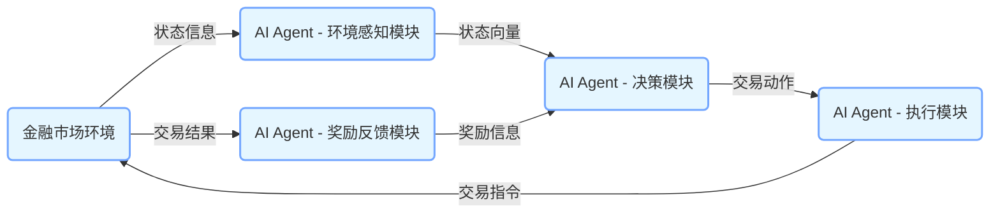

# AI Agent的强化学习在金融交易中的应用

> 关键词：AI Agent、强化学习、金融交易、交易策略、智能决策

> 摘要：本文深入探讨了AI Agent的强化学习在金融交易领域的应用。首先介绍了相关背景知识，包括目的范围、预期读者等。接着阐述了核心概念与联系，详细讲解了强化学习的原理及AI Agent在金融交易中的架构。通过Python代码详细说明了核心算法原理和具体操作步骤，同时给出了数学模型和公式并举例说明。结合项目实战，从开发环境搭建到源代码实现与解读进行了全面分析。探讨了实际应用场景，推荐了相关工具和资源。最后总结了未来发展趋势与挑战，并提供了常见问题解答和扩展阅读参考资料，旨在为读者全面呈现AI Agent强化学习在金融交易中的应用全貌。

## 1. 背景介绍 
### 1.1 目的和范围
本文章的目的是全面深入地探讨AI Agent的强化学习在金融交易中的应用。随着金融市场的日益复杂和数据量的急剧增长，传统的交易策略已经难以满足投资者的需求。强化学习作为一种能够让AI Agent在动态环境中自主学习最优策略的技术，为金融交易带来了新的思路和方法。本文将详细介绍强化学习的原理、算法，以及如何将其应用于金融交易中，包括交易策略的制定、风险控制等方面。范围涵盖了从理论基础到实际应用的各个环节，旨在为读者提供一个系统的学习和实践指南。

### 1.2 预期读者
本文预期读者包括金融行业从业者，如交易员、投资经理、风险分析师等，他们希望借助强化学习技术优化现有的交易策略，提高交易效率和收益。同时，也适合计算机科学领域的研究者和开发者，特别是对人工智能、机器学习感兴趣的人士，他们可以通过本文了解强化学习在金融领域的具体应用场景和挑战。此外，对于金融科技爱好者和学生来说，本文也是一个很好的学习资料，帮助他们了解前沿技术在金融领域的融合应用。

### 1.3 文档结构概述
本文将按照以下结构进行阐述：首先介绍核心概念与联系，包括强化学习和AI Agent的基本原理以及它们在金融交易中的关系；接着详细讲解核心算法原理和具体操作步骤，通过Python代码进行说明；然后给出数学模型和公式，并举例说明其在金融交易中的应用；再通过项目实战，从开发环境搭建到源代码实现和解读，展示如何将理论应用于实际；探讨实际应用场景，分析强化学习在不同金融交易场景中的作用；推荐相关的工具和资源，包括学习资源、开发工具框架和相关论文著作；最后总结未来发展趋势与挑战，提供常见问题解答和扩展阅读参考资料。

### 1.4 术语表
#### 1.4.1 核心术语定义
- **AI Agent**：人工智能代理，是一个能够感知环境、做出决策并采取行动的实体。在金融交易中，AI Agent可以根据市场数据进行分析和判断，制定交易策略并执行交易操作。
- **强化学习**：一种机器学习范式，智能体通过与环境进行交互，根据环境反馈的奖励信号来学习最优策略，以最大化长期累积奖励。
- **金融交易**：指在金融市场上进行的各种买卖活动，包括股票、债券、期货、外汇等金融资产的交易。
- **交易策略**：投资者根据市场情况和自身目标制定的买卖规则和方法，用于指导交易决策。
- **奖励函数**：在强化学习中，用于评估智能体在某个状态下采取某个行动的好坏程度，是智能体学习的依据。

#### 1.4.2 相关概念解释
- **状态空间**：指智能体在环境中可能处于的所有状态的集合。在金融交易中，状态空间可以包括市场价格、成交量、技术指标等信息。
- **动作空间**：智能体在某个状态下可以采取的所有行动的集合。在金融交易中，动作空间可以包括买入、卖出、持有等操作。
- **策略**：智能体在每个状态下选择动作的规则。在强化学习中，目标是学习到一个最优策略，使得长期累积奖励最大。
- **Q值**：表示在某个状态下采取某个动作的预期累积奖励。在Q - learning算法中，通过不断更新Q值来学习最优策略。

#### 1.4.3 缩略词列表
- **RL**：Reinforcement Learning，强化学习
- **AI**：Artificial Intelligence，人工智能
- **MDP**：Markov Decision Process，马尔可夫决策过程
- **Q - learning**：一种无模型的强化学习算法

## 2. 核心概念与联系 

### 2.1 强化学习原理
强化学习是一种让智能体通过与环境进行交互来学习最优策略的机器学习方法。智能体在每个时间步观察环境的状态 $s_t$，然后根据当前策略 $\pi$ 选择一个动作 $a_t$ 执行。环境接收到动作后，会转移到一个新的状态 $s_{t + 1}$，并给予智能体一个奖励 $r_t$。智能体的目标是通过不断地与环境交互，学习到一个最优策略 $\pi^*$，使得长期累积奖励最大化。

强化学习通常可以用马尔可夫决策过程（MDP）来描述。一个MDP由一个四元组 $(S, A, P, R)$ 组成，其中：
- $S$ 是状态空间，表示智能体可能处于的所有状态的集合。
- $A$ 是动作空间，表示智能体在每个状态下可以采取的所有动作的集合。
- $P$ 是状态转移概率函数，$P(s_{t + 1}|s_t, a_t)$ 表示在状态 $s_t$ 采取动作 $a_t$ 后转移到状态 $s_{t + 1}$ 的概率。
- $R$ 是奖励函数，$R(s_t, a_t, s_{t + 1})$ 表示在状态 $s_t$ 采取动作 $a_t$ 转移到状态 $s_{t + 1}$ 时获得的奖励。

### 2.2 AI Agent在金融交易中的架构
在金融交易中，AI Agent可以被看作是一个智能的交易决策者。其架构主要包括以下几个部分：

#### 2.2.1 环境感知模块
该模块负责收集金融市场的各种数据，如股票价格、成交量、宏观经济数据等，并将这些数据转化为AI Agent可以理解的状态信息。例如，可以将一段时间内的股票价格、成交量等数据进行特征提取，形成一个多维的状态向量。

#### 2.2.2 决策模块
决策模块根据环境感知模块提供的状态信息，依据强化学习算法学习到的策略，选择合适的交易动作，如买入、卖出或持有。在这个过程中，决策模块会不断地更新策略，以适应市场的变化。

#### 2.2.3 执行模块
执行模块负责将决策模块选择的交易动作转化为实际的交易指令，并发送到金融交易平台进行执行。同时，执行模块还需要处理交易过程中的各种异常情况，如交易失败、网络延迟等。

#### 2.2.4 奖励反馈模块
奖励反馈模块根据交易结果，计算AI Agent获得的奖励。奖励的设计通常与交易目标相关，例如可以根据交易的收益率、夏普比率等指标来设计奖励函数。奖励反馈模块将计算得到的奖励信息反馈给决策模块，用于更新策略。

### 2.3 核心概念联系示意图


## 3. 核心算法原理 & 具体操作步骤 

### 3.1 Q - learning算法原理
Q - learning是一种无模型的强化学习算法，其核心思想是通过不断更新Q值来学习最优策略。Q值表示在某个状态下采取某个动作的预期累积奖励。Q - learning算法的更新公式如下：

$$Q(s_t, a_t) \leftarrow Q(s_t, a_t) + \alpha [r_t + \gamma \max_{a} Q(s_{t + 1}, a) - Q(s_t, a_t)]$$

其中：
- $Q(s_t, a_t)$ 是在状态 $s_t$ 采取动作 $a_t$ 的当前Q值。
- $\alpha$ 是学习率，控制每次更新的步长。
- $r_t$ 是在状态 $s_t$ 采取动作 $a_t$ 后获得的即时奖励。
- $\gamma$ 是折扣因子，取值范围为 $[0, 1]$，用于权衡即时奖励和未来奖励的重要性。
- $\max_{a} Q(s_{t + 1}, a)$ 是在状态 $s_{t + 1}$ 下所有可能动作的最大Q值。

### 3.2 具体操作步骤
#### 3.2.1 初始化
- 初始化Q表 $Q(s, a)$，对于所有的状态 $s \in S$ 和动作 $a \in A$，将 $Q(s, a)$ 初始化为0。
- 设置学习率 $\alpha$、折扣因子 $\gamma$ 和探索率 $\epsilon$。

#### 3.2.2 循环迭代
1. 初始化环境，得到初始状态 $s_0$。
2. 对于每个时间步 $t$：
    - 根据 $\epsilon$ - 贪心策略选择动作 $a_t$：
        - 以概率 $\epsilon$ 随机选择一个动作。
        - 以概率 $1 - \epsilon$ 选择 $Q(s_t, a)$ 最大的动作。
    - 执行动作 $a_t$，观察环境的新状态 $s_{t + 1}$ 和奖励 $r_t$。
    - 根据Q - learning更新公式更新Q表：
        $$Q(s_t, a_t) \leftarrow Q(s_t, a_t) + \alpha [r_t + \gamma \max_{a} Q(s_{t + 1}, a) - Q(s_t, a_t)]$$
    - 如果达到终止状态，则结束本轮迭代；否则，将 $s_{t + 1}$ 作为新的当前状态，继续下一个时间步。

#### 3.2.3 策略提取
在学习过程结束后，可以根据最终的Q表提取最优策略：对于每个状态 $s$，选择 $Q(s, a)$ 最大的动作作为最优动作。

### 3.3 Python代码实现
```python
import numpy as np

class QLearningAgent:
    def __init__(self, state_space_size, action_space_size, learning_rate=0.1, discount_factor=0.9, exploration_rate=0.1):
        self.state_space_size = state_space_size
        self.action_space_size = action_space_size
        self.learning_rate = learning_rate
        self.discount_factor = discount_factor
        self.exploration_rate = exploration_rate
        self.q_table = np.zeros((state_space_size, action_space_size))

    def choose_action(self, state):
        if np.random.uniform(0, 1) < self.exploration_rate:
            # 随机选择动作
            action = np.random.choice(self.action_space_size)
        else:
            # 选择Q值最大的动作
            action = np.argmax(self.q_table[state, :])
        return action

    def update_q_table(self, state, action, reward, next_state):
        # Q - learning更新公式
        max_q_next = np.max(self.q_table[next_state, :])
        self.q_table[state, action] = (1 - self.learning_rate) * self.q_table[state, action] + \
                                      self.learning_rate * (reward + self.discount_factor * max_q_next)


# 示例使用
state_space_size = 10
action_space_size = 3
agent = QLearningAgent(state_space_size, action_space_size)

# 模拟一个简单的环境交互过程
current_state = 0
for _ in range(100):
    action = agent.choose_action(current_state)
    # 这里简单模拟奖励和下一个状态
    next_state = np.random.randint(0, state_space_size)
    reward = np.random.randint(-1, 2)
    agent.update_q_table(current_state, action, reward, next_state)
    current_state = next_state
```

## 4. 数学模型和公式 & 详细讲解 & 举例说明 

### 4.1 马尔可夫决策过程（MDP）
如前所述，MDP由 $(S, A, P, R)$ 四元组组成。在金融交易中，我们可以将其具体应用如下：

#### 4.1.1 状态空间 $S$
假设我们考虑一个简单的股票交易场景，状态可以由股票的当前价格 $p_t$、成交量 $v_t$ 和移动平均线 $ma_t$ 组成，即 $s_t = (p_t, v_t, ma_t)$。状态空间 $S$ 就是所有可能的 $(p_t, v_t, ma_t)$ 组合的集合。

#### 4.1.2 动作空间 $A$
在股票交易中，动作空间通常包括买入（$a_{buy}$）、卖出（$a_{sell}$）和持有（$a_{hold}$）三种动作，即 $A = \{a_{buy}, a_{sell}, a_{hold}\}$。

#### 4.1.3 状态转移概率函数 $P$
状态转移概率 $P(s_{t + 1}|s_t, a_t)$ 表示在状态 $s_t$ 采取动作 $a_t$ 后转移到状态 $s_{t + 1}$ 的概率。在金融市场中，由于市场的不确定性，状态转移概率很难精确计算，通常可以通过历史数据进行估计。例如，可以统计在某个状态下采取某个动作后，下一个状态出现的频率来近似估计状态转移概率。

#### 4.1.4 奖励函数 $R$
奖励函数的设计直接影响AI Agent的学习目标。在股票交易中，一个简单的奖励函数可以设计为：

$$R(s_t, a_t, s_{t + 1}) = \begin{cases}
r_{buy} & \text{if } a_t = a_{buy} \text{ and } p_{t + 1} > p_t \\
r_{sell} & \text{if } a_t = a_{sell} \text{ and } p_{t + 1} < p_t \\
r_{hold} & \text{if } a_t = a_{hold} \\
r_{loss} & \text{otherwise}
\end{cases}$$

其中 $r_{buy}$、$r_{sell}$、$r_{hold}$ 和 $r_{loss}$ 是预先设定的奖励值。例如，$r_{buy} = 1$，$r_{sell} = 1$，$r_{hold} = 0$，$r_{loss} = -1$。

### 4.2 价值函数
在强化学习中，价值函数用于评估状态或状态 - 动作对的好坏程度。主要有状态价值函数 $V(s)$ 和动作价值函数 $Q(s, a)$。

#### 4.2.1 状态价值函数 $V(s)$
状态价值函数 $V(s)$ 表示从状态 $s$ 开始，遵循策略 $\pi$ 所能获得的预期累积奖励：

$$V^{\pi}(s) = \mathbb{E}_{\pi} \left[ \sum_{t = 0}^{\infty} \gamma^t r_t \mid s_0 = s \right]$$

其中 $\gamma$ 是折扣因子，$\mathbb{E}_{\pi}$ 表示在策略 $\pi$ 下的期望。

#### 4.2.2 动作价值函数 $Q(s, a)$
动作价值函数 $Q(s, a)$ 表示在状态 $s$ 采取动作 $a$，然后遵循策略 $\pi$ 所能获得的预期累积奖励：

$$Q^{\pi}(s, a) = \mathbb{E}_{\pi} \left[ \sum_{t = 0}^{\infty} \gamma^t r_t \mid s_0 = s, a_0 = a \right]$$

### 4.3 举例说明
假设我们有一个简单的金融交易环境，状态空间 $S = \{s_1, s_2, s_3\}$，动作空间 $A = \{a_1, a_2\}$。初始Q表如下：

| 状态 \ 动作 | $a_1$ | $a_2$ |
| --- | --- | --- |
| $s_1$ | 0 | 0 |
| $s_2$ | 0 | 0 |
| $s_3$ | 0 | 0 |

学习率 $\alpha = 0.1$，折扣因子 $\gamma = 0.9$。当前处于状态 $s_1$，选择动作 $a_1$，执行动作后转移到状态 $s_2$，获得奖励 $r = 1$。

首先，计算 $\max_{a} Q(s_2, a)$。由于Q表中 $Q(s_2, a_1) = Q(s_2, a_2) = 0$，所以 $\max_{a} Q(s_2, a) = 0$。

然后，根据Q - learning更新公式更新 $Q(s_1, a_1)$：

$$Q(s_1, a_1) = (1 - 0.1) \times 0 + 0.1 \times (1 + 0.9 \times 0 - 0) = 0.1$$

更新后的Q表如下：

| 状态 \ 动作 | $a_1$ | $a_2$ |
| --- | --- | --- |
| $s_1$ | 0.1 | 0 |
| $s_2$ | 0 | 0 |
| $s_3$ | 0 | 0 |

## 5. 项目实战：代码实际案例和详细解释说明 

### 5.1  开发环境搭建
#### 5.1.1 安装Python
首先需要安装Python，建议使用Python 3.7及以上版本。可以从Python官方网站（https://www.python.org/downloads/）下载安装包，按照安装向导进行安装。

#### 5.1.2 安装必要的库
在金融交易的强化学习项目中，需要安装一些必要的Python库，如 `numpy`、`pandas`、`matplotlib` 等。可以使用 `pip` 进行安装：

```bash
pip install numpy pandas matplotlib
```

#### 5.1.3 数据准备
需要准备金融市场的历史数据，例如股票价格数据。可以从雅虎财经、Tushare等数据平台获取数据。以下是一个使用 `pandas-datareader` 从雅虎财经获取股票数据的示例：

```python
import pandas as pd
import pandas_datareader.data as web
import datetime

start = datetime.datetime(2020, 1, 1)
end = datetime.datetime(2021, 1, 1)
df = web.DataReader('AAPL', 'yahoo', start, end)
df.to_csv('aapl_data.csv')
```

### 5.2  源代码详细实现和代码解读
#### 5.2.1 定义环境类
```python
import numpy as np
import pandas as pd

class FinancialTradingEnv:
    def __init__(self, data_path):
        self.data = pd.read_csv(data_path)
        self.state_dim = 3  # 状态维度，例如价格、成交量、移动平均线
        self.action_dim = 3  # 动作维度，买入、卖出、持有
        self.current_step = 0
        self.balance = 10000  # 初始资金
        self.shares = 0  # 初始股票数量

    def reset(self):
        self.current_step = 0
        self.balance = 10000
        self.shares = 0
        return self._get_state()

    def _get_state(self):
        # 简单示例，取当前价格、成交量和移动平均线作为状态
        price = self.data['Close'][self.current_step]
        volume = self.data['Volume'][self.current_step]
        ma = self.data['Close'][:self.current_step + 1].mean()
        return np.array([price, volume, ma])

    def step(self, action):
        current_price = self.data['Close'][self.current_step]
        if action == 0:  # 买入
            if self.balance > current_price:
                self.shares += self.balance // current_price
                self.balance %= current_price
                reward = 0
            else:
                reward = -1
        elif action == 1:  # 卖出
            if self.shares > 0:
                self.balance += self.shares * current_price
                self.shares = 0
                reward = 0
            else:
                reward = -1
        else:  # 持有
            reward = 0

        self.current_step += 1
        if self.current_step >= len(self.data) - 1:
            done = True
        else:
            done = False

        next_state = self._get_state()
        return next_state, reward, done

```

#### 5.2.2 定义Q - learning代理类
```python
class QLearningAgent:
    def __init__(self, state_dim, action_dim, learning_rate=0.1, discount_factor=0.9, exploration_rate=0.1):
        self.state_dim = state_dim
        self.action_dim = action_dim
        self.learning_rate = learning_rate
        self.discount_factor = discount_factor
        self.exploration_rate = exploration_rate
        self.q_table = {}

    def _get_q_value(self, state, action):
        state_str = str(state)
        if state_str not in self.q_table:
            self.q_table[state_str] = np.zeros(self.action_dim)
        return self.q_table[state_str][action]

    def choose_action(self, state):
        if np.random.uniform(0, 1) < self.exploration_rate:
            action = np.random.choice(self.action_dim)
        else:
            q_values = [self._get_q_value(state, a) for a in range(self.action_dim)]
            action = np.argmax(q_values)
        return action

    def update_q_table(self, state, action, reward, next_state):
        max_q_next = np.max([self._get_q_value(next_state, a) for a in range(self.action_dim)])
        state_str = str(state)
        if state_str not in self.q_table:
            self.q_table[state_str] = np.zeros(self.action_dim)
        self.q_table[state_str][action] = (1 - self.learning_rate) * self.q_table[state_str][action] + \
                                           self.learning_rate * (reward + self.discount_factor * max_q_next)

```

#### 5.2.3 训练过程
```python
# 初始化环境和代理
env = FinancialTradingEnv('aapl_data.csv')
agent = QLearningAgent(env.state_dim, env.action_dim)

num_episodes = 100
for episode in range(num_episodes):
    state = env.reset()
    done = False
    while not done:
        action = agent.choose_action(state)
        next_state, reward, done = env.step(action)
        agent.update_q_table(state, action, reward, next_state)
        state = next_state
    print(f'Episode {episode + 1} finished.')

```

### 5.3  代码解读与分析
#### 5.3.1 环境类 `FinancialTradingEnv`
- `__init__` 方法：初始化环境，读取金融数据，设置状态维度、动作维度、初始资金和股票数量。
- `reset` 方法：重置环境，将当前步数、资金和股票数量重置为初始值，并返回初始状态。
- `_get_state` 方法：获取当前状态，这里简单地取当前价格、成交量和移动平均线作为状态。
- `step` 方法：根据动作执行交易操作，计算奖励，更新当前步数，判断是否结束，并返回下一个状态、奖励和结束标志。

#### 5.3.2 代理类 `QLearningAgent`
- `__init__` 方法：初始化代理，设置状态维度、动作维度、学习率、折扣因子和探索率，初始化Q表。
- `_get_q_value` 方法：获取指定状态和动作的Q值，如果状态不在Q表中，则初始化该状态的Q值为0。
- `choose_action` 方法：根据 $\epsilon$ - 贪心策略选择动作。
- `update_q_table` 方法：根据Q - learning更新公式更新Q表。

#### 5.3.3 训练过程
通过循环进行多个回合的训练，每个回合中，环境重置，代理根据当前状态选择动作，执行动作后环境返回下一个状态和奖励，代理更新Q表，直到回合结束。

## 6. 实际应用场景 
### 6.1 股票交易
在股票交易中，AI Agent的强化学习可以用于制定交易策略。通过学习历史股票价格、成交量等数据，AI Agent可以根据当前市场状态选择最优的交易动作，如买入、卖出或持有。例如，当市场处于上涨趋势时，AI Agent可以学习到买入的策略；当市场处于下跌趋势时，AI Agent可以学习到卖出的策略。同时，强化学习还可以考虑风险因素，通过设计合理的奖励函数，使得AI Agent在追求高收益的同时，控制风险。

### 6.2 期货交易
期货交易具有高杠杆、高风险的特点，对交易策略的要求更高。AI Agent的强化学习可以帮助期货交易者更好地应对市场波动。在期货交易中，AI Agent可以根据期货合约的价格、基差、持仓量等信息，制定交易策略。例如，在期货合约临近交割时，AI Agent可以学习到平仓的策略，避免交割风险。此外，强化学习还可以用于期货套利交易，通过学习不同期货合约之间的价格关系，寻找套利机会。

### 6.3 外汇交易
外汇市场是全球最大的金融市场之一，具有交易时间长、流动性强等特点。AI Agent的强化学习可以在外汇交易中发挥重要作用。在外汇交易中，AI Agent可以根据汇率变化、利率差异、宏观经济数据等信息，制定交易策略。例如，当某个国家的经济数据向好时，AI Agent可以学习到买入该国货币的策略；当某个国家的利率下降时，AI Agent可以学习到卖出该国货币的策略。同时，强化学习还可以考虑外汇交易的成本，如点差、手续费等，优化交易策略。

### 6.4 量化投资组合管理
在量化投资组合管理中，AI Agent的强化学习可以用于优化投资组合的配置。通过学习不同资产的历史收益率、波动率、相关性等信息，AI Agent可以根据投资者的风险偏好和投资目标，选择最优的资产配置方案。例如，对于风险偏好较低的投资者，AI Agent可以学习到配置更多低风险资产的策略；对于风险偏好较高的投资者，AI Agent可以学习到配置更多高风险资产的策略。同时，强化学习还可以实时调整投资组合的配置，以适应市场的变化。

## 7. 工具和资源推荐
### 7.1 学习资源推荐
#### 7.1.1 书籍推荐
- 《强化学习：原理与Python实现》：这本书详细介绍了强化学习的基本原理、算法和应用，并提供了大量的Python代码示例，适合初学者入门。
- 《金融机器学习》：本书将机器学习技术应用于金融领域，介绍了如何使用机器学习算法进行金融数据分析、预测和交易策略制定，对于想了解金融与机器学习结合的读者很有帮助。
- 《Python金融大数据分析》：主要介绍了如何使用Python进行金融数据的获取、处理和分析，包括金融时间序列分析、风险分析等内容，为金融交易中的数据处理提供了实用的方法。

#### 7.1.2 在线课程
- Coursera上的“Reinforcement Learning Specialization”：由知名教授授课，系统地介绍了强化学习的理论和实践，包括马尔可夫决策过程、动态规划、蒙特卡罗方法等内容。
- edX上的“Financial Engineering and Risk Management”：该课程结合金融工程和风险管理的知识，介绍了如何使用数学模型和计算机技术进行金融产品定价、投资组合优化等，对于金融交易中的风险控制和策略制定有很大帮助。
- 中国大学MOOC上的“Python金融数据分析与挖掘实战”：课程通过实际案例，介绍了如何使用Python进行金融数据的分析和挖掘，包括数据清洗、特征工程、模型训练等内容。

#### 7.1.3 技术博客和网站
- Medium上的“Towards Data Science”：该博客上有很多关于机器学习、强化学习和金融科技的文章，包括最新的研究成果和实践经验分享。
- GitHub上的开源项目：可以搜索一些与金融交易和强化学习相关的开源项目，学习他人的代码实现和思路。
- 金融科技领域的专业网站，如QuantNet、FinTech Futures等，提供了金融科技行业的最新动态、研究报告和案例分析。

### 7.2 开发工具框架推荐
#### 7.2.1 IDE和编辑器
- PyCharm：是一款专门为Python开发设计的集成开发环境，具有代码自动补全、调试、版本控制等功能，适合开发复杂的Python项目。
- Jupyter Notebook：是一个交互式的开发环境，支持Python、R等多种编程语言，方便进行数据探索、模型训练和结果展示。
- Visual Studio Code：是一款轻量级的代码编辑器，支持多种编程语言和插件扩展，具有丰富的功能和良好的用户体验。

#### 7.2.2 调试和性能分析工具
- PDB：是Python自带的调试工具，可以在代码中设置断点，逐步执行代码，查看变量的值和程序的执行流程。
- cProfile：是Python的性能分析工具，可以分析代码的运行时间和函数调用次数，帮助优化代码性能。
- TensorBoard：是TensorFlow的可视化工具，可以用于可视化训练过程中的损失函数、准确率等指标，方便调试和优化模型。

#### 7.2.3 相关框架和库
- OpenAI Gym：是一个开源的强化学习环境库，提供了各种不同类型的环境，如游戏、机器人控制等，也可以用于自定义金融交易环境。
- Stable Baselines：是一个基于OpenAI Gym的强化学习算法库，实现了多种常见的强化学习算法，如A2C、PPO等，方便快速开发和测试强化学习模型。
- TA - Lib：是一个技术分析库，提供了各种金融技术指标的计算函数，如移动平均线、相对强弱指标等，可用于金融数据的特征工程。

### 7.3 相关论文著作推荐
#### 7.3.1 经典论文
- “Reinforcement Learning: An Introduction” by Richard S. Sutton and Andrew G. Barto：这是强化学习领域的经典著作，系统地介绍了强化学习的基本概念、算法和理论，是学习强化学习的必读文献。
- “Deep Reinforcement Learning for Automated Stock Trading: An Ensemble Strategy”：该论文提出了一种基于深度强化学习的股票交易集成策略，通过结合多个强化学习模型，提高了交易策略的稳定性和收益。
- “A Deep Reinforcement Learning Framework for the Financial Portfolio Management Problem”：论文介绍了如何使用深度强化学习解决金融投资组合管理问题，提出了一种基于深度神经网络的投资组合优化模型。

#### 7.3.2 最新研究成果
- 可以关注NeurIPS、ICML、AAAI等顶级机器学习会议上的相关论文，了解强化学习在金融交易领域的最新研究进展。
- 《Journal of Financial Economics》、《Review of Financial Studies》等金融领域的顶级期刊也会发表一些关于金融机器学习和强化学习的研究成果。

#### 7.3.3 应用案例分析
- 一些金融科技公司的官方博客和研究报告中会分享他们在金融交易中应用强化学习的案例和经验，如Alpaca、Quantopian等。
- 相关的行业报告和白皮书也可以提供一些实际应用案例的分析和总结，帮助了解强化学习在金融交易中的实际效果和挑战。

## 8. 总结：未来发展趋势与挑战
### 8.1 未来发展趋势
#### 8.1.1 深度强化学习的应用
随着深度学习技术的不断发展，深度强化学习将在金融交易中得到更广泛的应用。深度强化学习可以处理更复杂的金融数据和环境，如高维的市场数据、非平稳的市场环境等。通过使用深度神经网络，AI Agent可以自动学习到更复杂的交易策略，提高交易的效率和收益。

#### 8.1.2 多智能体强化学习
在金融市场中，存在多个参与者，如投资者、交易员、机构等。多智能体强化学习可以用于研究多个智能体之间的交互和竞争关系，制定更加复杂和有效的交易策略。例如，多个智能体可以通过合作来实现共同的目标，或者通过竞争来获取更多的利益。

#### 8.1.3 强化学习与其他技术的融合
强化学习可以与其他技术，如自然语言处理、计算机视觉等进行融合，以获取更多的市场信息和交易机会。例如，通过自然语言处理技术分析新闻报道、社交媒体等文本信息，获取市场情绪和热点话题，为交易决策提供参考；通过计算机视觉技术分析金融图表和图像，提取有用的信息和特征。

#### 8.1.4 强化学习在风险管理中的应用
风险管理是金融交易中的重要环节。强化学习可以用于风险管理，通过学习历史数据和市场情况，制定合理的风险控制策略。例如，通过强化学习算法动态调整投资组合的风险暴露，避免过度风险和损失。

### 8.2 挑战
#### 8.2.1 数据质量和可用性
金融市场数据具有噪声大、非平稳、高维等特点，数据质量和可用性是强化学习在金融交易中应用的一个重要挑战。需要对数据进行清洗、预处理和特征工程，以提高数据的质量和可用性。同时，由于金融市场数据的保密性和隐私性，获取大规模、高质量的金融数据也存在一定的困难。

#### 8.2.2 模型可解释性
强化学习模型通常是黑盒模型，难以解释其决策过程和结果。在金融交易中，模型的可解释性非常重要，因为投资者和监管机构需要了解模型的决策依据和风险。如何提高强化学习模型的可解释性是一个亟待解决的问题。

#### 8.2.3 市场不确定性和动态变化
金融市场具有高度的不确定性和动态变化性，市场环境和规则可能随时发生变化。强化学习模型需要能够适应这种不确定性和动态变化，及时调整交易策略。然而，现有的强化学习算法在处理非平稳环境时存在一定的局限性，需要进一步研究和改进。

#### 8.2.4 合规和监管问题
金融交易受到严格的合规和监管要求。强化学习在金融交易中的应用需要符合相关的法律法规和监管要求，如反洗钱、市场操纵等。如何确保强化学习模型的合规性和安全性是一个重要的挑战。

## 9. 附录：常见问题与解答
### 9.1 强化学习在金融交易中的优势是什么？
强化学习在金融交易中的优势主要包括以下几点：
- 可以根据市场的动态变化自动调整交易策略，适应不同的市场环境。
- 能够处理复杂的金融数据和交易场景，学习到最优的交易策略。
- 可以考虑长期的累积奖励，而不仅仅关注短期的收益，有助于实现更稳健的投资回报。

### 9.2 如何设计合适的奖励函数？
设计合适的奖励函数需要考虑以下几个方面：
- 与交易目标一致：奖励函数应该反映投资者的交易目标，如最大化收益、最小化风险等。
- 考虑交易成本：在奖励函数中应该考虑交易成本，如手续费、滑点等，以避免过度交易。
- 平衡短期和长期奖励：可以使用折扣因子来平衡短期和长期奖励，使得AI Agent在追求短期收益的同时，也考虑长期的发展。

### 9.3 强化学习模型的训练时间通常需要多久？
强化学习模型的训练时间取决于多个因素，如数据量、模型复杂度、算法类型等。一般来说，训练一个简单的强化学习模型可能需要几分钟到几小时不等，而训练一个复杂的深度强化学习模型可能需要几天甚至几周的时间。可以通过优化算法、并行计算等方法来缩短训练时间。

### 9.4 如何评估强化学习模型在金融交易中的性能？
可以使用以下指标来评估强化学习模型在金融交易中的性能：
- 收益率：模型在一段时间内的投资收益率，反映了模型的盈利能力。
- 夏普比率：衡量模型在承担单位风险时所能获得的超额收益，反映了模型的风险调整后收益能力。
- 最大回撤：模型在一段时间内的最大损失幅度，反映了模型的风险控制能力。

## 10. 扩展阅读 & 参考资料
- Richard S. Sutton and Andrew G. Barto, “Reinforcement Learning: An Introduction”, MIT Press, 2018.
- Marcos Lopez de Prado, “Advances in Financial Machine Learning”, Wiley, 2018.
- Yves Hilpisch, “Python for Finance: Mastering Data-Driven Finance”, O'Reilly Media, 2018.
- OpenAI Gym官方文档：https://gym.openai.com/docs/
- Stable Baselines官方文档：https://stable-baselines.readthedocs.io/en/master/
- TA - Lib官方文档：https://ta-lib.org/

作者：AI天才研究院/AI Genius Institute & 禅与计算机程序设计艺术 /Zen And The Art of Computer Programming