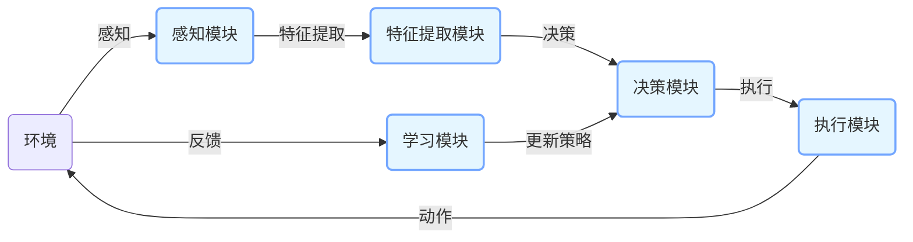

# AI Agent的情境适应学习：提高在复杂环境中的表现

> 关键词：AI Agent、情境适应学习、复杂环境、强化学习、元学习

> 摘要：本文聚焦于AI Agent的情境适应学习，旨在探讨如何提升其在复杂环境中的表现。首先介绍了相关背景知识，包括目的范围、预期读者等。接着阐述了核心概念与联系，详细讲解了核心算法原理及操作步骤，并给出了相应的数学模型和公式。通过项目实战展示了代码实现及解读，分析了实际应用场景。还推荐了学习资源、开发工具框架以及相关论文著作。最后总结了未来发展趋势与挑战，解答了常见问题并提供扩展阅读与参考资料，为AI Agent的情境适应学习提供全面而深入的技术指导。

## 1. 背景介绍 
### 1.1 目的和范围
随着人工智能技术的不断发展，AI Agent在越来越多的领域得到应用，如自动驾驶、机器人控制、游戏竞技等。然而，这些应用场景往往具有高度的复杂性和不确定性，传统的AI Agent训练方法在面对这些复杂环境时，表现出适应性不足的问题。本文的目的在于深入研究AI Agent的情境适应学习机制，探讨如何提高其在复杂环境中的表现。范围涵盖了情境适应学习的基本概念、核心算法、数学模型、项目实战以及实际应用场景等多个方面。

### 1.2 预期读者
本文预期读者包括人工智能领域的研究人员、开发者、学生以及对AI Agent技术感兴趣的爱好者。对于有一定编程和机器学习基础的读者，本文可以帮助他们深入理解情境适应学习的原理和实现方法；对于初学者，本文提供了系统的知识框架和学习路径，有助于他们快速入门。

### 1.3 文档结构概述
本文将按照以下结构进行阐述：首先介绍背景知识，包括目的、预期读者和文档结构概述等；接着讲解核心概念与联系，通过文本示意图和Mermaid流程图展示其原理和架构；然后详细阐述核心算法原理及具体操作步骤，并给出Python源代码；再介绍数学模型和公式，通过举例进行详细讲解；随后进行项目实战，展示代码实现和解读；分析实际应用场景；推荐相关的工具和资源；总结未来发展趋势与挑战；解答常见问题；最后提供扩展阅读与参考资料。

### 1.4 术语表
#### 1.4.1 核心术语定义
- **AI Agent**：即人工智能智能体，是一种能够感知环境、进行决策并采取行动的实体。它可以是软件程序、机器人等。
- **情境适应学习**：指AI Agent能够根据不同的环境情境调整自身的行为和策略，以达到更好的任务执行效果。
- **复杂环境**：具有高度不确定性、动态变化、多因素相互作用等特点的环境，如现实世界中的交通场景、自然生态系统等。

#### 1.4.2 相关概念解释
- **强化学习**：一种机器学习方法，通过智能体与环境的交互，根据环境反馈的奖励信号来学习最优策略。
- **元学习**：也称为“学习如何学习”，旨在让模型能够快速适应新的任务和环境，通过学习元知识来提高学习效率和泛化能力。

#### 1.4.3 缩略词列表
- **RL**：Reinforcement Learning，强化学习
- **ML**：Machine Learning，机器学习
- **MAML**：Model-Agnostic Meta-Learning，模型无关元学习

## 2. 核心概念与联系 

### 核心概念原理
AI Agent的情境适应学习核心在于让智能体能够在不同的环境情境下灵活调整自身的行为策略。其基本原理是基于对环境的感知和理解，通过学习和推理来选择最优的行动方案。在复杂环境中，环境状态可能随时发生变化，AI Agent需要不断地更新自己的认知和策略。

情境适应学习通常涉及到多个层次的学习过程。首先是对环境特征的提取和表示，通过传感器等设备获取环境信息，并将其转换为智能体能够处理的形式。然后是基于这些特征进行决策和行动，根据不同的情境选择合适的动作。最后是根据环境的反馈进行学习和调整，不断优化自己的策略。

### 架构的文本示意图
AI Agent的情境适应学习架构可以分为以下几个主要部分：

1. **感知模块**：负责获取环境信息，如视觉、听觉、触觉等传感器数据。
2. **特征提取模块**：对感知模块获取的原始数据进行处理，提取出有意义的特征。
3. **决策模块**：根据提取的特征和当前的情境，选择合适的行动方案。
4. **执行模块**：将决策模块输出的行动方案转化为实际的动作，作用于环境。
5. **学习模块**：根据环境的反馈信息，对决策模块的策略进行学习和调整。

### Mermaid流程图


## 3. 核心算法原理 & 具体操作步骤 

### 强化学习算法原理
强化学习是情境适应学习中常用的算法之一。其基本思想是智能体在环境中进行一系列的动作，环境会根据智能体的动作给出相应的奖励信号。智能体的目标是通过不断地与环境交互，学习到一个最优的策略，使得长期累积的奖励最大化。

强化学习的核心要素包括：
- **状态（State）**：表示环境在某一时刻的状态。
- **动作（Action）**：智能体在当前状态下可以采取的行为。
- **奖励（Reward）**：环境对智能体动作的反馈，用于评估动作的好坏。
- **策略（Policy）**：智能体根据当前状态选择动作的规则。

### Python源代码实现
以下是一个简单的强化学习示例，使用OpenAI Gym库中的CartPole环境：

```python
import gym
import numpy as np

# 创建CartPole环境
env = gym.make('CartPole-v1')

# 初始化参数
num_episodes = 1000
learning_rate = 0.1
discount_factor = 0.99

# 初始化Q表
state_space_size = env.observation_space.shape[0]
action_space_size = env.action_space.n
q_table = np.zeros((state_space_size, action_space_size))

# 训练过程
for episode in range(num_episodes):
    state = env.reset()
    done = False
    total_reward = 0
    
    while not done:
        # 选择动作
        if np.random.uniform(0, 1) < 0.1:
            action = env.action_space.sample()  # 探索
        else:
            action = np.argmax(q_table[state, :])  # 利用
        
        # 执行动作
        next_state, reward, done, _ = env.step(action)
        
        # 更新Q表
        q_table[state, action] = (1 - learning_rate) * q_table[state, action] + \
                                 learning_rate * (reward + discount_factor * np.max(q_table[next_state, :]))
        
        state = next_state
        total_reward += reward
    
    print(f"Episode {episode}: Total Reward = {total_reward}")

# 关闭环境
env.close()
```

### 具体操作步骤
1. **环境初始化**：使用`gym.make`函数创建CartPole环境。
2. **参数初始化**：设置训练的回合数、学习率、折扣因子等参数，并初始化Q表。
3. **训练过程**：在每个回合中，智能体根据当前状态选择动作，执行动作并获取环境的反馈，然后更新Q表。
4. **结束训练**：训练结束后，关闭环境。

## 4. 数学模型和公式 & 详细讲解 & 举例说明 

### 强化学习的数学模型
强化学习可以用马尔可夫决策过程（Markov Decision Process，MDP）来描述。一个MDP由以下几个部分组成：
- **状态空间（State Space）**：用 $\mathcal{S}$ 表示，是所有可能状态的集合。
- **动作空间（Action Space）**：用 $\mathcal{A}$ 表示，是所有可能动作的集合。
- **状态转移概率（State Transition Probability）**：用 $P(s'|s, a)$ 表示，即在状态 $s$ 下采取动作 $a$ 转移到状态 $s'$ 的概率。
- **奖励函数（Reward Function）**：用 $R(s, a, s')$ 表示，即在状态 $s$ 下采取动作 $a$ 转移到状态 $s'$ 时获得的奖励。
- **折扣因子（Discount Factor）**：用 $\gamma$ 表示，用于衡量未来奖励的重要性。

### Q学习算法的公式
Q学习是一种基于值函数的强化学习算法，其目标是学习一个最优的动作价值函数 $Q(s, a)$，表示在状态 $s$ 下采取动作 $a$ 所能获得的最大累积折扣奖励。Q学习的更新公式如下：

$$
Q(s, a) \leftarrow Q(s, a) + \alpha [R(s, a, s') + \gamma \max_{a'} Q(s', a') - Q(s, a)]
$$

其中，$\alpha$ 是学习率，$\gamma$ 是折扣因子，$R(s, a, s')$ 是即时奖励，$\max_{a'} Q(s', a')$ 是下一个状态 $s'$ 下所有可能动作的最大Q值。

### 举例说明
假设一个简单的网格世界环境，智能体的目标是从起点走到终点。状态空间 $\mathcal{S}$ 是网格中的所有位置，动作空间 $\mathcal{A}$ 包括上下左右四个方向的移动。奖励函数设置为：到达终点获得奖励100，撞到障碍物获得奖励 -10，其他情况奖励为0。

初始时，Q表中的所有值都为0。智能体在环境中不断探索和学习，根据Q学习的更新公式更新Q表。例如，智能体从状态 $s_1$ 采取动作 $a_1$ 转移到状态 $s_2$，获得奖励 $R(s_1, a_1, s_2) = 0$，下一个状态 $s_2$ 下所有可能动作的最大Q值为 $\max_{a'} Q(s_2, a') = 10$，学习率 $\alpha = 0.1$，折扣因子 $\gamma = 0.9$，则Q表的更新为：

$$
Q(s_1, a_1) \leftarrow Q(s_1, a_1) + 0.1 [0 + 0.9 \times 10 - Q(s_1, a_1)]
$$

## 5. 项目实战：代码实际案例和详细解释说明 

### 5.1  开发环境搭建
1. **安装Python**：建议使用Python 3.6及以上版本。可以从Python官方网站（https://www.python.org/downloads/）下载并安装。
2. **安装依赖库**：本项目需要使用OpenAI Gym库和NumPy库。可以使用以下命令进行安装：
```sh
pip install gym numpy
```

### 5.2  源代码详细实现和代码解读
以下是一个完整的CartPole项目实战代码：

```python
import gym
import numpy as np
import matplotlib.pyplot as plt

# 创建CartPole环境
env = gym.make('CartPole-v1')

# 初始化参数
num_episodes = 2000
learning_rate = 0.1
discount_factor = 0.99
epsilon = 1.0
epsilon_decay = 0.995
epsilon_min = 0.01

# 初始化Q表
state_space_size = env.observation_space.shape[0]
action_space_size = env.action_space.n
q_table = np.zeros((state_space_size, action_space_size))

# 记录每个回合的奖励
rewards = []

# 训练过程
for episode in range(num_episodes):
    state = env.reset()
    done = False
    total_reward = 0
    
    while not done:
        # 选择动作
        if np.random.uniform(0, 1) < epsilon:
            action = env.action_space.sample()  # 探索
        else:
            action = np.argmax(q_table[state, :])  # 利用
        
        # 执行动作
        next_state, reward, done, _ = env.step(action)
        
        # 更新Q表
        q_table[state, action] = (1 - learning_rate) * q_table[state, action] + \
                                 learning_rate * (reward + discount_factor * np.max(q_table[next_state, :]))
        
        state = next_state
        total_reward += reward
    
    # 衰减epsilon
    if epsilon > epsilon_min:
        epsilon *= epsilon_decay
    
    rewards.append(total_reward)
    if episode % 100 == 0:
        print(f"Episode {episode}: Average Reward = {np.mean(rewards[-100:])}")

# 关闭环境
env.close()

# 绘制奖励曲线
plt.plot(rewards)
plt.xlabel('Episode')
plt.ylabel('Total Reward')
plt.title('CartPole Training Rewards')
plt.show()
```

### 代码解读与分析
1. **参数初始化**：设置训练的回合数、学习率、折扣因子、初始探索率等参数，并初始化Q表。
2. **训练过程**：在每个回合中，智能体根据当前状态选择动作，执行动作并获取环境的反馈，然后更新Q表。同时，逐渐衰减探索率，让智能体更多地利用已经学习到的知识。
3. **记录奖励**：记录每个回合的总奖励，用于后续的分析和可视化。
4. **绘制奖励曲线**：使用Matplotlib库绘制奖励曲线，直观地展示智能体的训练效果。

通过观察奖励曲线，我们可以看到智能体在训练过程中的表现逐渐提高，总奖励不断增加。这表明智能体通过不断地与环境交互和学习，逐渐掌握了在CartPole环境中保持平衡的策略。

## 6. 实际应用场景 
### 自动驾驶
在自动驾驶领域，AI Agent需要在复杂多变的交通环境中做出决策。情境适应学习可以帮助自动驾驶车辆根据不同的路况、天气、交通信号等情境调整行驶策略，提高行驶的安全性和效率。例如，在遇到交通拥堵时，车辆可以根据实时的交通信息选择最优的绕行路线；在恶劣天气条件下，调整车速和跟车距离等。

### 机器人控制
机器人在执行各种任务时，需要面对不同的环境和任务要求。情境适应学习可以让机器人根据不同的工作场景和任务目标，灵活调整自身的动作和行为。例如，在工业生产线上，机器人可以根据工件的不同形状和位置，自动调整抓取和操作的方式；在服务机器人领域，机器人可以根据用户的需求和环境的变化，提供个性化的服务。

### 游戏竞技
在游戏领域，AI Agent需要与其他玩家或对手进行竞争。情境适应学习可以让游戏AI根据不同的游戏场景和对手的策略，实时调整自己的战术和行为。例如，在实时战略游戏中，AI可以根据敌方的兵力部署和资源情况，选择合适的进攻或防御策略；在角色扮演游戏中，AI可以根据玩家的行为和选择，调整剧情的发展和角色的互动。

### 智能医疗
在智能医疗领域，AI Agent可以辅助医生进行疾病诊断和治疗决策。情境适应学习可以让AI根据患者的不同症状、病史、基因信息等情境，提供个性化的诊断和治疗方案。例如，在癌症治疗中，AI可以根据患者的肿瘤类型、分期、身体状况等因素，选择最适合的治疗方法；在药物研发中，AI可以根据不同的疾病靶点和药物特性，设计出更有效的药物分子。

## 7. 工具和资源推荐
### 7.1 学习资源推荐
#### 7.1.1 书籍推荐
- 《强化学习：原理与Python实现》：详细介绍了强化学习的基本原理和算法，并通过Python代码进行实现和讲解。
- 《深度学习》：深度学习领域的经典著作，对神经网络、优化算法等内容进行了深入阐述，为理解AI Agent的学习机制提供了理论基础。
- 《人工智能：一种现代的方法》：全面介绍了人工智能的各个领域，包括搜索算法、知识表示、机器学习等，是学习人工智能的优秀教材。

#### 7.1.2 在线课程
- Coursera上的“Reinforcement Learning Specialization”：由著名学者Richard Sutton和Andrew Barto授课，系统地介绍了强化学习的理论和实践。
- edX上的“Artificial Intelligence Nanodegree”：提供了人工智能领域的全面学习内容，包括机器学习、深度学习、计算机视觉等。
- 哔哩哔哩上的“动手学深度学习”：由李沐等老师讲解，通过实际代码演示和讲解，帮助学习者快速掌握深度学习的实践技能。

#### 7.1.3 技术博客和网站
- OpenAI Blog（https://openai.com/blog/）：OpenAI官方博客，发布人工智能领域的最新研究成果和技术进展。
- Towards Data Science（https://towardsdatascience.com/）：一个专注于数据科学和人工智能的技术博客平台，提供了大量的优质文章和教程。
- AI开源社区（https://www.aiopen.com.cn/）：国内的人工智能开源社区，分享了很多人工智能领域的开源项目和技术经验。

### 7.2 开发工具框架推荐
#### 7.2.1 IDE和编辑器
- PyCharm：一款专业的Python集成