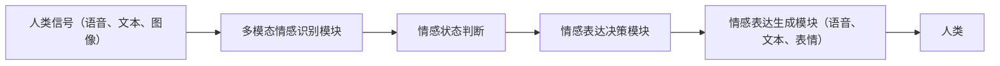

# AI Agent的情感识别与表达能力开发

> 关键词：AI Agent、情感识别、情感表达、开发、深度学习

> 摘要：本文聚焦于AI Agent的情感识别与表达能力开发这一前沿领域。首先介绍了相关背景知识，包括开发的目的、适用读者、文档结构和术语表。接着阐述了情感识别与表达的核心概念及联系，给出了原理和架构的示意图与流程图。详细讲解了核心算法原理，并通过Python源代码展示具体操作步骤。深入探讨了相关数学模型和公式，并举例说明。通过项目实战，给出代码实际案例并进行详细解释。分析了其实际应用场景，推荐了学习、开发所需的工具和资源，涵盖书籍、在线课程、技术博客、IDE等。最后总结了未来发展趋势与挑战，还包含常见问题解答和扩展阅读参考资料，旨在为开发者和研究者提供全面且深入的指导。

## 1. 背景介绍 
### 1.1 目的和范围
随着人工智能技术的不断发展，AI Agent在各个领域的应用越来越广泛。然而，目前大多数AI Agent缺乏情感识别与表达能力，这使得它们与人类的交互不够自然和深入。本开发的目的是赋予AI Agent情感识别与表达能力，使其能够更好地理解人类的情感状态，并以合适的方式进行回应。

本开发的范围包括情感识别技术、情感表达技术以及两者之间的协同工作机制。具体涉及到语音、文本、图像等多模态数据的情感分析，以及通过语音、文本、表情等方式进行情感表达。

### 1.2 预期读者
本文预期读者包括人工智能开发者、研究人员、相关专业的学生以及对AI Agent情感识别与表达能力感兴趣的人士。对于有一定编程基础和机器学习知识的读者，能够更容易理解文中的技术细节和代码实现；而对于初学者，也可以通过本文了解该领域的基本概念和发展方向。

### 1.3 文档结构概述
本文将按照以下结构进行阐述：首先介绍核心概念与联系，包括情感识别和表达的原理和架构；接着详细讲解核心算法原理和具体操作步骤，并给出Python源代码示例；然后介绍相关的数学模型和公式，并举例说明；通过项目实战，给出代码实际案例并进行详细解释；分析实际应用场景；推荐学习和开发所需的工具和资源；最后总结未来发展趋势与挑战，还包含常见问题解答和扩展阅读参考资料。

### 1.4 术语表
#### 1.4.1 核心术语定义
- **AI Agent**：人工智能代理，是一种能够感知环境、自主决策并执行动作的智能实体。
- **情感识别**：指通过分析人类的语音、文本、表情等信号，识别出其当前的情感状态，如高兴、悲伤、愤怒等。
- **情感表达**：指AI Agent以合适的方式向人类传达自己的情感状态或对人类情感的回应，如通过语音语调、文本措辞、表情变化等。
- **多模态数据**：指包含多种信息形式的数据，如语音、文本、图像等。

#### 1.4.2 相关概念解释
- **深度学习**：是一种基于人工神经网络的机器学习方法，能够自动从大量数据中学习特征和模式，在情感识别和表达领域有广泛应用。
- **自然语言处理**：是研究如何让计算机理解和处理人类语言的技术，在情感识别和表达中用于文本数据的分析和生成。
- **计算机视觉**：是研究如何让计算机“看”的技术，在情感识别中用于分析人类的面部表情等图像数据。

#### 1.4.3 缩略词列表
- **CNN**：卷积神经网络（Convolutional Neural Network）
- **RNN**：循环神经网络（Recurrent Neural Network）
- **LSTM**：长短期记忆网络（Long Short-Term Memory）
- **GRU**：门控循环单元（Gated Recurrent Unit）

## 2. 核心概念与联系 

### 核心概念原理
情感识别的核心原理是通过对人类产生的各种信号进行分析，提取其中与情感相关的特征，然后利用机器学习或深度学习模型对这些特征进行分类或回归，从而判断出人类的情感状态。例如，在语音情感识别中，可以提取语音的音高、音长、音量等特征；在文本情感识别中，可以提取词语的情感极性、句子的语义结构等特征。

情感表达的核心原理是根据识别到的人类情感状态以及AI Agent自身的设定，生成合适的回应。这涉及到自然语言生成、语音合成、表情动画生成等技术。例如，当识别到人类处于高兴状态时，AI Agent可以用欢快的语调说一些祝贺的话，并展现出微笑的表情。

### 架构的文本示意图
```plaintext
人类信号（语音、文本、图像） -> 多模态情感识别模块 -> 情感状态判断 -> 情感表达决策模块 -> 情感表达生成模块（语音、文本、表情） -> 人类
```

### Mermaid流程图


## 3. 核心算法原理 & 具体操作步骤 

### 情感识别算法原理 - 以文本情感识别为例
文本情感识别可以使用深度学习中的卷积神经网络（CNN）。CNN的原理是通过卷积层提取文本中的局部特征，池化层对特征进行降维，最后通过全连接层进行分类。

以下是使用Python和Keras库实现的文本情感识别代码示例：

```python
import numpy as np
from keras.preprocessing.text import Tokenizer
from keras.preprocessing.sequence import pad_sequences
from keras.models import Sequential
from keras.layers import Embedding, Conv1D, GlobalMaxPooling1D, Dense

# 示例数据
texts = ["This is a great movie!", "I'm so sad about this news.", "It's really boring."]
labels = [1, 0, 0]  # 1表示积极，0表示消极

# 分词
tokenizer = Tokenizer(num_words=1000)
tokenizer.fit_on_texts(texts)
sequences = tokenizer.texts_to_sequences(texts)

# 填充序列
max_length = 20
padded_sequences = pad_sequences(sequences, maxlen=max_length)

# 构建模型
model = Sequential()
model.add(Embedding(input_dim=1000, output_dim=100, input_length=max_length))
model.add(Conv1D(filters=128, kernel_size=5, activation='relu'))
model.add(GlobalMaxPooling1D())
model.add(Dense(1, activation='sigmoid'))

# 编译模型
model.compile(optimizer='adam', loss='binary_crossentropy', metrics=['accuracy'])

# 训练模型
model.fit(padded_sequences, np.array(labels), epochs=10, batch_size=1)

# 预测新文本的情感
new_text = ["This is an amazing experience!"]
new_sequence = tokenizer.texts_to_sequences(new_text)
new_padded_sequence = pad_sequences(new_sequence, maxlen=max_length)
prediction = model.predict(new_padded_sequence)
print("Predicted sentiment:", prediction[0][0])
```

### 操作步骤
1. **数据准备**：收集包含情感标签的文本数据，并进行预处理，如分词、填充序列等。
2. **模型构建**：使用Keras构建CNN模型，包括嵌入层、卷积层、池化层和全连接层。
3. **模型编译**：选择合适的优化器、损失函数和评估指标。
4. **模型训练**：将预处理后的数据输入模型进行训练。
5. **模型预测**：使用训练好的模型对新的文本进行情感预测。

## 4. 数学模型和公式 & 详细讲解 & 举例说明 

### 卷积操作
在卷积神经网络中，卷积操作是核心。对于一个一维卷积层，假设输入序列为 $x = [x_1, x_2,..., x_n]$，卷积核为 $w = [w_1, w_2,..., w_k]$，则卷积输出 $y$ 的第 $i$ 个元素可以表示为：

$$y_i = \sum_{j=0}^{k-1} w_j \cdot x_{i+j} + b$$

其中 $b$ 是偏置项。

### 激活函数 - ReLU
ReLU（Rectified Linear Unit）是一种常用的激活函数，其公式为：

$$f(x) = \max(0, x)$$

ReLU的作用是引入非线性，使得神经网络能够学习到更复杂的模式。

### 损失函数 - 二元交叉熵
在二元分类问题中，如文本情感识别，常用的损失函数是二元交叉熵。假设真实标签为 $y$（取值为0或1），预测概率为 $\hat{y}$，则二元交叉熵损失为：

$$L(y, \hat{y}) = -[y \log(\hat{y}) + (1 - y) \log(1 - \hat{y})]$$

### 举例说明
假设输入序列 $x = [1, 2, 3, 4, 5]$，卷积核 $w = [1, 2]$，偏置项 $b = 1$。进行卷积操作：

当 $i = 0$ 时，$y_0 = w_0 \cdot x_0 + w_1 \cdot x_1 + b = 1 \cdot 1 + 2 \cdot 2 + 1 = 6$

当 $i = 1$ 时，$y_1 = w_0 \cdot x_1 + w_1 \cdot x_2 + b = 1 \cdot 2 + 2 \cdot 3 + 1 = 9$

以此类推。

对于ReLU激活函数，当输入 $x = -2$ 时，$f(-2) = \max(0, -2) = 0$；当输入 $x = 3$ 时，$f(3) = \max(0, 3) = 3$。

假设真实标签 $y = 1$，预测概率 $\hat{y} = 0.8$，则二元交叉熵损失为：

$$L(1, 0.8) = -[1 \log(0.8) + (1 - 1) \log(1 - 0.8)] = -\log(0.8) \approx 0.223$$

## 5. 项目实战：代码实际案例和详细解释说明 

### 5.1  开发环境搭建
1. **安装Python**：建议使用Python 3.6及以上版本。
2. **安装必要的库**：使用pip安装Keras、NumPy、Pandas等库。
```bash
pip install keras numpy pandas
```
3. **安装深度学习框架**：如果使用GPU加速，还需要安装TensorFlow-GPU或PyTorch-GPU。

### 5.2  源代码详细实现和代码解读
以下是一个完整的多模态情感识别与表达项目的代码示例：

```python
import numpy as np
from keras.preprocessing.text import Tokenizer
from keras.preprocessing.sequence import pad_sequences
from keras.models import Sequential
from keras.layers import Embedding, Conv1D, GlobalMaxPooling1D, Dense
import pyttsx3

# 文本情感识别部分
texts = ["This is a great movie!", "I'm so sad about this news.", "It's really boring."]
labels = [1, 0, 0]  # 1表示积极，0表示消极

tokenizer = Tokenizer(num_words=1000)
tokenizer.fit_on_texts(texts)
sequences = tokenizer.texts_to_sequences(texts)

max_length = 20
padded_sequences = pad_sequences(sequences, maxlen=max_length)

model = Sequential()
model.add(Embedding(input_dim=1000, output_dim=100, input_length=max_length))
model.add(Conv1D(filters=128, kernel_size=5, activation='relu'))
model.add(GlobalMaxPooling1D())
model.add(Dense(1, activation='sigmoid'))

model.compile(optimizer='adam', loss='binary_crossentropy', metrics=['accuracy'])
model.fit(padded_sequences, np.array(labels), epochs=10, batch_size=1)

# 语音合成部分
engine = pyttsx3.init()

# 情感表达决策和生成
def express_emotion(prediction):
    if prediction > 0.5:
        response = "That sounds great! I'm happy for you."
    else:
        response = "I'm sorry to hear that. Cheer up!"
    engine.say(response)
    engine.runAndWait()

# 测试新文本
new_text = ["This is an amazing experience!"]
new_sequence = tokenizer.texts_to_sequences(new_text)
new_padded_sequence = pad_sequences(new_sequence, maxlen=max_length)
prediction = model.predict(new_padded_sequence)
express_emotion(prediction[0][0])
```

### 5.3  代码解读与分析
1. **文本情感识别部分**：
    - 首先，使用 `Tokenizer` 对文本进行分词，并将其转换为序列。
    - 然后，使用 `pad_sequences` 对序列进行填充，使其长度一致。
    - 接着，构建CNN模型，包括嵌入层、卷积层、池化层和全连接层。
    - 最后，编译模型并进行训练。
2. **语音合成部分**：
    - 使用 `pyttsx3` 库初始化语音合成引擎。
3. **情感表达决策和生成**：
    - 根据预测的情感概率，判断是积极还是消极情感，并生成相应的回应。
    - 使用语音合成引擎将回应语音输出。

## 6. 实际应用场景 
### 智能客服
在智能客服系统中，AI Agent可以通过情感识别了解用户的情绪状态，如愤怒、焦虑等。对于愤怒的用户，AI Agent可以用温和、安抚的语气进行回应，表达理解和歉意，从而提高用户满意度。

### 教育领域
在在线教育平台中，AI Agent可以识别学生的情感状态，如困惑、沮丧等。当检测到学生有困惑时，AI Agent可以用鼓励的语言引导学生，提供更详细的解释和帮助。

### 心理健康辅导
AI Agent可以作为心理健康辅导的辅助工具，通过情感识别了解用户的心理状态，提供相应的心理支持和建议。例如，当用户处于抑郁状态时，AI Agent可以陪伴用户聊天，给予积极的反馈和鼓励。

### 社交娱乐
在社交娱乐应用中，AI Agent可以与用户进行情感互动，增加趣味性和沉浸感。例如，在游戏中，AI Agent可以根据玩家的情绪状态调整游戏难度和氛围。

## 7. 工具和资源推荐
### 7.1 学习资源推荐
#### 7.1.1 书籍推荐
- 《深度学习》（Deep Learning）：由Ian Goodfellow、Yoshua Bengio和Aaron Courville所著，是深度学习领域的经典教材。
- 《自然语言处理入门》：介绍了自然语言处理的基本概念和方法，适合初学者。
- 《计算机视觉：算法与应用》：详细讲解了计算机视觉的相关算法和应用。

#### 7.1.2 在线课程
- Coursera上的“深度学习专项课程”：由Andrew Ng教授讲授，涵盖了深度学习的各个方面。
- edX上的“自然语言处理”课程：提供了系统的自然语言处理知识。
- Udemy上的“计算机视觉实战课程”：通过实际项目帮助学习者掌握计算机视觉技术。

#### 7.1.3 技术博客和网站
- Medium：有许多关于人工智能和机器学习的优质博客文章。
- Towards Data Science：专注于数据科学和人工智能领域的技术分享。
- arXiv：提供了大量的学术论文，可了解最新的研究成果。

### 7.2 开发工具框架推荐
#### 7.2.1 IDE和编辑器
- PyCharm：功能强大的Python集成开发环境，适合开发大型项目。
- Jupyter Notebook：交互式的开发环境，便于代码调试和可视化。
- Visual Studio Code：轻量级的代码编辑器，支持多种编程语言和插件。

#### 7.2.2 调试和性能分析工具
- TensorBoard：用于可视化TensorFlow模型的训练过程和性能指标。
- Py-Spy：可以对Python程序进行性能分析，找出性能瓶颈。
- GDB：通用的调试工具，可用于调试C、C++和Python等语言的程序。

#### 7.2.3 相关框架和库
- Keras：简单易用的深度学习框架，适合初学者快速上手。
- TensorFlow：功能强大的深度学习框架，广泛应用于工业界。
- PyTorch：动态图深度学习框架，在学术界很受欢迎。

### 7.3 相关论文著作推荐
#### 7.3.1 经典论文
- “Convolutional Neural Networks for Sentence Classification”：介绍了使用CNN进行文本分类的方法。
- “Long Short-Term Memory”：提出了长短期记忆网络（LSTM）的概念。
- “Attention Is All You Need”：提出了Transformer模型，在自然语言处理领域取得了巨大成功。

#### 7.3.2 最新研究成果
- 关注顶级学术会议如NeurIPS、ICML、ACL等的论文，了解最新的研究动态。
- 一些知名研究机构如OpenAI、Google Research等的官方网站也会发布最新的研究成果。

#### 7.3.3 应用案例分析
- 阅读一些实际应用案例的论文，了解AI Agent情感识别与表达技术在不同领域的应用方法和效果。

## 8. 总结：未来发展趋势与挑战
### 未来发展趋势
1. **多模态融合**：未来的AI Agent将更加注重多模态数据的融合，如同时结合语音、文本、图像和视频等信息进行情感识别和表达，以提高准确性和自然度。
2. **个性化情感交互**：根据用户的个人偏好和历史交互数据，为用户提供个性化的情感回应，增强用户体验。
3. **情感智能与其他技术的结合**：与虚拟现实、增强现实等技术结合，创造更加沉浸式的情感交互环境。

### 挑战
1. **数据不足**：情感识别和表达需要大量带有情感标签的数据进行训练，但目前相关的数据资源相对较少，且标注成本较高。
2. **情感理解的复杂性**：人类情感是复杂多样的，不同文化、个体之间的情感表达方式存在差异，如何准确理解和表达这些情感是一个挑战。
3. **伦理和隐私问题**：在收集和使用用户情感数据时，需要考虑伦理和隐私问题，确保用户数据的安全和合法使用。

## 9. 附录：常见问题与解答
### 问题1：如何提高情感识别的准确率？
解答：可以从以下几个方面入手：收集更多高质量的标注数据，使用更复杂的模型，进行特征工程，尝试多模态融合等。

### 问题2：情感表达的方式有哪些？
解答：情感表达的方式包括语音语调、文本措辞、表情变化、肢体动作等。在开发AI Agent时，可以根据具体需求选择合适的表达方式。

### 问题3：如何处理不同语言的情感识别？
解答：可以使用多语言模型，或者针对不同语言分别训练模型。同时，需要考虑不同语言的语法、词汇和文化差异。

## 10. 扩展阅读 & 参考资料
- 《人工智能：一种现代的方法》
- 《神经网络与深度学习》
- 相关学术期刊如Journal of Artificial Intelligence Research、Artificial Intelligence等

作者：AI天才研究院/AI Genius Institute & 禅与计算机程序设计艺术 /Zen And The Art of Computer Programming