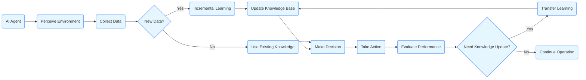

# AI Agent的持续学习与知识更新策略

> 关键词：AI Agent、持续学习、知识更新、增量学习、迁移学习

> 摘要：本文围绕AI Agent的持续学习与知识更新策略展开深入探讨。首先介绍了相关背景，包括目的、预期读者等内容。接着阐述了AI Agent、持续学习、知识更新等核心概念及其联系，并给出了相应的文本示意图和Mermaid流程图。详细讲解了核心算法原理，用Python代码进行了示例。对涉及的数学模型和公式进行了推导和举例说明。通过项目实战展示了代码的具体实现和解读。分析了实际应用场景，推荐了学习资源、开发工具框架和相关论文著作。最后总结了未来发展趋势与挑战，提供了常见问题解答和扩展阅读参考资料，旨在为AI Agent的持续学习与知识更新提供全面的技术指导。

## 1. 背景介绍 
### 1.1 目的和范围
在当今快速发展的科技时代，AI Agent已经广泛应用于各个领域，如智能客服、自动驾驶、金融风控等。然而，现实世界的数据是动态变化的，新知识不断涌现，传统的机器学习模型在面对这些变化时往往表现出局限性。因此，研究AI Agent的持续学习与知识更新策略具有重要的现实意义。本文的目的在于深入探讨如何让AI Agent能够在不断变化的环境中持续学习新的知识，更新已有的知识体系，以提高其性能和适应性。范围涵盖了持续学习和知识更新的核心概念、算法原理、数学模型、项目实战、应用场景等多个方面。

### 1.2 预期读者
本文预期读者包括人工智能领域的研究人员、开发者、数据科学家、软件工程师等。对于对AI Agent感兴趣，希望深入了解其持续学习和知识更新机制的初学者也具有一定的参考价值。

### 1.3 文档结构概述
本文首先介绍相关背景信息，为后续内容奠定基础。接着详细阐述核心概念及其联系，让读者对关键术语有清晰的理解。通过核心算法原理和具体操作步骤的讲解，结合Python代码示例，使读者掌握实现方法。利用数学模型和公式进一步深入分析。项目实战部分通过实际案例展示代码实现和解读。然后分析实际应用场景，为读者提供实际应用的思路。推荐学习资源、开发工具框架和相关论文著作，帮助读者拓展学习渠道。最后总结未来发展趋势与挑战，解答常见问题，并提供扩展阅读和参考资料。

### 1.4 术语表
#### 1.4.1 核心术语定义
- **AI Agent**：人工智能代理，是一种能够感知环境、自主决策并采取行动以实现特定目标的软件实体。
- **持续学习**：指AI Agent在其生命周期内，能够不断从新的数据中学习知识，同时保留和整合已有的知识，以适应环境的变化。
- **知识更新**：对AI Agent已有的知识进行修改、补充或替换，使其知识体系与最新的信息保持一致。
- **增量学习**：持续学习的一种方法，在已有模型的基础上，逐步学习新的数据，而不需要重新训练整个模型。
- **迁移学习**：将在一个任务上学习到的知识迁移到另一个相关任务上，以加速学习过程和提高性能。

#### 1.4.2 相关概念解释
- **灾难性遗忘**：在持续学习过程中，AI Agent在学习新的知识时，可能会忘记之前学习到的重要信息，导致在旧任务上的性能显著下降。
- **元学习**：学习如何学习的方法，通过在多个任务上进行训练，让模型能够快速适应新的任务。

#### 1.4.3 缩略词列表
- **ML**：Machine Learning，机器学习
- **DL**：Deep Learning，深度学习
- **RL**：Reinforcement Learning，强化学习

## 2. 核心概念与联系 
### 核心概念原理
#### AI Agent
AI Agent是一个具有感知、决策和行动能力的智能实体。它通过传感器感知环境信息，利用内部的模型或算法进行决策，然后通过执行器采取相应的行动。例如，在自动驾驶场景中，AI Agent通过摄像头、雷达等传感器获取道路信息，根据这些信息做出驾驶决策，如加速、减速、转弯等。

#### 持续学习
持续学习的核心思想是让AI Agent能够不断从新的数据中学习，同时避免灾难性遗忘。它要求模型具有良好的可塑性和稳定性，能够在学习新知识的同时保留旧知识。常见的持续学习方法包括增量学习、元学习等。

#### 知识更新
知识更新是持续学习的重要环节，它涉及到对AI Agent已有知识的修改和补充。知识更新可以基于新的数据进行，也可以通过外部知识源（如知识库、专家意见等）来实现。

### 架构的文本示意图
```plaintext
           +---------------------+
           |     AI Agent        |
           +---------------------+
           |  Knowledge Base     |
           |  Learning Module    |
           |  Decision Module    |
           |  Action Module      |
           +---------------------+
           |  Data Input         |
           |  - New Data         |
           |  - Old Data         |
           +---------------------+
           |  Knowledge Update   |
           |  - Incremental      |
           |  - Transfer         |
           +---------------------+
```

### Mermaid流程图


## 3. 核心算法原理 & 具体操作步骤 
### 增量学习算法原理
增量学习的核心思想是在已有模型的基础上，逐步学习新的数据。常见的增量学习算法有在线梯度下降法。下面是使用Python实现的简单示例：

```python
import numpy as np

# 初始化模型参数
theta = np.zeros(2)

# 定义学习率
learning_rate = 0.01

# 定义损失函数（这里以线性回归的均方误差为例）
def loss_function(X, y, theta):
    m = len(y)
    predictions = X.dot(theta)
    loss = (1/(2*m)) * np.sum(np.square(predictions - y))
    return loss

# 定义梯度下降函数
def gradient_descent(X, y, theta, learning_rate, num_iterations):
    m = len(y)
    for iteration in range(num_iterations):
        predictions = X.dot(theta)
        error = predictions - y
        theta = theta - (learning_rate/m) * X.T.dot(error)
    return theta

# 模拟新数据
new_X = np.array([[1, 2], [1, 3]])
new_y = np.array([5, 7])

# 进行增量学习
theta = gradient_descent(new_X, new_y, theta, learning_rate, 100)

print("Updated theta:", theta)
```

### 具体操作步骤
1. **数据收集**：收集新的数据，确保数据的质量和代表性。
2. **数据预处理**：对新数据进行清洗、归一化等预处理操作，使其与已有数据具有相同的格式和分布。
3. **模型更新**：使用增量学习算法，在已有模型的基础上，对新数据进行学习，更新模型参数。
4. **模型评估**：使用评估指标（如准确率、召回率等）对更新后的模型进行评估，检查模型性能是否有所提升。
5. **知识更新**：如果模型性能满足要求，将更新后的模型参数保存到知识数据库中，完成知识更新。

### 迁移学习算法原理
迁移学习的核心思想是将在一个任务上学习到的知识迁移到另一个相关任务上。下面是一个简单的基于预训练模型的迁移学习示例：

```python
import torch
import torch.nn as nn
import torch.optim as optim
from torchvision import models, datasets, transforms

# 加载预训练的ResNet模型
model = models.resnet18(pretrained=True)

# 冻结模型的所有参数
for param in model.parameters():
    param.requires_grad = False

# 修改最后一层全连接层，以适应新的任务
num_ftrs = model.fc.in_features
model.fc = nn.Linear(num_ftrs, 10)  # 假设新任务有10个类别

# 定义数据预处理
transform = transforms.Compose([
    transforms.Resize(256),
    transforms.CenterCrop(224),
    transforms.ToTensor(),
    transforms.Normalize(mean=[0.485, 0.456, 0.406], std=[0.229, 0.224, 0.225])
])

# 加载新的数据集
train_dataset = datasets.CIFAR10(root='./data', train=True,
                                 download=True, transform=transform)
train_loader = torch.utils.data.DataLoader(train_dataset, batch_size=32,
                                           shuffle=True)

# 定义损失函数和优化器
criterion = nn.CrossEntropyLoss()
optimizer = optim.SGD(model.fc.parameters(), lr=0.001, momentum=0.9)

# 训练模型
num_epochs = 5
for epoch in range(num_epochs):
    running_loss = 0.0
    for i, (images, labels) in enumerate(train_loader):
        optimizer.zero_grad()
        outputs = model(images)
        loss = criterion(outputs, labels)
        loss.backward()
        optimizer.step()
        running_loss += loss.item()
    print(f'Epoch {epoch+1}, Loss: {running_loss/len(train_loader)}')
```

### 具体操作步骤
1. **选择预训练模型**：根据新任务的特点，选择合适的预训练模型，如ResNet、VGG等。
2. **冻结部分参数**：为了避免过拟合，通常会冻结预训练模型的部分参数，只训练最后一层或几层。
3. **修改模型结构**：根据新任务的需求，修改模型的最后一层或几层，使其输出符合新任务的类别数。
4. **数据准备**：收集和准备新的数据集，并进行预处理。
5. **训练模型**：使用新的数据集对修改后的模型进行训练，更新最后一层或几层的参数。
6. **模型评估**：使用评估指标对训练后的模型进行评估，检查模型性能。

## 4. 数学模型和公式 & 详细讲解 & 举例说明 
### 增量学习的数学模型
#### 线性回归的增量学习
在线性回归中，我们的目标是找到一个线性模型 $y = \theta^T x$，使得预测值 $\hat{y}$ 与真实值 $y$ 之间的误差最小。误差通常使用均方误差（MSE）来衡量：

$$
J(\theta) = \frac{1}{2m} \sum_{i=1}^{m} (y^{(i)} - \theta^T x^{(i)})^2
$$

其中，$m$ 是样本数量，$x^{(i)}$ 是第 $i$ 个样本的特征向量，$y^{(i)}$ 是第 $i$ 个样本的真实值，$\theta$ 是模型参数。

在增量学习中，我们使用梯度下降法来更新模型参数 $\theta$。梯度下降法的更新公式为：

$$
\theta := \theta - \alpha \nabla J(\theta)
$$

其中，$\alpha$ 是学习率，$\nabla J(\theta)$ 是损失函数 $J(\theta)$ 关于 $\theta$ 的梯度。对于线性回归，梯度的计算公式为：

$$
\nabla J(\theta) = \frac{1}{m} \sum_{i=1}^{m} (y^{(i)} - \theta^T x^{(i)}) x^{(i)}
$$

#### 举例说明
假设我们有一个简单的线性回归问题，数据集包含两个样本：$(x^{(1)} = [1, 2], y^{(1)} = 5)$ 和 $(x^{(2)} = [1, 3], y^{(2)} = 7)$。初始模型参数 $\theta = [0, 0]$，学习率 $\alpha = 0.01$。

首先，计算第一个样本的梯度：

$$
\nabla J(\theta)_1 = (y^{(1)} - \theta^T x^{(1)}) x^{(1)} = (5 - [0, 0]^T [1, 2]) [1, 2] = [5, 10]
$$

更新模型参数：

$$
\theta_1 = \theta - \alpha \nabla J(\theta)_1 = [0, 0] - 0.01 [5, 10] = [-0.05, -0.1]
$$

然后，计算第二个样本的梯度：

$$
\nabla J(\theta)_2 = (y^{(2)} - \theta_1^T x^{(2)}) x^{(2)} = (7 - [-0.05, -0.1]^T [1, 3]) [1, 3]
$$

$$
= (7 - (-0.05 - 0.3)) [1, 3] = (7 + 0.35) [1, 3] = [7.35, 22.05]
$$

再次更新模型参数：

$$
\theta_2 = \theta_1 - \alpha \nabla J(\theta)_2 = [-0.05, -0.1] - 0.01 [7.35, 22.05]
$$

$$
= [-0.05 - 0.0735, -0.1 - 0.2205] = [-0.1235, -0.3205]
$$

### 迁移学习的数学模型
#### 基于预训练模型的迁移学习
在基于预训练模型的迁移学习中，我们通常使用预训练模型的特征提取层，只训练最后一层全连接层。假设预训练模型的特征提取层为 $f(x)$，最后一层全连接层的权重矩阵为 $W$，偏置向量为 $b$，则模型的输出为：

$$
\hat{y} = W f(x) + b
$$

损失函数通常使用交叉熵损失函数：

$$
J(W, b) = -\frac{1}{m} \sum_{i=1}^{m} \sum_{j=1}^{C} y_{ij} \log(\hat{y}_{ij})
$$

其中，$m$ 是样本数量，$C$ 是类别数，$y_{ij}$ 是第 $i$ 个样本属于第 $j$ 类的真实标签（通常为 0 或 1），$\hat{y}_{ij}$ 是第 $i$ 个样本属于第 $j$ 类的预测概率。

我们使用梯度下降法来更新最后一层全连接层的参数 $W$ 和 $b$：

$$
W := W - \alpha \nabla_W J(W, b)
$$

$$
b := b - \alpha \nabla_b J(W, b)
$$

#### 举例说明
假设我们有一个预训练的ResNet模型，最后一层全连接层的输入维度为 512，输出维度为 10（即有 10 个类别）。我们使用一个包含 100 个样本的数据集进行训练，学习率 $\alpha = 0.001$。

首先，随机初始化最后一层全连接层的权重矩阵 $W$ 和偏置向量 $b$。

然后，对于每个样本 $(x^{(i)}, y^{(i)})$，计算模型的输出 $\hat{y}^{(i)} = W f(x^{(i)}) + b$，并计算损失函数 $J(W, b)$。

接着，计算损失函数关于 $W$ 和 $b$ 的梯度：

$$
\nabla_W J(W, b) = \frac{1}{m} \sum_{i=1}^{m} (\hat{y}^{(i)} - y^{(i)}) f(x^{(i)})^T
$$

$$
\nabla_b J(W, b) = \frac{1}{m} \sum_{i=1}^{m} (\hat{y}^{(i)} - y^{(i)})
$$

最后，更新 $W$ 和 $b$：

$$
W := W - \alpha \nabla_W J(W, b)
$$

$$
b := b - \alpha \nabla_b J(W, b)
$$

重复上述步骤，直到模型收敛。

## 5. 项目实战：代码实际案例和详细解释说明 
### 5.1  开发环境搭建
#### 安装Python
首先，确保你已经安装了Python 3.x版本。你可以从Python官方网站（https://www.python.org/downloads/）下载并安装适合你操作系统的Python版本。

#### 安装必要的库
使用以下命令安装项目所需的库：

```sh
pip install numpy torch torchvision matplotlib
```

### 5.2  源代码详细实现和代码解读
#### 增量学习示例
```python
import numpy as np
import matplotlib.pyplot as plt

# 生成初始数据
np.random.seed(42)
X = np.random.rand(100, 1)
y = 2 * X + 1 + 0.5 * np.random.randn(100, 1)

# 初始化模型参数
theta = np.zeros((2, 1))

# 定义学习率和迭代次数
learning_rate = 0.01
num_iterations = 100

# 定义损失函数
def loss_function(X_b, y, theta):
    m = len(y)
    predictions = X_b.dot(theta)
    loss = (1/(2*m)) * np.sum(np.square(predictions - y))
    return loss

# 定义梯度下降函数
def gradient_descent(X_b, y, theta, learning_rate, num_iterations):
    m = len(y)
    losses = []
    for iteration in range(num_iterations):
        predictions = X_b.dot(theta)
        error = predictions - y
        gradients = (1/m) * X_b.T.dot(error)
        theta = theta - learning_rate * gradients
        loss = loss_function(X_b, y, theta)
        losses.append(loss)
    return theta, losses

# 增加偏置项
X_b = np.c_[np.ones((len(X), 1)), X]

# 进行初始训练
theta, losses = gradient_descent(X_b, y, theta, learning_rate, num_iterations)

# 绘制初始训练的损失曲线
plt.plot(losses)
plt.xlabel('Iterations')
plt.ylabel('Loss')
plt.title('Initial Training Loss')
plt.show()

# 模拟新数据
new_X = np.random.rand(20, 1)
new_y = 2 * new_X + 1 + 0.5 * np.random.randn(20, 1)

# 增加偏置项
new_X_b = np.c_[np.ones((len(new_X), 1)), new_X]

# 进行增量学习
theta, new_losses = gradient_descent(new_X_b, new_y, theta, learning_rate, num_iterations)

# 绘制增量学习的损失曲线
plt.plot(new_losses)
plt.xlabel('Iterations')
plt.ylabel('Loss')
plt.title('Incremental Learning Loss')
plt.show()

print("Final theta:", theta)
```

#### 代码解读
1. **数据生成**：使用 `np.random.rand` 生成初始数据，并添加一些噪声。
2. **模型初始化**：将模型参数 `theta` 初始化为零向量。
3. **损失函数和梯度下降**：定义了损失函数 `loss_function` 和梯度下降函数 `gradient_descent`，用于计算损失和更新模型参数。
4. **初始训练**：使用初始数据进行训练，并绘制损失曲线。
5. **新数据模拟**：生成新的数据，并进行增量学习。
6. **增量学习**：在已有模型的基础上，使用新数据进行训练，并绘制损失曲线。

#### 迁移学习示例
```python
import torch
import torch.nn as nn
import torch.optim as optim
from torchvision import models, datasets, transforms
import matplotlib.pyplot as plt

# 加载预训练的ResNet模型
model = models.resnet18(pretrained=True)

# 冻结模型的所有参数
for param in model.parameters():
    param.requires_grad = False

# 修改最后一层全连接层，以适应新的任务
num_ftrs = model.fc.in_features
model.fc = nn.Linear(num_ftrs, 10)  # 假设新任务有10个类别

# 定义数据预处理
transform = transforms.Compose([
    transforms.Resize(256),
    transforms.CenterCrop(224),
    transforms.ToTensor(),
    transforms.Normalize(mean=[0.485, 0.456, 0.406], std=[0.229, 0.224, 0.225])
])

# 加载新的数据集
train_dataset = datasets.CIFAR10(root='./data', train=True,
                                 download=True, transform=transform)
train_loader = torch.utils.data.DataLoader(train_dataset, batch_size=32,
                                           shuffle=True)

test_dataset = datasets.CIFAR10(root='./data', train=False,
                                download=True, transform=transform)
test_loader = torch.utils.data.DataLoader(test_dataset, batch_size=32,
                                          shuffle=False)

# 定义损失函数和优化器
criterion = nn.CrossEntropyLoss()
optimizer = optim.SGD(model.fc.parameters(), lr=0.001, momentum=0.9)

# 训练模型
num_epochs = 5
train_losses = []
for epoch in range(num_epochs):
    running_loss = 0.0
    for i, (images, labels) in enumerate(train_loader):
        optimizer.zero_grad()
        outputs = model(images)
        loss = criterion(outputs, labels)
        loss.backward()
        optimizer.step()
        running_loss += loss.item()
    train_loss = running_loss / len(train_loader)
    train_losses.append(train_loss)
    print(f'Epoch {epoch+1}, Loss: {train_loss}')

# 绘制训练损失曲线
plt.plot(train_losses)
plt.xlabel('Epochs')
plt.ylabel('Loss')
plt.title('Training Loss')
plt.show()

# 评估模型
model.eval()
correct = 0
total = 0
with torch.no_grad():
    for images, labels in test_loader:
        outputs = model(images)
        _, predicted = torch.max(outputs.data, 1)
        total += labels.size(0)
        correct += (predicted == labels).sum().item()

print(f'Accuracy on test set: {100 * correct / total}%')
```

#### 代码解读
1. **模型加载**：加载预训练的ResNet模型，并冻结所有参数。
2. **模型修改**：修改最后一层全连接层，以适应新的任务。
3. **数据预处理**：定义数据预处理步骤，包括调整大小、裁剪、转换为张量和归一化。
4. **数据集加载**：加载CIFAR-10数据集，并创建数据加载器。
5. **损失函数和优化器**：定义交叉熵损失函数和随机梯度下降优化器，只优化最后一层全连接层的参数。
6. **模型训练**：训练模型，并记录训练损失。
7. **训练损失曲线绘制**：绘制训练损失曲线，观察模型的训练过程。
8. **模型评估**：在测试集上评估模型的准确率。

### 5.3  代码解读与分析
#### 增量学习代码分析
- **优点**：代码简单易懂，通过梯度下降法实现了增量学习的基本思想。可以在已有模型的基础上，逐步学习新的数据，避免了重新训练整个模型的开销。
- **缺点**：该代码只考虑了简单的线性回归问题，对于复杂的非线性问题，可能需要使用更复杂的模型和算法。同时，没有考虑灾难性遗忘的问题，在学习新数据时可能会忘记旧知识。

#### 迁移学习代码分析
- **优点**：利用预训练模型的特征提取能力，减少了训练时间和数据需求。通过冻结部分参数，避免了过拟合的问题。
- **缺点**：预训练模型的选择和最后一层全连接层的设计需要一定的经验和技巧。如果预训练模型与新任务的相关性较低，可能会导致性能下降。

## 6. 实际应用场景 
### 智能客服
在智能客服领域，用户的问题和需求是不断变化的。通过持续学习和知识更新策略，AI Agent可以不断学习新的问题和答案，提高回答的准确性和效率。例如，当出现新的产品或服务时，AI Agent可以通过学习相关的知识，及时为用户提供准确的信息。

### 自动驾驶
自动驾驶系统需要在不同的路况和环境下运行，新的道路规则、交通标志等信息不断出现。AI Agent通过持续学习和知识更新，可以适应这些变化，提高自动驾驶的安全性和可靠性。例如，当某个地区实施新的交通规则时，AI Agent可以及时学习并调整驾驶策略。

### 金融风控
金融领域的风险因素是动态变化的，新的诈骗手段、市场波动等都会影响风险评估。AI Agent通过持续学习和知识更新，可以实时监测和分析这些变化，及时调整风险评估模型，提高风控能力。例如，当出现新的诈骗模式时，AI Agent可以学习相关特征，及时识别和防范诈骗行为。

### 医疗诊断
医学知识不断更新，新的疾病、治疗方法等不断涌现。AI Agent在医疗诊断中通过持续学习和知识更新，可以掌握最新的医学知识，提高诊断的准确性和效率。例如，当发现新的疾病类型时，AI Agent可以学习相关的症状和诊断方法，为医生提供更准确的诊断建议。

## 7. 工具和资源推荐
### 7.1 学习资源推荐
#### 7.1.1 书籍推荐
- 《深度学习》（Deep Learning）：由Ian Goodfellow、Yoshua Bengio和Aaron Courville所著，是深度学习领域的经典教材，涵盖了深度学习的基本原理、算法和应用。
- 《机器学习》（Machine Learning）：由Tom M. Mitchell所著，是机器学习领域的经典教材，介绍了机器学习的基本概念、算法和模型。
- 《人工智能：一种现代的方法》（Artificial Intelligence: A Modern Approach）：由Stuart Russell和Peter Norvig所著，是人工智能领域的权威教材，涵盖了人工智能的各个方面，包括知识表示、推理、学习、规划等。

#### 7.1.2 在线课程
- Coursera上的“深度学习专项课程”（Deep Learning Specialization）：由Andrew Ng教授授课，包括神经网络和深度学习、改善深层神经网络、结构化机器学习项目、卷积神经网络、序列模型等课程，是学习深度学习的经典课程。
- edX上的“人工智能导论”（Introduction to Artificial Intelligence）：由麻省理工学院（MIT）的Patrick H. Winston教授授课，介绍了人工智能的基本概念、算法和应用。
- Udemy上的“Python for Data Science and Machine Learning Bootcamp”：该课程介绍了使用Python进行数据科学和机器学习的基础知识和实践技巧。

#### 7.1.3 技术博客和网站
- Medium上的Towards Data Science：是一个专注于数据科学和机器学习的技术博客，提供了大量的优质文章和教程。
- arXiv：是一个预印本服务器，提供了大量的计算机科学、数学、物理学等领域的最新研究论文。
- Kaggle：是一个数据科学竞赛平台，提供了丰富的数据集、代码和教程，是学习和实践数据科学和机器学习的好地方。

### 7.2 开发工具框架推荐
#### 7.2.1 IDE和编辑器
- PyCharm：是一款专门为Python开发设计的集成开发环境（IDE），提供了丰富的功能和插件，如代码自动补全、调试、版本控制等。
- Jupyter Notebook：是一个交互式的开发环境，支持Python、R等多种编程语言，适合进行数据探索、模型训练和可视化等工作。
- Visual Studio Code：是一款轻量级的代码编辑器，支持多种编程语言和插件，具有丰富的扩展功能，如代码调试、版本控制等。

#### 7.2.2 调试和性能分析工具
- TensorBoard：是TensorFlow提供的一个可视化工具，可以用于可视化模型的训练过程、损失曲线、准确率等指标，帮助开发者调试和优化模型。
- PyTorch Profiler：是PyTorch提供的一个性能分析工具，可以用于分析模型的运行时间、内存使用情况等，帮助开发者找出性能瓶颈。
- cProfile：是Python标准库中的一个性能分析工具，可以用于分析Python代码的运行时间和函数调用情况。

#### 7.2.3 相关框架和库
- TensorFlow：是一个开源的机器学习框架，由Google开发和维护，提供了丰富的工具和库，支持深度学习、机器学习等多种算法和模型。
- PyTorch：是一个开源的深度学习框架，由Facebook开发和维护，具有动态图的特点，易于使用和调试，广泛应用于学术界和工业界。
- Scikit-learn：是一个开源的机器学习库，提供了丰富的机器学习算法和工具，如分类、回归、聚类、降维等，适合初学者和快速开发。

### 7.3 相关论文著作推荐
#### 7.3.1 经典论文
- "Learning representations by back-propagating errors"：由David E. Rumelhart、Geoffrey E. Hinton和Ronald J. Williams所著，是神经网络领域的经典论文，介绍了反向传播算法。
- "ImageNet Classification with Deep Convolutional Neural Networks"：由Alex Krizhevsky、Ilya Sutskever和Geoffrey E. Hinton所著，是深度学习领域的经典论文，介绍了AlexNet模型，开启了深度学习在计算机视觉领域的应用。
- "Attention Is All You Need"：由Ashish Vaswani等人所著，是自然语言处理领域的经典论文，介绍了Transformer模型，提出了注意力机制。

#### 7.3.2 最新研究成果
- 关注arXiv上的最新论文，了解AI Agent持续学习和知识更新领域的最新研究进展。
- 参加国际顶级学术会议，如NeurIPS、ICML、CVPR等，获取最新的研究成果和学术动态。

#### 7.3.3 应用案例分析
- 研究各大科技公司的技术博客和论文，了解他们在AI Agent持续学习和知识更新方面的应用案例和实践经验。
- 分析Kaggle上的竞赛案例，学习如何在实际项目中应用持续学习和知识更新策略。

## 8. 总结：未来发展趋势与挑战
### 未来发展趋势
#### 多模态学习
未来的AI Agent将不仅仅局限于单一模态的数据，如文本、图像、音频等，而是会实现多模态学习。通过融合不同模态的数据，AI Agent可以获得更全面的信息，提高学习和决策的能力。例如，在智能客服中，结合文本和语音信息，可以更好地理解用户的意图。

#### 终身学习
AI Agent将朝着终身学习的方向发展，能够在整个生命周期内持续学习和适应环境的变化。它将具备自我管理和自我优化的能力，不断调整自己的学习策略和知识体系，以应对不断变化的任务和挑战。

#### 知识图谱与持续学习的结合
知识图谱可以为AI Agent提供结构化的知识表示，将知识图谱与持续学习相结合，可以使AI Agent更好地理解和利用知识，提高学习效率和知识更新的准确性。例如，在医疗诊断中，知识图谱可以提供医学知识的结构化表示，帮助AI Agent更好地进行诊断和决策。

### 挑战
#### 灾难性遗忘问题
尽管已经有一些方法来缓解灾难性遗忘问题，但目前仍然没有完全解决。在持续学习过程中，如何有效地保留旧知识，同时学习新知识，是一个亟待解决的问题。

#### 数据隐私和安全
在持续学习过程中，AI Agent需要不断获取新的数据，这些数据可能包含用户的隐私信息。如何确保数据的隐私和安全，防止数据泄露和滥用，是一个重要的挑战。

#### 计算资源和效率
持续学习需要大量的计算资源和时间，尤其是在处理大规模数据和复杂模型时。如何提高计算效率，降低计算成本，是一个需要解决的问题。

## 9. 附录：常见问题与解答
### 问题1：持续学习和传统机器学习有什么区别？
传统机器学习通常是在固定的数据集上进行训练，训练完成后模型的参数就固定了。而持续学习允许模型在其生命周期内不断从新的数据中学习，更新模型参数，以适应环境的变化。

### 问题2：如何选择合适的持续学习算法？
选择合适的持续学习算法需要考虑多个因素，如数据的特点、任务的类型、模型的复杂度等。一般来说，如果数据是按顺序到达的，可以考虑使用增量学习算法；如果新任务与旧任务有一定的相关性，可以考虑使用迁移学习算法。

### 问题3：持续学习会导致过拟合吗？
持续学习过程中，如果新数据的分布与旧数据差异较大，或者学习率设置不当，可能会导致过拟合。为了避免过拟合，可以采用正则化方法、增加训练数据、调整学习率等措施。

### 问题4：知识更新的频率应该如何确定？
知识更新的频率需要根据具体的应用场景和数据的变化情况来确定。如果数据变化较快，知识更新的频率应该相应提高；如果数据变化较慢，可以适当降低知识更新的频率。

## 10. 扩展阅读 & 参考资料
### 扩展阅读
- 《强化学习：原理与Python实现》：进一步了解强化学习的原理和应用，强化学习在AI Agent的决策和行动中具有重要作用。
- 《自然语言处理入门》：深入学习自然语言处理的知识，了解如何让AI Agent处理和理解自然语言。

### 参考资料
- Goodfellow, I., Bengio, Y., & Courville, A. (2016). Deep Learning. MIT Press.
- Mitchell, T. M. (1997). Machine Learning. McGraw-Hill.
- Russell, S. J., & Norvig, P. (2009). Artificial Intelligence: A Modern Approach. Pearson.

作者：AI天才研究院/AI Genius Institute & 禅与计算机程序设计艺术 /Zen And The Art of Computer Programming