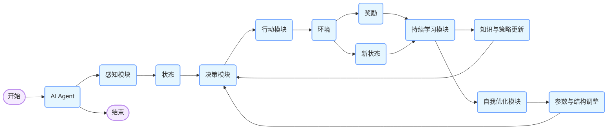

# AI Agent的持续学习与自我优化机制

> 关键词：AI Agent、持续学习、自我优化、强化学习、元学习、迁移学习、自适应机制

> 摘要：本文围绕AI Agent的持续学习与自我优化机制展开深入探讨。首先介绍了相关背景知识，包括目的范围、预期读者等。接着阐述了AI Agent、持续学习、自我优化等核心概念及其联系，通过文本示意图和Mermaid流程图进行清晰展示。详细讲解了核心算法原理，如强化学习、元学习等，并给出Python源代码示例。深入分析了相关数学模型和公式，结合具体例子进行说明。通过项目实战，展示了开发环境搭建、源代码实现与解读。探讨了AI Agent持续学习与自我优化机制在多个领域的实际应用场景。推荐了学习资源、开发工具框架以及相关论文著作。最后总结了未来发展趋势与挑战，并提供常见问题解答和扩展阅读参考资料，旨在全面深入地介绍AI Agent的持续学习与自我优化机制，为相关研究和实践提供有价值的参考。

## 1. 背景介绍 
### 1.1 目的和范围
在当今人工智能飞速发展的时代，AI Agent的应用越来越广泛，从智能客服到自动驾驶，从游戏对抗到工业自动化等各个领域都有AI Agent的身影。然而，现实世界是动态变化的，环境和任务也在不断演变。传统的AI模型往往是在固定的数据集上进行训练，一旦训练完成，其性能就相对固定，难以适应新的情况和变化。因此，研究AI Agent的持续学习与自我优化机制具有重要的现实意义。

本文的目的在于深入探讨AI Agent如何实现持续学习和自我优化，详细介绍相关的核心概念、算法原理、数学模型，并通过实际案例展示其应用。范围涵盖了AI Agent持续学习与自我优化的各个方面，包括不同的学习方法、优化策略、应用场景以及相关的工具和资源。

### 1.2 预期读者
本文预期读者包括人工智能领域的研究人员、开发者、学生以及对AI Agent技术感兴趣的技术爱好者。对于研究人员来说，本文可以提供新的研究思路和方法，帮助他们深入了解持续学习和自我优化机制的前沿进展；对于开发者而言，文中的代码示例和项目实战部分可以为他们在实际开发中提供参考和指导；对于学生，本文有助于他们系统地学习AI Agent相关知识，构建完整的知识体系；对于技术爱好者，本文可以帮助他们更好地理解AI Agent的工作原理和发展趋势。

### 1.3 文档结构概述
本文共分为十个部分。第一部分是背景介绍，阐述了研究的目的、范围、预期读者以及文档的整体结构。第二部分介绍核心概念与联系，详细解释AI Agent、持续学习、自我优化等核心概念，并通过示意图和流程图展示它们之间的关系。第三部分讲解核心算法原理和具体操作步骤，通过Python源代码详细阐述相关算法。第四部分分析数学模型和公式，并结合具体例子进行说明。第五部分是项目实战，包括开发环境搭建、源代码实现和代码解读。第六部分探讨实际应用场景。第七部分推荐相关的工具和资源，包括学习资源、开发工具框架和论文著作。第八部分总结未来发展趋势与挑战。第九部分是附录，提供常见问题与解答。第十部分是扩展阅读与参考资料，方便读者进一步深入学习。

### 1.4 术语表
#### 1.4.1 核心术语定义
- **AI Agent（人工智能智能体）**：是一种能够感知环境，根据感知信息进行决策，并采取行动以实现特定目标的智能实体。它可以是软件程序、机器人等不同形式。
- **持续学习（Continuous Learning）**：指AI Agent在其生命周期内，能够不断地从新的数据和经验中学习，以适应环境的变化和任务的需求，而不会忘记之前所学的知识。
- **自我优化（Self - Optimization）**：AI Agent通过自身的机制，自动调整和改进其内部参数、策略或结构，以提高其性能和效率。
- **强化学习（Reinforcement Learning）**：一种机器学习方法，智能体通过与环境进行交互，根据环境反馈的奖励信号来学习最优的行为策略。
- **元学习（Meta - Learning）**：也称为“学习如何学习”，旨在让模型快速适应新的任务，通过在多个任务上进行训练，学习到通用的学习策略和参数初始化方法。
- **迁移学习（Transfer Learning）**：将在一个任务或领域中学习到的知识和经验，迁移到另一个相关的任务或领域中，以加速新任务的学习过程。

#### 1.4.2 相关概念解释
- **环境（Environment）**：AI Agent所处的外部世界，它提供了智能体可以感知的信息，并对智能体的行动做出响应。
- **状态（State）**：描述环境在某一时刻的特征和情况，智能体根据当前状态来选择行动。
- **动作（Action）**：智能体在某一状态下采取的行为，不同的动作可能会导致环境状态的不同变化。
- **奖励（Reward）**：环境对智能体动作的反馈信号，用于衡量动作的好坏，智能体的目标是最大化长期累积奖励。

#### 1.4.3 缩略词列表
- **RL**：Reinforcement Learning（强化学习）
- **ML**：Machine Learning（机器学习）
- **DL**：Deep Learning（深度学习）
- **MAML**：Model - Agnostic Meta - Learning（模型无关元学习）

## 2. 核心概念与联系 

### 核心概念原理
#### AI Agent
AI Agent是人工智能系统的核心组成部分，它具有感知、决策和行动的能力。感知模块负责收集环境信息，例如通过传感器获取图像、声音、温度等数据；决策模块根据感知到的信息，运用一定的算法和策略进行分析和判断，选择合适的行动；行动模块则将决策结果转化为实际的行为，对环境产生影响。

#### 持续学习
持续学习的核心在于智能体能够在不断接收新数据的过程中，持续更新和改进自己的知识和技能。为了实现这一点，需要解决几个关键问题，如防止灾难性遗忘（Catastrophic Forgetting），即学习新任务时不会忘记之前学习的重要知识；以及如何有效地整合新老数据，使智能体能够不断进步。

#### 自我优化
自我优化是AI Agent根据自身的性能指标和目标，自动调整内部参数和结构的过程。它可以基于不同的优化目标，如提高准确率、降低计算成本、减少响应时间等。自我优化的方法包括基于梯度的优化算法（如随机梯度下降）、进化算法（如遗传算法）等。

### 架构的文本示意图
AI Agent的持续学习与自我优化机制的整体架构可以描述为：AI Agent通过感知模块与环境进行交互，获取当前状态信息。决策模块根据状态信息和内部的知识与策略，选择合适的行动。行动模块将行动作用于环境，环境返回奖励信号和新的状态。持续学习模块不断地从新的交互数据中学习，更新知识和策略。自我优化模块根据智能体的性能指标和学习结果，对内部参数和结构进行优化调整。

### Mermaid流程图


## 3. 核心算法原理 & 具体操作步骤 

### 强化学习原理
强化学习的目标是让智能体学习到一个最优的策略 $\pi$，使得在与环境的交互过程中，长期累积奖励最大化。智能体在每个时间步 $t$ 处于状态 $s_t$，选择动作 $a_t$，环境根据动作返回奖励 $r_{t + 1}$ 和新状态 $s_{t + 1}$。

#### Python源代码示例
```python
import numpy as np

# 定义环境
class Environment:
    def __init__(self):
        self.states = [0, 1, 2]  # 状态空间
        self.actions = [0, 1]  # 动作空间
        self.current_state = np.random.choice(self.states)  # 初始状态

    def step(self, action):
        # 根据动作更新状态和返回奖励
        if self.current_state == 0:
            if action == 0:
                self.current_state = 1
                reward = 1
            else:
                self.current_state = 2
                reward = -1
        elif self.current_state == 1:
            if action == 0:
                self.current_state = 2
                reward = -1
            else:
                self.current_state = 0
                reward = 1
        else:
            if action == 0:
                self.current_state = 0
                reward = 1
            else:
                self.current_state = 1
                reward = -1
        return self.current_state, reward

# 定义智能体
class Agent:
    def __init__(self, states, actions):
        self.states = states
        self.actions = actions
        self.q_table = np.zeros((len(states), len(actions)))  # Q表
        self.learning_rate = 0.1  # 学习率
        self.discount_factor = 0.9  # 折扣因子
        self.epsilon = 0.1  # 探索率

    def choose_action(self, state):
        if np.random.uniform(0, 1) < self.epsilon:
            # 探索：随机选择动作
            action = np.random.choice(self.actions)
        else:
            # 利用：选择Q值最大的动作
            action = np.argmax(self.q_table[state])
        return action

    def update_q_table(self, state, action, reward, next_state):
        # 更新Q表
        max_q_next = np.max(self.q_table[next_state])
        self.q_table[state, action] += self.learning_rate * (reward + self.discount_factor * max_q_next - self.q_table[state, action])

# 训练过程
env = Environment()
agent = Agent(env.states, env.actions)
num_episodes = 1000
for episode in range(num_episodes):
    state = env.current_state
    done = False
    while not done:
        action = agent.choose_action(state)
        next_state, reward = env.step(action)
        agent.update_q_table(state, action, reward, next_state)
        state = next_state
        if state == 2:
            done = True
```

### 元学习原理
元学习的核心思想是学习一个通用的学习策略，使得智能体能够快速适应新的任务。以模型无关元学习（MAML）为例，它通过在多个任务上进行训练，找到一个合适的参数初始化点，使得在新任务上进行少量的梯度更新就能取得较好的性能。

#### Python源代码示例（简化版）
```python
import torch
import torch.nn as nn
import torch.optim as optim

# 定义一个简单的神经网络模型
class SimpleNet(nn.Module):
    def __init__(self):
        super(SimpleNet, self).__init__()
        self.fc1 = nn.Linear(10, 20)
        self.fc2 = nn.Linear(20, 1)

    def forward(self, x):
        x = torch.relu(self.fc1(x))
        x = self.fc2(x)
        return x

# 元训练过程
meta_model = SimpleNet()
meta_optimizer = optim.Adam(meta_model.parameters(), lr=0.001)
num_tasks = 10
num_inner_updates = 5
inner_lr = 0.01

for task in range(num_tasks):
    # 复制元模型参数
    task_model = SimpleNet()
    task_model.load_state_dict(meta_model.state_dict())
    task_optimizer = optim.SGD(task_model.parameters(), lr=inner_lr)

    # 内循环更新
    for inner_update in range(num_inner_updates):
        # 生成任务数据
        inputs = torch.randn(10, 10)
        targets = torch.randn(10, 1)
        outputs = task_model(inputs)
        loss = nn.MSELoss()(outputs, targets)
        task_optimizer.zero_grad()
        loss.backward()
        task_optimizer.step()

    # 外循环更新元模型
    meta_inputs = torch.randn(10, 10)
    meta_targets = torch.randn(10, 1)
    meta_outputs = task_model(meta_inputs)
    meta_loss = nn.MSELoss()(meta_outputs, meta_targets)
    meta_optimizer.zero_grad()
    meta_loss.backward()
    meta_optimizer.step()
```

### 迁移学习原理
迁移学习是将在源任务上学习到的知识迁移到目标任务上。常见的方法包括特征迁移、模型参数迁移等。例如，在图像分类任务中，可以使用预训练的卷积神经网络（如ResNet），将其特征提取层的参数迁移到新的图像分类任务中，只需要对分类层进行微调。

#### Python源代码示例（使用PyTorch的预训练模型）
```python
import torch
import torch.nn as nn
import torch.optim as optim
import torchvision.models as models

# 加载预训练的ResNet模型
resnet = models.resnet18(pretrained=True)

# 冻结特征提取层的参数
for param in resnet.parameters():
    param.requires_grad = False

# 修改分类层
num_ftrs = resnet.fc.in_features
resnet.fc = nn.Linear(num_ftrs, 10)  # 假设新任务有10个类别

# 定义损失函数和优化器
criterion = nn.CrossEntropyLoss()
optimizer = optim.SGD(resnet.fc.parameters(), lr=0.001, momentum=0.9)

# 训练过程
# 这里省略了数据加载和训练循环的具体代码
```

## 4. 数学模型和公式 & 详细讲解 & 举例说明 

### 强化学习数学模型
#### 马尔可夫决策过程（MDP）
马尔可夫决策过程是强化学习的基础数学模型，它由一个五元组 $\langle S, A, P, R, \gamma \rangle$ 组成，其中：
- $S$ 是有限的状态集合。
- $A$ 是有限的动作集合。
- $P: S \times A \times S \rightarrow [0, 1]$ 是状态转移概率函数，$P(s'|s, a)$ 表示在状态 $s$ 执行动作 $a$ 后转移到状态 $s'$ 的概率。
- $R: S \times A \rightarrow \mathbb{R}$ 是奖励函数，$R(s, a)$ 表示在状态 $s$ 执行动作 $a$ 所获得的即时奖励。
- $\gamma \in [0, 1]$ 是折扣因子，用于权衡即时奖励和未来奖励。

#### 价值函数
- **状态价值函数**：$v_{\pi}(s) = \mathbb{E}_{\pi}[G_t|S_t = s]$，其中 $G_t = \sum_{k = 0}^{\infty} \gamma^k R_{t + k + 1}$ 是从时间步 $t$ 开始的长期累积奖励，$\pi$ 是策略。
- **动作价值函数**：$q_{\pi}(s, a) = \mathbb{E}_{\pi}[G_t|S_t = s, A_t = a]$

#### 贝尔曼方程
- **状态价值函数的贝尔曼方程**：$v_{\pi}(s) = \sum_{a \in A} \pi(a|s) \sum_{s' \in S} P(s'|s, a) [R(s, a) + \gamma v_{\pi}(s')]$
- **动作价值函数的贝尔曼方程**：$q_{\pi}(s, a) = \sum_{s' \in S} P(s'|s, a) [R(s, a) + \gamma \sum_{a' \in A} \pi(a'|s') q_{\pi}(s', a')]$

#### 举例说明
假设有一个简单的网格世界环境，智能体在一个 $3 \times 3$ 的网格中移动，目标是到达右上角的网格。状态 $s$ 表示智能体在网格中的位置，动作 $a$ 包括上下左右移动。当智能体到达目标网格时，获得奖励 $+1$，其他情况下奖励为 $0$。折扣因子 $\gamma = 0.9$。

### 元学习数学模型
#### 模型无关元学习（MAML）
MAML的目标是找到一个初始参数 $\theta$，使得在新任务上进行少量的梯度更新后，能够快速收敛到较好的性能。设 $L(\theta, \mathcal{T})$ 是在任务 $\mathcal{T}$ 上的损失函数，内循环的更新公式为：
$\theta' = \theta - \alpha \nabla_{\theta}