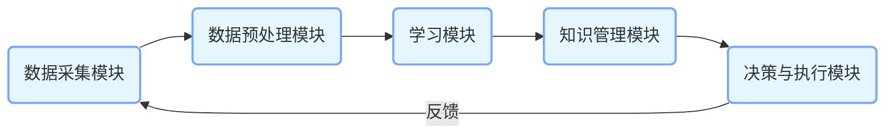

# AI Agent的持续学习：保持知识更新

> 关键词：AI Agent、持续学习、知识更新、机器学习、强化学习、迁移学习、终身学习

> 摘要：本文聚焦于AI Agent的持续学习，旨在深入探讨如何使AI Agent保持知识更新。首先介绍了AI Agent持续学习的背景，包括目的、预期读者等内容。接着阐述了核心概念与联系，通过文本示意图和Mermaid流程图展示其原理和架构。详细讲解了核心算法原理和具体操作步骤，并给出Python源代码。从数学模型和公式的角度对相关理论进行了剖析，并举例说明。通过项目实战展示了代码实际案例及详细解释。探讨了AI Agent持续学习的实际应用场景，推荐了相关的工具和资源。最后总结了未来发展趋势与挑战，提供了常见问题与解答及扩展阅读参考资料，全面呈现了AI Agent持续学习这一重要领域的知识体系。

## 1. 背景介绍 
### 1.1 目的和范围
在当今快速发展的信息时代，知识和环境都在不断变化。AI Agent作为人工智能领域中模拟人类智能行为的程序实体，若要在复杂多变的现实场景中持续发挥作用，就必须具备持续学习和更新知识的能力。本文的目的在于系统地研究AI Agent持续学习的相关理论、技术和方法，探讨如何使AI Agent能够不断适应新的数据、新的任务和新的环境，从而保持其性能的有效性和适应性。

本文的范围涵盖了AI Agent持续学习的核心概念、算法原理、数学模型、实际应用以及相关的工具和资源等方面。通过全面深入的研究，为研究人员、开发者和从业者提供一个关于AI Agent持续学习的完整知识体系和实践指导。

### 1.2 预期读者
本文的预期读者包括但不限于以下几类人群：
- **人工智能研究人员**：希望深入了解AI Agent持续学习的最新理论和技术，为其研究工作提供新的思路和方法。
- **机器学习开发者**：需要掌握AI Agent持续学习的算法和实现技巧，以便在实际项目中应用这些技术。
- **软件工程师**：对AI Agent在软件系统中的应用感兴趣，想要了解如何实现AI Agent的持续学习功能。
- **相关专业的学生**：作为学习人工智能和机器学习的参考资料，帮助他们系统地掌握AI Agent持续学习的知识。

### 1.3 文档结构概述
本文将按照以下结构进行组织：
- **核心概念与联系**：介绍AI Agent持续学习的核心概念、原理和架构，通过文本示意图和Mermaid流程图进行直观展示。
- **核心算法原理 & 具体操作步骤**：详细讲解AI Agent持续学习的核心算法原理，并给出Python源代码进行具体实现。
- **数学模型和公式 & 详细讲解 & 举例说明**：从数学模型和公式的角度对AI Agent持续学习进行深入分析，并通过具体例子进行说明。
- **项目实战：代码实际案例和详细解释说明**：通过一个实际项目案例，展示AI Agent持续学习的代码实现过程，并对代码进行详细解读。
- **实际应用场景**：探讨AI Agent持续学习在不同领域的实际应用场景。
- **工具和资源推荐**：推荐相关的学习资源、开发工具框架和论文著作。
- **总结：未来发展趋势与挑战**：总结AI Agent持续学习的未来发展趋势和面临的挑战。
- **附录：常见问题与解答**：提供常见问题的解答，帮助读者更好地理解和应用AI Agent持续学习技术。
- **扩展阅读 & 参考资料**：列出相关的扩展阅读资料和参考书目，方便读者进一步深入学习。

### 1.4 术语表
#### 1.4.1 核心术语定义
- **AI Agent（人工智能代理）**：是指能够感知环境、做出决策并采取行动的人工智能程序实体。它可以是虚拟的软件程序，也可以是物理机器人。
- **持续学习（Continuous Learning）**：指AI Agent在其生命周期内不断从新的数据中学习，以更新和扩展其知识和技能，从而适应不断变化的环境和任务。
- **知识更新（Knowledge Update）**：指AI Agent对其已有的知识进行修改、补充和完善，以反映新的信息和情况。

#### 1.4.2 相关概念解释
- **机器学习（Machine Learning）**：是一门多领域交叉学科，涉及概率论、统计学、逼近论、凸分析、算法复杂度理论等多门学科。它专门研究计算机怎样模拟或实现人类的学习行为，以获取新的知识或技能，重新组织已有的知识结构使之不断改善自身的性能。
- **强化学习（Reinforcement Learning）**：是机器学习中的一个领域，强调智能体（Agent）如何在环境中采取一系列行动，以最大化累积奖励。强化学习通过试错的方式，让智能体在与环境的交互中学习最优策略。
- **迁移学习（Transfer Learning）**：是一种机器学习技术，它允许模型将在一个任务上学习到的知识迁移到另一个相关的任务上。通过迁移学习，可以减少在新任务上的训练时间和数据需求。

#### 1.4.3 缩略词列表
- **ML（Machine Learning）**：机器学习
- **RL（Reinforcement Learning）**：强化学习
- **TL（Transfer Learning）**：迁移学习

## 2. 核心概念与联系 
### 核心概念原理
AI Agent的持续学习是一个复杂的过程，其核心原理在于使AI Agent能够不断地从新的数据中提取有用的信息，并将这些信息融入到已有的知识体系中，从而实现知识的更新和技能的提升。

AI Agent的持续学习主要基于以下几个方面的原理：
- **数据驱动**：新的数据是AI Agent持续学习的基础。通过不断收集和分析新的数据，AI Agent可以发现新的模式、规律和趋势，从而更新其知识和模型。
- **模型更新**：AI Agent使用机器学习和深度学习等技术构建模型。在持续学习过程中，这些模型需要不断地进行更新和优化，以适应新的数据和任务。
- **知识融合**：将新学习到的知识与已有的知识进行融合，是AI Agent持续学习的关键。通过知识融合，可以避免知识的遗忘和冲突，提高AI Agent的性能和适应性。

### 架构的文本示意图
AI Agent持续学习的架构主要包括以下几个部分：
- **数据采集模块**：负责收集新的数据，包括传感器数据、用户反馈数据、网络数据等。
- **数据预处理模块**：对采集到的数据进行清洗、转换和特征提取等预处理操作，以提高数据的质量和可用性。
- **学习模块**：使用机器学习和深度学习等算法对预处理后的数据进行学习，更新AI Agent的模型和知识。
- **知识管理模块**：负责管理AI Agent的知识，包括知识的存储、检索和融合等操作。
- **决策与执行模块**：根据学习到的知识和模型，AI Agent做出决策并采取相应的行动。

### Mermaid流程图

这个流程图展示了AI Agent持续学习的整个过程。数据采集模块收集新的数据，经过数据预处理模块处理后，进入学习模块进行学习。学习得到的知识存储在知识管理模块中，决策与执行模块根据这些知识做出决策并采取行动。行动的结果又会反馈给数据采集模块，形成一个闭环的持续学习过程。

## 3. 核心算法原理 & 具体操作步骤 
### 核心算法原理
AI Agent持续学习涉及多种算法，以下介绍几种常见的算法：
- **增量学习算法**：增量学习是一种在新数据到来时，能够在原有模型的基础上进行更新，而不需要重新训练整个模型的学习方法。常见的增量学习算法包括增量决策树、增量支持向量机等。
- **在线学习算法**：在线学习是指模型在接收到每个新的数据样本后立即进行更新的学习方法。在线学习算法可以实时地适应数据的变化，适用于数据不断流进的场景。常见的在线学习算法包括随机梯度下降（SGD）等。
- **元学习算法**：元学习是一种学习如何学习的算法，它的目标是让模型能够快速适应新的任务。元学习通过在多个任务上进行训练，学习到一种通用的学习策略，使得模型在面对新任务时能够快速收敛。

### 具体操作步骤
以下以增量学习为例，介绍AI Agent持续学习的具体操作步骤：
1. **初始化模型**：选择合适的机器学习模型，并使用初始数据对模型进行训练，得到初始模型。
2. **数据采集**：不断收集新的数据。
3. **数据预处理**：对新采集到的数据进行预处理，包括数据清洗、特征提取等操作。
4. **增量更新模型**：使用增量学习算法，将新的数据与原有模型进行融合，更新模型的参数。
5. **评估模型**：使用评估指标对更新后的模型进行评估，检查模型的性能是否有所提升。
6. **重复步骤2 - 5**：不断重复上述步骤，直到满足停止条件。

### Python源代码实现
以下是一个使用增量学习算法进行持续学习的Python示例代码：
```python
import numpy as np
from sklearn.linear_model import SGDRegressor

# 初始化模型
model = SGDRegressor()

# 初始数据
X_train = np.array([[1], [2], [3], [4], [5]])
y_train = np.array([2, 4, 6, 8, 10])

# 训练初始模型
model.fit(X_train, y_train)

# 模拟新数据
new_X = np.array([[6], [7], [8]])
new_y = np.array([12, 14, 16])

# 增量更新模型
model.partial_fit(new_X, new_y)

# 预测新数据
new_pred = model.predict(new_X)
print("预测结果:", new_pred)
```
在这个示例中，我们首先使用`SGDRegressor`初始化一个线性回归模型，并使用初始数据进行训练。然后，我们模拟了新的数据，并使用`partial_fit`方法对模型进行增量更新。最后，我们使用更新后的模型对新数据进行预测，并输出预测结果。

## 4. 数学模型和公式 & 详细讲解 & 举例说明 
### 数学模型和公式
#### 增量学习的数学模型
增量学习的目标是在新数据到来时，能够在原有模型的基础上进行更新，使得模型能够更好地拟合新数据和原有数据。假设原有模型的参数为 $\theta_{old}$，新数据为 $(X_{new}, y_{new})$，则增量学习的目标是找到一个新的参数 $\theta_{new}$，使得损失函数 $L(\theta_{new}, X_{new}, y_{new})$ 最小化，同时尽可能保持与原有模型的一致性。

常见的增量学习损失函数可以表示为：
$$
L(\theta_{new}) = \lambda_1 L_{new}(\theta_{new}, X_{new}, y_{new}) + \lambda_2 L_{old}(\theta_{new}, X_{old}, y_{old})
$$
其中，$L_{new}(\theta_{new}, X_{new}, y_{new})$ 是新数据的损失函数，$L_{old}(\theta_{new}, X_{old}, y_{old})$ 是原有数据的损失函数，$\lambda_1$ 和 $\lambda_2$ 是权重系数，用于平衡新数据和原有数据的影响。

#### 在线学习的数学模型
在线学习的数学模型通常基于随机梯度下降（SGD）算法。假设损失函数为 $L(\theta, x, y)$，其中 $\theta$ 是模型的参数，$(x, y)$ 是一个数据样本。在线学习的目标是在每个新数据样本到来时，更新模型的参数 $\theta$，使得损失函数 $L(\theta, x, y)$ 最小化。

随机梯度下降的更新公式为：
$$
\theta_{t+1} = \theta_t - \eta \nabla L(\theta_t, x_t, y_t)
$$
其中，$\theta_t$ 是第 $t$ 次迭代的模型参数，$\eta$ 是学习率，$\nabla L(\theta_t, x_t, y_t)$ 是损失函数关于 $\theta_t$ 的梯度。

### 详细讲解
#### 增量学习的详细讲解
增量学习的核心思想是在原有模型的基础上进行更新，避免重新训练整个模型带来的计算开销。通过调整权重系数 $\lambda_1$ 和 $\lambda_2$，可以平衡新数据和原有数据的影响。如果 $\lambda_1$ 较大，则模型更注重新数据的拟合；如果 $\lambda_2$ 较大，则模型更注重保持与原有模型的一致性。

#### 在线学习的详细讲解
在线学习的优点是可以实时地适应数据的变化，适用于数据不断流进的场景。随机梯度下降算法通过每次只使用一个数据样本进行更新，减少了计算开销。学习率 $\eta$ 控制了每次更新的步长，如果学习率过大，模型可能会收敛不稳定；如果学习率过小，模型的收敛速度会很慢。

### 举例说明
#### 增量学习举例
假设我们有一个线性回归模型 $y = \theta_0 + \theta_1 x$，初始数据为 $(x_1, y_1), (x_2, y_2), \cdots, (x_n, y_n)$，我们已经使用这些数据训练得到了模型的参数 $\theta_{old}$。现在有新的数据 $(x_{n+1}, y_{n+1}), (x_{n+2}, y_{n+2}), \cdots, (x_{n+m}, y_{n+m})$ 到来，我们可以使用增量学习算法更新模型的参数。

首先，定义新数据的损失函数 $L_{new}(\theta, X_{new}, y_{new})$ 和原有数据的损失函数 $L_{old}(\theta, X_{old}, y_{old})$，然后根据上述增量学习的损失函数公式计算新的参数 $\theta_{new}$。

#### 在线学习举例
假设我们有一个二分类问题，使用逻辑回归模型进行预测。损失函数为交叉熵损失函数：
$$
L(\theta, x, y) = -y \log(p) - (1 - y) \log(1 - p)
$$
其中，$p = \frac{1}{1 + e^{-\theta^T x}}$ 是模型的预测概率。

每次有新的数据样本 $(x_t, y_t)$ 到来时，我们根据随机梯度下降的更新公式更新模型的参数 $\theta$，直到所有的数据样本都处理完毕。

## 5. 项目实战：代码实际案例和详细解释说明 
### 5.1  开发环境搭建
在进行AI Agent持续学习的项目实战之前，需要搭建相应的开发环境。以下是具体的搭建步骤：
1. **安装Python**：推荐使用Python 3.6及以上版本。可以从Python官方网站（https://www.python.org/downloads/）下载并安装Python。
2. **安装必要的库**：使用`pip`命令安装以下必要的库：
    - `numpy`：用于数值计算。
    - `pandas`：用于数据处理和分析。
    - `scikit-learn`：用于机器学习算法的实现。
    - `tensorflow`或`pytorch`：用于深度学习算法的实现。

以下是安装这些库的命令：
```sh
pip install numpy pandas scikit-learn tensorflow
```

### 5.2  源代码详细实现和代码解读
以下是一个基于增量学习的AI Agent持续学习的项目实战案例，我们将使用`scikit-learn`库中的`SGDClassifier`进行二分类任务的持续学习。

```python
import numpy as np
from sklearn.linear_model import SGDClassifier
from sklearn.datasets import make_classification
from sklearn.model_selection import train_test_split

# 生成初始数据
X, y = make_classification(n_samples=1000, n_features=20, n_informative=10, n_redundant=5, random_state=42)
X_train, X_test, y_train, y_test = train_test_split(X, y, test_size=0.2, random_state=42)

# 初始化模型
model = SGDClassifier()

# 训练初始模型
model.fit(X_train, y_train)

# 评估初始模型
initial_score = model.score(X_test, y_test)
print("初始模型准确率:", initial_score)

# 模拟新数据
new_X, new_y = make_classification(n_samples=200, n_features=20, n_informative=10, n_redundant=5, random_state=43)

# 增量更新模型
model.partial_fit(new_X, new_y)

# 评估更新后的模型
updated_score = model.score(X_test, y_test)
print("更新后模型准确率:", updated_score)
```

### 5.3  代码解读与分析
1. **数据生成**：使用`make_classification`函数生成初始数据，并使用`train_test_split`函数将数据分为训练集和测试集。
2. **模型初始化**：使用`SGDClassifier`初始化一个二分类模型。
3. **初始模型训练**：使用`fit`方法对初始数据进行训练，得到初始模型。
4. **初始模型评估**：使用`score`方法评估初始模型在测试集上的准确率。
5. **新数据生成**：使用`make_classification`函数生成新的数据。
6. **模型增量更新**：使用`partial_fit`方法对新数据进行增量更新，更新模型的参数。
7. **更新后模型评估**：使用`score`方法评估更新后模型在测试集上的