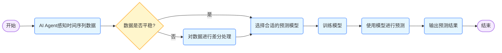

# AI Agent的时序预测：理解和预测时间序列

> 关键词：AI Agent、时序预测、时间序列、机器学习、深度学习

> 摘要：本文深入探讨了AI Agent在时序预测中的应用。首先介绍了相关背景知识，包括目的、预期读者、文档结构和术语表。接着阐述了核心概念与联系，分析了核心算法原理并给出Python代码示例，同时讲解了数学模型和公式。通过项目实战，详细展示了代码的实现和解读。探讨了实际应用场景，推荐了学习资源、开发工具框架和相关论文著作。最后总结了未来发展趋势与挑战，并提供了常见问题解答和扩展阅读参考资料，旨在帮助读者全面理解和掌握AI Agent进行时序预测的技术。

## 1. 背景介绍 
### 1.1 目的和范围
在当今的各个领域，如金融、气象、医疗等，时间序列数据无处不在。准确地理解和预测时间序列数据对于决策制定、资源分配和风险评估等方面具有至关重要的意义。AI Agent作为一种智能体，能够自主地感知环境、做出决策并采取行动，将其应用于时序预测中，可以充分发挥其智能决策和自适应学习的能力，提高预测的准确性和效率。

本文的范围涵盖了AI Agent进行时序预测的基本概念、核心算法、数学模型、实际应用案例以及相关的工具和资源推荐等方面。通过本文的学习，读者将能够深入理解AI Agent在时序预测中的工作原理和实现方法，并能够将其应用到实际项目中。

### 1.2 预期读者
本文主要面向对人工智能、机器学习和时间序列分析感兴趣的专业人士，包括数据科学家、机器学习工程师、软件开发者等。同时，也适合对相关领域有一定了解，希望进一步深入学习和应用AI Agent进行时序预测的研究人员和学生。

### 1.3 文档结构概述
本文将按照以下结构进行组织：
1. 背景介绍：介绍文章的目的、预期读者、文档结构和术语表。
2. 核心概念与联系：阐述AI Agent、时序预测和时间序列的核心概念，以及它们之间的联系，并给出相应的文本示意图和Mermaid流程图。
3. 核心算法原理 & 具体操作步骤：详细讲解常用的时序预测算法原理，并使用Python源代码进行详细阐述。
4. 数学模型和公式 & 详细讲解 & 举例说明：介绍时序预测中的数学模型和公式，并通过具体例子进行详细讲解。
5. 项目实战：代码实际案例和详细解释说明：通过一个实际的项目案例，展示如何使用AI Agent进行时序预测，包括开发环境搭建、源代码实现和代码解读。
6. 实际应用场景：探讨AI Agent在不同领域的时序预测应用场景。
7. 工具和资源推荐：推荐学习资源、开发工具框架和相关论文著作。
8. 总结：未来发展趋势与挑战：总结AI Agent在时序预测中的发展趋势和面临的挑战。
9. 附录：常见问题与解答：解答读者在学习和应用过程中常见的问题。
10. 扩展阅读 & 参考资料：提供扩展阅读的建议和相关参考资料。

### 1.4 术语表
#### 1.4.1 核心术语定义
- **AI Agent（人工智能智能体）**：是一种能够感知环境、做出决策并采取行动的智能实体，它可以自主地与环境进行交互，以实现特定的目标。
- **时序预测（Time Series Forecasting）**：是指根据过去的时间序列数据，预测未来一段时间内的数值或趋势。
- **时间序列（Time Series）**：是指按照时间顺序排列的一组数据点，每个数据点对应一个特定的时间戳。

#### 1.4.2 相关概念解释
- **平稳时间序列（Stationary Time Series）**：是指时间序列的统计特性（如均值、方差等）不随时间的推移而发生变化的时间序列。
- **非平稳时间序列（Non-stationary Time Series）**：是指时间序列的统计特性随时间的推移而发生变化的时间序列。
- **自回归模型（Autoregressive Model，AR）**：是一种基于过去的观测值来预测未来值的统计模型，它假设当前值与过去的若干个值之间存在线性关系。
- **移动平均模型（Moving Average Model，MA）**：是一种基于过去的误差项来预测未来值的统计模型，它假设当前值与过去的若干个误差项之间存在线性关系。
- **自回归移动平均模型（Autoregressive Moving Average Model，ARMA）**：是自回归模型和移动平均模型的组合，它同时考虑了过去的观测值和误差项对当前值的影响。
- **自回归积分滑动平均模型（Autoregressive Integrated Moving Average Model，ARIMA）**：是在ARMA模型的基础上，对非平稳时间序列进行差分处理，使其变为平稳时间序列后再进行建模的模型。

#### 1.4.3 缩略词列表
- **AI**：Artificial Intelligence（人工智能）
- **AR**：Autoregressive（自回归）
- **MA**：Moving Average（移动平均）
- **ARMA**：Autoregressive Moving Average（自回归移动平均）
- **ARIMA**：Autoregressive Integrated Moving Average（自回归积分滑动平均）

## 2. 核心概念与联系 

### 核心概念原理
#### AI Agent
AI Agent是一种具有智能决策能力的实体，它可以通过感知环境中的信息，运用一定的算法和策略进行决策，并采取相应的行动。在时序预测中，AI Agent可以根据历史时间序列数据，学习数据的特征和规律，然后预测未来的时间序列值。

#### 时序预测
时序预测的核心目标是根据过去的时间序列数据，对未来的数值或趋势进行预测。为了实现这一目标，需要对时间序列数据进行分析和建模，找出数据中的规律和模式。常用的时序预测方法包括统计模型（如AR、MA、ARMA、ARIMA等）和机器学习模型（如神经网络、支持向量机等）。

#### 时间序列
时间序列是按照时间顺序排列的一组数据点，它可以是连续的（如温度、股票价格等）或离散的（如每日销售量、每月用电量等）。时间序列数据通常具有趋势性、季节性和周期性等特征，这些特征对时序预测的准确性有着重要的影响。

### 架构的文本示意图
```plaintext
           +-----------------+
           |   AI Agent      |
           +-----------------+
           | - 感知环境信息 |
           | - 学习数据规律 |
           | - 做出预测决策 |
           +-----------------+
                  |
                  v
           +-----------------+
           |  时间序列数据   |
           +-----------------+
           | - 历史数据输入 |
           | - 未来数据预测 |
           +-----------------+
```

### Mermaid流程图


## 3. 核心算法原理 & 具体操作步骤 

### 自回归模型（AR）
#### 原理
自回归模型假设当前值 $y_t$ 与过去的 $p$ 个值 $y_{t-1}, y_{t-2}, \cdots, y_{t-p}$ 之间存在线性关系，其数学表达式为：

$$y_t = c + \sum_{i=1}^{p} \varphi_i y_{t-i} + \epsilon_t$$

其中，$c$ 是常数项，$\varphi_i$ 是自回归系数，$\epsilon_t$ 是白噪声。

#### Python代码实现
```python
import numpy as np
import pandas as pd
from statsmodels.tsa.ar_model import AutoReg
import matplotlib.pyplot as plt

# 生成示例时间序列数据
np.random.seed(0)
n = 100
data = np.random.randn(n).cumsum()

# 划分训练集和测试集
train_size = int(0.8 * n)
train_data = data[:train_size]
test_data = data[train_size:]

# 拟合AR模型
p = 2  # 自回归阶数
model = AutoReg(train_data, lags=p)
model_fit = model.fit()

# 进行预测
predictions = model_fit.predict(start=len(train_data), end=len(train_data)+len(test_data)-1, dynamic=False)

# 绘制结果
plt.plot(test_data, label='Actual')
plt.plot(predictions, label='Predicted')
plt.legend()
plt.show()
```

### 移动平均模型（MA）
#### 原理
移动平均模型假设当前值 $y_t$ 与过去的 $q$ 个误差项 $\epsilon_{t-1}, \epsilon_{t-2}, \cdots, \epsilon_{t-q}$ 之间存在线性关系，其数学表达式为：

$$y_t = \mu + \epsilon_t + \sum_{i=1}^{q} \theta_i \epsilon_{t-i}$$

其中，$\mu$ 是均值，$\theta_i$ 是移动平均系数，$\epsilon_t$ 是白噪声。

#### Python代码实现
```python
from statsmodels.tsa.arima.model import ARIMA

# 拟合MA模型
q = 2  # 移动平均阶数
model = ARIMA(train_data, order=(0, 0, q))
model_fit = model.fit()

# 进行预测
predictions = model_fit.predict(start=len(train_data), end=len(train_data)+len(test_data)-1, dynamic=False)

# 绘制结果
plt.plot(test_data, label='Actual')
plt.plot(predictions, label='Predicted')
plt.legend()
plt.show()
```

### 自回归移动平均模型（ARMA）
#### 原理
自回归移动平均模型是自回归模型和移动平均模型的组合，它同时考虑了过去的观测值和误差项对当前值的影响，其数学表达式为：

$$y_t = c + \sum_{i=1}^{p} \varphi_i y_{t-i} + \epsilon_t + \sum_{i=1}^{q} \theta_i \epsilon_{t-i}$$

其中，$c$ 是常数项，$\varphi_i$ 是自回归系数，$\theta_i$ 是移动平均系数，$\epsilon_t$ 是白噪声。

#### Python代码实现
```python
# 拟合ARMA模型
p = 2  # 自回归阶数
q = 2  # 移动平均阶数
model = ARIMA(train_data, order=(p, 0, q))
model_fit = model.fit()

# 进行预测
predictions = model_fit.predict(start=len(train_data), end=len(train_data)+len(test_data)-1, dynamic=False)

# 绘制结果
plt.plot(test_data, label='Actual')
plt.plot(predictions, label='Predicted')
plt.legend()
plt.show()
```

### 自回归积分滑动平均模型（ARIMA）
#### 原理
自回归积分滑动平均模型是在ARMA模型的基础上，对非平稳时间序列进行差分处理，使其变为平稳时间序列后再进行建模。其数学表达式为：

$$\Delta^d y_t = c + \sum_{i=1}^{p} \varphi_i \Delta^d y_{t-i} + \epsilon_t + \sum_{i=1}^{q} \theta_i \epsilon_{t-i}$$

其中，$\Delta^d$ 表示 $d$ 阶差分，$c$ 是常数项，$\varphi_i$ 是自回归系数，$\theta_i$ 是移动平均系数，$\epsilon_t$ 是白噪声。

#### Python代码实现
```python
# 拟合ARIMA模型
p = 2  # 自回归阶数
d = 1  # 差分阶数
q = 2  # 移动平均阶数
model = ARIMA(train_data, order=(p, d, q))
model_fit = model.fit()

# 进行预测
predictions = model_fit.predict(start=len(train_data), end=len(train_data)+len(test_data)-1, dynamic=False)

# 绘制结果
plt.plot(test_data, label='Actual')
plt.plot(predictions, label='Predicted')
plt.legend()
plt.show()
```

## 4. 数学模型和公式 & 详细讲解 & 举例说明 

### 自回归模型（AR）
#### 数学公式
$$y_t = c + \sum_{i=1}^{p} \varphi_i y_{t-i} + \epsilon_t$$

#### 详细讲解
- $y_t$ 是时间序列在时刻 $t$ 的值。
- $c$ 是常数项，它表示时间序列的长期平均值。
- $\varphi_i$ 是自回归系数，它表示过去第 $i$ 个值对当前值的影响程度。
- $\epsilon_t$ 是白噪声，它表示无法用过去的观测值解释的随机误差。

#### 举例说明
假设我们有一个时间序列 $y = [1, 2, 3, 4, 5]$，我们使用 $p = 2$ 的自回归模型进行预测。则模型的表达式为：

$$y_t = c + \varphi_1 y_{t-1} + \varphi_2 y_{t-2} + \epsilon_t$$

我们可以使用最小二乘法来估计模型的参数 $c, \varphi_1, \varphi_2$。假设估计得到的参数为 $c = 0, \varphi_1 = 0.5, \varphi_2 = 0.3$，则预测 $y_6$ 的值为：

$$y_6 = 0 + 0.5 \times 5 + 0.3 \times 4 + \epsilon_6 = 2.5 + 1.2 + \epsilon_6 = 3.7 + \epsilon_6$$

### 移动平均模型（MA）
#### 数学公式
$$y_t = \mu + \epsilon_t + \sum_{i=1}^{q} \theta_i \epsilon_{t-i}$$

#### 详细讲解
- $y_t$ 是时间序列在时刻 $t$ 的值。
- $\mu$ 是均值，它表示时间序列的长期平均值。
- $\theta_i$ 是移动平均系数，它表示过去第 $i$ 个误差项对当前值的影响程度。
- $\epsilon_t$ 是白噪声，它表示无法用过去的误差项解释的随机误差。

#### 举例说明
假设我们有一个时间序列 $y = [1, 2, 3, 4, 5]$，我们使用 $q = 2$ 的移动平均模型进行预测。则模型的表达式为：

$$y_t = \mu + \epsilon_t + \theta_1 \epsilon_{t-1} + \theta_2 \epsilon_{t-2}$$

我们可以使用最大似然估计法来估计模型的参数 $\mu, \theta_1, \theta_2$。假设估计得到的参数为 $\mu = 3, \theta_1 = 0.4, \theta_2 = 0.2$，则预测 $y_6$ 的值为：

$$y_6 = 3 + \epsilon_6 + 0.4 \times \epsilon_5 + 0.2 \times \epsilon_4$$

### 自回归移动平均模型（ARMA）
#### 数学公式
$$y_t = c + \sum_{i=1}^{p} \varphi_i y_{t-i} + \epsilon_t + \sum_{i=1}^{q} \theta_i \epsilon_{t-i}$$

#### 详细讲解
ARMA模型结合了自回归模型和移动平均模型的特点，它既考虑了过去的观测值对当前值的影响，又考虑了过去的误差项对当前值的影响。

#### 举例说明
假设我们有一个时间序列 $y = [1, 2, 3, 4, 5]$，我们使用 $p = 2, q = 2$ 的ARMA模型进行预测。则模型的表达式为：

$$y_t = c + \varphi_1 y_{t-1} + \varphi_2 y_{t-2} + \epsilon_t + \theta_1 \epsilon_{t-1} + \theta_2 \epsilon_{t-2}$$

我们可以使用最大似然估计法来估计模型的参数 $c, \varphi_1, \varphi_2, \theta_1, \theta_2$。假设估计得到的参数为 $c = 0, \varphi_1 = 0.5, \varphi_2 = 0.3, \theta_1 = 0.4, \theta_2 = 0.2$，则预测 $y_6$ 的值为：

$$y_6 = 0 + 0.5 \times 5 + 0.3 \times 4 + \epsilon_6 + 0.4 \times \epsilon_5 + 0.2 \times \epsilon_4 = 3.7 + \epsilon_6 + 0.4 \times \epsilon_5 + 0.2 \times \epsilon_4$$

### 自回归积分滑动平均模型（ARIMA）
#### 数学公式
$$\Delta^d y_t = c + \sum_{i=1}^{p} \varphi_i \Delta^d y_{t-i} + \epsilon_t + \sum_{i=1}^{q} \theta_i \epsilon_{t-i}$$

#### 详细讲解
ARIMA模型适用于非平稳时间序列，它通过差分处理将非平稳时间序列转换为平稳时间序列，然后再使用ARMA模型进行建模。

#### 举例说明
假设我们有一个非平稳时间序列 $y = [1, 3, 6, 10, 15]$，我们可以对其进行一阶差分得到平稳时间序列 $\Delta y = [2, 3, 4, 5]$。然后我们使用 $p = 2, d = 1, q = 2$ 的ARIMA模型对 $\Delta y$ 进行建模。假设估计得到的参数为 $c = 0, \varphi_1 = 0.5, \varphi_2 = 0.3, \theta_1 = 0.4, \theta_2 = 0.2$，则预测 $\Delta y_6$ 的值为：

$$\Delta y_6 = 0 + 0.5 \times 5 + 0.3 \times 4 + \epsilon_6 + 0.4 \times \epsilon_5 + 0.2 \times \epsilon_4 = 3.7 + \epsilon_6 + 0.4 \times \epsilon_5 + 0.2 \times \epsilon_4$$

最后，我们可以通过累加差分序列的预测值得到原时间序列的预测值：

$$y_6 = y_5 + \Delta y_6 = 15 + 3.7 + \epsilon_6 + 0.4 \times \epsilon_5 + 0.2 \times \epsilon_4$$

## 5. 项目实战：代码实际案例和详细解释说明 

### 5.1  开发环境搭建
#### 安装Python
首先，你需要安装Python。建议使用Python 3.7及以上版本。你可以从Python官方网站（https://www.python.org/downloads/）下载并安装Python。

#### 安装必要的库
在安装好Python后，你需要安装一些必要的库，包括`numpy`、`pandas`、`statsmodels`、`matplotlib`等。你可以使用以下命令进行安装：

```sh
pip install numpy pandas statsmodels matplotlib
```

### 5.2  源代码详细实现和代码解读
```python
import numpy as np
import pandas as pd
from statsmodels.tsa.arima.model import ARIMA
import matplotlib.pyplot as plt

# 生成示例时间序列数据
np.random.seed(0)
n = 200
data = np.random.randn(n).cumsum()

# 划分训练集和测试集
train_size = int(0.8 * n)
train_data = data[:train_size]
test_data = data[train_size:]

# 拟合ARIMA模型
p = 2  # 自回归阶数
d = 1  # 差分阶数
q = 2  # 移动平均阶数
model = ARIMA(train_data, order=(p, d, q))
model_fit = model.fit()

# 进行预测
predictions = model_fit.predict(start=len(train_data), end=len(train_data)+len(test_data)-1, dynamic=False)

# 绘制结果
plt.plot(test_data, label='Actual')
plt.plot(predictions, label='Predicted')
plt.legend()
plt.show()
```

#### 代码解读
1. **导入必要的库**：导入`numpy`、`pandas`、`statsmodels`和`matplotlib`等库。
2. **生成示例时间序列数据**：使用`numpy`生成一个随机游走的时间序列数据。
3. **划分训练集和测试集**：将数据划分为训练集和测试集，其中训练集占80%，测试集占20%。
4. **拟合ARIMA模型**：使用`ARIMA`类创建一个ARIMA模型，并使用`fit`方法进行拟合。
5. **进行预测**：使用`predict`方法对测试集进行预测。
6. **绘制结果**：使用`matplotlib`绘制实际值和预测值的对比图。

### 5.3  代码解读与分析
#### 模型参数选择
在上述代码中，我们使用了`p = 2, d = 1, q = 2`的ARIMA模型。这些参数的选择通常需要通过网格搜索、信息准则（如AIC、BIC）等方法来确定。

#### 预测结果分析
通过绘制实际值和预测值的对比图，我们可以直观地观察模型的预测效果。如果预测值与实际值的误差较小，则说明模型的预测效果较好；反之，则说明模型需要进一步优化。

## 6. 实际应用场景 
### 金融领域
在金融领域，时序预测可以用于股票价格预测、汇率预测、风险管理等方面。例如，通过对历史股票价格数据进行分析和建模，可以预测未来股票价格的走势，帮助投资者做出决策。

### 气象领域
在气象领域，时序预测可以用于天气预报、气候变化预测等方面。例如，通过对历史气象数据进行分析和建模，可以预测未来的气温、降水等气象要素的变化趋势，为农业、交通等领域提供决策支持。

### 医疗领域
在医疗领域，时序预测可以用于疾病预测、医疗资源需求预测等方面。例如，通过对历史疾病数据进行分析和建模，可以预测未来疾病的发病率和流行趋势，为医疗资源的分配和疾病的防控提供依据。

### 工业领域
在工业领域，时序预测可以用于设备故障预测、生产计划优化等方面。例如，通过对设备的运行数据进行分析和建模，可以预测设备的故障发生时间，提前进行维护和保养，减少设备的停机时间。

## 7. 工具和资源推荐
### 7.1 学习资源推荐
#### 7.1.1 书籍推荐
- 《时间序列分析：预测与控制》（Time Series Analysis: Forecasting and Control）：这是一本经典的时间序列分析教材，涵盖了时间序列分析的基本理论、方法和应用。
- 《Python数据分析实战》（Python for Data Analysis）：这本书介绍了如何使用Python进行数据分析，包括数据处理、可视化、机器学习等方面的内容，其中也涉及到了时间序列分析的相关知识。

#### 7.1.2 在线课程
- Coursera上的“时间序列分析与预测”（Time Series Analysis and Forecasting）课程：该课程由知名教授授课，系统地介绍了时间序列分析的基本理论和方法。
- edX上的“Python数据分析”（Python for Data Analysis）课程：该课程介绍了如何使用Python进行数据分析，包括时间序列分析的相关内容。

#### 7.1.3 技术博客和网站
- Towards Data Science：这是一个专注于数据科学和机器学习的技术博客，上面有很多关于时间序列分析的文章和教程。
- Kaggle：这是一个数据科学竞赛平台，上面有很多关于时间序列分析的竞赛和数据集，可以帮助你提高实践能力。

### 7.2 开发工具框架推荐
#### 7.2.1 IDE和编辑器
- PyCharm：这是一款功能强大的Python集成开发环境，支持代码编辑、调试、版本控制等功能，非常适合Python开发。
- Jupyter Notebook：这是一个交互式的开发环境，支持Python代码的编写、运行和可视化，非常适合数据分析和机器学习的实验和开发。

#### 7.2.2 调试和性能分析工具
- pdb：这是Python自带的调试工具，可以帮助你调试Python代码，定位和解决问题。
- cProfile：这是Python自带的性能分析工具，可以帮助你分析Python代码的性能瓶颈，优化代码性能。

#### 7.2.3 相关框架和库
- statsmodels：这是一个Python库，提供了丰富的统计模型和方法，包括时间序列分析的相关模型和方法。
- scikit-learn：这是一个Python机器学习库，提供了丰富的机器学习算法和工具，包括回归、分类、聚类等算法，可以用于时间序列预测。

### 7.3 相关论文著作推荐
#### 7.3.1 经典论文
- Box, G. E. P., & Jenkins, G. M. (1970). Time series analysis: forecasting and control. Holden-Day. 这篇论文是时间序列分析领域的经典之作，提出了ARIMA模型，为时间序列分析的发展奠定了基础。

#### 7.3.2 最新研究成果
- Salinas, D., Flunkert, V., Gasthaus, J., & Januschowski, T. (2020). DeepAR: Probabilistic forecasting with autoregressive recurrent networks. International Journal of Forecasting, 36(3), 1181-1191. 这篇论文提出了DeepAR模型，将深度学习方法应用于时间序列预测，取得了较好的效果。

#### 7.3.3 应用案例分析
- Makridakis, S., Spiliotis, E., & Assimakopoulos, V. (2018). The M4 competition: 100,000 time series and 61 forecasting methods. International Journal of Forecasting, 34(4), 802-813. 这篇论文介绍了M4竞赛的情况，该竞赛提供了100,000个时间序列数据和61种预测方法，对时间序列预测的研究和应用具有重要的参考价值。

## 8. 总结：未来发展趋势与挑战
### 未来发展趋势
#### 深度学习的应用
随着深度学习技术的不断发展，越来越多的深度学习模型被应用于时间序列预测中，如循环神经网络（RNN）、长短时记忆网络（LSTM）、门控循环单元（GRU）等。这些模型能够自动学习时间序列数据中的复杂模式和特征，提高预测的准确性。

#### 多模态数据融合
在实际应用中，时间序列数据往往与其他类型的数据（如图像、文本等）相关联。未来的研究将更加注重多模态数据的融合，将不同类型的数据信息进行整合，以提高时间序列预测的准确性和可靠性。

#### 可解释性模型
随着时间序列预测模型的复杂度不断增加，模型的可解释性变得越来越重要。未来的研究将致力于开发可解释性的时间序列预测模型，使模型的决策过程更加透明和可理解。

### 面临的挑战
#### 数据质量问题
时间序列数据的质量对预测结果的准确性有着重要的影响。在实际应用中，时间序列数据往往存在噪声、缺失值、异常值等问题，如何处理这些数据质量问题是一个挑战。

#### 模型选择和调优
时间序列预测有多种模型可供选择，如何选择合适的模型以及如何对模型进行调优是一个挑战。不同的模型适用于不同类型的时间序列数据，需要根据数据的特点和预测的目标选择合适的模型。

#### 计算资源需求
深度学习模型通常需要大量的计算资源来进行训练和预测，如何在有限的计算资源下提高模型的训练效率和预测速度是一个挑战。

## 9. 附录：常见问题与解答
### 问题1：如何判断时间序列数据是否平稳？
可以使用统计检验方法（如ADF检验、KPSS检验等）来判断时间序列数据是否平稳。如果数据不平稳，可以对其进行差分处理，使其变为平稳时间序列。

### 问题2：如何选择ARIMA模型的参数 $p, d, q$？
可以使用网格搜索、信息准则（如AIC、BIC）等方法来选择ARIMA模型的参数 $p, d, q$。具体来说，可以遍历不同的 $p, d, q$ 组合，计算每个组合对应的AIC或BIC值，选择AIC或BIC值最小的组合作为最优参数。

### 问题3：如何处理时间序列数据中的缺失值和异常值？
处理缺失值的方法包括删除缺失值、插值法（如线性插值、样条插值等）、使用模型预测缺失值等。处理异常值的方法包括删除异常值、替换异常值、使用鲁棒性模型等。

### 问题4：深度学习模型在时间序列预测中的优势和劣势是什么？
优势：深度学习模型能够自动学习时间序列数据中的复杂模式和特征，适用于处理大规模、高维度的时间序列数据。劣势：深度学习模型通常需要大量的训练数据和计算资源，模型的可解释性较差。

## 10. 扩展阅读 & 参考资料
### 扩展阅读
- 《机器学习实战》（Machine Learning in Action）：这本书介绍了机器学习的基本算法和应用，包括时间序列分析的相关内容。
- 《深度学习》（Deep Learning）：这本书是深度学习领域的经典教材，介绍了深度学习的基本理论、方法和应用。

### 参考资料
- Hyndman, R. J., & Athanasopoulos, G. (2018). Forecasting: principles and practice. OTexts.
- Shumway, R. H., & Stoffer, D. S. (2017). Time series analysis and its applications: with R examples. Springer.

作者：AI天才研究院/AI Genius Institute & 禅与计算机程序设计艺术 /Zen And The Art of Computer Programming