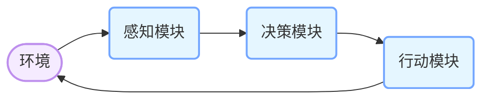

# AI Agent的未来：趋势预测与展望

> 关键词：AI Agent、未来趋势、技术发展、应用场景、挑战与机遇

> 摘要：本文聚焦于AI Agent的未来发展，深入探讨其核心概念、算法原理、数学模型等基础内容。通过项目实战案例展示其实际应用，分析了AI Agent在不同领域的应用场景。同时，推荐了相关的学习资源、开发工具和研究论文，总结了未来发展趋势与面临的挑战，并对常见问题进行解答，旨在为读者全面呈现AI Agent的未来图景，助力其了解和参与到这一前沿领域的发展中。

## 1. 背景介绍 
### 1.1 目的和范围
随着人工智能技术的飞速发展，AI Agent作为其中的关键组成部分，正逐渐在各个领域展现出巨大的潜力。本文的目的在于对AI Agent的未来发展进行全面、深入的分析和预测，探讨其可能的发展趋势和面临的挑战。范围涵盖AI Agent的核心概念、算法原理、数学模型、实际应用场景等多个方面，旨在为读者提供一个系统、全面的了解AI Agent未来发展的视角。

### 1.2 预期读者
本文预期读者包括人工智能领域的研究者、开发者、学生，以及对AI Agent技术感兴趣的企业管理者、投资者等。无论您是希望深入研究AI Agent技术的专业人士，还是希望了解其商业应用潜力的非技术人员，都能从本文中获得有价值的信息。

### 1.3 文档结构概述
本文将按照以下结构进行组织：首先介绍AI Agent的核心概念与联系，包括其定义、原理和架构；接着详细讲解核心算法原理和具体操作步骤，并给出Python源代码示例；然后阐述相关的数学模型和公式，并进行详细讲解和举例说明；通过项目实战展示AI Agent的实际应用，包括开发环境搭建、源代码实现和代码解读；分析AI Agent在不同领域的实际应用场景；推荐相关的学习资源、开发工具和研究论文；总结AI Agent的未来发展趋势与面临的挑战；解答常见问题；最后提供扩展阅读和参考资料。

### 1.4 术语表
#### 1.4.1 核心术语定义
- **AI Agent（人工智能代理）**：是一种能够感知环境、自主决策并采取行动以实现特定目标的智能实体。它可以是软件程序、机器人或其他形式的智能系统。
- **环境（Environment）**：AI Agent所处的外部世界，包括各种物理和虚拟的因素。AI Agent通过感知环境来获取信息，并根据这些信息做出决策。
- **感知（Perception）**：AI Agent从环境中获取信息的过程，通常通过传感器或其他输入设备实现。
- **决策（Decision - making）**：AI Agent根据感知到的信息和自身的目标，选择合适的行动的过程。
- **行动（Action）**：AI Agent为了实现目标而在环境中采取的具体操作。

#### 1.4.2 相关概念解释
- **智能体架构（Agent Architecture）**：指AI Agent的内部结构和组织方式，包括感知模块、决策模块和行动模块等的设计和实现。
- **强化学习（Reinforcement Learning）**：一种机器学习方法，AI Agent通过与环境进行交互，根据环境反馈的奖励信号来学习最优的行动策略。
- **知识表示（Knowledge Representation）**：将知识以计算机能够理解和处理的方式进行表示，以便AI Agent能够利用这些知识进行推理和决策。

#### 1.4.3 缩略词列表
- **RL**：Reinforcement Learning（强化学习）
- **ML**：Machine Learning（机器学习）
- **AI**：Artificial Intelligence（人工智能）

## 2. 核心概念与联系 
### 2.1 AI Agent的定义与原理
AI Agent是一种能够自主地感知环境、做出决策并采取行动的智能实体。其基本原理可以概括为：首先，通过感知模块获取环境中的信息；然后，决策模块根据这些信息和自身的目标进行推理和计算，选择合适的行动；最后，行动模块将决策转化为具体的操作，作用于环境。

### 2.2 AI Agent的架构
AI Agent的架构通常包括以下几个主要部分：
- **感知模块（Perception Module）**：负责从环境中获取信息，例如传感器数据、文本信息等。感知模块可以采用各种技术，如计算机视觉、自然语言处理等。
- **决策模块（Decision - making Module）**：根据感知模块提供的信息和AI Agent的目标，选择最优的行动。决策模块可以基于规则、机器学习算法（如强化学习、深度学习）等实现。
- **行动模块（Action Module）**：将决策模块的输出转化为具体的行动，作用于环境。行动模块可以控制机器人的运动、执行软件程序等。

下面是AI Agent架构的文本示意图：

```plaintext
+---------------------+
|      环境 (Environment)      |
+---------------------+
         |
         v
+---------------------+
|    感知模块 (Perception Module)    |
+---------------------+
         |
         v
+---------------------+
|  决策模块 (Decision - making Module) |
+---------------------+
         |
         v
+---------------------+
|    行动模块 (Action Module)    |
+---------------------+
         |
         v
+---------------------+
|      环境 (Environment)      |
+---------------------+
```

### 2.3 Mermaid流程图


## 3. 核心算法原理 & 具体操作步骤 
### 3.1 强化学习算法原理
强化学习是AI Agent中常用的一种算法，其基本思想是AI Agent通过与环境进行交互，根据环境反馈的奖励信号来学习最优的行动策略。在强化学习中，AI Agent在每个时间步 $t$ 执行一个行动 $a_t$，环境根据这个行动返回一个奖励 $r_{t + 1}$ 和一个新的状态 $s_{t+1}$。AI Agent的目标是最大化长期累积奖励。

### 3.2 Q - learning算法原理与Python实现
Q - learning是一种无模型的强化学习算法，它通过学习一个动作价值函数 $Q(s, a)$ 来找到最优的行动策略。动作价值函数 $Q(s, a)$ 表示在状态 $s$ 下执行行动 $a$ 所获得的预期累积奖励。

Q - learning的更新公式为：
$$Q(s_t, a_t) \leftarrow Q(s_t, a_t)+\alpha\left[r_{t + 1}+\gamma\max_{a}Q(s_{t+1}, a)-Q(s_t, a_t)\right]$$
其中，$\alpha$ 是学习率，控制每次更新的步长；$\gamma$ 是折扣因子，用于权衡当前奖励和未来奖励的重要性。

下面是Q - learning算法的Python实现：

```python
import numpy as np

class QLearningAgent:
    def __init__(self, state_size, action_size, learning_rate=0.1, discount_factor=0.9):
        self.state_size = state_size
        self.action_size = action_size
        self.learning_rate = learning_rate
        self.discount_factor = discount_factor
        self.q_table = np.zeros((state_size, action_size))

    def choose_action(self, state, epsilon=0.1):
        if np.random.uniform(0, 1) < epsilon:
            # 探索：随机选择一个行动
            action = np.random.choice(self.action_size)
        else:
            # 利用：选择Q值最大的行动
            action = np.argmax(self.q_table[state, :])
        return action

    def update_q_table(self, state, action, reward, next_state):
        # 根据Q - learning更新公式更新Q表
        predict = self.q_table[state, action]
        target = reward + self.discount_factor * np.max(self.q_table[next_state, :])
        self.q_table[state, action] = (1 - self.learning_rate) * predict + self.learning_rate * target
```

### 3.3 具体操作步骤
1. **初始化**：初始化Q表 $Q(s, a)$ 为全零矩阵，设置学习率 $\alpha$ 和折扣因子 $\gamma$。
2. **循环训练**：
    - 初始化环境状态 $s_0$。
    - 在每个时间步 $t$：
        - 根据当前状态 $s_t$ 和 $\epsilon$ - 贪心策略选择行动 $a_t$。
        - 执行行动 $a_t$，环境返回奖励 $r_{t + 1}$ 和新的状态 $s_{t+1}$。
        - 根据Q - learning更新公式更新Q表 $Q(s_t, a_t)$。
        - 如果达到终止状态，则结束本次训练；否则，将 $s_{t+1}$ 作为新的当前状态，继续下一个时间步。
3. **训练结束**：经过多次训练后，Q表收敛到最优的动作价值函数，AI Agent可以根据Q表选择最优的行动。

## 4. 数学模型和公式 & 详细讲解 & 举例说明 
### 4.1 马尔可夫决策过程（MDP）
马尔可夫决策过程是强化学习的基础数学模型，它由一个四元组 $(S, A, P, R)$ 组成，其中：
- $S$ 是状态空间，表示环境可能处于的所有状态的集合。
- $A$ 是行动空间，表示AI Agent可以采取的所有行动的集合。
- $P(s_{t+1}|s_t, a_t)$ 是状态转移概率，表示在状态 $s_t$ 下执行行动 $a_t$ 后转移到状态 $s_{t+1}$ 的概率。
- $R(s_t, a_t, s_{t+1})$ 是奖励函数，表示在状态 $s_t$ 下执行行动 $a_t$ 并转移到状态 $s_{t+1}$ 时获得的奖励。

### 4.2 贝尔曼方程
贝尔曼方程是强化学习中的核心方程，它描述了动作价值函数 $Q(s, a)$ 的递归关系。对于Q - learning算法，贝尔曼方程可以表示为：
$$Q(s, a)=\mathbb{E}\left[r+\gamma\max_{a'}Q(s', a')|s, a\right]$$
其中，$r$ 是即时奖励，$s'$ 是下一个状态，$\gamma$ 是折扣因子。

### 4.3 举例说明
考虑一个简单的网格世界问题，AI Agent需要从起点走到终点。网格世界的状态可以用网格的坐标表示，行动可以是上下左右移动。假设每个状态转移的奖励为 - 1（除了到达终点的奖励为10），折扣因子 $\gamma = 0.9$。

初始时，Q表全为零。当AI Agent从状态 $s_1$ 移动到状态 $s_2$ 并获得奖励 $r=-1$ 时，根据Q - learning更新公式：
假设当前状态 $s_1$ 的坐标为 $(1, 1)$，行动 $a$ 为向右移动，下一个状态 $s_2$ 的坐标为 $(1, 2)$，学习率 $\alpha = 0.1$。
$Q(s_1, a)$ 的更新过程如下：
首先，计算目标值：
$$target = r+\gamma\max_{a'}Q(s_2, a')=-1 + 0.9\times0=-1$$
然后，更新Q表：
$$Q(s_1, a)=(1 - 0.1)\times0+0.1\times(-1)=-0.1$$

## 5. 项目实战：代码实际案例和详细解释说明 
### 5.1 开发环境搭建
- **Python环境**：建议使用Python 3.7及以上版本。可以从Python官方网站（https://www.python.org/downloads/）下载并安装。
- **依赖库**：安装NumPy库，用于数值计算。可以使用以下命令进行安装：
```sh
pip install numpy
```

### 5.2 源代码详细实现和代码解读
下面是一个完整的Q - learning算法在简单网格世界中的应用示例：

```python
import numpy as np

# 定义网格世界的参数
GRID_SIZE = 4
START_STATE = 0
GOAL_STATE = 15

# 定义动作空间
ACTIONS = [0, 1, 2, 3]  # 上，下，左，右

# 定义状态转移函数
def get_next_state(state, action):
    row = state // GRID_SIZE
    col = state % GRID_SIZE
    if action == 0 and row > 0:  # 上
        row -= 1
    elif action == 1 and row < GRID_SIZE - 1:  # 下
        row += 1
    elif action == 2 and col > 0:  # 左
        col -= 1
    elif action == 3 and col < GRID_SIZE - 1:  # 右
        col += 1
    next_state = row * GRID_SIZE + col
    return next_state

# 定义奖励函数
def get_reward(state, action, next_state):
    if next_state == GOAL_STATE:
        return 10
    else:
        return -1

# 定义Q - learning智能体
class QLearningAgent:
    def __init__(self, state_size, action_size, learning_rate=0.1, discount_factor=0.9):
        self.state_size = state_size
        self.action_size = action_size
        self.learning_rate = learning_rate
        self.discount_factor = discount_factor
        self.q_table = np.zeros((state_size, action_size))

    def choose_action(self, state, epsilon=0.1):
        if np.random.uniform(0, 1) < epsilon:
            action = np.random.choice(self.action_size)
        else:
            action = np.argmax(self.q_table[state, :])
        return action

    def update_q_table(self, state, action, reward, next_state):
        predict = self.q_table[state, action]
        target = reward + self.discount_factor * np.max(self.q_table[next_state, :])
        self.q_table[state, action] = (1 - self.learning_rate) * predict + self.learning_rate * target

# 训练智能体
def train_agent(agent, num_episodes=1000):
    for episode in range(num_episodes):
        state = START_STATE
        done = False
        while not done:
            action = agent.choose_action(state)
            next_state = get_next_state(state, action)
            reward = get_reward(state, action, next_state)
            agent.update_q_table(state, action, reward, next_state)
            state = next_state
            if state == GOAL_STATE:
                done = True
    return agent

# 主函数
if __name__ == "__main__":
    state_size = GRID_SIZE * GRID_SIZE
    action_size = len(ACTIONS)
    agent = QLearningAgent(state_size, action_size)
    trained_agent = train_agent(agent)
    print("训练完成，Q表：")
    print(trained_agent.q_table)
```

### 5.3 代码解读与分析
1. **网格世界定义**：`GRID_SIZE` 定义了网格世界的大小，`START_STATE` 和 `GOAL_STATE` 分别定义了起点和终点的状态。`ACTIONS` 列表定义了AI Agent可以采取的行动。
2. **状态转移函数**：`get_next_state` 函数根据当前状态和行动计算下一个状态。它通过将状态转换为网格的坐标，然后根据行动更新坐标，最后将新坐标转换为状态。
3. **奖励函数**：`get_reward` 函数根据当前状态、行动和下一个状态计算奖励。如果到达终点，则奖励为10；否则，奖励为 - 1。
4. **Q - learning智能体**：`QLearningAgent` 类实现了Q - learning算法的核心逻辑，包括选择行动和更新Q表。
5. **训练函数**：`train_agent` 函数用于训练智能体。在每个训练回合中，智能体从起点开始，不断选择行动并更新Q表，直到到达终点。
6. **主函数**：初始化智能体，调用训练函数进行训练，并打印训练完成后的Q表。

## 6. 实际应用场景 
### 6.1 智能客服
AI Agent可以作为智能客服，通过自然语言处理技术理解用户的问题，并根据预设的规则或机器学习模型提供准确的回答。例如，电商平台的智能客服可以帮助用户查询商品信息、处理订单问题等。

### 6.2 自动驾驶
在自动驾驶领域，AI Agent可以感知车辆周围的环境，如道路状况、其他车辆和行人的位置等，然后根据这些信息做出决策，如加速、减速、转弯等，以确保行车安全。

### 6.3 金融投资
AI Agent可以分析金融市场的数据，如股票价格、利率等，根据历史数据和机器学习算法预测市场趋势，为投资者提供投资建议。

### 6.4 游戏开发
在游戏中，AI Agent可以作为游戏角色的智能控制者，根据游戏环境和玩家的行为做出相应的决策，提高游戏的趣味性和挑战性。

## 7. 工具和资源推荐
### 7.1 学习资源推荐
#### 7.1.1 书籍推荐
- 《人工智能：一种现代的方法》（Artificial Intelligence: A Modern Approach）：这是一本经典的人工智能教材，全面介绍了人工智能的各个领域，包括AI Agent的相关知识。
- 《强化学习：原理与Python实现》（Reinforcement Learning: An Introduction）：详细介绍了强化学习的基本原理和算法，是学习AI Agent中强化学习算法的重要参考书籍。

#### 7.1.2 在线课程
- Coursera上的“人工智能基础”（Fundamentals of Artificial Intelligence）课程：由知名教授授课，系统介绍了人工智能的基本概念和技术。
- edX上的“强化学习”（Reinforcement Learning）课程：深入讲解了强化学习的理论和实践。

#### 7.1.3 技术博客和网站
- OpenAI博客（https://openai.com/blog/）：提供了人工智能领域的最新研究成果和技术动态。
- Medium上的AI相关博客：有很多人工智能领域的专家分享自己的研究和实践经验。

### 7.2 开发工具框架推荐
#### 7.2.1 IDE和编辑器
- PyCharm：是一款专业的Python集成开发环境，提供了丰富的代码编辑、调试和项目管理功能。
- Jupyter Notebook：是一个交互式的开发环境，适合进行数据分析和机器学习实验。

#### 7.2.2 调试和性能分析工具
- TensorBoard：是TensorFlow的可视化工具，可以帮助开发者监控模型的训练过程和性能。
- Py-Spy：是一个Python性能分析工具，可以分析Python程序的CPU和内存使用情况。

#### 7.2.3 相关框架和库
- TensorFlow：是一个开源的机器学习框架，提供了丰富的工具和库，可用于开发AI Agent。
- PyTorch：也是一个流行的深度学习框架，具有简洁易用的特点，适合快速开发和实验。
- Gym：是OpenAI开发的一个用于开发和比较强化学习算法的工具包，提供了各种环境和基准测试。

### 7.3 相关论文著作推荐
#### 7.3.1 经典论文
- “Q - learning”（Watkins and Dayan, 1992）：这是Q - learning算法的经典论文，详细介绍了Q - learning的原理和算法。
- “Reinforcement Learning: A Survey”（Kaelbling, Littman, and Moore, 1996）：对强化学习进行了全面的综述，是学习强化学习的重要参考论文。

#### 7.3.2 最新研究成果
- 关注顶级人工智能会议（如NeurIPS、ICML、AAAI等）上的论文，这些论文反映了AI Agent领域的最新研究成果。

#### 7.3.3 应用案例分析
- 可以在ACM Digital Library、IEEE Xplore等数据库中搜索AI Agent在不同领域的应用案例分析论文，了解其实际应用情况。

## 8. 总结：未来发展趋势与挑战
### 8.1 未来发展趋势
- **多智能体协作**：未来的AI Agent将更多地进行协作，共同完成复杂的任务。例如，在智能交通系统中，多个自动驾驶车辆可以通过协作优化交通流量。
- **与人类的深度融合**：AI Agent将与人类更加紧密地合作，如在医疗领域，AI Agent可以辅助医生进行诊断和治疗决策。
- **更强的泛化能力**：AI Agent将具备更强的泛化能力，能够在不同的环境和任务中快速适应和学习。

### 8.2 面临的挑战
- **伦理和法律问题**：随着AI Agent的广泛应用，伦理和法律问题变得越来越重要。例如，自动驾驶车辆发生事故时的责任认定问题。
- **数据隐私和安全**：AI Agent需要大量的数据进行训练，如何保护数据的隐私和安全是一个重要的挑战。
- **可解释性**：目前的AI Agent大多是基于深度学习等黑盒模型，其决策过程难以解释，这在一些关键领域（如医疗、金融）可能会带来问题。

## 9. 附录：常见问题与解答
### 9.1 AI Agent和传统软件程序有什么区别？
传统软件程序通常是按照预设的规则和流程执行任务，缺乏自主性和适应性。而AI Agent能够感知环境、自主决策并采取行动，根据环境的变化动态调整自己的行为。

### 9.2 如何评估AI Agent的性能？
可以使用多种指标来评估AI Agent的性能，如累积奖励、成功率、平均完成时间等。具体的评估指标取决于AI Agent的应用场景和任务目标。

### 9.3 AI Agent的训练时间通常需要多久？
AI Agent的训练时间取决于多个因素，如算法复杂度、数据集大小、计算资源等。简单的任务可能只需要几分钟或几小时的训练时间，而复杂的任务可能需要数天甚至数周的训练时间。

## 10. 扩展阅读 & 参考资料
- [1] Stuart Russell, Peter Norvig. Artificial Intelligence: A Modern Approach. Prentice Hall, 2009.
- [2] Richard S. Sutton, Andrew G. Barto. Reinforcement Learning: An Introduction. MIT Press, 2018.
- [3] Watkins, C. J. C. H., & Dayan, P. (1992). Q - learning. Machine learning, 8(3 - 4), 279 - 292.
- [4] Kaelbling, L. P., Littman, M. L., & Moore, A. W. (1996). Reinforcement learning: A survey. Journal of artificial intelligence research, 4, 237 - 285.

作者：AI天才研究院/AI Genius Institute & 禅与计算机程序设计艺术 /Zen And The Art of Computer Programming