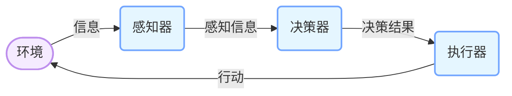

# AI Agent的架构设计：从概念到实现

> 关键词：AI Agent、架构设计、概念原理、算法实现、实际应用

> 摘要：本文深入探讨了AI Agent的架构设计，从背景知识的介绍入手，详细阐述了AI Agent的核心概念、联系以及相关的算法原理。通过数学模型和公式对其进行理论分析，并结合具体的项目实战案例，展示了AI Agent架构在实际中的开发与实现过程。同时，介绍了AI Agent的实际应用场景、相关的工具和资源，最后对其未来发展趋势与挑战进行了总结，还提供了常见问题解答和扩展阅读资料，旨在为读者全面呈现AI Agent架构设计从概念到实现的完整过程。

## 1. 背景介绍 
### 1.1 目的和范围
随着人工智能技术的飞速发展，AI Agent作为一种能够自主感知环境、做出决策并执行行动的智能实体，在众多领域得到了广泛的应用。本文的目的在于系统地介绍AI Agent的架构设计，从基本概念出发，逐步深入到实际的实现过程。范围涵盖了AI Agent的核心概念、算法原理、数学模型、项目实战以及实际应用场景等方面，旨在为读者提供一个全面且深入的关于AI Agent架构设计的知识体系。

### 1.2 预期读者
本文预期读者包括对人工智能领域感兴趣的技术人员，如程序员、软件架构师、AI开发者等，他们希望深入了解AI Agent的架构设计原理和实现方法。同时，也适合相关专业的学生以及研究人员，为他们的学习和研究提供参考。

### 1.3 文档结构概述
本文将按照以下结构进行阐述：首先介绍AI Agent的背景知识，包括目的、预期读者和文档结构概述等。接着详细讲解AI Agent的核心概念与联系，通过文本示意图和Mermaid流程图进行直观展示。然后阐述核心算法原理，并使用Python源代码详细说明具体操作步骤。之后给出数学模型和公式，并进行详细讲解和举例说明。再通过项目实战案例，介绍开发环境搭建、源代码实现和代码解读。随后介绍AI Agent的实际应用场景、相关的工具和资源推荐。最后对AI Agent的未来发展趋势与挑战进行总结，并提供常见问题解答和扩展阅读资料。

### 1.4 术语表
#### 1.4.1 核心术语定义
- **AI Agent**：人工智能代理，是一种能够感知环境、处理信息并自主采取行动以实现特定目标的智能实体。
- **架构设计**：指对系统的整体结构、组件及其相互关系进行规划和设计的过程。
- **感知器**：AI Agent中用于感知环境信息的部分，如传感器等。
- **决策器**：根据感知到的信息和预设的目标，做出决策的模块。
- **执行器**：负责执行决策器所做出的决策，对环境产生影响的部分。

#### 1.4.2 相关概念解释
- **环境**：AI Agent所处的外部世界，它包含了Agent可以感知和影响的各种因素。
- **目标**：AI Agent试图实现的状态或任务，是其行动的指导方向。
- **自主性**：AI Agent在没有外部干预的情况下，能够自主地感知环境、做出决策并执行行动的能力。

#### 1.4.3 缩略词列表
- **AI**：Artificial Intelligence，人工智能
- **ML**：Machine Learning，机器学习
- **RL**：Reinforcement Learning，强化学习

## 2. 核心概念与联系 

### 核心概念原理
AI Agent的核心原理基于感知 - 决策 - 行动的循环。Agent通过感知器收集环境信息，然后决策器根据这些信息和预设的目标进行分析和判断，做出相应的决策，最后执行器将决策转化为具体的行动，对环境产生影响。环境的变化又会被感知器再次捕捉，形成一个闭环的反馈系统。

### 架构的文本示意图
AI Agent的架构可以用以下文本描述：

AI Agent由感知器、决策器和执行器三个主要部分组成。感知器与环境相连，负责收集环境中的各种信息，如温度、湿度、图像、声音等，并将这些信息传递给决策器。决策器根据接收到的信息和内部的知识、规则或模型进行分析和推理，做出决策。决策结果被发送到执行器，执行器根据决策对环境进行操作，改变环境的状态。

### Mermaid流程图


该流程图清晰地展示了AI Agent的工作流程，从环境中获取信息，经过感知、决策和执行，再对环境产生影响，形成一个循环。

## 3. 核心算法原理 & 具体操作步骤 

### 算法原理讲解
在AI Agent中，决策器的决策过程通常涉及到多种算法，其中强化学习是一种常用的方法。强化学习的核心思想是Agent通过与环境进行交互，不断尝试不同的行动，并根据环境给予的奖励或惩罚来学习最优的行动策略。

下面我们使用Python代码详细阐述强化学习中的Q - learning算法。

```python
import numpy as np

# 定义环境
class Environment:
    def __init__(self, num_states, num_actions):
        self.num_states = num_states
        self.num_actions = num_actions
        self.current_state = np.random.randint(0, num_states)

    def step(self, action):
        # 简单示例：随机转移到下一个状态
        next_state = np.random.randint(0, self.num_states)
        # 简单奖励函数：随机奖励
        reward = np.random.randn()
        return next_state, reward

# 定义Q - learning Agent
class QLearningAgent:
    def __init__(self, num_states, num_actions, learning_rate=0.1, discount_factor=0.9):
        self.num_states = num_states
        self.num_actions = num_actions
        self.learning_rate = learning_rate
        self.discount_factor = discount_factor
        self.q_table = np.zeros((num_states, num_actions))

    def choose_action(self, state, epsilon=0.1):
        if np.random.uniform(0, 1) < epsilon:
            # 探索：随机选择一个行动
            action = np.random.randint(0, self.num_actions)
        else:
            # 利用：选择Q值最大的行动
            action = np.argmax(self.q_table[state, :])
        return action

    def update_q_table(self, state, action, next_state, reward):
        # Q - learning更新公式
        q_target = reward + self.discount_factor * np.max(self.q_table[next_state, :])
        q_predict = self.q_table[state, action]
        self.q_table[state, action] += self.learning_rate * (q_target - q_predict)

# 训练过程
num_states = 5
num_actions = 3
env = Environment(num_states, num_actions)
agent = QLearningAgent(num_states, num_actions)

num_episodes = 100
for episode in range(num_episodes):
    state = env.current_state
    done = False
    while not done:
        action = agent.choose_action(state)
        next_state, reward = env.step(action)
        agent.update_q_table(state, action, next_state, reward)
        state = next_state
        # 简单终止条件：达到一定步数
        if episode > 10:
            done = True

print("Final Q - table:")
print(agent.q_table)
```

### 具体操作步骤
1. **环境定义**：首先定义环境类 `Environment`，其中包含状态数量、行动数量和当前状态。`step` 方法用于根据当前行动返回下一个状态和奖励。
2. **Agent定义**：定义Q - learning Agent类 `QLearningAgent`，包含Q表、学习率和折扣因子等参数。`choose_action` 方法用于根据当前状态选择行动，采用ε - 贪心策略进行探索和利用的平衡。`update_q_table` 方法根据Q - learning更新公式更新Q表。
3. **训练过程**：初始化环境和Agent，进行多个回合的训练。在每个回合中，Agent不断选择行动，与环境交互，更新Q表，直到达到终止条件。

## 4. 数学模型和公式 & 详细讲解 & 举例说明 

### Q - learning数学模型和公式
Q - learning的核心是通过迭代更新Q表来学习最优的行动策略。Q表记录了在每个状态下采取每个行动的预期累积奖励。

Q - learning的更新公式为：

$$Q(s, a) \leftarrow Q(s, a) + \alpha [r + \gamma \max_{a'} Q(s', a') - Q(s, a)]$$

其中：
- $Q(s, a)$ 表示在状态 $s$ 下采取行动 $a$ 的Q值。
- $\alpha$ 是学习率，控制每次更新的步长。
- $r$ 是执行行动 $a$ 后从环境中获得的即时奖励。
- $\gamma$ 是折扣因子，用于平衡即时奖励和未来奖励的重要性。
- $s'$ 是执行行动 $a$ 后转移到的下一个状态。
- $\max_{a'} Q(s', a')$ 表示在下一个状态 $s'$ 下采取最优行动的Q值。

### 详细讲解
Q - learning的目标是找到一个最优的行动策略，使得Agent在长期内获得最大的累积奖励。通过不断地与环境交互，Agent根据当前的Q表选择行动，执行行动后获得即时奖励和下一个状态，然后使用更新公式更新Q表。学习率 $\alpha$ 决定了每次更新的幅度，如果 $\alpha$ 过大，Agent可能会过于快速地更新Q表，导致不稳定；如果 $\alpha$ 过小，学习过程会变得缓慢。折扣因子 $\gamma$ 表示未来奖励的重要性，$\gamma$ 越接近1，Agent越注重未来的奖励；$\gamma$ 越接近0，Agent越注重即时奖励。

### 举例说明
假设我们有一个简单的环境，包含3个状态 $S = \{s_1, s_2, s_3\}$ 和2个行动 $A = \{a_1, a_2\}$。初始时，Q表中的所有值都为0。

在某个时刻，Agent处于状态 $s_1$，选择行动 $a_1$，执行该行动后，从环境中获得即时奖励 $r = 1$，并转移到状态 $s_2$。假设学习率 $\alpha = 0.1$，折扣因子 $\gamma = 0.9$。

当前 $Q(s_1, a_1) = 0$，$\max_{a'} Q(s_2, a') = 0$（因为初始时Q表全为0）。

根据更新公式：

$$Q(s_1, a_1) \leftarrow 0 + 0.1 [1 + 0.9 \times 0 - 0] = 0.1$$

更新后，$Q(s_1, a_1)$ 的值变为0.1。随着不断的交互和更新，Q表会逐渐收敛到最优值，Agent也会学习到最优的行动策略。

## 5. 项目实战：代码实际案例和详细解释说明 

### 5.1  开发环境搭建
为了实现上述的Q - learning算法，我们需要搭建一个Python开发环境。以下是具体的步骤：

1. **安装Python**：从Python官方网站（https://www.python.org/downloads/）下载并安装Python 3.x版本。
2. **安装必要的库**：我们使用 `numpy` 库进行数值计算，在命令行中运行以下命令进行安装：
```sh
pip install numpy
```

### 5.2  源代码详细实现和代码解读
以下是完整的Q - learning算法实现代码，我们将对其进行详细解读。

```python
import numpy as np

# 定义环境
class Environment:
    def __init__(self, num_states, num_actions):
        # 初始化状态数量和行动数量
        self.num_states = num_states
        self.num_actions = num_actions
        # 随机初始化当前状态
        self.current_state = np.random.randint(0, num_states)

    def step(self, action):
        # 简单示例：随机转移到下一个状态
        next_state = np.random.randint(0, self.num_states)
        # 简单奖励函数：随机奖励
        reward = np.random.randn()
        return next_state, reward

# 定义Q - learning Agent
class QLearningAgent:
    def __init__(self, num_states, num_actions, learning_rate=0.1, discount_factor=0.9):
        # 初始化状态数量和行动数量
        self.num_states = num_states
        self.num_actions = num_actions
        # 初始化学习率
        self.learning_rate = learning_rate
        # 初始化折扣因子
        self.discount_factor = discount_factor
        # 初始化Q表，全为0
        self.q_table = np.zeros((num_states, num_actions))

    def choose_action(self, state, epsilon=0.1):
        if np.random.uniform(0, 1) < epsilon:
            # 探索：随机选择一个行动
            action = np.random.randint(0, self.num_actions)
        else:
            # 利用：选择Q值最大的行动
            action = np.argmax(self.q_table[state, :])
        return action

    def update_q_table(self, state, action, next_state, reward):
        # Q - learning更新公式
        q_target = reward + self.discount_factor * np.max(self.q_table[next_state, :])
        q_predict = self.q_table[state, action]
        self.q_table[state, action] += self.learning_rate * (q_target - q_predict)

# 训练过程
num_states = 5
num_actions = 3
env = Environment(num_states, num_actions)
agent = QLearningAgent(num_states, num_actions)

num_episodes = 100
for episode in range(num_episodes):
    state = env.current_state
    done = False
    while not done:
        action = agent.choose_action(state)
        next_state, reward = env.step(action)
        agent.update_q_table(state, action, next_state, reward)
        state = next_state
        # 简单终止条件：达到一定步数
        if episode > 10:
            done = True

print("Final Q - table:")
print(agent.q_table)
```

### 代码解读与分析
1. **环境类 `Environment`**：
    - `__init__` 方法：初始化环境的状态数量、行动数量和当前状态。
    - `step` 方法：根据输入的行动，随机转移到下一个状态，并返回一个随机的奖励。

2. **Q - learning Agent类 `QLearningAgent`**：
    - `__init__` 方法：初始化状态数量、行动数量、学习率、折扣因子和Q表。
    - `choose_action` 方法：根据ε - 贪心策略选择行动，以一定的概率进行探索（随机选择行动），以其余概率进行利用（选择Q值最大的行动）。
    - `update_q_table` 方法：根据Q - learning更新公式更新Q表。

3. **训练过程**：
    - 初始化环境和Agent，设置训练的回合数。
    - 在每个回合中，Agent不断选择行动，与环境交互，更新Q表，直到达到终止条件。

通过这个项目实战，我们可以看到如何使用Q - learning算法实现一个简单的AI Agent，并通过不断的训练学习到最优的行动策略。

## 6. 实际应用场景 
AI Agent的架构设计在许多领域都有广泛的应用，以下是一些常见的实际应用场景：

### 游戏领域
在电子游戏中，AI Agent可以作为游戏中的智能对手，能够感知玩家的行为和游戏环境，做出相应的决策，如移动、攻击、防御等。例如，在策略游戏中，AI Agent可以根据地图信息、资源情况和玩家的行动，制定最优的战略计划。

### 自动驾驶领域
自动驾驶汽车可以看作是一个大型的AI Agent。它通过各种传感器（如摄像头、雷达、激光雷达等）感知周围的环境，包括道路状况、其他车辆和行人的位置等信息。决策器根据这些信息做出驾驶决策，如加速、减速、转弯等，最后执行器将决策转化为实际的车辆控制动作。

### 智能客服领域
智能客服系统可以利用AI Agent技术，根据用户的提问和历史对话记录，理解用户的意图，从知识库中选择合适的答案进行回复。同时，AI Agent还可以学习用户的偏好和行为模式，提供更加个性化的服务。

### 工业自动化领域
在工业生产中，AI Agent可以用于监控生产设备的运行状态，根据传感器收集的数据判断设备是否正常工作。如果发现异常，决策器可以及时做出决策，如调整生产参数、发出警报或安排维修等。

### 金融领域
在金融市场中，AI Agent可以分析市场数据、新闻资讯和历史交易记录，预测股票价格的走势、评估投资风险等。根据分析结果，决策器可以为投资者提供投资建议或自动执行交易策略。

## 7. 工具和资源推荐
### 7.1 学习资源推荐
#### 7.1.1 书籍推荐
- 《人工智能：一种现代的方法》（Artificial Intelligence: A Modern Approach）：这本书是人工智能领域的经典教材，全面介绍了人工智能的各个方面，包括搜索算法、知识表示、机器学习、自然语言处理等，对于理解AI Agent的基本原理和技术有很大的帮助。
- 《强化学习：原理与Python实现》（Reinforcement Learning: An Introduction）：由强化学习领域的两位知名学者Richard S. Sutton和Andrew G. Barto所著，详细介绍了强化学习的基本概念、算法和应用，是学习强化学习的必读之书。

#### 7.1.2 在线课程
- Coursera上的“人工智能基础”（Fundamentals of Artificial Intelligence）课程：由知名高校的教授授课，系统地介绍了人工智能的基础知识和技术，包括AI Agent的相关内容。
- edX上的“强化学习”（Reinforcement Learning）课程：提供了丰富的理论讲解和实践案例，帮助学习者深入理解强化学习算法和应用。

#### 7.1.3 技术博客和网站
- Medium上的人工智能相关博客：有许多人工智能领域的专家和从业者在Medium上分享他们的研究成果和实践经验，对于了解AI Agent的最新发展动态非常有帮助。
- OpenAI的官方网站：OpenAI是人工智能领域的领先研究机构，其官方网站上发布了许多关于人工智能技术的研究论文和项目介绍，包括AI Agent的相关内容。

### 7.2 开发工具框架推荐
#### 7.2.1 IDE和编辑器
- PyCharm：是一款专门为Python开发设计的集成开发环境（IDE），提供了丰富的代码编辑、调试和项目管理功能，非常适合开发AI Agent相关的Python代码。
- Jupyter Notebook：是一个交互式的开发环境，支持Python等多种编程语言。它以笔记本的形式组织代码和文档，方便进行实验和数据分析，对于AI Agent的算法实现和验证非常有用。

#### 7.2.2 调试和性能分析工具
- Py-Spy：是一个用于Python代码性能分析的工具，可以实时监控Python程序的CPU使用情况和函数调用栈，帮助开发者找出性能瓶颈。
- pdb：是Python内置的调试器，可以在代码中设置断点，逐步执行代码，查看变量的值和程序的执行流程，方便调试AI Agent的代码。

#### 7.2.3 相关框架和库
- TensorFlow：是一个开源的机器学习框架，提供了丰富的工具和接口，用于构建和训练各种深度学习模型，包括用于AI Agent决策的神经网络模型。
- PyTorch：也是一个流行的深度学习框架，具有动态图的特点，易于使用和调试，广泛应用于人工智能领域的研究和开发。
- Gym：是OpenAI开发的一个用于开发和比较强化学习算法的工具包，提供了各种不同类型的环境，方便开发者进行强化学习算法的实验和验证。

### 7.3 相关论文著作推荐
#### 7.3.1 经典论文
- “Q - learning”：由Chris Watkins和Peter Dayan发表的经典论文，首次提出了Q - learning算法，为强化学习领域的发展奠定了基础。
- “Mastering the Game of Go with Deep Neural Networks and Tree Search”：由DeepMind团队发表的论文，介绍了他们如何使用深度学习和强化学习技术训练AlphaGo，在围棋比赛中击败人类冠军，展示了AI Agent在复杂游戏中的强大能力。

#### 7.3.2 最新研究成果
- 关注顶级人工智能会议（如NeurIPS、ICML、CVPR等）上发表的论文，这些会议汇聚了人工智能领域的最新研究成果，包括AI Agent架构设计、算法优化和应用拓展等方面的研究。

#### 7.3.3 应用案例分析
- 许多科技公司和研究机构会发布关于AI Agent在实际应用中的案例分析报告，如谷歌、微软、亚马逊等公司在自动驾驶、智能客服、推荐系统等领域的应用案例，通过学习这些案例可以了解AI Agent在实际场景中的实现方法和挑战。

## 8. 总结：未来发展趋势与挑战
### 未来发展趋势
- **多Agent系统**：未来的AI Agent将不再是孤立的个体，而是多个Agent相互协作，共同完成复杂的任务。例如，在智能交通系统中，多个自动驾驶汽车可以作为Agent相互通信和协作，提高交通效率和安全性。
- **融合多种技术**：AI Agent将融合更多的技术，如深度学习、计算机视觉、自然语言处理等，以提高其感知、理解和决策能力。例如，结合计算机视觉技术，AI Agent可以更好地感知环境中的图像和视频信息。
- **应用领域拓展**：AI Agent的应用领域将不断拓展，除了现有的游戏、自动驾驶、智能客服等领域，还将在医疗、教育、农业等领域发挥重要作用。例如，在医疗领域，AI Agent可以辅助医生进行疾病诊断和治疗方案制定。

### 挑战
- **安全性和可靠性**：随着AI Agent在越来越多的关键领域应用，其安全性和可靠性成为了重要的挑战。例如，自动驾驶汽车的AI Agent如果出现错误决策，可能会导致严重的交通事故。因此，需要开发更加可靠的算法和验证方法，确保AI Agent的安全性。
- **可解释性**：许多AI Agent采用深度学习等复杂的模型，其决策过程往往难以解释。在一些对决策可解释性要求较高的领域，如医疗和金融，这成为了一个问题。需要研究如何提高AI Agent决策的可解释性，让用户能够理解其决策依据。
- **伦理和法律问题**：AI Agent的发展也带来了一系列伦理和法律问题，如责任归属、隐私保护等。例如，当AI Agent造成损害时，如何确定责任主体是一个需要解决的问题。同时，AI Agent在收集和处理用户数据时，需要遵守相关的隐私保护法律。

## 9. 附录：常见问题与解答
### Q1：AI Agent和传统程序有什么区别？
A1：传统程序通常是按照预设的规则和流程执行任务，缺乏自主性和适应性。而AI Agent能够自主感知环境，根据环境的变化做出决策并执行行动，具有一定的智能和适应性。

### Q2：Q - learning算法一定能收敛到最优策略吗？
A2：在满足一定条件下，Q - learning算法可以收敛到最优策略。这些条件包括环境是有限状态和有限行动空间、学习率逐渐减小等。但在实际应用中，由于环境的复杂性和不确定性，可能无法完全满足这些条件，导致算法收敛速度较慢或无法收敛到最优策略。

### Q3：如何选择合适的学习率和折扣因子？
A3：学习率和折扣因子的选择通常需要通过实验来确定。一般来说，学习率不宜过大，否则算法可能会不稳定；也不宜过小，否则学习过程会变得缓慢。折扣因子越接近1，Agent越注重未来的奖励；越接近0，Agent越注重即时奖励。可以根据具体的问题和环境特点，尝试不同的学习率和折扣因子组合，选择性能最优的参数。

### Q4：AI Agent的决策过程可以完全透明吗？
A4：目前，一些简单的AI Agent决策过程可以相对容易地解释，如基于规则的决策系统。但对于采用深度学习等复杂模型的AI Agent，其决策过程往往难以完全透明。研究人员正在努力开发可解释的人工智能技术，以提高AI Agent决策的可解释性，但要实现完全透明的决策过程仍然面临挑战。

## 10. 扩展阅读 & 参考资料
- 书籍：《深度学习》（Deep Learning），Ian Goodfellow、Yoshua Bengio和Aaron Courville著，介绍了深度学习的基本原理和方法。
- 在线文档：TensorFlow官方文档（https://www.tensorflow.org/）和PyTorch官方文档（https://pytorch.org/），提供了详细的框架使用说明和教程。
- 研究论文：“Deep Reinforcement Learning: An Overview”，由Yoshua Bengio、Aaron Courville和Ian Goodfellow等学者发表，对深度强化学习进行了全面的综述。

作者：AI天才研究院/AI Genius Institute & 禅与计算机程序设计艺术 /Zen And The Art of Computer Programming