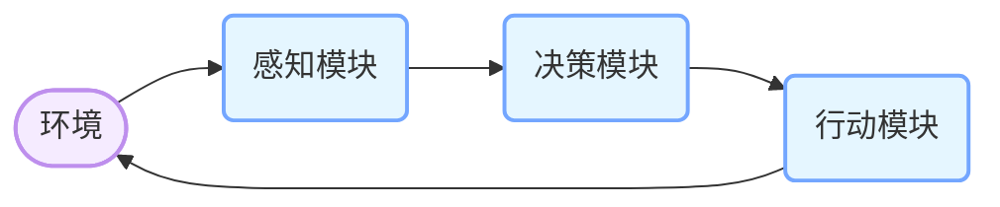

# AI Agent的架构设计：从概念到实现

> 关键词：AI Agent、架构设计、概念原理、算法实现、应用场景

> 摘要：本文深入探讨了AI Agent的架构设计，从概念出发，逐步剖析其核心原理、算法、数学模型等方面，详细阐述了从理论到实际实现的整个过程。通过具体的项目实战案例，展示了AI Agent在实际开发中的应用，并分析了其在不同场景下的应用价值。同时，推荐了相关的学习资源、开发工具和研究论文，最后总结了AI Agent的未来发展趋势与挑战，为开发者和研究者提供了全面且深入的参考。

## 1. 背景介绍 
### 1.1 目的和范围
AI Agent作为人工智能领域的重要概念，在诸多领域有着广泛的应用前景。本文的目的在于全面且深入地介绍AI Agent的架构设计，从基本概念入手，逐步引导读者理解其核心原理、算法实现以及实际应用。范围涵盖了AI Agent的各个方面，包括概念解释、架构设计、算法原理、数学模型、项目实战、应用场景等，旨在为读者提供一个完整的知识体系，帮助他们掌握AI Agent的架构设计并能够进行实际开发。

### 1.2 预期读者
本文预期读者包括人工智能领域的开发者、研究人员、学生以及对AI Agent感兴趣的技术爱好者。对于有一定编程基础和人工智能知识的读者，能够通过本文进一步深入理解AI Agent的架构设计；对于初学者，也能通过本文建立起对AI Agent的基本概念和架构的认识。

### 1.3 文档结构概述
本文将按照以下结构进行阐述：首先介绍AI Agent的背景信息，包括目的、预期读者和文档结构概述等；接着讲解AI Agent的核心概念与联系，通过文本示意图和Mermaid流程图进行展示；然后详细阐述核心算法原理和具体操作步骤，并使用Python源代码进行说明；再介绍相关的数学模型和公式，并举例说明；之后通过项目实战，展示代码实际案例并进行详细解释；接着分析AI Agent的实际应用场景；推荐相关的工具和资源；最后总结AI Agent的未来发展趋势与挑战，并提供常见问题与解答以及扩展阅读和参考资料。

### 1.4 术语表
#### 1.4.1 核心术语定义
- **AI Agent**：人工智能代理，是一种能够感知环境、做出决策并采取行动以实现特定目标的实体。它可以是软件程序、机器人等形式。
- **架构设计**：对系统的结构、组件、模块及其之间的关系进行设计和规划，以实现系统的功能和性能要求。
- **感知模块**：AI Agent中用于获取环境信息的部分，如传感器、摄像头等。
- **决策模块**：根据感知模块获取的信息，进行分析和推理，做出决策的部分。
- **行动模块**：根据决策模块的决策，采取相应行动的部分。

#### 1.4.2 相关概念解释
- **环境**：AI Agent所处的外部世界，它可以是物理环境、虚拟环境等。AI Agent需要与环境进行交互，感知环境的变化并对其做出响应。
- **目标**：AI Agent要实现的任务或状态，它是AI Agent行动的指导方向。目标可以是明确的，如完成某项任务、达到某个位置等，也可以是模糊的，如提高系统的性能等。
- **智能体**：与AI Agent类似，也是能够自主感知环境、做出决策并采取行动的实体。在不同的文献中，智能体和AI Agent可能会有不同的侧重点，但本质上是相似的概念。

#### 1.4.3 缩略词列表
- **ML**：Machine Learning，机器学习
- **RL**：Reinforcement Learning，强化学习
- **NLP**：Natural Language Processing，自然语言处理

## 2. 核心概念与联系 

### 核心概念原理
AI Agent的核心概念基于智能体的思想，它能够自主地感知环境、做出决策并采取行动。其基本原理可以概括为以下几个方面：
- **感知**：AI Agent通过各种传感器或接口获取环境的信息，例如视觉信息、声音信息、温度信息等。这些信息是AI Agent做出决策的基础。
- **决策**：根据感知到的环境信息，AI Agent使用一定的算法和模型进行分析和推理，从而做出决策。决策的过程可以基于规则、机器学习、强化学习等方法。
- **行动**：根据决策的结果，AI Agent采取相应的行动，与环境进行交互。行动可以是物理动作，如机器人的移动、抓取等，也可以是虚拟动作，如发送消息、执行程序等。

### 架构的文本示意图
AI Agent的架构通常可以分为三个主要模块：感知模块、决策模块和行动模块。它们之间的关系如下：
感知模块负责收集环境信息，并将其传递给决策模块。决策模块根据感知信息进行分析和决策，然后将决策结果发送给行动模块。行动模块根据决策结果采取相应的行动，与环境进行交互。环境的变化又会被感知模块再次收集，形成一个闭环的反馈系统。

### Mermaid流程图


这个流程图清晰地展示了AI Agent的工作流程。首先，感知模块从环境中获取信息，然后将其传递给决策模块进行处理。决策模块根据这些信息做出决策，并将决策结果发送给行动模块。行动模块根据决策结果对环境进行操作，从而改变环境的状态。环境状态的变化又会被感知模块再次检测到，形成一个不断循环的过程。

## 3. 核心算法原理 & 具体操作步骤 

### 核心算法原理
AI Agent的决策过程可以使用多种算法，其中机器学习和强化学习是比较常用的方法。下面以强化学习为例，介绍其核心算法原理。

强化学习是一种通过智能体与环境进行交互，不断尝试不同的行动，以最大化累积奖励的学习方法。在强化学习中，智能体处于一个环境中，每个时刻都会感知到环境的状态 $s$，并根据当前状态选择一个行动 $a$。执行行动后，环境会进入一个新的状态 $s'$，并给予智能体一个奖励 $r$。智能体的目标是学习一个策略 $\pi$，使得在长期内累积的奖励最大。

常用的强化学习算法之一是Q-learning算法。Q-learning算法通过维护一个Q表来学习最优策略。Q表是一个二维表格，其中行表示状态，列表示行动，每个单元格 $Q(s,a)$ 表示在状态 $s$ 下采取行动 $a$ 的预期累积奖励。

### 具体操作步骤
以下是Q-learning算法的具体操作步骤：
1. **初始化**：初始化Q表，将所有的 $Q(s,a)$ 值初始化为0。
2. **循环迭代**：
    - 选择当前状态 $s$。
    - 根据当前的Q表，使用某种策略（如 $\epsilon$-贪心策略）选择一个行动 $a$。
    - 执行行动 $a$，观察环境的新状态 $s'$ 和奖励 $r$。
    - 更新Q表：
      - 根据Q-learning更新公式 $Q(s,a) \leftarrow Q(s,a) + \alpha [r + \gamma \max_{a'} Q(s',a') - Q(s,a)]$，其中 $\alpha$ 是学习率，$\gamma$ 是折扣因子。
    - 更新当前状态 $s = s'$。
3. **终止条件**：当达到预设的迭代次数或满足其他终止条件时，停止迭代。

### Python源代码实现
```python
import numpy as np

# 定义环境参数
num_states = 5
num_actions = 2
alpha = 0.1  # 学习率
gamma = 0.9  # 折扣因子
epsilon = 0.1  # epsilon-贪心策略参数
num_episodes = 1000

# 初始化Q表
Q = np.zeros((num_states, num_actions))

# 定义epsilon-贪心策略
def epsilon_greedy(state):
    if np.random.uniform(0, 1) < epsilon:
        return np.random.choice(num_actions)
    else:
        return np.argmax(Q[state, :])

# 模拟环境转移和奖励
def env_step(state, action):
    # 这里简单模拟环境转移和奖励
    new_state = (state + action) % num_states
    reward = 1 if new_state == 0 else 0
    return new_state, reward

# Q-learning算法主循环
for episode in range(num_episodes):
    state = np.random.randint(0, num_states)
    done = False
    while not done:
        action = epsilon_greedy(state)
        new_state, reward = env_step(state, action)
        # 更新Q表
        Q[state, action] = Q[state, action] + alpha * (reward + gamma * np.max(Q[new_state, :]) - Q[state, action])
        state = new_state
        if state == 0:
            done = True

# 输出最终的Q表
print("Final Q-table:")
print(Q)
```

在这段代码中，我们首先定义了环境的参数，包括状态数、行动数、学习率、折扣因子等。然后初始化了Q表，并定义了 $\epsilon$-贪心策略和环境转移函数。在主循环中，我们模拟了智能体与环境的交互过程，根据 $\epsilon$-贪心策略选择行动，执行行动后更新Q表，直到达到终止条件。最后输出最终的Q表。

## 4. 数学模型和公式 & 详细讲解 & 举例说明 

### Q-learning算法的数学模型和公式
Q-learning算法的核心是Q表的更新公式：
$$Q(s,a) \leftarrow Q(s,a) + \alpha [r + \gamma \max_{a'} Q(s',a') - Q(s,a)]$$

### 详细讲解
- **$Q(s,a)$**：表示在状态 $s$ 下采取行动 $a$ 的预期累积奖励。Q表记录了所有状态-行动对的预期累积奖励。
- **$\alpha$**：学习率，它控制了新的经验对Q表更新的影响程度。$\alpha$ 的值越大，新的经验对Q表的更新影响越大；$\alpha$ 的值越小，Q表的更新越缓慢。
- **$r$**：表示执行行动 $a$ 后从环境中获得的即时奖励。奖励是环境对智能体行动的反馈，智能体的目标是最大化累积奖励。
- **$\gamma$**：折扣因子，它表示未来奖励的重要性。$\gamma$ 的值越接近1，智能体越关注未来的奖励；$\gamma$ 的值越接近0，智能体越关注即时奖励。
- **$\max_{a'} Q(s',a')$**：表示在新状态 $s'$ 下，选择最优行动所能获得的预期累积奖励。

### 举例说明
假设我们有一个简单的环境，状态数为3，行动数为2。初始时，Q表的值都为0。当前状态 $s = 1$，选择行动 $a = 0$，执行行动后，环境转移到新状态 $s' = 2$，并获得奖励 $r = 1$。假设学习率 $\alpha = 0.1$，折扣因子 $\gamma = 0.9$。

首先，我们需要找到在新状态 $s' = 2$ 下的最优行动的预期累积奖励 $\max_{a'} Q(s',a')$。由于初始时Q表都为0，所以 $\max_{a'} Q(s',a') = 0$。

然后，根据Q-learning更新公式：
$$Q(1,0) \leftarrow Q(1,0) + 0.1 [1 + 0.9 \times 0 - Q(1,0)]$$
因为初始时 $Q(1,0) = 0$，所以更新后：
$$Q(1,0) = 0 + 0.1 [1 + 0 - 0] = 0.1$$

通过不断地与环境交互，Q表会逐渐收敛到最优值，智能体也会学习到最优策略。

## 5. 项目实战：代码实际案例和详细解释说明 

### 5.1  开发环境搭建
在进行AI Agent的开发时，我们可以使用Python作为开发语言，并使用一些常用的库来辅助开发。以下是搭建开发环境的步骤：
1. **安装Python**：从Python官方网站（https://www.python.org/downloads/）下载并安装Python 3.x版本。
2. **安装必要的库**：使用pip命令安装以下库：
    - `numpy`：用于数值计算。
    - `matplotlib`：用于数据可视化。
    - `gym`：OpenAI提供的强化学习环境库。

```bash
pip install numpy matplotlib gym
```

### 5.2  源代码详细实现和代码解读
我们以OpenAI Gym中的CartPole环境为例，实现一个基于Q-learning算法的AI Agent。

```python
import gym
import numpy as np

# 定义环境
env = gym.make('CartPole-v1')

# 定义参数
num_states = 4  # CartPole环境的状态维度
num_actions = env.action_space.n  # 行动空间大小
alpha = 0.1  # 学习率
gamma = 0.9  # 折扣因子
epsilon = 0.1  # epsilon-贪心策略参数
num_episodes = 1000

# 初始化Q表
Q = np.zeros((num_states, num_actions))

# 定义epsilon-贪心策略
def epsilon_greedy(state):
    if np.random.uniform(0, 1) < epsilon:
        return env.action_space.sample()
    else:
        return np.argmax(Q[state, :])

# 训练过程
total_rewards = []
for episode in range(num_episodes):
    state = env.reset()
    done = False
    total_reward = 0
    while not done:
        # 选择行动
        action = epsilon_greedy(state)
        # 执行行动
        next_state, reward, done, _ = env.step(action)
        # 更新Q表
        Q[state, action] = Q[state, action] + alpha * (reward + gamma * np.max(Q[next_state, :]) - Q[state, action])
        state = next_state
        total_reward += reward
    total_rewards.append(total_reward)
    if episode % 100 == 0:
        print(f"Episode {episode}: Total reward = {total_reward}")

# 测试过程
test_episodes = 10
test_total_rewards = []
for episode in range(test_episodes):
    state = env.reset()
    done = False
    total_reward = 0
    while not done:
        action = np.argmax(Q[state, :])
        next_state, reward, done, _ = env.step(action)
        state = next_state
        total_reward += reward
    test_total_rewards.append(total_reward)
    print(f"Test Episode {episode}: Total reward = {total_reward}")

# 关闭环境
env.close()

# 绘制训练过程中的总奖励曲线
import matplotlib.pyplot as plt
plt.plot(total_rewards)
plt.xlabel('Episode')
plt.ylabel('Total Reward')
plt.title('Training Rewards')
plt.show()
```

### 代码解读与分析
1. **环境初始化**：使用 `gym.make('CartPole-v1')` 创建CartPole环境，并获取状态维度和行动空间大小。
2. **参数设置**：设置学习率、折扣因子、$\epsilon$ 参数和训练的回合数。
3. **Q表初始化**：将Q表初始化为全零矩阵。
4. **$\epsilon$-贪心策略**：根据 $\epsilon$ 的值决定是随机选择行动还是选择Q值最大的行动。
5. **训练过程**：在每个回合中，智能体与环境进行交互，根据 $\epsilon$-贪心策略选择行动，执行行动后更新Q表，直到回合结束。记录每个回合的总奖励。
6. **测试过程**：使用训练好的Q表进行测试，选择Q值最大的行动，记录测试回合的总奖励。
7. **可视化**：使用 `matplotlib` 库绘制训练过程中的总奖励曲线，以便观察智能体的学习效果。

通过这个项目实战，我们可以看到如何使用Q-learning算法实现一个简单的AI Agent，并在CartPole环境中进行训练和测试。

## 6. 实际应用场景 
AI Agent在许多领域都有广泛的应用，以下是一些常见的应用场景：
### 游戏领域
在电子游戏中，AI Agent可以作为游戏角色的智能控制器，例如在策略游戏中，AI Agent可以根据游戏的局势做出决策，制定战略；在格斗游戏中，AI Agent可以控制角色的动作和攻击策略，与玩家进行对战。

### 自动驾驶领域
自动驾驶汽车可以看作是一个大型的AI Agent。它通过各种传感器（如摄像头、雷达等）感知周围环境，然后根据感知到的信息做出决策，如加速、减速、转弯等，最终实现自动驾驶的功能。

### 智能客服领域
智能客服系统可以使用AI Agent来自动回答用户的问题。AI Agent通过自然语言处理技术理解用户的问题，然后根据预设的规则或训练好的模型给出相应的回答。

### 金融领域
在金融市场中，AI Agent可以用于股票交易、风险评估等。它可以分析市场数据，预测股票价格的走势，然后根据预测结果做出交易决策。

### 医疗领域
AI Agent可以辅助医生进行疾病诊断和治疗方案的制定。它可以分析患者的病历、检查结果等数据，结合医学知识和临床经验，给出诊断建议和治疗方案。

## 7. 工具和资源推荐
### 7.1 学习资源推荐
#### 7.1.1 书籍推荐
- 《人工智能：一种现代的方法》：这是一本经典的人工智能教材，涵盖了人工智能的各个方面，包括搜索算法、机器学习、知识表示等，对于理解AI Agent的基础概念和算法非常有帮助。
- 《强化学习：原理与Python实现》：详细介绍了强化学习的原理和算法，并通过Python代码进行实现，对于学习基于强化学习的AI Agent非常有用。

#### 7.1.2 在线课程
- Coursera上的“人工智能基础”课程：由知名教授授课，系统地介绍了人工智能的基本概念和方法。
- edX上的“强化学习”课程：深入讲解了强化学习的理论和实践，提供了丰富的案例和实验。

#### 7.1.3 技术博客和网站
- OpenAI官方博客：提供了关于人工智能最新研究成果和应用案例的介绍。
- Medium上的人工智能相关博客：有许多开发者和研究者分享他们的经验和见解。

### 7.2 开发工具框架推荐
#### 7.2.1 IDE和编辑器
- PyCharm：是一款专门为Python开发设计的集成开发环境，具有强大的代码编辑、调试和自动补全功能。
- Jupyter Notebook：是一个交互式的开发环境，适合进行数据探索、模型训练和代码演示。

#### 7.2.2 调试和性能分析工具
- TensorBoard：是TensorFlow提供的可视化工具，可以用于监控模型的训练过程、查看模型的结构和性能指标。
- Py-Spy：是一个轻量级的Python性能分析工具，可以帮助开发者找出代码中的性能瓶颈。

#### 7.2.3 相关框架和库
- TensorFlow：是一个开源的机器学习框架，提供了丰富的工具和函数，用于构建和训练各种机器学习模型。
- PyTorch：是另一个流行的深度学习框架，具有动态图的特点，易于使用和调试。
- Gym：OpenAI提供的强化学习环境库，包含了许多经典的强化学习环境，方便开发者进行实验和测试。

### 7.3 相关论文著作推荐
#### 7.3.1 经典论文
- “Q-learning”：由Watkins和Dayan发表的经典论文，首次提出了Q-learning算法。
- “Playing Atari with Deep Reinforcement Learning”：由DeepMind团队发表的论文，介绍了使用深度强化学习玩Atari游戏的方法。

#### 7.3.2 最新研究成果
- 关注顶级人工智能会议（如NeurIPS、ICML、AAAI等）上的论文，了解AI Agent领域的最新研究动态。

#### 7.3.3 应用案例分析
- 许多科技公司会发布关于AI Agent应用的技术报告和案例分析，可以在公司的官方网站或相关技术论坛上查找。

## 8. 总结：未来发展趋势与挑战
### 未来发展趋势
- **多智能体系统**：未来的AI Agent将不仅仅是单个的智能体，而是多个智能体组成的系统。多智能体系统可以实现更复杂的任务，如协作、竞争等。例如，在自动驾驶领域，多辆自动驾驶汽车可以作为多个智能体，通过协作实现更高效的交通流量管理。
- **与其他技术的融合**：AI Agent将与物联网、区块链、量子计算等技术进行深度融合。例如，与物联网结合可以实现更智能的智能家居系统；与区块链结合可以提高数据的安全性和可信度。
- **强化学习的改进**：强化学习作为AI Agent的重要算法，将不断得到改进和优化。例如，引入更多的先验知识、使用更复杂的策略网络等，以提高智能体的学习效率和性能。
- **应用领域的拓展**：AI Agent将在更多的领域得到应用，如教育、农业、环保等。例如，在教育领域，AI Agent可以作为智能辅导老师，为学生提供个性化的学习方案。

### 挑战
- **数据隐私和安全**：AI Agent需要大量的数据进行训练和学习，这些数据可能包含用户的敏感信息。因此，如何保护数据的隐私和安全是一个重要的挑战。
- **可解释性**：许多AI Agent使用深度学习等复杂的模型，这些模型的决策过程往往难以解释。在一些关键领域（如医疗、金融等），可解释性是非常重要的，因此如何提高AI Agent的可解释性是一个亟待解决的问题。
- **伦理和道德问题**：AI Agent的决策和行动可能会对人类社会产生影响，因此需要考虑伦理和道德问题。例如，自动驾驶汽车在遇到紧急情况时应该如何做出决策，这涉及到伦理和道德的权衡。
- **计算资源的需求**：一些复杂的AI Agent模型需要大量的计算资源进行训练和运行，这对硬件设备和计算能力提出了很高的要求。如何降低计算资源的需求，提高模型的效率是一个挑战。

## 9. 附录：常见问题与解答
### Q1：AI Agent和传统程序有什么区别？
A1：传统程序是按照预设的规则和流程执行的，缺乏自主性和适应性。而AI Agent能够自主地感知环境、做出决策并采取行动，具有一定的智能和适应性。它可以根据环境的变化动态地调整自己的行为，以实现特定的目标。

### Q2：Q-learning算法适用于所有的AI Agent吗？
A2：Q-learning算法是一种经典的强化学习算法，但并不是适用于所有的AI Agent。Q-learning算法适用于状态和行动空间有限的环境，并且要求环境是马尔可夫决策过程。对于状态和行动空间无限大或者环境不是马尔可夫决策过程的情况，可能需要使用其他算法，如深度强化学习算法。

### Q3：如何评估AI Agent的性能？
A3：评估AI Agent的性能可以从多个方面进行，如任务完成率、累积奖励、决策时间等。在不同的应用场景中，评估指标可能会有所不同。例如，在游戏领域，可以使用游戏的胜率来评估AI Agent的性能；在自动驾驶领域，可以使用行驶的安全性和效率等指标来评估。

### Q4：AI Agent的训练时间一般需要多长？
A4：AI Agent的训练时间取决于多个因素，如模型的复杂度、训练数据的规模、计算资源的性能等。对于一些简单的模型和小规模的数据集，训练时间可能只需要几分钟或几小时；而对于一些复杂的模型和大规模的数据集，训练时间可能需要几天、几周甚至几个月。

## 10. 扩展阅读 & 参考资料
- 《深度学习》（Ian Goodfellow、Yoshua Bengio和Aaron Courville著）
- 《机器学习》（周志华著）
- OpenAI官方文档：https://openai.com/docs/
- Gym官方文档：https://gym.openai.com/docs/
- TensorFlow官方文档：https://www.tensorflow.org/api_docs
- PyTorch官方文档：https://pytorch.org/docs/stable/index.html

作者：AI天才研究院/AI Genius Institute & 禅与计算机程序设计艺术 /Zen And The Art of Computer Programming