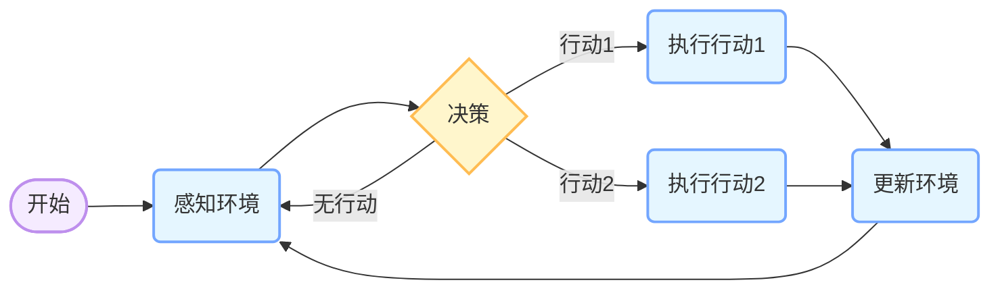

# AI Agent的架构设计：从需求分析到系统规划

> 关键词：AI Agent、架构设计、需求分析、系统规划、智能体

> 摘要：本文围绕AI Agent的架构设计展开，从需求分析入手，逐步深入到系统规划的各个环节。详细阐述了AI Agent的核心概念、算法原理、数学模型，通过实际案例展示了架构设计的具体实现过程。同时，介绍了AI Agent在不同场景下的应用，推荐了相关的学习资源、开发工具和论文著作。最后，对AI Agent未来的发展趋势与挑战进行了总结，并提供了常见问题的解答和扩展阅读参考资料，旨在为开发者和研究者提供全面而深入的指导。

## 1. 背景介绍 

### 1.1 目的和范围
AI Agent作为人工智能领域的重要研究方向，其架构设计的合理性直接影响到智能体的性能和应用效果。本文的目的在于详细阐述AI Agent架构设计的完整流程，从需求分析出发，逐步进行系统规划，为开发者提供一套全面且实用的设计指南。范围涵盖了AI Agent的核心概念、算法原理、数学模型、实际应用等多个方面，旨在帮助读者深入理解AI Agent架构设计的本质和方法。

### 1.2 预期读者
本文预期读者包括人工智能领域的开发者、研究者、软件架构师以及对AI Agent感兴趣的技术爱好者。无论是初学者希望了解AI Agent的基本概念和架构设计方法，还是有一定经验的专业人士想要深入探讨AI Agent的高级应用和优化策略，都能从本文中获得有价值的信息。

### 1.3 文档结构概述
本文将按照以下结构展开：首先介绍AI Agent的背景信息，包括目的、预期读者和文档结构概述；接着阐述AI Agent的核心概念和相互联系，通过文本示意图和Mermaid流程图进行直观展示；然后详细讲解核心算法原理和具体操作步骤，结合Python源代码进行说明；随后介绍AI Agent的数学模型和公式，并通过举例进行详细讲解；再通过实际案例展示AI Agent架构设计的具体实现过程，包括开发环境搭建、源代码实现和代码解读；之后介绍AI Agent的实际应用场景；推荐相关的学习资源、开发工具和论文著作；最后总结AI Agent未来的发展趋势与挑战，提供常见问题的解答和扩展阅读参考资料。

### 1.4 术语表
#### 1.4.1 核心术语定义
- **AI Agent（人工智能智能体）**：是一种能够感知环境、进行决策并采取行动以实现特定目标的智能实体。它可以是软件程序、机器人或其他具有智能行为的系统。
- **架构设计**：是指对系统的结构、组成部分及其相互关系进行规划和设计的过程，旨在确保系统具有良好的性能、可扩展性和可维护性。
- **需求分析**：是指对用户的需求进行收集、整理、分析和明确的过程，为系统的设计和开发提供依据。
- **系统规划**：是指根据需求分析的结果，对系统的整体架构、功能模块、技术选型等进行规划和设计的过程。

#### 1.4.2 相关概念解释
- **感知（Perception）**：AI Agent通过各种传感器获取环境信息的过程，如视觉、听觉、触觉等。
- **决策（Decision-making）**：AI Agent根据感知到的环境信息和自身的目标，选择合适的行动方案的过程。
- **行动（Action）**：AI Agent根据决策结果，对环境进行干预或改变的过程。
- **目标（Goal）**：AI Agent期望实现的状态或结果，是其决策和行动的依据。

#### 1.4.3 缩略词列表
- **AI（Artificial Intelligence）**：人工智能
- **ML（Machine Learning）**：机器学习
- **DL（Deep Learning）**：深度学习
- **RL（Reinforcement Learning）**：强化学习

## 2. 核心概念与联系 
### 核心概念原理
AI Agent的核心概念基于智能体理论，它将智能体看作是一个能够自主感知环境、进行决策并采取行动的实体。智能体通过传感器感知环境中的信息，然后将这些信息传递给决策模块。决策模块根据智能体的目标和当前环境状态，选择合适的行动方案。最后，行动模块将决策结果转化为具体的行动，对环境进行干预或改变。

### 架构的文本示意图
AI Agent的架构可以分为三个主要部分：感知模块、决策模块和行动模块。感知模块负责获取环境信息，决策模块根据感知信息和目标进行决策，行动模块执行决策结果。这三个模块之间通过信息流和控制流相互连接，形成一个闭环系统。

```plaintext
+----------------+          +----------------+          +----------------+
|  感知模块      |          |  决策模块      |          |  行动模块      |
|                | -------> |                | -------> |                |
|  传感器输入    |          |  目标和规则    |          |  执行器输出    |
|                | <------- |                | <------- |                |
+----------------+          +----------------+          +----------------+
```

### Mermaid流程图


这个流程图展示了AI Agent的基本工作流程：首先感知环境，然后根据感知结果进行决策，选择合适的行动并执行，执行后更新环境，然后再次进行感知，形成一个循环。

## 3. 核心算法原理 & 具体操作步骤 
### 核心算法原理
在AI Agent的架构设计中，常用的算法包括机器学习算法、深度学习算法和强化学习算法。下面以强化学习算法为例，详细讲解其原理和具体操作步骤。

强化学习是一种通过智能体与环境进行交互来学习最优策略的算法。智能体在环境中采取行动，环境会根据智能体的行动给予奖励或惩罚，智能体的目标是通过不断尝试和学习，找到能够最大化累积奖励的策略。

### 具体操作步骤
#### 步骤1：定义环境和状态空间
环境是智能体所处的外部世界，状态空间是环境中所有可能状态的集合。例如，在一个机器人导航问题中，环境可以是一个二维地图，状态空间可以是地图上所有可能的位置。

```python
import numpy as np

# 定义环境的大小
env_size = (10, 10)

# 初始化状态空间
state_space = np.zeros(env_size)
```

#### 步骤2：定义动作空间
动作空间是智能体在环境中可以采取的所有可能动作的集合。例如，在机器人导航问题中，动作空间可以包括向前、向后、向左、向右移动。

```python
# 定义动作空间
action_space = ['up', 'down', 'left', 'right']
```

#### 步骤3：定义奖励函数
奖励函数是环境根据智能体的行动给予的奖励或惩罚。奖励函数的设计直接影响到智能体的学习效果。例如，在机器人导航问题中，如果机器人到达目标位置，可以给予正奖励；如果机器人撞到障碍物，可以给予负奖励。

```python
# 定义目标位置
goal_position = (5, 5)

def reward_function(state, action):
    # 获取当前位置
    x, y = state
    
    # 根据动作更新位置
    if action == 'up':
        y = max(y - 1, 0)
    elif action == 'down':
        y = min(y + 1, env_size[1] - 1)
    elif action == 'left':
        x = max(x - 1, 0)
    elif action == 'right':
        x = min(x + 1, env_size[0] - 1)
    
    # 判断是否到达目标位置
    if (x, y) == goal_position:
        return 10
    else:
        return -1
```

#### 步骤4：初始化策略
策略是智能体根据当前状态选择动作的规则。在强化学习中，常用的策略包括贪心策略、ε-贪心策略等。

```python
# 初始化策略
policy = np.random.choice(action_space, size=env_size)
```

#### 步骤5：训练智能体
通过与环境进行交互，智能体不断更新策略，以最大化累积奖励。

```python
# 训练参数
num_episodes = 1000
epsilon = 0.1

for episode in range(num_episodes):
    # 初始化状态
    state = (0, 0)
    total_reward = 0
    
    while True:
        # 根据策略选择动作
        if np.random.uniform() < epsilon:
            action = np.random.choice(action_space)
        else:
            action = policy[state]
        
        # 执行动作，获取奖励和下一个状态
        reward = reward_function(state, action)
        next_state = state  # 这里简化处理，实际中需要根据动作更新状态
        
        # 更新策略
        # 这里可以使用更复杂的算法，如Q-learning、SARSA等
        policy[state] = action
        
        # 更新状态
        state = next_state
        total_reward += reward
        
        # 判断是否结束
        if state == goal_position:
            break
    
    print(f'Episode {episode}: Total Reward = {total_reward}')
```

## 4. 数学模型和公式 & 详细讲解 & 举例说明 
### 数学模型
在强化学习中，常用的数学模型是马尔可夫决策过程（Markov Decision Process，MDP）。MDP是一个五元组 $(S, A, P, R, \gamma)$，其中：
- $S$ 是状态空间，表示环境中所有可能的状态。
- $A$ 是动作空间，表示智能体在环境中可以采取的所有可能动作。
- $P(s'|s, a)$ 是状态转移概率，表示在状态 $s$ 下采取动作 $a$ 后转移到状态 $s'$ 的概率。
- $R(s, a)$ 是奖励函数，表示在状态 $s$ 下采取动作 $a$ 后获得的奖励。
- $\gamma$ 是折扣因子，用于平衡即时奖励和未来奖励的重要性，取值范围为 $[0, 1]$。

### 公式
#### 价值函数
价值函数用于评估在某个状态或状态-动作对下的长期价值。常用的价值函数包括状态价值函数 $V(s)$ 和动作价值函数 $Q(s, a)$。

状态价值函数 $V(s)$ 表示从状态 $s$ 开始，遵循某个策略 $\pi$ 所能获得的期望累积折扣奖励：
$$V^{\pi}(s) = \mathbb{E}_{\pi}\left[\sum_{t=0}^{\infty}\gamma^t R_{t+1} | S_0 = s\right]$$

动作价值函数 $Q(s, a)$ 表示在状态 $s$ 下采取动作 $a$，然后遵循某个策略 $\pi$ 所能获得的期望累积折扣奖励：
$$Q^{\pi}(s, a) = \mathbb{E}_{\pi}\left[\sum_{t=0}^{\infty}\gamma^t R_{t+1} | S_0 = s, A_0 = a\right]$$

#### 贝尔曼方程
贝尔曼方程是强化学习中的核心方程，用于描述价值函数之间的递归关系。

状态价值函数的贝尔曼方程：
$$V^{\pi}(s) = \sum_{a \in A} \pi(a|s) \left(R(s, a) + \gamma \sum_{s' \in S} P(s'|s, a) V^{\pi}(s')\right)$$

动作价值函数的贝尔曼方程：
$$Q^{\pi}(s, a) = R(s, a) + \gamma \sum_{s' \in S} P(s'|s, a) \sum_{a' \in A} \pi(a'|s') Q^{\pi}(s', a')$$

### 详细讲解
价值函数和贝尔曼方程的核心思想是通过递归的方式，将未来的奖励逐步折现到当前状态，从而评估当前状态或状态-动作对的价值。通过不断迭代求解贝尔曼方程，可以得到最优的价值函数和策略。

### 举例说明
假设一个简单的网格世界环境，智能体可以在一个 $3 \times 3$ 的网格中移动，目标是到达右下角的网格。状态空间 $S$ 包括所有 $9$ 个网格的位置，动作空间 $A$ 包括向上、向下、向左、向右移动。状态转移概率 $P(s'|s, a)$ 在大多数情况下为 $1$，除非智能体撞到墙壁。奖励函数 $R(s, a)$ 在到达目标位置时为 $10$，否则为 $-1$。折扣因子 $\gamma = 0.9$。

通过求解贝尔曼方程，可以得到每个状态的最优价值函数和最优策略。例如，在某个状态下，最优策略可能是选择能够使未来累积折扣奖励最大的动作。

## 5. 项目实战：代码实际案例和详细解释说明 
### 5.1  开发环境搭建
#### 安装Python
首先需要安装Python，可以从Python官方网站（https://www.python.org/downloads/）下载适合自己操作系统的Python版本。建议安装Python 3.7及以上版本。

#### 安装必要的库
在本项目中，需要使用一些Python库，如NumPy、Matplotlib等。可以使用pip命令进行安装：
```sh
pip install numpy matplotlib
```

### 5.2  源代码详细实现和代码解读
#### 完整代码
```python
import numpy as np
import matplotlib.pyplot as plt

# 定义环境的大小
env_size = (3, 3)

# 初始化状态空间
state_space = np.zeros(env_size)

# 定义动作空间
action_space = ['up', 'down', 'left', 'right']

# 定义目标位置
goal_position = (2, 2)

def reward_function(state, action):
    # 获取当前位置
    x, y = state
    
    # 根据动作更新位置
    if action == 'up':
        y = max(y - 1, 0)
    elif action == 'down':
        y = min(y + 1, env_size[1] - 1)
    elif action == 'left':
        x = max(x - 1, 0)
    elif action == 'right':
        x = min(x + 1, env_size[0] - 1)
    
    # 判断是否到达目标位置
    if (x, y) == goal_position:
        return 10
    else:
        return -1

# 初始化策略
policy = np.random.choice(action_space, size=env_size)

# 训练参数
num_episodes = 1000
epsilon = 0.1
gamma = 0.9

# 初始化Q表
Q = np.zeros((*env_size, len(action_space)))

for episode in range(num_episodes):
    # 初始化状态
    state = (0, 0)
    total_reward = 0
    
    while True:
        # 根据ε-贪心策略选择动作
        if np.random.uniform() < epsilon:
            action_index = np.random.randint(0, len(action_space))
        else:
            action_index = np.argmax(Q[state])
        
        action = action_space[action_index]
        
        # 执行动作，获取奖励和下一个状态
        reward = reward_function(state, action)
        x, y = state
        if action == 'up':
            next_state = (x, max(y - 1, 0))
        elif action == 'down':
            next_state = (x, min(y + 1, env_size[1] - 1))
        elif action == 'left':
            next_state = (max(x - 1, 0), y)
        elif action == 'right':
            next_state = (min(x + 1, env_size[0] - 1), y)
        
        # 更新Q表
        next_action_index = np.argmax(Q[next_state])
        Q[state][action_index] = Q[state][action_index] + 0.1 * (reward + gamma * Q[next_state][next_action_index] - Q[state][action_index])
        
        # 更新策略
        policy[state] = action_space[np.argmax(Q[state])]
        
        # 更新状态
        state = next_state
        total_reward += reward
        
        # 判断是否结束
        if state == goal_position:
            break
    
    if episode % 100 == 0:
        print(f'Episode {episode}: Total Reward = {total_reward}')

# 可视化策略
plt.figure(figsize=(env_size[0], env_size[1]))
for i in range(env_size[0]):
    for j in range(env_size[1]):
        action = policy[(i, j)]
        if action == 'up':
            plt.arrow(i + 0.5, j + 0.5, 0, -0.2, head_width=0.1, head_length=0.1)
        elif action == 'down':
            plt.arrow(i + 0.5, j + 0.5, 0, 0.2, head_width=0.1, head_length=0.1)
        elif action == 'left':
            plt.arrow(i + 0.5, j + 0.5, -0.2, 0, head_width=0.1, head_length=0.1)
        elif action == 'right':
            plt.arrow(i + 0.5, j + 0.5, 0.2, 0, head_width=0.1, head_length=0.1)
plt.xticks(np.arange(0, env_size[0], 1))
plt.yticks(np.arange(0, env_size[1], 1))
plt.grid(True)
plt.show()
```

#### 代码解读
1. **环境定义**：定义了环境的大小、状态空间、动作空间和目标位置。
2. **奖励函数**：根据智能体的当前状态和动作，计算奖励值。
3. **策略初始化**：随机初始化策略。
4. **Q表初始化**：初始化Q表，用于存储每个状态-动作对的价值。
5. **训练过程**：通过ε-贪心策略选择动作，执行动作并获取奖励和下一个状态，更新Q表和策略。
6. **可视化**：使用Matplotlib库将最终的策略可视化，方便观察智能体的决策结果。

### 5.3  代码解读与分析
#### Q-learning算法
本项目使用了Q-learning算法来更新Q表。Q-learning是一种无模型的强化学习算法，通过不断迭代更新Q表，使智能体能够学习到最优策略。

#### ε-贪心策略
在训练过程中，使用了ε-贪心策略来平衡探索和利用。在一定概率下，智能体随机选择动作进行探索；在其他情况下，选择Q值最大的动作进行利用。

#### 收敛性分析
随着训练次数的增加，Q表会逐渐收敛到最优值，智能体的策略也会逐渐优化。通过观察总奖励的变化，可以判断训练是否收敛。

## 6. 实际应用场景 
### 游戏领域
在游戏中，AI Agent可以作为游戏角色的智能控制模块，实现智能决策和行动。例如，在策略游戏中，AI Agent可以根据当前游戏状态，制定最优的战略和战术；在竞技游戏中，AI Agent可以与人类玩家进行对抗，提高游戏的趣味性和挑战性。

### 机器人领域
在机器人领域，AI Agent可以作为机器人的大脑，实现自主导航、目标识别、任务规划等功能。例如，在物流机器人中，AI Agent可以根据仓库的布局和货物的位置，规划最优的路径，提高物流效率；在服务机器人中，AI Agent可以根据用户的需求，提供个性化的服务。

### 金融领域
在金融领域，AI Agent可以用于风险评估、投资决策、交易策略制定等方面。例如，在股票市场中，AI Agent可以根据历史数据和市场信息，预测股票价格的走势，为投资者提供决策建议；在信贷评估中，AI Agent可以根据客户的信用记录和财务状况，评估客户的信用风险。

### 医疗领域
在医疗领域，AI Agent可以用于疾病诊断、治疗方案推荐、药物研发等方面。例如，在医学影像诊断中，AI Agent可以通过分析X光、CT等影像数据，辅助医生进行疾病诊断；在个性化医疗中，AI Agent可以根据患者的基因信息和临床数据，为患者制定个性化的治疗方案。

## 7. 工具和资源推荐
### 7.1 学习资源推荐
#### 7.1.1 书籍推荐
- 《人工智能：一种现代的方法》（Artificial Intelligence: A Modern Approach）：这是一本经典的人工智能教材，全面介绍了人工智能的各个领域，包括搜索算法、知识表示、机器学习、自然语言处理等。
- 《强化学习：原理与Python实现》（Reinforcement Learning: An Introduction）：由强化学习领域的两位权威专家Richard S. Sutton和Andrew G. Barto所著，系统地介绍了强化学习的基本概念、算法和应用。
- 《深度学习》（Deep Learning）：由Ian Goodfellow、Yoshua Bengio和Aaron Courville所著，是深度学习领域的经典教材，详细介绍了深度学习的理论和实践。

#### 7.1.2 在线课程
- Coursera上的“人工智能基础”（Foundations of Artificial Intelligence）：由斯坦福大学的Sebastian Thrun教授授课，介绍了人工智能的基本概念和算法。
- edX上的“强化学习”（Reinforcement Learning）：由伯克利大学的Pieter Abbeel教授授课，深入讲解了强化学习的理论和应用。
- 吴恩达的“深度学习专项课程”（Deep Learning Specialization）：在Coursera上提供，包括深度学习的基础、卷积神经网络、循环神经网络等内容。

#### 7.1.3 技术博客和网站
- Medium上的人工智能相关博客：有很多人工智能领域的专家和研究者在Medium上分享他们的研究成果和经验。
- arXiv：一个预印本平台，提供了大量的人工智能领域的最新研究论文。
- OpenAI博客：OpenAI是人工智能领域的领先研究机构，其博客上发布了很多关于人工智能的最新研究和应用案例。

### 7.2 开发工具框架推荐
#### 7.2.1 IDE和编辑器
- PyCharm：一款专门为Python开发设计的集成开发环境，具有强大的代码编辑、调试和项目管理功能。
- Jupyter Notebook：一种交互式的开发环境，适合进行数据分析、机器学习和深度学习的实验和开发。
- Visual Studio Code：一款轻量级的代码编辑器，支持多种编程语言，具有丰富的插件和扩展功能。

#### 7.2.2 调试和性能分析工具
- PySnooper：一个简单易用的Python调试工具，可以自动记录函数的调用过程和变量的值。
- cProfile：Python标准库中的性能分析工具，可以帮助开发者找出代码中的性能瓶颈。
- TensorBoard：TensorFlow提供的可视化工具，可以用于可视化深度学习模型的训练过程和性能指标。

#### 7.2.3 相关框架和库
- TensorFlow：由Google开发的开源深度学习框架，提供了丰富的深度学习模型和工具。
- PyTorch：由Facebook开发的开源深度学习框架，具有动态图和易于使用的特点。
- OpenAI Gym：一个用于开发和比较强化学习算法的工具包，提供了多种环境和基准测试。

### 7.3 相关论文著作推荐
#### 7.3.1 经典论文
- “Q-learning”：由Christopher J. C. H. Watkins和Peter Dayan发表于1992年，是Q-learning算法的经典论文。
- “Playing Atari with Deep Reinforcement Learning”：由DeepMind团队发表于2013年，介绍了使用深度强化学习玩Atari游戏的方法。
- “Attention Is All You Need”：由Google团队发表于2017年，提出了Transformer模型，是自然语言处理领域的重要突破。

#### 7.3.2 最新研究成果
- 关注NeurIPS、ICML、CVPR等顶级人工智能会议的最新论文，了解人工智能领域的最新研究动态。
- 关注顶级学术期刊，如Journal of Artificial Intelligence Research（JAIR）、Artificial Intelligence等，获取最新的研究成果。

#### 7.3.3 应用案例分析
- 阅读行业报告和案例分析，了解AI Agent在不同领域的实际应用和效果。
- 参考开源项目和代码库，学习他人的实践经验和解决方案。

## 8. 总结：未来发展趋势与挑战
### 未来发展趋势
- **多智能体系统**：未来的AI Agent将不仅仅是单个智能体，而是多个智能体组成的系统。多智能体系统可以通过协作和竞争的方式，实现更复杂的任务和目标。
- **与其他技术的融合**：AI Agent将与物联网、大数据、区块链等技术深度融合，实现更广泛的应用和创新。例如，在智能家居中，AI Agent可以通过物联网设备感知环境信息，实现智能化的控制和管理。
- **可解释性和安全性**：随着AI Agent在关键领域的应用越来越广泛，其可解释性和安全性将成为重要的研究方向。未来的AI Agent需要能够解释其决策过程和行为，同时保证系统的安全性和可靠性。

### 挑战
- **数据隐私和安全**：AI Agent的训练和运行需要大量的数据，这些数据可能包含用户的隐私信息。如何保护数据的隐私和安全，是AI Agent面临的重要挑战之一。
- **算法复杂度和计算资源**：一些复杂的AI Agent算法需要大量的计算资源和时间，如何提高算法的效率和降低计算成本，是需要解决的问题。
- **伦理和法律问题**：AI Agent的决策和行为可能会对人类社会产生影响，如何制定相应的伦理和法律规范，确保AI Agent的应用符合人类的利益和价值观，是一个亟待解决的问题。

## 9. 附录：常见问题与解答
### 问题1：AI Agent和传统程序有什么区别？
答：AI Agent具有自主感知、决策和行动的能力，能够根据环境的变化自动调整自己的行为。而传统程序通常是按照预设的规则和流程执行，缺乏自主性和适应性。

### 问题2：如何选择合适的AI Agent算法？
答：选择合适的AI Agent算法需要考虑多个因素，如问题的类型、数据的特点、计算资源的限制等。例如，如果问题是一个优化问题，可以考虑使用遗传算法、模拟退火算法等；如果问题是一个决策问题，可以考虑使用强化学习算法。

### 问题3：AI Agent的训练时间通常需要多长？
答：AI Agent的训练时间取决于多个因素，如算法的复杂度、数据的规模、计算资源的性能等。一些简单的算法可能只需要几分钟或几小时的训练时间，而一些复杂的算法可能需要几天、几周甚至几个月的训练时间。

### 问题4：如何评估AI Agent的性能？
答：评估AI Agent的性能可以使用多种指标，如准确率、召回率、F1值、平均回报等。具体选择哪种指标需要根据问题的类型和目标来确定。

## 10. 扩展阅读 & 参考资料
### 扩展阅读
- 《人工智能简史》：了解人工智能的发展历程和重要里程碑。
- 《人类简史：从动物到上帝》：探讨人类与人工智能的关系和未来发展趋势。
- 《奇点临近》：思考人工智能对人类社会的影响和挑战。

### 参考资料
- [Artificial Intelligence: A Modern Approach](https://aima.cs.berkeley.edu/)
- [Reinforcement Learning: An Introduction](http://incompleteideas.net/book/the-book.html)
- [Deep Learning](https://www.deeplearningbook.org/)
- [TensorFlow官方文档](https://www.tensorflow.org/)
- [PyTorch官方文档](https://pytorch.org/)
- [OpenAI Gym官方文档](https://gym.openai.com/)

作者：AI天才研究院/AI Genius Institute & 禅与计算机程序设计艺术 /Zen And The Art of Computer Programming