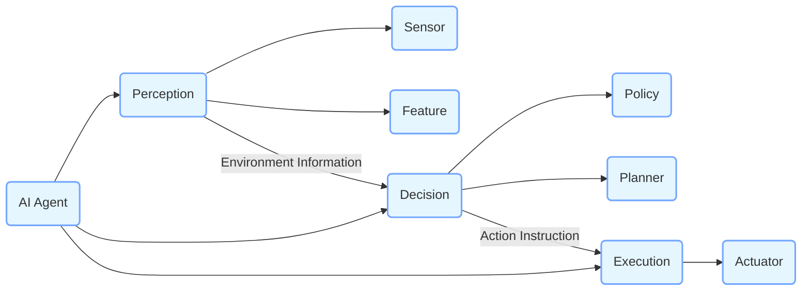

# AI Agent的模块化设计：提高系统可维护性和扩展性

> 关键词：AI Agent、模块化设计、可维护性、扩展性、系统架构

> 摘要：本文聚焦于AI Agent的模块化设计，旨在探讨如何通过合理的模块化架构提升系统的可维护性和扩展性。文章从背景介绍入手，阐述了相关概念和术语，详细讲解了核心概念与联系、核心算法原理及操作步骤，通过数学模型和公式加深理解，并结合项目实战给出代码案例和解释。同时分析了实际应用场景，推荐了学习、开发工具和相关论文著作。最后总结了未来发展趋势与挑战，提供了常见问题解答和扩展阅读参考资料，帮助读者全面了解AI Agent模块化设计的重要性和实现方法。

## 1. 背景介绍 
### 1.1 目的和范围
随着人工智能技术的飞速发展，AI Agent在各个领域的应用越来越广泛。然而，随着系统功能的不断增加和复杂度的提升，AI Agent系统的维护和扩展变得愈发困难。本文章的目的在于深入探讨AI Agent的模块化设计方法，以提高系统的可维护性和扩展性。文章将涵盖模块化设计的核心概念、算法原理、数学模型，以及通过实际项目案例展示如何应用模块化设计思想构建高效的AI Agent系统。

### 1.2 预期读者
本文主要面向对人工智能、机器学习和软件开发有一定了解的专业人士，包括人工智能工程师、软件架构师、数据科学家等。同时，对于对AI Agent技术感兴趣的学生和研究人员也具有一定的参考价值。

### 1.3 文档结构概述
本文将按照以下结构进行组织：首先介绍相关背景知识和术语；接着阐述AI Agent模块化设计的核心概念与联系，包括原理和架构的文本示意图及Mermaid流程图；然后详细讲解核心算法原理和具体操作步骤，并使用Python源代码进行说明；之后介绍数学模型和公式，并举例说明；通过项目实战展示代码实际案例和详细解释；分析实际应用场景；推荐相关的学习资源、开发工具和论文著作；最后总结未来发展趋势与挑战，提供常见问题解答和扩展阅读参考资料。

### 1.4 术语表
#### 1.4.1 核心术语定义
- **AI Agent（人工智能代理）**：是一种能够感知环境、根据感知信息做出决策并采取行动以实现特定目标的智能实体。
- **模块化设计**：将一个复杂的系统分解为多个独立的模块，每个模块具有特定的功能和接口，通过模块之间的协作完成系统的整体功能。
- **可维护性**：指系统易于理解、修改和修复的特性，良好的可维护性可以降低系统的维护成本和风险。
- **扩展性**：指系统能够方便地添加新功能、修改现有功能或适应新环境的能力。

#### 1.4.2 相关概念解释
- **模块**：是系统中具有相对独立功能的部分，模块之间通过接口进行交互。
- **接口**：定义了模块之间交互的方式和规则，是模块之间通信的桥梁。
- **封装**：将模块的内部实现细节隐藏起来，只对外提供统一的接口，提高模块的独立性和安全性。

#### 1.4.3 缩略词列表
- **AI**：Artificial Intelligence，人工智能
- **ML**：Machine Learning，机器学习
- **RL**：Reinforcement Learning，强化学习

## 2. 核心概念与联系 
### 核心概念原理
AI Agent的模块化设计基于将复杂的智能行为分解为多个相对简单的模块。每个模块负责特定的功能，例如感知模块负责收集环境信息，决策模块根据感知信息做出行动决策，执行模块负责执行决策。这种分解使得系统的各个部分更加清晰和易于管理。

模块之间通过接口进行通信，接口定义了模块之间传递信息的格式和规则。例如，感知模块通过接口将收集到的环境信息传递给决策模块，决策模块根据这些信息生成行动指令，并通过接口传递给执行模块。

通过模块化设计，系统的可维护性得到了显著提高。当需要修改某个功能时，只需要对相应的模块进行修改，而不会影响其他模块的正常运行。同时，系统的扩展性也得到了增强，可以方便地添加新的模块来实现新的功能。

### 架构的文本示意图
以下是一个简单的AI Agent模块化设计架构的文本示意图：

```plaintext
+----------------------+
|      AI Agent        |
+----------------------+
|  +----------------+  |
|  |  Perception    |  |
|  +----------------+  |
|  |  +------------+  |
|  |  |  Sensor    |  |
|  |  +------------+  |
|  |  +------------+  |
|  |  |  Feature    |  |
|  |  +------------+  |
|  +----------------+  |
|  +----------------+  |
|  |  Decision      |  |
|  +----------------+  |
|  |  +------------+  |
|  |  |  Policy    |  |
|  |  +------------+  |
|  |  +------------+  |
|  |  |  Planner   |  |
|  |  +------------+  |
|  +----------------+  |
|  +----------------+  |
|  |  Execution     |  |
|  +----------------+  |
|  |  +------------+  |
|  |  |  Actuator  |  |
|  |  +------------+  |
+----------------------+
```

### Mermaid流程图


## 3. 核心算法原理 & 具体操作步骤 
### 核心算法原理
在AI Agent的模块化设计中，不同的模块可能使用不同的算法。以下以感知模块和决策模块为例进行说明。

#### 感知模块
感知模块的主要任务是从环境中收集信息并提取有用的特征。常用的算法包括机器学习中的特征提取算法，例如卷积神经网络（CNN）用于图像特征提取，循环神经网络（RNN）用于序列数据特征提取。

以图像感知为例，使用CNN进行特征提取的原理如下：CNN由多个卷积层、池化层和全连接层组成。卷积层通过卷积核在图像上滑动，提取图像的局部特征。池化层用于降低特征图的维度，减少计算量。全连接层将提取的特征进行整合，输出最终的特征向量。

#### 决策模块
决策模块根据感知模块提供的特征信息，做出行动决策。常用的算法包括强化学习算法，例如Q-learning、深度Q网络（DQN）等。

以DQN为例，其核心思想是使用神经网络来近似Q值函数。Q值函数表示在某个状态下采取某个行动的预期回报。DQN通过不断地与环境交互，更新神经网络的参数，使得Q值函数的估计更加准确。

### 具体操作步骤
#### 感知模块操作步骤
1. **数据收集**：使用传感器（如摄像头、麦克风等）收集环境数据。
2. **数据预处理**：对收集到的数据进行清洗、归一化等预处理操作。
3. **特征提取**：使用CNN等算法提取数据的特征。
4. **特征输出**：将提取的特征传递给决策模块。

#### 决策模块操作步骤
1. **特征输入**：接收感知模块传递的特征信息。
2. **状态表示**：将特征信息转换为决策模块可以理解的状态表示。
3. **行动选择**：使用DQN等算法根据当前状态选择最优的行动。
4. **行动输出**：将选择的行动传递给执行模块。

### Python源代码示例
以下是一个简单的使用CNN进行图像特征提取的Python代码示例：

```python
import torch
import torch.nn as nn

# 定义CNN模型
class CNN(nn.Module):
    def __init__(self):
        super(CNN, self).__init__()
        self.conv1 = nn.Conv2d(3, 16, kernel_size=3, padding=1)
        self.relu1 = nn.ReLU()
        self.pool1 = nn.MaxPool2d(kernel_size=2, stride=2)
        self.conv2 = nn.Conv2d(16, 32, kernel_size=3, padding=1)
        self.relu2 = nn.ReLU()
        self.pool2 = nn.MaxPool2d(kernel_size=2, stride=2)
        self.fc1 = nn.Linear(32 * 8 * 8, 128)
        self.relu3 = nn.ReLU()
        self.fc2 = nn.Linear(128, 10)

    def forward(self, x):
        x = self.pool1(self.relu1(self.conv1(x)))
        x = self.pool2(self.relu2(self.conv2(x)))
        x = x.view(-1, 32 * 8 * 8)
        x = self.relu3(self.fc1(x))
        x = self.fc2(x)
        return x

# 初始化模型
model = CNN()

# 模拟输入数据
input_data = torch.randn(1, 3, 32, 32)

# 进行特征提取
output = model(input_data)
print("特征提取结果:", output)
```

## 4. 数学模型和公式 & 详细讲解 & 举例说明 
### 感知模块的数学模型
#### 卷积操作
卷积操作是CNN的核心操作，其数学公式如下：

$$
y_{i,j}^l = \sum_{m=0}^{M-1} \sum_{n=0}^{N-1} x_{i+m,j+n}^{l-1} \cdot w_{m,n}^l + b^l
$$

其中，$y_{i,j}^l$ 表示第 $l$ 层卷积层在位置 $(i,j)$ 处的输出，$x_{i+m,j+n}^{l-1}$ 表示第 $l-1$ 层在位置 $(i+m,j+n)$ 处的输入，$w_{m,n}^l$ 表示第 $l$ 层的卷积核在位置 $(m,n)$ 处的权重，$b^l$ 表示第 $l$ 层的偏置，$M$ 和 $N$ 分别表示卷积核的高度和宽度。

#### 池化操作
池化操作用于降低特征图的维度，常用的池化方法有最大池化和平均池化。以最大池化为例，其数学公式如下：

$$
y_{i,j}^l = \max_{m=0}^{M-1} \max_{n=0}^{N-1} x_{i \cdot s + m,j \cdot s + n}^{l-1}
$$

其中，$y_{i,j}^l$ 表示第 $l$ 层池化层在位置 $(i,j)$ 处的输出，$x_{i \cdot s + m,j \cdot s + n}^{l-1}$ 表示第 $l-1$ 层在位置 $(i \cdot s + m,j \cdot s + n)$ 处的输入，$s$ 表示池化的步长，$M$ 和 $N$ 分别表示池化窗口的高度和宽度。

### 决策模块的数学模型
#### Q值函数
Q值函数表示在某个状态 $s$ 下采取某个行动 $a$ 的预期回报，其数学公式如下：

$$
Q(s,a) = \mathbb{E} \left[ \sum_{t=0}^{\infty} \gamma^t r_{t+1} \mid s_0 = s, a_0 = a \right]
$$

其中，$r_{t+1}$ 表示在时间步 $t+1$ 获得的奖励，$\gamma$ 是折扣因子，用于平衡短期和长期回报。

#### DQN的损失函数
DQN使用均方误差（MSE）作为损失函数，其数学公式如下：

$$
L(\theta) = \mathbb{E} \left[ \left( r + \gamma \max_{a'} Q(s',a';\theta^-) - Q(s,a;\theta) \right)^2 \right]
$$

其中，$\theta$ 是当前神经网络的参数，$\theta^-$ 是目标神经网络的参数，$s$ 和 $a$ 分别表示当前状态和行动，$s'$ 表示下一个状态，$r$ 表示当前奖励。

### 举例说明
#### 卷积操作举例
假设输入图像的大小为 $4 \times 4$，卷积核的大小为 $3 \times 3$，卷积核的权重为：

$$
w = \begin{bmatrix}
1 & 0 & 1 \\
0 & 1 & 0 \\
1 & 0 & 1
\end{bmatrix}
$$

输入图像为：

$$
x = \begin{bmatrix}
1 & 2 & 3 & 4 \\
5 & 6 & 7 & 8 \\
9 & 10 & 11 & 12 \\
13 & 14 & 15 & 16
\end{bmatrix}
$$

进行卷积操作后，输出特征图的大小为 $2 \times 2$，计算过程如下：

对于输出特征图的第一个元素：

$$
y_{0,0} = \sum_{m=0}^{2} \sum_{n=0}^{2} x_{m,n} \cdot w_{m,n} = 1 \times 1 + 2 \times 0 + 3 \times 1 + 5 \times 0 + 6 \times 1 + 7 \times 0 + 9 \times 1 + 10 \times 0 + 11 \times 1 = 31
$$

同理，可以计算出输出特征图的其他元素。

#### DQN举例
假设一个简单的环境，状态空间为 $\{s_1, s_2\}$，行动空间为 $\{a_1, a_2\}$。初始时，Q值函数的估计值为：

$$
Q(s_1,a_1) = 0.5, Q(s_1,a_2) = 0.3, Q(s_2,a_1) = 0.2, Q(s_2,a_2) = 0.4
$$

在状态 $s_1$ 下选择行动 $a_1$，获得奖励 $r = 1$，并转移到状态 $s_2$。根据DQN的更新规则，更新Q值函数的估计值：

$$
Q(s_1,a_1) \leftarrow Q(s_1,a_1) + \alpha \left( r + \gamma \max_{a'} Q(s_2,a') - Q(s_1,a_1) \right)
$$

假设 $\alpha = 0.1$，$\gamma = 0.9$，则：

$$
\max_{a'} Q(s_2,a') = \max\{0.2, 0.4\} = 0.4
$$

$$
Q(s_1,a_1) \leftarrow 0.5 + 0.1 \times (1 + 0.9 \times 0.4 - 0.5) = 0.5 + 0.1 \times 0.86 = 0.586
$$

## 5. 项目实战：代码实际案例和详细解释说明 
### 5.1  开发环境搭建
#### 安装Python
首先需要安装Python，建议使用Python 3.7及以上版本。可以从Python官方网站（https://www.python.org/downloads/）下载并安装。

#### 安装深度学习框架
本文使用PyTorch作为深度学习框架，可以使用以下命令进行安装：

```bash
pip install torch torchvision
```

#### 安装其他依赖库
还需要安装一些其他的依赖库，例如NumPy、Matplotlib等，可以使用以下命令进行安装：

```bash
pip install numpy matplotlib
```

### 5.2  源代码详细实现和代码解读
以下是一个简单的AI Agent模块化设计的项目实战代码示例，包括感知模块、决策模块和执行模块。

```python
import torch
import torch.nn as nn
import numpy as np

# 感知模块
class PerceptionModule:
    def __init__(self):
        # 模拟传感器
        self.sensor = lambda: np.random.rand(10)

    def perceive(self):
        # 收集环境信息
        data = self.sensor()
        # 简单的数据预处理
        data = data / np.max(data)
        return data

# 决策模块
class DecisionModule(nn.Module):
    def __init__(self):
        super(DecisionModule, self).__init__()
        self.fc1 = nn.Linear(10, 20)
        self.relu = nn.ReLU()
        self.fc2 = nn.Linear(20, 2)

    def forward(self, x):
        x = self.relu(self.fc1(x))
        x = self.fc2(x)
        return x

    def make_decision(self, state):
        state = torch.tensor(state, dtype=torch.float32)
        action_scores = self.forward(state)
        action = torch.argmax(action_scores).item()
        return action

# 执行模块
class ExecutionModule:
    def __init__(self):
        self.actions = ["action1", "action2"]

    def execute(self, action):
        print(f"执行行动: {self.actions[action]}")

# 主程序
if __name__ == "__main__":
    # 初始化模块
    perception = PerceptionModule()
    decision = DecisionModule()
    execution = ExecutionModule()

    # 进行一次交互
    state = perception.perceive()
    action = decision.make_decision(state)
    execution.execute(action)
```

### 5.3  代码解读与分析
#### 感知模块
`PerceptionModule` 类模拟了一个简单的感知模块，包含一个传感器函数 `sensor` 用于收集环境信息。`perceive` 方法首先调用传感器函数收集数据，然后进行简单的数据预处理，将数据归一化到 [0, 1] 范围内，最后返回处理后的数据。

#### 决策模块
`DecisionModule` 类继承自 `nn.Module`，是一个简单的神经网络模型。包含两个全连接层和一个ReLU激活函数。`forward` 方法定义了神经网络的前向传播过程。`make_decision` 方法接收感知模块传递的状态信息，将其转换为PyTorch张量，通过神经网络计算每个行动的得分，选择得分最高的行动作为最终决策。

#### 执行模块
`ExecutionModule` 类模拟了一个简单的执行模块，包含一个行动列表 `actions`。`execute` 方法接收决策模块传递的行动编号，输出相应的行动信息。

#### 主程序
在主程序中，首先初始化了感知模块、决策模块和执行模块。然后进行一次交互，感知模块收集环境信息，决策模块根据环境信息做出决策，执行模块执行决策。

## 6. 实际应用场景 
### 智能机器人
在智能机器人领域，AI Agent的模块化设计可以将机器人的感知、决策和执行功能进行分离。感知模块可以使用各种传感器（如摄像头、激光雷达等）收集环境信息，决策模块根据这些信息规划机器人的行动路径，执行模块控制机器人的电机和关节实现行动。通过模块化设计，可以方便地更换不同的传感器和算法，提高机器人的适应性和可维护性。

### 自动驾驶汽车
自动驾驶汽车也是AI Agent的典型应用场景。感知模块负责收集车辆周围的环境信息，如道路状况、其他车辆和行人的位置等。决策模块根据感知信息做出驾驶决策，如加速、减速、转弯等。执行模块控制车辆的动力系统、制动系统和转向系统执行决策。模块化设计可以使自动驾驶汽车的开发和升级更加高效，降低系统的复杂性和风险。

### 智能客服
在智能客服系统中，AI Agent的模块化设计可以将自然语言处理、对话管理和回复生成等功能进行模块化。感知模块负责接收用户的输入信息，决策模块根据用户的意图和历史对话记录生成回复策略，执行模块生成具体的回复内容并发送给用户。通过模块化设计，可以方便地集成不同的自然语言处理模型和对话策略，提高智能客服系统的性能和可扩展性。

## 7. 工具和资源推荐
### 7.1 学习资源推荐
#### 7.1.1 书籍推荐
- 《人工智能：一种现代的方法》：这是一本经典的人工智能教材，涵盖了人工智能的各个领域，包括搜索算法、知识表示、机器学习、自然语言处理等。
- 《深度学习》：由Ian Goodfellow、Yoshua Bengio和Aaron Courville合著，是深度学习领域的权威书籍，详细介绍了深度学习的基本原理和算法。
- 《强化学习：原理与Python实现》：全面介绍了强化学习的理论和实践，通过Python代码示例帮助读者理解和应用强化学习算法。

#### 7.1.2 在线课程
- Coursera上的“人工智能基础”课程：由哥伦比亚大学教授讲授，介绍了人工智能的基本概念和算法。
- edX上的“深度学习专项课程”：由Andrew Ng教授讲授，深入讲解了深度学习的各个方面，包括神经网络、卷积神经网络、循环神经网络等。
- Udemy上的“强化学习实战”课程：通过实际项目案例，帮助学员掌握强化学习的应用技巧。

#### 7.1.3 技术博客和网站
- Medium上的AI相关博客：有很多人工智能领域的专家和从业者分享他们的经验和见解。
- arXiv.org：一个预印本服务器，提供了大量的人工智能研究论文。
- OpenAI博客：OpenAI发布的关于人工智能研究和应用的最新消息和成果。

### 7.2 开发工具框架推荐
#### 7.2.1 IDE和编辑器
- PyCharm：一款专业的Python集成开发环境，提供了丰富的代码编辑、调试和项目管理功能。
- Jupyter Notebook：一个交互式的编程环境，适合进行数据探索、模型训练和结果展示。
- Visual Studio Code：一款轻量级的代码编辑器，支持多种编程语言和插件扩展。

#### 7.2.2 调试和性能分析工具
- TensorBoard：TensorFlow提供的可视化工具，可以用于监控模型训练过程、可视化模型结构和分析性能指标。
- PyTorch Profiler：PyTorch提供的性能分析工具，可以帮助用户找出代码中的性能瓶颈。
- cProfile：Python内置的性能分析模块，可以统计函数的调用时间和次数。

#### 7.2.3 相关框架和库
- PyTorch：一个开源的深度学习框架，提供了丰富的神经网络层和优化算法，易于使用和扩展。
- TensorFlow：另一个流行的深度学习框架，具有强大的分布式训练和部署能力。
- Scikit-learn：一个用于机器学习的Python库，提供了各种机器学习算法和工具，如分类、回归、聚类等。

### 7.3 相关论文著作推荐
#### 7.3.1 经典论文
- “Playing Atari with Deep Reinforcement Learning”：介绍了使用深度Q网络（DQN）在Atari游戏上取得了优异的成绩，开创了深度强化学习的先河。
- “ImageNet Classification with Deep Convolutional Neural Networks”：提出了AlexNet，是卷积神经网络在图像分类领域的重要突破。
- “Attention Is All You Need”：提出了Transformer模型，在自然语言处理领域取得了巨大的成功。

#### 7.3.2 最新研究成果
- 关注顶级人工智能会议（如NeurIPS、ICML、CVPR等）上的最新研究论文，了解人工智能领域的前沿技术和发展趋势。
- 关注知名研究机构（如OpenAI、DeepMind等）发布的研究成果。

#### 7.3.3 应用案例分析
- 分析一些实际应用案例的论文，了解AI Agent在不同领域的应用方法和经验教训。例如，自动驾驶汽车、智能机器人等领域的相关论文。

## 8. 总结：未来发展趋势与挑战
### 未来发展趋势
- **多模态融合**：未来的AI Agent将不仅仅依赖单一的传感器或数据类型，而是融合多种模态的信息，如视觉、听觉、触觉等，以提高对环境的感知能力和决策的准确性。
- **自主学习和进化**：AI Agent将具备更强的自主学习能力，能够在没有人工干预的情况下不断学习和进化，适应不同的环境和任务。
- **分布式和协作式智能**：多个AI Agent之间将实现分布式协作，共同完成复杂的任务。例如，多个智能机器人可以协同工作，完成大规模的物流配送任务。
- **与人类的深度交互**：AI Agent将更加注重与人类的交互，能够理解人类的意图和情感，提供更加个性化和人性化的服务。

### 挑战
- **数据隐私和安全**：随着AI Agent的广泛应用，大量的个人数据和敏感信息将被收集和处理，如何保障数据的隐私和安全是一个重要的挑战。
- **可解释性和透明度**：AI Agent的决策过程往往是复杂和难以解释的，如何提高其可解释性和透明度，让人类能够理解和信任其决策，是一个亟待解决的问题。
- **伦理和法律问题**：AI Agent的应用可能会引发一系列的伦理和法律问题，如责任认定、道德决策等，需要建立相应的伦理和法律框架来规范其行为。
- **计算资源和能耗**：随着AI Agent的功能越来越强大，其对计算资源和能耗的需求也越来越高，如何降低计算资源的消耗和提高能源利用效率是一个重要的挑战。

## 9. 附录：常见问题与解答
### 问题1：模块化设计会增加系统的复杂度吗？
答：模块化设计的初衷是降低系统的复杂度。通过将复杂的系统分解为多个独立的模块，每个模块只负责特定的功能，使得系统的结构更加清晰，易于理解和维护。虽然在设计和实现模块之间的接口时可能会增加一定的复杂度，但从整体上看，模块化设计可以降低系统的复杂度和维护成本。

### 问题2：如何选择合适的模块划分方法？
答：选择合适的模块划分方法需要考虑多个因素，如系统的功能需求、性能要求、可维护性和扩展性等。一般来说，可以根据功能的相关性、独立性和内聚性来划分模块。例如，将具有相似功能的部分划分为一个模块，将相互依赖的部分放在同一个模块中。同时，还需要考虑模块之间的接口设计，确保模块之间的通信和协作顺畅。

### 问题3：模块化设计对系统的性能有影响吗？
答：模块化设计本身对系统的性能影响较小。相反，合理的模块化设计可以提高系统的性能。通过将不同的功能模块进行并行处理，可以充分利用多核处理器的计算资源，提高系统的处理速度。此外，模块化设计还可以方便地进行性能优化，针对不同的模块进行优化，而不会影响其他模块的正常运行。

### 问题4：如何保证模块之间的兼容性？
答：保证模块之间的兼容性需要在设计模块接口时遵循一定的规范和标准。接口应该具有明确的输入输出格式和语义，模块之间通过接口进行通信和协作。同时，在开发过程中，需要进行充分的测试，确保模块之间的兼容性。如果需要对模块进行升级或修改，应该尽量保持接口的稳定性，避免对其他模块造成影响。

## 10. 扩展阅读 & 参考资料
- 《Python深度学习》，François Chollet著
- 《人工智能实战：基于Python和PyTorch》，Aurélien Géron著
- 李开复，王咏刚. 《人工智能》
- 周志华. 《机器学习》
- 相关学术论文：在IEEE Xplore、ACM Digital Library等学术数据库中搜索关于AI Agent模块化设计的相关论文。

作者：AI天才研究院/AI Genius Institute & 禅与计算机程序设计艺术 /Zen And The Art of Computer Programming