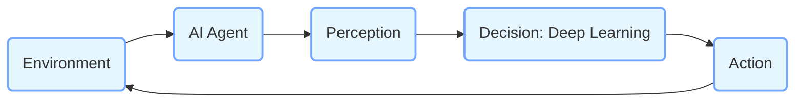

# AI Agent的深度学习技术应用

> 关键词：AI Agent、深度学习技术、强化学习、自然语言处理、计算机视觉

> 摘要：本文围绕AI Agent的深度学习技术应用展开深入探讨。首先介绍了相关背景，包括目的范围、预期读者等内容。接着阐述了AI Agent和深度学习的核心概念及其联系，详细讲解了核心算法原理和具体操作步骤，通过Python代码进行示例。深入分析了数学模型和公式，并举例说明。结合项目实战，给出代码实际案例及详细解释。探讨了AI Agent深度学习技术在多个领域的实际应用场景，推荐了学习资源、开发工具框架和相关论文著作。最后总结了未来发展趋势与挑战，提供常见问题解答和扩展阅读参考资料，旨在为读者全面呈现AI Agent深度学习技术应用的全貌。

## 1. 背景介绍 
### 1.1 目的和范围
随着人工智能技术的飞速发展，AI Agent成为了研究和应用的热点领域。本文章的目的在于深入探讨深度学习技术在AI Agent中的应用，详细剖析其原理、算法、实际案例以及未来发展趋势。范围涵盖了AI Agent和深度学习的核心概念、相关算法的原理和实现、在不同场景下的应用案例以及相关的学习资源和工具推荐等方面。通过对这些内容的介绍，帮助读者全面了解AI Agent的深度学习技术应用，为相关领域的研究和开发提供有价值的参考。

### 1.2 预期读者
本文预期读者包括人工智能领域的研究人员、开发者、学生以及对AI Agent和深度学习技术感兴趣的爱好者。对于研究人员，文章提供了深入的理论分析和最新的研究成果；对于开发者，文章包含了详细的算法实现和项目实战案例，有助于他们在实际项目中应用相关技术；对于学生，文章可以作为学习人工智能相关课程的补充资料，帮助他们更好地理解和掌握AI Agent和深度学习的知识；对于爱好者，文章以通俗易懂的语言介绍了相关概念和应用场景，激发他们对该领域的兴趣。

### 1.3 文档结构概述
本文将按照以下结构进行组织：首先介绍背景信息，包括目的范围、预期读者等；接着阐述AI Agent和深度学习的核心概念及其联系，并给出相应的文本示意图和Mermaid流程图；然后详细讲解核心算法原理和具体操作步骤，通过Python代码进行示例；深入分析数学模型和公式，并举例说明；结合项目实战，给出代码实际案例及详细解释；探讨AI Agent深度学习技术在多个领域的实际应用场景；推荐学习资源、开发工具框架和相关论文著作；最后总结未来发展趋势与挑战，提供常见问题解答和扩展阅读参考资料。

### 1.4 术语表
#### 1.4.1 核心术语定义
- **AI Agent（人工智能代理）**：是一种能够感知环境、根据内部状态和目标进行决策，并采取行动以实现目标的智能实体。它可以是软件程序、机器人或其他具有智能行为的系统。
- **深度学习（Deep Learning）**：是机器学习的一个分支领域，它基于人工神经网络，通过构建具有多个层次的神经网络模型，自动从大量数据中学习特征和模式，以实现对数据的分类、预测、生成等任务。
- **强化学习（Reinforcement Learning）**：是一种机器学习方法，智能体通过与环境进行交互，根据环境反馈的奖励信号来学习最优的行为策略，以最大化长期累积奖励。
- **自然语言处理（Natural Language Processing，NLP）**：是人工智能的一个重要领域，旨在让计算机能够理解、处理和生成人类语言。它涉及到文本分类、情感分析、机器翻译、问答系统等多个任务。
- **计算机视觉（Computer Vision）**：是指让计算机能够理解和解释图像和视频数据的技术。它包括图像分类、目标检测、语义分割、人脸识别等多个任务。

#### 1.4.2 相关概念解释
- **神经网络（Neural Network）**：是一种模仿人类神经系统的计算模型，由大量的神经元组成。神经元之间通过连接进行信息传递和处理，通过调整连接的权重来学习数据中的模式和特征。
- **卷积神经网络（Convolutional Neural Network，CNN）**：是一种专门用于处理具有网格结构数据（如图像）的神经网络。它通过卷积层、池化层和全连接层等组件，自动提取图像的特征。
- **循环神经网络（Recurrent Neural Network，RNN）**：是一种用于处理序列数据的神经网络，它通过引入循环结构，能够捕捉序列数据中的时间依赖关系。
- **生成对抗网络（Generative Adversarial Network，GAN）**：由生成器和判别器两个神经网络组成，通过对抗训练的方式，生成器学习生成与真实数据相似的样本，判别器学习区分生成的样本和真实样本。

#### 1.4.3 缩略词列表
- **AI**：Artificial Intelligence，人工智能
- **ML**：Machine Learning，机器学习
- **DL**：Deep Learning，深度学习
- **RL**：Reinforcement Learning，强化学习
- **NLP**：Natural Language Processing，自然语言处理
- **CV**：Computer Vision，计算机视觉
- **CNN**：Convolutional Neural Network，卷积神经网络
- **RNN**：Recurrent Neural Network，循环神经网络
- **GAN**：Generative Adversarial Network，生成对抗网络

## 2. 核心概念与联系 

### 核心概念原理
#### AI Agent
AI Agent是一个自主的实体，它能够感知环境中的信息，根据自身的目标和内部状态进行决策，并采取相应的行动来影响环境。其工作流程可以概括为：感知 - 决策 - 行动。AI Agent的目标可以是完成特定的任务，如在游戏中获胜、在环境中导航等，也可以是优化某个性能指标，如最大化奖励、最小化成本等。

#### 深度学习
深度学习是基于人工神经网络的机器学习方法。它通过构建多层神经网络，让计算机自动从大量数据中学习特征和模式。深度学习模型可以处理各种类型的数据，如图像、文本、语音等。其核心原理是通过反向传播算法来调整神经网络的权重，使得模型的输出尽可能接近真实标签。

### 架构的文本示意图
```plaintext
            +----------------+
            |    Environment   |
            +----------------+
                    |
                    v
            +----------------+
            |    AI Agent    |
            +----------------+
            |  Perception    |
            |  (Sensor Data) |
            +----------------+
                    |
                    v
            +----------------+
            |    Decision    |
            |  (Deep Learning)|
            +----------------+
                    |
                    v
            +----------------+
            |    Action      |
            |  (Actuator)    |
            +----------------+
```

### Mermaid 流程图


在这个流程图中，环境向AI Agent提供信息，AI Agent通过感知模块获取这些信息，然后使用深度学习技术进行决策，最后采取行动影响环境，形成一个闭环的交互过程。

## 3. 核心算法原理 & 具体操作步骤 

### 强化学习算法原理
强化学习是AI Agent中常用的深度学习算法之一，其核心目标是让智能体学习到最优的行为策略，以最大化长期累积奖励。常见的强化学习算法有Q - learning和Deep Q - Network（DQN）。

#### Q - learning算法原理
Q - learning是一种无模型的强化学习算法，它通过维护一个Q表来记录在每个状态下采取每个动作的价值。Q表中的每个元素$Q(s,a)$表示在状态$s$下采取动作$a$的预期累积奖励。算法的更新规则如下：

$$Q(s,a) \leftarrow Q(s,a) + \alpha [r + \gamma \max_{a'} Q(s',a') - Q(s,a)]$$

其中，$\alpha$是学习率，控制每次更新的步长；$r$是当前状态$s$采取动作$a$后获得的即时奖励；$\gamma$是折扣因子，用于权衡即时奖励和未来奖励的重要性；$s'$是采取动作$a$后转移到的下一个状态。

#### Python代码实现Q - learning算法
```python
import numpy as np

# 定义环境参数
num_states = 5
num_actions = 2
learning_rate = 0.1
discount_factor = 0.9
num_episodes = 100

# 初始化Q表
Q_table = np.zeros((num_states, num_actions))

# 定义环境交互函数
def get_reward(state, action):
    # 简单示例，根据状态和动作返回奖励
    if state == 3 and action == 1:
        return 1
    else:
        return 0

def get_next_state(state, action):
    # 简单示例，根据状态和动作转移到下一个状态
    if action == 0:
        return max(0, state - 1)
    else:
        return min(num_states - 1, state + 1)

# Q - learning算法训练
for episode in range(num_episodes):
    state = np.random.randint(0, num_states)
    done = False
    while not done:
        # 选择动作
        if np.random.uniform(0, 1) < 0.1:
            action = np.random.randint(0, num_actions)
        else:
            action = np.argmax(Q_table[state, :])
        
        # 与环境交互
        reward = get_reward(state, action)
        next_state = get_next_state(state, action)
        
        # 更新Q表
        Q_table[state, action] = Q_table[state, action] + learning_rate * (reward + discount_factor * np.max(Q_table[next_state, :]) - Q_table[state, action])
        
        state = next_state
        if state == 4:
            done = True

print("Final Q - table:")
print(Q_table)
```

### 具体操作步骤
1. **初始化**：初始化Q表，将所有元素初始化为0。
2. **选择动作**：在每个状态下，根据一定的策略（如$\epsilon$-贪心策略）选择一个动作。
3. **与环境交互**：执行选择的动作，从环境中获取即时奖励和下一个状态。
4. **更新Q表**：根据Q - learning的更新规则更新Q表。
5. **终止条件**：如果达到终止状态，则结束当前回合；否则，重复步骤2 - 4。

### Deep Q - Network（DQN）算法原理
DQN是Q - learning的扩展，它使用深度神经网络来近似Q表。DQN的核心思想是使用一个神经网络$Q(s,a;\theta)$来估计在状态$s$下采取动作$a$的Q值，其中$\theta$是神经网络的参数。通过最小化损失函数来更新神经网络的参数，损失函数定义为：

$$L(\theta) = \mathbb{E}[(r + \gamma \max_{a'} Q(s',a';\theta^-) - Q(s,a;\theta))^2]$$

其中，$\theta^-$是目标网络的参数，目标网络的参数定期从主网络复制过来。

#### Python代码实现DQN算法
```python
import torch
import torch.nn as nn
import torch.optim as optim
import numpy as np
import random

# 定义DQN网络
class DQN(nn.Module):
    def __init__(self, input_dim, output_dim):
        super(DQN, self).__init__()
        self.fc1 = nn.Linear(input_dim, 128)
        self.fc2 = nn.Linear(128, output_dim)

    def forward(self, x):
        x = torch.relu(self.fc1(x))
        x = self.fc2(x)
        return x

# 定义环境参数
num_states = 5
num_actions = 2
learning_rate = 0.001
discount_factor = 0.9
num_episodes = 100
batch_size = 32
memory_size = 1000
epsilon = 0.1

# 初始化DQN网络和目标网络
main_network = DQN(num_states, num_actions)
target_network = DQN(num_states, num_actions)
target_network.load_state_dict(main_network.state_dict())
target_network.eval()

# 定义优化器和损失函数
optimizer = optim.Adam(main_network.parameters(), lr=learning_rate)
criterion = nn.MSELoss()

# 经验回放缓冲区
memory = []

# 定义环境交互函数
def get_reward(state, action):
    if state == 3 and action == 1:
        return 1
    else:
        return 0

def get_next_state(state, action):
    if action == 0:
        return max(0, state - 1)
    else:
        return min(num_states - 1, state + 1)

# DQN算法训练
for episode in range(num_episodes):
    state = np.random.randint(0, num_states)
    done = False
    while not done:
        # 选择动作
        if np.random.uniform(0, 1) < epsilon:
            action = np.random.randint(0, num_actions)
        else:
            state_tensor = torch.FloatTensor([state]).unsqueeze(0)
            q_values = main_network(state_tensor)
            action = torch.argmax(q_values).item()
        
        # 与环境交互
        reward = get_reward(state, action)
        next_state = get_next_state(state, action)
        
        # 存储经验
        memory.append((state, action, reward, next_state, done))
        if len(memory) > memory_size:
            memory.pop(0)
        
        # 经验回放
        if len(memory) >= batch_size:
            batch = random.sample(memory, batch_size)
            states, actions, rewards, next_states, dones = zip(*batch)
            
            states_tensor = torch.FloatTensor(states)
            actions_tensor = torch.LongTensor(actions).unsqueeze(1)
            rewards_tensor = torch.FloatTensor(rewards)
            next_states_tensor = torch.FloatTensor(next_states)
            dones_tensor = torch.FloatTensor(dones)
            
            q_values = main_network(states_tensor).gather(1, actions_tensor).squeeze(1)
            next_q_values = target_network(next_states_tensor).max(1)[0].detach()
            target_q_values = rewards_tensor + discount_factor * next_q_values * (1 - dones_tensor)
            
            loss = criterion(q_values, target_q_values)
            optimizer.zero_grad()
            loss.backward()
            optimizer.step()
        
        state = next_state
        if state == 4:
            done = True
    
    # 更新目标网络
    if episode % 10 == 0:
        target_network.load_state_dict(main_network.state_dict())

print("Training finished.")
```

### 具体操作步骤
1. **初始化**：初始化主网络和目标网络，将目标网络的参数初始化为与主网络相同。初始化经验回放缓冲区。
2. **选择动作**：在每个状态下，根据$\epsilon$-贪心策略选择一个动作。
3. **与环境交互**：执行选择的动作，从环境中获取即时奖励和下一个状态。
4. **存储经验**：将当前的状态、动作、奖励、下一个状态和终止标志存储到经验回放缓冲区中。
5. **经验回放**：从经验回放缓冲区中随机采样一个批次的经验，计算损失函数并更新主网络的参数。
6. **更新目标网络**：定期将主网络的参数复制到目标网络中。
7. **终止条件**：如果达到终止状态，则结束当前回合；否则，重复步骤2 - 6。

## 4. 数学模型和公式 & 详细讲解 & 举例说明 

### 强化学习中的数学模型
#### 马尔可夫决策过程（Markov Decision Process，MDP）
马尔可夫决策过程是强化学习的数学基础，它由一个四元组$(S, A, P, R)$表示，其中：
- $S$是状态空间，表示环境中所有可能的状态集合。
- $A$是动作空间，表示智能体可以采取的所有动作集合。
- $P(s'|s,a)$是状态转移概率，表示在状态$s$下采取动作$a$后转移到状态$s'$的概率。
- $R(s,a)$是奖励函数，表示在状态$s$下采取动作$a$后获得的即时奖励。

MDP满足马尔可夫性质，即未来的状态只取决于当前的状态和动作，而与过去的状态和动作无关。

#### 策略（Policy）
策略$\pi(a|s)$表示在状态$s$下选择动作$a$的概率。确定性策略是指在每个状态下只选择一个动作，即$\pi(a|s) \in \{0, 1\}$；随机性策略是指在每个状态下以一定的概率选择不同的动作。

#### 值函数（Value Function）
- **状态值函数$V^{\pi}(s)$**：表示在策略$\pi$下，从状态$s$开始的预期累积奖励，定义为：
$$V^{\pi}(s) = \mathbb{E}_{\pi} \left[ \sum_{t = 0}^{\infty} \gamma^t R(S_t, A_t) \big| S_0 = s \right]$$
其中，$\gamma$是折扣因子，$0 \leq \gamma \leq 1$，用于权衡即时奖励和未来奖励的重要性。

- **动作值函数$Q^{\pi}(s,a)$**：表示在策略$\pi$下，从状态$s$采取动作$a$开始的预期累积奖励，定义为：
$$Q^{\pi}(s,a) = \mathbb{E}_{\pi} \left[ \sum_{t = 0}^{\infty} \gamma^t R(S_t, A_t) \big| S_0 = s, A_0 = a \right]$$

#### 贝尔曼方程（Bellman Equation）
贝尔曼方程描述了值函数的递归关系。对于状态值函数，贝尔曼方程为：
$$V^{\pi}(s) = \sum_{a \in A} \pi(a|s) \left[ R(s,a) + \gamma \sum_{s' \in S} P(s'|s,a) V^{\pi}(s') \right]$$

对于动作值函数，贝尔曼方程为：
$$Q^{\pi}(s,a) = R(s,a) + \gamma \sum_{s' \in S} P(s'|s,a) \sum_{a' \in A} \pi(a'|s') Q^{\pi}(s',a')$$

### 举例说明
考虑一个简单的网格世界环境，智能体在一个$3 \times 3$的网格中移动，目标是从起点$(0,0)$移动到终点$(2,2)$。智能体可以采取上、下、左、右四个动作。

- **状态空间$S$**：网格中的每个位置$(x,y)$都是一个状态，因此$S$包含$9$个状态。
- **动作空间$A$**：$\{ \text{up}, \text{down}, \text{left}, \text{right} \}$。
- **状态转移概率$P(s'|s,a)$**：如果智能体采取的动作不会导致超出网格边界，则以概率$1$转移到相应的状态；否则，保持当前状态不变。
- **奖励函数$R(s,a)$**：当智能体到达终点时，获得奖励$1$；否则，获得奖励$0$。

假设智能体采用随机策略，即$\pi(a|s) = \frac{1}{4}$，对于所有的状态$s$和动作$a$。我们可以使用贝尔曼方程来计算状态值函数$V^{\pi}(s)$和动作值函数$Q^{\pi}(s,a)$。

### 深度学习中的数学模型
#### 神经网络的前向传播
以一个简单的全连接神经网络为例，假设输入层有$n$个神经元，隐藏层有$m$个神经元，输出层有$k$个神经元。输入向量为$\mathbf{x} = [x_1, x_2, \cdots, x_n]^T$，隐藏层的权重矩阵为$W_1 \in \mathbb{R}^{m \times n}$，偏置向量为$\mathbf{b}_1 \in \mathbb{R}^{m}$，输出层的权重矩阵为$W_2 \in \mathbb{R}^{k \times m}$，偏置向量为$\mathbf{b}_2 \in \mathbb{R}^{k}$。

隐藏层的输出为：
$$\mathbf{h} = \sigma(W_1 \mathbf{x} + \mathbf{b}_1)$$
其中，$\sigma$是激活函数，如Sigmoid函数、ReLU函数等。

输出层的输出为：
$$\mathbf{y} = \sigma(W_2 \mathbf{h} + \mathbf{b}_2)$$

#### 反向传播算法
反向传播算法是用于训练神经网络的核心算法，其目的是通过最小化损失函数来调整神经网络的权重和偏置。假设损失函数为$L(\mathbf{y}, \mathbf{t})$，其中$\mathbf{y}$是神经网络的输出，$\mathbf{t}$是真实标签。

首先，计算输出层的误差：
$$\delta_{out} = \frac{\partial L}{\partial \mathbf{y}} \odot \sigma'(W_2 \mathbf{h} + \mathbf{b}_2)$$
其中，$\odot$表示逐元素相乘，$\sigma'$是激活函数的导数。

然后，计算隐藏层的误差：
$$\delta_{hidden} = (W_2^T \delta_{out}) \odot \sigma'(W_1 \mathbf{x} + \mathbf{b}_1)$$

最后，更新权重和偏置：
$$\Delta W_2 = -\alpha \delta_{out} \mathbf{h}^T$$
$$\Delta \mathbf{b}_2 = -\alpha \delta_{out}$$
$$\Delta W_1 = -\alpha \delta_{hidden} \mathbf{x}^T$$
$$\Delta \mathbf{b}_1 = -\alpha \delta_{hidden}$$
其中，$\alpha$是学习率。

### 举例说明
假设我们有一个简单的二分类问题，输入向量$\mathbf{x} = [0.5, 0.3]^T$，真实标签$\mathbf{t} = [1, 0]^T$。神经网络有一个隐藏层，包含$2$个神经元，激活函数为Sigmoid函数。

隐藏层的权重矩阵$W_1 = \begin{bmatrix} 0.1 & 0.2 \\ 0.3 & 0.4 \end{bmatrix}$，偏置向量$\mathbf{b}_1 = \begin{bmatrix} 0.1 \\ 0.2 \end{bmatrix}$，输出层的权重矩阵$W_2 = \begin{bmatrix} 0.5 & 0.6 \\ 0.7 & 0.8 \end{bmatrix}$，偏置向量$\mathbf{b}_2 = \begin{bmatrix} 0.3 \\ 0.4 \end{bmatrix}$。

首先，计算隐藏层的输出：
$$\mathbf{h} = \sigma(W_1 \mathbf{x} + \mathbf{b}_1) = \sigma \left( \begin{bmatrix} 0.1 & 0.2 \\ 0.3 & 0.4 \end{bmatrix} \begin{bmatrix} 0.5 \\ 0.3 \end{bmatrix} + \begin{bmatrix} 0.1 \\ 0.2 \end{bmatrix} \right) = \sigma \left( \begin{bmatrix} 0.1 \times 0.5 + 0.2 \times 0.3 + 0.1 \\ 0.3 \times 0.5 + 0.4 \times 0.3 + 0.2 \end{bmatrix} \right) = \sigma \left( \begin{bmatrix} 0.21 \\ 0.47 \end{bmatrix} \right) = \begin{bmatrix} 0.5525 \\ 0.6154 \end{bmatrix}$$

然后，计算输出层的输出：
$$\mathbf{y} = \sigma(W_2 \mathbf{h} + \mathbf{b}_2) = \sigma \left( \begin{bmatrix} 0.5 & 0.6 \\ 0.7 & 0.8 \end{bmatrix} \begin{bmatrix} 0.5525 \\ 0.6154 \end{bmatrix} + \begin{bmatrix} 0.3 \\ 0.4 \end{bmatrix} \right) = \sigma \left( \begin{bmatrix} 0.5 \times 0.5525 + 0.6 \times 0.6154 + 0.3 \\ 0.7 \times 0.5525 + 0.8 \times 0.6154 + 0.4 \end{bmatrix} \right) = \sigma \left( \begin{bmatrix} 0.9269 \\ 1.3044 \end{bmatrix} \right) = \begin{bmatrix} 0.7174 \\ 0.7867 \end{bmatrix}$$

假设使用交叉熵损失函数$L(\mathbf{y}, \mathbf{t}) = - \sum_{i = 1}^{2} t_i \log(y_i) + (1 - t_i) \log(1 - y_i)$，则：
$$L(\mathbf{y}, \mathbf{t}) = - (1 \times \log(0.7174) + 0 \times \log(1 - 0.7174) + 0 \times \log(0.7867) + 1 \times \log(1 - 0.7867)) = 0.4813$$

接下来，使用反向传播算法更新权重和偏置。

## 5. 项目实战：代码实际案例和详细解释说明 

### 5.1  开发环境搭建
#### 操作系统
推荐使用Linux系统，如Ubuntu 18.04或更高版本，也可以使用Windows 10或macOS。

#### 编程语言和库
- **Python**：建议使用Python 3.7或更高版本。
- **深度学习框架**：使用PyTorch进行深度学习模型的开发。可以通过以下命令安装PyTorch：
```sh
pip install torch torchvision
```
- **其他库**：安装NumPy、Matplotlib等常用库，用于数据处理和可视化。
```sh
pip install numpy matplotlib
```

### 5.2  源代码详细实现和代码解读
#### 项目背景
我们将实现一个简单的AI Agent在网格世界中寻找宝藏的项目。网格世界是一个$5 \times 5$的二维网格，智能体可以在网格中上下左右移动，目标是找到位于网格某个位置的宝藏。

#### 代码实现
```python
import numpy as np
import torch
import torch.nn as nn
import torch.optim as optim
import matplotlib.pyplot as plt

# 定义网格世界环境
class GridWorld:
    def __init__(self):
        self.grid_size = 5
        self.agent_pos = [0, 0]
        self.treasure_pos = [4, 4]
        self.actions = ['up', 'down', 'left', 'right']

    def reset(self):
        self.agent_pos = [0, 0]
        return self.get_state()

    def step(self, action):
        if action == 0:  # up
            self.agent_pos[0] = max(0, self.agent_pos[0] - 1)
        elif action == 1:  # down
            self.agent_pos[0] = min(self.grid_size - 1, self.agent_pos[0] + 1)
        elif action == 2:  # left
            self.agent_pos[1] = max(0, self.agent_pos[1] - 1)
        elif action == 3:  # right
            self.agent_pos[1] = min(self.grid_size - 1, self.agent_pos[1] + 1)

        done = (self.agent_pos == self.treasure_pos)
        reward = 1 if done else -0.1

        next_state = self.get_state()
        return next_state, reward, done

    def get_state(self):
        state = np.zeros((self.grid_size, self.grid_size))
        state[self.agent_pos[0], self.agent_pos[1]] = 1
        state[self.treasure_pos[0], self.treasure_pos[1]] = 2
        return state.flatten()

# 定义DQN网络
class DQN(nn.Module):
    def __init__(self, input_dim, output_dim):
        super(DQN, self).__init__()
        self.fc1 = nn.Linear(input_dim, 128)
        self.fc2 = nn.Linear(128, output_dim)

    def forward(self, x):
        x = torch.relu(self.fc1(x))
        x = self.fc2(x)
        return x

# 超参数设置
learning_rate = 0.001
discount_factor = 0.9
num_episodes = 500
batch_size = 32
epsilon = 0.1
memory_size = 1000

# 初始化环境和网络
env = GridWorld()
input_dim = env.grid_size * env.grid_size
output_dim = len(env.actions)
main_network = DQN(input_dim, output_dim)
target_network = DQN(input_dim, output_dim)
target_network.load_state_dict(main_network.state_dict())
target_network.eval()

# 定义优化器和损失函数
optimizer = optim.Adam(main_network.parameters(), lr=learning_rate)
criterion = nn.MSELoss()

# 经验回放缓冲区
memory = []

# 训练过程
rewards = []
for episode in range(num_episodes):
    state = env.reset()
    state = torch.FloatTensor(state)
    total_reward = 0
    done = False
    while not done:
        # 选择动作
        if np.random.uniform(0, 1) < epsilon:
            action = np.random.randint(0, output_dim)
        else:
            q_values = main_network(state.unsqueeze(0))
            action = torch.argmax(q_values).item()

        # 执行动作
        next_state, reward, done = env.step(action)
        next_state = torch.FloatTensor(next_state)
        total_reward += reward

        # 存储经验
        memory.append((state, action, reward, next_state, done))
        if len(memory) > memory_size:
            memory.pop(0)

        # 经验回放
        if len(memory) >= batch_size:
            batch = np.random.choice(memory, batch_size, replace=False)
            states, actions, rewards_batch, next_states, dones = zip(*batch)

            states = torch.stack(states)
            actions = torch.LongTensor(actions).unsqueeze(1)
            rewards_batch = torch.FloatTensor(rewards_batch)
            next_states = torch.stack(next_states)
            dones = torch.FloatTensor(dones)

            q_values = main_network(states).gather(1, actions).squeeze(1)
            next_q_values = target_network(next_states).max(1)[0].detach()
            target_q_values = rewards_batch + discount_factor * next_q_values * (1 - dones)

            loss = criterion(q_values, target_q_values)
            optimizer.zero_grad()
            loss.backward()
            optimizer.step()

        state = next_state

    # 更新目标网络
    if episode % 10 == 0:
        target_network.load_state_dict(main_network.state_dict())

    rewards.append(total_reward)
    print(f"Episode {episode + 1}: Total Reward = {total_reward}")

# 绘制奖励曲线
plt.plot(rewards)
plt.xlabel('Episode')
plt.ylabel('Total Reward')
plt.title('Training Rewards')
plt.show()
```

#### 代码解读
1. **GridWorld类**：定义了网格世界环境，包括环境的初始化、重置、执行动作和获取状态等方法。
2. **DQN类**：定义了深度Q网络，包含两个全连接层。
3. **训练过程**：
    - 初始化环境、网络、优化器和损失函数。
    - 在每个回合中，智能体根据$\epsilon$-贪心策略选择动作，执行动作并与环境交互，存储经验到经验回放缓冲区。
    - 当经验回放缓冲区中的经验数量达到一定数量时，进行经验回放，从缓冲区中随机采样一个批次的经验，计算损失并更新主网络的参数。
    - 定期更新目标网络的参数。
4. **奖励曲线绘制**：使用Matplotlib库绘制每个回合的总奖励曲线，用于观察训练过程的效果。

### 5.3  代码解读与分析
#### 环境交互
智能体与网格世界环境进行交互，根据当前状态选择动作，执行动作后从环境中获取下一个状态、奖励和终止标志。环境的设计决定了智能体的学习目标和难度。

#### 深度Q网络
使用深度Q网络来近似Q值函数，通过反向传播算法更新网络的参数，使得智能体能够学习到最优的动作策略。

#### 经验回放
经验回放机制可以打破数据之间的相关性，提高训练的稳定性和效率。通过随机采样经验，避免了连续经验之间的强相关性对训练的影响。

#### 奖励曲线分析
通过观察奖励曲线，可以判断训练的效果。如果奖励曲线逐渐上升，说明智能体在不断学习并提高性能；如果奖励曲线波动较大或没有明显上升趋势，可能需要调整超参数或优化网络结构。

## 6. 实际应用场景 
### 游戏领域
AI Agent的深度学习技术在游戏领域有着广泛的应用。例如，在策略游戏中，AI Agent可以通过深度学习算法学习游戏规则和策略，与人类玩家进行对抗。像《星际争霸》这样的即时战略游戏，AI Agent可以通过强化学习来学习如何合理地建造建筑、训练部队和进行战斗，以达到胜利的目标。在棋牌游戏中，如围棋、象棋等，深度学习技术可以让AI Agent学习大量的棋谱和策略，从而具备与顶尖人类棋手抗衡的能力。例如，AlphaGo就是利用深度学习和强化学习技术在围棋领域取得了重大突破。

### 自动驾驶领域
在自动驾驶领域，AI Agent需要感知周围环境，包括识别道路、交通标志、其他车辆和行人等，并根据感知到的信息做出决策，如加速、减速、转弯等。深度学习技术可以用于实现环境感知和决策制定。例如，卷积神经网络（CNN）可以用于图像识别，对摄像头采集的图像进行处理，识别出各种物体；循环神经网络（RNN）或长短期记忆网络（LSTM）可以用于处理序列数据，如车辆的运动轨迹和传感器数据。强化学习可以用于训练AI Agent在不同的驾驶场景下选择最优的驾驶策略，以确保行驶的安全和高效。

### 金融领域
在金融领域，AI Agent可以用于风险评估、投资决策和交易策略制定等方面。深度学习技术可以对大量的金融数据进行分析和预测，帮助投资者做出更明智的决策。例如，通过对历史股票价格、财务报表和新闻数据的分析，深度学习模型可以预测股票价格的走势；强化学习可以用于优化投资组合，根据市场情况动态调整投资策略，以最大化投资回报。

### 医疗领域
在医疗领域，AI Agent可以辅助医生进行疾病诊断、治疗方案推荐和药物研发等工作。深度学习技术可以对医学图像（如X光、CT、MRI等）进行分析，帮助医生更准确地检测疾病和病变。例如，CNN可以用于识别肺部X光图像中的肺炎病灶；自然语言处理技术可以对医学文献和病历进行分析，提取有用的信息，为医生提供参考。强化学习可以用于优化治疗方案，根据患者的病情和治疗反应动态调整治疗策略。

### 智能家居领域
在智能家居领域，AI Agent可以实现家庭设备的自动化控制和智能化管理。深度学习技术可以用于语音识别和图像识别，让用户通过语音指令控制家电设备，如打开灯光、调节温度等。例如，智能音箱可以通过深度学习模型识别用户的语音指令，并执行相应的操作；摄像头可以通过图像识别技术监测家庭环境，如检测是否有陌生人进入、是否发生火灾等。强化学习可以用于优化设备的使用策略，根据用户的习惯和环境条件自动调整设备的运行状态，以提高能源效率和用户体验。

## 7. 工具和资源推荐
### 7.1 学习资源推荐
#### 7.1.1 书籍推荐
- 《深度学习》（Deep Learning）：由Ian Goodfellow、Yoshua Bengio和Aaron Courville撰写，是深度学习领域的经典教材，全面介绍了深度学习的基本概念、算法和应用。
- 《强化学习：原理与Python实现》（Reinforcement Learning: An Introduction）：由Richard S. Sutton和Andrew G. Barto撰写，是强化学习领域的权威著作，详细介绍了强化学习的理论和算法，并提供了Python代码实现。
- 《Python深度学习》（Deep Learning with Python）：由Francois Chollet撰写，结合Keras深度学习框架，介绍了深度学习的基本概念和实践方法，适合初学者入门。

#### 7.1.2 在线课程
- Coursera上的“深度学习专项课程”（Deep Learning Specialization）：由Andrew Ng教授讲授，包括五门课程，全面介绍了深度学习的各个方面，如神经网络、卷积神经网络、循环神经网络等。
- edX上的“强化学习基础”（Foundations of Reinforcement Learning）：由Joelle Pineau教授讲授，系统介绍了强化学习的基本理论和算法。
- 吴恩达老师的“机器学习”课程：虽然不是专门针对深度学习和AI Agent，但提供了机器学习的基础知识，为学习深度学习打下坚实的基础。

#### 7.1.3 技术博客和网站
- Medium：是一个技术博客平台，有很多关于AI Agent和深度学习的优质文章，作者来自世界各地的研究人员和开发者。
- arXiv：是一个预印本数据库，提供了大量关于人工智能和机器学习的最新研究成果，包括论文、报告等。
- Towards Data Science：专注于数据科学和机器学习领域，有很多关于深度学习和AI Agent的实践案例和技术文章。

### 7.2 开发工具框架推荐
#### 7.2.1 IDE和编辑器
- PyCharm：是一款专门为Python开发设计的集成开发环境（IDE），提供了丰富的代码编辑、调试和项目管理功能，适合开发深度学习项目。
- Jupyter Notebook：是一个交互式的开发环境，支持Python、R等多种编程语言，非常适合进行数据探索、模型实验和结果展示。
- Visual Studio Code：是一款轻量级的代码编辑器，支持多种编程语言和插件扩展，安装相应的插件后可以用于深度学习项目的开发。

#### 7.2.2 调试和性能分析工具
- TensorBoard：是TensorFlow提供的可视化工具，可以用于可视化训练过程中的损失函数、准确率、模型结构等信息，帮助开发者监控和调试模型。
- PyTorch Profiler：是PyTorch提供的性能分析工具，可以分析模型的计算时间、内存使用情况等，帮助开发者优化模型性能。
- NVIDIA Nsight Systems：是NVIDIA提供的性能分析工具，专门用于分析GPU加速的深度学习应用程序，帮助开发者找出性能瓶颈并进行优化。

#### 7.2.3 相关框架和库
- PyTorch：是一个开源的深度学习框架，具有动态图机制，易于使用和调试，广泛应用于学术界和工业界。
- TensorFlow：是另一个开源的深度学习框架，具有强大的分布式训练和部署能力，提供了丰富的工具和库，适合大规模深度学习项目的开发。
- OpenAI Gym：是一个开源的强化学习环境库，提供了各种不同类型的环境，如游戏、机器人控制等，方便开发者进行强化学习算法的实验和测试。

### 7.3 相关论文著作推荐
#### 7.3.1 经典论文
- “Playing Atari with Deep Reinforcement Learning”：介绍了深度Q网络（DQN）的基本思想和算法，是强化学习领域的经典论文之一。
- “ImageNet Classification with Deep Convolutional Neural Networks”：介绍了AlexNet卷积神经网络，开启了深度学习在计算机视觉领域的热潮。
- “Attention Is All You Need”：提出了Transformer模型，在自然语言处理领域取得了重大突破。

#### 7.3.2 最新研究成果
- 关注NeurIPS、ICML、CVPR、ACL等顶级人工智能会议的论文，这些会议收录了人工智能领域的最新研究成果。
- 关注相关领域的学术期刊，如Journal of Artificial Intelligence Research（JAIR）、Artificial Intelligence等。

#### 7.3.3 应用案例分析
- 《AI 未来：从 ChatGPT 到通用人工智能》：介绍了人工智能在各个领域的应用案例和发展趋势，包括AI Agent的应用。
- 一些企业的技术博客和研究报告，如Google AI Blog、Microsoft Research等，会分享他们在AI Agent和深度学习领域的实践经验和应用案例。

## 8. 总结：未来发展趋势与挑战
### 未来发展趋势
#### 多模态融合
未来的AI Agent将不仅仅局限于单一的信息处理方式，而是会融合多种模态的信息，如图像、文本、语音等。例如，在智能客服系统中，AI Agent可以同时处理用户的语音提问和发送的图片，提供更准确和全面的回答。多模态融合可以让AI Agent更好地理解和处理复杂的现实场景，提高其智能水平和应用范围。

#### 自主学习和进化
AI Agent将具备更强的自主学习和进化能力。它们可以在没有人类干预的情况下，不断地从环境中学习新的知识和技能，优化自己的行为策略。例如，在机器人领域，机器人可以通过自主探索和实验，学习如何完成各种任务，并且能够适应不同的环境和变化。这种自主学习和进化能力将使AI Agent更加灵活和智能。

#### 与人类的协作和交互
AI Agent将更加注重与人类的协作和交互。它们可以作为人类的助手，与人类共同完成各种任务，提高工作效率和质量。例如，在医疗领域，AI Agent可以辅助医生进行疾病诊断和治疗方案制定，为医生提供决策支持；在教育领域，AI Agent可以作为智能辅导老师，根据学生的学习情况提供个性化的学习建议和指导。

#### 应用场景的拓展
随着技术的不断发展，AI Agent的应用场景将不断拓展。除了现有的游戏、自动驾驶、金融、医疗、智能家居等领域，AI Agent还将在农业、工业、环保等领域发挥重要作用。例如，在农业领域，AI Agent可以监测农作物的生长情况，提供精准的灌溉和施肥建议；在工业领域，AI Agent可以优化生产流程，提高生产效率和质量。

### 挑战
#### 数据隐私和安全
随着AI Agent的广泛应用，大量的数据被收集和使用，数据隐私和安全问题成为了一个重要的挑战。例如，在自动驾驶领域，车辆收集的大量行驶数据和用户信息需要得到妥善的保护，防止数据泄露和滥用。如何在保证AI Agent性能的同时，保护用户的数据隐私和安全，是一个亟待解决的问题。

#### 可解释性和透明度
深度学习模型通常是黑盒模型，其决策过程和结果难以解释和理解。在一些关键领域，如医疗、金融等，可解释性和透明度是非常重要的。例如，在医疗诊断中，医生需要了解AI Agent做出诊断的依据，以便做出正确的决策。如何提高AI Agent的可解释性和透明度，是当前研究的热点之一。

#### 伦理和道德问题
AI Agent的发展也带来了一系列的伦理和道德问题。例如，当AI Agent做出的决策导致不良后果时，责任应该由谁来承担；AI Agent是否会对人类的就业和社会结构产生影响等。如何制定合理的伦理和道德准则，规范AI Agent的发展和应用，是一个需要深入探讨的问题。

#### 计算资源和能耗
深度学习模型通常需要大量的计算资源和能耗来进行训练和推理。随着模型规模的不断增大，计算资源和能耗问题将变得更加突出。如何优化深度学习算法和模型结构，减少计算资源和能耗的需求，是一个重要的研究方向。

## 9. 附录：常见问题与解答
### 问题1：什么是AI Agent？
AI Agent是一种能够感知环境、根据内部状态和目标进行决策，并采取行动以实现目标的智能实体。它可以是软件程序、机器人或其他具有智能行为的系统。

### 问题2：深度学习在AI Agent中有什么作用？
深度学习可以让AI Agent自动从大量数据中学习特征和模式，从而提高其决策和行动的能力。例如，在图像识别、自然语言处理等领域，深度学习可以帮助AI Agent更好地理解和处理