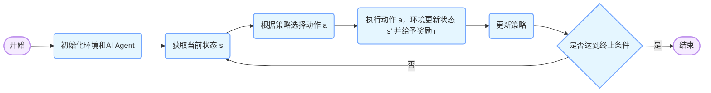

# AI Agent的深度强化学习实现策略

> 关键词：AI Agent、深度强化学习、实现策略、马尔可夫决策过程、策略梯度算法

> 摘要：本文围绕AI Agent的深度强化学习实现策略展开深入探讨。首先介绍了相关背景知识，包括目的范围、预期读者等。接着阐述了核心概念及其联系，分析了深度强化学习背后的核心算法原理，并给出具体操作步骤和Python代码示例。详细讲解了涉及的数学模型和公式，通过实际案例进行说明。然后进行项目实战，从开发环境搭建到源代码实现与解读，为读者呈现完整的实现过程。还探讨了深度强化学习在不同领域的实际应用场景，推荐了学习资源、开发工具框架以及相关论文著作。最后总结了未来发展趋势与挑战，解答常见问题并提供扩展阅读和参考资料，旨在帮助读者全面理解和掌握AI Agent的深度强化学习实现策略。

## 1. 背景介绍 
### 1.1 目的和范围
深度强化学习结合了深度学习的强大表征能力和强化学习的决策能力，使得AI Agent能够在复杂环境中自主学习最优策略。本文的目的是深入探讨AI Agent的深度强化学习实现策略，详细介绍相关的核心概念、算法原理、数学模型以及实际应用。范围涵盖从基础理论到实际项目开发的全过程，旨在为读者提供一个全面且深入的学习指南。

### 1.2 预期读者
本文预期读者包括对人工智能、机器学习领域感兴趣的研究人员、开发者，以及相关专业的学生。无论是初学者希望了解深度强化学习的基本概念和实现方法，还是有一定经验的从业者寻求更深入的技术细节和实践指导，都能从本文中获得有价值的信息。

### 1.3 文档结构概述
本文首先介绍背景知识，为读者建立基础认知。接着阐述核心概念及其联系，帮助读者理解深度强化学习的基本原理。然后详细讲解核心算法原理和具体操作步骤，并给出Python代码示例。之后介绍数学模型和公式，通过举例加深理解。项目实战部分从开发环境搭建到代码实现与解读，展示完整的实现过程。随后探讨实际应用场景，为读者提供实际应用的思路。接着推荐学习资源、开发工具框架和相关论文著作，方便读者进一步学习和研究。最后总结未来发展趋势与挑战，解答常见问题并提供扩展阅读和参考资料。

### 1.4 术语表
#### 1.4.1 核心术语定义
- **AI Agent**：能够感知环境并采取行动以实现特定目标的智能实体。
- **深度强化学习**：将深度学习与强化学习相结合的技术，通过神经网络学习最优策略。
- **马尔可夫决策过程（MDP）**：一种用于描述决策过程的数学模型，具有马尔可夫性。
- **策略梯度算法**：一类通过直接优化策略函数来学习最优策略的算法。

#### 1.4.2 相关概念解释
- **状态（State）**：环境的一种表示，AI Agent根据当前状态做出决策。
- **动作（Action）**：AI Agent在某个状态下可以采取的行为。
- **奖励（Reward）**：环境对AI Agent采取动作的反馈，用于指导学习过程。
- **策略（Policy）**：AI Agent根据当前状态选择动作的规则。

#### 1.4.3 缩略词列表
- **MDP**：马尔可夫决策过程（Markov Decision Process）
- **DQN**：深度Q网络（Deep Q-Network）
- **A2C**：优势演员-评论家算法（Advantage Actor-Critic）
- **PPO**：近端策略优化算法（Proximal Policy Optimization）

## 2. 核心概念与联系 

### 核心概念原理
深度强化学习主要基于马尔可夫决策过程（MDP）。MDP是一个五元组 $(S, A, P, R, \gamma)$，其中：
- $S$ 是状态空间，表示环境的所有可能状态。
- $A$ 是动作空间，表示AI Agent可以采取的所有可能动作。
- $P$ 是状态转移概率函数，$P(s'|s, a)$ 表示在状态 $s$ 采取动作 $a$ 后转移到状态 $s'$ 的概率。
- $R$ 是奖励函数，$R(s, a, s')$ 表示在状态 $s$ 采取动作 $a$ 转移到状态 $s'$ 时获得的奖励。
- $\gamma$ 是折扣因子，用于平衡即时奖励和未来奖励。

AI Agent的目标是学习一个最优策略 $\pi^*$，使得长期累积奖励最大化。策略 $\pi$ 是一个从状态到动作的映射，即 $\pi(a|s)$ 表示在状态 $s$ 下采取动作 $a$ 的概率。

### 架构的文本示意图
```plaintext
环境 <---- 状态 ----> AI Agent
         |                |
         | 奖励           | 动作
         v                v
```
在这个架构中，AI Agent感知环境的状态，根据策略选择动作并执行，环境根据动作更新状态并给予奖励，AI Agent根据奖励调整策略，不断学习以优化性能。

### Mermaid 流程图


## 3. 核心算法原理 & 具体操作步骤 

### 深度Q网络（DQN）算法原理
DQN是一种基于值函数的深度强化学习算法，其核心思想是使用神经网络 $Q(s, a; \theta)$ 来近似最优动作价值函数 $Q^*(s, a)$。动作价值函数 $Q(s, a)$ 表示在状态 $s$ 采取动作 $a$ 后，遵循最优策略所能获得的长期累积奖励。

DQN的目标是最小化损失函数：
$$L(\theta) = \mathbb{E}_{(s, a, r, s') \sim D}[(r + \gamma \max_{a'} Q(s', a'; \theta^-) - Q(s, a; \theta))^2]$$
其中，$D$ 是经验回放缓冲区，$\theta^-$ 是目标网络的参数，目标网络定期从主网络复制参数。

### 具体操作步骤
1. **初始化**：初始化主网络 $Q(s, a; \theta)$ 和目标网络 $Q(s, a; \theta^-)$ 的参数，初始化经验回放缓冲区 $D$。
2. **与环境交互**：在每个时间步 $t$：
    - 获取当前状态 $s_t$。
    - 根据 $\epsilon$-贪心策略选择动作 $a_t$：以概率 $\epsilon$ 随机选择动作，以概率 $1 - \epsilon$ 选择 $Q(s_t, a; \theta)$ 最大的动作。
    - 执行动作 $a_t$，环境返回下一个状态 $s_{t+1}$ 和奖励 $r_t$。
    - 将 $(s_t, a_t, r_t, s_{t+1})$ 存储到经验回放缓冲区 $D$ 中。
3. **经验回放**：从经验回放缓冲区 $D$ 中随机采样一个小批量的数据 $(s, a, r, s')$。
4. **计算目标值**：计算目标值 $y = r + \gamma \max_{a'} Q(s', a'; \theta^-)$。
5. **更新主网络**：使用梯度下降法更新主网络的参数 $\theta$，最小化损失函数 $L(\theta)$。
6. **更新目标网络**：定期将主网络的参数复制到目标网络，即 $\theta^- \leftarrow \theta$。

### Python代码示例
```python
import torch
import torch.nn as nn
import torch.optim as optim
import numpy as np
import random

# 定义Q网络
class QNetwork(nn.Module):
    def __init__(self, input_dim, output_dim):
        super(QNetwork, self).__init__()
        self.fc1 = nn.Linear(input_dim, 64)
        self.fc2 = nn.Linear(64, 64)
        self.fc3 = nn.Linear(64, output_dim)

    def forward(self, x):
        x = torch.relu(self.fc1(x))
        x = torch.relu(self.fc2(x))
        return self.fc3(x)

# 定义DQN代理
class DQNAgent:
    def __init__(self, input_dim, output_dim, learning_rate=0.001, gamma=0.99, epsilon=1.0, epsilon_decay=0.995, epsilon_min=0.01, batch_size=64, memory_size=10000):
        self.input_dim = input_dim
        self.output_dim = output_dim
        self.learning_rate = learning_rate
        self.gamma = gamma
        self.epsilon = epsilon
        self.epsilon_decay = epsilon_decay
        self.epsilon_min = epsilon_min
        self.batch_size = batch_size
        self.memory = []
        self.memory_size = memory_size

        self.model = QNetwork(input_dim, output_dim)
        self.target_model = QNetwork(input_dim, output_dim)
        self.target_model.load_state_dict(self.model.state_dict())
        self.optimizer = optim.Adam(self.model.parameters(), lr=learning_rate)
        self.criterion = nn.MSELoss()

    def remember(self, state, action, reward, next_state, done):
        self.memory.append((state, action, reward, next_state, done))
        if len(self.memory) > self.memory_size:
            self.memory.pop(0)

    def act(self, state):
        if np.random.rand() <= self.epsilon:
            return random.randrange(self.output_dim)
        state = torch.FloatTensor(state).unsqueeze(0)
        q_values = self.model(state)
        action = torch.argmax(q_values).item()
        return action

    def replay(self):
        if len(self.memory) < self.batch_size:
            return
        minibatch = random.sample(self.memory, self.batch_size)
        states, actions, rewards, next_states, dones = zip(*minibatch)

        states = torch.FloatTensor(states)
        actions = torch.LongTensor(actions)
        rewards = torch.FloatTensor(rewards)
        next_states = torch.FloatTensor(next_states)
        dones = torch.FloatTensor(dones)

        q_values = self.model(states)
        next_q_values = self.target_model(next_states)
        max_next_q_values = torch.max(next_q_values, dim=1)[0]

        targets = q_values.clone()
        for i in range(self.batch_size):
            if dones[i]:
                targets[i][actions[i]] = rewards[i]
            else:
                targets[i][actions[i]] = rewards[i] + self.gamma * max_next_q_values[i]

        self.optimizer.zero_grad()
        loss = self.criterion(q_values, targets)
        loss.backward()
        self.optimizer.step()

        if self.epsilon > self.epsilon_min:
            self.epsilon *= self.epsilon_decay

    def update_target_model(self):
        self.target_model.load_state_dict(self.model.state_dict())
```

## 4. 数学模型和公式 & 详细讲解 & 举例说明 

### 马尔可夫决策过程（MDP）
如前文所述，MDP是一个五元组 $(S, A, P, R, \gamma)$。状态转移概率 $P(s'|s, a)$ 描述了在状态 $s$ 采取动作 $a$ 后转移到状态 $s'$ 的概率。奖励函数 $R(s, a, s')$ 表示在状态 $s$ 采取动作 $a$ 转移到状态 $s'$ 时获得的奖励。

### 动作价值函数和状态价值函数
- **动作价值函数**：$Q^\pi(s, a) = \mathbb{E}_{\pi}[\sum_{t=0}^{\infty} \gamma^t r_{t+1} | s_0 = s, a_0 = a]$，表示在状态 $s$ 采取动作 $a$ 后，遵循策略 $\pi$ 所能获得的长期累积奖励的期望。
- **状态价值函数**：$V^\pi(s) = \mathbb{E}_{\pi}[\sum_{t=0}^{\infty} \gamma^t r_{t+1} | s_0 = s]$，表示在状态 $s$ 下，遵循策略 $\pi$ 所能获得的长期累积奖励的期望。

### 贝尔曼方程
动作价值函数和状态价值函数满足贝尔曼方程：
- **动作价值函数的贝尔曼方程**：$Q^\pi(s, a) = \sum_{s'} P(s'|s, a) [R(s, a, s') + \gamma V^\pi(s')]$
- **状态价值函数的贝尔曼方程**：$V^\pi(s) = \sum_{a} \pi(a|s) \sum_{s'} P(s'|s, a) [R(s, a, s') + \gamma V^\pi(s')]$

### 举例说明
考虑一个简单的网格世界环境，AI Agent在一个 $3 \times 3$ 的网格中移动，目标是到达右上角的终点。状态 $s$ 可以用网格的坐标 $(x, y)$ 表示，动作 $a$ 包括上下左右移动。奖励函数可以定义为：到达终点获得 $+10$ 奖励，撞到墙壁获得 $-1$ 奖励，其他情况获得 $0$ 奖励。

假设当前状态 $s = (1, 1)$，动作 $a = \text{右}$，下一个状态 $s' = (2, 1)$。如果到达终点，$R(s, a, s') = 10$；如果撞到墙壁，$R(s, a, s') = -1$；否则 $R(s, a, s') = 0$。

状态转移概率 $P(s'|s, a)$ 在这个简单环境中可以认为是确定性的，即如果动作合法，$P(s'|s, a) = 1$；否则 $P(s'|s, a) = 0$。

根据贝尔曼方程，可以计算动作价值函数和状态价值函数，从而帮助AI Agent选择最优动作。

## 5. 项目实战：代码实际案例和详细解释说明 

### 5.1  开发环境搭建
#### 安装Python
首先确保你已经安装了Python，建议使用Python 3.7及以上版本。可以从Python官方网站（https://www.python.org/downloads/） 下载并安装。

#### 安装必要的库
使用以下命令安装必要的库：
```bash
pip install torch numpy gym
```
- `torch`：PyTorch深度学习框架，用于构建和训练神经网络。
- `numpy`：用于数值计算。
- `gym`：OpenAI Gym是一个用于开发和比较强化学习算法的工具包，提供了各种环境。

### 5.2  源代码详细实现和代码解读
```python
import gym
from dqn_agent import DQNAgent  # 假设前面定义的DQNAgent类保存在dqn_agent.py文件中

# 创建环境
env = gym.make('CartPole-v1')
input_dim = env.observation_space.shape[0]
output_dim = env.action_space.n

# 创建DQN代理
agent = DQNAgent(input_dim, output_dim)

# 训练参数
EPISODES = 1000
MAX_STEPS = 500
TARGET_UPDATE_FREQUENCY = 10

# 训练循环
for episode in range(EPISODES):
    state = env.reset()
    total_reward = 0

    for step in range(MAX_STEPS):
        # 选择动作
        action = agent.act(state)

        # 执行动作
        next_state, reward, done, _ = env.step(action)

        # 存储经验
        agent.remember(state, action, reward, next_state, done)

        # 经验回放
        agent.replay()

        # 更新状态
        state = next_state
        total_reward += reward

        if done:
            break

    # 更新目标网络
    if episode % TARGET_UPDATE_FREQUENCY == 0:
        agent.update_target_model()

    print(f"Episode: {episode}, Total Reward: {total_reward}")

# 关闭环境
env.close()
```
### 代码解读与分析
1. **环境创建**：使用 `gym.make('CartPole-v1')` 创建一个CartPole环境，这是一个经典的强化学习环境，AI Agent的目标是平衡一个杆子。
2. **代理创建**：创建一个 `DQNAgent` 实例，传入环境的输入维度和输出维度。
3. **训练循环**：在每个episode中，重置环境并初始化总奖励。在每个时间步，代理根据当前状态选择动作，执行动作并获取下一个状态和奖励，将经验存储到经验回放缓冲区中，然后进行经验回放更新网络参数。如果达到终止条件，则结束当前episode。
4. **目标网络更新**：定期将主网络的参数复制到目标网络，以提高训练的稳定性。
5. **输出结果**：打印每个episode的总奖励，方便观察训练过程。

## 6. 实际应用场景 
### 游戏领域
深度强化学习在游戏领域有广泛的应用，例如AlphaGo在围棋游戏中击败人类冠军。在电子游戏中，AI Agent可以通过深度强化学习学习最优策略，提高游戏性能。例如，在《星际争霸》等实时战略游戏中，AI Agent可以学习如何管理资源、建造建筑、指挥部队，与人类玩家进行对抗。

### 机器人控制
在机器人控制领域，深度强化学习可以帮助机器人学习如何在复杂环境中完成任务。例如，机器人可以学习如何在未知环境中导航、抓取物体、完成特定的操作任务。通过与环境的交互，机器人可以不断优化自己的策略，提高任务完成的效率和准确性。

### 自动驾驶
自动驾驶汽车需要在复杂的交通环境中做出决策，深度强化学习可以用于训练自动驾驶系统的决策模型。AI Agent可以学习如何根据交通规则、路况和其他车辆的行为选择最优的驾驶策略，提高自动驾驶的安全性和可靠性。

### 金融领域
在金融领域，深度强化学习可以用于投资决策、风险管理等方面。AI Agent可以学习如何根据市场行情、经济数据等信息选择最优的投资组合，最大化投资收益。同时，也可以用于风险评估和管理，帮助金融机构降低风险。

## 7. 工具和资源推荐
### 7.1 学习资源推荐
#### 7.1.1 书籍推荐
- 《Reinforcement Learning: An Introduction》：这是强化学习领域的经典教材，全面介绍了强化学习的基本概念、算法和应用。
- 《Deep Learning》：深度学习领域的权威著作，介绍了深度学习的基本原理、模型和算法。

#### 7.1.2 在线课程
- Coursera上的《Reinforcement Learning Specialization》：由DeepMind的研究人员授课，深入介绍了强化学习的理论和实践。
- edX上的《Introduction to Artificial Intelligence》：涵盖了人工智能的各个方面，包括强化学习。

#### 7.1.3 技术博客和网站
- OpenAI Blog：OpenAI发布的最新研究成果和技术文章。
- DeepMind Blog：DeepMind团队分享的深度强化学习相关的研究和应用。

### 7.2 开发工具框架推荐
#### 7.2.1 IDE和编辑器
- PyCharm：功能强大的Python集成开发环境，提供代码编辑、调试、版本控制等功能。
- Jupyter Notebook：交互式的开发环境，适合进行数据分析和模型训练的实验。

#### 7.2.2 调试和性能分析工具
- TensorBoard：TensorFlow提供的可视化工具，可以用于监控训练过程、可视化模型结构和性能指标。
- PyTorch Profiler：PyTorch提供的性能分析工具，可以帮助开发者找出代码中的性能瓶颈。

#### 7.2.3 相关框架和库
- TensorFlow：Google开发的深度学习框架，提供了丰富的工具和接口，方便开发者构建和训练深度学习模型。
- PyTorch：Facebook开发的深度学习框架，具有动态图的特点，易于使用和调试。
- Stable Baselines3：基于PyTorch的强化学习库，提供了多种预训练的强化学习算法和工具。

### 7.3 相关论文著作推荐
#### 7.3.1 经典论文
- 《Human-level control through deep reinforcement learning》：介绍了深度Q网络（DQN）算法，开创了深度强化学习的先河。
- 《Asynchronous Methods for Deep Reinforcement Learning》：提出了异步优势演员-评论家算法（A3C），提高了深度强化学习的训练效率。

#### 7.3.2 最新研究成果
- 《Proximal Policy Optimization Algorithms》：提出了近端策略优化算法（PPO），是一种高效的策略梯度算法。
- 《Soft Actor-Critic: Off-Policy Maximum Entropy Deep Reinforcement Learning with a Stochastic Actor》：提出了软演员-评论家算法（SAC），结合了最大熵原理和深度强化学习。

#### 7.3.3 应用案例分析
- 《AlphaGo Zero: Learning from scratch》：介绍了AlphaGo Zero如何通过无监督学习在围棋游戏中达到超人类水平。
- 《Deep Reinforcement Learning for Autonomous Driving: A Survey》：对深度强化学习在自动驾驶领域的应用进行了全面的综述。

## 8. 总结：未来发展趋势与挑战
### 未来发展趋势
- **多智能体强化学习**：随着应用场景的复杂化，多个AI Agent之间的协作和竞争将成为研究的热点。例如，在自动驾驶中，多辆车之间需要协同决策；在游戏中，多个玩家之间需要进行策略对抗。
- **结合其他技术**：深度强化学习将与其他技术如计算机视觉、自然语言处理等相结合，实现更复杂的任务。例如，在机器人领域，机器人可以通过视觉感知环境，通过自然语言与人类进行交互。
- **可解释性和安全性**：随着深度强化学习在关键领域的应用，模型的可解释性和安全性将变得越来越重要。研究者将致力于开发可解释的强化学习算法，提高模型的可靠性和安全性。

### 挑战
- **样本效率**：深度强化学习通常需要大量的样本进行训练，这限制了其在一些实际场景中的应用。提高样本效率是当前研究的一个重要方向。
- **环境建模**：在复杂环境中，准确地建模环境的动态和奖励函数是一个挑战。环境的不确定性和噪声会影响AI Agent的学习效果。
- **计算资源需求**：深度强化学习的训练通常需要大量的计算资源，如GPU。如何在有限的计算资源下提高训练效率是一个亟待解决的问题。

## 9. 附录：常见问题与解答
### 问题1：深度强化学习和传统强化学习有什么区别？
传统强化学习通常使用手工特征和表格方法来表示状态和动作价值函数，适用于状态和动作空间较小的问题。深度强化学习则使用神经网络来自动学习特征和表示状态动作价值函数，能够处理高维的状态和动作空间，具有更强的表征能力。

### 问题2：经验回放的作用是什么？
经验回放的作用是打破数据之间的相关性，提高训练的稳定性和效率。在传统的强化学习中，数据是按顺序生成的，数据之间存在很强的相关性，这会导致训练过程不稳定。经验回放通过将经验存储在缓冲区中，随机采样进行训练，减少了数据之间的相关性，提高了训练的效果。

### 问题3：如何选择合适的深度强化学习算法？
选择合适的深度强化学习算法需要考虑多个因素，如问题的复杂度、状态和动作空间的大小、是否需要处理连续动作等。如果问题的状态和动作空间较小，可以考虑使用传统的强化学习算法；如果状态和动作空间较大，可以选择基于深度神经网络的算法，如DQN、A2C、PPO等。对于连续动作空间的问题，可以选择基于策略梯度的算法，如A2C、PPO、SAC等。

## 10. 扩展阅读 & 参考资料
### 扩展阅读
- 《Advanced Deep Learning with Keras》：深入介绍了使用Keras进行深度学习的高级技巧和应用。
- 《Machine Learning Yearning》：由Andrew Ng撰写，分享了机器学习实践中的经验和技巧。

### 参考资料
- Sutton, R. S., & Barto, A. G. (2018). Reinforcement Learning: An Introduction. MIT Press.
- Goodfellow, I., Bengio, Y., & Courville, A. (2016). Deep Learning. MIT Press.
- Mnih, V., et al. (2015). Human-level control through deep reinforcement learning. Nature, 518(7540), 529-533.

作者：AI天才研究院/AI Genius Institute & 禅与计算机程序设计艺术 /Zen And The Art of Computer Programming