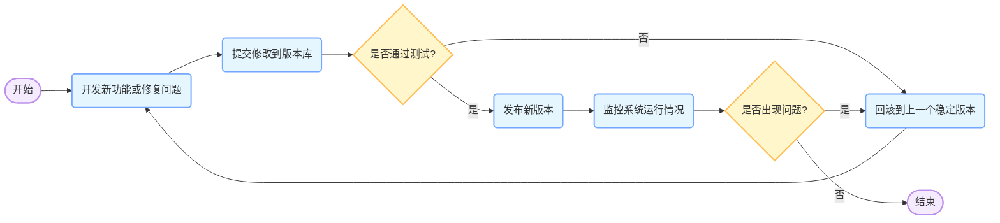

# AI Agent的版本控制与回滚机制：确保稳定运行

> 关键词：AI Agent、版本控制、回滚机制、稳定运行、模型管理

> 摘要：本文围绕AI Agent的版本控制与回滚机制展开深入探讨，旨在解决AI Agent在不断发展和更新过程中如何确保稳定运行的问题。首先介绍了背景信息，包括目的范围、预期读者等。接着阐述了AI Agent版本控制与回滚机制的核心概念和联系，通过文本示意图和Mermaid流程图进行清晰展示。详细讲解了核心算法原理和具体操作步骤，并用Python代码进行阐述。同时给出了相关数学模型和公式，并举例说明。通过项目实战展示了代码实际案例和详细解释。探讨了实际应用场景，推荐了学习资源、开发工具框架和相关论文著作。最后总结了未来发展趋势与挑战，还提供了常见问题解答和扩展阅读参考资料，为保障AI Agent的稳定运行提供全面的技术指导。

## 1. 背景介绍 
### 1.1 目的和范围
在当今的人工智能领域，AI Agent作为一种能够自主执行任务、与环境进行交互的智能实体，正发挥着越来越重要的作用。随着业务需求的不断变化和技术的不断进步，AI Agent需要不断地进行更新和优化。然而，每次更新都可能引入新的问题，导致系统不稳定。因此，建立有效的版本控制与回滚机制对于确保AI Agent的稳定运行至关重要。

本文的范围涵盖了AI Agent版本控制与回滚机制的各个方面，包括核心概念、算法原理、实际应用以及相关工具和资源的推荐等。通过本文的学习，读者将能够深入理解版本控制与回滚机制的原理，并掌握如何在实际项目中实现这些机制。

### 1.2 预期读者
本文预期读者包括人工智能领域的开发者、软件架构师、数据科学家以及对AI Agent技术感兴趣的研究人员。无论您是初学者还是有一定经验的专业人士，都能从本文中获取有价值的信息。对于初学者来说，本文可以帮助您建立对AI Agent版本控制与回滚机制的基本认识；对于有经验的专业人士，本文可以提供更深入的技术细节和实际应用案例，帮助您优化现有的系统。

### 1.3 文档结构概述
本文将按照以下结构进行组织：
- 核心概念与联系：介绍AI Agent版本控制与回滚机制的基本概念和它们之间的联系，并通过文本示意图和Mermaid流程图进行可视化展示。
- 核心算法原理 & 具体操作步骤：详细讲解实现版本控制与回滚机制的核心算法原理，并给出具体的操作步骤，同时用Python代码进行详细阐述。
- 数学模型和公式 & 详细讲解 & 举例说明：建立相关的数学模型和公式，对其进行详细讲解，并通过具体的例子进行说明。
- 项目实战：代码实际案例和详细解释说明：通过一个实际的项目案例，展示如何在代码中实现版本控制与回滚机制，并对代码进行详细解读。
- 实际应用场景：探讨AI Agent版本控制与回滚机制在不同场景下的实际应用。
- 工具和资源推荐：推荐一些学习资源、开发工具框架和相关论文著作，帮助读者进一步深入学习和实践。
- 总结：未来发展趋势与挑战：总结AI Agent版本控制与回滚机制的未来发展趋势，并分析可能面临的挑战。
- 附录：常见问题与解答：解答读者在学习和实践过程中可能遇到的常见问题。
- 扩展阅读 & 参考资料：提供一些扩展阅读的建议和参考资料，方便读者进一步探索相关领域。

### 1.4 术语表
#### 1.4.1 核心术语定义
- **AI Agent**：能够感知环境、做出决策并执行相应动作的智能实体。它可以是一个软件程序、机器人或其他具有智能行为的系统。
- **版本控制**：对软件或系统的不同版本进行管理和跟踪的过程，记录每个版本的修改内容和时间，以便在需要时能够恢复到特定的版本。
- **回滚机制**：当系统出现问题或新的版本引入了错误时，将系统恢复到之前某个稳定版本的功能。
- **模型版本**：指AI Agent所使用的机器学习模型的不同版本，每个版本可能在训练数据、算法参数等方面存在差异。

#### 1.4.2 相关概念解释
- **版本号**：用于唯一标识软件或系统的不同版本的字符串或数字。通常采用语义化版本号，如 `1.2.3`，其中第一个数字表示主版本号，第二个数字表示次版本号，第三个数字表示修订版本号。
- **提交记录**：在版本控制系统中，每次对代码或数据进行修改并保存时所生成的记录，包含了修改的内容、作者、时间等信息。
- **分支**：版本控制系统中用于并行开发的概念，允许开发者在不影响主版本的情况下进行新功能的开发或实验。

#### 1.4.3 缩略词列表
- **VCS**：Version Control System，版本控制系统。
- **ML**：Machine Learning，机器学习。

## 2. 核心概念与联系 

### 核心概念原理
AI Agent的版本控制与回滚机制主要涉及对AI Agent的代码、配置文件、机器学习模型等进行版本管理。版本控制的核心原理是通过记录每次修改的内容和时间，建立一个版本历史记录，使得开发者可以随时查看和恢复到之前的某个版本。回滚机制则是基于版本控制的基础上，当发现新的版本存在问题时，能够快速将系统恢复到之前的稳定版本。

在AI Agent的开发过程中，版本控制可以帮助团队成员协作开发，避免代码冲突，同时也方便对不同版本的AI Agent进行测试和评估。回滚机制则可以在出现紧急情况时，保障系统的稳定性和可靠性。

### 架构的文本示意图
```plaintext
+---------------------+
|  AI Agent Version Control System  |
+---------------------+
| - Version Repository  |
| - Commit History      |
| - Branch Management   |
+---------------------+
|  AI Agent Rollback Mechanism  |
+---------------------+
| - Rollback Trigger   |
| - Rollback Process   |
+---------------------+
|  AI Agent Components  |
+---------------------+
| - Codebase           |
| - Configuration Files|
| - Machine Learning Models |
+---------------------+
```

### Mermaid流程图


## 3. 核心算法原理 & 具体操作步骤 

### 核心算法原理
AI Agent版本控制与回滚机制的核心算法主要基于版本控制系统的原理，常见的版本控制系统如Git采用了分布式版本控制的思想。其核心算法包括以下几个方面：

- **对象存储**：将文件的内容和目录结构存储为对象，每个对象有一个唯一的哈希值。通过哈希值可以快速定位和验证对象的完整性。
- **引用管理**：使用引用（如分支、标签）来指向特定的提交对象，方便开发者管理不同的版本。
- **合并算法**：当多个分支进行合并时，需要使用合并算法来解决冲突。常见的合并算法有三路合并等。

### 具体操作步骤

#### 初始化版本库
```python
import os
import subprocess

# 创建一个新的目录作为版本库
project_dir = 'ai_agent_project'
if not os.path.exists(project_dir):
    os.makedirs(project_dir)

# 初始化Git版本库
subprocess.run(['git', 'init'], cwd=project_dir)
```

#### 添加文件到版本库
```python
# 创建一个示例文件
file_path = os.path.join(project_dir, 'ai_agent_code.py')
with open(file_path, 'w') as f:
    f.write('print("Hello, AI Agent!")')

# 添加文件到暂存区
subprocess.run(['git', 'add', 'ai_agent_code.py'], cwd=project_dir)

# 提交文件到版本库
subprocess.run(['git', 'commit', '-m', 'Initial commit'], cwd=project_dir)
```

#### 创建分支
```python
# 创建一个新的分支
subprocess.run(['git', 'checkout', '-b', 'new_feature'], cwd=project_dir)

# 在新分支上进行修改
with open(file_path, 'a') as f:
    f.write('\nprint("New feature added!")')

# 添加修改并提交
subprocess.run(['git', 'add', 'ai_agent_code.py'], cwd=project_dir)
subprocess.run(['git', 'commit', '-m', 'Add new feature'], cwd=project_dir)
```

#### 合并分支
```python
# 切换回主分支
subprocess.run(['git', 'checkout', 'master'], cwd=project_dir)

# 合并新分支到主分支
subprocess.run(['git', 'merge', 'new_feature'], cwd=project_dir)
```

#### 回滚操作
```python
# 获取上一个提交的哈希值
result = subprocess.run(['git', 'rev-parse', 'HEAD^'], cwd=project_dir, capture_output=True, text=True)
previous_commit = result.stdout.strip()

# 回滚到上一个提交
subprocess.run(['git', 'reset', '--hard', previous_commit], cwd=project_dir)
```

## 4. 数学模型和公式 & 详细讲解 & 举例说明 

### 哈希函数原理
版本控制系统中使用哈希函数来生成对象的唯一标识符。常见的哈希函数如SHA-1，其数学原理可以表示为：

$$H = SHA - 1(M)$$

其中 $M$ 是输入的消息（文件内容），$H$ 是生成的哈希值。哈希函数具有以下特性：

- **确定性**：对于相同的输入，哈希函数总是生成相同的输出。
- **唯一性**：不同的输入生成不同的哈希值的概率非常高。
- **不可逆性**：无法从哈希值反推输入的消息。

### 举例说明
假设我们有一个文件内容为 `Hello, World!`，使用Python的 `hashlib` 库计算其SHA-1哈希值：

```python
import hashlib

message = 'Hello, World!'
hash_object = hashlib.sha1(message.encode())
hash_value = hash_object.hexdigest()
print(f'SHA-1 hash value: {hash_value}')
```

### 三路合并算法
三路合并算法是版本控制系统中常用的合并算法，其基本思想是找到两个分支的共同祖先，然后将两个分支的修改合并到共同祖先的基础上。

设 $A$ 是共同祖先的版本，$B$ 是当前分支的版本，$C$ 是要合并的分支的版本。合并的结果 $R$ 可以通过以下步骤计算：

1. 找出 $A$ 到 $B$ 的修改集合 $\Delta_{AB}$。
2. 找出 $A$ 到 $C$ 的修改集合 $\Delta_{AC}$。
3. 将 $\Delta_{AB}$ 和 $\Delta_{AC}$ 合并到 $A$ 上得到 $R$。

### 举例说明
假设我们有以下三个版本的文件内容：

- 共同祖先版本 $A$：
```plaintext
Line 1
Line 2
Line 3
```

- 当前分支版本 $B$：
```plaintext
Line 1
New Line 2
Line 3
```

- 要合并的分支版本 $C$：
```plaintext
Line 1
Line 2
New Line 3
```

通过三路合并算法，合并的结果 $R$ 为：
```plaintext
Line 1
New Line 2
New Line 3
```

## 5. 项目实战：代码实际案例和详细解释说明 

### 5.1  开发环境搭建
#### 安装Python
确保你已经安装了Python 3.x版本，可以从Python官方网站（https://www.python.org/downloads/） 下载并安装。

#### 安装Git
Git是一个常用的版本控制系统，可以从Git官方网站（https://git-scm.com/downloads） 下载并安装。

#### 创建虚拟环境
为了避免不同项目之间的依赖冲突，建议使用虚拟环境。在命令行中执行以下命令创建并激活虚拟环境：

```bash
python -m venv ai_agent_env
source ai_agent_env/bin/activate  # 对于Windows系统使用 ai_agent_env\Scripts\activate
```

### 5.2  源代码详细实现和代码解读
#### 版本控制类的实现
```python
import os
import subprocess

class AIAgentVersionControl:
    def __init__(self, project_dir):
        self.project_dir = project_dir
        if not os.path.exists(project_dir):
            os.makedirs(project_dir)
        if not os.path.exists(os.path.join(project_dir, '.git')):
            self.init_repository()

    def init_repository(self):
        subprocess.run(['git', 'init'], cwd=self.project_dir)

    def add_file(self, file_path):
        subprocess.run(['git', 'add', file_path], cwd=self.project_dir)

    def commit_changes(self, message):
        subprocess.run(['git', 'commit', '-m', message], cwd=self.project_dir)

    def create_branch(self, branch_name):
        subprocess.run(['git', 'checkout', '-b', branch_name], cwd=self.project_dir)

    def switch_branch(self, branch_name):
        subprocess.run(['git', 'checkout', branch_name], cwd=self.project_dir)

    def merge_branch(self, branch_name):
        subprocess.run(['git', 'merge', branch_name], cwd=self.project_dir)

    def rollback(self):
        result = subprocess.run(['git', 'rev-parse', 'HEAD^'], cwd=self.project_dir, capture_output=True, text=True)
        previous_commit = result.stdout.strip()
        subprocess.run(['git', 'reset', '--hard', previous_commit], cwd=self.project_dir)
```

#### 代码解读
- `__init__` 方法：初始化版本控制类，检查项目目录是否存在，如果不存在则创建。同时检查是否已经初始化了Git版本库，如果没有则调用 `init_repository` 方法进行初始化。
- `init_repository` 方法：使用 `subprocess` 模块调用Git命令初始化版本库。
- `add_file` 方法：将指定的文件添加到暂存区。
- `commit_changes` 方法：将暂存区的修改提交到版本库，并添加提交信息。
- `create_branch` 方法：创建一个新的分支并切换到该分支。
- `switch_branch` 方法：切换到指定的分支。
- `merge_branch` 方法：将指定的分支合并到当前分支。
- `rollback` 方法：回滚到上一个提交版本。

#### 使用示例
```python
# 创建版本控制对象
vc = AIAgentVersionControl('ai_agent_project')

# 添加文件并提交
file_path = 'ai_agent_code.py'
with open(os.path.join(vc.project_dir, file_path), 'w') as f:
    f.write('print("Hello, AI Agent!")')
vc.add_file(file_path)
vc.commit_changes('Initial commit')

# 创建新分支并修改文件
vc.create_branch('new_feature')
with open(os.path.join(vc.project_dir, file_path), 'a') as f:
    f.write('\nprint("New feature added!")')
vc.add_file(file_path)
vc.commit_changes('Add new feature')

# 切换回主分支并合并
vc.switch_branch('master')
vc.merge_branch('new_feature')

# 回滚操作
vc.rollback()
```

### 5.3  代码解读与分析
通过上述代码，我们实现了一个简单的AI Agent版本控制与回滚机制。使用Python的 `subprocess` 模块调用Git命令，封装了版本控制的常用操作，使得开发者可以方便地进行版本管理。

在实际应用中，可以根据具体需求对版本控制类进行扩展，例如添加更多的版本管理功能、集成自动化测试等。同时，需要注意处理Git命令执行过程中可能出现的错误，确保版本控制的稳定性。

## 6. 实际应用场景 
### 模型更新与回滚
在AI Agent中，机器学习模型是核心组成部分。当需要对模型进行更新时，可能会出现新模型的性能不如旧模型的情况。此时，版本控制与回滚机制可以帮助我们快速恢复到之前的稳定模型版本。例如，在一个图像识别的AI Agent中，更新模型后发现识别准确率下降，通过回滚机制可以立即恢复到之前的模型版本，保证系统的正常运行。

### 代码协作开发
在团队开发AI Agent的过程中，多个开发者可能同时对代码进行修改。版本控制可以帮助团队成员协作开发，避免代码冲突。每个开发者可以在自己的分支上进行开发，完成后将分支合并到主分支。如果合并后出现问题，可以通过回滚机制恢复到之前的稳定版本。

### 系统升级与回退
当对AI Agent的系统进行升级时，可能会引入新的问题，如兼容性问题、性能下降等。版本控制与回滚机制可以在出现问题时，将系统快速回退到升级前的版本，减少对业务的影响。例如，在一个智能客服AI Agent中，升级系统后发现与部分客户终端的兼容性出现问题，通过回滚机制可以及时解决问题。

## 7. 工具和资源推荐
### 7.1 学习资源推荐
#### 7.1.1 书籍推荐
- 《Pro Git》：全面介绍了Git版本控制系统的原理和使用方法，是学习版本控制的经典书籍。
- 《Python Machine Learning》：深入讲解了Python在机器学习领域的应用，对于理解AI Agent中的机器学习模型有很大帮助。

#### 7.1.2 在线课程
- Coursera上的 “Machine Learning” 课程：由Andrew Ng教授主讲，是机器学习领域的经典课程，适合初学者入门。
- edX上的 “Introduction to Version Control with Git” 课程：详细介绍了Git的使用方法和版本控制的基本概念。

#### 7.1.3 技术博客和网站
- GitHub官方博客：提供了关于版本控制和开源项目的最新资讯和技术文章。
- Medium上的 “Towards Data Science” 专栏：有很多关于人工智能和机器学习的高质量文章。

### 7.2 开发工具框架推荐
#### 7.2.1 IDE和编辑器
- PyCharm：是一款专业的Python集成开发环境，提供了丰富的代码编辑、调试和版本控制功能。
- Visual Studio Code：轻量级的代码编辑器，支持多种编程语言和插件扩展，也可以很好地集成Git进行版本控制。

#### 7.2.2 调试和性能分析工具
- PDB：Python自带的调试工具，可以帮助开发者定位代码中的问题。
- cProfile：Python的性能分析工具，可以分析代码的执行时间和资源消耗情况。

#### 7.2.3 相关框架和库
- GitPython：Python的Git库，提供了方便的API来操作Git版本库。
- Scikit-learn：Python的机器学习库，提供了丰富的机器学习算法和工具，可用于AI Agent中的模型开发。

### 7.3 相关论文著作推荐
#### 7.3.1 经典论文
- “A Comprehensive Survey on Agent-Based Modeling and Simulation”：对基于代理的建模和仿真进行了全面的综述，对于理解AI Agent的基本概念和应用有很大帮助。
- “Distributed Version Control Systems: A Survey”：对分布式版本控制系统进行了详细的研究和分析。

#### 7.3.2 最新研究成果
- 关注顶级人工智能会议（如NeurIPS、ICML等）上的相关研究成果，了解AI Agent版本控制与回滚机制的最新进展。

#### 7.3.3 应用案例分析
- 一些大型科技公司（如Google、Microsoft等）的技术博客上会分享他们在AI Agent开发和版本管理方面的实际应用案例，可以从中学习到很多实践经验。

## 8. 总结：未来发展趋势与挑战
### 未来发展趋势
- **自动化版本管理**：随着人工智能技术的发展，未来的版本控制与回滚机制可能会更加自动化。例如，通过机器学习算法自动检测代码或模型的变化，并根据预设的规则自动进行版本管理和回滚操作。
- **集成式版本控制**：将版本控制与AI Agent的开发、测试、部署等环节进行深度集成，形成一个完整的工作流。例如，在代码提交时自动触发测试，根据测试结果自动决定是否进行版本发布或回滚。
- **多模态版本管理**：除了代码和模型，未来的版本控制可能会扩展到更多的模态，如数据、配置文件等。同时，对于不同模态的数据进行统一的版本管理和回滚操作。

### 挑战
- **数据安全与隐私**：在版本控制过程中，涉及到大量的代码、模型和数据，如何保障这些数据的安全和隐私是一个重要的挑战。需要采用加密技术、访问控制等手段来确保数据的安全性。
- **复杂系统的版本管理**：随着AI Agent系统的日益复杂，包含多个组件和子系统，版本管理的难度也会相应增加。如何协调不同组件的版本更新和回滚，避免出现兼容性问题是一个亟待解决的问题。
- **实时性要求**：在一些实时性要求较高的应用场景中，如自动驾驶、智能机器人等，版本控制与回滚机制需要满足实时性的要求。如何在保证系统稳定性的前提下，快速进行版本更新和回滚是一个挑战。

## 9. 附录：常见问题与解答
### 问题1：版本控制与备份有什么区别？
版本控制不仅可以保存文件的不同版本，还可以记录每次修改的内容和时间，方便开发者进行协作开发和版本追溯。而备份主要是为了防止数据丢失，通常只是简单地复制文件。

### 问题2：回滚操作会丢失所有的修改吗？
回滚操作会将系统恢复到之前的某个版本，但并不会丢失所有的修改。可以通过查看版本历史记录，找到回滚前的提交，重新进行修改和提交。

### 问题3：如何处理版本冲突？
当出现版本冲突时，需要手动解决冲突。可以使用版本控制系统提供的工具来查看冲突的内容，然后根据实际情况进行修改。解决冲突后，再将修改提交到版本库。

### 问题4：版本控制是否会影响系统的性能？
一般情况下，版本控制不会对系统的性能产生明显的影响。版本控制系统主要是在后台记录文件的修改信息，不会直接参与系统的运行。但是，如果版本库非常大，可能会在进行一些操作（如克隆、拉取等）时消耗较多的时间和资源。

## 10. 扩展阅读 & 参考资料
### 扩展阅读
- 《AI Superpowers: China, Silicon Valley, and the New World Order》：探讨了人工智能在全球的发展趋势和影响。
- 《The Master Algorithm: How the Quest for the Ultimate Learning Machine Will Remake Our World》：介绍了机器学习的核心算法和未来发展方向。

### 参考资料
- Git官方文档：https://git-scm.com/doc
- Python官方文档：https://docs.python.org/3/
- Scikit-learn官方文档：https://scikit-learn.org/stable/documentation.html

作者：AI天才研究院/AI Genius Institute & 禅与计算机程序设计艺术 /Zen And The Art of Computer Programming