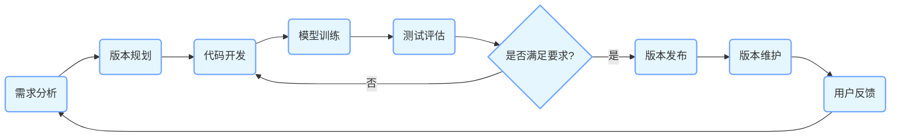

# AI Agent的版本控制与迭代管理

> 关键词：AI Agent、版本控制、迭代管理、模型更新、开发流程

> 摘要：本文围绕AI Agent的版本控制与迭代管理展开深入探讨。详细介绍了AI Agent的相关背景知识，包括目的和范围、预期读者等。阐述了AI Agent版本控制与迭代管理的核心概念、联系及架构，通过Python代码详细讲解了核心算法原理和具体操作步骤。同时，给出了相关的数学模型和公式，并结合实际案例进行说明。还介绍了项目实战中的开发环境搭建、源代码实现与解读，分析了实际应用场景。最后推荐了学习资源、开发工具框架以及相关论文著作，总结了未来发展趋势与挑战，提供了常见问题解答和扩展阅读参考资料，旨在为开发者和研究者在AI Agent的版本控制与迭代管理方面提供全面且深入的指导。

## 1. 背景介绍 
### 1.1 目的和范围
随着人工智能技术的飞速发展，AI Agent在各个领域的应用越来越广泛。AI Agent是一种能够感知环境、自主决策并采取行动以实现特定目标的智能实体。在AI Agent的开发过程中，版本控制与迭代管理至关重要。版本控制可以帮助开发者记录AI Agent的不同版本状态，便于回溯和比较；迭代管理则能够确保AI Agent在不断更新和优化的过程中保持稳定和高效。

本文的范围涵盖了AI Agent版本控制与迭代管理的各个方面，包括核心概念、算法原理、实际应用场景等。旨在为开发者提供一套完整的方法和策略，帮助他们更好地管理AI Agent的开发过程。

### 1.2 预期读者
本文预期读者主要包括AI Agent开发者、人工智能研究者、软件工程师以及对AI Agent开发感兴趣的技术爱好者。对于有一定编程基础和人工智能知识的读者，能够深入理解文中的技术细节和实现方法；对于初学者，也可以通过本文初步了解AI Agent版本控制与迭代管理的重要性和基本原理。

### 1.3 文档结构概述
本文将按照以下结构进行组织：首先介绍核心概念与联系，包括AI Agent版本控制与迭代管理的基本原理和架构；接着详细讲解核心算法原理和具体操作步骤，并给出Python源代码示例；然后介绍相关的数学模型和公式，并通过举例进行说明；之后进行项目实战，包括开发环境搭建、源代码实现和代码解读；再分析实际应用场景；推荐学习资源、开发工具框架和相关论文著作；最后总结未来发展趋势与挑战，提供常见问题解答和扩展阅读参考资料。

### 1.4 术语表
#### 1.4.1 核心术语定义
- **AI Agent**：能够感知环境、自主决策并采取行动以实现特定目标的智能实体。
- **版本控制**：记录软件或系统在不同时间点的状态，以便在需要时可以恢复到之前的版本。
- **迭代管理**：对软件或系统的开发过程进行规划、组织和监控，确保每次迭代都能带来预期的改进。
- **模型更新**：对AI Agent中的机器学习模型进行修改和优化，以提高其性能。

#### 1.4.2 相关概念解释
- **版本号**：用于标识软件或系统的不同版本，通常采用数字和字母的组合，如1.0.0、2.1.3等。
- **分支**：在版本控制系统中，分支是指从主代码库中分离出来的一个独立的开发路径，用于开发新功能或修复问题。
- **合并**：将不同分支上的代码或修改合并到一起，以保持代码库的一致性。

#### 1.4.3 缩略词列表
- **VCS**：Version Control System，版本控制系统。
- **ML**：Machine Learning，机器学习。

## 2. 核心概念与联系 
### 核心概念原理
AI Agent的版本控制与迭代管理主要涉及到对AI Agent的代码、模型和数据的管理。版本控制的核心原理是通过记录每次修改的内容和时间，建立一个完整的历史记录。迭代管理则是通过规划和组织一系列的迭代周期，逐步改进AI Agent的性能。

在版本控制方面，常用的方法是使用版本控制系统（VCS），如Git。Git可以记录文件的修改历史，支持分支和合并操作，方便团队协作开发。在迭代管理方面，通常采用敏捷开发方法，将开发过程划分为多个短周期的迭代，每个迭代都有明确的目标和交付物。

### 架构示意图


这个流程图展示了AI Agent版本控制与迭代管理的主要流程。从需求分析开始，经过版本规划、代码开发、模型训练和测试评估等环节，如果满足要求则进行版本发布，否则回到代码开发阶段进行改进。版本发布后进行版本维护，收集用户反馈，再根据反馈进行新的需求分析，开始新的迭代。

## 3. 核心算法原理 & 具体操作步骤 
### 核心算法原理
在AI Agent的版本控制与迭代管理中，涉及到的核心算法主要包括版本比较算法和模型更新算法。

#### 版本比较算法
版本比较算法用于比较不同版本之间的差异。在Git中，使用的是基于文件内容的差异比较算法。具体来说，Git会将文件的内容进行哈希处理，生成一个唯一的哈希值。当文件发生修改时，哈希值也会发生变化。通过比较不同版本中文件的哈希值，就可以确定哪些文件发生了修改。

以下是一个简单的Python代码示例，用于比较两个文件的内容差异：
```python
import difflib

def compare_files(file1_path, file2_path):
    with open(file1_path, 'r') as file1:
        lines1 = file1.readlines()
    with open(file2_path, 'r') as file2:
        lines2 = file2.readlines()

    diff = difflib.unified_diff(lines1, lines2, fromfile=file1_path, tofile=file2_path)
    for line in diff:
        print(line.strip())

# 示例用法
compare_files('file1.txt', 'file2.txt')
```

#### 模型更新算法
模型更新算法用于更新AI Agent中的机器学习模型。常见的模型更新算法包括增量学习和迁移学习。

增量学习是指在已有模型的基础上，利用新的数据对模型进行更新。例如，在图像分类任务中，当有新的图像数据时，可以使用增量学习算法对已有的分类模型进行微调，而不需要重新训练整个模型。

以下是一个简单的增量学习示例，使用Scikit-learn库中的`partial_fit`方法：
```python
from sklearn.linear_model import SGDClassifier
import numpy as np

# 初始化模型
model = SGDClassifier()

# 模拟训练数据
X_train1 = np.array([[1, 2], [3, 4], [5, 6]])
y_train1 = np.array([0, 1, 0])

# 第一次训练
model.partial_fit(X_train1, y_train1, classes=[0, 1])

# 模拟新的训练数据
X_train2 = np.array([[7, 8], [9, 10]])
y_train2 = np.array([1, 0])

# 增量学习
model.partial_fit(X_train2, y_train2)

# 预测新数据
X_test = np.array([[11, 12]])
prediction = model.predict(X_test)
print("Prediction:", prediction)
```

### 具体操作步骤
#### 版本控制操作步骤
1. **初始化版本库**：在项目开始时，使用Git等版本控制系统初始化一个版本库。
```bash
git init
```
2. **添加文件到版本库**：将项目中的代码、模型和数据等文件添加到版本库中。
```bash
git add.
```
3. **提交修改**：将添加的文件提交到版本库，并记录修改信息。
```bash
git commit -m "Initial commit"
```
4. **创建分支**：为了开发新功能或修复问题，可以创建一个新的分支。
```bash
git branch new_feature
git checkout new_feature
```
5. **合并分支**：当新功能开发完成后，将分支合并到主分支。
```bash
git checkout master
git merge new_feature
```

#### 迭代管理操作步骤
1. **制定迭代计划**：在每个迭代开始前，制定明确的迭代计划，包括迭代目标、交付物和时间安排。
2. **开发和测试**：按照迭代计划进行代码开发和模型训练，并进行测试评估。
3. **版本发布**：如果测试通过，将当前版本发布到生产环境。
4. **收集反馈**：收集用户反馈，分析问题和改进点，为下一次迭代做准备。

## 4. 数学模型和公式 & 详细讲解 & 举例说明 
### 版本控制中的数学模型
在版本控制中，文件的哈希值是一个重要的数学概念。哈希函数是一种将任意长度的输入数据映射为固定长度输出的函数。常见的哈希函数有MD5、SHA-1和SHA-256等。

哈希函数的数学表达式可以表示为：
$$
H(x) = y
$$
其中，$x$ 是输入数据，$y$ 是哈希值，$H$ 是哈希函数。

例如，使用Python的`hashlib`库计算文件的SHA-256哈希值：
```python
import hashlib

def calculate_file_hash(file_path):
    hash_object = hashlib.sha256()
    with open(file_path, 'rb') as file:
        for chunk in iter(lambda: file.read(4096), b""):
            hash_object.update(chunk)
    return hash_object.hexdigest()

# 示例用法
file_hash = calculate_file_hash('file.txt')
print("File hash:", file_hash)
```

### 模型更新中的数学模型
在增量学习中，常用的数学模型是梯度下降算法。梯度下降算法是一种优化算法，用于寻找函数的最小值。在机器学习中，通常使用梯度下降算法来最小化损失函数。

损失函数可以表示为：
$$
L(\theta) = \frac{1}{n} \sum_{i=1}^{n} L(y_i, f(x_i; \theta))
$$
其中，$L(\theta)$ 是损失函数，$\theta$ 是模型的参数，$n$ 是样本数量，$y_i$ 是真实标签，$f(x_i; \theta)$ 是模型的预测值，$L(y_i, f(x_i; \theta))$ 是单个样本的损失。

梯度下降算法的更新公式为：
$$
\theta_{t+1} = \theta_t - \alpha \nabla L(\theta_t)
$$
其中，$\theta_{t+1}$ 是更新后的参数，$\theta_t$ 是当前参数，$\alpha$ 是学习率，$\nabla L(\theta_t)$ 是损失函数的梯度。

以下是一个简单的梯度下降算法示例，用于求解线性回归问题：
```python
import numpy as np

# 生成模拟数据
X = np.array([1, 2, 3, 4, 5])
y = np.array([2, 4, 6, 8, 10])

# 初始化参数
theta = 0
alpha = 0.01
num_iterations = 1000

# 梯度下降算法
for i in range(num_iterations):
    gradient = 2 * np.mean((theta * X - y) * X)
    theta = theta - alpha * gradient

print("Optimal theta:", theta)
```

## 5. 项目实战：代码实际案例和详细解释说明 
### 5.1  开发环境搭建
#### 安装Python
首先，需要安装Python编程语言。可以从Python官方网站（https://www.python.org/downloads/）下载适合自己操作系统的Python版本，并按照安装向导进行安装。

#### 安装Git
Git是一个常用的版本控制系统，可以从Git官方网站（https://git-scm.com/downloads）下载并安装。

#### 安装必要的Python库
在项目中，需要使用一些Python库，如Scikit-learn、NumPy等。可以使用`pip`命令进行安装：
```bash
pip install scikit-learn numpy
```

### 5.2  源代码详细实现和代码解读
以下是一个简单的AI Agent版本控制与迭代管理的项目示例，假设我们要开发一个简单的文本分类AI Agent。

#### 项目结构
```
text_classification_agent/
├── data/
│   ├── train.csv
│   └── test.csv
├── models/
│   └── model.pkl
├── src/
│   ├── data_preprocessing.py
│   ├── model_training.py
│   └── model_evaluation.py
└── main.py
```

#### 代码实现

##### `data_preprocessing.py`
```python
import pandas as pd
from sklearn.feature_extraction.text import TfidfVectorizer

def preprocess_data(file_path):
    data = pd.read_csv(file_path)
    X = data['text']
    y = data['label']

    vectorizer = TfidfVectorizer()
    X = vectorizer.fit_transform(X)

    return X, y

# 示例用法
X_train, y_train = preprocess_data('data/train.csv')
```

##### `model_training.py`
```python
from sklearn.linear_model import LogisticRegression
import joblib

def train_model(X_train, y_train):
    model = LogisticRegression()
    model.fit(X_train, y_train)

    # 保存模型
    joblib.dump(model, 'models/model.pkl')

    return model

# 示例用法
model = train_model(X_train, y_train)
```

##### `model_evaluation.py`
```python
from sklearn.metrics import accuracy_score

def evaluate_model(model, X_test, y_test):
    y_pred = model.predict(X_test)
    accuracy = accuracy_score(y_test, y_pred)
    print("Accuracy:", accuracy)

    return accuracy

# 示例用法
X_test, y_test = preprocess_data('data/test.csv')
evaluate_model(model, X_test, y_test)
```

##### `main.py`
```python
from data_preprocessing import preprocess_data
from model_training import train_model
from model_evaluation import evaluate_model

# 数据预处理
X_train, y_train = preprocess_data('data/train.csv')
X_test, y_test = preprocess_data('data/test.csv')

# 模型训练
model = train_model(X_train, y_train)

# 模型评估
evaluate_model(model, X_test, y_test)
```

### 5.3  代码解读与分析
- **`data_preprocessing.py`**：该文件负责数据预处理，使用`TfidfVectorizer`将文本数据转换为数值特征。
- **`model_training.py`**：该文件负责模型训练，使用逻辑回归模型进行训练，并将训练好的模型保存到文件中。
- **`model_evaluation.py`**：该文件负责模型评估，使用准确率指标评估模型的性能。
- **`main.py`**：该文件是项目的入口，依次调用数据预处理、模型训练和模型评估的函数。

在版本控制方面，可以使用Git对项目代码进行管理。在每次修改代码后，使用`git add`和`git commit`命令将修改提交到版本库。在迭代管理方面，可以根据模型的评估结果，对代码进行改进和优化，然后进行下一次迭代。

## 6. 实际应用场景 
### 智能客服
在智能客服系统中，AI Agent用于自动回答用户的问题。通过版本控制与迭代管理，可以不断优化AI Agent的回答准确率和效率。例如，根据用户的反馈，对AI Agent的模型进行更新，添加新的问答对，提高用户满意度。

### 金融风险评估
在金融领域，AI Agent用于评估客户的信用风险。版本控制与迭代管理可以确保AI Agent的模型始终保持最新和准确。随着金融市场的变化和新数据的出现，可以及时更新模型，提高风险评估的准确性。

### 自动驾驶
在自动驾驶领域，AI Agent用于控制车辆的行驶。版本控制与迭代管理对于确保自动驾驶系统的安全性和可靠性至关重要。通过不断迭代和优化AI Agent的算法和模型，可以提高自动驾驶车辆的性能和安全性。

## 7. 工具和资源推荐
### 7.1 学习资源推荐
#### 7.1.1 书籍推荐
- 《Python机器学习》：介绍了Python在机器学习中的应用，包括各种机器学习算法和模型的实现。
- 《人工智能：一种现代的方法》：全面介绍了人工智能的基本概念、算法和应用，是人工智能领域的经典教材。
- 《Git版本控制管理》：详细介绍了Git的使用方法和原理，对于掌握版本控制非常有帮助。

#### 7.1.2 在线课程
- Coursera上的“机器学习”课程：由斯坦福大学教授Andrew Ng授课，是学习机器学习的经典课程。
- edX上的“人工智能基础”课程：介绍了人工智能的基本概念和算法，适合初学者。
- Udemy上的“Git实战教程”：详细讲解了Git的使用技巧和实际应用。

#### 7.1.3 技术博客和网站
- Medium：上面有很多关于人工智能和版本控制的技术文章和经验分享。
- GitHub官方博客：提供了Git和开源项目的最新动态和技术文章。
- Towards Data Science：专注于数据科学和机器学习领域的技术博客，有很多高质量的文章。

### 7.2 开发工具框架推荐
#### 7.2.1 IDE和编辑器
- PyCharm：一款专门为Python开发设计的集成开发环境，具有强大的代码编辑、调试和版本控制功能。
- Visual Studio Code：一款轻量级的代码编辑器，支持多种编程语言和插件扩展，非常适合快速开发。

#### 7.2.2 调试和性能分析工具
- Py-Spy：一个用于Python程序的性能分析工具，可以帮助开发者找出程序中的性能瓶颈。
- PDB：Python自带的调试器，可以帮助开发者调试Python代码。

#### 7.2.3 相关框架和库
- Scikit-learn：一个常用的机器学习库，提供了各种机器学习算法和工具，方便开发者进行模型训练和评估。
- TensorFlow：一个开源的深度学习框架，广泛应用于图像识别、自然语言处理等领域。
- PyTorch：另一个流行的深度学习框架，具有简洁易用的接口和高效的计算性能。

### 7.3 相关论文著作推荐
#### 7.3.1 经典论文
- “A Survey on Transfer Learning”：介绍了迁移学习的基本概念、方法和应用，是迁移学习领域的经典论文。
- “Gradient-Based Learning Applied to Document Recognition”：介绍了卷积神经网络在手写字符识别中的应用，开创了深度学习在计算机视觉领域的先河。

#### 7.3.2 最新研究成果
- 关注顶级人工智能会议，如NeurIPS、ICML、CVPR等，这些会议上会发表很多关于AI Agent和版本控制的最新研究成果。

#### 7.3.3 应用案例分析
- 一些科技公司的官方博客会分享他们在AI Agent应用中的实践经验和案例分析，如Google、Facebook等。

## 8. 总结：未来发展趋势与挑战
### 未来发展趋势
- **自动化版本控制与迭代管理**：随着人工智能技术的发展，未来可能会出现自动化的版本控制与迭代管理工具，能够自动检测代码和模型的变化，自动进行版本更新和迭代优化。
- **多模态AI Agent的版本管理**：随着多模态人工智能的发展，AI Agent将处理更多类型的数据，如图像、音频、视频等。版本控制与迭代管理需要适应多模态数据的特点，提供更强大的管理功能。
- **与区块链技术的结合**：区块链技术具有去中心化、不可篡改等特点，可以用于提高AI Agent版本控制的安全性和可信度。未来可能会出现基于区块链的版本控制系统。

### 挑战
- **数据隐私和安全问题**：在AI Agent的版本控制与迭代管理中，涉及到大量的数据和模型。如何确保数据的隐私和安全，防止数据泄露和恶意攻击，是一个重要的挑战。
- **模型可解释性问题**：随着AI Agent的模型越来越复杂，模型的可解释性变得越来越重要。在版本控制与迭代管理中，需要考虑如何记录和解释模型的变化，以便开发者和用户能够理解模型的行为。
- **跨团队协作问题**：在大型AI项目中，通常涉及到多个团队的协作。如何协调不同团队之间的开发进度和版本管理，避免冲突和错误，是一个挑战。

## 9. 附录：常见问题与解答
### 问题1：如何选择合适的版本控制系统？
解答：选择合适的版本控制系统需要考虑项目的规模、团队协作方式和个人习惯等因素。对于小型项目，Git是一个不错的选择，它简单易用，支持分布式开发。对于大型项目，可以考虑使用SVN等集中式版本控制系统。

### 问题2：在模型更新时，如何确保模型的稳定性？
解答：在模型更新时，可以采用增量学习和模型融合等方法来确保模型的稳定性。增量学习可以在已有模型的基础上进行更新，避免重新训练整个模型带来的不稳定。模型融合可以将多个模型的预测结果进行综合，提高模型的稳定性和准确性。

### 问题3：如何处理版本控制中的冲突？
解答：当在版本控制中出现冲突时，可以使用版本控制系统提供的冲突解决工具来解决冲突。通常的做法是手动合并冲突的代码，确保合并后的代码能够正常运行。在合并代码前，建议先与团队成员进行沟通，了解冲突的原因和解决方案。

## 10. 扩展阅读 & 参考资料
### 扩展阅读
- 《深度学习》：详细介绍了深度学习的基本原理、算法和应用，对于深入理解AI Agent的模型训练和优化有很大帮助。
- 《敏捷软件开发：原则、模式与实践》：介绍了敏捷开发的原则和方法，对于AI Agent的迭代管理非常有指导意义。

### 参考资料
- Git官方文档：https://git-scm.com/doc
- Scikit-learn官方文档：https://scikit-learn.org/stable/documentation.html
- TensorFlow官方文档：https://www.tensorflow.org/api_docs

作者：AI天才研究院/AI Genius Institute & 禅与计算机程序设计艺术 /Zen And The Art of Computer Programming