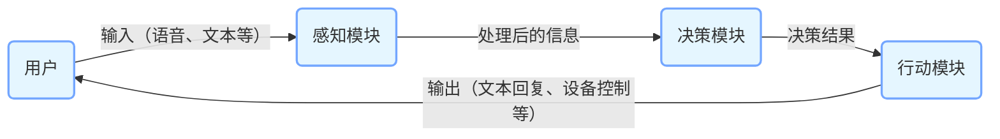

# AI Agent的用户体验设计：提升交互效率与满意度

> 关键词：AI Agent、用户体验设计、交互效率、满意度、自然语言处理

> 摘要：本文聚焦于AI Agent的用户体验设计，旨在探讨如何通过有效的设计方法提升其交互效率与用户满意度。首先介绍了AI Agent用户体验设计的背景信息，包括目的、预期读者、文档结构和相关术语。接着阐述了核心概念及联系，分析了核心算法原理并给出具体操作步骤。通过数学模型和公式深入解释相关原理，并结合实际案例进行说明。在项目实战部分，详细介绍了开发环境搭建、源代码实现与解读。探讨了AI Agent的实际应用场景，推荐了相关的学习资源、开发工具框架和论文著作。最后总结了未来发展趋势与挑战，并提供了常见问题解答和扩展阅读参考资料，为从事AI Agent开发和设计的人员提供全面的指导。

## 1. 背景介绍 
### 1.1 目的和范围
AI Agent作为人工智能领域的重要应用，在诸多场景中得到了广泛使用，如智能客服、智能家居控制等。然而，其用户体验的优劣直接影响着用户的使用意愿和产品的市场竞争力。本文章的目的在于深入探讨AI Agent的用户体验设计，通过对核心概念、算法原理、实际案例等方面的研究，提供一系列提升交互效率与用户满意度的方法和策略。文章的范围涵盖了AI Agent用户体验设计的各个关键环节，包括设计理念、技术实现、应用场景分析等。

### 1.2 预期读者
本文预期读者主要包括人工智能领域的开发者、软件设计师、产品经理以及对AI Agent用户体验设计感兴趣的研究人员。对于开发者来说，可以从文章中获取具体的技术实现细节和优化建议；软件设计师能借鉴相关的设计理念和方法，提升产品的用户体验；产品经理可以了解如何从用户需求出发，设计出更具吸引力的AI Agent产品；研究人员则可以通过本文对AI Agent用户体验设计的现状和未来发展趋势有更深入的认识。

### 1.3 文档结构概述
本文将按照以下结构进行阐述：首先介绍AI Agent用户体验设计的背景信息，包括目的、预期读者、文档结构和相关术语；接着详细讲解核心概念及联系，通过文本示意图和Mermaid流程图进行直观展示；然后分析核心算法原理并给出具体操作步骤，结合Python源代码进行说明；通过数学模型和公式深入解释相关原理，并结合实际案例进行举例说明；在项目实战部分，详细介绍开发环境搭建、源代码实现与解读；探讨AI Agent的实际应用场景；推荐相关的学习资源、开发工具框架和论文著作；最后总结未来发展趋势与挑战，提供常见问题解答和扩展阅读参考资料。

### 1.4 术语表
#### 1.4.1 核心术语定义
- **AI Agent**：即人工智能代理，是一种能够感知环境、自主决策并采取行动以实现特定目标的软件实体。它可以与用户进行交互，处理各种任务，如回答问题、提供建议等。
- **用户体验设计**：以用户为中心，通过设计产品的交互流程、界面布局、功能特性等，使用户在使用产品过程中获得良好的感受和体验，包括易用性、高效性、满意度等方面。
- **交互效率**：指用户与AI Agent进行交互时，完成任务的速度和准确性。高效的交互能够减少用户的操作时间和精力消耗。
- **用户满意度**：反映用户对AI Agent产品的整体评价和感受，包括对产品功能、性能、易用性等方面的满意程度。

#### 1.4.2 相关概念解释
- **自然语言处理（NLP）**：是AI Agent实现与用户自然交互的关键技术，主要研究如何让计算机理解、处理和生成人类语言。包括语言理解、语言生成、文本分类、情感分析等任务。
- **机器学习（ML）**：是一种让计算机通过数据学习模式和规律的技术，AI Agent可以利用机器学习算法不断优化自身的性能和决策能力。常见的机器学习算法包括决策树、神经网络、支持向量机等。
- **对话管理**：负责管理AI Agent与用户之间的对话流程，包括对话状态的跟踪、回复的生成、对话策略的制定等，以确保对话的连贯性和逻辑性。

#### 1.4.3 缩略词列表
- **NLP**：Natural Language Processing（自然语言处理）
- **ML**：Machine Learning（机器学习）
- **RNN**：Recurrent Neural Network（循环神经网络）
- **LSTM**：Long Short-Term Memory（长短期记忆网络）

## 2. 核心概念与联系 

### 核心概念原理
AI Agent的用户体验设计涉及多个核心概念，这些概念相互关联，共同影响着用户与AI Agent的交互效果。

#### AI Agent的基本架构
AI Agent通常由感知模块、决策模块和行动模块组成。感知模块负责接收用户的输入信息，如语音、文本等；决策模块根据感知到的信息进行分析和推理，制定相应的行动策略；行动模块则根据决策结果执行具体的操作，如输出文本回复、控制设备等。

#### 用户体验设计的关键要素
用户体验设计的关键要素包括易用性、高效性、情感化和个性化。易用性要求AI Agent的操作简单易懂，用户能够轻松上手；高效性强调快速准确地响应用户需求，减少用户等待时间；情感化设计旨在让AI Agent能够理解用户的情感状态，并给予适当的回应；个性化则根据用户的偏好和历史交互记录，为用户提供定制化的服务。

### 架构的文本示意图
```plaintext
          用户
           │
           │ 输入（语音、文本等）
           ▼
      ┌───────────┐
      │ 感知模块 │
      └───────────┘
           │
           │ 处理后的信息
           ▼
      ┌───────────┐
      │ 决策模块 │
      └───────────┘
           │
           │ 决策结果
           ▼
      ┌───────────┐
      │ 行动模块 │
      └───────────┘
           │
           │ 输出（文本回复、设备控制等）
           ▼
          用户
```

### Mermaid流程图


## 3. 核心算法原理 & 具体操作步骤 

### 自然语言处理算法原理
自然语言处理是AI Agent与用户进行交互的基础，下面以文本分类算法为例，介绍其核心原理和Python实现。

#### 文本分类算法原理
文本分类是将文本划分为不同类别的任务，常见的算法有朴素贝叶斯算法。朴素贝叶斯算法基于贝叶斯定理，假设特征之间相互独立，通过计算文本属于各个类别的概率，选择概率最大的类别作为分类结果。

### Python源代码实现
```python
import numpy as np
from sklearn.feature_extraction.text import CountVectorizer
from sklearn.naive_bayes import MultinomialNB

# 训练数据
documents = [
    "这是一个关于科技的文章",
    "体育赛事精彩纷呈",
    "科技产品不断创新",
    "体育明星备受关注"
]
labels = ["科技", "体育", "科技", "体育"]

# 文本向量化
vectorizer = CountVectorizer()
X = vectorizer.fit_transform(documents)

# 训练模型
model = MultinomialNB()
model.fit(X, labels)

# 测试数据
test_documents = ["新的科技成果令人瞩目"]
test_X = vectorizer.transform(test_documents)

# 预测结果
predictions = model.predict(test_X)
print("预测结果:", predictions)
```

### 具体操作步骤
1. **数据准备**：收集训练数据和测试数据，对数据进行标注，确定每个文本的类别。
2. **文本向量化**：使用`CountVectorizer`将文本转换为向量表示，以便机器学习算法能够处理。
3. **模型训练**：选择合适的分类算法，如`MultinomialNB`，使用训练数据对模型进行训练。
4. **模型预测**：使用训练好的模型对测试数据进行预测，得到分类结果。

## 4. 数学模型和公式 & 详细讲解 & 举例说明 

### 贝叶斯定理
贝叶斯定理是朴素贝叶斯算法的基础，其公式为：
$$P(A|B) = \frac{P(B|A)P(A)}{P(B)}$$
其中，$P(A|B)$ 表示在事件 $B$ 发生的条件下事件 $A$ 发生的概率，$P(B|A)$ 表示在事件 $A$ 发生的条件下事件 $B$ 发生的概率，$P(A)$ 表示事件 $A$ 发生的先验概率，$P(B)$ 表示事件 $B$ 发生的先验概率。

### 详细讲解
在文本分类中，假设 $C$ 表示类别，$W$ 表示文本中的单词。我们要计算文本属于某个类别的概率 $P(C|W)$，根据贝叶斯定理可以得到：
$$P(C|W) = \frac{P(W|C)P(C)}{P(W)}$$
其中，$P(C)$ 是类别 $C$ 的先验概率，可以通过训练数据中该类别的样本数量除以总样本数量得到；$P(W|C)$ 是在类别 $C$ 下单词 $W$ 出现的概率，可以通过统计该类别中单词 $W$ 出现的次数除以该类别中所有单词出现的总次数得到；$P(W)$ 是单词 $W$ 出现的先验概率，由于对于所有类别都是相同的，在分类时可以忽略。

### 举例说明
假设有两个类别：科技和体育，训练数据如下：
- 科技类文本：["这是一个关于科技的文章", "科技产品不断创新"]
- 体育类文本：["体育赛事精彩纷呈", "体育明星备受关注"]

现在要对文本 "新的科技成果令人瞩目" 进行分类。

#### 计算先验概率
- 科技类的先验概率 $P(科技) = \frac{2}{4} = 0.5$
- 体育类的先验概率 $P(体育) = \frac{2}{4} = 0.5$

#### 计算条件概率
以单词 "科技" 为例：
- 在科技类文本中，"科技" 出现的次数为 2，科技类文本中所有单词出现的总次数为 10，所以 $P(科技|科技) = \frac{2}{10} = 0.2$
- 在体育类文本中，"科技" 出现的次数为 0，体育类文本中所有单词出现的总次数为 8，所以 $P(科技|体育) = \frac{0}{8} = 0$

#### 计算后验概率
由于忽略 $P(W)$，只需要比较 $P(科技|W)$ 和 $P(体育|W)$ 的大小。
对于文本 "新的科技成果令人瞩目"，假设单词 "科技" 是关键特征，计算得到：
- $P(科技|W) \propto P(科技)P(科技|科技) = 0.5 \times 0.2 = 0.1$
- $P(体育|W) \propto P(体育)P(科技|体育) = 0.5 \times 0 = 0$

因为 $P(科技|W) > P(体育|W)$，所以该文本被分类为科技类。

## 5. 项目实战：代码实际案例和详细解释说明 

### 5.1  开发环境搭建
#### 安装Python
首先需要安装Python，建议使用Python 3.7及以上版本。可以从Python官方网站（https://www.python.org/downloads/）下载安装包，按照安装向导进行安装。

#### 安装必要的库
使用`pip`安装项目所需的库，主要包括`numpy`、`scikit-learn`等。打开命令行工具，执行以下命令：
```sh
pip install numpy scikit-learn
```

### 5.2  源代码详细实现和代码解读
以下是一个简单的AI Agent对话系统的Python代码示例：
```python
import numpy as np
from sklearn.feature_extraction.text import TfidfVectorizer
from sklearn.metrics.pairwise import cosine_similarity

# 定义问题和答案列表
questions = [
    "你能做什么",
    "如何使用你",
    "你有什么特点"
]
answers = [
    "我可以回答各种问题，帮助你解决疑惑。",
    "你只需要输入问题，我会尽力给出答案。",
    "我具有快速准确的回答能力，能理解自然语言。"
]

# 文本向量化
vectorizer = TfidfVectorizer()
question_vectors = vectorizer.fit_transform(questions)

def get_answer(user_question):
    # 将用户问题向量化
    user_vector = vectorizer.transform([user_question])
    
    # 计算用户问题与所有问题的相似度
    similarities = cosine_similarity(user_vector, question_vectors)
    
    # 找到相似度最高的问题的索引
    best_index = np.argmax(similarities)
    
    # 返回对应的答案
    return answers[best_index]

# 测试
user_question = "你能做啥"
answer = get_answer(user_question)
print("用户问题:", user_question)
print("回答:", answer)
```

### 5.3  代码解读与分析
1. **数据准备**：定义了问题列表`questions`和对应的答案列表`answers`，作为AI Agent的知识库。
2. **文本向量化**：使用`TfidfVectorizer`将问题列表转换为向量表示，`TfidfVectorizer`可以计算每个单词的TF-IDF值，反映单词在文本中的重要性。
3. **相似度计算**：在`get_answer`函数中，将用户输入的问题向量化，然后使用`cosine_similarity`计算用户问题与所有问题的余弦相似度，找到相似度最高的问题的索引。
4. **答案返回**：根据相似度最高的问题的索引，从答案列表中取出对应的答案并返回。

## 6. 实际应用场景 
### 智能客服
在电商、金融等行业，智能客服AI Agent可以自动回答用户的常见问题，如订单查询、产品咨询等。通过良好的用户体验设计，智能客服能够快速准确地理解用户问题，提供详细的解答，提高用户满意度和服务效率。

### 智能家居控制
AI Agent可以作为智能家居系统的控制中心，用户可以通过语音指令控制家中的智能设备，如灯光、空调、窗帘等。通过优化交互设计，使语音识别更加准确，操作更加便捷，让用户能够轻松享受智能家居带来的便利。

### 教育辅助
在教育领域，AI Agent可以作为学习助手，为学生提供学习资料、解答疑问、进行学习辅导等。例如，智能作业批改、在线答疑等功能，能够帮助学生提高学习效率和学习质量。

### 智能金融服务
金融机构可以利用AI Agent为客户提供个性化的金融服务，如投资建议、风险评估等。通过分析客户的财务状况和投资偏好，AI Agent能够提供针对性的建议，提升客户的金融服务体验。

## 7. 工具和资源推荐
### 7.1 学习资源推荐
#### 7.1.1 书籍推荐
- 《自然语言处理入门》：这本书详细介绍了自然语言处理的基本概念、算法和技术，适合初学者入门。
- 《Python机器学习》：全面介绍了Python在机器学习领域的应用，包括各种机器学习算法的实现和案例分析。
- 《用户体验要素》：从用户体验设计的角度出发，阐述了产品设计的五个层面，对AI Agent的用户体验设计有重要的指导意义。

#### 7.1.2 在线课程
- Coursera上的“Natural Language Processing Specialization”：由顶尖高校的教授授课，系统地介绍了自然语言处理的理论和实践。
- edX上的“Artificial Intelligence”：涵盖了人工智能的各个方面，包括AI Agent的相关知识。
- Udemy上的“User Experience Design Essentials”：专门讲解用户体验设计的原理和方法，对提升AI Agent的用户体验有很大帮助。

#### 7.1.3 技术博客和网站
- Medium：有很多关于人工智能、自然语言处理和用户体验设计的优质文章。
- Towards Data Science：专注于数据科学和机器学习领域，提供了丰富的技术文章和案例分析。
- UX Collective：是一个专注于用户体验设计的社区，分享了很多优秀的设计案例和经验。

### 7.2 开发工具框架推荐
#### 7.2.1 IDE和编辑器
- PyCharm：是一款专业的Python集成开发环境，具有强大的代码编辑、调试和项目管理功能。
- Visual Studio Code：是一款轻量级的代码编辑器，支持多种编程语言，拥有丰富的插件扩展。

#### 7.2.2 调试和性能分析工具
- PDB：Python自带的调试器，可以帮助开发者定位和解决代码中的问题。
- cProfile：Python的性能分析工具，可以分析代码的运行时间和资源消耗情况。

#### 7.2.3 相关框架和库
- NLTK：Natural Language Toolkit，是一个常用的自然语言处理库，提供了丰富的工具和数据集。
- SpaCy：是一个快速、高效的自然语言处理库，具有优秀的性能和易用性。
- TensorFlow：是一个开源的机器学习框架，广泛应用于深度学习领域，可以用于开发AI Agent的深度学习模型。

### 7.3 相关论文著作推荐
#### 7.3.1 经典论文
- “A Mathematical Theory of Communication”：香农的这篇论文奠定了信息论的基础，对自然语言处理和信息交互有重要的影响。
- “Gradient-Based Learning Applied to Document Recognition”：介绍了卷积神经网络在图像识别和文档处理中的应用，对深度学习的发展起到了推动作用。

#### 7.3.2 最新研究成果
- 关注顶级学术会议如ACL（Association for Computational Linguistics）、NIPS（Neural Information Processing Systems）等上发表的关于AI Agent、自然语言处理和用户体验设计的最新研究成果。

#### 7.3.3 应用案例分析
- 一些知名企业的技术博客和研究报告，如Google、Microsoft等公司发布的关于AI Agent应用案例的分析，能够提供实际应用中的经验和教训。

## 8. 总结：未来发展趋势与挑战
### 未来发展趋势
#### 更加智能化和个性化
未来的AI Agent将具备更强的智能水平，能够更好地理解用户的意图和情感，提供更加个性化的服务。通过深度学习和强化学习等技术的不断发展，AI Agent将能够不断学习和优化自身的性能。

#### 多模态交互
除了文本和语音交互，AI Agent将支持更多的交互方式，如手势、表情等多模态交互。这将使交互更加自然和便捷，提升用户体验。

#### 与其他技术的融合
AI Agent将与物联网、大数据、区块链等技术深度融合，拓展应用场景和功能。例如，在智能家居中，AI Agent可以与物联网设备实现更紧密的协同工作。

### 挑战
#### 数据隐私和安全
随着AI Agent收集和处理的用户数据越来越多，数据隐私和安全问题变得尤为重要。如何保护用户的个人信息不被泄露和滥用，是需要解决的关键问题。

#### 语义理解的准确性
虽然自然语言处理技术取得了很大的进展，但在复杂语义理解方面仍然存在挑战。AI Agent需要更好地理解用户的真实意图，避免误解和错误回答。

#### 伦理和法律问题
AI Agent的应用涉及到伦理和法律问题，如责任界定、算法偏见等。如何制定合理的伦理和法律规范，确保AI Agent的健康发展，是一个亟待解决的问题。

## 9. 附录：常见问题与解答
### 如何提高AI Agent的交互效率？
可以通过优化自然语言处理算法，提高语音识别和语义理解的准确性；采用多轮对话管理策略，减少用户的重复输入；对常见问题进行预训练和缓存，快速给出答案等方法来提高交互效率。

### 如何提升用户对AI Agent的满意度？
注重用户体验设计，使界面简洁易用，交互流程顺畅；提高回答的质量和准确性，提供详细、有用的信息；增加情感化设计，让AI Agent能够理解和回应用户的情感；不断收集用户反馈，进行优化和改进。

### AI Agent在处理复杂问题时表现不佳怎么办？
可以考虑采用更强大的深度学习模型，如Transformer架构；增加训练数据的多样性和规模，提高模型的泛化能力；引入外部知识源，如知识库、搜索引擎等，辅助回答复杂问题。

## 10. 扩展阅读 & 参考资料
- 《人工智能：一种现代方法》
- 《深度学习》
- https://www.aclweb.org/anthology/
- https://papers.nips.cc/

作者：AI天才研究院/AI Genius Institute & 禅与计算机程序设计艺术 /Zen And The Art of Computer Programming