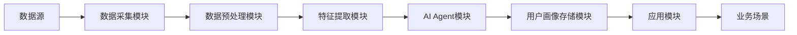

# AI Agent的用户画像动态更新系统

> 关键词：AI Agent、用户画像、动态更新系统、机器学习、数据挖掘

> 摘要：本文围绕AI Agent的用户画像动态更新系统展开，详细阐述了该系统的核心概念、算法原理、数学模型等内容。通过深入剖析系统的工作机制和实现细节，结合实际案例展示了其在实际应用中的效果。同时，提供了相关的学习资源、开发工具以及论文著作推荐，最后对系统的未来发展趋势与挑战进行了总结，并给出常见问题解答和参考资料，旨在为读者全面呈现AI Agent的用户画像动态更新系统的全貌。

## 1. 背景介绍 
### 1.1 目的和范围
在当今数字化时代，大量的用户数据被产生和收集。用户画像作为一种有效管理和利用这些数据的工具，能够帮助企业更好地了解用户需求、行为和偏好，从而提供更个性化的服务和精准的营销。然而，用户的行为和偏好是不断变化的，静态的用户画像无法及时反映这些变化，可能导致企业的决策和服务与用户实际需求脱节。因此，开发AI Agent的用户画像动态更新系统具有重要的现实意义。

本系统的范围涵盖了从用户数据的采集、预处理、特征提取到用户画像的构建、更新和应用的整个流程。旨在实现用户画像的实时或近实时更新，以提高用户画像的准确性和时效性，为企业的决策和服务提供有力支持。

### 1.2 预期读者
本文预期读者包括但不限于人工智能领域的研究人员、软件开发工程师、数据分析师、企业管理人员等。对于希望深入了解用户画像动态更新技术、优化用户服务和营销策略的专业人士具有参考价值。

### 1.3 文档结构概述
本文将按照以下结构进行阐述：首先介绍核心概念与联系，包括相关术语和系统架构；接着详细讲解核心算法原理和具体操作步骤，并结合Python代码进行说明；然后给出数学模型和公式，并举例说明；再通过项目实战展示代码的实际应用和详细解释；之后探讨实际应用场景；推荐相关的工具和资源；总结未来发展趋势与挑战；提供常见问题解答；最后列出扩展阅读和参考资料。

### 1.4 术语表
#### 1.4.1 核心术语定义
- **AI Agent（人工智能代理）**：能够感知环境、进行推理和决策，并采取行动以实现特定目标的智能实体。在本系统中，AI Agent负责对用户数据进行处理和分析，以实现用户画像的动态更新。
- **用户画像**：通过收集和分析用户的各种数据，如基本信息、行为数据、偏好数据等，构建的关于用户特征和行为模式的数字化表示。
- **动态更新系统**：能够根据用户的最新数据，实时或近实时地对用户画像进行更新的系统。

#### 1.4.2 相关概念解释
- **数据采集**：从各种数据源（如网站日志、移动应用、社交媒体等）收集用户数据的过程。
- **数据预处理**：对采集到的原始数据进行清洗、转换和归一化等操作，以提高数据质量和可用性。
- **特征提取**：从预处理后的数据中提取能够反映用户特征和行为模式的关键信息的过程。

#### 1.4.3 缩略词列表
- **ML（Machine Learning）**：机器学习
- **DM（Data Mining）**：数据挖掘
- **API（Application Programming Interface）**：应用程序编程接口

## 2. 核心概念与联系 
### 核心概念原理
用户画像动态更新系统的核心原理是基于AI Agent对用户数据的持续监测和分析。AI Agent通过数据采集模块从各种数据源获取用户的最新数据，经过数据预处理模块对数据进行清洗和转换，然后利用特征提取模块提取用户的关键特征。接着，根据这些特征，使用机器学习或数据挖掘算法对用户画像进行更新。

### 架构的文本示意图
用户画像动态更新系统主要由以下几个模块组成：
1. **数据采集模块**：负责从各种数据源（如网站、移动应用、数据库等）收集用户的原始数据。
2. **数据预处理模块**：对采集到的原始数据进行清洗、去除噪声、填补缺失值、数据转换等操作，以提高数据质量。
3. **特征提取模块**：从预处理后的数据中提取能够反映用户特征和行为模式的关键信息，如用户的兴趣爱好、购买习惯等。
4. **AI Agent模块**：使用机器学习或数据挖掘算法对用户特征进行分析和建模，根据分析结果对用户画像进行更新。
5. **用户画像存储模块**：用于存储用户画像数据，以便后续的查询和使用。
6. **应用模块**：将更新后的用户画像应用于各种业务场景，如个性化推荐、精准营销等。

### Mermaid流程图


## 3. 核心算法原理 & 具体操作步骤 
### 核心算法原理
本系统中使用的核心算法是基于机器学习的分类和聚类算法。分类算法用于将用户划分到不同的类别中，以确定用户的行为模式和偏好；聚类算法用于将具有相似特征的用户聚为一类，以便更好地理解用户群体的特征和行为。

### 具体操作步骤
1. **数据采集**：使用API或爬虫技术从各种数据源收集用户的原始数据，如用户的基本信息、浏览记录、购买记录等。
2. **数据预处理**：
    - **数据清洗**：去除重复数据、无效数据和噪声数据。
    - **数据转换**：将非数值型数据转换为数值型数据，如将用户的性别转换为0或1。
    - **数据归一化**：将数据缩放到一个特定的范围，如[0, 1]，以提高算法的性能。
3. **特征提取**：
    - **选择特征**：根据业务需求和数据特点，选择能够反映用户特征和行为模式的关键特征。
    - **提取特征**：使用特征工程技术，如主成分分析（PCA）、线性判别分析（LDA）等，提取用户的关键特征。
4. **模型训练**：
    - **选择算法**：根据数据特点和业务需求，选择合适的机器学习算法，如决策树、支持向量机、神经网络等。
    - **划分数据集**：将数据集划分为训练集和测试集，用于模型的训练和评估。
    - **训练模型**：使用训练集对模型进行训练，调整模型的参数，以提高模型的性能。
5. **用户画像更新**：
    - **预测用户类别**：使用训练好的模型对用户的最新数据进行预测，确定用户的类别。
    - **更新用户画像**：根据预测结果，更新用户画像中的相关信息，如用户的兴趣爱好、购买习惯等。

### Python源代码实现
```python
import pandas as pd
from sklearn.preprocessing import StandardScaler
from sklearn.model_selection import train_test_split
from sklearn.tree import DecisionTreeClassifier
from sklearn.metrics import accuracy_score

# 数据采集（假设数据已经存储在CSV文件中）
data = pd.read_csv('user_data.csv')

# 数据预处理
# 去除缺失值
data = data.dropna()

# 分离特征和标签
X = data.drop('label', axis=1)
y = data['label']

# 数据归一化
scaler = StandardScaler()
X_scaled = scaler.fit_transform(X)

# 划分数据集
X_train, X_test, y_train, y_test = train_test_split(X_scaled, y, test_size=0.2, random_state=42)

# 模型训练
model = DecisionTreeClassifier()
model.fit(X_train, y_train)

# 模型评估
y_pred = model.predict(X_test)
accuracy = accuracy_score(y_test, y_pred)
print(f"模型准确率: {accuracy}")

# 用户画像更新（假设新数据存储在new_data中）
new_data = pd.read_csv('new_user_data.csv')
new_data = new_data.dropna()
new_X = new_data.drop('label', axis=1)
new_X_scaled = scaler.transform(new_X)
new_pred = model.predict(new_X_scaled)

# 更新用户画像（这里简单打印预测结果）
print(f"新用户的预测类别: {new_pred}")
```

## 4. 数学模型和公式 & 详细讲解 & 举例说明 
### 数学模型
在本系统中，使用的机器学习模型主要是决策树模型。决策树是一种基于树结构进行决策的模型，每个内部节点表示一个特征上的测试，每个分支表示一个测试输出，每个叶节点表示一个类别或值。

### 公式
决策树的构建过程主要基于信息增益（Information Gain）或基尼不纯度（Gini Impurity）。

#### 信息增益
信息增益是衡量特征对分类结果的影响程度的指标，其计算公式为：
$$IG(S, A) = H(S) - \sum_{v \in Values(A)} \frac{|S_v|}{|S|} H(S_v)$$
其中，$IG(S, A)$ 表示特征 $A$ 对数据集 $S$ 的信息增益，$H(S)$ 表示数据集 $S$ 的熵，$S_v$ 表示数据集 $S$ 中特征 $A$ 取值为 $v$ 的子集，$|S|$ 和 $|S_v|$ 分别表示数据集 $S$ 和子集 $S_v$ 的样本数量。

#### 熵
熵是衡量数据集不确定性的指标，其计算公式为：
$$H(S) = -\sum_{i=1}^{n} p_i \log_2 p_i$$
其中，$p_i$ 表示数据集 $S$ 中第 $i$ 类样本的比例，$n$ 表示数据集 $S$ 中类别的数量。

#### 基尼不纯度
基尼不纯度是另一种衡量数据集不确定性的指标，其计算公式为：
$$Gini(S) = 1 - \sum_{i=1}^{n} p_i^2$$
其中，$p_i$ 表示数据集 $S$ 中第 $i$ 类样本的比例，$n$ 表示数据集 $S$ 中类别的数量。

### 详细讲解
在决策树的构建过程中，我们选择信息增益或基尼不纯度最大的特征作为当前节点的划分特征，递归地构建决策树，直到满足停止条件（如所有样本属于同一类别或没有更多特征可供选择）。

### 举例说明
假设我们有一个数据集 $S$，包含 10 个样本，其中 6 个样本属于类别 0，4 个样本属于类别 1。则数据集 $S$ 的熵为：
$$H(S) = -\frac{6}{10} \log_2 \frac{6}{10} - \frac{4}{10} \log_2 \frac{4}{10} \approx 0.971$$
假设我们有一个特征 $A$，其取值为 $v_1$ 和 $v_2$，其中 $S_{v_1}$ 包含 4 个样本，2 个属于类别 0，2 个属于类别 1；$S_{v_2}$ 包含 6 个样本，4 个属于类别 0，2 个属于类别 1。则特征 $A$ 对数据集 $S$ 的信息增益为：
$$IG(S, A) = H(S) - \frac{4}{10} H(S_{v_1}) - \frac{6}{10} H(S_{v_2})$$
其中，$H(S_{v_1}) = -\frac{2}{4} \log_2 \frac{2}{4} - \frac{2}{4} \log_2 \frac{2}{4} = 1$，$H(S_{v_2}) = -\frac{4}{6} \log_2 \frac{4}{6} - \frac{2}{6} \log_2 \frac{2}{6} \approx 0.918$。
$$IG(S, A) = 0.971 - \frac{4}{10} \times 1 - \frac{6}{10} \times 0.918 \approx 0.010$$

## 5. 项目实战：代码实际案例和详细解释说明 
### 5.1  开发环境搭建
1. **安装Python**：建议使用Python 3.7及以上版本，可以从Python官方网站（https://www.python.org/downloads/）下载并安装。
2. **安装必要的库**：使用pip命令安装以下库：
```bash
pip install pandas scikit-learn
```

### 5.2  源代码详细实现和代码解读
```python
import pandas as pd
from sklearn.preprocessing import StandardScaler
from sklearn.model_selection import train_test_split
from sklearn.tree import DecisionTreeClassifier
from sklearn.metrics import accuracy_score

# 数据采集（假设数据已经存储在CSV文件中）
data = pd.read_csv('user_data.csv')

# 数据预处理
# 去除缺失值
data = data.dropna()

# 分离特征和标签
X = data.drop('label', axis=1)
y = data['label']

# 数据归一化
scaler = StandardScaler()
X_scaled = scaler.fit_transform(X)

# 划分数据集
X_train, X_test, y_train, y_test = train_test_split(X_scaled, y, test_size=0.2, random_state=42)

# 模型训练
model = DecisionTreeClassifier()
model.fit(X_train, y_train)

# 模型评估
y_pred = model.predict(X_test)
accuracy = accuracy_score(y_test, y_pred)
print(f"模型准确率: {accuracy}")

# 用户画像更新（假设新数据存储在new_data中）
new_data = pd.read_csv('new_user_data.csv')
new_data = new_data.dropna()
new_X = new_data.drop('label', axis=1)
new_X_scaled = scaler.transform(new_X)
new_pred = model.predict(new_X_scaled)

# 更新用户画像（这里简单打印预测结果）
print(f"新用户的预测类别: {new_pred}")
```
### 代码解读与分析
1. **数据采集**：使用`pandas`库的`read_csv`函数从CSV文件中读取用户数据。
2. **数据预处理**：
    - 使用`dropna`函数去除数据中的缺失值。
    - 使用`drop`函数分离特征和标签。
    - 使用`StandardScaler`类对特征数据进行归一化处理。
3. **数据集划分**：使用`train_test_split`函数将数据集划分为训练集和测试集，测试集占比为20%。
4. **模型训练**：使用`DecisionTreeClassifier`类创建决策树模型，并使用训练集对模型进行训练。
5. **模型评估**：使用`predict`函数对测试集进行预测，并使用`accuracy_score`函数计算模型的准确率。
6. **用户画像更新**：读取新的用户数据，进行预处理后，使用训练好的模型进行预测，并打印预测结果。

## 6. 实际应用场景 
### 个性化推荐
通过动态更新用户画像，系统可以实时了解用户的兴趣爱好和需求，为用户提供更加个性化的推荐服务。例如，电商平台可以根据用户的购买记录和浏览行为，推荐用户可能感兴趣的商品；视频平台可以根据用户的观看历史，推荐用户可能喜欢的视频。

### 精准营销
企业可以根据动态更新的用户画像，对用户进行精准的市场细分和定位，制定更加精准的营销策略。例如，根据用户的消费能力和购买偏好，向用户推送个性化的广告和促销信息，提高营销效果。

### 用户行为预测
通过对用户画像的动态更新和分析，系统可以预测用户的未来行为，为企业的决策提供参考。例如，预测用户的购买意向、流失概率等，帮助企业提前采取措施，提高用户满意度和忠诚度。

## 7. 工具和资源推荐
### 7.1 学习资源推荐
#### 7.1.1 书籍推荐
- 《Python机器学习》：详细介绍了Python在机器学习领域的应用，包括数据预处理、模型训练、评估等方面的内容。
- 《机器学习实战》：通过实际案例介绍了机器学习的基本算法和应用，帮助读者快速掌握机器学习的实践技能。
- 《数据挖掘：概念与技术》：全面介绍了数据挖掘的基本概念、算法和应用，是数据挖掘领域的经典教材。

#### 7.1.2 在线课程
- Coursera上的“机器学习”课程：由斯坦福大学教授Andrew Ng主讲，是机器学习领域的经典在线课程。
- edX上的“数据科学与机器学习微硕士学位课程”：提供了系统的数据分析和机器学习知识体系。
- 中国大学MOOC上的“人工智能基础”课程：介绍了人工智能的基本概念、算法和应用。

#### 7.1.3 技术博客和网站
- Medium：有许多关于人工智能、机器学习和数据挖掘的优质博客文章。
- Towards Data Science：专注于数据科学和机器学习领域的技术分享和讨论。
- Kaggle：是一个数据科学和机器学习竞赛平台，提供了丰富的数据集和代码示例。

### 7.2 开发工具框架推荐
#### 7.2.1 IDE和编辑器
- PyCharm：是一款专业的Python集成开发环境，提供了丰富的代码编辑、调试和管理功能。
- Jupyter Notebook：是一个交互式的开发环境，适合进行数据分析和机器学习实验。
- Visual Studio Code：是一款轻量级的代码编辑器，支持多种编程语言和插件。

#### 7.2.2 调试和性能分析工具
- Py-Spy：是一个性能分析工具，可以帮助开发者找出Python代码中的性能瓶颈。
- PDB：是Python