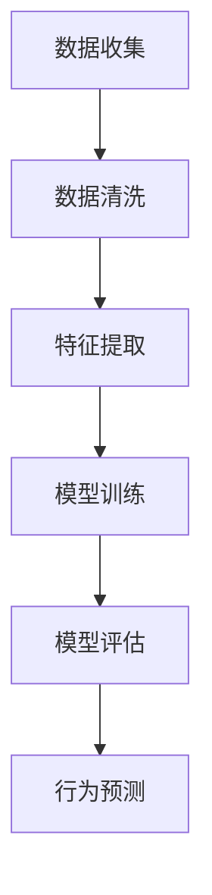

# AI Agent的用户行为分析与预测系统

> 关键词：AI Agent、用户行为分析、用户行为预测、数据分析、机器学习

> 摘要：本文围绕AI Agent的用户行为分析与预测系统展开深入探讨。首先介绍了该系统的背景，包括目的、预期读者、文档结构和相关术语。接着阐述了核心概念与联系，通过文本示意图和Mermaid流程图清晰展示其原理和架构。详细讲解了核心算法原理及具体操作步骤，并使用Python源代码进行说明。给出了系统涉及的数学模型和公式，并举例阐释。通过项目实战，介绍了开发环境搭建、源代码实现及解读。分析了系统的实际应用场景，推荐了学习资源、开发工具框架和相关论文著作。最后总结了未来发展趋势与挑战，提供了常见问题解答和扩展阅读参考资料，旨在为相关领域的研究和实践提供全面而深入的指导。

## 1. 背景介绍 
### 1.1 目的和范围
在当今数字化时代，大量的用户行为数据被产生和记录。AI Agent的用户行为分析与预测系统旨在对这些数据进行有效挖掘和分析，以理解用户的行为模式、偏好和需求。通过对用户行为的准确分析和预测，企业可以更好地进行产品优化、精准营销、个性化推荐等，提高用户满意度和业务效益。

本系统的范围涵盖了从数据收集、清洗、特征提取到模型训练、预测和评估的整个流程。涉及多种数据源，如网站日志、移动应用数据、社交媒体数据等，以及多种数据分析和机器学习技术。

### 1.2 预期读者
本文的预期读者包括数据科学家、机器学习工程师、软件开发者、市场营销人员和对用户行为分析与预测感兴趣的研究人员。对于数据科学家和机器学习工程师，本文提供了详细的算法原理和代码实现，有助于他们在实际项目中应用；对于市场营销人员，能帮助他们理解如何利用用户行为分析结果进行精准营销；对于软件开发者，可借鉴系统的架构和实现思路进行相关系统的开发；对于研究人员，可作为进一步研究的参考。

### 1.3 文档结构概述
本文共分为十个部分。第一部分为背景介绍，阐述了系统的目的、预期读者、文档结构和相关术语。第二部分介绍核心概念与联系，通过文本示意图和Mermaid流程图展示系统的原理和架构。第三部分详细讲解核心算法原理及具体操作步骤，并用Python源代码进行说明。第四部分给出系统涉及的数学模型和公式，并举例说明。第五部分进行项目实战，包括开发环境搭建、源代码实现和解读。第六部分分析系统的实际应用场景。第七部分推荐学习资源、开发工具框架和相关论文著作。第八部分总结未来发展趋势与挑战。第九部分为附录，提供常见问题解答。第十部分给出扩展阅读和参考资料。

### 1.4 术语表
#### 1.4.1 核心术语定义
- **AI Agent**：人工智能代理，是一种能够感知环境、自主决策并执行相应动作的智能实体。在本系统中，可用于模拟用户行为或辅助进行数据分析和预测。
- **用户行为分析**：对用户在特定环境下的行为数据进行收集、整理、分析，以了解用户的行为模式、偏好和需求。
- **用户行为预测**：基于历史用户行为数据，使用机器学习等技术建立模型，对用户未来的行为进行预测。
- **特征提取**：从原始数据中提取出对分析和预测有价值的特征，以便输入到机器学习模型中。
- **模型训练**：使用训练数据对机器学习模型进行参数调整，使其能够学习到数据中的模式和规律。
- **模型评估**：使用测试数据对训练好的模型进行评估，衡量模型的性能和准确性。

#### 1.4.2 相关概念解释
- **数据清洗**：对原始数据进行预处理，去除噪声、缺失值和异常值，以提高数据质量。
- **数据可视化**：将数据分析结果以图表、图形等直观的方式展示出来，便于用户理解和决策。
- **监督学习**：一种机器学习方法，使用带有标签的训练数据进行模型训练，模型学习输入数据与标签之间的映射关系。
- **无监督学习**：一种机器学习方法，使用无标签的训练数据进行模型训练，模型学习数据的内在结构和模式。

#### 1.4.3 缩略词列表
- **ML**：Machine Learning，机器学习
- **DL**：Deep Learning，深度学习
- **KNN**：K-Nearest Neighbors，K近邻算法
- **SVM**：Support Vector Machine，支持向量机
- **LR**：Logistic Regression，逻辑回归
- **RNN**：Recurrent Neural Network，循环神经网络
- **LSTM**：Long Short-Term Memory，长短期记忆网络

## 2. 核心概念与联系 
### 核心概念原理
AI Agent的用户行为分析与预测系统主要基于以下几个核心概念：
- **数据收集**：通过各种渠道收集用户的行为数据，如网站日志、移动应用数据、社交媒体数据等。这些数据可以包括用户的访问时间、浏览页面、购买记录、搜索关键词等。
- **数据清洗**：对收集到的原始数据进行预处理，去除噪声、缺失值和异常值。例如，删除重复的记录、填充缺失的字段、处理异常的数值等。
- **特征提取**：从清洗后的数据中提取出对分析和预测有价值的特征。特征可以是数值型、类别型或文本型。例如，用户的年龄、性别、购买频率、商品类别等。
- **模型训练**：使用提取的特征和相应的标签（如果是监督学习）对机器学习模型进行训练。常见的机器学习模型包括决策树、随机森林、支持向量机、神经网络等。
- **模型评估**：使用测试数据对训练好的模型进行评估，衡量模型的性能和准确性。常用的评估指标包括准确率、召回率、F1值、均方误差等。
- **行为预测**：使用训练好的模型对用户未来的行为进行预测。预测结果可以用于产品优化、精准营销、个性化推荐等。

### 架构的文本示意图
```plaintext
+---------------------+
|     数据收集      |
| （网站日志、应用数据等） |
+---------------------+
           |
           v
+---------------------+
|     数据清洗      |
| （去噪、填充缺失值等） |
+---------------------+
           |
           v
+---------------------+
|     特征提取      |
| （数值、类别、文本特征） |
+---------------------+
           |
           v
+---------------------+
|     模型训练      |
| （决策树、神经网络等） |
+---------------------+
           |
           v
+---------------------+
|     模型评估      |
| （准确率、召回率等） |
+---------------------+
           |
           v
+---------------------+
|     行为预测      |
| （产品优化、营销等） |
+---------------------+
```

### Mermaid流程图


## 3. 核心算法原理 & 具体操作步骤 
### 核心算法原理
在AI Agent的用户行为分析与预测系统中，常用的核心算法包括逻辑回归（LR）、K近邻算法（KNN）和支持向量机（SVM）。下面分别介绍这些算法的原理。

#### 逻辑回归（LR）
逻辑回归是一种用于二分类问题的广义线性模型。它通过逻辑函数（sigmoid函数）将线性回归的输出映射到[0, 1]区间，从而得到一个概率值。逻辑函数的定义如下：
$$\sigma(z)=\frac{1}{1 + e^{-z}}$$
其中，$z$ 是线性回归的输出，即 $z = w_0 + w_1x_1 + w_2x_2 + \cdots + w_nx_n$，$w$ 是模型的权重，$x$ 是输入特征。

逻辑回归的目标是找到一组权重 $w$，使得模型对训练数据的似然函数最大。似然函数可以表示为：
$$L(w)=\prod_{i=1}^{m}P(y^{(i)}|x^{(i)};w)$$
其中，$m$ 是训练数据的数量，$y^{(i)}$ 是第 $i$ 个样本的标签，$x^{(i)}$ 是第 $i$ 个样本的特征向量。

为了方便计算，通常对似然函数取对数，得到对数似然函数：
$$\ell(w)=\log L(w)=\sum_{i=1}^{m}[y^{(i)}\log P(y^{(i)}|x^{(i)};w)+(1 - y^{(i)})\log(1 - P(y^{(i)}|x^{(i)};w))]$$

然后使用梯度下降等优化算法来最大化对数似然函数，从而得到最优的权重 $w$。

#### K近邻算法（KNN）
K近邻算法是一种基于实例的学习方法，它不进行显式的模型训练，而是在预测时直接根据训练数据进行决策。对于一个新的样本，KNN算法会找到训练数据中与其最近的 $K$ 个样本，然后根据这 $K$ 个样本的标签进行投票，决定新样本的标签。

KNN算法的核心是计算样本之间的距离，常用的距离度量方法包括欧氏距离、曼哈顿距离等。欧氏距离的计算公式如下：
$$d(x,y)=\sqrt{\sum_{i=1}^{n}(x_i - y_i)^2}$$
其中，$x$ 和 $y$ 是两个样本的特征向量，$n$ 是特征的数量。

#### 支持向量机（SVM）
支持向量机是一种用于分类和回归分析的监督学习模型。对于二分类问题，SVM的目标是找到一个最优的超平面，将不同类别的样本分开，并且使得超平面到最近样本的距离最大。这个距离称为间隔（margin），具有最大间隔的超平面称为最优超平面。

SVM的优化问题可以表示为：
$$\min_{w,b}\frac{1}{2}\|w\|^2$$
$$\text{s.t. } y_i(w^Tx_i + b)\geq 1, i = 1,2,\cdots,m$$
其中，$w$ 是超平面的法向量，$b$ 是偏置项，$x_i$ 是第 $i$ 个样本的特征向量，$y_i$ 是第 $i$ 个样本的标签，$m$ 是训练数据的数量。

为了处理线性不可分的情况，SVM引入了核函数，将输入特征映射到高维空间，使得在高维空间中样本可以线性可分。常用的核函数包括线性核、多项式核、高斯核等。

### 具体操作步骤及Python源代码
#### 逻辑回归（LR）
```python
import numpy as np
from sklearn.linear_model import LogisticRegression
from sklearn.model_selection import train_test_split
from sklearn.datasets import make_classification

# 生成示例数据
X, y = make_classification(n_samples=1000, n_features=10, n_informative=5, n_redundant=0, random_state=42)

# 划分训练集和测试集
X_train, X_test, y_train, y_test = train_test_split(X, y, test_size=0.2, random_state=42)

# 创建逻辑回归模型
model = LogisticRegression()

# 训练模型
model.fit(X_train, y_train)

# 预测
y_pred = model.predict(X_test)

# 评估模型
accuracy = np.mean(y_pred == y_test)
print(f"逻辑回归模型的准确率: {accuracy}")
```

#### K近邻算法（KNN）
```python
import numpy as np
from sklearn.neighbors import KNeighborsClassifier
from sklearn.model_selection import train_test_split
from sklearn.datasets import make_classification

# 生成示例数据
X, y = make_classification(n_samples=1000, n_features=10, n_informative=5, n_redundant=0, random_state=42)

# 划分训练集和测试集
X_train, X_test, y_train, y_test = train_test_split(X, y, test_size=0.2, random_state=42)

# 创建K近邻模型
model = KNeighborsClassifier(n_neighbors=5)

# 训练模型
model.fit(X_train, y_train)

# 预测
y_pred = model.predict(X_test)

# 评估模型
accuracy = np.mean(y_pred == y_test)
print(f"K近邻模型的准确率: {accuracy}")
```

#### 支持向量机（SVM）
```python
import numpy as np
from sklearn.svm import SVC
from sklearn.model_selection import train_test_split
from sklearn.datasets import make_classification

# 生成示例数据
X, y = make_classification(n_samples=1000, n_features=10, n_informative=5, n_redundant=0, random_state=42)

# 划分训练集和测试集
X_train, X_test, y_train, y_test = train_test_split(X, y, test_size=0.2, random_state=42)

# 创建支持向量机模型
model = SVC(kernel='linear')

# 训练模型
model.fit(X_train, y_train)

# 预测
y_pred = model.predict(X_test)

# 评估模型
accuracy = np.mean(y_pred == y_test)
print(f"支持向量机模型的准确率: {accuracy}")
```

## 4. 数学模型和公式 & 详细讲解 & 举例说明 
### 逻辑回归的数学模型和公式
逻辑回归的数学模型基于线性回归和逻辑函数。线性回归的表达式为：
$$z = w_0 + w_1x_1 + w_2x_2 + \cdots + w_nx_n = w^Tx$$
其中，$w$ 是权重向量，$x$ 是输入特征向量。

逻辑函数将线性回归的输出 $z$ 映射到[0, 1]区间，得到概率值：
$$P(y = 1|x)=\sigma(z)=\frac{1}{1 + e^{-z}}$$
$$P(y = 0|x)=1 - P(y = 1|x)=\frac{e^{-z}}{1 + e^{-z}}$$

对数似然函数为：
$$\ell(w)=\sum_{i=1}^{m}[y^{(i)}\log \sigma(w^Tx^{(i)})+(1 - y^{(i)})\log(1 - \sigma(w^Tx^{(i)}))]$$

梯度下降法是一种常用的优化算法，用于最大化对数似然函数。梯度下降法的更新公式为：
$$w_{j}:=w_{j}+\alpha\frac{\partial \ell(w)}{\partial w_{j}}$$
其中，$\alpha$ 是学习率，$\frac{\partial \ell(w)}{\partial w_{j}}$ 是对数似然函数关于 $w_j$ 的偏导数。

### 举例说明
假设我们有一个二分类问题，特征向量 $x = [x_1, x_2]$，权重向量 $w = [w_0, w_1, w_2]$。线性回归的输出为：
$$z = w_0 + w_1x_1 + w_2x_2$$
假设 $w_0 = 0.1$，$w_1 = 0.2$，$w_2 = 0.3$，$x_1 = 1$，$x_2 = 2$，则：
$$z = 0.1 + 0.2\times1 + 0.3\times2 = 0.9$$
逻辑函数的输出为：
$$P(y = 1|x)=\sigma(z)=\frac{1}{1 + e^{-0.9}}\approx 0.71$$
$$P(y = 0|x)=1 - P(y = 1|x)\approx 0.29$$

### K近邻算法的数学模型和公式
K近邻算法的核心是计算样本之间的距离。欧氏距离的计算公式为：
$$d(x,y)=\sqrt{\sum_{i=1}^{n}(x_i - y_i)^2}$$
曼哈顿距离的计算公式为：
$$d(x,y)=\sum_{i=1}^{n}|x_i - y_i|$$

### 举例说明
假设我们有两个样本 $x = [1, 2]$ 和 $y = [3, 4]$，计算它们之间的欧氏距离和曼哈顿距离。

欧氏距离：
$$d(x,y)=\sqrt{(1 - 3)^2+(2 - 4)^2}=\sqrt{4 + 4}=\sqrt{8}\approx 2.83$$
曼哈顿距离：
$$d(x,y)=|1 - 3|+|2 - 4|=2 + 2 = 4$$

### 支持向量机的数学模型和公式
支持向量机的优化问题可以表示为：
$$\min_{w,b}\frac{1}{2}\|w\|^2$$
$$\text{s.t. } y_i(w^Tx_i + b)\geq 1, i = 1,2,\cdots,m$$

引入拉格朗日乘子 $\alpha_i\geq 0$，得到拉格朗日函数：
$$L(w,b,\alpha)=\frac{1}{2}\|w\|^2-\sum_{i=1}^{m}\alpha_i(y_i(w^Tx_i + b)-1)$$

对 $w$ 和 $b$ 求偏导数并令其为0，得到：
$$\frac{\partial L}{\partial w}=w-\sum_{i=1}^{m}\alpha_iy_ix_i = 0\Rightarrow w=\sum_{i=1}^{m}\alpha_iy_ix_i$$
$$\frac{\partial L}{\partial b}=-\sum_{i=1}^{m}\alpha_iy_i = 0$$

将 $w$ 代入拉格朗日函数，得到对偶问题：
$$\max_{\alpha}\sum_{i=1}^{m}\alpha_i-\frac{1}{2}\sum_{i=1}^{m}\sum_{j=1}^{m}\alpha_i\alpha_jy_iy_jx_i^Tx_j$$
$$\text{s.t. } \sum_{i=1}^{m}\alpha_iy_i = 0, \alpha_i\geq 0, i = 1,2,\cdots,m$$

### 举例说明
假设我们有一个二维的二分类问题，有两个样本 $x_1 = [1, 1]$，$y_1 = 1$ 和 $x_2 = [2, 2]$，$y_2 = -1$。代入对偶问题中进行求解，可以得到最优的拉格朗日乘子 $\alpha_1$ 和 $\alpha_2$，进而得到最优的权重 $w$ 和偏置 $b$。

## 5. 项目实战：代码实际案例和详细解释说明 
### 5.1  开发环境搭建
#### 安装Python
首先需要安装Python，建议使用Python 3.7及以上版本。可以从Python官方网站（https://www.python.org/downloads/）下载并安装。

#### 安装必要的库
使用以下命令安装必要的Python库：
```bash
pip install numpy pandas scikit-learn matplotlib
```
- **numpy**：用于数值计算。
- **pandas**：用于数据处理和分析。
- **scikit-learn**：包含了各种机器学习算法和工具。
- **matplotlib**：用于数据可视化。

### 5.2  源代码详细实现和代码解读
#### 数据加载和预处理
```python
import pandas as pd
from sklearn.preprocessing import StandardScaler
from sklearn.model_selection import train_test_split

# 加载数据
data = pd.read_csv('user_behavior_data.csv')

# 分离特征和标签
X = data.drop('label', axis=1)
y = data['label']

# 数据标准化
scaler = StandardScaler()
X_scaled = scaler.fit_transform(X)

# 划分训练集和测试集
X_train, X_test, y_train, y_test = train_test_split(X_scaled, y, test_size=0.2, random_state=42)
```
代码解读：
- 首先使用 `pandas` 库的 `read_csv` 函数加载用户行为数据。
- 然后将特征和标签分离，`X` 是特征矩阵，`y` 是标签向量。
- 使用 `StandardScaler` 对特征数据进行标准化处理，使得每个特征的均值为0，标准差为1。
- 最后使用 `train_test_split` 函数将数据划分为训练集和测试集，测试集占比为20%。

#### 模型训练和评估
```python
from sklearn.ensemble import RandomForestClassifier
from sklearn.metrics import accuracy_score, classification_report

# 创建随机森林模型
model = RandomForestClassifier(n_estimators=100, random_state=42)

# 训练模型
model.fit(X_train, y_train)

# 预测
y_pred = model.predict(X_test)

# 评估模型
accuracy = accuracy_score(y_test, y_pred)
print(f"随机森林模型的准确率: {accuracy}")

# 打印分类报告
print(classification_report(y_test, y_pred))
```
代码解读：
- 使用 `RandomForestClassifier` 创建随机森林模型，`n_estimators` 表示决策树的数量。
- 使用训练集数据对模型进行训练。
- 使用训练好的模型对测试集数据进行预测。
- 使用 `accuracy_score` 计算模型的准确率。
- 使用 `classification_report` 打印分类报告，包含精确率、召回率、F1值等评估指标。

### 5.3  代码解读与分析
#### 数据预处理的重要性
数据预处理是机器学习项目中非常重要的一步。在本案例中，使用 `StandardScaler` 对特征数据进行标准化处理，这有助于提高模型的性能。因为不同特征的取值范围可能差异很大，如果不进行标准化处理，某些特征可能会对模型的训练产生过大的影响。

#### 随机森林模型的优点
随机森林是一种集成学习方法，它通过组合多个决策树来提高模型的性能和稳定性。随机森林具有以下优点：
- 能够处理高维数据，不需要进行特征选择。
- 对噪声和异常值具有较好的鲁棒性。
- 可以给出特征的重要性排名，有助于理解数据和模型。

#### 模型评估指标的选择
在本案例中，使用了准确率和分类报告来评估模型的性能。准确率是一种常用的评估指标，但在某些情况下，它可能不能很好地反映模型的性能。例如，当数据集存在类别不平衡问题时，准确率可能会受到较大的影响。因此，还需要结合其他评估指标，如精确率、召回率、F1值等，来全面评估模型的性能。

## 6. 实际应用场景 
### 电子商务领域
在电子商务领域，AI Agent的用户行为分析与预测系统可以帮助企业了解用户的购买偏好和需求，从而进行精准营销和个性化推荐。例如，通过分析用户的浏览历史、购买记录、搜索关键词等行为数据，系统可以预测用户可能感兴趣的商品，并向用户推荐相关的商品。此外，系统还可以预测用户的购买时间和购买金额，帮助企业合理安排库存和促销活动。

### 金融领域
在金融领域，该系统可以用于风险评估和信用预测。通过分析用户的交易记录、信用历史、社交网络等行为数据，系统可以评估用户的信用风险和违约概率，帮助金融机构做出更准确的信贷决策。此外，系统还可以预测用户的投资偏好和市场趋势，为投资者提供参考。

### 社交媒体领域
在社交媒体领域，系统可以分析用户的社交行为和兴趣偏好，进行精准广告投放和内容推荐。例如，通过分析用户的关注列表、点赞、评论等行为数据，系统可以了解用户的兴趣爱好，并向用户推送相关的广告和内容。此外，系统还可以预测用户的社交影响力和传播能力，帮助企业进行品牌推广和营销活动。

### 医疗领域
在医疗领域，该系统可以用于疾病预测和健康管理。通过分析患者的病历数据、体检数据、生活习惯等行为数据，系统可以预测患者患某种疾病的概率，并提供相应的预防和治疗建议。此外，系统还可以监测患者的健康状况，及时发现异常情况并提醒医生和患者。

## 7. 工具和资源推荐
### 7.1 学习资源推荐
#### 7.1.1 书籍推荐
- 《机器学习》（周志华著）：这本书全面介绍了机器学习的基本概念、算法和应用，是机器学习领域的经典教材。
- 《深度学习》（Ian Goodfellow、Yoshua Bengio和Aaron Courville著）：这本书系统地介绍了深度学习的理论和实践，适合对深度学习感兴趣的读者。
- 《Python数据分析实战》（Sebastian Raschka著）：这本书通过实际案例介绍了Python在数据分析中的应用，包括数据处理、可视化和机器学习等方面。

#### 7.1.2 在线课程
- Coursera上的“机器学习”课程（Andrew Ng教授授课）：这是一门非常经典的机器学习课程，适合初学者入门。
- edX上的“深度学习”课程（由多家知名高校联合授课）：该课程深入介绍了深度学习的原理和应用。
- 中国大学MOOC上的“Python语言程序设计”课程（嵩天教授授课）：适合初学者学习Python编程。

#### 7.1.3 技术博客和网站
- Medium：这是一个技术博客平台，上面有很多关于机器学习、数据分析等领域的优秀文章。
- Towards Data Science：专注于数据科学和机器学习领域的博客，提供了很多实用的教程和案例。
- Kaggle：一个数据科学竞赛平台，上面有很多数据集和优秀的解决方案，可以学习到很多实战经验。

### 7.2 开发工具框架推荐
#### 7.2.1 IDE和编辑器
- PyCharm：一款功能强大的Python集成开发环境，适合专业的Python开发者。
- Jupyter Notebook：一种交互式的开发环境，适合进行数据探索和模型实验。
- Visual Studio Code：一款轻量级的代码编辑器，支持多种编程语言，并且有丰富的扩展插件。

#### 7.2.2 调试和性能分析工具
- pdb：Python自带的调试器，可以帮助开发者定位代码中的问题。
- cProfile：Python的性能分析工具，可以分析代码的运行时间和内存使用情况。
- TensorBoard：TensorFlow的可视化工具，可以用于可视化模型的训练过程和性能指标。

#### 7.2.3 相关框架和库
- TensorFlow：一个开源的深度学习框架，广泛应用于图像识别、自然语言处理等领域。
- PyTorch：另一个流行的深度学习框架，具有动态图的特点，易于使用和调试。
- Scikit-learn：一个简单易用的机器学习库，包含了各种机器学习算法和工具。

### 7.3 相关论文著作推荐
#### 7.3.1 经典论文
- “A Decision-Theoretic Generalization of On-Line Learning and an Application to Boosting”（Yoav Freund和Robert E. Schapire著）：介绍了AdaBoost算法的原理和应用。
- “Support-Vector Networks”（Corinna Cortes和Vladimir Vapnik著）：奠定了支持向量机的理论基础。
- “Gradient-Based Learning Applied to Document Recognition”（Yann LeCun、Léon Bottou、Yoshua Bengio和Patrick Haffner著）：介绍了卷积神经网络（CNN）在图像识别中的应用。

#### 7.3.2 最新研究成果
- 可以关注NeurIPS、ICML、CVPR等顶级机器学习和计算机视觉会议的论文，了解最新的研究成果。
- arXiv.org是一个预印本平台，上面有很多最新的研究论文，可以及时了解领域的前沿动态。

#### 7.3.3 应用案例分析
- 可以参考Kaggle上的优秀解决方案，了解如何将机器学习技术应用到实际问题中。
- 一些大型科技公司的技术博客，如Google AI Blog、Facebook AI Research等，会分享他们在实际项目中的应用案例和经验。

## 8. 总结：未来发展趋势与挑战
### 未来发展趋势
#### 多模态数据融合
随着技术的发展，用户行为数据的形式越来越多样化，包括文本、图像、音频、视频等多模态数据。未来的AI Agent用户行为分析与预测系统将更加注重多模态数据的融合，以更全面地了解用户的行为和需求。

#### 强化学习的应用
强化学习是一种通过智能体与环境进行交互来学习最优策略的机器学习方法。未来，强化学习可能会在用户行为分析与预测系统中得到更广泛的应用，例如通过强化学习来优化推荐策略，提高用户的满意度和参与度。

#### 边缘计算与云计算的结合
边缘计算可以在设备端进行数据处理和分析，减少数据传输延迟和带宽需求。未来的系统可能会将边缘计算与云计算相结合，在设备端进行实时的用户行为分析和预测，同时将重要的数据和模型上传到云端进行进一步的处理和优化。

### 挑战
#### 数据隐私和安全
用户行为数据包含了大量的个人隐私信息，如何在保护用户隐私的前提下进行数据的收集、分析和预测是一个重要的挑战。需要采用更加安全可靠的技术和方法，如差分隐私、同态加密等，来确保数据的隐私和安全。

#### 模型的可解释性
许多机器学习模型，如深度学习模型，是黑盒模型，难以解释其决策过程和结果。在一些应用场景中，如金融、医疗等，模型的可解释性非常重要。因此，如何提高模型的可解释性是未来需要解决的一个挑战。

#### 数据质量和标注问题
用户行为数据往往存在噪声、缺失值和异常值等问题，需要进行数据清洗和预处理。此外，对于一些监督学习任务，需要大量的标注数据，而数据标注是一项耗时耗力的工作。如何提高数据质量和标注效率是一个需要解决的问题。

## 9. 附录：常见问题与解答
### 问题1：如何选择合适的机器学习算法？
解答：选择合适的机器学习算法需要考虑多个因素，包括数据的特点（如数据类型、数据规模、特征数量等）、问题的类型（如分类、回归、聚类等）、模型的性能要求（如准确率、召回率、F1值等）以及计算资源的限制等。可以通过尝试不同的算法，并使用交叉验证等方法来评估模型的性能，从而选择最合适的算法。

### 问题2：如何处理数据中的缺失值？
解答：处理数据中的缺失值有多种方法，常见的方法包括删除含有缺失值的记录、填充缺失值（如使用均值、中位数、众数等进行填充）、使用插值方法进行填充、使用机器学习模型进行预测填充等。具体选择哪种方法需要根据数据的特点和问题的要求来决定。

### 问题3：如何评估模型的性能？
解答：评估模型的性能需要使用合适的评估指标。对于分类问题，常用的评估指标包括准确率、精确率、召回率、F1值等；对于回归问题，常用的评估指标包括均方误差、平均绝对误差、决定系数等。此外，还可以使用交叉验证等方法来评估模型的稳定性和泛化能力。

### 问题4：如何避免过拟合和欠拟合？
解答：避免过拟合和欠拟合可以采取以下措施：
- 过拟合：增加训练数据的数量、使用正则化方法（如L1、L2正则化）、减少模型的复杂度（如减少神经网络的层数和神经元数量）、使用早停策略等。
- 欠拟合：增加模型的复杂度（如增加特征数量、使用更复杂的模型）、调整模型的超参数等。

## 10. 扩展阅读 & 参考资料
### 扩展阅读
- 《人工智能：一种现代的方法》（Stuart Russell和Peter Norvig著）：全面介绍了人工智能的基本概念、算法和应用。
- 《数据挖掘：概念与技术》（Jiawei Han、Jian Pei和Jianwen Yin著）：系统地介绍了数据挖掘的理论和方法。
- 《自然语言处理入门》（何晗著）：适合初学者了解自然语言处理的基本概念和技术。

### 参考资料
- 相关的学术论文和研究报告。
- 各开源框架和库的官方文档，如TensorFlow、PyTorch、Scikit-learn等。
- 互联网上的技术博客和论坛，如Stack Overflow等。

作者：AI天才研究院/AI Genius Institute & 禅与计算机程序设计艺术 /Zen And The Art of Computer Programming