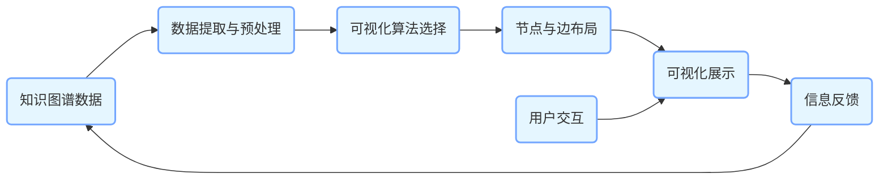

# AI Agent的知识图谱可视化技术

> 关键词：AI Agent、知识图谱、可视化技术、图数据、信息展示

> 摘要：本文围绕AI Agent的知识图谱可视化技术展开深入探讨。首先介绍了该技术的背景，包括目的、预期读者、文档结构和相关术语。接着阐述了核心概念与联系，用示意图和流程图展示其架构。详细讲解了核心算法原理，并用Python代码进行说明，同时给出数学模型和公式并举例。通过项目实战展示了开发环境搭建、源代码实现与解读。分析了该技术的实际应用场景，推荐了学习资源、开发工具框架和相关论文著作。最后总结了未来发展趋势与挑战，并提供常见问题解答和扩展阅读参考资料，旨在帮助读者全面了解和掌握AI Agent的知识图谱可视化技术。

## 1. 背景介绍 
### 1.1 目的和范围
AI Agent的知识图谱可视化技术的目的在于将知识图谱中复杂的信息以直观的图形方式呈现出来，帮助用户更好地理解知识图谱的结构、实体之间的关系以及数据的内在逻辑。其范围涵盖了从知识图谱的构建、数据提取到可视化展示的整个流程，包括选择合适的可视化算法、工具和交互方式，以满足不同用户在不同场景下对知识图谱信息的获取和分析需求。

### 1.2 预期读者
本文的预期读者包括从事人工智能、知识图谱、数据可视化等领域的研究人员、开发人员和工程师，以及对知识图谱可视化技术感兴趣的学生和爱好者。对于那些希望利用知识图谱解决实际问题，如智能搜索、推荐系统、决策支持等的业务人员也具有一定的参考价值。

### 1.3 文档结构概述
本文首先介绍了AI Agent的知识图谱可视化技术的背景信息，为读者提供必要的基础。接着详细阐述核心概念与联系，让读者了解该技术的基本原理和架构。核心算法原理和具体操作步骤部分通过Python代码深入讲解了实现方法。数学模型和公式部分给出了相关的理论支持并举例说明。项目实战部分展示了如何在实际项目中应用该技术，包括开发环境搭建、代码实现和解读。实际应用场景分析了该技术在不同领域的应用。工具和资源推荐部分为读者提供了学习和开发所需的资料。最后总结了未来发展趋势与挑战，解答了常见问题，并提供了扩展阅读和参考资料。

### 1.4 术语表
#### 1.4.1 核心术语定义
- **AI Agent**：人工智能代理，是一种能够感知环境、做出决策并采取行动以实现特定目标的智能实体。
- **知识图谱**：一种语义网络，用于表示实体之间的关系和知识，通常以图的形式存储，包含节点（实体）和边（关系）。
- **可视化技术**：将数据或信息以图形、图像等直观的形式展示出来，以便用户更易于理解和分析。

#### 1.4.2 相关概念解释
- **图数据**：以图的结构表示的数据，由节点和边组成，节点表示实体，边表示实体之间的关系。
- **布局算法**：用于确定知识图谱中节点和边在可视化界面上的位置，使图的结构更加清晰和易于理解。

#### 1.4.3 缩略词列表
- **KG**：Knowledge Graph，知识图谱
- **AI**：Artificial Intelligence，人工智能

## 2. 核心概念与联系 

### 核心概念原理
AI Agent的知识图谱可视化技术主要基于知识图谱的数据结构和可视化算法。知识图谱是一种语义网络，它将现实世界中的实体及其关系以图的形式表示出来。在知识图谱中，节点代表实体，如人、地点、事件等，边代表实体之间的关系，如“属于”、“关联”等。

可视化技术则是将知识图谱中的节点和边以图形的方式展示出来，使用户能够直观地看到知识图谱的结构和实体之间的关系。为了实现这一目标，需要选择合适的布局算法，如力导向布局、层次布局等，来确定节点和边在可视化界面上的位置。

### 架构示意图


### 解释
- **知识图谱数据**：是整个可视化过程的基础，包含了丰富的实体和关系信息。
- **数据提取与预处理**：从知识图谱中提取需要可视化的数据，并进行清洗、转换等预处理操作。
- **可视化算法选择**：根据知识图谱的特点和用户需求，选择合适的可视化算法，如力导向布局、层次布局等。
- **节点与边布局**：使用选定的可视化算法确定节点和边在可视化界面上的位置。
- **可视化展示**：将布局好的节点和边以图形的方式展示给用户。
- **用户交互**：用户可以通过交互操作，如缩放、平移、点击等，获取更多的信息。
- **信息反馈**：用户的交互操作会产生信息反馈，这些信息可以用于更新知识图谱数据或调整可视化展示。

## 3. 核心算法原理 & 具体操作步骤 

### 力导向布局算法原理
力导向布局算法是一种常用的知识图谱可视化布局算法，其基本思想是将节点看作是带电粒子，边看作是弹簧。节点之间存在排斥力，边对节点产生吸引力，通过模拟这些力的作用，使节点在可视化界面上达到一种平衡状态。

### Python代码实现
```python
import networkx as nx
import matplotlib.pyplot as plt

# 创建一个简单的知识图谱图
G = nx.Graph()
G.add_nodes_from([1, 2, 3, 4])
G.add_edges_from([(1, 2), (2, 3), (3, 4), (4, 1)])

# 使用力导向布局算法进行布局
pos = nx.spring_layout(G)

# 绘制知识图谱
nx.draw_networkx_nodes(G, pos, node_color='lightblue', node_size=500)
nx.draw_networkx_edges(G, pos, edge_color='gray')
nx.draw_networkx_labels(G, pos, font_size=12, font_family='sans-serif')

# 显示图形
plt.axis('off')
plt.show()
```

### 代码解释
1. **导入必要的库**：`networkx` 是一个用于创建、操作和研究复杂网络的Python库，`matplotlib.pyplot` 是一个用于绘制图形的Python库。
2. **创建知识图谱图**：使用 `nx.Graph()` 创建一个无向图，并添加节点和边。
3. **使用力导向布局算法进行布局**：`nx.spring_layout(G)` 使用力导向布局算法计算节点的位置。
4. **绘制知识图谱**：使用 `nx.draw_networkx_nodes()`、`nx.draw_networkx_edges()` 和 `nx.draw_networkx_labels()` 分别绘制节点、边和标签。
5. **显示图形**：使用 `plt.axis('off')` 关闭坐标轴，然后使用 `plt.show()` 显示图形。

### 具体操作步骤
1. **数据准备**：从知识图谱中提取需要可视化的数据，并将其转换为图的表示形式。
2. **选择布局算法**：根据知识图谱的特点和用户需求，选择合适的布局算法，如力导向布局、层次布局等。
3. **计算节点位置**：使用选定的布局算法计算节点在可视化界面上的位置。
4. **绘制图形**：根据计算得到的节点位置，使用绘图工具绘制节点和边。
5. **添加交互功能**：为可视化图形添加交互功能，如缩放、平移、点击等，使用户能够更好地探索知识图谱。

## 4. 数学模型和公式 & 详细讲解 & 举例说明 

### 力导向布局算法的数学模型
力导向布局算法的数学模型基于牛顿力学，节点之间的排斥力和边对节点的吸引力可以用以下公式表示：

#### 排斥力公式
$$F_{repel}(i, j) = \frac{C_{repel}}{d(i, j)^2} \cdot \frac{\vec{r}_{ij}}{|\vec{r}_{ij}|}$$

其中，$F_{repel}(i, j)$ 表示节点 $i$ 和节点 $j$ 之间的排斥力，$C_{repel}$ 是排斥力系数，$d(i, j)$ 是节点 $i$ 和节点 $j$ 之间的距离，$\vec{r}_{ij}$ 是从节点 $i$ 到节点 $j$ 的向量。

#### 吸引力公式
$$F_{attract}(i, j) = C_{attract} \cdot \ln(d(i, j)) \cdot \frac{\vec{r}_{ij}}{|\vec{r}_{ij}|}$$

其中，$F_{attract}(i, j)$ 表示边 $(i, j)$ 对节点 $i$ 和节点 $j$ 的吸引力，$C_{attract}$ 是吸引力系数。

#### 合力公式
节点 $i$ 受到的合力为：

$$F_{total}(i) = \sum_{j \neq i} F_{repel}(i, j) + \sum_{(i, j) \in E} F_{attract}(i, j)$$

其中，$E$ 是图的边集。

### 详细讲解
排斥力公式表明，节点之间的距离越近，排斥力越大，这使得节点之间保持一定的距离，避免重叠。吸引力公式表明，边的长度越短，吸引力越大，这使得相连的节点靠近。合力公式将所有的排斥力和吸引力相加，得到节点受到的总力。

### 举例说明
假设有一个简单的知识图谱，包含三个节点 $A$、$B$ 和 $C$，节点之间的连接关系为 $(A, B)$ 和 $(B, C)$。

- **初始状态**：节点 $A$、$B$ 和 $C$ 随机分布在可视化界面上。
- **计算排斥力**：计算节点 $A$ 和节点 $B$、节点 $A$ 和节点 $C$、节点 $B$ 和节点 $C$ 之间的排斥力。
- **计算吸引力**：计算边 $(A, B)$ 和边 $(B, C)$ 对节点的吸引力。
- **计算合力**：根据合力公式计算节点 $A$、$B$ 和 $C$ 受到的合力。
- **更新节点位置**：根据合力更新节点的位置，重复上述步骤，直到节点达到平衡状态。

## 5. 项目实战：代码实际案例和详细解释说明 

### 5.1  开发环境搭建
#### 安装Python
首先需要安装Python，可以从Python官方网站（https://www.python.org/downloads/）下载适合自己操作系统的Python版本，并按照安装向导进行安装。

#### 安装必要的库
使用 `pip` 命令安装必要的库，包括 `networkx` 和 `matplotlib`：
```sh
pip install networkx matplotlib
```

### 5.2  源代码详细实现和代码解读
```python
import networkx as nx
import matplotlib.pyplot as plt

# 创建一个更复杂的知识图谱图
G = nx.Graph()

# 添加节点
nodes = ['Apple', 'Banana', 'Cherry', 'Dog', 'Elephant']
G.add_nodes_from(nodes)

# 添加边
edges = [('Apple', 'Banana'), ('Banana', 'Cherry'), ('Dog', 'Elephant')]
G.add_edges_from(edges)

# 使用力导向布局算法进行布局
pos = nx.spring_layout(G)

# 绘制知识图谱
nx.draw_networkx_nodes(G, pos, node_color='lightgreen', node_size=800)
nx.draw_networkx_edges(G, pos, edge_color='darkgray')
nx.draw_networkx_labels(G, pos, font_size=14, font_family='sans-serif')

# 显示图形
plt.axis('off')
plt.title('Knowledge Graph Visualization')
plt.show()
```

### 代码解读
1. **导入必要的库**：导入 `networkx` 和 `matplotlib.pyplot` 库。
2. **创建知识图谱图**：使用 `nx.Graph()` 创建一个无向图，并添加节点和边。
3. **使用力导向布局算法进行布局**：`nx.spring_layout(G)` 使用力导向布局算法计算节点的位置。
4. **绘制知识图谱**：使用 `nx.draw_networkx_nodes()`、`nx.draw_networkx_edges()` 和 `nx.draw_networkx_labels()` 分别绘制节点、边和标签。
5. **显示图形**：使用 `plt.axis('off')` 关闭坐标轴，使用 `plt.title()` 添加标题，然后使用 `plt.show()` 显示图形。

### 5.3  代码解读与分析
通过上述代码，我们实现了一个简单的知识图谱可视化。代码首先创建了一个知识图谱图，包含了一些节点和边。然后使用力导向布局算法计算节点的位置，使节点在可视化界面上达到一种平衡状态。最后，使用绘图工具绘制节点和边，并显示图形。

在实际应用中，可以根据需要对代码进行扩展，例如添加更多的节点和边、修改节点和边的样式、添加交互功能等。

## 6. 实际应用场景 
### 智能搜索
在智能搜索中，知识图谱可视化技术可以帮助用户更直观地了解搜索结果之间的关系。例如，当用户搜索“水果”时，知识图谱可视化可以展示各种水果之间的关系，如“苹果”和“香蕉”都属于“水果”类别，它们之间可能存在“并列”关系。用户可以通过可视化界面快速浏览和比较不同的水果信息，提高搜索效率。

### 推荐系统
在推荐系统中，知识图谱可视化技术可以帮助用户理解推荐结果的依据。例如，在电影推荐系统中，知识图谱可以展示电影之间的关联关系，如演员、导演、类型等。通过可视化展示，用户可以看到推荐的电影与自己喜欢的电影之间的联系，从而更有信心地接受推荐。

### 决策支持
在决策支持系统中，知识图谱可视化技术可以帮助决策者更清晰地了解问题的全貌和相关因素之间的关系。例如，在企业战略决策中，知识图谱可以展示市场趋势、竞争对手、产品信息等之间的关系。决策者可以通过可视化界面进行分析和推理，做出更明智的决策。

### 教育领域
在教育领域，知识图谱可视化技术可以帮助学生更好地理解知识点之间的关系。例如，在历史教学中，知识图谱可以展示历史事件、人物、时间等之间的关系。学生可以通过可视化界面构建自己的知识体系，加深对历史知识的理解和记忆。

## 7. 工具和资源推荐
### 7.1 学习资源推荐
#### 7.1.1 书籍推荐
- 《知识图谱：方法、实践与应用》：全面介绍了知识图谱的理论、方法和应用，包括知识图谱的构建、存储、查询和可视化等方面。
- 《Python数据可视化实战》：详细介绍了使用Python进行数据可视化的方法和技巧，包括使用 `matplotlib`、`seaborn` 等库进行绘图。

#### 7.1.2 在线课程
- Coursera上的“Knowledge Graphs”课程：由知名教授授课，系统地介绍了知识图谱的基本概念、技术和应用。
- 网易云课堂上的“Python数据可视化入门”课程：适合初学者学习使用Python进行数据可视化。

#### 7.1.3 技术博客和网站
- 博客园：有很多关于知识图谱和数据可视化的技术文章和经验分享。
- 开源中国：提供了丰富的开源项目和技术资源，包括知识图谱可视化工具和代码示例。

### 7.2 开发工具框架推荐
#### 7.2.1 IDE和编辑器
- PyCharm：一款专业的Python集成开发环境，提供了丰富的代码编辑、调试和项目管理功能。
- Visual Studio Code：一款轻量级的代码编辑器，支持多种编程语言，有丰富的插件可以扩展功能。

#### 7.2.2 调试和性能分析工具
- PDB：Python自带的调试器，可以帮助开发者定位和解决代码中的问题。
- cProfile：Python的性能分析工具，可以分析代码的运行时间和资源消耗情况。

#### 7.2.3 相关框架和库
- NetworkX：用于创建、操作和研究复杂网络的Python库，提供了丰富的图算法和可视化功能。
- Matplotlib：Python中最常用的绘图库，支持多种绘图类型，如折线图、柱状图、散点图等。
- D3.js：一个强大的JavaScript数据可视化库，可以创建交互式的可视化图表。

### 7.3 相关论文著作推荐
#### 7.3.1 经典论文
- “Knowledge Graph Embedding: A Survey of Approaches and Applications”：对知识图谱嵌入技术进行了全面的综述，介绍了各种知识图谱嵌入方法和应用场景。
- “Graph Drawing by Force-directed Placement”：提出了力导向布局算法的基本思想和方法，是知识图谱可视化领域的经典论文。

#### 7.3.2 最新研究成果
- 每年在国际会议如WWW、KDD等上发表的关于知识图谱可视化的研究论文，反映了该领域的最新研究动态和技术发展趋势。

#### 7.3.3 应用案例分析
- 一些知名企业如Google、百度等发布的关于知识图谱可视化在实际业务中的应用案例分析报告，可以帮助读者了解该技术在实际应用中的效果和挑战。

## 8. 总结：未来发展趋势与挑战
### 未来发展趋势
- **交互式可视化**：未来的知识图谱可视化将更加注重用户交互，提供更多的交互方式，如拖拽、缩放、过滤等，使用户能够更灵活地探索知识图谱。
- **多模态可视化**：结合文本、图像、视频等多种模态的信息进行可视化展示，使知识图谱的信息更加丰富和直观。
- **实时可视化**：随着知识图谱数据的不断更新，实时可视化技术将变得越来越重要，能够及时反映知识图谱的变化。
- **智能可视化**：利用人工智能技术，如机器学习、深度学习等，实现知识图谱的自动布局、自动标注和自动分析，提高可视化的效率和质量。

### 挑战
- **数据规模和复杂性**：随着知识图谱数据规模的不断增大和复杂性的不断提高，如何高效地进行可视化展示和交互成为一个挑战。
- **可视化算法的优化**：现有的可视化算法在处理大规模和复杂的知识图谱时可能存在性能问题，需要进一步优化算法以提高可视化的效率和质量。
- **用户体验设计**：如何设计出符合用户认知和需求的可视化界面，提高用户体验，是一个需要解决的问题。
- **数据安全和隐私**：在知识图谱可视化过程中，需要保护数据的安全和隐私，防止数据泄露和滥用。

## 9. 附录：常见问题与解答
### 问题1：知识图谱可视化需要哪些数据格式？
解答：知识图谱可视化可以使用多种数据格式，如JSON、CSV、RDF等。不同的可视化工具和算法可能支持不同的数据格式，需要根据具体情况进行选择和转换。

### 问题2：如何选择合适的可视化算法？
解答：选择合适的可视化算法需要考虑知识图谱的特点和用户需求。例如，如果知识图谱具有层次结构，可以选择层次布局算法；如果需要展示节点之间的动态关系，可以选择力导向布局算法。

### 问题3：如何提高知识图谱可视化的性能？
解答：可以通过以下方法提高知识图谱可视化的性能：优化数据处理流程，减少数据冗余；选择高效的可视化算法；使用并行计算和分布式计算技术；对大规模数据进行采样和压缩等。

### 问题4：知识图谱可视化可以实现哪些交互功能？
解答：知识图谱可视化可以实现多种交互功能，如缩放、平移、旋转、点击查看详细信息、过滤、排序等。通过这些交互功能，用户可以更方便地探索和分析知识图谱。

## 10. 扩展阅读 & 参考资料
### 扩展阅读
- 《人工智能：现代方法》：全面介绍了人工智能的基本概念、技术和应用，包括知识表示、推理和机器学习等方面。
- 《数据可视化实战：使用Python进行高效能数据可视化》：详细介绍了使用Python进行数据可视化的方法和技巧，包括使用 `matplotlib`、`seaborn` 等库进行绘图。

### 参考资料
- NetworkX官方文档：https://networkx.org/documentation/stable/
- Matplotlib官方文档：https://matplotlib.org/stable/contents.html
- D3.js官方文档：https://d3js.org/

作者：AI天才研究院/AI Genius Institute & 禅与计算机程序设计艺术 /Zen And The Art of Computer Programming