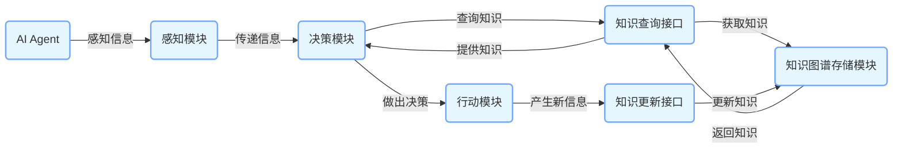

# AI Agent的知识图谱集成方案

> 关键词：AI Agent、知识图谱集成、知识表示、信息融合、智能推理

> 摘要：本文围绕AI Agent的知识图谱集成方案展开深入探讨。首先介绍了相关背景，包括目的、预期读者、文档结构和术语等。接着阐述了核心概念及联系，展示了知识图谱集成的原理和架构。详细讲解了核心算法原理与具体操作步骤，通过Python代码进行了示例。对涉及的数学模型和公式进行了详细说明并举例。给出了项目实战案例，包括开发环境搭建、源代码实现和代码解读。分析了实际应用场景，推荐了学习、开发工具和相关论文著作。最后总结了未来发展趋势与挑战，并提供了常见问题解答和扩展阅读参考资料，旨在为AI Agent与知识图谱集成领域的研究和实践提供全面且深入的指导。

## 1. 背景介绍 
### 1.1 目的和范围
随着人工智能技术的不断发展，AI Agent在各个领域的应用越来越广泛。然而，AI Agent要实现更智能、更高效的决策和交互，需要大量的知识支持。知识图谱作为一种结构化的知识表示方式，能够将各种实体、概念及其之间的关系进行清晰的展示。本方案的目的就是研究如何将知识图谱集成到AI Agent中，使AI Agent能够充分利用知识图谱中的丰富知识，提升其智能水平和应用能力。

本方案的范围主要涵盖知识图谱与AI Agent集成的核心概念、算法原理、具体操作步骤、数学模型、项目实战、实际应用场景等方面。通过对这些方面的研究和实践，为AI Agent的知识图谱集成提供一套完整的解决方案。

### 1.2 预期读者
本文预期读者包括人工智能领域的研究人员、开发者、软件架构师，以及对AI Agent和知识图谱集成感兴趣的技术爱好者。对于希望深入了解如何将知识图谱应用到AI Agent中，提升AI Agent智能水平的读者，本文将提供有价值的参考。

### 1.3 文档结构概述
本文将按照以下结构进行组织：
- 核心概念与联系：介绍AI Agent和知识图谱的核心概念，以及它们之间的集成关系，通过文本示意图和Mermaid流程图进行展示。
- 核心算法原理 & 具体操作步骤：详细讲解知识图谱集成的核心算法原理，并给出具体的操作步骤，同时使用Python源代码进行阐述。
- 数学模型和公式 & 详细讲解 & 举例说明：对知识图谱集成过程中涉及的数学模型和公式进行详细讲解，并通过具体例子进行说明。
- 项目实战：通过一个实际项目案例，展示知识图谱集成的具体实现过程，包括开发环境搭建、源代码详细实现和代码解读。
- 实际应用场景：分析知识图谱集成在不同领域的实际应用场景。
- 工具和资源推荐：推荐学习、开发过程中使用的工具和相关资源，包括书籍、在线课程、技术博客、开发工具框架和相关论文著作等。
- 总结：未来发展趋势与挑战：总结知识图谱集成的未来发展趋势和面临的挑战。
- 附录：常见问题与解答：解答读者在学习和实践过程中可能遇到的常见问题。
- 扩展阅读 & 参考资料：提供相关的扩展阅读资料和参考文献。

### 1.4 术语表
#### 1.4.1 核心术语定义
- **AI Agent**：人工智能代理，是一种能够感知环境、自主决策并采取行动以实现特定目标的软件实体。
- **知识图谱**：一种以图的形式表示知识的结构化数据模型，由实体、概念及其之间的关系组成。
- **知识图谱集成**：将知识图谱中的知识与AI Agent进行融合，使AI Agent能够利用知识图谱中的信息进行推理和决策。

#### 1.4.2 相关概念解释
- **实体**：知识图谱中表示具体事物的对象，如人、地点、组织等。
- **概念**：对一类实体的抽象描述，如“动物”“植物”等。
- **关系**：表示实体或概念之间的联系，如“属于”“位于”等。

#### 1.4.3 缩略词列表
- **KG**：Knowledge Graph，知识图谱
- **AI**：Artificial Intelligence，人工智能

## 2. 核心概念与联系 

### 核心概念原理
AI Agent是具有自主决策和行动能力的软件实体，它通过感知环境获取信息，并根据内部的决策机制进行决策和行动。知识图谱则是一种结构化的知识表示方式，它将各种实体、概念及其之间的关系以图的形式进行展示。知识图谱集成到AI Agent中，就是要让AI Agent能够利用知识图谱中的知识进行推理和决策，从而提升其智能水平。

具体来说，AI Agent可以通过查询知识图谱获取相关的知识信息，这些信息可以帮助AI Agent更好地理解环境、预测未来情况和做出更合理的决策。同时，AI Agent在运行过程中也可以将新的知识反馈给知识图谱，实现知识图谱的动态更新和扩展。

### 架构的文本示意图
以下是AI Agent与知识图谱集成的架构文本示意图：

AI Agent与知识图谱集成架构主要包括以下几个部分：
1. **感知模块**：负责感知环境中的信息，将这些信息传递给决策模块。
2. **决策模块**：AI Agent的核心模块，根据感知模块传递的信息和知识图谱中的知识进行推理和决策。
3. **知识图谱存储模块**：存储知识图谱的相关数据，包括实体、概念和关系等。
4. **知识查询接口**：提供AI Agent与知识图谱之间的查询接口，使AI Agent能够方便地查询知识图谱中的知识。
5. **知识更新接口**：用于将AI Agent在运行过程中产生的新的知识反馈给知识图谱，实现知识图谱的更新。

### Mermaid流程图


这个流程图展示了AI Agent与知识图谱集成的工作流程。AI Agent通过感知模块获取环境信息，传递给决策模块。决策模块根据需要通过知识查询接口从知识图谱存储模块中查询知识，然后根据这些知识做出决策并通过行动模块执行。在执行过程中产生的新信息通过知识更新接口反馈给知识图谱存储模块，实现知识图谱的更新。

## 3. 核心算法原理 & 具体操作步骤 

### 核心算法原理
知识图谱集成到AI Agent中的核心算法主要包括知识表示学习、知识推理和知识融合等方面。

#### 知识表示学习
知识表示学习的目的是将知识图谱中的实体和关系表示为低维向量，以便于计算机进行处理和计算。常见的知识表示学习模型有TransE、TransH等。

以TransE模型为例，其基本思想是将实体和关系表示为向量，并且要求如果存在关系 $(h, r, t)$（表示头实体 $h$ 通过关系 $r$ 连接到尾实体 $t$），那么 $h + r \approx t$。通过最小化以下损失函数来学习实体和关系的向量表示：
$$L = \sum_{(h, r, t) \in S} \sum_{(h', r, t') \in S'} [\gamma + d(h + r, t) - d(h' + r, t')]_+$$
其中，$S$ 是正样本集合，$S'$ 是负样本集合，$\gamma$ 是一个超参数，$d$ 是距离度量函数，$[x]_+ = \max(0, x)$。

#### 知识推理
知识推理是指根据知识图谱中已有的知识，推导出新的知识。常见的知识推理方法有基于规则的推理和基于深度学习的推理。

基于规则的推理是通过预先定义的规则来进行推理。例如，如果知识图谱中存在规则“如果 $A$ 是 $B$ 的父亲，$B$ 是 $C$ 的父亲，那么 $A$ 是 $C$ 的祖父”，那么当知识图谱中存在 $(A, 父亲, B)$ 和 $(B, 父亲, C)$ 时，就可以推导出 $(A, 祖父, C)$。

基于深度学习的推理则是利用深度学习模型来进行推理。例如，可以使用神经网络模型对知识图谱中的实体和关系进行建模，然后根据输入的实体和关系预测可能的尾实体。

#### 知识融合
知识融合是指将不同来源的知识图谱进行融合，消除其中的冲突和冗余，形成一个统一的知识图谱。知识融合的主要步骤包括实体对齐、关系对齐和属性对齐等。

实体对齐是指找出不同知识图谱中表示同一实体的节点，常见的实体对齐方法有基于属性匹配的方法和基于图结构匹配的方法。关系对齐和属性对齐的原理类似，分别是找出不同知识图谱中表示同一关系和属性的元素。

### 具体操作步骤
以下是将知识图谱集成到AI Agent中的具体操作步骤：

#### 步骤1：知识图谱的构建和存储
首先需要构建知识图谱，可以从结构化数据、半结构化数据和非结构化数据中提取实体、概念和关系，然后将这些信息存储到知识图谱存储系统中，如Neo4j、JanusGraph等。

#### 步骤2：知识表示学习
使用知识表示学习模型（如TransE）对知识图谱中的实体和关系进行表示学习，将其转换为低维向量。以下是使用Python和PyTorch实现的简单TransE模型示例代码：

```python
import torch
import torch.nn as nn
import torch.optim as optim

class TransE(nn.Module):
    def __init__(self, entity_num, relation_num, embedding_dim):
        super(TransE, self).__init__()
        self.entity_embeddings = nn.Embedding(entity_num, embedding_dim)
        self.relation_embeddings = nn.Embedding(relation_num, embedding_dim)
        self.init_embeddings()

    def init_embeddings(self):
        nn.init.xavier_uniform_(self.entity_embeddings.weight.data)
        nn.init.xavier_uniform_(self.relation_embeddings.weight.data)

    def forward(self, h, r, t):
        h_emb = self.entity_embeddings(h)
        r_emb = self.relation_embeddings(r)
        t_emb = self.entity_embeddings(t)
        score = torch.norm(h_emb + r_emb - t_emb, p=1, dim=1)
        return score

# 示例使用
entity_num = 100
relation_num = 20
embedding_dim = 50
model = TransE(entity_num, relation_num, embedding_dim)
optimizer = optim.Adam(model.parameters(), lr=0.001)

# 模拟训练数据
h = torch.randint(0, entity_num, (10,))
r = torch.randint(0, relation_num, (10,))
t = torch.randint(0, entity_num, (10,))

# 训练过程
for epoch in range(100):
    optimizer.zero_grad()
    score = model(h, r, t)
    loss = torch.mean(score)
    loss.backward()
    optimizer.step()
    print(f'Epoch {epoch}: Loss = {loss.item()}')
```

#### 步骤3：知识推理模块的实现
根据具体的需求选择合适的知识推理方法，如基于规则的推理或基于深度学习的推理，并实现相应的推理模块。

#### 步骤4：知识融合（如果有多个知识图谱）
如果需要融合多个知识图谱，执行实体对齐、关系对齐和属性对齐等操作，形成一个统一的知识图谱。

#### 步骤5：AI Agent与知识图谱的集成
将知识图谱的查询接口和更新接口集成到AI Agent的决策模块中，使AI Agent能够方便地查询和更新知识图谱中的知识。

## 4. 数学模型和公式 & 详细讲解 & 举例说明 

### 知识表示学习的数学模型和公式
#### TransE模型
如前面所述，TransE模型的核心思想是 $h + r \approx t$，其损失函数为：
$$L = \sum_{(h, r, t) \in S} \sum_{(h', r, t') \in S'} [\gamma + d(h + r, t) - d(h' + r, t')]_+$$

详细讲解：
- $S$ 是正样本集合，即知识图谱中真实存在的三元组 $(h, r, t)$。
- $S'$ 是负样本集合，通常是通过随机替换正样本中的头实体或尾实体得到的。
- $\gamma$ 是一个超参数，用于控制正样本和负样本之间的间隔。
- $d$ 是距离度量函数，通常使用 $L_1$ 或 $L_2$ 距离。
- $[x]_+ = \max(0, x)$ 是一个取正函数，确保损失函数的值非负。

举例说明：
假设知识图谱中有一个三元组 $(h_1, r_1, t_1)$，我们生成一个负样本 $(h_2, r_1, t_1)$（随机替换了头实体）。设 $\gamma = 1$，$d$ 为 $L_1$ 距离。如果 $d(h_1 + r_1, t_1) = 0.2$，$d(h_2 + r_1, t_1) = 0.5$，则损失函数中的一项为：
$$[\gamma + d(h_1 + r_1, t_1) - d(h_2 + r_1, t_1)]_+ = [1 + 0.2 - 0.5]_+ = 0.7$$

#### TransH模型
TransH模型是在TransE模型的基础上进行改进的，它将关系表示为超平面上的向量。对于一个三元组 $(h, r, t)$，首先将头实体 $h$ 和尾实体 $t$ 投影到关系 $r$ 对应的超平面上，得到 $h_{\perp}$ 和 $t_{\perp}$，然后要求 $h_{\perp} + r \approx t_{\perp}$。

损失函数为：
$$L = \sum_{(h, r, t) \in S} \sum_{(h', r, t') \in S'} [\gamma + d(h_{\perp} + r, t_{\perp}) - d(h'_{\perp} + r, t'_{\perp})]_+$$

其中，投影公式为：
$$h_{\perp} = h - w_r^T h w_r$$
$$t_{\perp} = t - w_r^T t w_r$$
$w_r$ 是关系 $r$ 对应的超平面的法向量。

### 知识推理的数学模型和公式
#### 基于规则的推理
假设我们有一个规则：如果 $A$ 是 $B$ 的父亲，$B$ 是 $C$ 的父亲，那么 $A$ 是 $C$ 的祖父。可以用逻辑公式表示为：
$$\forall A, B, C \quad (Father(A, B) \land Father(B, C)) \rightarrow Grandfather(A, C)$$

当知识图谱中存在 $(A_1, Father, B_1)$ 和 $(B_1, Father, C_1)$ 时，根据这个规则就可以推导出 $(A_1, Grandfather, C_1)$。

#### 基于深度学习的推理
以简单的神经网络模型为例，假设我们有一个输入层、一个隐藏层和一个输出层的神经网络。输入是头实体 $h$ 和关系 $r$ 的向量表示，输出是预测的尾实体 $t$ 的概率分布。

设输入向量为 $x = [h; r]$（将 $h$ 和 $r$ 拼接起来），隐藏层的输出为 $h_{hidden}$，输出层的输出为 $y$。则有：
$$h_{hidden} = \sigma(W_1 x + b_1)$$
$$y = \text{softmax}(W_2 h_{hidden} + b_2)$$
其中，$W_1$ 和 $W_2$ 是权重矩阵，$b_1$ 和 $b_2$ 是偏置向量，$\sigma$ 是激活函数（如ReLU），$\text{softmax}$ 是归一化函数，用于将输出转换为概率分布。

### 知识融合的数学模型和公式
#### 实体对齐
基于属性匹配的实体对齐方法通常使用相似度度量函数来计算两个实体之间的相似度。例如，使用余弦相似度来计算两个实体属性向量的相似度：
$$\text{Sim}(e_1, e_2) = \frac{e_1 \cdot e_2}{\|e_1\| \|e_2\|}$$
其中，$e_1$ 和 $e_2$ 是两个实体的属性向量，$\cdot$ 表示向量的点积，$\| \cdot \|$ 表示向量的模。

如果 $\text{Sim}(e_1, e_2)$ 大于某个阈值，则认为 $e_1$ 和 $e_2$ 表示同一实体。

## 5. 项目实战：代码实际案例和详细解释说明 

### 5.1  开发环境搭建
本项目实战使用Python作为开发语言，主要使用以下库和工具：
- **PyTorch**：用于实现知识表示学习模型。
- **Neo4j**：作为知识图谱的存储系统。
- **Jupyter Notebook**：用于代码的开发和调试。

#### 安装步骤
1. 安装Python：可以从Python官方网站（https://www.python.org/downloads/）下载并安装Python 3.x版本。
2. 安装PyTorch：根据自己的操作系统和CUDA版本，从PyTorch官方网站（https://pytorch.org/get-started/locally/）选择合适的安装命令进行安装。
3. 安装Neo4j：可以从Neo4j官方网站（https://neo4j.com/download/）下载并安装Neo4j社区版。安装完成后，启动Neo4j服务，并创建一个新的数据库。
4. 安装Jupyter Notebook：使用以下命令进行安装：
```sh
pip install jupyter notebook
```

### 5.2  源代码详细实现和代码解读
#### 知识图谱的构建和存储
首先，我们需要构建一个简单的知识图谱，并将其存储到Neo4j中。以下是示例代码：

```python
from py2neo import Graph, Node, Relationship

# 连接到Neo4j数据库
graph = Graph("bolt://localhost:7687", auth=("neo4j", "password"))

# 创建实体节点
person1 = Node("Person", name="Alice")
person2 = Node("Person", name="Bob")
person3 = Node("Person", name="Charlie")

# 创建关系
relation1 = Relationship(person1, "Friend", person2)
relation2 = Relationship(person2, "Friend", person3)

# 将节点和关系添加到知识图谱中
graph.create(person1)
graph.create(person2)
graph.create(person3)
graph.create(relation1)
graph.create(relation2)
```

代码解读：
- `py2neo` 是一个Python库，用于与Neo4j数据库进行交互。
- `Graph` 类用于连接到Neo4j数据库。
- `Node` 类用于创建实体节点，需要指定节点的标签（如 "Person"）和属性（如 "name"）。
- `Relationship` 类用于创建关系，需要指定头节点、关系类型（如 "Friend"）和尾节点。
- `graph.create()` 方法用于将节点和关系添加到知识图谱中。

#### 知识表示学习
使用前面介绍的TransE模型进行知识表示学习。以下是完整的代码：

```python
import torch
import torch.nn as nn
import torch.optim as optim
from py2neo import Graph

# 从Neo4j中获取知识图谱数据
graph = Graph("bolt://localhost:7687", auth=("neo4j", "password"))
query = "MATCH (h)-[r]->(t) RETURN id(h) as h, type(r) as r, id(t) as t"
results = graph.run(query).data()

# 构建实体和关系的映射
entity_set = set()
relation_set = set()
for result in results:
    entity_set.add(result['h'])
    entity_set.add(result['t'])
    relation_set.add(result['r'])

entity_dict = {entity: idx for idx, entity in enumerate(entity_set)}
relation_dict = {relation: idx for idx, relation in enumerate(relation_set)}

# 转换为训练数据
train_data = []
for result in results:
    h = entity_dict[result['h']]
    r = relation_dict[result['r']]
    t = entity_dict[result['t']]
    train_data.append((h, r, t))

# 定义TransE模型
class TransE(nn.Module):
    def __init__(self, entity_num, relation_num, embedding_dim):
        super(TransE, self).__init__()
        self.entity_embeddings = nn.Embedding(entity_num, embedding_dim)
        self.relation_embeddings = nn.Embedding(relation_num, embedding_dim)
        self.init_embeddings()

    def init_embeddings(self):
        nn.init.xavier_uniform_(self.entity_embeddings.weight.data)
        nn.init.xavier_uniform_(self.relation_embeddings.weight.data)

    def forward(self, h, r, t):
        h_emb = self.entity_embeddings(h)
        r_emb = self.relation_embeddings(r)
        t_emb = self.entity_embeddings(t)
        score = torch.norm(h_emb + r_emb - t_emb, p=1, dim=1)
        return score

# 初始化模型和优化器
entity_num = len(entity_set)
relation_num = len(relation_set)
embedding_dim = 50
model = TransE(entity_num, relation_num, embedding_dim)
optimizer = optim.Adam(model.parameters(), lr=0.001)

# 训练模型
num_epochs = 100
for epoch in range(num_epochs):
    total_loss = 0
    for h, r, t in train_data:
        h = torch.tensor([h])
        r = torch.tensor([r])
        t = torch.tensor([t])

        optimizer.zero_grad()
        score = model(h, r, t)
        loss = score.mean()
        loss.backward()
        optimizer.step()

        total_loss += loss.item()

    print(f'Epoch {epoch}: Loss = {total_loss / len(train_data)}')
```

代码解读：
- 首先，从Neo4j中获取知识图谱数据，将其转换为训练数据。
- 构建实体和关系的映射，将实体和关系的ID转换为整数索引。
- 定义TransE模型，包括实体嵌入层和关系嵌入层。
- 初始化模型和优化器，使用Adam优化器进行训练。
- 在训练过程中，遍历训练数据，计算损失并进行反向传播和参数更新。

### 5.3  代码解读与分析
#### 知识图谱构建部分
通过 `py2neo` 库连接到Neo4j数据库，创建实体节点和关系，并将它们添加到知识图谱中。这种方式可以方便地将数据存储到Neo4j中，并且可以利用Neo4j的图数据库特性进行高效的查询和分析。

#### 知识表示学习部分
使用PyTorch实现了TransE模型，将知识图谱中的实体和关系表示为低维向量。通过训练模型，不断调整实体和关系的嵌入向量，使得满足 $h + r \approx t$ 的条件。训练过程中使用了Adam优化器进行参数更新，以最小化损失函数。

通过这个项目实战，我们可以看到如何将知识图谱的构建、存储和知识表示学习结合起来，为AI Agent的知识图谱集成提供基础。

## 6. 实际应用场景 
### 智能客服
在智能客服系统中，AI Agent可以集成知识图谱，以提供更准确、更智能的服务。知识图谱中可以包含产品信息、常见问题解答、业务流程等知识。当用户提出问题时，AI Agent可以通过查询知识图谱获取相关信息，快速准确地回答用户的问题。例如，如果用户询问某款产品的特点和使用方法，AI Agent可以从知识图谱中找到该产品的相关属性和使用说明，并将其反馈给用户。

### 智能推荐系统
在智能推荐系统中，知识图谱可以提供用户和物品之间的丰富关系信息。AI Agent可以利用这些信息进行更精准的推荐。例如，知识图谱中可以包含用户的兴趣爱好、历史购买记录、社交关系等信息，以及物品的属性、类别、关联物品等信息。AI Agent可以根据用户的当前行为和知识图谱中的信息，为用户推荐更符合其兴趣和需求的物品。

### 医疗诊断辅助
在医疗领域，知识图谱可以集成医学知识、病例信息、药物信息等。AI Agent可以利用知识图谱进行医疗诊断辅助。当医生输入患者的症状和检查结果时，AI Agent可以查询知识图谱，找出可能的疾病和相应的治疗方案。同时，知识图谱还可以提供药物的相互作用、禁忌等信息，帮助医生做出更安全、有效的治疗决策。

### 金融风险评估
在金融领域，知识图谱可以包含企业的财务信息、市场信息、行业动态等。AI Agent可以利用知识图谱进行金融风险评估。例如，通过分析企业之间的关联关系、财务指标的变化等，AI Agent可以预测企业的信用风险和市场风险。同时，知识图谱还可以帮助AI Agent发现潜在的金融欺诈行为。

## 7. 工具和资源推荐
### 7.1 学习资源推荐
#### 7.1.1 书籍推荐
- 《知识图谱：方法、实践与应用》：全面介绍了知识图谱的基本概念、构建方法、应用场景等内容，是学习知识图谱的经典书籍。
- 《人工智能：一种现代的方法》：涵盖了人工智能的各个方面，包括知识表示、推理、机器学习等，对理解AI Agent和知识图谱集成的理论基础有很大帮助。
- 《Python深度学习》：详细介绍了Python在深度学习中的应用，对于实现知识表示学习和推理的深度学习模型非常有帮助。

#### 7.1.2 在线课程
- Coursera上的“Knowledge Graphs”课程：由知名高校的教授授课，系统地介绍了知识图谱的相关知识和技术。
- edX上的“Artificial Intelligence”课程：全面讲解了人工智能的基本概念、算法和应用，包括AI Agent的相关内容。
- 吴恩达的“Deep Learning Specialization”课程：深入介绍了深度学习的原理和应用，对于理解知识图谱集成中的深度学习方法非常有帮助。

#### 7.1.3 技术博客和网站
- 博客园：有很多技术博主分享关于知识图谱和AI Agent的研究成果和实践经验。
- 开源中国：提供了大量的开源项目和技术文章，对于学习和实践知识图谱集成非常有帮助。
- 知识图谱社区：专注于知识图谱领域的技术交流和分享，有很多最新的研究成果和应用案例。

### 7.2 开发工具框架推荐
#### 7.2.1 IDE和编辑器
- PyCharm：一款专业的Python集成开发环境，提供了丰富的代码编辑、调试和版本控制功能，非常适合Python项目的开发。
- Jupyter Notebook：一种交互式的开发环境，可以将代码、文本、图表等结合在一起，方便进行代码的开发和调试，同时也适合进行数据分析和可视化。
- Visual Studio Code：一款轻量级的代码编辑器，支持多种编程语言和插件扩展，对于快速开发和调试代码非常方便。

#### 7.2.2 调试和性能分析工具
- PyTorch Profiler：PyTorch提供的性能分析工具，可以帮助开发者分析模型的训练和推理过程中的性能瓶颈，优化代码性能。
- Neo4j Browser：Neo4j自带的可视化工具，可以方便地对知识图谱进行查询和可视化，帮助开发者调试和分析知识图谱的结构和数据。
- TensorBoard：TensorFlow提供的可视化工具，也可以用于PyTorch项目。可以用于可视化模型的训练过程、损失函数的变化等信息。

#### 7.2.3 相关框架和库
- PyTorch：一个开源的深度学习框架，提供了丰富的深度学习模型和工具，非常适合实现知识表示学习和推理的深度学习模型。
- Neo4j Python Driver：用于与Neo4j数据库进行交互的Python库，方便开发者将知识图谱数据存储到Neo4j中，并进行查询和更新操作。
- NetworkX：一个用于创建、操作和研究复杂网络的Python库，可以用于知识图谱的图结构分析和可视化。

### 7.3 相关论文著作推荐
#### 7.3.1 经典论文
- “Translating Embeddings for Modeling Multi-relational Data”：提出了TransE模型，是知识表示学习领域的经典论文。
- “Knowledge Graph Embedding: A Survey of Approaches and Applications”：对知识图谱嵌入的方法和应用进行了全面的综述，对于了解知识图谱嵌入的研究现状非常有帮助。
- “Probabilistic Graphical Models: Principles and Techniques”：介绍了概率图模型的基本原理和技术，对于理解知识图谱中的不确定性推理非常有帮助。

#### 7.3.2 最新研究成果
- 每年的ACM SIGKDD、IEEE ICDE、WWW等顶级会议上都会有关于知识图谱和AI Agent的最新研究成果发表。可以关注这些会议的论文，了解该领域的最新研究动态。
- 一些知名的学术期刊，如Artificial Intelligence、Journal of Artificial Intelligence Research等，也会发表该领域的高质量研究论文。

#### 7.3.3 应用案例分析
- 一些实际应用案例的论文和报告，如智能客服、智能推荐系统、医疗诊断辅助等领域的应用案例分析，可以帮助读者了解知识图谱集成在实际场景中的应用方法和效果。可以通过搜索引擎和学术数据库查找相关的应用案例。

## 8. 总结：未来发展趋势与挑战
### 未来发展趋势
#### 多模态知识图谱集成
未来的知识图谱集成将不仅仅局限于文本信息，还将集成图像、音频、视频等多模态信息。AI Agent可以利用多模态知识图谱进行更全面、更深入的理解和决策。例如，在智能安防领域，AI Agent可以结合视频监控信息和知识图谱中的人物关系、行为模式等信息，实现更精准的安全监控和预警。

#### 知识图谱与深度学习的深度融合
知识图谱和深度学习将进一步深度融合。知识图谱可以为深度学习模型提供先验知识，帮助模型更好地理解数据和进行推理。同时，深度学习模型可以用于知识图谱的构建、补全和推理。例如，使用深度学习模型对非结构化文本进行实体识别和关系抽取，构建知识图谱；利用知识图谱中的知识指导深度学习模型的训练，提高模型的泛化能力和可解释性。

#### 分布式知识图谱集成
随着数据量的不断增大，分布式知识图谱集成将成为未来的发展趋势。多个知识图谱可以分布在不同的节点上，通过分布式计算和通信技术进行集成和协同工作。AI Agent可以在分布式知识图谱上进行高效的查询和推理，提高系统的性能和可扩展性。

### 面临的挑战
#### 知识图谱的构建和更新
知识图谱的构建和更新是一个复杂且耗时的过程。需要从大量的结构化、半结构化和非结构化数据中提取知识，并进行实体对齐、关系抽取等操作。同时，知识图谱需要不断更新以反映现实世界的变化。如何高效地构建和更新知识图谱是一个亟待解决的问题。

#### 知识表示和推理的准确性
知识表示学习和推理的准确性直接影响AI Agent的智能水平。目前的知识表示学习模型和推理方法还存在一定的局限性，如无法处理复杂的语义信息、推理结果的可解释性差等。如何提高知识表示和推理的准确性和可解释性是一个重要的挑战。

#### 隐私和安全问题
知识图谱中可能包含大量的敏感信息，如个人隐私、商业机密等。在知识图谱集成和AI Agent的应用过程中，如何保护这些敏感信息的隐私和安全是一个关键问题。需要研究和开发有效的隐私保护和安全机制，防止信息泄露和恶意攻击。

## 9. 附录：常见问题与解答
### 问题1：知识图谱集成到AI Agent中有什么好处？
答：知识图谱集成到AI Agent中可以使AI Agent利用知识图谱中的丰富知识进行推理和决策，提升其智能水平。具体好处包括：
- 提供更准确的信息：知识图谱中包含了大量的实体、概念和关系信息，AI Agent可以通过查询知识图谱获取更准确、更全面的信息。
- 增强推理能力：知识图谱中的知识可以帮助AI Agent进行逻辑推理，推导出新的知识和结论。
- 提高决策质量：基于知识图谱中的知识，AI Agent可以做出更合理、更明智的决策。

### 问题2：如何选择合适的知识表示学习模型？
答：选择合适的知识表示学习模型需要考虑以下因素：
- 知识图谱的特点：如果知识图谱中的关系比较简单，可以选择简单的模型，如TransE；如果关系比较复杂，可以选择更复杂的模型，如TransH、TransR等。
- 应用场景的需求：如果应用场景对推理速度要求较高，可以选择计算复杂度较低的模型；如果对推理准确性要求较高，可以选择表达能力更强的模型。
- 数据量的大小：如果数据量较小，可以选择简单的模型，避免过拟合；如果数据量较大，可以选择复杂的模型，充分利用数据的信息。

### 问题3：知识图谱集成过程中如何处理数据冲突？
答：知识图谱集成过程中处理数据冲突的方法主要有以下几种：
- 基于规则的方法：定义一些规则来处理数据冲突，如优先选择可信度高的数据、根据数据来源的权威性进行选择等。
- 基于机器学习的方法：使用机器学习模型对数据进行分类和预测，判断哪些数据是正确的。
- 人工干预的方法：对于一些复杂的冲突，无法通过自动方法解决时，可以采用人工干预的方式，由专家进行判断和处理。

### 问题4：知识图谱集成对硬件资源有什么要求？
答：知识图谱集成对硬件资源的要求取决于知识图谱的规模和复杂度，以及所使用的算法和模型。一般来说，需要具备以下硬件资源：
- 足够的内存：知识图谱需要存储大量的实体、概念和关系信息，因此需要足够的内存来存储和处理这些数据。
- 强大的计算能力：知识表示学习和推理等算法通常需要进行大量的计算，因此需要具备强大的计算能力，如多核CPU或GPU。
- 高速的存储设备：为了提高数据的读写速度，建议使用高速的存储设备，如SSD硬盘。

## 10. 扩展阅读 & 参考资料
### 扩展阅读
- 《图数据库实战》：深入介绍了图数据库的原理、应用和实践，对于理解知识图谱的存储和查询非常有帮助。
- 《人工智能中的不确定性推理》：详细介绍了人工智能中的不确定性推理方法，对于处理知识图谱中的不确定性信息有很大的启示。
- 《大数据与知识图谱》：探讨了大数据和知识图谱之间的关系，以及如何利用大数据构建和应用知识图谱。

### 参考资料
- 相关学术论文和研究报告：可以通过学术数据库（如IEEE Xplore、ACM Digital Library、CNKI等）查找关于AI Agent、知识图谱集成的最新研究成果。
- 开源项目：可以参考一些开源的知识图谱项目（如Dbpedia、Wikidata等）和AI Agent项目（如OpenAI Gym等），学习它们的实现方法和技术。
- 官方文档和教程：各个工具和框架的官方文档和教程是学习和使用它们的重要参考资料，如PyTorch官方文档、Neo4j官方文档等。

作者：AI天才研究院/AI Genius Institute & 禅与计算机程序设计艺术 /Zen And The Art of Computer Programming