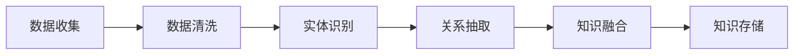
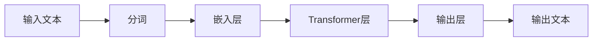
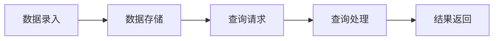
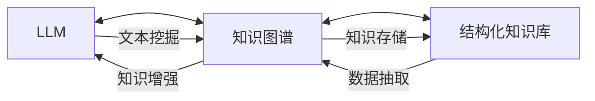

# AI Agent的知识图谱：整合LLM与结构化知识库

> 关键词：AI Agent、知识图谱、大语言模型（LLM）、结构化知识库、信息整合

> 摘要：本文聚焦于AI Agent的知识图谱中整合大语言模型（LLM）与结构化知识库这一关键技术。首先介绍了相关背景，包括目的、预期读者、文档结构等内容。接着阐述了核心概念与联系，详细讲解了知识图谱、LLM和结构化知识库的原理及架构。在核心算法原理部分，通过Python代码进行了详细阐述。同时给出了相关数学模型和公式，并举例说明。通过项目实战，展示了如何搭建开发环境、实现源代码及进行代码解读。探讨了该技术的实际应用场景，推荐了学习资源、开发工具框架以及相关论文著作。最后总结了未来发展趋势与挑战，并对常见问题进行了解答，提供了扩展阅读和参考资料。旨在为读者全面深入地了解AI Agent知识图谱中整合LLM与结构化知识库的技术提供清晰且详细的指引。

## 1. 背景介绍 
### 1.1 目的和范围
随着人工智能技术的飞速发展，AI Agent在各个领域的应用日益广泛。然而，单一的大语言模型（LLM）虽然具备强大的语言理解和生成能力，但在处理特定领域的精确知识和复杂逻辑推理时存在一定的局限性。结构化知识库则存储了大量经过整理和组织的专业知识，具有较高的准确性和逻辑性。本文章的目的在于探讨如何将LLM与结构化知识库进行有效整合，构建更强大的AI Agent知识图谱，以提升AI Agent在知识获取、推理和决策等方面的能力。

文章的范围涵盖了从核心概念的阐述、算法原理的讲解、数学模型的分析，到实际项目的开发和应用场景的探讨，同时还提供了相关的学习资源、开发工具和论文著作推荐等内容。

### 1.2 预期读者
本文的预期读者包括人工智能领域的研究人员、开发者、数据科学家、软件工程师以及对AI Agent和知识图谱技术感兴趣的技术爱好者。无论是希望深入研究该领域理论的专业人士，还是想要实践开发相关应用的技术人员，都能从本文中获取有价值的信息。

### 1.3 文档结构概述
本文将按照以下结构进行组织：
1. **背景介绍**：阐述文章的目的、预期读者和文档结构，同时介绍相关术语。
2. **核心概念与联系**：详细解释知识图谱、LLM和结构化知识库的概念、原理和架构，并展示它们之间的联系。
3. **核心算法原理 & 具体操作步骤**：通过Python代码详细讲解整合LLM与结构化知识库的核心算法原理和具体操作步骤。
4. **数学模型和公式 & 详细讲解 & 举例说明**：给出相关的数学模型和公式，并进行详细讲解和举例说明。
5. **项目实战：代码实际案例和详细解释说明**：展示如何搭建开发环境、实现源代码，并对代码进行解读和分析。
6. **实际应用场景**：探讨该技术在不同领域的实际应用场景。
7. **工具和资源推荐**：推荐学习资源、开发工具框架和相关论文著作。
8. **总结：未来发展趋势与挑战**：总结该技术的未来发展趋势和面临的挑战。
9. **附录：常见问题与解答**：解答读者可能遇到的常见问题。
10. **扩展阅读 & 参考资料**：提供扩展阅读的建议和参考资料。

### 1.4 术语表
#### 1.4.1 核心术语定义
- **AI Agent**：人工智能代理，是一种能够感知环境、自主决策并采取行动以实现特定目标的软件实体。
- **知识图谱**：是一种以图的形式表示知识的语义网络，由节点和边组成，节点代表实体，边代表实体之间的关系。
- **大语言模型（LLM）**：基于深度学习技术训练的大规模语言模型，能够处理自然语言任务，如文本生成、问答系统等。
- **结构化知识库**：是一种将知识以结构化的方式存储的数据库，如关系数据库、图数据库等，便于进行高效的查询和推理。

#### 1.4.2 相关概念解释
- **语义理解**：指计算机对自然语言文本的含义进行理解和分析的能力。
- **知识推理**：根据已有的知识和规则，推导出新的知识或结论的过程。
- **信息整合**：将不同来源、不同格式的信息进行收集、整理和融合的过程。

#### 1.4.3 缩略词列表
- **LLM**：Large Language Model（大语言模型）
- **RDF**：Resource Description Framework（资源描述框架）
- **OWL**：Web Ontology Language（网络本体语言）

## 2. 核心概念与联系 
### 知识图谱
知识图谱是一种用于表示和管理知识的语义网络，它以图的形式组织知识，其中节点表示实体，边表示实体之间的关系。知识图谱的核心在于能够将现实世界中的各种实体和它们之间的关系以一种结构化的方式进行表示，从而方便计算机进行处理和推理。

知识图谱的架构通常包括数据层和模式层。数据层包含了具体的实体和它们之间的关系，而模式层则定义了实体和关系的类型和约束。例如，在一个关于人物关系的知识图谱中，数据层可能包含具体的人物信息和他们之间的亲属关系，而模式层则定义了“人物”、“亲属关系”等概念以及它们之间的关联规则。

以下是知识图谱的文本示意图：

```plaintext
实体1 ---- 关系1 ---- 实体2
|
关系2
|
实体3
```

使用Mermaid流程图表示知识图谱的构建过程如下：



### 大语言模型（LLM）
大语言模型是基于深度学习技术训练的大规模神经网络模型，通过在大量的文本数据上进行无监督学习，学习到语言的模式和规律，从而能够处理各种自然语言任务，如文本生成、问答系统、机器翻译等。

LLM的核心原理是基于Transformer架构，它通过多头自注意力机制来捕捉文本中的长距离依赖关系，从而能够更好地理解和生成自然语言文本。例如，GPT系列模型就是典型的大语言模型，它们在预训练阶段通过大规模的无监督学习学习到了丰富的语言知识，在微调阶段可以针对特定的任务进行优化。

以下是LLM的文本示意图：

```plaintext
输入文本 --> LLM --> 输出文本
```

使用Mermaid流程图表示LLM的工作流程如下：



### 结构化知识库
结构化知识库是一种将知识以结构化的方式存储的数据库，常见的结构化知识库包括关系数据库和图数据库。关系数据库使用表格的形式存储数据，通过行和列来表示实体和属性；图数据库则以图的形式存储数据，通过节点和边来表示实体和关系。

结构化知识库的优点在于数据的组织和管理更加规范和高效，便于进行复杂的查询和推理。例如，在一个医疗领域的结构化知识库中，可以存储疾病、症状、治疗方法等信息，通过查询知识库可以快速获取相关的医学知识。

以下是结构化知识库的文本示意图：

```plaintext
实体1 (属性1, 属性2,...)
实体2 (属性1, 属性2,...)
关系 (实体1, 实体2, 关系类型)
```

使用Mermaid流程图表示结构化知识库的操作流程如下：



### 三者之间的联系
知识图谱、LLM和结构化知识库之间存在着密切的联系。知识图谱可以为LLM提供结构化的知识支持，帮助LLM更好地理解和处理自然语言文本。例如，在问答系统中，知识图谱可以提供准确的实体和关系信息，使得LLM能够给出更准确的答案。

结构化知识库可以作为知识图谱的数据来源，通过对结构化知识库中的数据进行抽取和转换，可以构建知识图谱。同时，结构化知识库也可以为LLM提供特定领域的知识，提升LLM在该领域的表现。

LLM可以用于知识图谱的构建和更新，例如通过文本挖掘技术从大量的文本数据中抽取实体和关系，补充到知识图谱中。同时，LLM也可以对结构化知识库中的数据进行语义理解和推理，挖掘出潜在的知识。

以下是三者之间联系的文本示意图：

```plaintext
LLM <-- 知识交互 --> 知识图谱 <-- 数据转换 --> 结构化知识库
```

使用Mermaid流程图表示三者之间的交互关系如下：



## 3. 核心算法原理 & 具体操作步骤 
### 核心算法原理
整合LLM与结构化知识库的核心算法主要包括知识抽取、知识融合和知识推理三个部分。

#### 知识抽取
知识抽取是从文本数据中提取实体、关系和属性等知识信息的过程。在整合LLM与结构化知识库的场景中，可以利用LLM强大的语言理解能力进行知识抽取。具体来说，可以将文本输入到LLM中，让LLM识别出其中的实体和关系，并将其转换为结构化的知识表示。

以下是一个简单的Python代码示例，使用Hugging Face的Transformers库进行实体识别：

```python
from transformers import AutoTokenizer, AutoModelForTokenClassification
import torch

# 加载预训练的实体识别模型
tokenizer = AutoTokenizer.from_pretrained("dbmdz/bert-large-cased-finetuned-conll03-english")
model = AutoModelForTokenClassification.from_pretrained("dbmdz/bert-large-cased-finetuned-conll03-english")

# 输入文本
text = "Apple is a technology company founded by Steve Jobs."

# 对文本进行分词
inputs = tokenizer(text, return_tensors="pt")

# 进行实体识别
with torch.no_grad():
    outputs = model(**inputs)

# 获取预测结果
predictions = torch.argmax(outputs.logits, dim=2)

# 解码预测结果
tokens = tokenizer.convert_ids_to_tokens(inputs["input_ids"][0])
entities = []
current_entity = []
for token, prediction in zip(tokens, predictions[0]):
    if prediction.item()!= 0:  # 0表示非实体
        if prediction.item() % 2 == 1:  # 奇数表示实体的开始
            if current_entity:
                entities.append(" ".join(current_entity))
                current_entity = []
            current_entity.append(token)
        else:  # 偶数表示实体的延续
            current_entity.append(token)
if current_entity:
    entities.append(" ".join(current_entity))

print("识别出的实体:", entities)
```

#### 知识融合
知识融合是将从不同来源获取的知识进行整合和统一的过程。在整合LLM与结构化知识库时，需要将从文本中抽取的知识与结构化知识库中的知识进行融合，消除冲突和冗余。

知识融合的主要步骤包括实体对齐和属性合并。实体对齐是指将不同来源的表示同一实体的知识进行匹配和合并，属性合并是指将同一实体的不同属性进行整合。

以下是一个简单的Python代码示例，实现实体对齐的基本逻辑：

```python
# 假设结构化知识库中的实体列表
kb_entities = ["Apple Inc.", "Steve Jobs"]

# 从文本中抽取的实体列表
text_entities = ["Apple", "Steve Jobs"]

# 简单的实体对齐逻辑
aligned_entities = []
for text_entity in text_entities:
    for kb_entity in kb_entities:
        if text_entity in kb_entity:
            aligned_entities.append(kb_entity)
            break
    else:
        aligned_entities.append(text_entity)

print("对齐后的实体:", aligned_entities)
```

#### 知识推理
知识推理是根据已有的知识和规则，推导出新的知识或结论的过程。在整合LLM与结构化知识库的场景中，可以利用LLM的推理能力和结构化知识库的规则进行知识推理。

例如，可以将结构化知识库中的规则和已知知识输入到LLM中，让LLM根据这些信息推导出新的知识。以下是一个简单的Python代码示例，模拟知识推理的过程：

```python
# 结构化知识库中的规则
rules = [
    "如果一个人是公司的创始人，那么这个人与该公司存在创始人关系"
]

# 已知知识
known_knowledge = [
    "Steve Jobs是Apple的创始人"
]

# 推理问题
question = "Steve Jobs与Apple存在什么关系？"

# 构建输入文本
input_text = "\n".join(rules + known_knowledge + [question])

# 假设使用LLM进行推理
# 这里简单模拟LLM的输出
answer = "创始人关系"

print("推理结果:", answer)
```

### 具体操作步骤
整合LLM与结构化知识库的具体操作步骤如下：

1. **数据准备**：收集和整理文本数据和结构化知识库数据。
2. **知识抽取**：使用LLM对文本数据进行知识抽取，提取实体、关系和属性等知识信息。
3. **知识融合**：将抽取的知识与结构化知识库中的知识进行融合，进行实体对齐和属性合并。
4. **知识存储**：将融合后的知识存储到知识图谱或结构化知识库中。
5. **知识推理**：利用LLM和结构化知识库的规则进行知识推理，获取新的知识和结论。
6. **应用开发**：基于整合后的知识构建具体的应用，如问答系统、智能推荐系统等。

## 4. 数学模型和公式 & 详细讲解 & 举例说明 
### 知识表示模型
在知识图谱中，常用的知识表示模型是资源描述框架（RDF）。RDF使用三元组的形式表示知识，每个三元组由主语（Subject）、谓语（Predicate）和宾语（Object）组成，记作 $(S, P, O)$。

例如，“Steve Jobs是Apple的创始人”可以表示为 $(Steve Jobs, 创始人, Apple)$。

RDF的优点在于其简单性和通用性，便于不同系统之间的知识交换和共享。

### 概率图模型
在知识推理中，概率图模型是一种常用的工具。概率图模型通过图的形式表示变量之间的概率关系，常见的概率图模型包括贝叶斯网络和马尔可夫随机场。

#### 贝叶斯网络
贝叶斯网络是一种有向无环图（DAG），其中节点表示随机变量，边表示变量之间的依赖关系。每个节点都有一个条件概率表（CPT），表示该节点在其父节点取值的条件下的概率分布。

假设我们有一个简单的贝叶斯网络，包含三个节点：$A$、$B$ 和 $C$，其中 $A$ 是 $B$ 的父节点，$B$ 是 $C$ 的父节点。则联合概率分布可以表示为：

$$P(A, B, C) = P(A) \times P(B|A) \times P(C|B)$$

例如，假设 $P(A) = 0.5$，$P(B|A = true) = 0.8$，$P(B|A = false) = 0.2$，$P(C|B = true) = 0.9$，$P(C|B = false) = 0.1$。则 $P(A = true, B = true, C = true)$ 可以计算为：

$$P(A = true, B = true, C = true) = P(A = true) \times P(B = true|A = true) \times P(C = true|B = true) = 0.5 \times 0.8 \times 0.9 = 0.36$$

#### 马尔可夫随机场
马尔可夫随机场是一种无向图模型，其中节点表示随机变量，边表示变量之间的相互作用。马尔可夫随机场的联合概率分布可以表示为：

$$P(X) = \frac{1}{Z} \prod_{c \in C} \psi_c(X_c)$$

其中，$X$ 是所有变量的集合，$C$ 是图中的所有团（完全子图），$\psi_c(X_c)$ 是团 $c$ 上的势函数，$Z$ 是归一化常数。

### 知识嵌入模型
知识嵌入模型是将知识图谱中的实体和关系映射到低维向量空间的模型，常见的知识嵌入模型包括TransE、DistMult等。

#### TransE
TransE模型的核心思想是将实体和关系表示为向量，并且假设对于一个三元组 $(h, r, t)$，有 $h + r \approx t$。其中，$h$、$r$ 和 $t$ 分别是头实体、关系和尾实体的向量表示。

TransE的目标是最小化以下损失函数：

$$L = \sum_{(h, r, t) \in S} \sum_{(h', r, t') \in S'} [\gamma + d(h + r, t) - d(h' + r, t')]_+$$

其中，$S$ 是正样本集合，$S'$ 是负样本集合，$\gamma$ 是边际超参数，$d$ 是距离函数，$[x]_+ = \max(0, x)$。

例如，假设我们有一个知识图谱，包含实体 $Apple$、$Steve Jobs$ 和关系 $创始人$。通过TransE模型，我们可以将 $Apple$、$Steve Jobs$ 和 $创始人$ 分别映射到向量空间中的向量 $\mathbf{v}_{Apple}$、$\mathbf{v}_{Steve Jobs}$ 和 $\mathbf{v}_{创始人}$，并且满足 $\mathbf{v}_{Steve Jobs} + \mathbf{v}_{创始人} \approx \mathbf{v}_{Apple}$。

## 5. 项目实战：代码实际案例和详细解释说明 
### 5.1  开发环境搭建
在进行项目实战之前，需要搭建相应的开发环境。以下是具体的步骤：

1. **安装Python**：确保系统中安装了Python 3.6及以上版本。可以从Python官方网站（https://www.python.org/downloads/）下载并安装。
2. **创建虚拟环境**：为了避免不同项目之间的依赖冲突，建议使用虚拟环境。可以使用 `venv` 模块创建虚拟环境：

```bash
python -m venv myenv
```

3. **激活虚拟环境**：在Windows系统中，使用以下命令激活虚拟环境：

```bash
myenv\Scripts\activate
```

在Linux或Mac系统中，使用以下命令激活虚拟环境：

```bash
source myenv/bin/activate
```

4. **安装依赖库**：安装项目所需的依赖库，包括Hugging Face的Transformers库、`torch` 等：

```bash
pip install transformers torch
```

### 5.2  源代码详细实现和代码解读
以下是一个完整的Python代码示例，实现了从文本中抽取知识并与结构化知识库进行整合的功能：

```python
from transformers import AutoTokenizer, AutoModelForTokenClassification
import torch

# 加载预训练的实体识别模型
tokenizer = AutoTokenizer.from_pretrained("dbmdz/bert-large-cased-finetuned-conll03-english")
model = AutoModelForTokenClassification.from_pretrained("dbmdz/bert-large-cased-finetuned-conll03-english")

# 结构化知识库中的实体列表
kb_entities = ["Apple Inc.", "Steve Jobs"]

# 输入文本
text = "Apple is a technology company founded by Steve Jobs."

# 知识抽取
def extract_entities(text):
    # 对文本进行分词
    inputs = tokenizer(text, return_tensors="pt")

    # 进行实体识别
    with torch.no_grad():
        outputs = model(**inputs)

    # 获取预测结果
    predictions = torch.argmax(outputs.logits, dim=2)

    # 解码预测结果
    tokens = tokenizer.convert_ids_to_tokens(inputs["input_ids"][0])
    entities = []
    current_entity = []
    for token, prediction in zip(tokens, predictions[0]):
        if prediction.item()!= 0:  # 0表示非实体
            if prediction.item() % 2 == 1:  # 奇数表示实体的开始
                if current_entity:
                    entities.append(" ".join(current_entity))
                    current_entity = []
                current_entity.append(token)
            else:  # 偶数表示实体的延续
                current_entity.append(token)
    if current_entity:
        entities.append(" ".join(current_entity))

    return entities

# 知识融合
def fuse_entities(text_entities, kb_entities):
    aligned_entities = []
    for text_entity in text_entities:
        for kb_entity in kb_entities:
            if text_entity in kb_entity:
                aligned_entities.append(kb_entity)
                break
        else:
            aligned_entities.append(text_entity)

    return aligned_entities

# 抽取文本中的实体
text_entities = extract_entities(text)

# 融合实体
aligned_entities = fuse_entities(text_entities, kb_entities)

print("抽取的实体:", text_entities)
print("融合后的实体:", aligned_entities)
```

### 代码解读与分析
1. **知识抽取部分**：
    - `extract_entities` 函数使用预训练的实体识别模型对输入文本进行实体识别。
    - 首先使用 `tokenizer` 对文本进行分词，然后将分词结果输入到模型中进行预测。
    - 最后根据预测结果解码出实体列表。

2. **知识融合部分**：
    - `fuse_entities` 函数将抽取的实体与结构化知识库中的实体进行对齐和融合。
    - 遍历抽取的实体列表，对于每个实体，检查是否存在于结构化知识库中，如果存在则使用知识库中的实体，否则使用抽取的实体。

3. **主程序部分**：
    - 调用 `extract_entities` 函数抽取文本中的实体。
    - 调用 `fuse_entities` 函数对抽取的实体进行融合。
    - 打印抽取的实体和融合后的实体。

## 6. 实际应用场景 
### 智能问答系统
在智能问答系统中，整合LLM与结构化知识库可以提升系统的回答准确性和专业性。LLM可以理解用户的问题，并从结构化知识库中获取相关的知识进行回答。例如，在一个医疗问答系统中，用户询问某种疾病的治疗方法，LLM可以通过理解问题，从结构化的医学知识库中查找相关的治疗方案，并进行准确的回答。

### 智能推荐系统
在智能推荐系统中，知识图谱可以提供用户和物品之间的丰富关系信息，LLM可以对这些信息进行分析和推理，从而实现更精准的推荐。例如，在一个电影推荐系统中，知识图谱可以存储用户的观影历史、电影的类型、演员等信息，LLM可以根据这些信息分析用户的兴趣偏好，为用户推荐更符合其口味的电影。

### 知识管理系统
在知识管理系统中，整合LLM与结构化知识库可以实现知识的自动抽取、分类和推理。LLM可以从大量的文本文档中抽取知识，将其与结构化知识库中的知识进行融合，然后通过知识推理挖掘出潜在的知识关系，为企业的知识管理提供有力支持。

### 金融风险评估
在金融领域，整合LLM与结构化知识库可以用于金融风险评估。结构化知识库可以存储企业的财务数据、信用记录等信息，LLM可以对这些信息进行分析和推理，评估企业的信用风险和市场风险。例如，通过分析企业的财务报表和行业动态，预测企业的未来发展趋势，为金融机构的投资决策提供参考。

## 7. 工具和资源推荐
### 7.1 学习资源推荐
#### 7.1.1 书籍推荐
- 《人工智能：一种现代的方法》：这是一本经典的人工智能教材，涵盖了人工智能的各个领域，包括知识表示、推理、机器学习等内容。
- 《知识图谱：方法、实践与应用》：详细介绍了知识图谱的构建方法、技术和应用场景，是学习知识图谱的重要参考书籍。
- 《深度学习》：由深度学习领域的三位顶尖专家撰写，全面介绍了深度学习的理论和实践，对于理解大语言模型的原理非常有帮助。

#### 7.1.2 在线课程
- Coursera上的“人工智能基础”课程：由斯坦福大学的教授授课，系统地介绍了人工智能的基本概念和方法。
- edX上的“知识图谱与语义网”课程：深入讲解了知识图谱的构建、推理和应用等方面的知识。
- 吴恩达的“深度学习专项课程”：在深度学习领域具有很高的知名度，对于学习大语言模型的原理和应用非常有帮助。

#### 7.1.3 技术博客和网站
- Hugging Face博客：提供了关于大语言模型的最新研究成果和应用案例，是了解大语言模型发展动态的重要渠道。
- 知识图谱社区：专注于知识图谱领域的技术交流和分享，有很多关于知识图谱构建和应用的实践经验和教程。
- arXiv：是一个开放的学术预印本平台，上面有很多关于人工智能、知识图谱等领域的最新研究论文。

### 7.2 开发工具框架推荐
#### 7.2.1 IDE和编辑器
- PyCharm：是一款专业的Python集成开发环境，具有强大的代码编辑、调试和项目管理功能，适合开发Python项目。
- Visual Studio Code：是一款轻量级的代码编辑器，支持多种编程语言和插件扩展，对于快速开发和调试代码非常方便。

#### 7.2.2 调试和性能分析工具
- TensorBoard：是TensorFlow提供的一个可视化工具，可以用于可视化模型的训练过程、性能指标等信息，帮助开发者进行调试和优化。
- Py-Spy：是一个Python性能分析工具，可以实时监测Python程序的性能瓶颈，帮助开发者找出性能问题并进行优化。

#### 7.2.3 相关框架和库
- Hugging Face Transformers：是一个用于自然语言处理的开源库，提供了大量的预训练模型和工具，方便开发者进行大语言模型的开发和应用。
- RDFLib：是一个Python库，用于处理RDF数据，支持RDF的解析、序列化和查询等操作，是构建知识图谱的常用工具。
- Neo4j：是一个图数据库，提供了强大的图数据存储和查询功能，适合用于存储和管理知识图谱数据。

### 7.3 相关论文著作推荐
#### 7.3.1 经典论文
- “Attention Is All You Need”：提出了Transformer架构，是大语言模型的基础，对自然语言处理领域产生了深远的影响。
- “Knowledge Graph Embedding: A Survey of Approaches and Applications”：对知识图谱嵌入技术进行了全面的综述，介绍了各种知识图谱嵌入模型的原理和应用。
- “Semantic Web”：由万维网之父Tim Berners-Lee等人撰写，提出了语义网的概念，为知识图谱的发展奠定了基础。

#### 7.3.2 最新研究成果
- 关注arXiv上关于大语言模型和知识图谱的最新研究论文，了解该领域的前沿技术和发展趋势。
- 参加相关的学术会议，如AAAI、IJCAI、KDD等，获取最新的研究成果和行业动态。

#### 7.3.3 应用案例分析
- 研究一些实际应用案例，如谷歌的知识图谱、百度的知心搜索等，了解知识图谱在实际项目中的应用和实现方法。
- 分析一些开源项目的代码和文档，如DGraph、JanusGraph等，学习如何使用相关工具和框架构建知识图谱应用。

## 8. 总结：未来发展趋势与挑战
### 未来发展趋势
1. **多模态融合**：未来的AI Agent知识图谱将不仅仅局限于文本信息，还会融合图像、音频、视频等多模态信息，实现更全面、更准确的知识表示和推理。
2. **强化学习与知识图谱的结合**：将强化学习技术与知识图谱相结合，使AI Agent能够在动态环境中进行自主学习和决策，提高其智能水平和适应性。
3. **知识图谱的可解释性**：随着AI技术的广泛应用，对知识图谱的可解释性要求越来越高。未来的研究将致力于提高知识图谱的可解释性，使人们能够更好地理解和信任AI Agent的决策过程。
4. **知识图谱的分布式计算**：随着知识图谱数据规模的不断增大，分布式计算技术将成为处理大规模知识图谱的关键。未来的知识图谱系统将采用分布式架构，实现高效的存储和计算。

### 挑战
1. **数据质量和一致性**：整合LLM与结构化知识库需要大量高质量的数据，但实际数据中往往存在噪声、错误和不一致性等问题，如何保证数据的质量和一致性是一个挑战。
2. **知识表示和推理的复杂性**：知识图谱中的知识表示和推理涉及到复杂的语义和逻辑关系，如何设计高效的知识表示模型和推理算法是一个挑战。
3. **隐私和安全问题**：知识图谱中包含大量的敏感信息，如个人隐私、商业机密等，如何保护这些信息的隐私和安全是一个重要的挑战。
4. **计算资源和效率**：大语言模型的训练和推理需要大量的计算资源，如何提高计算效率，降低成本是一个需要解决的问题。

## 9. 附录：常见问题与解答
### 1. 为什么要整合LLM与结构化知识库？
单一的LLM虽然具有强大的语言理解和生成能力，但在处理特定领域的精确知识和复杂逻辑推理时存在一定的局限性。结构化知识库存储了大量经过整理和组织的专业知识，具有较高的准确性和逻辑性。整合LLM与结构化知识库可以充分发挥两者的优势，提升AI Agent在知识获取、推理和决策等方面的能力。

### 2. 知识抽取的准确率如何提高？
可以通过以下方法提高知识抽取的准确率：
- 使用更强大的预训练模型：选择在大规模数据上预训练的模型，如GPT系列、BERT系列等。
- 进行领域特定的微调：在特定领域的数据上对预训练模型进行微调，使其更适应领域的特点。
- 结合多种抽取方法：综合使用基于规则的方法、机器学习方法和深度学习方法，提高抽取的准确性。

### 3. 知识融合时如何处理冲突和冗余？
处理冲突和冗余的方法包括：
- 实体对齐：通过实体识别和匹配技术，将不同来源的表示同一实体的知识进行合并。
- 属性合并：对同一实体的不同属性进行整合，消除重复和矛盾的信息。
- 规则和约束：定义一些规则和约束，对知识进行过滤和筛选，确保知识的一致性和准确性。

### 4. 知识推理的效率如何提高？
可以通过以下方法提高知识推理的效率：
- 优化推理算法：选择高效的推理算法，如基于规则的推理算法、基于机器学习的推理算法等。
- 知识索引和缓存：建立知识索引和缓存机制，加快知识的查询和访问速度。
- 并行计算：利用并行计算技术，同时处理多个推理任务，提高推理的效率。

## 10. 扩展阅读 & 参考资料
### 扩展阅读
- 《自然语言处理入门》：进一步学习自然语言处理的基础知识和技术。
- 《人工智能中的不确定性推理》：深入了解知识推理中的不确定性问题和解决方法。
- 《图数据库实战》：学习图数据库的原理和应用，更好地进行知识图谱的存储和管理。

### 参考资料
- Hugging Face官方文档：https://huggingface.co/docs
- RDFLib官方文档：https://rdflib.readthedocs.io/
- Neo4j官方文档：https://neo4j.com/docs/

作者：AI天才研究院/AI Genius Institute & 禅与计算机程序设计艺术 /Zen And The Art of Computer Programming