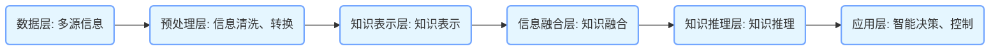

# AI Agent的知识整合：融合多源信息

> 关键词：AI Agent、知识整合、多源信息、信息融合、知识表示、知识推理、人工智能

> 摘要：本文围绕AI Agent的知识整合展开，深入探讨如何融合多源信息。在人工智能快速发展的当下，AI Agent面临着处理来自不同源头、不同格式信息的挑战。通过研究知识整合的方法和技术，能够提升AI Agent对复杂信息的理解和运用能力，使其在各种应用场景中发挥更强大的作用。文章详细介绍了相关的核心概念、算法原理、数学模型，通过项目实战展示具体实现过程，并分析了实际应用场景，最后推荐了相关工具和资源，对未来发展趋势与挑战进行了总结。

## 1. 背景介绍 
### 1.1 目的和范围
随着人工智能技术的不断进步，AI Agent在各个领域的应用越来越广泛。然而，现实世界中的信息具有多样性和复杂性，来自不同数据源（如文本、图像、传感器数据等）的信息格式和语义各不相同。AI Agent要实现智能决策和行为，就需要对这些多源信息进行有效的整合。本文的目的就是深入研究AI Agent知识整合的方法和技术，探讨如何融合多源信息，以提高AI Agent的智能水平和应用效果。范围涵盖了从核心概念的阐述、算法原理的分析、数学模型的构建，到项目实战的实现和实际应用场景的分析等多个方面。

### 1.2 预期读者
本文预期读者包括人工智能领域的研究人员、开发者、学生，以及对AI Agent和知识整合感兴趣的技术爱好者。对于希望深入了解AI Agent知识整合技术原理和实现方法的读者，本文提供了全面而详细的内容；对于正在从事相关项目开发的人员，本文的项目实战部分和工具资源推荐具有一定的参考价值。

### 1.3 文档结构概述
本文首先介绍了背景信息，包括目的、预期读者和文档结构概述。接着阐述了AI Agent知识整合的核心概念与联系，通过文本示意图和Mermaid流程图进行说明。然后详细讲解了核心算法原理和具体操作步骤，结合Python源代码进行阐述。之后介绍了相关的数学模型和公式，并举例说明。通过项目实战展示了代码实际案例和详细解释。分析了实际应用场景，推荐了相关的工具和资源。最后对未来发展趋势与挑战进行了总结，并提供了常见问题与解答和扩展阅读参考资料。

### 1.4 术语表
#### 1.4.1 核心术语定义
- **AI Agent**：人工智能代理，是一种能够感知环境、根据感知信息进行决策并采取行动的智能实体。
- **知识整合**：将来自不同数据源的知识进行收集、处理、融合，形成一个统一、一致的知识体系的过程。
- **多源信息**：指来自多个不同源头（如文本数据库、图像库、传感器网络等）的信息。
- **信息融合**：将多源信息进行综合处理，以获得更准确、更全面的信息的过程。

#### 1.4.2 相关概念解释
- **知识表示**：将知识以计算机能够理解和处理的方式进行表示的方法，常见的知识表示方法有逻辑表示法、语义网络、框架表示法等。
- **知识推理**：从已有的知识中推导出新的知识的过程，是AI Agent实现智能决策的重要手段。
- **本体**：对领域知识的一种形式化描述，用于明确概念之间的关系和约束，是知识整合和共享的重要工具。

#### 1.4.3 缩略词列表
- **AI**：Artificial Intelligence（人工智能）
- **ML**：Machine Learning（机器学习）
- **DL**：Deep Learning（深度学习）
- **NLP**：Natural Language Processing（自然语言处理）

## 2. 核心概念与联系 
### 核心概念原理
AI Agent的知识整合涉及到多个核心概念，包括知识表示、信息融合、知识推理等。知识表示是将多源信息转换为计算机能够处理的形式，不同的知识表示方法适用于不同类型的信息。例如，逻辑表示法适用于表示确定性的知识，语义网络适用于表示概念之间的关系。信息融合是将来自不同数据源的信息进行综合处理，以消除信息之间的冲突和冗余，提高信息的质量和准确性。知识推理则是利用已有的知识和信息，推导出新的知识和结论，为AI Agent的决策和行动提供支持。

### 架构的文本示意图
AI Agent的知识整合架构可以分为以下几个层次：
1. **数据层**：包含各种数据源，如文本数据库、图像库、传感器网络等，提供原始的多源信息。
2. **预处理层**：对原始信息进行清洗、转换、特征提取等预处理操作，将不同格式的信息转换为统一的表示形式。
3. **知识表示层**：采用合适的知识表示方法将预处理后的信息表示为知识，如本体、语义网络等。
4. **信息融合层**：对不同来源的知识进行融合，消除冲突和冗余，形成统一的知识体系。
5. **知识推理层**：利用融合后的知识进行推理，推导出新的知识和结论。
6. **应用层**：将推理结果应用于具体的任务和场景，如智能决策、智能控制等。

### Mermaid流程图


## 3. 核心算法原理 & 具体操作步骤 
### 核心算法原理
在AI Agent的知识整合中，常用的算法包括基于机器学习的算法和基于规则的算法。基于机器学习的算法通过对大量数据的学习，自动发现数据中的模式和规律，实现信息的融合和知识的推理。例如，深度学习算法可以用于图像和文本信息的特征提取和分类，聚类算法可以用于将相似的信息进行分组。基于规则的算法则是根据预先定义的规则和逻辑，对信息进行处理和推理。例如，专家系统就是基于规则的知识推理系统。

### 具体操作步骤
以下是一个基于Python实现的简单知识整合示例，假设我们有两个数据源，一个是文本数据，另一个是数值数据，我们要将这两个数据源的信息进行整合。

```python
# 文本数据
text_data = "The temperature is 25 degrees Celsius."
# 数值数据
numeric_data = 25

# 步骤1：文本数据处理
import re

# 从文本中提取数值信息
match = re.search(r'\d+', text_data)
if match:
    text_numeric_value = int(match.group())
else:
    text_numeric_value = None

# 步骤2：信息融合
if text_numeric_value == numeric_data:
    integrated_value = text_numeric_value
else:
    # 可以根据具体需求进行更复杂的融合策略
    integrated_value = (text_numeric_value + numeric_data) / 2

print("Integrated value:", integrated_value)
```

### 代码解释
1. **文本数据处理**：使用正则表达式从文本中提取数值信息。
2. **信息融合**：比较文本中提取的数值和数值数据，如果相等，则直接使用该值作为整合结果；否则，取两者的平均值作为整合结果。

## 4. 数学模型和公式 & 详细讲解 & 举例说明 
### 数学模型和公式
在信息融合中，常用的数学模型包括贝叶斯模型、D-S证据理论等。

#### 贝叶斯模型
贝叶斯模型基于贝叶斯定理，用于处理不确定性信息。贝叶斯定理的公式为：

$$P(A|B)=\frac{P(B|A)P(A)}{P(B)}$$

其中，$P(A|B)$ 表示在事件 $B$ 发生的条件下事件 $A$ 发生的概率，$P(B|A)$ 表示在事件 $A$ 发生的条件下事件 $B$ 发生的概率，$P(A)$ 表示事件 $A$ 发生的先验概率，$P(B)$ 表示事件 $B$ 发生的先验概率。

#### D-S证据理论
D-S证据理论是一种处理不确定性信息的数学方法，通过定义基本概率分配函数（BPA）来表示证据的可信度。设 $\Theta$ 为识别框架，$m$ 为基本概率分配函数，则有：

$$\sum_{A\subseteq\Theta}m(A)=1$$

其中，$m(A)$ 表示证据对命题 $A$ 的支持程度。

### 详细讲解
#### 贝叶斯模型
贝叶斯模型的核心思想是通过先验概率和条件概率来计算后验概率。在信息融合中，可以将不同数据源的信息看作是不同的证据，通过贝叶斯定理来更新对某个事件的概率估计。例如，在医疗诊断中，不同的检查结果可以看作是不同的证据，通过贝叶斯定理可以综合这些证据来提高诊断的准确性。

#### D-S证据理论
D-S证据理论允许对不确定性进行更灵活的处理。基本概率分配函数可以将可信度分配给不同的命题，包括单个命题和命题的组合。通过组合规则，可以将多个证据的基本概率分配函数进行组合，得到更准确的证据支持度。

### 举例说明
#### 贝叶斯模型举例
假设我们有两个传感器，一个传感器检测到有物体的概率为 $P(B_1)=0.8$，另一个传感器检测到有物体的概率为 $P(B_2)=0.7$。已知在有物体的情况下，第一个传感器检测到的概率为 $P(B_1|A)=0.9$，第二个传感器检测到的概率为 $P(B_2|A)=0.8$。先验概率 $P(A)=0.5$。

根据贝叶斯定理，计算在两个传感器都检测到有物体的情况下，实际有物体的概率 $P(A|B_1\cap B_2)$：

首先计算 $P(B_1\cap B_2|A)=P(B_1|A)P(B_2|A)=0.9\times0.8 = 0.72$

$P(B_1\cap B_2)=P(B_1\cap B_2|A)P(A)+P(B_1\cap B_2|\neg A)P(\neg A)$

假设 $P(B_1\cap B_2|\neg A)=0.1$，$P(\neg A)=1 - P(A)=0.5$

则 $P(B_1\cap B_2)=0.72\times0.5 + 0.1\times0.5 = 0.41$

$P(A|B_1\cap B_2)=\frac{P(B_1\cap B_2|A)P(A)}{P(B_1\cap B_2)}=\frac{0.72\times0.5}{0.41}\approx0.88$

#### D-S证据理论举例
设识别框架 $\Theta=\{A,B\}$，两个证据的基本概率分配函数分别为：

$m_1(A)=0.6$，$m_1(B)=0.2$，$m_1(\Theta)=0.2$

$m_2(A)=0.7$，$m_2(B)=0.1$，$m_2(\Theta)=0.2$

使用Dempster组合规则进行组合：

$K = \sum_{X\cap Y=\varnothing}m_1(X)m_2(Y)=m_1(A)m_2(B)+m_1(B)m_2(A)=0.6\times0.1 + 0.2\times0.7 = 0.2$

$m(A)=\frac{\sum_{X\cap Y = A}m_1(X)m_2(Y)}{1 - K}=\frac{m_1(A)m_2(A)+m_1(A)m_2(\Theta)+m_1(\Theta)m_2(A)}{1 - 0.2}=\frac{0.6\times0.7 + 0.6\times0.2 + 0.2\times0.7}{0.8}=0.8$

$m(B)=\frac{\sum_{X\cap Y = B}m_1(X)m_2(Y)}{1 - K}=\frac{m_1(B)m_2(B)+m_1(B)m_2(\Theta)+m_1(\Theta)m_2(B)}{1 - 0.2}=\frac{0.2\times0.1 + 0.2\times0.2 + 0.2\times0.1}{0.8}=0.1$

$m(\Theta)=1 - m(A) - m(B)=0.1$

## 5. 项目实战：代码实际案例和详细解释说明 
### 5.1  开发环境搭建
#### 硬件环境
- 计算机：Intel Core i7及以上处理器，16GB及以上内存，512GB及以上硬盘。
- 显卡：NVIDIA GeForce GTX 1080及以上（可选，用于深度学习加速）。

#### 软件环境
- 操作系统：Windows 10、Linux（如Ubuntu 18.04及以上）或macOS。
- Python：Python 3.7及以上版本。
- 开发工具：PyCharm、Jupyter Notebook等。

#### 安装依赖库
```bash
pip install numpy pandas scikit-learn tensorflow keras
```

### 5.2  源代码详细实现和代码解读
以下是一个基于深度学习的多源信息融合的项目实战示例，假设我们要融合图像和文本信息进行情感分类。

```python
import numpy as np
import pandas as pd
from sklearn.model_selection import train_test_split
from tensorflow.keras.preprocessing.text import Tokenizer
from tensorflow.keras.preprocessing.sequence import pad_sequences
from tensorflow.keras.preprocessing.image import ImageDataGenerator
from tensorflow.keras.models import Model
from tensorflow.keras.layers import Input, Embedding, LSTM, Dense, Concatenate, Conv2D, MaxPooling2D, Flatten

# 步骤1：数据加载
# 文本数据
text_data = pd.read_csv('text_data.csv')
texts = text_data['text'].values
labels = text_data['label'].values

# 图像数据
image_dir = 'image_data'
image_generator = ImageDataGenerator(rescale=1./255)
image_data = image_generator.flow_from_directory(
    image_dir,
    target_size=(100, 100),
    batch_size=32,
    class_mode='binary'
)

# 步骤2：文本数据预处理
tokenizer = Tokenizer(num_words=10000)
tokenizer.fit_on_texts(texts)
sequences = tokenizer.texts_to_sequences(texts)
max_sequence_length = 100
padded_sequences = pad_sequences(sequences, maxlen=max_sequence_length)

# 步骤3：数据划分
text_train, text_test, label_train, label_test = train_test_split(padded_sequences, labels, test_size=0.2, random_state=42)
image_train, image_test = train_test_split(image_data, test_size=0.2, random_state=42)

# 步骤4：模型构建
# 文本模型
text_input = Input(shape=(max_sequence_length,))
embedding_layer = Embedding(input_dim=10000, output_dim=128)(text_input)
lstm_layer = LSTM(128)(embedding_layer)

# 图像模型
image_input = Input(shape=(100, 100, 3))
conv1 = Conv2D(32, (3, 3), activation='relu')(image_input)
pool1 = MaxPooling2D((2, 2))(conv1)
conv2 = Conv2D(64, (3, 3), activation='relu')(pool1)
pool2 = MaxPooling2D((2, 2))(conv2)
flatten_layer = Flatten()(pool2)

# 融合模型
merged_layer = Concatenate()([lstm_layer, flatten_layer])
output_layer = Dense(1, activation='sigmoid')(merged_layer)

model = Model(inputs=[text_input, image_input], outputs=output_layer)

# 步骤5：模型编译和训练
model.compile(optimizer='adam', loss='binary_crossentropy', metrics=['accuracy'])
model.fit([text_train, image_train], label_train, epochs=10, batch_size=32, validation_data=([text_test, image_test], label_test))

# 步骤6：模型评估
loss, accuracy = model.evaluate([text_test, image_test], label_test)
print(f"Test Loss: {loss}, Test Accuracy: {accuracy}")
```

### 5.3  代码解读与分析
1. **数据加载**：使用 `pandas` 加载文本数据，使用 `ImageDataGenerator` 加载图像数据。
2. **文本数据预处理**：使用 `Tokenizer` 将文本转换为序列，使用 `pad_sequences` 对序列进行填充，使其长度一致。
3. **数据划分**：使用 `train_test_split` 将数据划分为训练集和测试集。
4. **模型构建**：分别构建文本模型和图像模型，使用 `Concatenate` 层将两个模型的输出进行融合，最后添加一个全连接层进行分类。
5. **模型编译和训练**：使用 `adam` 优化器和 `binary_crossentropy` 损失函数进行编译，使用 `fit` 方法进行训练。
6. **模型评估**：使用 `evaluate` 方法对模型进行评估，