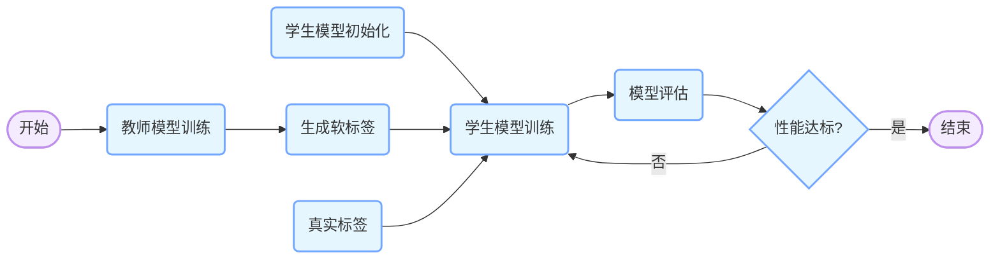

# AI Agent的知识蒸馏在模型轻量化中的应用

> 关键词：AI Agent、知识蒸馏、模型轻量化、深度学习、模型压缩

> 摘要：本文深入探讨了AI Agent的知识蒸馏在模型轻量化中的应用。首先介绍了相关背景知识，包括目的范围、预期读者等。接着阐述了核心概念与联系，分析了知识蒸馏和模型轻量化的原理及架构。详细讲解了核心算法原理并给出Python代码示例，同时介绍了相关数学模型和公式。通过项目实战展示了如何应用知识蒸馏实现模型轻量化，分析了实际应用场景。还推荐了学习资源、开发工具框架和相关论文著作。最后总结了未来发展趋势与挑战，并提供了常见问题解答和扩展阅读参考资料，旨在为读者全面呈现AI Agent知识蒸馏在模型轻量化领域的重要性和应用方法。

## 1. 背景介绍 
### 1.1 目的和范围
随着人工智能技术的飞速发展，AI Agent在各个领域得到了广泛应用。然而，许多AI Agent所依赖的深度学习模型通常具有庞大的参数数量和复杂的结构，这导致模型在部署和运行时面临着计算资源消耗大、推理速度慢等问题。模型轻量化成为解决这些问题的关键技术之一。知识蒸馏作为一种有效的模型压缩方法，能够将大型教师模型的知识迁移到小型学生模型中，从而在保持一定性能的前提下实现模型的轻量化。本文的目的是深入探讨AI Agent的知识蒸馏在模型轻量化中的应用，涵盖知识蒸馏的原理、算法、实际应用案例以及相关工具和资源推荐等方面。

### 1.2 预期读者
本文主要面向对人工智能、深度学习、模型压缩等领域感兴趣的研究人员、工程师和开发者。对于正在从事AI Agent开发和部署，希望解决模型计算资源消耗问题的专业人士，以及对知识蒸馏和模型轻量化技术有深入学习需求的学生和爱好者都具有一定的参考价值。

### 1.3 文档结构概述
本文将按照以下结构进行组织：首先介绍相关背景知识，包括目的范围、预期读者等；接着阐述核心概念与联系，分析知识蒸馏和模型轻量化的原理及架构；详细讲解核心算法原理并给出Python代码示例；介绍相关数学模型和公式；通过项目实战展示如何应用知识蒸馏实现模型轻量化；分析实际应用场景；推荐学习资源、开发工具框架和相关论文著作；最后总结未来发展趋势与挑战，并提供常见问题解答和扩展阅读参考资料。

### 1.4 术语表
#### 1.4.1 核心术语定义
- **AI Agent**：人工智能代理，是一种能够感知环境、做出决策并执行动作的智能实体，通常基于深度学习模型实现。
- **知识蒸馏**：一种模型压缩技术，通过将大型教师模型的知识迁移到小型学生模型中，使学生模型学习到教师模型的泛化能力。
- **模型轻量化**：通过各种技术手段减少模型的参数数量和计算复杂度，从而降低模型的存储和计算成本，提高模型的推理速度。
- **教师模型**：在知识蒸馏中，具有较高性能和复杂结构的大型模型，作为知识的提供者。
- **学生模型**：在知识蒸馏中，结构相对简单、参数较少的小型模型，通过学习教师模型的知识来提高自身性能。

#### 1.4.2 相关概念解释
- **软标签**：在知识蒸馏中，教师模型输出的概率分布，包含了更多的类别之间的相对信息，比硬标签（真实标签）提供了更多的知识。
- **温度参数**：在知识蒸馏中用于调整软标签的平滑程度，温度越高，软标签越平滑，类别之间的差异越小。

#### 1.4.3 缩略词列表
- **DNN**：深度神经网络（Deep Neural Network）
- **CNN**：卷积神经网络（Convolutional Neural Network）
- **RNN**：循环神经网络（Recurrent Neural Network）

## 2. 核心概念与联系 
### 2.1 知识蒸馏原理
知识蒸馏的核心思想是让小型学生模型学习大型教师模型的输出，从而获得教师模型的泛化能力。具体来说，教师模型在训练数据上进行训练后，会输出每个样本属于各个类别的概率分布，这个概率分布被称为软标签。学生模型在训练过程中，不仅要学习真实标签，还要学习教师模型的软标签。通过这种方式，学生模型可以学习到教师模型所学到的更丰富的知识，从而在保持较小模型规模的情况下，达到接近教师模型的性能。

### 2.2 模型轻量化原理
模型轻量化的主要目标是减少模型的参数数量和计算复杂度，从而降低模型的存储和计算成本，提高模型的推理速度。常见的模型轻量化方法包括模型剪枝、量化、知识蒸馏等。模型剪枝通过去除模型中不重要的连接或神经元来减少参数数量；量化则是将模型参数从高精度表示转换为低精度表示，从而减少存储和计算量；知识蒸馏则是通过学习大型教师模型的知识，使小型学生模型在性能上接近教师模型，从而实现模型的轻量化。

### 2.3 知识蒸馏与模型轻量化的联系
知识蒸馏是实现模型轻量化的一种有效方法。通过将大型教师模型的知识迁移到小型学生模型中，知识蒸馏可以使学生模型在参数数量和计算复杂度大幅降低的情况下，仍然保持较好的性能。因此，知识蒸馏在模型轻量化中具有重要的应用价值。

### 2.4 核心概念架构的文本示意图
```plaintext
知识蒸馏架构：
教师模型（大型、高性能） -> 软标签（概率分布）
                     |
                     v
学生模型（小型、轻量级） -> 学习（真实标签 + 软标签）

模型轻量化流程：
原始大型模型 -> 知识蒸馏 -> 小型学生模型（轻量化）
```

### 2.5 Mermaid流程图


## 3. 核心算法原理 & 具体操作步骤 
### 3.1 知识蒸馏算法原理
知识蒸馏的核心是在学生模型的损失函数中引入教师模型的软标签信息。通常，学生模型的损失函数由两部分组成：一部分是学生模型预测结果与真实标签之间的交叉熵损失，另一部分是学生模型预测结果与教师模型软标签之间的交叉熵损失。通过调整这两部分损失的权重，可以平衡学生模型对真实标签和教师模型知识的学习。

### 3.2 具体操作步骤
1. **教师模型训练**：使用训练数据对大型教师模型进行训练，直到教师模型达到较好的性能。
2. **生成软标签**：使用训练好的教师模型对训练数据进行推理，得到每个样本的软标签。
3. **学生模型初始化**：初始化小型学生模型的参数。
4. **学生模型训练**：在学生模型的训练过程中，计算学生模型预测结果与真实标签之间的交叉熵损失 $L_{ce}$ 和学生模型预测结果与教师模型软标签之间的交叉熵损失 $L_{kd}$，并将它们加权求和得到总损失 $L$。使用总损失对学生模型的参数进行更新。
5. **模型评估**：使用验证数据对训练好的学生模型进行评估，检查其性能是否达到要求。如果性能不达标，则继续训练学生模型；如果性能达标，则结束训练。

### 3.3 Python源代码示例
```python
import torch
import torch.nn as nn
import torch.optim as optim
from torchvision import datasets, transforms

# 定义教师模型
class TeacherModel(nn.Module):
    def __init__(self):
        super(TeacherModel, self).__init__()
        self.fc1 = nn.Linear(784, 256)
        self.fc2 = nn.Linear(256, 128)
        self.fc3 = nn.Linear(128, 10)

    def forward(self, x):
        x = x.view(-1, 784)
        x = torch.relu(self.fc1(x))
        x = torch.relu(self.fc2(x))
        x = self.fc3(x)
        return x

# 定义学生模型
class StudentModel(nn.Module):
    def __init__(self):
        super(StudentModel, self).__init__()
        self.fc1 = nn.Linear(784, 64)
        self.fc2 = nn.Linear(64, 10)

    def forward(self, x):
        x = x.view(-1, 784)
        x = torch.relu(self.fc1(x))
        x = self.fc2(x)
        return x

# 数据加载
transform = transforms.Compose([transforms.ToTensor(), transforms.Normalize((0.1307,), (0.3081,))])
train_dataset = datasets.MNIST(root='./data', train=True, transform=transform, download=True)
train_loader = torch.utils.data.DataLoader(train_dataset, batch_size=64, shuffle=True)

# 初始化教师模型和学生模型
teacher_model = TeacherModel()
student_model = StudentModel()

# 定义损失函数和优化器
criterion_ce = nn.CrossEntropyLoss()
criterion_kd = nn.KLDivLoss(reduction='batchmean')
optimizer = optim.Adam(student_model.parameters(), lr=0.001)

# 训练教师模型（此处省略，假设教师模型已经训练好）

# 知识蒸馏训练学生模型
temperature = 4
alpha = 0.5
epochs = 10

for epoch in range(epochs):
    for data, target in train_loader:
        optimizer.zero_grad()

        # 教师模型输出软标签
        with torch.no_grad():
            teacher_output = teacher_model(data)
            teacher_logits = teacher_output / temperature
            teacher_probs = torch.softmax(teacher_logits, dim=1)

        # 学生模型输出
        student_output = student_model(data)
        student_logits = student_output / temperature
        student_probs = torch.softmax(student_logits, dim=1)

        # 计算损失
        loss_ce = criterion_ce(student_output, target)
        loss_kd = criterion_kd(torch.log(student_probs), teacher_probs) * (temperature ** 2)
        loss = alpha * loss_ce + (1 - alpha) * loss_kd

        # 反向传播和参数更新
        loss.backward()
        optimizer.step()

    print(f'Epoch {epoch + 1}/{epochs}, Loss: {loss.item()}')
```

## 4. 数学模型和公式 & 详细讲解 & 举例说明 
### 4.1 交叉熵损失函数
交叉熵损失函数是深度学习中常用的损失函数之一，用于衡量两个概率分布之间的差异。对于分类问题，假设真实标签的概率分布为 $p$，模型预测结果的概率分布为 $q$，则交叉熵损失函数定义为：
$$
H(p, q) = -\sum_{i=1}^{C} p_i \log(q_i)
$$
其中，$C$ 是类别数。

### 4.2 知识蒸馏损失函数
在知识蒸馏中，学生模型的损失函数由两部分组成：一部分是学生模型预测结果与真实标签之间的交叉熵损失 $L_{ce}$，另一部分是学生模型预测结果与教师模型软标签之间的交叉熵损失 $L_{kd}$。总损失 $L$ 定义为：
$$
L = \alpha L_{ce} + (1 - \alpha) L_{kd}
$$
其中，$\alpha$ 是一个权重参数，用于平衡两部分损失的重要性。

### 4.3 软标签生成
在知识蒸馏中，教师模型的输出通常经过温度参数 $T$ 的缩放，然后再进行 softmax 操作，得到软标签。具体来说，假设教师模型的输出为 $z$，则软标签 $q$ 定义为：
$$
q_i = \frac{\exp(z_i / T)}{\sum_{j=1}^{C} \exp(z_j / T)}
$$
其中，$T$ 是温度参数，$C$ 是类别数。

### 4.4 举例说明
假设我们有一个三分类问题，真实标签为 $p = [1, 0, 0]$，教师模型的输出为 $z = [3, 1, 0]$，温度参数 $T = 2$。则教师模型的软标签 $q$ 计算如下：
$$
q_1 = \frac{\exp(3 / 2)}{\exp(3 / 2) + \exp(1 / 2) + \exp(0 / 2)} \approx 0.73
$$
$$
q_2 = \frac{\exp(1 / 2)}{\exp(3 / 2) + \exp(1 / 2) + \exp(0 / 2)} \approx 0.22
$$
$$
q_3 = \frac{\exp(0 / 2)}{\exp(3 / 2) + \exp(1 / 2) + \exp(0 / 2)} \approx 0.05
$$
假设学生模型的输出为 $s = [2, 1, 0]$，则学生模型的预测结果 $r$ 计算如下：
$$
r_1 = \frac{\exp(2 / 2)}{\exp(2 / 2) + \exp(1 / 2) + \exp(0 / 2)} \approx 0.60
$$
$$
r_2 = \frac{\exp(1 / 2)}{\exp(2 / 2) + \exp(1 / 2) + \exp(0 / 2)} \approx 0.27
$$
$$
r_3 = \frac{\exp(0 / 2)}{\exp(2 / 2) + \exp(1 / 2) + \exp(0 / 2)} \approx 0.13
$$
则学生模型与真实标签之间的交叉熵损失 $L_{ce}$ 为：
$$
L_{ce} = -\sum_{i=1}^{3} p_i \log(r_i) = -\log(0.60) \approx 0.51
$$
学生模型与教师模型软标签之间的交叉熵损失 $L_{kd}$ 为：
$$
L_{kd} = -\sum_{i=1}^{3} q_i \log(r_i) = -0.73 \log(0.60) - 0.22 \log(0.27) - 0.05 \log(0.13) \approx 0.42
$$
假设 $\alpha = 0.5$，则总损失 $L$ 为：
$$
L = 0.5 \times 0.51 + (1 - 0.5) \times 0.42 = 0.465
$$

## 5. 项目实战：代码实际案例和详细解释说明 
### 5.1  开发环境搭建
#### 5.1.1 安装Python
首先，确保你已经安装了 Python 环境，建议使用 Python 3.7 及以上版本。可以从 Python 官方网站（https://www.python.org/downloads/）下载并安装 Python。

#### 5.1.2 安装深度学习框架
本项目使用 PyTorch 作为深度学习框架，可以使用以下命令安装 PyTorch：
```sh
pip install torch torchvision
```

#### 5.1.3 安装其他依赖库
还需要安装一些其他的依赖库，如 numpy、matplotlib 等，可以使用以下命令安装：
```sh
pip install numpy matplotlib
```

### 5.2  源代码详细实现和代码解读
以下是一个完整的项目实战代码示例，用于在 MNIST 数据集上进行知识蒸馏实现模型轻量化：
```python
import torch
import torch.nn as nn
import torch.optim as optim
from torchvision import datasets, transforms
import matplotlib.pyplot as plt

# 定义教师模型
class TeacherModel(nn.Module):
    def __init__(self):
        super(TeacherModel, self).__init__()
        self.fc1 = nn.Linear(784, 256)
        self.fc2 = nn.Linear(256, 128)
        self.fc3 = nn.Linear(128, 10)

    def forward(self, x):
        x = x.view(-1, 784)
        x = torch.relu(self.fc1(x))
        x = torch.relu(self.fc2(x))
        x = self.fc3(x)
        return x

# 定义学生模型
class StudentModel(nn.Module):
    def __init__(self):
        super(StudentModel, self).__init__()
        self.fc1 = nn.Linear(784, 64)
        self.fc2 = nn.Linear(64, 10)

    def forward(self, x):
        x = x.view(-1, 784)
        x = torch.relu(self.fc1(x))
        x = self.fc2(x)
        return x

# 数据加载
transform = transforms.Compose([transforms.ToTensor(), transforms.Normalize((0.1307,), (0.3081,))])
train_dataset = datasets.MNIST(root='./data', train=True, transform=transform, download=True)
test_dataset = datasets.MNIST(root='./data', train=False, transform=transform)
train_loader = torch.utils.data.DataLoader(train_dataset, batch_size=64, shuffle=True)
test_loader = torch.utils.data.DataLoader(test_dataset, batch_size=64, shuffle=False)

# 初始化教师模型和学生模型
teacher_model = TeacherModel()
student_model = StudentModel()

# 定义损失函数和优化器
criterion_ce = nn.CrossEntropyLoss()
criterion_kd = nn.KLDivLoss(reduction='batchmean')
optimizer_teacher = optim.Adam(teacher_model.parameters(), lr=0.001)
optimizer_student = optim.Adam(student_model.parameters(), lr=0.001)

# 训练教师模型
def train_teacher(model, train_loader, optimizer, epochs):
    model.train()
    train_losses = []
    for epoch in range(epochs):
        running_loss = 0.0
        for data, target in train_loader:
            optimizer.zero_grad()
            output = model(data)
            loss = criterion_ce(output, target)
            loss.backward()
            optimizer.step()
            running_loss += loss.item()
        train_loss = running_loss / len(train_loader)
        train_losses.append(train_loss)
        print(f'Teacher Epoch {epoch + 1}/{epochs}, Loss: {train_loss}')
    return train_losses

# 训练学生模型
def train_student(student_model, teacher_model, train_loader, optimizer, epochs, temperature=4, alpha=0.5):
    student_model.train()
    teacher_model.eval()
    train_losses = []
    for epoch in range(epochs):
        running_loss = 0.0
        for data, target in train_loader:
            optimizer.zero_grad()

            # 教师模型输出软标签
            with torch.no_grad():
                teacher_output = teacher_model(data)
                teacher_logits = teacher_output / temperature
                teacher_probs = torch.softmax(teacher_logits, dim=1)

            # 学生模型输出
            student_output = student_model(data)
            student_logits = student_output / temperature
            student_probs = torch.softmax(student_logits, dim=1)

            # 计算损失
            loss_ce = criterion_ce(student_output, target)
            loss_kd = criterion_kd(torch.log(student_probs), teacher_probs) * (temperature ** 2)
            loss = alpha * loss_ce + (1 - alpha) * loss_kd

            # 反向传播和参数更新
            loss.backward()
            optimizer.step()
            running_loss += loss.item()
        train_loss = running_loss / len(train_loader)
        train_losses.append(train_loss)
        print(f'Student Epoch {epoch + 1}/{epochs}, Loss: {train_loss}')
    return train_losses

# 评估模型
def evaluate(model, test_loader):
    model.eval()
    correct = 0
    total = 0
    with torch.no_grad():
        for data, target in test_loader:
            output = model(data)
            _, predicted = torch.max(output.data, 1)
            total += target.size(0)
            correct += (predicted == target).sum().item()
    accuracy = 100 * correct / total
    print(f'Accuracy: {accuracy}%')
    return accuracy

# 训练教师模型
teacher_train_losses = train_teacher(teacher_model, train_loader, optimizer_teacher, epochs=10)

# 训练学生模型
student_train_losses = train_student(student_model, teacher_model, train_loader, optimizer_student, epochs=10)

# 评估教师模型和学生模型
teacher_accuracy = evaluate(teacher_model, test_loader)
student_accuracy = evaluate(student_model, test_loader)

# 绘制训练损失曲线
plt.plot(teacher_train_losses, label='Teacher Loss')
plt.plot(student_train_losses, label='Student Loss')
plt.xlabel('Epoch')
plt.ylabel('Loss')
plt.legend()
plt.show()
```

### 5.3  代码解读与分析
#### 5.3.1 模型定义
- `TeacherModel`：定义了一个简单的三层全连接神经网络作为教师模型，包含两个隐藏层，分别有 256 和 128 个神经元。
- `StudentModel`：定义了一个简单的两层全连接神经网络作为学生模型，包含一个隐藏层，有 64 个神经元。

#### 5.3.2 数据加载
使用 `torchvision` 库加载 MNIST 数据集，并进行归一化处理。将数据集分为训练集和测试集，并使用 `DataLoader` 进行批量加载。

#### 5.3.3 训练教师模型
`train_teacher` 函数用于训练教师模型，使用交叉熵损失函数和 Adam 优化器进行训练。

#### 5.3.4 训练学生模型
`train_student` 函数用于训练学生模型，在损失函数中引入了教师模型的软标签信息，使用知识蒸馏的方法进行训练。

#### 5.3.5 评估模型
`evaluate` 函数用于评估模型的准确率，在测试集上进行评估。

#### 5.3.6 绘制训练损失曲线
使用 `matplotlib` 库绘制教师模型和学生模型的训练损失曲线，直观地展示训练过程。

## 6. 实际应用场景 
### 6.1 移动设备和嵌入式系统
在移动设备（如智能手机、平板电脑）和嵌入式系统（如智能手表、智能家居设备）中，计算资源和存储容量通常有限。通过知识蒸馏实现模型轻量化，可以将大型深度学习模型压缩为小型学生模型，从而在这些设备上高效运行，实现实时的智能交互和决策。例如，在智能手机上实现图像识别、语音识别等功能，在智能手表上实现健康监测和运动识别等功能。

### 6.2 边缘计算
边缘计算是指在靠近数据源的边缘设备上进行数据处理和分析，减少数据传输延迟和云端计算压力。在边缘计算场景中，由于边缘设备的计算能力和存储容量有限，需要使用轻量化的模型。知识蒸馏可以帮助将云端的大型模型压缩为适合边缘设备运行的小型模型，从而在边缘设备上实现实时的智能推理。例如，在工业物联网中，通过在边缘设备上部署轻量化的故障预测模型，实时监测设备状态，及时发现故障并进行预警。

### 6.3 在线服务
在在线服务场景中，如搜索引擎、推荐系统等，需要处理大量的用户请求。为了提高服务的响应速度和吞吐量，需要使用轻量化的模型。知识蒸馏可以将大型的深度学习模型压缩为小型学生模型，从而减少模型的推理时间和计算资源消耗，提高服务的性能和效率。例如，在搜索引擎中，使用轻量化的文本分类模型对搜索结果进行分类和排序，提高搜索的准确性和效率。

### 6.4 自动驾驶
在自动驾驶领域，需要实时处理大量的传感器数据，并做出快速准确的决策。由于车辆的计算资源和存储容量有限，需要使用轻量化的模型。知识蒸馏可以将大型的目标检测、语义分割等模型压缩为小型学生模型，从而在车辆上高效运行，实现实时的环境感知和决策。例如，在自动驾驶汽车中，使用轻量化的目标检测模型实时检测道路上的车辆、行人等目标，确保行车安全。

## 7. 工具和资源推荐
### 7.1 学习资源推荐
#### 7.1.1 书籍推荐
- 《深度学习》（Deep Learning）：由 Ian Goodfellow、Yoshua Bengio 和 Aaron Courville 所著，是深度学习领域的经典教材，涵盖了深度学习的基本概念、算法和应用。
- 《动手学深度学习》（Dive into Deep Learning）：由 Aston Zhang、Zachary C. Lipton、Mu Li 和 Alexander J. Smola 所著，提供了丰富的代码示例和实践项目，适合初学者快速上手深度学习。
- 《Python深度学习》（Deep Learning with Python）：由 Francois Chollet 所著，介绍了如何使用 Python 和 Keras 框架进行深度学习模型的开发和训练。

#### 7.1.2 在线课程
- Coursera 上的“深度学习专项课程”（Deep Learning Specialization）：由 Andrew Ng 教授授课，包括五门课程，涵盖了深度学习的基础知识、卷积神经网络、循环神经网络等内容。
- edX 上的“强化学习”（Reinforcement Learning）：由 Berkeley 大学的 Pieter Abbeel 教授授课，介绍了强化学习的基本概念、算法和应用。
- 吴恩达的《机器学习》课程：在网易云课堂等平台可以学习，是机器学习领域的经典入门课程，为深度学习打下坚实的基础。

#### 7.1.3 技术博客和网站
- Medium 上的 Towards Data Science：汇集了众多数据科学和机器学习领域的优秀文章，涵盖了最新的研究成果和实践经验。
- ArXiv：一个开放的预印本平台，提供了大量的计算机科学、物理学等领域的研究论文，及时了解最新的学术动态。
- Kaggle：一个数据科学竞赛平台，提供了丰富的数据集、代码示例和竞赛项目，通过参与竞赛可以提高实践能力。

### 7.2 开发工具框架推荐
#### 7.2.1 IDE和编辑器
- PyCharm：一款专业的 Python 集成开发环境，提供了丰富的代码编辑、调试、版本控制等功能，适合大型项目的开发。
- Jupyter Notebook：一个交互式的开发环境，支持 Python、R 等多种编程语言，方便进行代码的编写、运行和可视化展示，适合数据探索和模型实验。
- Visual Studio Code：一款轻量级的代码编辑器，支持多种编程语言和插件扩展，具有良好的代码编辑和调试功能，适合快速开发和小型项目。

#### 7.2.2 调试和性能分析工具
- PyTorch Profiler：PyTorch 自带的性能分析工具，可以帮助开发者分析模型的计算性能、内存使用情况等，找出性能瓶颈。
- TensorBoard：TensorFlow 提供的可视化工具，也可以与 PyTorch 结合使用，用于可视化模型的训练过程、损失曲线、准确率等指标。
- cProfile：Python 自带的性能分析模块，可以分析 Python 代码的执行时间和函数调用情况，帮助开发者优化代码性能。

#### 7.2.3 相关框架和库
- PyTorch：一个开源的深度学习框架，提供了丰富的神经网络层、优化器、损失函数等工具，支持 GPU 加速，方便进行模型的开发和训练。
- TensorFlow：另一个广泛使用的开源深度学习框架，具有强大的分布式训练和部署能力，提供了丰富的工具和库，适合大规模的工业应用。
- Scikit-learn：一个用于机器学习的 Python 库，提供了丰富的机器学习算法和工具，如分类、回归、聚类等，适合快速实现简单的机器学习模型。

### 7.3 相关论文著作推荐
#### 7.3.1 经典论文
- “Distilling the Knowledge in a Neural Network”：由 Geoffrey Hinton 等人发表，是知识蒸馏领域的开创性论文，提出了知识蒸馏的基本思想和方法。
- “MobileNets: Efficient Convolutional Neural Networks for Mobile Vision Applications”：提出了 MobileNet 系列模型，是一种轻量级的卷积神经网络，适合在移动设备上运行。
- “SqueezeNet: AlexNet-level accuracy with 50x fewer parameters and <0.5MB model size”：提出了 SqueezeNet 模型，通过压缩模型参数实现了模型的轻量化，同时保持了较高的准确率。

#### 7.3.2 最新研究成果
- 在 ArXiv 等预印本平台上搜索“Knowledge Distillation”、“Model Compression”等关键词，可以找到最新的知识蒸馏和模型轻量化领域的研究成果。
- 参加国际学术会议，如 NeurIPS、ICML、CVPR 等，了解最新的学术动态和研究进展。

#### 7.3.3 应用案例分析
- 在 Kaggle 等平台上搜索相关的竞赛项目和代码示例，了解知识蒸馏和模型轻量化在实际应用中的具体实现方法和效果。
- 阅读相关的技术博客和文章，如 Towards Data Science 上的文章，了解知识蒸馏和模型轻量化在不同领域的应用案例。

## 8. 总结：未来发展趋势与挑战
### 8.1 未来发展趋势
#### 8.1.1 多模态知识蒸馏
随着人工智能技术的发展，多模态数据（如图像、文本、语音等）的处理变得越来越重要。未来的知识蒸馏技术可能会扩展到多模态领域，实现多模态教师模型的知识蒸馏，从而提高多模态模型的性能和效率。

#### 8.1.2 自适应知识蒸馏
不同的任务和数据集对模型的要求不同，未来的知识蒸馏技术可能会实现自适应的知识蒸馏，根据任务和数据集的特点自动调整蒸馏策略和参数，从而提高知识蒸馏的效果和泛化能力。

#### 8.1.3 与其他模型压缩技术的结合
知识蒸馏可以与其他模型压缩技术（如模型剪枝、量化等）相结合，进一步提高模型的轻量化程度和性能。未来的研究可能会探索更有效的结合方式，实现更高效的模型压缩。

#### 8.1.4 应用领域的拓展
随着知识蒸馏技术的不断发展，其应用领域也将不断拓展。除了移动设备、边缘计算、在线服务等领域，知识蒸馏还可能应用于医疗、金融、交通等更多领域，为这些领域的智能化发展提供支持。

### 8.2 挑战
#### 8.2.1 知识表示和迁移问题
在知识蒸馏中，如何有效地表示教师模型的知识并将其迁移到学生模型中是一个关键问题。目前的知识蒸馏方法主要基于软标签进行知识迁移，但这种方法可能无法充分利用教师模型的所有知识。未来需要研究更有效的知识表示和迁移方法，提高知识蒸馏的效果。

#### 8.2.2 模型性能和轻量化的平衡
在实现模型轻量化的同时，需要保证模型的性能不受太大影响。如何在模型性能和轻量化之间找到一个平衡点是一个挑战。未来需要研究更有效的模型设计和训练方法，实现模型性能和轻量化的双赢。

#### 8.2.3 计算资源和时间成本
知识蒸馏通常需要额外的计算资源和时间成本，特别是在训练大型教师模型和进行多次蒸馏迭代时。如何降低知识蒸馏的计算资源和时间成本是一个需要解决的问题。未来需要研究更高效的知识蒸馏算法和优化方法，提高知识蒸馏的效率。

#### 8.2.4 数据隐私和安全问题
在知识蒸馏过程中，教师模型的输出可能包含敏感信息，如用户的隐私数据。如何保证数据的隐私和安全是一个重要的挑战。未来需要研究更安全的知识蒸馏方法，防止数据泄露和滥用。

## 9. 附录：常见问题与解答
### 9.1 知识蒸馏中的温度参数有什么作用？
温度参数 $T$ 用于调整教师模型软标签的平滑程度。温度越高，软标签越平滑，类别之间的差异越小；温度越低，软标签越接近硬标签，类别之间的差异越大。通过调整温度参数，可以控制学生模型学习到的知识的粒度和泛化能力。

### 9.2 如何选择知识蒸馏中的权重参数 $\alpha$？
权重参数 $\alpha$ 用于平衡学生模型对真实标签和教师模型软标签的学习。通常可以通过实验来选择合适的 $\alpha$ 值。一般来说，如果 $\alpha$ 较大，学生模型更注重学习真实标签，可能会导致学生模型过于拟合训练数据；如果 $\alpha$ 较小，学生模型更注重学习教师模型的软标签，可能会导致学生模型对真实标签的学习不足。可以尝试不同的 $\alpha$ 值，选择在验证集上性能最好的 $\alpha$ 值。

### 9.3 知识蒸馏是否适用于所有类型的模型？
知识蒸馏适用于大多数类型的深度学习模型，包括神经网络（如全连接网络、卷积神经网络、循环神经网络等）和其他机器学习模型。但不同类型的模型在知识蒸馏过程中可能需要采用不同的方法和策略。例如，对于卷积神经网络，可以采用特征图蒸馏的方法；对于循环神经网络，可以采用序列蒸馏的方法。

### 9.4 知识蒸馏和模型剪枝、量化有什么区别？
知识蒸馏是通过将大型教师模型的知识迁移到小型学生模型中，使学生模型在性能上接近教师模型，从而实现模型的轻量化。模型剪枝是通过去除模型中不重要的连接或神经元来减少参数数量；量化则是将模型参数从高精度表示转换为低精度表示，从而减少存储和计算量。知识蒸馏主要关注模型的性能迁移，而模型剪枝和量化主要关注模型的参数压缩。可以将知识蒸馏与模型剪枝、量化等技术相结合，进一步提高模型的轻量化程度和性能。

## 10. 扩展阅读 & 参考资料
### 10.1 扩展阅读
- “Deep Compression: Compressing Deep Neural Networks with Pruning, Trained Quantization and Huffman Coding”：介绍了模型剪枝、量化和霍夫曼编码等模型压缩技术。
- “EfficientNet: Rethinking Model Scaling for Convolutional Neural Networks”：提出了 EfficientNet 系列模型，通过自动搜索模型的宽度、深度和分辨率，实现了高效的模型设计。
- “NASNet: Learning Transferable Architectures for Scalable Image Recognition”：介绍了神经架构搜索（NAS）技术，通过自动搜索最优的神经网络架构，提高模型的性能和效率。

### 10.2 参考资料
- PyTorch 官方文档：https://pytorch.org/docs/stable/index.html
- TensorFlow 官方文档：https://www.tensorflow.org/api_docs
- Scikit-learn 官方文档：https://scikit-learn.org/stable/documentation.html

作者：AI天才研究院/AI Genius Institute & 禅与计算机程序设计艺术 /Zen And The Art of Computer Programming