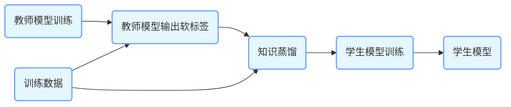

# AI Agent的知识蒸馏在模型轻量化中的应用

> {关键词：AI Agent、知识蒸馏、模型轻量化、深度学习、迁移学习、模型压缩}

> {摘要：本文深入探讨了AI Agent的知识蒸馏在模型轻量化中的应用。首先介绍了相关背景，包括目的、预期读者等内容。接着阐述了核心概念及联系，通过文本示意图和Mermaid流程图展示了知识蒸馏和模型轻量化的原理和架构。详细讲解了核心算法原理，并用Python代码进行说明。同时给出了相关的数学模型和公式，并举例说明。通过项目实战展示了代码的实际应用和详细解释。分析了知识蒸馏在模型轻量化中的实际应用场景，推荐了学习资源、开发工具框架以及相关论文著作。最后总结了未来发展趋势与挑战，解答了常见问题，并提供了扩展阅读和参考资料。}

## 1. 背景介绍 
### 1.1 目的和范围
在当今人工智能领域，深度学习模型变得越来越复杂，参数量和计算量急剧增加。虽然这些大型模型在各种任务上取得了优异的性能，但它们在资源受限的设备（如移动设备、嵌入式系统等）上的部署面临着巨大的挑战。模型轻量化旨在减少模型的参数量和计算量，同时保持模型的性能。知识蒸馏作为一种有效的模型压缩技术，可以将大型教师模型的知识迁移到小型学生模型中，从而实现模型的轻量化。本文的目的是深入探讨AI Agent的知识蒸馏在模型轻量化中的应用，包括核心概念、算法原理、实际案例等，为相关领域的研究人员和开发者提供全面的参考。

### 1.2 预期读者
本文的预期读者包括人工智能、机器学习、深度学习领域的研究人员、开发者，以及对模型轻量化和知识蒸馏技术感兴趣的学生和专业人士。

### 1.3 文档结构概述
本文将按照以下结构进行组织：首先介绍核心概念与联系，包括知识蒸馏和模型轻量化的原理和架构；接着详细讲解核心算法原理，并给出Python代码示例；然后介绍相关的数学模型和公式，并举例说明；通过项目实战展示代码的实际应用和详细解释；分析知识蒸馏在模型轻量化中的实际应用场景；推荐学习资源、开发工具框架以及相关论文著作；最后总结未来发展趋势与挑战，解答常见问题，并提供扩展阅读和参考资料。

### 1.4 术语表
#### 1.4.1 核心术语定义
- **AI Agent**：人工智能代理，是一种能够感知环境、做出决策并执行行动的智能实体。
- **知识蒸馏**：一种模型压缩技术，通过将大型教师模型的知识迁移到小型学生模型中，使学生模型学习到教师模型的决策模式和特征表示。
- **模型轻量化**：通过各种技术手段减少模型的参数量和计算量，同时保持模型的性能，以便在资源受限的设备上部署。
- **教师模型**：在知识蒸馏中，通常是一个大型、复杂且性能优异的模型，用于向学生模型传递知识。
- **学生模型**：在知识蒸馏中，是一个小型、简单的模型，通过学习教师模型的知识来提高自身性能。

#### 1.4.2 相关概念解释
- **软标签**：教师模型输出的概率分布，包含了比硬标签（类别标签）更多的信息。
- **温度参数**：在知识蒸馏中，用于调整软标签的平滑程度，控制教师模型知识的传递强度。

#### 1.4.3 缩略词列表
- **DNN**：深度神经网络（Deep Neural Network）
- **CNN**：卷积神经网络（Convolutional Neural Network）
- **RNN**：循环神经网络（Recurrent Neural Network）

## 2. 核心概念与联系 
### 知识蒸馏原理
知识蒸馏的核心思想是让学生模型学习教师模型的输出，而不仅仅是训练数据的标签。教师模型通常是一个大型、复杂且性能优异的模型，它在训练数据上已经学习到了丰富的知识和特征表示。学生模型则是一个小型、简单的模型，通过学习教师模型的输出，学生模型可以更快地收敛到较好的性能，同时减少模型的参数量和计算量。

知识蒸馏的过程可以分为以下几个步骤：
1. **教师模型训练**：使用大量的训练数据对教师模型进行训练，使其在目标任务上达到较好的性能。
2. **学生模型训练**：在学生模型的训练过程中，除了使用训练数据的标签作为监督信息外，还使用教师模型的输出作为额外的监督信息。具体来说，学生模型的损失函数通常由两部分组成：一部分是学生模型输出与训练数据标签之间的交叉熵损失，另一部分是学生模型输出与教师模型输出之间的软标签损失。

### 模型轻量化原理
模型轻量化的目标是减少模型的参数量和计算量，同时保持模型的性能。常见的模型轻量化方法包括剪枝、量化、知识蒸馏等。知识蒸馏通过将教师模型的知识迁移到学生模型中，使得学生模型可以在较小的参数量和计算量下达到与教师模型相近的性能。

### 文本示意图
```plaintext
教师模型（大型、复杂）
    |
    | 训练数据
    v
教师模型训练
    |
    | 输出软标签
    v
知识蒸馏
    |
    | 训练数据 + 软标签
    v
学生模型训练
    |
    | 轻量化模型
    v
学生模型（小型、简单）
```

### Mermaid流程图


## 3. 核心算法原理 & 具体操作步骤 
### 核心算法原理
知识蒸馏的核心算法可以通过以下步骤实现：
1. **定义教师模型和学生模型**：选择合适的教师模型和学生模型架构。教师模型通常是一个大型、复杂的模型，如ResNet、BERT等；学生模型则是一个小型、简单的模型，如MobileNet、DistilBERT等。
2. **训练教师模型**：使用大量的训练数据对教师模型进行训练，使其在目标任务上达到较好的性能。
3. **定义损失函数**：学生模型的损失函数通常由两部分组成：一部分是学生模型输出与训练数据标签之间的交叉熵损失 $L_{ce}$，另一部分是学生模型输出与教师模型输出之间的软标签损失 $L_{kd}$。总损失函数可以表示为：
$$L = \alpha L_{ce} + (1 - \alpha) L_{kd}$$
其中，$\alpha$ 是一个超参数，用于控制两部分损失的权重。

4. **训练学生模型**：在学生模型的训练过程中，使用上述定义的损失函数进行优化。具体来说，在每个训练步骤中，首先将输入数据输入到教师模型中，得到教师模型的输出；然后将输入数据输入到学生模型中，得到学生模型的输出；最后计算总损失函数，并使用反向传播算法更新学生模型的参数。

### 具体操作步骤
以下是一个使用Python和PyTorch实现知识蒸馏的示例代码：

```python
import torch
import torch.nn as nn
import torch.optim as optim
from torchvision import datasets, transforms

# 定义教师模型和学生模型
class TeacherModel(nn.Module):
    def __init__(self):
        super(TeacherModel, self).__init__()
        self.fc1 = nn.Linear(784, 128)
        self.fc2 = nn.Linear(128, 64)
        self.fc3 = nn.Linear(64, 10)

    def forward(self, x):
        x = x.view(-1, 784)
        x = torch.relu(self.fc1(x))
        x = torch.relu(self.fc2(x))
        x = self.fc3(x)
        return x

class StudentModel(nn.Module):
    def __init__(self):
        super(StudentModel, self).__init__()
        self.fc1 = nn.Linear(784, 32)
        self.fc2 = nn.Linear(32, 10)

    def forward(self, x):
        x = x.view(-1, 784)
        x = torch.relu(self.fc1(x))
        x = self.fc2(x)
        return x

# 数据加载
transform = transforms.Compose([
    transforms.ToTensor(),
    transforms.Normalize((0.1307,), (0.3081,))
])

train_dataset = datasets.MNIST('./data', train=True, download=True, transform=transform)
train_loader = torch.utils.data.DataLoader(train_dataset, batch_size=64, shuffle=True)

# 训练教师模型
teacher_model = TeacherModel()
criterion_teacher = nn.CrossEntropyLoss()
optimizer_teacher = optim.Adam(teacher_model.parameters(), lr=0.001)

for epoch in range(5):
    for data, target in train_loader:
        optimizer_teacher.zero_grad()
        output = teacher_model(data)
        loss = criterion_teacher(output, target)
        loss.backward()
        optimizer_teacher.step()
    print(f'Epoch {epoch+1}, Teacher Loss: {loss.item()}')

# 训练学生模型
student_model = StudentModel()
criterion_student = nn.CrossEntropyLoss()
optimizer_student = optim.Adam(student_model.parameters(), lr=0.001)
alpha = 0.5

for epoch in range(5):
    for data, target in train_loader:
        optimizer_student.zero_grad()
        # 教师模型输出
        teacher_output = teacher_model(data)
        # 学生模型输出
        student_output = student_model(data)

        # 交叉熵损失
        ce_loss = criterion_student(student_output, target)
        # 软标签损失
        kd_loss = nn.KLDivLoss(reduction='batchmean')(torch.log_softmax(student_output, dim=1),
                                                     torch.softmax(teacher_output, dim=1))
        # 总损失
        total_loss = alpha * ce_loss + (1 - alpha) * kd_loss

        total_loss.backward()
        optimizer_student.step()
    print(f'Epoch {epoch+1}, Student Loss: {total_loss.item()}')
```

### 代码解释
1. **定义教师模型和学生模型**：`TeacherModel` 和 `StudentModel` 分别定义了教师模型和学生模型的架构。教师模型有三个全连接层，学生模型有两个全连接层，学生模型的参数量明显少于教师模型。
2. **数据加载**：使用 `torchvision` 加载MNIST数据集，并进行归一化处理。
3. **训练教师模型**：使用交叉熵损失函数和Adam优化器对教师模型进行训练。
4. **训练学生模型**：在学生模型的训练过程中，除了计算学生模型输出与训练数据标签之间的交叉熵损失外，还计算学生模型输出与教师模型输出之间的软标签损失。总损失函数由两部分损失加权求和得到，然后使用反向传播算法更新学生模型的参数。

## 4. 数学模型和公式 & 详细讲解 & 举例说明 
### 交叉熵损失函数
交叉熵损失函数用于衡量学生模型输出与训练数据标签之间的差异。对于一个样本 $(x, y)$，其中 $x$ 是输入数据，$y$ 是对应的标签，学生模型的输出为 $s$，交叉熵损失函数可以表示为：
$$L_{ce} = - \sum_{i=1}^{C} y_i \log(s_i)$$
其中，$C$ 是类别数，$y_i$ 是标签 $y$ 的第 $i$ 个分量，$s_i$ 是学生模型输出 $s$ 的第 $i$ 个分量。

### 软标签损失函数
软标签损失函数用于衡量学生模型输出与教师模型输出之间的差异。通常使用KL散度（Kullback-Leibler Divergence）来计算软标签损失。对于一个样本 $(x, t)$，其中 $x$ 是输入数据，$t$ 是教师模型的输出，学生模型的输出为 $s$，软标签损失函数可以表示为：
$$L_{kd} = \text{KL}(q_s || q_t) = \sum_{i=1}^{C} q_s(i) \log \frac{q_s(i)}{q_t(i)}$$
其中，$q_s(i)$ 和 $q_t(i)$ 分别是学生模型输出和教师模型输出的概率分布，通常使用softmax函数将模型输出转换为概率分布。

### 总损失函数
总损失函数由交叉熵损失和软标签损失加权求和得到：
$$L = \alpha L_{ce} + (1 - \alpha) L_{kd}$$
其中，$\alpha$ 是一个超参数，用于控制两部分损失的权重。

### 举例说明
假设我们有一个三分类问题，输入数据 $x$ 对应的标签为 $y = [0, 1, 0]$，教师模型的输出为 $t = [0.1, 0.8, 0.1]$，学生模型的输出为 $s = [0.2, 0.7, 0.1]$。

1. **计算交叉熵损失**：
$$L_{ce} = - (0 \log(0.2) + 1 \log(0.7) + 0 \log(0.1)) \approx 0.357$$

2. **计算软标签损失**：
首先将学生模型输出和教师模型输出转换为概率分布：
$$q_s = \text{softmax}(s) = [0.2, 0.7, 0.1]$$
$$q_t = \text{softmax}(t) = [0.1, 0.8, 0.1]$$
然后计算KL散度：
$$L_{kd} = \sum_{i=1}^{3} q_s(i) \log \frac{q_s(i)}{q_t(i)} = 0.2 \log \frac{0.2}{0.1} + 0.7 \log \frac{0.7}{0.8} + 0.1 \log \frac{0.1}{0.1} \approx 0.067$$

3. **计算总损失**：
假设 $\alpha = 0.5$，则总损失为：
$$L = 0.5 \times 0.357 + (1 - 0.5) \times 0.067 = 0.212$$

## 5. 项目实战：代码实际案例和详细解释说明 
### 5.1  开发环境搭建
为了实现知识蒸馏在模型轻量化中的应用，我们需要搭建一个开发环境。以下是具体的步骤：

1. **安装Python**：建议使用Python 3.7及以上版本。可以从Python官方网站（https://www.python.org/downloads/）下载并安装。
2. **安装PyTorch**：PyTorch是一个开源的深度学习框架，提供了丰富的工具和函数用于模型训练和开发。可以根据自己的需求选择合适的版本进行安装，安装命令如下：
```bash
pip install torch torchvision
```
3. **安装其他依赖库**：还需要安装一些其他的依赖库，如`numpy`、`matplotlib`等。可以使用以下命令进行安装：
```bash
pip install numpy matplotlib
```

### 5.2  源代码详细实现和代码解读
以下是一个完整的代码示例，用于实现知识蒸馏在MNIST数据集上的应用：

```python
import torch
import torch.nn as nn
import torch.optim as optim
from torchvision import datasets, transforms
import matplotlib.pyplot as plt

# 定义教师模型和学生模型
class TeacherModel(nn.Module):
    def __init__(self):
        super(TeacherModel, self).__init__()
        self.fc1 = nn.Linear(784, 128)
        self.fc2 = nn.Linear(128, 64)
        self.fc3 = nn.Linear(64, 10)

    def forward(self, x):
        x = x.view(-1, 784)
        x = torch.relu(self.fc1(x))
        x = torch.relu(self.fc2(x))
        x = self.fc3(x)
        return x

class StudentModel(nn.Module):
    def __init__(self):
        super(StudentModel, self).__init__()
        self.fc1 = nn.Linear(784, 32)
        self.fc2 = nn.Linear(32, 10)

    def forward(self, x):
        x = x.view(-1, 784)
        x = torch.relu(self.fc1(x))
        x = self.fc2(x)
        return x

# 数据加载
transform = transforms.Compose([
    transforms.ToTensor(),
    transforms.Normalize((0.1307,), (0.3081,))
])

train_dataset = datasets.MNIST('./data', train=True, download=True, transform=transform)
train_loader = torch.utils.data.DataLoader(train_dataset, batch_size=64, shuffle=True)

test_dataset = datasets.MNIST('./data', train=False, download=True, transform=transform)
test_loader = torch.utils.data.DataLoader(test_dataset, batch_size=64, shuffle=False)

# 训练教师模型
teacher_model = TeacherModel()
criterion_teacher = nn.CrossEntropyLoss()
optimizer_teacher = optim.Adam(teacher_model.parameters(), lr=0.001)

teacher_losses = []
for epoch in range(10):
    running_loss = 0.0
    for data, target in train_loader:
        optimizer_teacher.zero_grad()
        output = teacher_model(data)
        loss = criterion_teacher(output, target)
        loss.backward()
        optimizer_teacher.step()
        running_loss += loss.item()
    epoch_loss = running_loss / len(train_loader)
    teacher_losses.append(epoch_loss)
    print(f'Epoch {epoch+1}, Teacher Loss: {epoch_loss}')

# 绘制教师模型训练损失曲线
plt.plot(teacher_losses)
plt.xlabel('Epoch')
plt.ylabel('Loss')
plt.title('Teacher Model Training Loss')
plt.show()

# 训练学生模型
student_model = StudentModel()
criterion_student = nn.CrossEntropyLoss()
optimizer_student = optim.Adam(student_model.parameters(), lr=0.001)
alpha = 0.5

student_losses = []
for epoch in range(10):
    running_loss = 0.0
    for data, target in train_loader:
        optimizer_student.zero_grad()
        # 教师模型输出
        teacher_output = teacher_model(data)
        # 学生模型输出
        student_output = student_model(data)

        # 交叉熵损失
        ce_loss = criterion_student(student_output, target)
        # 软标签损失
        kd_loss = nn.KLDivLoss(reduction='batchmean')(torch.log_softmax(student_output, dim=1),
                                                     torch.softmax(teacher_output, dim=1))
        # 总损失
        total_loss = alpha * ce_loss + (1 - alpha) * kd_loss

        total_loss.backward()
        optimizer_student.step()
        running_loss += total_loss.item()
    epoch_loss = running_loss / len(train_loader)
    student_losses.append(epoch_loss)
    print(f'Epoch {epoch+1}, Student Loss: {epoch_loss}')

# 绘制学生模型训练损失曲线
plt.plot(student_losses)
plt.xlabel('Epoch')
plt.ylabel('Loss')
plt.title('Student Model Training Loss')
plt.show()

# 测试模型
def test_model(model, test_loader):
    model.eval()
    correct = 0
    total = 0
    with torch.no_grad():
        for data, target in test_loader:
            output = model(data)
            _, predicted = torch.max(output.data, 1)
            total += target.size(0)
            correct += (predicted == target).sum().item()
    accuracy = 100 * correct / total
    print(f'Test Accuracy: {accuracy}%')

# 测试教师模型
print('Teacher Model Test:')
test_model(teacher_model, test_loader)

# 测试学生模型
print('Student Model Test:')
test_model(student_model, test_loader)
```

### 代码解读与分析
1. **定义教师模型和学生模型**：`TeacherModel` 和 `StudentModel` 分别定义了教师模型和学生模型的架构。教师模型有三个全连接层，学生模型有两个全连接层，学生模型的参数量明显少于教师模型。
2. **数据加载**：使用 `torchvision` 加载MNIST数据集，并进行归一化处理。同时，将数据集分为训练集和测试集。
3. **训练教师模型**：使用交叉熵损失函数和Adam优化器对教师模型进行训练，并记录每个epoch的训练损失。最后绘制教师模型的训练损失曲线。
4. **训练学生模型**：在学生模型的训练过程中，除了计算学生模型输出与训练数据标签之间的交叉熵损失外，还计算学生模型输出与教师模型输出之间的软标签损失。总损失函数由两部分损失加权求和得到，然后使用反向传播算法更新学生模型的参数。同样记录每个epoch的训练损失，并绘制学生模型的训练损失曲线。
5. **测试模型**：定义了一个 `test_model` 函数，用于测试模型在测试集上的准确率。分别测试教师模型和学生模型的准确率，并输出结果。

通过上述代码，我们可以看到知识蒸馏可以帮助学生模型在较小的参数量下达到与教师模型相近的性能，从而实现模型的轻量化。

## 6. 实际应用场景 
### 移动设备和嵌入式系统
在移动设备（如智能手机、平板电脑）和嵌入式系统（如智能手表、智能家居设备）中，资源（如内存、计算能力）通常是有限的。知识蒸馏可以将大型模型的知识迁移到小型模型中，使得这些小型模型可以在移动设备和嵌入式系统上高效运行。例如，在图像识别应用中，通过知识蒸馏可以将大型的卷积神经网络（CNN）模型压缩成小型的CNN模型，从而在移动设备上实现实时的图像识别。

### 边缘计算
边缘计算是指在数据源附近进行数据处理和分析的计算模式。在边缘计算场景中，设备通常具有有限的计算资源和带宽。知识蒸馏可以帮助在边缘设备上部署轻量化的模型，减少数据传输和计算成本。例如，在智能交通系统中，通过知识蒸馏可以将大型的目标检测模型压缩成小型的目标检测模型，部署在路边的摄像头设备上，实现实时的车辆和行人检测。

### 在线学习和实时推理
在在线学习和实时推理场景中，模型需要快速响应并进行推理。知识蒸馏可以提高模型的推理速度，减少推理时间。例如，在推荐系统中，通过知识蒸馏可以将大型的深度学习模型压缩成小型的模型，实现实时的个性化推荐。

### 模型部署和分布式计算
在模型部署和分布式计算场景中，知识蒸馏可以减少模型的存储和传输成本。例如，在云计算环境中，通过知识蒸馏可以将大型的模型压缩成小型的模型，减少模型在不同节点之间的传输时间和带宽消耗。

## 7. 工具和资源推荐
### 7.1 学习资源推荐
#### 7.1.1 书籍推荐
- 《深度学习》（Deep Learning）：由Ian Goodfellow、Yoshua Bengio和Aaron Courville所著，是深度学习领域的经典教材，涵盖了深度学习的基本概念、算法和应用。
- 《动手学深度学习》（Dive into Deep Learning）：由 Aston Zhang、Zack C. Lipton、Mu Li和Alex J. Smola所著，提供了丰富的深度学习代码示例和实践指导。
- 《神经网络与深度学习》（Neural Networks and Deep Learning）：由Michael Nielsen所著，以通俗易懂的方式介绍了神经网络和深度学习的基本原理。

#### 7.1.2 在线课程
- Coursera上的“深度学习专项课程”（Deep Learning Specialization）：由Andrew Ng教授授课，包括五门课程，全面介绍了深度学习的各个方面。
- edX上的“强化学习基础”（Fundamentals of Reinforcement Learning）：由DeepMind的研究人员授课，介绍了强化学习的基本概念和算法。
- 哔哩哔哩上的“李宏毅机器学习”：由台湾大学的李宏毅教授授课，课程内容生动有趣，适合初学者学习。

#### 7.1.3 技术博客和网站
- Medium上的Towards Data Science：是一个专注于数据科学和机器学习的技术博客，提供了大量的优质文章和教程。
- arXiv：是一个预印本平台，提供了最新的学术研究成果和论文。
- GitHub：是一个开源代码托管平台，上面有许多优秀的深度学习项目和代码示例。

### 7.2 开发工具框架推荐
#### 7.2.1 IDE和编辑器
- PyCharm：是一款专门为Python开发设计的集成开发环境（IDE），提供了丰富的代码编辑、调试和项目管理功能。
- Jupyter Notebook：是一个交互式的开发环境，适合进行数据分析和模型实验。可以在浏览器中编写和运行代码，并实时查看代码的执行结果。
- Visual Studio Code：是一款轻量级的代码编辑器，支持多种编程语言和插件扩展。可以通过安装Python扩展来进行Python开发。

#### 7.2.2 调试和性能分析工具
- PyTorch Profiler：是PyTorch提供的性能分析工具，可以帮助用户分析模型的运行时间和内存使用情况。
- TensorBoard：是TensorFlow提供的可视化工具，也可以用于PyTorch项目。可以通过TensorBoard查看模型的训练过程、损失曲线、准确率等信息。
- NVIDIA Nsight Systems：是一款用于GPU性能分析的工具，可以帮助用户优化模型在GPU上的运行性能。

#### 7.2.3 相关框架和库
- PyTorch：是一个开源的深度学习框架，提供了丰富的工具和函数用于模型训练和开发。具有动态图和静态图两种模式，适合快速原型开发和大规模训练。
- TensorFlow：是另一个广泛使用的深度学习框架，提供了强大的分布式训练和模型部署功能。具有静态图模式，适合大规模工业应用。
- Scikit-learn：是一个用于机器学习的Python库，提供了各种机器学习算法和工具，如分类、回归、聚类等。

### 7.3 相关论文著作推荐
#### 7.3.1 经典论文
- “Distilling the Knowledge in a Neural Network”：由Geoffrey Hinton等人发表，首次提出了知识蒸馏的概念。
- “MobileNetV2: Inverted Residuals and Linear Bottlenecks”：提出了MobileNetV2架构，是一种轻量级的卷积神经网络。
- “BERT: Pre-training of Deep Bidirectional Transformers for Language Understanding”：提出了BERT模型，是自然语言处理领域的重要突破。

#### 7.3.2 最新研究成果
- 在arXiv上搜索“Knowledge Distillation”和“Model Compression”等关键词，可以找到最新的研究成果和论文。
- 参加机器学习和深度学习领域的顶级学术会议，如NeurIPS、ICML、CVPR等，了解最新的研究动态。

#### 7.3.3 应用案例分析
- 在各大科技公司的技术博客上可以找到许多知识蒸馏和模型轻量化的应用案例分析，如Google、Facebook、Microsoft等。
- 在GitHub上搜索相关的开源项目，了解实际应用中的代码实现和技术细节。

## 8. 总结：未来发展趋势与挑战
### 未来发展趋势
- **更高效的知识蒸馏算法**：随着深度学习模型的不断发展，对知识蒸馏算法的效率和性能提出了更高的要求。未来的研究将致力于开发更高效的知识蒸馏算法，减少训练时间和计算资源的消耗。
- **多模态知识蒸馏**：目前的知识蒸馏主要集中在单一模态的数据上，如图像、文本等。未来的研究将扩展到多模态数据，如同时处理图像和文本的知识蒸馏，以提高模型的泛化能力和性能。
- **自适应知识蒸馏**：不同的任务和数据集可能需要不同的知识蒸馏策略。未来的研究将探索自适应知识蒸馏方法，根据任务和数据集的特点自动调整知识蒸馏的参数和策略。
- **与其他模型压缩技术的结合**：知识蒸馏可以与其他模型压缩技术（如剪枝、量化）相结合，进一步提高模型的轻量化效果。未来的研究将探索不同技术的组合方式，以实现更高效的模型压缩。

### 挑战
- **知识迁移的有效性**：如何将教师模型的知识有效地迁移到学生模型中，是知识蒸馏面临的一个挑战。需要研究更有效的知识表示和传递方法，以提高学生模型的性能。
- **超参数调优**：知识蒸馏中的超参数（如温度参数、损失权重等）对模型的性能有重要影响。如何选择合适的超参数是一个难题，需要进行大量的实验和调优。
- **模型可解释性**：知识蒸馏后的模型通常是一个黑盒模型，缺乏可解释性。如何提高模型的可解释性，让用户更好地理解模型的决策过程，是未来需要解决的问题。
- **数据隐私和安全**：在知识蒸馏过程中，教师模型的输出可能包含敏感信息。如何保护数据隐私和安全，防止信息泄露，是一个重要的挑战。

## 9. 附录：常见问题与解答
### 1. 知识蒸馏和模型量化、剪枝有什么区别？
知识蒸馏是一种通过将大型教师模型的知识迁移到小型学生模型中，实现模型轻量化的技术。模型量化是通过减少模型参数的精度，降低模型的存储和计算成本。模型剪枝是通过删除模型中不重要的连接或参数，减少模型的参数量。这三种技术可以相互结合，以实现更好的模型轻量化效果。

### 2. 如何选择合适的教师模型和学生模型？
选择教师模型时，通常选择一个大型、复杂且性能优异的模型，如ResNet、BERT等。选择学生模型时，需要考虑模型的复杂度和参数量，通常选择一个小型、简单的模型，如MobileNet、DistilBERT等。同时，学生模型的架构应该与教师模型有一定的相似性，以便更好地学习教师模型的知识。

### 3. 知识蒸馏中的温度参数有什么作用？
温度参数用于调整软标签的平滑程度。温度参数越大，软标签的分布越平滑，教师模型的知识传递越柔和；温度参数越小，软标签的分布越尖锐，教师模型的知识传递越强烈。通常需要通过实验来选择合适的温度参数。

### 4. 知识蒸馏是否一定能提高学生模型的性能？
知识蒸馏并不一定能提高学生模型的性能。知识蒸馏的效果受到多种因素的影响，如教师模型的性能、学生模型的架构、训练数据的质量等。在某些情况下，知识蒸馏可能会导致学生模型的性能下降。因此，在使用知识蒸馏时，需要进行充分的实验和调优。

## 10. 扩展阅读 & 参考资料
### 扩展阅读
- “Knowledge Distillation: A Survey”：对知识蒸馏技术进行了全面的综述，介绍了知识蒸馏的原理、算法和应用。
- “Model Compression and Acceleration for Deep Neural Networks: The Principles, Progress, and Challenges”：对模型压缩和加速技术进行了详细的介绍，包括知识蒸馏、剪枝、量化等。
- “Adversarial Knowledge Distillation for Domain Adaptation”：介绍了对抗知识蒸馏在领域适应中的应用。

### 参考资料
- Hinton, G., Vinyals, O., & Dean, J. (2015). Distilling the Knowledge in a Neural Network. arXiv preprint arXiv:1503.02531.
- Sandler, M., Howard, A., Zhu, M., Zhmoginov, A., & Chen, L. C. (2018). MobileNetV2: Inverted Residuals and Linear Bottlenecks. In Proceedings of the IEEE conference on computer vision and pattern recognition (pp. 4510-4520).
- Devlin, J., Chang, M. W., Lee, K., & Toutanova, K. (2018). BERT: Pre-training of Deep Bidirectional Transformers for Language Understanding. arXiv preprint arXiv:1810.04805.

作者：AI天才研究院/AI Genius Institute & 禅与计算机程序设计艺术 /Zen And The Art of Computer Programming