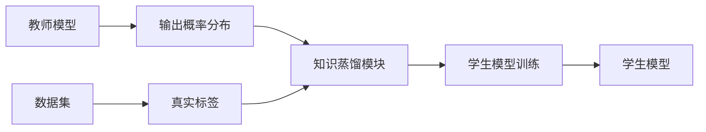

# AI Agent的知识蒸馏技术应用

> 关键词：AI Agent、知识蒸馏技术、模型压缩、知识迁移、智能应用

> 摘要：本文聚焦于AI Agent的知识蒸馏技术应用，旨在深入探讨知识蒸馏技术在AI Agent领域的原理、算法、实际应用等方面。首先介绍了相关背景，包括目的范围、预期读者等内容；接着阐述核心概念与联系，通过示意图和流程图展示原理架构；详细讲解核心算法原理并给出Python代码示例；对数学模型和公式进行分析并举例说明；通过项目实战展示代码实现和解读；探讨实际应用场景；推荐学习资源、开发工具和相关论文著作；最后总结未来发展趋势与挑战，提供常见问题解答和扩展阅读参考资料，帮助读者全面了解AI Agent知识蒸馏技术的应用。

## 1. 背景介绍 
### 1.1 目的和范围
随着人工智能技术的飞速发展，AI Agent在各个领域得到了广泛应用。然而，许多强大的AI Agent模型通常具有庞大的参数数量和复杂的结构，这导致其在计算资源和存储需求方面面临挑战。知识蒸馏技术作为一种有效的模型压缩和知识迁移方法，可以将大型教师模型的知识转移到小型学生模型中，使得学生模型在保持较高性能的同时，减少计算和存储成本。本文的目的是全面介绍AI Agent的知识蒸馏技术应用，涵盖从基本概念到实际应用的各个方面，帮助读者深入理解和掌握这一技术。

### 1.2 预期读者
本文预期读者包括人工智能领域的研究人员、开发者、数据科学家以及对AI Agent和知识蒸馏技术感兴趣的技术爱好者。对于有一定编程基础和机器学习知识的读者，能够更好地理解文中的算法原理和代码实现；而对于初学者，通过本文也可以对AI Agent的知识蒸馏技术有一个系统的认识。

### 1.3 文档结构概述
本文将按照以下结构进行阐述：首先介绍核心概念与联系，通过示意图和流程图展示知识蒸馏的原理和架构；接着详细讲解核心算法原理，并使用Python源代码进行说明；对相关的数学模型和公式进行分析，并举例说明其应用；通过项目实战展示知识蒸馏技术在实际项目中的代码实现和详细解读；探讨知识蒸馏技术在AI Agent中的实际应用场景；推荐学习资源、开发工具和相关论文著作；最后总结未来发展趋势与挑战，提供常见问题解答和扩展阅读参考资料。

### 1.4 术语表
#### 1.4.1 核心术语定义
- **AI Agent**：人工智能代理，是一种能够感知环境、做出决策并采取行动以实现特定目标的智能实体。
- **知识蒸馏**：一种将大型教师模型的知识转移到小型学生模型的技术，通过让学生模型学习教师模型的输出或中间表示来提高学生模型的性能。
- **教师模型**：通常是一个具有较高性能但参数数量较多的大型模型，用于向学生模型传授知识。
- **学生模型**：参数数量较少的小型模型，通过知识蒸馏学习教师模型的知识，以在保持较小规模的同时达到较好的性能。

#### 1.4.2 相关概念解释
- **模型压缩**：通过各种技术减少模型的参数数量和计算量，以降低模型的存储和计算成本，知识蒸馏是模型压缩的一种有效方法。
- **知识迁移**：将在一个任务或模型上学到的知识应用到另一个任务或模型上，知识蒸馏可以看作是一种知识迁移的过程。

#### 1.4.3 缩略词列表
- **MLP**：多层感知机（Multilayer Perceptron）
- **CNN**：卷积神经网络（Convolutional Neural Network）
- **RNN**：循环神经网络（Recurrent Neural Network）

## 2. 核心概念与联系 

### 核心概念原理
知识蒸馏的核心思想是让学生模型学习教师模型的输出或中间表示，从而获得教师模型的知识。具体来说，在训练学生模型时，除了使用真实标签进行监督学习外，还让学生模型模仿教师模型的输出概率分布。这样，学生模型不仅学习到了数据的真实标签信息，还学习到了教师模型在不同类别之间的相对置信度，从而能够更好地泛化。

### 架构的文本示意图
```plaintext
教师模型（大型、高性能）
   |
   | 输出概率分布
   v
知识蒸馏模块
   |
   | 结合真实标签和教师输出
   v
学生模型（小型、轻量级）
```

### Mermaid流程图


## 3. 核心算法原理 & 具体操作步骤 

### 核心算法原理
知识蒸馏的核心算法主要包括以下几个步骤：
1. **训练教师模型**：使用大规模数据集对教师模型进行训练，使其达到较高的性能。
2. **计算教师模型输出**：将训练数据输入到教师模型中，得到教师模型的输出概率分布。
3. **训练学生模型**：在训练学生模型时，使用以下损失函数：
   - 真实标签的交叉熵损失：$L_{ce} = - \sum_{i} y_i \log(p_{i}^{s})$，其中 $y_i$ 是真实标签的第 $i$ 个类别概率，$p_{i}^{s}$ 是学生模型的第 $i$ 个类别概率。
   - 教师模型输出的软标签交叉熵损失：$L_{kd} = - \sum_{i} p_{i}^{t} \log(p_{i}^{s})$，其中 $p_{i}^{t}$ 是教师模型的第 $i$ 个类别概率。
   - 最终损失函数：$L = \alpha L_{ce} + (1 - \alpha) L_{kd}$，其中 $\alpha$ 是一个超参数，用于平衡两种损失的权重。

### Python源代码示例
```python
import torch
import torch.nn as nn
import torch.optim as optim

# 定义教师模型
class TeacherModel(nn.Module):
    def __init__(self):
        super(TeacherModel, self).__init__()
        self.fc1 = nn.Linear(10, 20)
        self.fc2 = nn.Linear(20, 5)

    def forward(self, x):
        x = torch.relu(self.fc1(x))
        x = self.fc2(x)
        return x

# 定义学生模型
class StudentModel(nn.Module):
    def __init__(self):
        super(StudentModel, self).__init__()
        self.fc1 = nn.Linear(10, 10)
        self.fc2 = nn.Linear(10, 5)

    def forward(self, x):
        x = torch.relu(self.fc1(x))
        x = self.fc2(x)
        return x

# 训练教师模型
def train_teacher(teacher_model, train_loader, criterion, optimizer, epochs):
    teacher_model.train()
    for epoch in range(epochs):
        for inputs, labels in train_loader:
            optimizer.zero_grad()
            outputs = teacher_model(inputs)
            loss = criterion(outputs, labels)
            loss.backward()
            optimizer.step()
        print(f'Epoch {epoch + 1}/{epochs}, Loss: {loss.item()}')

# 知识蒸馏训练学生模型
def knowledge_distillation(teacher_model, student_model, train_loader, criterion_ce, criterion_kd, optimizer, epochs, alpha):
    teacher_model.eval()
    student_model.train()
    for epoch in range(epochs):
        for inputs, labels in train_loader:
            optimizer.zero_grad()
            # 教师模型输出
            with torch.no_grad():
                teacher_outputs = teacher_model(inputs)
            # 学生模型输出
            student_outputs = student_model(inputs)
            # 真实标签的交叉熵损失
            loss_ce = criterion_ce(student_outputs, labels)
            # 教师模型输出的软标签交叉熵损失
            loss_kd = criterion_kd(student_outputs, teacher_outputs)
            # 最终损失
            loss = alpha * loss_ce + (1 - alpha) * loss_kd
            loss.backward()
            optimizer.step()
        print(f'Epoch {epoch + 1}/{epochs}, Loss: {loss.item()}')

# 示例使用
if __name__ == "__main__":
    # 生成一些示例数据
    train_data = torch.randn(100, 10)
    train_labels = torch.randint(0, 5, (100,))
    train_dataset = torch.utils.data.TensorDataset(train_data, train_labels)
    train_loader = torch.utils.data.DataLoader(train_dataset, batch_size=10, shuffle=True)

    # 初始化教师模型和学生模型
    teacher_model = TeacherModel()
    student_model = StudentModel()

    # 定义损失函数和优化器
    criterion_ce = nn.CrossEntropyLoss()
    criterion_kd = nn.KLDivLoss(reduction='batchmean')
    optimizer_teacher = optim.Adam(teacher_model.parameters(), lr=0.001)
    optimizer_student = optim.Adam(student_model.parameters(), lr=0.001)

    # 训练教师模型
    train_teacher(teacher_model, train_loader, criterion_ce, optimizer_teacher, epochs=10)

    # 知识蒸馏训练学生模型
    knowledge_distillation(teacher_model, student_model, train_loader, criterion_ce, criterion_kd, optimizer_student, epochs=10, alpha=0.5)
```

### 具体操作步骤
1. **数据准备**：准备训练数据集，将其划分为训练集和验证集。
2. **教师模型训练**：使用训练集对教师模型进行训练，调整模型参数以最小化损失函数。
3. **学生模型训练**：在训练学生模型时，同时计算真实标签的交叉熵损失和教师模型输出的软标签交叉熵损失，并根据最终损失函数更新学生模型的参数。
4. **模型评估**：使用验证集对训练好的学生模型进行评估，检查其性能指标。

## 4. 数学模型和公式 & 详细讲解 & 举例说明 

### 数学模型和公式
#### 真实标签的交叉熵损失
交叉熵损失是分类问题中常用的损失函数，用于衡量模型预测的概率分布与真实标签的概率分布之间的差异。其公式为：
$$L_{ce} = - \sum_{i} y_i \log(p_{i}^{s})$$
其中，$y_i$ 是真实标签的第 $i$ 个类别概率，对于单标签分类问题，$y_i$ 通常是一个one - hot向量，只有一个类别为1，其余为0；$p_{i}^{s}$ 是学生模型的第 $i$ 个类别概率。

#### 教师模型输出的软标签交叉熵损失
在知识蒸馏中，我们还使用教师模型的输出作为软标签，计算学生模型与教师模型输出之间的交叉熵损失。通常使用KL散度（Kullback - Leibler divergence）来衡量两个概率分布之间的差异，其公式为：
$$L_{kd} = - \sum_{i} p_{i}^{t} \log(p_{i}^{s})$$
其中，$p_{i}^{t}$ 是教师模型的第 $i$ 个类别概率，$p_{i}^{s}$ 是学生模型的第 $i$ 个类别概率。

#### 最终损失函数
最终损失函数是真实标签的交叉熵损失和教师模型输出的软标签交叉熵损失的加权和，公式为：
$$L = \alpha L_{ce} + (1 - \alpha) L_{kd}$$
其中，$\alpha$ 是一个超参数，用于平衡两种损失的权重。

### 详细讲解
- **真实标签的交叉熵损失**：这部分损失函数使得学生模型能够学习到数据的真实标签信息，确保模型在分类任务中的基本性能。
- **教师模型输出的软标签交叉熵损失**：教师模型的输出包含了更多的类别之间的相对置信度信息，通过学习教师模型的软标签，学生模型可以更好地泛化，避免过拟合。
- **最终损失函数**：通过调整 $\alpha$ 的值，可以控制学生模型在学习真实标签和教师模型软标签之间的侧重点。当 $\alpha = 1$ 时，相当于只使用真实标签进行训练；当 $\alpha = 0$ 时，相当于只学习教师模型的软标签。

### 举例说明
假设我们有一个三分类问题，真实标签为 $y = [1, 0, 0]$，教师模型的输出概率分布为 $p^{t} = [0.8, 0.1, 0.1]$，学生模型的输出概率分布为 $p^{s} = [0.7, 0.2, 0.1]$。

- **真实标签的交叉熵损失**：
  $$L_{ce} = - (1 \times \log(0.7) + 0 \times \log(0.2) + 0 \times \log(0.1)) \approx 0.357$$

- **教师模型输出的软标签交叉熵损失**：
  $$L_{kd} = - (0.8 \times \log(0.7) + 0.1 \times \log(0.2) + 0.1 \times \log(0.1)) \approx 0.283$$

假设 $\alpha = 0.5$，则最终损失函数为：
$$L = 0.5 \times 0.357 + (1 - 0.5) \times 0.283 = 0.32$$

## 5. 项目实战：代码实际案例和详细解释说明 

### 5.1  开发环境搭建
- **操作系统**：推荐使用Linux系统，如Ubuntu 18.04及以上版本，也可以使用Windows 10或macOS。
- **Python环境**：使用Python 3.7及以上版本，可以通过Anaconda或Miniconda进行安装和管理。
- **深度学习框架**：使用PyTorch深度学习框架，可根据自己的CUDA版本选择合适的安装方式。可以通过以下命令安装：
```bash
pip install torch torchvision
```

### 5.2  源代码详细实现和代码解读
```python
import torch
import torch.nn as nn
import torch.optim as optim
from torch.utils.data import DataLoader, TensorDataset
import torchvision
import torchvision.transforms as transforms

# 定义教师模型
class TeacherResNet(nn.Module):
    def __init__(self):
        super(TeacherResNet, self).__init__()
        self.resnet = torchvision.models.resnet18(pretrained=False)
        num_ftrs = self.resnet.fc.in_features
        self.resnet.fc = nn.Linear(num_ftrs, 10)

    def forward(self, x):
        return self.resnet(x)

# 定义学生模型
class StudentNet(nn.Module):
    def __init__(self):
        super(StudentNet, self).__init__()
        self.conv1 = nn.Conv2d(3, 16, kernel_size=3, padding=1)
        self.relu1 = nn.ReLU()
        self.pool1 = nn.MaxPool2d(2, 2)
        self.conv2 = nn.Conv2d(16, 32, kernel_size=3, padding=1)
        self.relu2 = nn.ReLU()
        self.pool2 = nn.MaxPool2d(2, 2)
        self.fc1 = nn.Linear(32 * 8 * 8, 128)
        self.relu3 = nn.ReLU()
        self.fc2 = nn.Linear(128, 10)

    def forward(self, x):
        x = self.pool1(self.relu1(self.conv1(x)))
        x = self.pool2(self.relu2(self.conv2(x)))
        x = x.view(-1, 32 * 8 * 8)
        x = self.relu3(self.fc1(x))
        x = self.fc2(x)
        return x

# 训练教师模型
def train_teacher(teacher_model, train_loader, criterion, optimizer, epochs):
    teacher_model.train()
    for epoch in range(epochs):
        running_loss = 0.0
        for i, data in enumerate(train_loader, 0):
            inputs, labels = data
            optimizer.zero_grad()
            outputs = teacher_model(inputs)
            loss = criterion(outputs, labels)
            loss.backward()
            optimizer.step()
            running_loss += loss.item()
        print(f'Epoch {epoch + 1}/{epochs}, Loss: {running_loss / len(train_loader)}')

# 知识蒸馏训练学生模型
def knowledge_distillation(teacher_model, student_model, train_loader, criterion_ce, criterion_kd, optimizer, epochs, alpha):
    teacher_model.eval()
    student_model.train()
    for epoch in range(epochs):
        running_loss = 0.0
        for i, data in enumerate(train_loader, 0):
            inputs, labels = data
            optimizer.zero_grad()
            # 教师模型输出
            with torch.no_grad():
                teacher_outputs = teacher_model(inputs)
            # 学生模型输出
            student_outputs = student_model(inputs)
            # 真实标签的交叉熵损失
            loss_ce = criterion_ce(student_outputs, labels)
            # 教师模型输出的软标签交叉熵损失
            loss_kd = criterion_kd(nn.functional.log_softmax(student_outputs, dim=1), nn.functional.softmax(teacher_outputs, dim=1))
            # 最终损失
            loss = alpha * loss_ce + (1 - alpha) * loss_kd
            loss.backward()
            optimizer.step()
            running_loss += loss.item()
        print(f'Epoch {epoch + 1}/{epochs}, Loss: {running_loss / len(train_loader)}')

# 评估模型
def evaluate_model(model, test_loader):
    model.eval()
    correct = 0
    total = 0
    with torch.no_grad():
        for data in test_loader:
            images, labels = data
            outputs = model(images)
            _, predicted = torch.max(outputs.data, 1)
            total += labels.size(0)
            correct += (predicted == labels).sum().item()
    print(f'Accuracy: {100 * correct / total}%')

# 数据预处理
transform = transforms.Compose([
    transforms.ToTensor(),
    transforms.Normalize((0.5, 0.5, 0.5), (0.5, 0.5, 0.5))
])

# 加载数据集
trainset = torchvision.datasets.CIFAR10(root='./data', train=True,
                                        download=True, transform=transform)
train_loader = DataLoader(trainset, batch_size=32, shuffle=True)

testset = torchvision.datasets.CIFAR10(root='./data', train=False,
                                       download=True, transform=transform)
test_loader = DataLoader(testset, batch_size=32, shuffle=False)

# 初始化教师模型和学生模型
teacher_model = TeacherResNet()
student_model = StudentNet()

# 定义损失函数和优化器
criterion_ce = nn.CrossEntropyLoss()
criterion_kd = nn.KLDivLoss(reduction='batchmean')
optimizer_teacher = optim.Adam(teacher_model.parameters(), lr=0.001)
optimizer_student = optim.Adam(student_model.parameters(), lr=0.001)

# 训练教师模型
train_teacher(teacher_model, train_loader, criterion_ce, optimizer_teacher, epochs=10)

# 评估教师模型
evaluate_model(teacher_model, test_loader)

# 知识蒸馏训练学生模型
knowledge_distillation(teacher_model, student_model, train_loader, criterion_ce, criterion_kd, optimizer_student, epochs=10, alpha=0.5)

# 评估学生模型
evaluate_model(student_model, test_loader)
```

### 代码解读与分析
- **数据预处理**：使用 `transforms.Compose` 对数据进行预处理，包括将图像转换为张量和归一化操作。
- **教师模型**：使用ResNet18作为教师模型，并修改最后一层全连接层以适应CIFAR - 10数据集的10个类别。
- **学生模型**：定义了一个简单的卷积神经网络作为学生模型，包含两个卷积层和两个全连接层。
- **训练教师模型**：使用交叉熵损失函数和Adam优化器对教师模型进行训练。
- **知识蒸馏训练学生模型**：在训练学生模型时，同时计算真实标签的交叉熵损失和教师模型输出的软标签交叉熵损失，并根据最终损失函数更新学生模型的参数。
- **模型评估**：使用测试集对训练好的教师模型和学生模型进行评估，计算模型的准确率。

## 6. 实际应用场景 
### 边缘设备智能应用
在边缘设备（如智能手机、智能摄像头、物联网设备等）上运行AI Agent时，由于设备的计算资源和存储能力有限，无法直接部署大型的深度学习模型。知识蒸馏技术可以将大型教师模型的知识迁移到小型学生模型中，使得学生模型能够在边缘设备上高效运行，同时保持较好的性能。例如，在智能摄像头中，可以使用知识蒸馏后的小型模型进行目标检测和识别，实时处理视频流数据。

### 实时决策系统
在实时决策系统中，如金融交易系统、自动驾驶系统等，需要快速做出决策。大型模型的推理速度较慢，无法满足实时性要求。通过知识蒸馏技术，可以得到一个轻量级的学生模型，其推理速度快，能够在短时间内完成决策任务。例如，在金融交易系统中，学生模型可以根据市场数据快速做出交易决策。

### 多模态学习
在多模态学习中，需要处理多种类型的数据（如图像、文本、音频等），通常需要使用复杂的模型来融合不同模态的信息。知识蒸馏技术可以将多模态教师模型的知识迁移到单模态或轻量级的多模态学生模型中，减少模型的复杂度和计算成本。例如，在智能客服系统中，可以使用知识蒸馏后的模型同时处理文本和语音信息。

## 7. 工具和资源推荐
### 7.1 学习资源推荐
#### 7.1.1 书籍推荐
- 《深度学习》（Deep Learning）：由Ian Goodfellow、Yoshua Bengio和Aaron Courville所著，是深度学习领域的经典教材，涵盖了深度学习的基本原理、算法和应用。
- 《Python深度学习》（Deep Learning with Python）：由Francois Chollet所著，以Keras框架为例，介绍了深度学习的实践方法，适合初学者。
- 《动手学深度学习》（Dive into Deep Learning）：由李沐等人所著，提供了丰富的代码示例和详细的讲解，适合边学边练。

#### 7.1.2 在线课程
- Coursera上的“深度学习专项课程”（Deep Learning Specialization）：由Andrew Ng教授授课，涵盖了深度学习的各个方面，包括神经网络、卷积神经网络、循环神经网络等。
- edX上的“人工智能导论”（Introduction to Artificial Intelligence）：介绍了人工智能的基本概念、算法和应用，适合初学者。
- 哔哩哔哩（Bilibili）上有许多关于深度学习和知识蒸馏的教程视频，可以根据自己的需求选择学习。

#### 7.1.3 技术博客和网站
- Medium：上面有许多人工智能领域的技术博客，涵盖了最新的研究成果和实践经验。
- arXiv：是一个预印本平台，提供了大量的学术论文，包括知识蒸馏技术的最新研究。
- AI开源社区：如GitHub、GitLab等，上面有许多开源的深度学习项目和代码，可以学习和参考。

### 7.2 开发工具框架推荐
#### 7.2.1 IDE和编辑器
- PyCharm：是一款专门为Python开发设计的集成开发环境，具有强大的代码编辑、调试和项目管理功能。
- Jupyter Notebook：是一个交互式的开发环境，适合进行数据分析、模型训练和实验验证。
- Visual Studio Code：是一款轻量级的代码编辑器，支持多种编程语言和插件，可用于深度学习开发。

#### 7.2.2 调试和性能分析工具
- PyTorch Profiler：是PyTorch自带的性能分析工具，可以帮助开发者分析模型的计算性能和内存使用情况。
- TensorBoard：是TensorFlow的可视化工具，也可以用于PyTorch模型的训练过程可视化和性能分析。
- NVIDIA Nsight Systems：是一款针对NVIDIA GPU的性能分析工具，可以帮助开发者优化GPU代码。

#### 7.2.3 相关框架和库
- PyTorch：是一个开源的深度学习框架，具有动态图机制，易于使用和调试，广泛应用于学术界和工业界。
- TensorFlow：是另一个流行的深度学习框架，具有强大的分布式训练和部署能力。
- Hugging Face Transformers：是一个用于自然语言处理的开源库，提供了许多预训练模型和工具，方便进行知识蒸馏和模型压缩。

### 7.3 相关论文著作推荐
#### 7.3.1 经典论文
- “Distilling the Knowledge in a Neural Network”：由Geoffrey Hinton等人发表，是知识蒸馏领域的开创性论文，提出了知识蒸馏的基本思想和方法。
- “MobileNetV2: Inverted Residuals and Linear Bottlenecks”：介绍了MobileNetV2模型，是一种轻量级的卷积神经网络，可用于知识蒸馏的学生模型设计。

#### 7.3.2 最新研究成果
- 在arXiv和各大顶级学术会议（如NeurIPS、ICML、CVPR等）上可以找到知识蒸馏技术的最新研究成果，关注这些研究可以了解该领域的发展趋势。

#### 7.3.3 应用案例分析
- 许多科技公司的技术博客会分享知识蒸馏技术在实际项目中的应用案例，如Google、Facebook、Microsoft等公司的博客，可以从中学习到实际应用中的经验和技巧。

## 8. 总结：未来发展趋势与挑战
### 未来发展趋势
- **更高效的蒸馏算法**：随着研究的深入，未来会出现更加高效的知识蒸馏算法，能够在更短的时间内将教师模型的知识迁移到学生模型中，同时提高学生模型的性能。
- **多模态知识蒸馏**：在多模态学习领域，知识蒸馏技术将得到更广泛的应用，能够实现不同模态之间的知识迁移和融合，提高多模态模型的性能和效率。
- **与其他技术的融合**：知识蒸馏技术将与其他技术（如强化学习、迁移学习等）相结合，创造出更强大的AI Agent，应用于更复杂的场景。

### 挑战
- **知识迁移的质量**：如何确保教师模型的知识能够准确、有效地迁移到学生模型中，是知识蒸馏技术面临的一个挑战。目前的方法在某些情况下可能会导致学生模型的性能不如教师模型。
- **计算资源的限制**：虽然知识蒸馏可以减少模型的计算和存储成本，但在处理大规模数据集和复杂模型时，仍然需要大量的计算资源。如何在有限的计算资源下实现高效的知识蒸馏是一个需要解决的问题。
- **模型的可解释性**：随着AI Agent的应用越来越广泛，模型的可解释性变得越来越重要。知识蒸馏技术在一定程度上增加了模型的复杂度，如何提高知识蒸馏模型的可解释性是一个挑战。

## 9. 附录：常见问题与解答
### 问题1：知识蒸馏和模型压缩有什么关系？
知识蒸馏是模型压缩的一种有效方法。模型压缩的目标是减少模型的参数数量和计算量，以降低模型的存储和计算成本。知识蒸馏通过将大型教师模型的知识迁移到小型学生模型中，使得学生模型在保持较小规模的同时达到较好的性能，从而实现模型压缩的目的。

### 问题2：如何选择合适的教师模型和学生模型？
选择教师模型时，应选择性能较高、在目标任务上表现良好的模型。通常可以选择预训练的大型模型，如ResNet、VGG等。选择学生模型时，应根据实际需求和计算资源选择合适的模型结构和规模。学生模型的结构应相对简单，参数数量较少，同时要能够学习到教师模型的知识。

### 问题3：超参数 $\alpha$ 如何选择？
超参数 $\alpha$ 用于平衡真实标签的交叉熵损失和教师模型输出的软标签交叉熵损失的权重。通常可以通过实验来选择合适的 $\alpha$ 值。一般来说，当 $\alpha$ 接近1时，学生模型更注重学习真实标签信息；当 $\alpha$ 接近0时，学生模型更注重学习教师模型的软标签信息。可以在验证集上进行不同 $\alpha$ 值的实验，选择性能最好的 $\alpha$ 值。

## 10. 扩展阅读 & 参考资料
- Hinton, G., Vinyals, O., & Dean, J. (2015). Distilling the Knowledge in a Neural Network. arXiv preprint arXiv:1503.02531.
- Sandler, M., Howard, A., Zhu, M., Zhmoginov, A., & Chen, L. C. (2018). MobileNetV2: Inverted Residuals and Linear Bottlenecks. In Proceedings of the IEEE conference on computer vision and pattern recognition (pp. 4510 - 4520).
- Goodfellow, I., Bengio, Y., & Courville, A. (2016). Deep Learning. MIT press.

作者：AI天才研究院/AI Genius Institute & 禅与计算机程序设计艺术 /Zen And The Art of Computer Programming