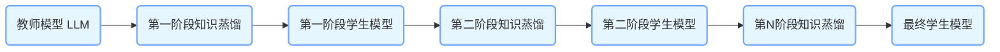

# AI Agent的知识蒸馏链：多阶段LLM模型优化

> 关键词：AI Agent、知识蒸馏链、多阶段优化、大语言模型（LLM）、模型压缩

> 摘要：本文聚焦于AI Agent的知识蒸馏链在多阶段LLM模型优化中的应用。详细阐述了知识蒸馏链的核心概念、算法原理、数学模型，通过项目实战展示其具体实现和效果。探讨了该技术在不同实际场景中的应用，推荐了相关的学习资源、开发工具和论文著作。最后对未来发展趋势与挑战进行总结，并提供常见问题解答和扩展阅读参考资料，旨在为研究者和开发者提供全面深入的技术指导。

## 1. 背景介绍 
### 1.1 目的和范围
随着大语言模型（LLM）的发展，其在自然语言处理等多个领域展现出强大的能力。然而，LLM模型通常具有巨大的参数规模，这导致了高计算成本、长推理时间和高存储需求等问题。本文章的目的在于介绍一种利用知识蒸馏链对LLM模型进行多阶段优化的方法，以降低模型的复杂度，提高推理效率，同时尽可能保留模型的性能。范围涵盖了知识蒸馏链的理论基础、算法实现、实际应用以及相关工具和资源的推荐。

### 1.2 预期读者
本文预期读者包括人工智能领域的研究者、开发者、数据科学家以及对大语言模型优化技术感兴趣的技术爱好者。具备一定的机器学习和深度学习基础知识将有助于更好地理解本文内容。

### 1.3 文档结构概述
本文将首先介绍相关的核心概念和它们之间的联系，包括知识蒸馏链和LLM模型的基本原理和架构。接着详细阐述核心算法原理和具体操作步骤，并给出Python源代码示例。之后介绍相关的数学模型和公式，并进行详细讲解和举例说明。通过项目实战展示如何在实际开发中应用知识蒸馏链进行LLM模型优化，包括开发环境搭建、源代码实现和代码解读。探讨该技术在不同实际场景中的应用，推荐相关的学习资源、开发工具和论文著作。最后对未来发展趋势与挑战进行总结，并提供常见问题解答和扩展阅读参考资料。

### 1.4 术语表
#### 1.4.1 核心术语定义
- **AI Agent**：人工智能代理，是一种能够感知环境、做出决策并采取行动以实现特定目标的软件实体。
- **知识蒸馏**：一种模型压缩技术，通过将一个大型、复杂的教师模型的知识转移到一个小型、简单的学生模型中，使学生模型能够在保持一定性能的前提下，减少计算资源和存储需求。
- **知识蒸馏链**：一系列连续的知识蒸馏过程，通过多个阶段逐步将教师模型的知识传递给学生模型，以实现更精细的模型优化。
- **大语言模型（LLM）**：具有大量参数的语言模型，能够处理和生成自然语言文本，如GPT系列模型。

#### 1.4.2 相关概念解释
- **教师模型**：在知识蒸馏过程中，具有较高性能和较复杂结构的模型，用于向学生模型传递知识。
- **学生模型**：在知识蒸馏过程中，结构相对简单、参数较少的模型，通过学习教师模型的知识来提高自身性能。

#### 1.4.3 缩略词列表
- **LLM**：Large Language Model（大语言模型）
- **NLP**：Natural Language Processing（自然语言处理）

## 2. 核心概念与联系 
### 核心概念原理
#### 知识蒸馏
知识蒸馏的核心思想是让学生模型学习教师模型的输出分布，而不仅仅是学习训练数据的标签。教师模型的输出通常包含了更多的信息，如不同类别的概率分布，学生模型可以通过模仿教师模型的输出分布来学习到更丰富的知识。

假设教师模型的输出为 $T$，学生模型的输出为 $S$，知识蒸馏的损失函数通常可以表示为：
$$L_{KD} = \alpha \cdot L_{CE}(S, y) + (1 - \alpha) \cdot L_{KL}(S', T')$$
其中，$L_{CE}$ 是交叉熵损失函数，用于衡量学生模型输出与真实标签 $y$ 的差异；$L_{KL}$ 是KL散度损失函数，用于衡量学生模型输出分布 $S'$ 和教师模型输出分布 $T'$ 的差异；$\alpha$ 是一个超参数，用于平衡两种损失的权重。

#### 知识蒸馏链
知识蒸馏链是在知识蒸馏的基础上发展而来的。它通过多个阶段的知识蒸馏过程，逐步将教师模型的知识传递给学生模型。在每个阶段，上一阶段的学生模型可以作为下一阶段的教师模型，不断迭代优化学生模型的性能。

#### 大语言模型（LLM）
大语言模型通常是基于Transformer架构的神经网络模型，通过在大规模文本数据上进行无监督学习来学习语言的模式和规律。LLM具有强大的语言理解和生成能力，但由于其参数规模巨大，导致计算和存储成本较高。

### 架构示意图


该流程图展示了知识蒸馏链的基本架构。从一个大型的教师模型开始，通过多个阶段的知识蒸馏过程，逐步生成性能不断优化的学生模型，最终得到一个具有较高性能且复杂度较低的最终学生模型。

## 3. 核心算法原理 & 具体操作步骤 
### 核心算法原理
知识蒸馏链的核心算法基于多次知识蒸馏过程，每次知识蒸馏的目标是让学生模型尽可能接近教师模型的输出分布。具体来说，在每个阶段的知识蒸馏中，我们使用教师模型对输入数据进行推理，得到教师模型的输出分布，然后让学生模型学习这个输出分布。

### 具体操作步骤
#### 步骤1：准备数据
首先，需要准备用于训练的数据集。数据集可以是文本分类、问答系统等自然语言处理任务的数据集。

#### 步骤2：初始化教师模型和学生模型
选择一个性能较好的大语言模型作为教师模型，同时初始化一个结构相对简单的学生模型。

#### 步骤3：第一阶段知识蒸馏
使用教师模型对训练数据进行推理，得到教师模型的输出分布。然后，计算学生模型的输出分布与教师模型的输出分布之间的损失，使用优化器更新学生模型的参数，使得学生模型的输出分布尽可能接近教师模型的输出分布。

#### 步骤4：后续阶段知识蒸馏
将上一阶段的学生模型作为下一阶段的教师模型，重复步骤3，进行多次知识蒸馏，直到达到预定的阶段数或学生模型的性能满足要求。

### Python源代码示例
```python
import torch
import torch.nn as nn
import torch.optim as optim
from torch.utils.data import DataLoader, Dataset

# 定义一个简单的学生模型
class StudentModel(nn.Module):
    def __init__(self, input_size, hidden_size, output_size):
        super(StudentModel, self).__init__()
        self.fc1 = nn.Linear(input_size, hidden_size)
        self.relu = nn.ReLU()
        self.fc2 = nn.Linear(hidden_size, output_size)

    def forward(self, x):
        out = self.fc1(x)
        out = self.relu(out)
        out = self.fc2(out)
        return out

# 定义一个简单的教师模型
class TeacherModel(nn.Module):
    def __init__(self, input_size, hidden_size, output_size):
        super(TeacherModel, self).__init__()
        self.fc1 = nn.Linear(input_size, hidden_size * 2)
        self.relu = nn.ReLU()
        self.fc2 = nn.Linear(hidden_size * 2, hidden_size)
        self.relu2 = nn.ReLU()
        self.fc3 = nn.Linear(hidden_size, output_size)

    def forward(self, x):
        out = self.fc1(x)
        out = self.relu(out)
        out = self.fc2(out)
        out = self.relu2(out)
        out = self.fc3(out)
        return out

# 定义数据集类
class MyDataset(Dataset):
    def __init__(self, data, labels):
        self.data = data
        self.labels = labels

    def __len__(self):
        return len(self.data)

    def __getitem__(self, idx):
        return self.data[idx], self.labels[idx]

# 知识蒸馏损失函数
def knowledge_distillation_loss(student_output, teacher_output, labels, alpha=0.5, temperature=2.0):
    ce_loss = nn.CrossEntropyLoss()(student_output, labels)
    kl_loss = nn.KLDivLoss(reduction='batchmean')(
        nn.functional.log_softmax(student_output / temperature, dim=1),
        nn.functional.softmax(teacher_output / temperature, dim=1)
    ) * (temperature ** 2)
    return alpha * ce_loss + (1 - alpha) * kl_loss

# 知识蒸馏训练函数
def train_knowledge_distillation(teacher_model, student_model, dataloader, optimizer, epochs=10, alpha=0.5, temperature=2.0):
    teacher_model.eval()
    student_model.train()
    for epoch in range(epochs):
        total_loss = 0
        for inputs, labels in dataloader:
            optimizer.zero_grad()
            teacher_output = teacher_model(inputs)
            student_output = student_model(inputs)
            loss = knowledge_distillation_loss(student_output, teacher_output, labels, alpha, temperature)
            loss.backward()
            optimizer.step()
            total_loss += loss.item()
        print(f'Epoch {epoch + 1}/{epochs}, Loss: {total_loss / len(dataloader)}')

# 主函数
def main():
    # 数据准备
    input_size = 10
    hidden_size = 20
    output_size = 5
    num_samples = 1000
    data = torch.randn(num_samples, input_size)
    labels = torch.randint(0, output_size, (num_samples,))
    dataset = MyDataset(data, labels)
    dataloader = DataLoader(dataset, batch_size=32, shuffle=True)

    # 初始化教师模型和学生模型
    teacher_model = TeacherModel(input_size, hidden_size, output_size)
    student_model = StudentModel(input_size, hidden_size, output_size)

    # 定义优化器
    optimizer = optim.Adam(student_model.parameters(), lr=0.001)

    # 进行知识蒸馏训练
    train_knowledge_distillation(teacher_model, student_model, dataloader, optimizer)

if __name__ == "__main__":
    main()
```

## 4. 数学模型和公式 & 详细讲解 & 举例说明 
### 知识蒸馏损失函数
知识蒸馏的损失函数通常由两部分组成：交叉熵损失和KL散度损失。

#### 交叉熵损失
交叉熵损失用于衡量学生模型的输出与真实标签之间的差异，其公式为：
$$L_{CE}(S, y) = - \sum_{i=1}^{C} y_i \log(S_i)$$
其中，$S$ 是学生模型的输出概率分布，$y$ 是真实标签的one-hot编码，$C$ 是类别数。

#### KL散度损失
KL散度损失用于衡量学生模型的输出分布与教师模型的输出分布之间的差异，其公式为：
$$L_{KL}(S', T') = \sum_{i=1}^{C} T'_i \log \frac{T'_i}{S'_i}$$
其中，$S'$ 和 $T'$ 分别是学生模型和教师模型的输出经过softmax函数处理后的概率分布。

为了在不同温度下调整分布的平滑度，通常会引入温度参数 $T$，对输出进行缩放：
$$S'_i = \frac{\exp(S_i / T)}{\sum_{j=1}^{C} \exp(S_j / T)}$$
$$T'_i = \frac{\exp(T_i / T)}{\sum_{j=1}^{C} \exp(T_j / T)}$$

#### 综合损失函数
综合损失函数将交叉熵损失和KL散度损失加权求和：
$$L_{KD} = \alpha \cdot L_{CE}(S, y) + (1 - \alpha) \cdot L_{KL}(S', T')$$
其中，$\alpha$ 是一个超参数，用于平衡两种损失的权重。

### 详细讲解
交叉熵损失主要关注学生模型对真实标签的预测准确性，而KL散度损失则关注学生模型的输出分布与教师模型的输出分布的相似性。通过调整 $\alpha$ 和 $T$ 的值，可以控制学生模型在学习真实标签和教师模型输出分布之间的平衡。

### 举例说明
假设我们有一个三分类问题，教师模型的输出为 $T = [0.1, 0.3, 0.6]$，学生模型的输出为 $S = [0.2, 0.4, 0.4]$，真实标签为 $y = [0, 0, 1]$。

首先计算交叉熵损失：
$$L_{CE}(S, y) = - (0 \cdot \log(0.2) + 0 \cdot \log(0.4) + 1 \cdot \log(0.4)) \approx 0.916$$

假设温度参数 $T = 2$，则经过softmax处理后的分布为：
$$S' = \frac{\exp([0.2/2, 0.4/2, 0.4/2])}{\sum_{i=1}^{3} \exp([0.2/2, 0.4/2, 0.4/2])} \approx [0.295, 0.352, 0.352]$$
$$T' = \frac{\exp([0.1/2, 0.3/2, 0.6/2])}{\sum_{i=1}^{3} \exp([0.1/2, 0.3/2, 0.6/2])} \approx [0.254, 0.313, 0.433]$$

计算KL散度损失：
$$L_{KL}(S', T') = 0.254 \cdot \log \frac{0.254}{0.295} + 0.313 \cdot \log \frac{0.313}{0.352} + 0.433 \cdot \log \frac{0.433}{0.352} \approx 0.028$$

假设 $\alpha = 0.5$，则综合损失为：
$$L_{KD} = 0.5 \cdot 0.916 + (1 - 0.5) \cdot 0.028 = 0.472$$

## 5. 项目实战：代码实际案例和详细解释说明 
### 5.1  开发环境搭建
#### 操作系统
可以选择Linux（如Ubuntu）、Windows或macOS等操作系统。

#### Python环境
建议使用Python 3.7及以上版本。可以使用Anaconda或Miniconda来管理Python环境。

#### 安装依赖库
安装必要的深度学习库，如PyTorch。可以使用以下命令安装：
```bash
pip install torch torchvision
```

### 5.2  源代码详细实现和代码解读
#### 数据准备
```python
import torch
import torch.nn as nn
import torch.optim as optim
from torch.utils.data import DataLoader, Dataset

# 定义数据集类
class MyDataset(Dataset):
    def __init__(self, data, labels):
        self.data = data
        self.labels = labels

    def __len__(self):
        return len(self.data)

    def __getitem__(self, idx):
        return self.data[idx], self.labels[idx]

# 数据准备
input_size = 10
hidden_size = 20
output_size = 5
num_samples = 1000
data = torch.randn(num_samples, input_size)
labels = torch.randint(0, output_size, (num_samples,))
dataset = MyDataset(data, labels)
dataloader = DataLoader(dataset, batch_size=32, shuffle=True)
```
代码解读：
- `MyDataset` 类继承自 `torch.utils.data.Dataset`，用于封装数据集。
- 生成随机的输入数据 `data` 和标签 `labels`，并将其封装成 `MyDataset` 对象。
- 使用 `DataLoader` 对数据集进行批量处理，方便后续训练。

#### 模型定义
```python
# 定义一个简单的学生模型
class StudentModel(nn.Module):
    def __init__(self, input_size, hidden_size, output_size):
        super(StudentModel, self).__init__()
        self.fc1 = nn.Linear(input_size, hidden_size)
        self.relu = nn.ReLU()
        self.fc2 = nn.Linear(hidden_size, output_size)

    def forward(self, x):
        out = self.fc1(x)
        out = self.relu(out)
        out = self.fc2(out)
        return out

# 定义一个简单的教师模型
class TeacherModel(nn.Module):
    def __init__(self, input_size, hidden_size, output_size):
        super(TeacherModel, self).__init__()
        self.fc1 = nn.Linear(input_size, hidden_size * 2)
        self.relu = nn.ReLU()
        self.fc2 = nn.Linear(hidden_size * 2, hidden_size)
        self.relu2 = nn.ReLU()
        self.fc3 = nn.Linear(hidden_size, output_size)

    def forward(self, x):
        out = self.fc1(x)
        out = self.relu(out)
        out = self.fc2(out)
        out = self.relu2(out)
        out = self.fc3(out)
        return out

# 初始化教师模型和学生模型
teacher_model = TeacherModel(input_size, hidden_size, output_size)
student_model = StudentModel(input_size, hidden_size, output_size)
```
代码解读：
- `StudentModel` 和 `TeacherModel` 分别定义了学生模型和教师模型的结构。教师模型的结构相对复杂，包含更多的隐藏层。
- 初始化教师模型和学生模型的实例。

#### 知识蒸馏损失函数和训练函数
```python
# 知识蒸馏损失函数
def knowledge_distillation_loss(student_output, teacher_output, labels, alpha=0.5, temperature=2.0):
    ce_loss = nn.CrossEntropyLoss()(student_output, labels)
    kl_loss = nn.KLDivLoss(reduction='batchmean')(
        nn.functional.log_softmax(student_output / temperature, dim=1),
        nn.functional.softmax(teacher_output / temperature, dim=1)
    ) * (temperature ** 2)
    return alpha * ce_loss + (1 - alpha) * kl_loss

# 知识蒸馏训练函数
def train_knowledge_distillation(teacher_model, student_model, dataloader, optimizer, epochs=10, alpha=0.5, temperature=2.0):
    teacher_model.eval()
    student_model.train()
    for epoch in range(epochs):
        total_loss = 0
        for inputs, labels in dataloader:
            optimizer.zero_grad()
            teacher_output = teacher_model(inputs)
            student_output = student_model(inputs)
            loss = knowledge_distillation_loss(student_output, teacher_output, labels, alpha, temperature)
            loss.backward()
            optimizer.step()
            total_loss += loss.item()
        print(f'Epoch {epoch + 1}/{epochs}, Loss: {total_loss / len(dataloader)}')

# 定义优化器
optimizer = optim.Adam(student_model.parameters(), lr=0.001)

# 进行知识蒸馏训练
train_knowledge_distillation(teacher_model, student_model, dataloader, optimizer)
```
代码解读：
- `knowledge_distillation_loss` 函数实现了知识蒸馏的综合损失函数，包括交叉熵损失和KL散度损失。
- `train_knowledge_distillation` 函数实现了知识蒸馏的训练过程，通过多次迭代更新学生模型的参数，使其输出分布接近教师模型的输出分布。
- 使用Adam优化器对学生模型的参数进行更新。

### 5.3  代码解读与分析
通过上述代码，我们实现了一个简单的知识蒸馏过程。在训练过程中，教师模型保持不变，学生模型通过学习教师模型的输出分布来不断优化自身的性能。通过调整 `alpha` 和 `temperature` 等超参数，可以控制学生模型在学习真实标签和教师模型输出分布之间的平衡。

在实际应用中，可以根据具体任务和数据集的特点，调整模型的结构、超参数和训练轮数等，以达到更好的性能。

## 6. 实际应用场景 
### 自然语言处理
在自然语言处理任务中，如文本分类、情感分析、机器翻译等，大语言模型通常具有较高的性能，但计算成本也很高。使用知识蒸馏链对大语言模型进行优化，可以在保持一定性能的前提下，显著降低模型的复杂度和计算成本，从而实现更高效的推理和部署。

### 智能客服
智能客服系统需要快速响应用户的问题，对模型的推理速度要求较高。通过知识蒸馏链优化大语言模型，可以得到一个轻量级的模型，能够在资源有限的设备上快速运行，提高智能客服系统的响应速度和服务质量。

### 移动端应用
在移动端应用中，由于设备的计算资源和存储容量有限，无法直接部署大型的语言模型。知识蒸馏链可以将大语言模型的知识转移到一个小型的学生模型中，使得模型能够在移动端设备上高效运行，实现自然语言交互等功能。

## 7. 工具和资源推荐
### 7.1 学习资源推荐
#### 7.1.1 书籍推荐
- 《深度学习》（Deep Learning）：由Ian Goodfellow、Yoshua Bengio和Aaron Courville所著，是深度学习领域的经典教材，涵盖了深度学习的基本原理、算法和应用。
- 《动手学深度学习》（Dive into Deep Learning）：由李沐等人所著，提供了丰富的代码示例和实践项目，适合初学者快速上手深度学习。

#### 7.1.2 在线课程
- Coursera上的“深度学习专项课程”（Deep Learning Specialization）：由Andrew Ng教授授课，系统地介绍了深度学习的各个方面。
- edX上的“强化学习”（Reinforcement Learning）课程：对于理解AI Agent的决策过程和优化方法有很大帮助。

#### 7.1.3 技术博客和网站
- Medium：有许多关于人工智能和深度学习的优秀博客文章，涵盖了最新的研究成果和技术应用。
- arXiv：是一个预印本服务器，提供了大量的学术论文，包括知识蒸馏和大语言模型相关的研究。

### 7.2 开发工具框架推荐
#### 7.2.1 IDE和编辑器
- PyCharm：是一款专门为Python开发设计的集成开发环境，提供了丰富的代码编辑、调试和项目管理功能。
- Jupyter Notebook：是一个交互式的开发环境，适合进行数据探索、模型实验和代码演示。

#### 7.2.2 调试和性能分析工具
- TensorBoard：是TensorFlow提供的可视化工具，可以用于监控模型的训练过程、可视化模型结构和分析性能指标。
- PyTorch Profiler：是PyTorch提供的性能分析工具，可以帮助开发者找出代码中的性能瓶颈。

#### 7.2.3 相关框架和库
- PyTorch：是一个开源的深度学习框架，提供了丰富的神经网络层和优化算法，方便开发者进行模型开发和训练。
- Hugging Face Transformers：是一个专门用于自然语言处理的库，提供了多种预训练的大语言模型和工具，方便开发者进行模型的微调、推理和部署。

### 7.3 相关论文著作推荐
#### 7.3.1 经典论文
- “Distilling the Knowledge in a Neural Network”：由Geoffrey Hinton等人发表，首次提出了知识蒸馏的概念。
- “Attention Is All You Need”：介绍了Transformer架构，是大语言模型的基础。

#### 7.3.2 最新研究成果
可以关注arXiv上关于知识蒸馏和大语言模型优化的最新论文，了解该领域的最新研究进展。

#### 7.3.3 应用案例分析
一些知名的学术会议，如ACL（Association for Computational Linguistics）、NeurIPS（Conference on Neural Information Processing Systems）等，会发表许多关于知识蒸馏和大语言模型应用的案例分析论文，可以从中学习到实际应用中的经验和技巧。

## 8. 总结：未来发展趋势与挑战
### 未来发展趋势
#### 更高效的知识蒸馏算法
随着研究的深入，未来可能会出现更高效的知识蒸馏算法，能够在更短的时间内将教师模型的知识转移到学生模型中，同时保持更高的性能。

#### 多模态知识蒸馏
目前的知识蒸馏主要集中在文本领域，未来可能会扩展到多模态领域，如结合图像、音频等信息进行知识蒸馏，以提高模型在多模态任务中的性能。

#### 自动化模型优化
借助自动化机器学习（AutoML）技术，未来可能会实现知识蒸馏链的自动化配置和优化，减少人工干预，提高模型优化的效率。

### 挑战
#### 知识迁移的准确性
在知识蒸馏过程中，如何准确地将教师模型的知识迁移到学生模型中，避免信息丢失和扭曲，仍然是一个挑战。

#### 计算资源的限制
尽管知识蒸馏可以降低模型的复杂度，但在处理大规模数据集和复杂任务时，仍然需要大量的计算资源。如何在有限的计算资源下实现高效的知识蒸馏，是一个需要解决的问题。

#### 模型的可解释性
大语言模型通常具有较高的复杂度，知识蒸馏过程也增加了模型的复杂性。如何提高模型的可解释性，让开发者和用户更好地理解模型的决策过程，是未来需要关注的问题。

## 9. 附录：常见问题与解答
### 问题1：知识蒸馏链和普通知识蒸馏有什么区别？
知识蒸馏链是一系列连续的知识蒸馏过程，通过多个阶段逐步将教师模型的知识传递给学生模型。相比普通知识蒸馏，知识蒸馏链可以实现更精细的模型优化，逐步提高学生模型的性能。

### 问题2：如何选择合适的 $\alpha$ 和 $T$ 参数？
$\alpha$ 和 $T$ 是知识蒸馏损失函数中的超参数，用于平衡交叉熵损失和KL散度损失的权重以及调整输出分布的平滑度。可以通过实验的方法，在验证集上进行参数调优，选择能够使学生模型性能最佳的参数值。

### 问题3：知识蒸馏链可以应用于其他类型的模型吗？
可以。知识蒸馏链的思想可以应用于各种类型的模型，不仅限于大语言模型。例如，在计算机视觉领域，也可以使用知识蒸馏链对卷积神经网络进行优化。

## 10. 扩展阅读 & 参考资料
- Hinton, G., Vinyals, O., & Dean, J. (2015). Distilling the Knowledge in a Neural Network. arXiv preprint arXiv:1503.02531.
- Vaswani, A., Shazeer, N., Parmar, N., Uszkoreit, J., Jones, L., Gomez, A. N.,... & Polosukhin, I. (2017). Attention Is All You Need. Advances in neural information processing systems, 5998-6008.
- Hugging Face官方文档：https://huggingface.co/docs
- PyTorch官方文档：https://pytorch.org/docs/stable/index.html

作者：AI天才研究院/AI Genius Institute & 禅与计算机程序设计艺术 /Zen And The Art of Computer Programming