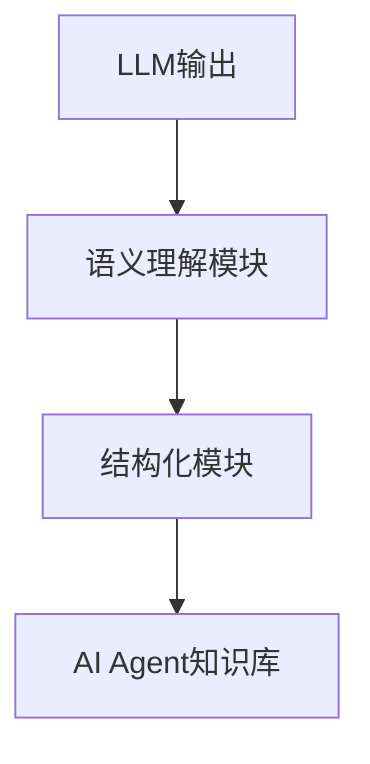

# AI Agent的知识表示：结构化LLM的输出

> 关键词：AI Agent、知识表示、大语言模型（LLM）、结构化输出、语义理解

> 摘要：本文围绕AI Agent的知识表示中结构化LLM输出这一核心主题展开深入探讨。首先介绍了相关背景，包括目的范围、预期读者等内容。接着阐述了核心概念与联系，清晰呈现AI Agent、知识表示和LLM输出结构化之间的原理与架构。详细讲解了核心算法原理及具体操作步骤，并通过Python代码进行示例。同时给出了相关的数学模型和公式，结合实际例子加深理解。在项目实战部分，通过具体的代码案例展示了开发环境搭建、源代码实现及解读。分析了实际应用场景，为读者提供了全面的参考。还推荐了一系列学习资源、开发工具框架和相关论文著作。最后对未来发展趋势与挑战进行总结，并在附录中解答常见问题，给出扩展阅读和参考资料，旨在为读者提供一个关于AI Agent知识表示中结构化LLM输出的全面且深入的技术知识体系。

## 1. 背景介绍 
### 1.1 目的和范围
在当今人工智能飞速发展的时代，大语言模型（LLM）已经展现出了强大的自然语言处理能力。然而，LLM输出的文本往往是自然语言形式，这种非结构化的输出在许多实际应用场景中存在一定的局限性。AI Agent作为能够自主执行任务的智能实体，需要对知识进行有效的表示和利用。本文章的目的在于探讨如何将LLM的输出进行结构化处理，以更好地满足AI Agent对知识表示的需求。范围涵盖了从核心概念的阐述、算法原理的讲解、数学模型的构建，到实际项目的实现和应用场景的分析等多个方面，旨在为读者提供一个全面深入的关于AI Agent知识表示中结构化LLM输出的技术指南。

### 1.2 预期读者
本文预期读者包括但不限于人工智能领域的研究人员、程序员、软件架构师、对AI Agent和大语言模型感兴趣的技术爱好者。对于正在从事相关研究和开发工作的专业人士，本文提供了深入的技术原理和实践案例，有助于他们在实际项目中应用和优化相关技术。对于技术爱好者，本文以通俗易懂的方式介绍了核心概念和相关技术，能够帮助他们更好地理解AI Agent和结构化LLM输出的相关知识。

### 1.3 文档结构概述
本文将按照以下结构进行组织：首先介绍背景信息，包括目的范围、预期读者等。接着阐述核心概念与联系，通过文本示意图和Mermaid流程图清晰展示相关概念的原理和架构。然后详细讲解核心算法原理及具体操作步骤，结合Python代码进行示例。随后给出相关的数学模型和公式，并通过具体例子进行说明。在项目实战部分，将展示开发环境搭建、源代码实现及解读。分析实际应用场景，为读者提供实际参考。推荐学习资源、开发工具框架和相关论文著作。最后对未来发展趋势与挑战进行总结，在附录中解答常见问题，给出扩展阅读和参考资料。

### 1.4 术语表
#### 1.4.1 核心术语定义
- **AI Agent**：即人工智能代理，是一种能够感知环境、做出决策并采取行动以实现特定目标的智能实体。它可以自主地与环境进行交互，执行各种任务。
- **知识表示**：是指将知识以计算机能够理解和处理的方式进行编码和组织的过程。通过知识表示，AI Agent可以更好地存储、检索和利用知识。
- **大语言模型（LLM）**：是一种基于深度学习的自然语言处理模型，通过在大规模文本数据上进行训练，能够生成自然语言文本，展现出强大的语言理解和生成能力。
- **结构化输出**：将原本非结构化的信息（如自然语言文本）按照一定的规则和格式进行整理和组织，使其具有明确的结构和语义，便于计算机进行处理和分析。

#### 1.4.2 相关概念解释
- **语义理解**：是指计算机对自然语言文本中所表达的意义的理解能力。在结构化LLM输出的过程中，语义理解起着关键作用，它能够帮助识别文本中的实体、关系和属性等信息，从而实现对文本的结构化处理。
- **知识图谱**：是一种以图的形式表示知识的方法，由实体、关系和属性组成。知识图谱可以将结构化的知识进行可视化和组织，便于AI Agent进行知识的存储和推理。

#### 1.4.3 缩略词列表
- **LLM**：大语言模型（Large Language Model）
- **AI**：人工智能（Artificial Intelligence）

## 2. 核心概念与联系 
### 核心概念原理
AI Agent的知识表示是实现其智能行为的基础。知识表示的目的是将外部世界的信息以一种合适的方式存储在AI Agent内部，以便它能够进行有效的推理和决策。大语言模型（LLM）作为一种强大的自然语言处理工具，能够生成丰富的文本信息。然而，这些文本信息通常是自然语言形式，缺乏明确的结构，不利于AI Agent直接进行处理和利用。因此，需要对LLM的输出进行结构化处理，使其能够被AI Agent更好地理解和应用。

结构化LLM输出的过程涉及到多个步骤。首先，需要对LLM输出的文本进行语义理解，识别其中的实体、关系和属性等信息。然后，根据这些信息构建相应的知识表示结构，如知识图谱、框架等。最后，将结构化后的知识存储在AI Agent的知识库中，供其进行推理和决策使用。

### 架构的文本示意图
```plaintext
+-------------------+          +----------------------+          +------------------+
|      LLM输出      | -------> |   语义理解模块       | -------> |  结构化模块       |
+-------------------+          +----------------------+          +------------------+
                                                                      |
                                                                      v
                                                              +------------------+
                                                              |  AI Agent知识库   |
                                                              +------------------+
```
### Mermaid流程图


## 3. 核心算法原理 & 具体操作步骤 
### 核心算法原理
在结构化LLM输出的过程中，关键的算法包括命名实体识别（NER）、关系抽取和属性提取等。命名实体识别的目的是识别文本中的实体，如人名、地名、组织机构名等。关系抽取则是识别实体之间的关系，如“位于”、“属于”等。属性提取是提取实体的相关属性，如“年龄”、“身高”等。

### 具体操作步骤
1. **文本预处理**：对LLM输出的文本进行预处理，包括去除噪声、分词、词性标注等操作，以便后续的处理。
2. **命名实体识别**：使用命名实体识别算法，如基于深度学习的BERT模型，识别文本中的实体。
3. **关系抽取**：通过关系抽取算法，如基于规则的方法或基于机器学习的方法，识别实体之间的关系。
4. **属性提取**：提取实体的相关属性，构建实体的属性信息。
5. **结构化表示**：根据识别出的实体、关系和属性，构建相应的知识表示结构，如知识图谱或框架。

### Python源代码示例
```python
import spacy

# 加载英文语言模型
nlp = spacy.load("en_core_web_sm")

def structured_llm_output(text):
    # 文本预处理
    doc = nlp(text)

    entities = []
    relations = []
    attributes = {}

    # 命名实体识别
    for ent in doc.ents:
        entities.append((ent.text, ent.label_))

    # 简单的关系和属性提取示例
    for token in doc:
        if token.dep_ == "nsubj":
            subject = token.text
        if token.dep_ == "dobj":
            object_ = token.text
            relations.append((subject, "动作对象", object_))

        if token.pos_ == "ADJ":
            if subject not in attributes:
                attributes[subject] = []
            attributes[subject].append(token.text)

    # 结构化表示
    structured_data = {
        "entities": entities,
        "relations": relations,
        "attributes": attributes
    }

    return structured_data

# 示例文本
text = "John bought a beautiful book."
result = structured_llm_output(text)
print(result)
```

## 4. 数学模型和公式 & 详细讲解 & 举例说明 
### 命名实体识别的数学模型
命名实体识别可以看作是一个序列标注问题。假设输入的文本序列为 $x = (x_1, x_2, \cdots, x_n)$，其中 $x_i$ 表示第 $i$ 个词。输出的标签序列为 $y = (y_1, y_2, \cdots, y_n)$，其中 $y_i$ 表示第 $i$ 个词的标签。

常见的命名实体识别模型是基于条件随机场（CRF）的模型。CRF的目标是最大化条件概率 $P(y|x)$，其公式为：
$$P(y|x) = \frac{1}{Z(x)} \exp \left( \sum_{i=1}^{n} \sum_{k=1}^{K} \lambda_k f_k(y_{i - 1}, y_i, x, i) \right)$$
其中，$Z(x)$ 是归一化因子，$\lambda_k$ 是特征函数 $f_k$ 的权重，$f_k$ 是定义在标签序列和输入文本上的特征函数。

### 关系抽取的数学模型
关系抽取可以看作是一个分类问题。假设输入的实体对为 $(e_1, e_2)$，关系类别集合为 $R = \{r_1, r_2, \cdots, r_m\}$。关系抽取模型的目标是预测实体对 $(e_1, e_2)$ 之间的关系 $r \in R$。

常见的关系抽取模型是基于卷积神经网络（CNN）的模型。CNN通过卷积层提取文本的特征，然后通过全连接层进行分类。假设输入的文本特征矩阵为 $X$，卷积核为 $W$，经过卷积操作后得到特征图 $C$：
$$C_{i,j} = \sum_{k=1}^{K} X_{i + k - 1, j} W_{k, j}$$
其中，$K$ 是卷积核的大小。

### 举例说明
假设有文本 “Apple is a technology company based in Cupertino.”。在命名实体识别中，我们可以识别出 “Apple” 为组织机构名，“Cupertino” 为地名。在关系抽取中，我们可以识别出 “Apple” 和 “Cupertino” 之间的关系为 “位于”。

## 5. 项目实战：代码实际案例和详细解释说明 
### 5.1  开发环境搭建
1. **安装Python**：确保你的系统中安装了Python 3.x版本。
2. **安装相关库**：使用pip安装必要的库，如`spacy`、`transformers`等。
```bash
pip install spacy
python -m spacy download en_core_web_sm
pip install transformers
```

### 5.2  源代码详细实现和代码解读
```python
import spacy
from transformers import AutoTokenizer, AutoModelForTokenClassification
import torch

# 加载预训练的命名实体识别模型
tokenizer = AutoTokenizer.from_pretrained("dslim/bert-base-NER")
model = AutoModelForTokenClassification.from_pretrained("dslim/bert-base-NER")

# 加载英文语言模型
nlp = spacy.load("en_core_web_sm")

def named_entity_recognition(text):
    inputs = tokenizer(text, return_tensors="pt")
    outputs = model(**inputs)
    logits = outputs.logits
    predictions = torch.argmax(logits, dim=2)
    tokens = tokenizer.convert_ids_to_tokens(inputs["input_ids"][0])
    entities = []
    for token, prediction in zip(tokens, predictions[0]):
        if prediction.item() != 0:
            entities.append((token, model.config.id2label[prediction.item()]))
    return entities

def relation_extraction(text):
    doc = nlp(text)
    relations = []
    for token in doc:
        if token.dep_ == "nsubj":
            subject = token.text
        if token.dep_ == "dobj":
            object_ = token.text
            relations.append((subject, "动作对象", object_))
    return relations

def attribute_extraction(text):
    doc = nlp(text)
    attributes = {}
    for token in doc:
        if token.pos_ == "ADJ":
            if token.head.text not in attributes:
                attributes[token.head.text] = []
            attributes[token.head.text].append(token.text)
    return attributes

def structured_llm_output(text):
    entities = named_entity_recognition(text)
    relations = relation_extraction(text)
    attributes = attribute_extraction(text)

    structured_data = {
        "entities": entities,
        "relations": relations,
        "attributes": attributes
    }

    return structured_data

# 示例文本
text = "John bought a beautiful book."
result = structured_llm_output(text)
print(result)
```
### 5.3  代码解读与分析
- **命名实体识别**：使用预训练的BERT模型进行命名实体识别。首先将输入文本进行分词，然后输入到模型中进行预测，最后根据预测结果提取实体信息。
- **关系抽取**：使用`spacy`库进行关系抽取。通过分析句子的依赖关系，识别出主语和宾语，从而构建实体之间的关系。
- **属性提取**：同样使用`spacy`库进行属性提取。通过分析词性，提取实体的相关属性。
- **结构化表示**：将命名实体识别、关系抽取和属性提取的结果整合到一个字典中，形成结构化的数据。

## 6. 实际应用场景 
### 智能客服
在智能客服系统中，AI Agent需要理解用户的问题并提供准确的答案。通过结构化LLM的输出，AI Agent可以更好地理解用户问题中的实体、关系和属性等信息，从而更准确地检索知识库中的相关信息，提供更精准的回答。

### 信息检索
在信息检索系统中，结构化的知识表示可以提高检索效率和准确性。AI Agent可以根据用户的查询，快速定位到相关的实体和关系，从而提供更相关的检索结果。

### 智能推荐
在智能推荐系统中，AI Agent可以根据用户的历史行为和偏好，构建用户的知识表示。通过结构化LLM的输出，AI Agent可以更好地理解用户的需求，从而提供更个性化的推荐。

## 7. 工具和资源推荐
### 7.1 学习资源推荐
#### 7.1.1 书籍推荐
- 《人工智能：一种现代的方法》：全面介绍了人工智能的基本概念、算法和应用，是人工智能领域的经典教材。
- 《自然语言处理入门》：详细介绍了自然语言处理的基本技术和方法，包括命名实体识别、关系抽取等内容。

#### 7.1.2 在线课程
- Coursera上的“Natural Language Processing Specialization”：由顶尖大学的教授授课，系统地介绍了自然语言处理的相关知识和技术。
- edX上的“Artificial Intelligence”：全面介绍了人工智能的各个方面，包括知识表示、推理等内容。

#### 7.1.3 技术博客和网站
- Medium上的“Towards Data Science”：发布了大量关于人工智能、自然语言处理等领域的技术文章和实践经验。
- arXiv.org：提供了最新的学术研究论文，包括人工智能和自然语言处理领域的前沿研究成果。

### 7.2 开发工具框架推荐
#### 7.2.1 IDE和编辑器
- PyCharm：一款专业的Python集成开发环境，提供了丰富的功能和工具，方便Python代码的开发和调试。
- Visual Studio Code：一款轻量级的代码编辑器，支持多种编程语言，具有丰富的插件生态系统。

#### 7.2.2 调试和性能分析工具
- PDB：Python自带的调试器，可以帮助开发者调试Python代码。
- cProfile：Python的性能分析工具，可以帮助开发者分析代码的性能瓶颈。

#### 7.2.3 相关框架和库
- spaCy：一个高效的自然语言处理库，提供了命名实体识别、词性标注、依赖分析等功能。
- Transformers：Hugging Face开发的自然语言处理框架，提供了大量的预训练模型，方便进行自然语言处理任务。

### 7.3 相关论文著作推荐
#### 7.3.1 经典论文
- “BERT: Pre-training of Deep Bidirectional Transformers for Language Understanding”：介绍了BERT模型的原理和训练方法，是自然语言处理领域的重要论文。
- “Conditional Random Fields: Probabilistic Models for Segmenting and Labeling Sequence Data”：介绍了条件随机场（CRF）的原理和应用，是序列标注问题的经典论文。

#### 7.3.2 最新研究成果
- 关注arXiv.org上最新的关于命名实体识别、关系抽取和知识表示的研究论文，了解最新的技术进展。

#### 7.3.3 应用案例分析
- 参考相关的学术会议和期刊上的应用案例分析，了解结构化LLM输出在实际项目中的应用和效果。

## 8. 总结：未来发展趋势与挑战
### 未来发展趋势
- **多模态融合**：未来的AI Agent将不仅仅依赖于文本信息，还将融合图像、语音等多模态信息。结构化LLM输出也将扩展到多模态领域，实现对不同模态信息的统一表示和处理。
- **知识增强**：通过引入外部知识图谱和常识知识，增强AI Agent的知识表示能力。结构化LLM输出将更好地与知识图谱相结合，实现更复杂的推理和决策。
- **可解释性**：随着AI技术的广泛应用，对AI Agent的可解释性要求越来越高。结构化LLM输出将有助于提高AI Agent的可解释性，使其决策过程更加透明。

### 挑战
- **语义理解的准确性**：虽然大语言模型在语言理解方面取得了很大的进展，但在语义理解的准确性方面仍然存在挑战。特别是对于一些复杂的语义和上下文信息，LLM的理解能力还需要进一步提高。
- **知识的一致性和完整性**：在结构化LLM输出的过程中，需要保证知识的一致性和完整性。然而，由于知识来源的多样性和不确定性，如何确保知识的一致性和完整性是一个挑战。
- **计算资源的需求**：结构化LLM输出涉及到复杂的算法和模型，对计算资源的需求较大。如何在有限的计算资源下实现高效的结构化处理是一个需要解决的问题。

## 9. 附录：常见问题与解答
### 问题1：如何选择合适的命名实体识别模型？
解答：选择命名实体识别模型时，需要考虑模型的性能、适用领域和计算资源等因素。可以参考公开的评测结果，选择在相关领域表现较好的模型。同时，也可以根据自己的需求对模型进行微调。

### 问题2：关系抽取的准确率如何提高？
解答：可以通过以下方法提高关系抽取的准确率：使用更多的训练数据，采用更复杂的模型结构，结合外部知识图谱等。此外，对文本进行预处理和特征工程也可以提高关系抽取的效果。

### 问题3：结构化LLM输出在实际应用中可能会遇到哪些问题？
解答：可能会遇到语义理解不准确、知识不一致、计算资源不足等问题。在实际应用中，需要根据具体情况进行优化和调整，如选择合适的模型、进行数据清洗和预处理等。

## 10. 扩展阅读 & 参考资料
### 扩展阅读
- 《深度学习》：详细介绍了深度学习的基本原理和算法，对于理解大语言模型和相关技术有很大的帮助。
- 《知识图谱：方法、实践与应用》：全面介绍了知识图谱的构建、应用和相关技术，与结构化LLM输出密切相关。

### 参考资料
- Hugging Face官方文档：提供了关于Transformers库的详细文档和使用示例。
- spaCy官方文档：提供了关于spaCy库的详细文档和使用指南。

作者：AI天才研究院/AI Genius Institute & 禅与计算机程序设计艺术 /Zen And The Art of Computer Programming