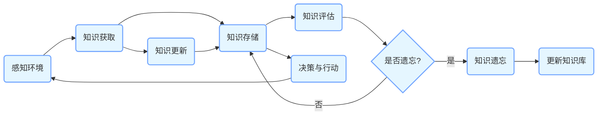

# AI Agent的知识遗忘管理：平衡记忆与效率

> 关键词：AI Agent、知识遗忘管理、记忆效率平衡、信息处理、认知架构

> 摘要：本文围绕AI Agent的知识遗忘管理展开，深入探讨如何在记忆与效率之间达成平衡。首先介绍了相关背景，包括目的范围、预期读者等。接着阐述核心概念，分析其原理与架构，并通过Mermaid流程图展示。详细讲解核心算法原理和具体操作步骤，结合Python源代码。引入数学模型和公式进行理论支撑，并举例说明。通过项目实战案例，涵盖开发环境搭建、源代码实现与解读。探讨了实际应用场景，推荐了学习资源、开发工具框架以及相关论文著作。最后总结未来发展趋势与挑战，提供常见问题解答和扩展阅读参考资料，旨在为AI Agent知识遗忘管理提供全面且深入的技术指导。

## 1. 背景介绍 
### 1.1 目的和范围
随着AI Agent在各个领域的广泛应用，其处理和存储的知识量呈爆炸式增长。知识遗忘管理成为提升AI Agent性能的关键因素。本文的目的在于深入研究如何对AI Agent的知识遗忘进行有效管理，以实现记忆与效率的最佳平衡。范围涵盖知识遗忘管理的理论基础、算法实现、实际应用以及相关工具和资源的介绍。

### 1.2 预期读者
本文主要面向人工智能领域的研究人员、开发者、软件架构师以及对AI Agent技术感兴趣的专业人士。对于正在从事AI Agent开发或研究知识管理相关课题的人员，本文将提供有价值的参考和技术指导。

### 1.3 文档结构概述
本文按照以下结构组织：首先介绍背景信息，让读者了解研究的目的和范围。接着阐述核心概念，包括知识遗忘管理的原理和架构，并通过流程图直观展示。详细讲解核心算法原理和具体操作步骤，结合Python代码进行说明。引入数学模型和公式，为理论分析提供支持，并举例说明。通过项目实战案例，从开发环境搭建到源代码实现与解读，全面展示知识遗忘管理的实际应用。探讨实际应用场景，推荐相关的学习资源、开发工具框架和论文著作。最后总结未来发展趋势与挑战，提供常见问题解答和扩展阅读参考资料。

### 1.4 术语表
#### 1.4.1 核心术语定义
- **AI Agent**：人工智能代理，是一种能够感知环境、进行决策并采取行动以实现特定目标的软件实体。
- **知识遗忘管理**：指对AI Agent所拥有的知识进行选择性遗忘的过程，旨在优化知识存储和处理效率。
- **记忆与效率平衡**：在保证AI Agent能够有效利用知识完成任务的前提下，通过合理的知识遗忘策略，减少不必要的知识存储和处理开销，提高系统的整体效率。

#### 1.4.2 相关概念解释
- **知识表示**：将知识以计算机能够理解和处理的方式进行编码和存储，常见的知识表示方法包括逻辑表示、语义网络、框架表示等。
- **知识更新**：随着环境的变化和新信息的获取，对AI Agent的知识进行更新和修正的过程。
- **遗忘策略**：用于决定哪些知识应该被遗忘的规则和方法，常见的遗忘策略包括基于时间、基于频率、基于重要性等。

#### 1.4.3 缩略词列表
- **AI**：Artificial Intelligence，人工智能
- **ML**：Machine Learning，机器学习
- **DL**：Deep Learning，深度学习

## 2. 核心概念与联系 

### 2.1 核心概念原理
AI Agent的知识遗忘管理基于认知心理学中的遗忘理论。在人类的认知过程中，遗忘是一种自然的现象，它有助于我们过滤掉无用的信息，集中注意力处理重要的信息。同样，对于AI Agent来说，随着时间的推移和知识的不断积累，一些旧的、无用的知识会占用大量的存储空间和计算资源，影响系统的性能。因此，通过合理的知识遗忘管理，可以优化AI Agent的知识结构，提高其处理效率。

知识遗忘管理的核心原理是根据知识的重要性、时效性和使用频率等因素，对知识进行评估和筛选，将那些不再重要或很少使用的知识从知识库中删除或标记为可遗忘状态。同时，为了保证AI Agent在需要时能够及时获取到必要的知识，遗忘管理策略需要与知识更新机制相结合，确保新的知识能够及时补充到知识库中。

### 2.2 架构示意图
下面是AI Agent知识遗忘管理的架构示意图：



### 2.3 架构解释
- **感知环境**：AI Agent通过传感器或其他输入接口感知外部环境的信息。
- **知识获取**：将感知到的信息转化为知识，并存储到知识库中。
- **知识存储**：使用合适的知识表示方法将知识存储在知识库中。
- **知识评估**：根据知识的重要性、时效性和使用频率等因素，对知识库中的知识进行评估。
- **是否遗忘**：根据评估结果，判断知识是否需要被遗忘。
- **知识遗忘**：将需要遗忘的知识从知识库中删除或标记为可遗忘状态。
- **更新知识库**：在知识遗忘后，更新知识库的结构和索引。
- **知识更新**：随着环境的变化和新信息的获取，对知识库中的知识进行更新和修正。
- **决策与行动**：根据知识库中的知识，进行决策并采取相应的行动。

## 3. 核心算法原理 & 具体操作步骤 

### 3.1 核心算法原理
我们采用基于重要性和使用频率的遗忘算法。该算法的核心思想是为每个知识项分配一个重要性得分和使用频率统计值，根据这两个值计算一个综合得分，得分较低的知识项将被优先遗忘。

### 3.2 具体操作步骤
1. **初始化**：为每个知识项设置初始的重要性得分和使用频率统计值。
2. **知识使用**：每当AI Agent使用某个知识项时，更新其使用频率统计值。
3. **知识评估**：定期对知识库中的所有知识项进行评估，计算其综合得分。
4. **知识遗忘**：根据综合得分，选择得分较低的知识项进行遗忘。
5. **更新知识库**：在知识遗忘后，更新知识库的结构和索引。

### 3.3 Python源代码实现
```python
import heapq

# 定义知识项类
class KnowledgeItem:
    def __init__(self, id, importance, frequency):
        self.id = id
        self.importance = importance
        self.frequency = frequency
        self.composite_score = importance * frequency

    def __lt__(self, other):
        return self.composite_score < other.composite_score

# 定义知识库类
class KnowledgeBase:
    def __init__(self):
        self.items = []
        self.item_map = {}

    def add_knowledge(self, id, importance, frequency):
        item = KnowledgeItem(id, importance, frequency)
        self.items.append(item)
        self.item_map[id] = item

    def use_knowledge(self, id):
        if id in self.item_map:
            item = self.item_map[id]
            item.frequency += 1
            item.composite_score = item.importance * item.frequency

    def evaluate_knowledge(self):
        heapq.heapify(self.items)

    def forget_knowledge(self, num_to_forget):
        forgotten_items = []
        for _ in range(min(num_to_forget, len(self.items))):
            item = heapq.heappop(self.items)
            del self.item_map[item.id]
            forgotten_items.append(item.id)
        return forgotten_items

    def update_knowledge_base(self):
        # 实际应用中需要更新知识库的结构和索引
        pass

# 示例使用
kb = KnowledgeBase()
kb.add_knowledge(1, 0.8, 5)
kb.add_knowledge(2, 0.6, 3)
kb.add_knowledge(3, 0.2, 1)

kb.use_knowledge(2)

kb.evaluate_knowledge()
forgotten_ids = kb.forget_knowledge(1)
print("Forgotten knowledge IDs:", forgotten_ids)

kb.update_knowledge_base()
```

### 3.4 代码解释
- **KnowledgeItem类**：表示一个知识项，包含知识项的ID、重要性得分、使用频率统计值和综合得分。
- **KnowledgeBase类**：表示知识库，包含知识项的列表和映射表。提供了添加知识、使用知识、评估知识、遗忘知识和更新知识库等方法。
- **示例使用**：创建一个知识库对象，添加三个知识项，使用其中一个知识项，评估知识库，遗忘一个知识项，并更新知识库。

## 4. 数学模型和公式 & 详细讲解 & 举例说明 

### 4.1 数学模型和公式
#### 4.1.1 综合得分计算
综合得分 $S$ 用于衡量一个知识项的重要性和使用频率的综合情况，计算公式为：
$$S = I \times F$$
其中，$I$ 表示知识项的重要性得分，取值范围为 $[0, 1]$，$F$ 表示知识项的使用频率统计值。

#### 4.1.2 遗忘概率计算
遗忘概率 $P$ 用于决定一个知识项是否应该被遗忘，计算公式为：
$$P = \frac{1}{1 + e^{-(S - \theta)}}$$
其中，$\theta$ 是一个阈值，用于控制遗忘的严格程度。

### 4.2 详细讲解
综合得分的计算将知识项的重要性和使用频率相结合，使得重要性高且使用频率高的知识项得分较高，不容易被遗忘。遗忘概率的计算使用了逻辑斯蒂函数，将综合得分映射到 $[0, 1]$ 的概率范围内。当综合得分低于阈值 $\theta$ 时，遗忘概率接近 1，知识项很可能被遗忘；当综合得分高于阈值 $\theta$ 时，遗忘概率接近 0，知识项不太可能被遗忘。

### 4.3 举例说明
假设一个知识项的重要性得分 $I = 0.3$，使用频率统计值 $F = 2$，则其综合得分 $S = 0.3 \times 2 = 0.6$。如果阈值 $\theta = 0.8$，则遗忘概率为：
$$P = \frac{1}{1 + e^{-(0.6 - 0.8)}} \approx 0.55$$
这意味着该知识项有大约 55% 的概率被遗忘。

## 5. 项目实战：代码实际案例和详细解释说明 

### 5.1  开发环境搭建
#### 5.1.1 操作系统
推荐使用Linux或macOS操作系统，因为它们对Python开发的支持较好。

#### 5.1.2 Python版本
使用Python 3.6及以上版本。

#### 5.1.3 开发工具
可以使用Visual Studio Code、PyCharm等集成开发环境（IDE）进行开发。

#### 5.1.4 依赖库安装
项目中使用了Python的标准库 `heapq`，无需额外安装。

### 5.2  源代码详细实现和代码解读
以下是完整的项目代码：

```python
import heapq

# 定义知识项类
class KnowledgeItem:
    def __init__(self, id, importance, frequency):
        self.id = id
        self.importance = importance
        self.frequency = frequency
        self.composite_score = importance * frequency

    def __lt__(self, other):
        return self.composite_score < other.composite_score

# 定义知识库类
class KnowledgeBase:
    def __init__(self):
        self.items = []
        self.item_map = {}

    def add_knowledge(self, id, importance, frequency):
        item = KnowledgeItem(id, importance, frequency)
        self.items.append(item)
        self.item_map[id] = item

    def use_knowledge(self, id):
        if id in self.item_map:
            item = self.item_map[id]
            item.frequency += 1
            item.composite_score = item.importance * item.frequency

    def evaluate_knowledge(self):
        heapq.heapify(self.items)

    def forget_knowledge(self, num_to_forget):
        forgotten_items = []
        for _ in range(min(num_to_forget, len(self.items))):
            item = heapq.heappop(self.items)
            del self.item_map[item.id]
            forgotten_items.append(item.id)
        return forgotten_items

    def update_knowledge_base(self):
        # 实际应用中需要更新知识库的结构和索引
        pass

# 示例使用
if __name__ == "__main__":
    kb = KnowledgeBase()
    kb.add_knowledge(1, 0.8, 5)
    kb.add_knowledge(2, 0.6, 3)
    kb.add_knowledge(3, 0.2, 1)

    kb.use_knowledge(2)

    kb.evaluate_knowledge()
    forgotten_ids = kb.forget_knowledge(1)
    print("Forgotten knowledge IDs:", forgotten_ids)

    kb.update_knowledge_base()
```

### 5.2.1 代码解读
- **KnowledgeItem类**：
    - `__init__` 方法：初始化知识项的ID、重要性得分、使用频率统计值和综合得分。
    - `__lt__` 方法：定义知识项之间的比较规则，用于优先队列的排序。

- **KnowledgeBase类**：
    - `__init__` 方法：初始化知识库，创建知识项的列表和映射表。
    - `add_knowledge` 方法：添加一个新的知识项到知识库中。
    - `use_knowledge` 方法：更新指定知识项的使用频率统计值和综合得分。
    - `evaluate_knowledge` 方法：使用 `heapq.heapify` 函数将知识项列表转换为优先队列。
    - `forget_knowledge` 方法：从优先队列中取出得分最低的知识项进行遗忘，并返回被遗忘的知识项的ID列表。
    - `update_knowledge_base` 方法：在知识遗忘后，更新知识库的结构和索引。

- **示例使用**：
    - 创建一个知识库对象，添加三个知识项。
    - 使用其中一个知识项，更新其使用频率。
    - 评估知识库，将知识项列表转换为优先队列。
    - 遗忘一个知识项，并打印被遗忘的知识项的ID。
    - 更新知识库的结构和索引。

### 5.3  代码解读与分析
#### 5.3.1 优点
- **简单易懂**：代码结构清晰，逻辑简单，易于理解和维护。
- **高效性**：使用优先队列（堆）来实现知识项的排序，时间复杂度为 $O(n log n)$，可以快速找到得分最低的知识项。
- **可扩展性**：可以根据实际需求对知识项的评估方法和遗忘策略进行扩展和优化。

#### 5.3.2 缺点
- **重要性得分和使用频率的确定较为主观**：在实际应用中，如何准确地确定知识项的重要性得分和使用频率是一个挑战。
- **缺乏对知识之间关联的考虑**：该算法只考虑了单个知识项的重要性和使用频率，没有考虑知识之间的关联和依赖关系。

## 6. 实际应用场景 
### 6.1 智能客服系统
在智能客服系统中，AI Agent需要处理大量的用户咨询信息。随着时间的推移，一些旧的、很少被问到的问题和答案会占用大量的存储空间和计算资源。通过知识遗忘管理，可以将这些不再重要的知识从知识库中删除，提高系统的响应速度和处理效率。

### 6.2 自动驾驶系统
自动驾驶系统需要不断地感知和处理周围环境的信息。一些历史的、不再相关的环境信息可以通过知识遗忘管理进行删除，减少系统的内存占用和计算负担，提高系统的实时性和稳定性。

### 6.3 智能家居系统
智能家居系统中的AI Agent需要管理各种设备的状态和用户的使用习惯。随着时间的推移，一些过时的设备状态信息和很少使用的用户习惯可以被遗忘，优化系统的资源利用，提高用户体验。

## 7. 工具和资源推荐
### 7.1 学习资源推荐
#### 7.1.1 书籍推荐
- 《人工智能：一种现代的方法》：全面介绍了人工智能的基本概念、算法和应用，是人工智能领域的经典教材。
- 《机器学习》：详细讲解了机器学习的各种算法和模型，对于理解AI Agent的知识处理和学习机制有很大帮助。
- 《深度学习》：深入探讨了深度学习的原理和应用，是深度学习领域的权威著作。

#### 7.1.2 在线课程
- Coursera上的“人工智能基础”课程：由知名高校的教授授课，系统地介绍了人工智能的基础知识和应用。
- edX上的“机器学习”课程：提供了丰富的实践项目和案例，帮助学习者深入理解机器学习算法。
- 中国大学MOOC上的“深度学习”课程：国内高校的优质课程，适合初学者学习深度学习。

#### 7.1.3 技术博客和网站
- Medium：有许多人工智能领域的专业博主分享最新的研究成果和技术经验。
- arXiv：提供了大量的学术论文，是了解人工智能最新研究动态的重要渠道。
- AI开源社区：如GitHub上的各种人工智能项目，可学习他人的代码实现和项目经验。

### 7.2 开发工具框架推荐
#### 7.2.1 IDE和编辑器
- Visual Studio Code：轻量级的集成开发环境，支持Python开发，具有丰富的插件和扩展功能。
- PyCharm：专业的Python集成开发环境，提供了代码调试、自动补全、代码分析等强大功能。

#### 7.2.2 调试和性能分析工具
- pdb：Python的标准调试器，可用于调试Python代码。
- cProfile：Python的性能分析工具，可用于分析代码的运行时间和资源消耗。

#### 7.2.3 相关框架和库
- TensorFlow：Google开发的深度学习框架，提供了丰富的深度学习模型和工具。
- PyTorch：Facebook开发的深度学习框架，具有动态图和易于使用的特点。
- Scikit-learn：Python的机器学习库，提供了各种机器学习算法和工具。

### 7.3 相关论文著作推荐
#### 7.3.1 经典论文
- “A Logical Calculus of the Ideas Immanent in Nervous Activity”：由Warren McCulloch和Walter Pitts发表，提出了人工神经网络的基本概念。
- “Learning Representations by Back-propagating Errors”：由David Rumelhart、Geoffrey Hinton和Ronald Williams发表，介绍了反向传播算法，是深度学习发展的重要里程碑。

#### 7.3.2 最新研究成果
- 关注顶级人工智能会议（如NeurIPS、ICML、CVPR等）上的论文，了解最新的研究成果和技术趋势。
- 查阅知名学术期刊（如Journal of Artificial Intelligence Research、Artificial Intelligence等）上的文章，获取高质量的研究论文。

#### 7.3.3 应用案例分析
- 一些知名企业（如Google、Microsoft、Facebook等）会在其技术博客上分享AI Agent的应用案例和实践经验，可以从中学习到实际应用中的技术和方法。

## 8. 总结：未来发展趋势与挑战
### 8.1 未来发展趋势
#### 8.1.1 更智能的遗忘策略
未来的AI Agent将采用更加智能的遗忘策略，不仅考虑知识的重要性和使用频率，还会结合知识的上下文、语义信息和时间序列信息等，更加精准地判断哪些知识应该被遗忘。

#### 8.1.2 与知识图谱的结合
知识图谱可以表示知识之间的关联和语义关系，将知识遗忘管理与知识图谱相结合，可以更好地处理知识之间的依赖关系，提高知识管理的效率和准确性。

#### 8.1.3 自适应的遗忘机制
AI Agent将具备自适应的遗忘机制，能够根据自身的运行状态、任务需求和环境变化等因素，动态调整遗忘策略和参数，实现更加灵活和高效的知识管理。

### 8.2 挑战
#### 8.2.1 知识重要性评估的准确性
如何准确地评估知识的重要性是一个挑战。知识的重要性往往受到多种因素的影响，如任务需求、上下文信息和用户偏好等，很难用一个简单的指标来衡量。

#### 8.2.2 知识之间关联的处理
知识之间存在着复杂的关联和依赖关系，在进行知识遗忘管理时，需要考虑这些关联关系，避免因为遗忘某个知识而导致其他相关知识的失效。

#### 8.2.3 隐私和安全问题
在知识遗忘管理过程中，需要注意保护用户的隐私和数据安全。一些敏感的知识可能需要特殊的处理和保护，避免泄露给未经授权的第三方。

## 9. 附录：常见问题与解答
### 9.1 如何确定知识项的重要性得分？
知识项的重要性得分可以根据多种因素来确定，如知识项在任务中的关键程度、知识项的时效性、知识项的影响力等。可以通过专家评估、机器学习算法或用户反馈等方式来确定重要性得分。

### 9.2 遗忘知识会对AI Agent的性能产生影响吗？
如果遗忘策略设计合理，遗忘知识不会对AI Agent的性能产生负面影响。相反，合理的知识遗忘可以优化知识库的结构，减少不必要的知识存储和处理开销，提高系统的整体效率。但如果遗忘过度，可能会导致AI Agent在需要某些知识时无法获取，影响其决策和行动能力。

### 9.3 如何处理知识之间的关联和依赖关系？
可以使用知识图谱等技术来表示知识之间的关联和依赖关系。在进行知识遗忘管理时，需要检查被遗忘的知识是否会影响其他相关知识的有效性。如果会影响，可以采取相应的措施，如更新相关知识或保留部分关联知识。

### 9.4 如何保证知识遗忘管理的安全性和隐私性？
在知识遗忘管理过程中，需要对敏感知识进行特殊处理和保护。可以采用加密技术对知识进行加密存储，限制访问权限，确保只有授权的人员能够访问和处理敏感知识。同时，需要遵守相关的法律法规和隐私政策，保护用户的隐私和数据安全。

## 10. 扩展阅读 & 参考资料
### 10.1 扩展阅读
- 《认知心理学》：了解人类认知过程中的遗忘机制，为AI Agent的知识遗忘管理提供理论参考。
- 《大数据处理与分析》：学习大数据处理和分析的技术和方法，有助于处理AI Agent中的大规模知识数据。
- 《软件工程》：掌握软件工程的原理和方法，提高AI Agent开发和维护的质量和效率。

### 10.2 参考资料
- 《人工智能手册》：全面介绍了人工智能的各个领域和技术，是人工智能领域的重要参考书籍。
- 相关的学术论文和研究报告：查阅国内外知名学术期刊和会议上的论文，获取最新的研究成果和技术信息。
- 开源项目和代码库：参考GitHub等开源社区上的相关项目和代码，学习他人的实现思路和方法。

作者：AI天才研究院/AI Genius Institute & 禅与计算机程序设计艺术 /Zen And The Art of Computer Programming