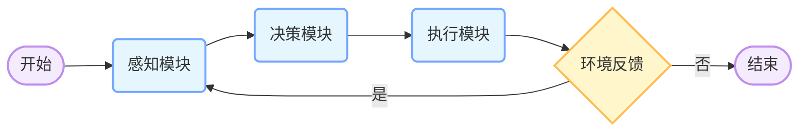

# AI Agent的系统架构设计与实现

> 关键词：AI Agent、系统架构、设计、实现、人工智能、智能体、决策机制

> 摘要：本文围绕AI Agent的系统架构设计与实现展开深入探讨。首先介绍了AI Agent的相关背景，包括目的范围、预期读者等内容。接着阐述了AI Agent的核心概念与联系，给出了原理和架构的文本示意图及Mermaid流程图。详细讲解了核心算法原理，并通过Python源代码进行说明，同时介绍了相关数学模型和公式。在项目实战部分，给出了开发环境搭建步骤、源代码详细实现与解读。探讨了AI Agent的实际应用场景，推荐了学习资源、开发工具框架以及相关论文著作。最后总结了未来发展趋势与挑战，提供了常见问题与解答以及扩展阅读和参考资料，旨在为读者全面呈现AI Agent系统架构设计与实现的全貌，助力读者深入理解和实践。

## 1. 背景介绍 
### 1.1 目的和范围
AI Agent作为人工智能领域的重要概念，其系统架构的设计与实现具有深远的意义。目的在于构建一个能够自主感知环境、做出决策并执行相应动作的智能体系统。通过合理的架构设计，使得AI Agent能够高效地处理复杂任务，在不同的应用场景中发挥作用。范围涵盖了从基础的概念理解到具体的算法实现，再到实际项目的开发与应用，包括但不限于智能客服、自动驾驶、游戏AI等多个领域。

### 1.2 预期读者
本文预期读者包括对人工智能、AI Agent感兴趣的研究人员、开发者、学生等。对于想要深入了解AI Agent系统架构设计与实现原理的初学者，可作为入门学习资料；对于有一定经验的开发者，可作为技术参考和实践指导，帮助其在实际项目中更好地应用和优化AI Agent系统。

### 1.3 文档结构概述
本文首先介绍AI Agent的背景信息，让读者对其有初步的认识。接着阐述核心概念与联系，帮助读者理解AI Agent的基本原理和架构。然后详细讲解核心算法原理和具体操作步骤，并给出相关数学模型和公式。通过项目实战部分，展示如何在实际中开发一个AI Agent系统。介绍AI Agent的实际应用场景，让读者了解其广泛的用途。推荐相关的工具和资源，方便读者进一步学习和实践。最后总结未来发展趋势与挑战，解答常见问题，并提供扩展阅读和参考资料。

### 1.4 术语表
#### 1.4.1 核心术语定义
- **AI Agent（人工智能智能体）**：是一个能够感知环境，根据感知到的信息进行决策，并执行相应动作以实现特定目标的实体。
- **感知模块**：负责收集环境中的信息，如传感器数据、文本信息等。
- **决策模块**：根据感知模块提供的信息，运用一定的算法和策略做出决策。
- **执行模块**：根据决策模块的结果，执行相应的动作，如控制机器人运动、回复用户信息等。

#### 1.4.2 相关概念解释
- **环境**：AI Agent所处的外部世界，它可以是物理环境，如现实世界中的场景；也可以是虚拟环境，如计算机模拟的游戏场景。
- **目标**：AI Agent需要完成的任务或达到的状态，是其行为的导向。
- **反馈**：环境对AI Agent执行动作的响应，用于评估决策的效果，为后续决策提供依据。

#### 1.4.3 缩略词列表
- **AI**：Artificial Intelligence（人工智能）
- **ML**：Machine Learning（机器学习）
- **RL**：Reinforcement Learning（强化学习）

## 2. 核心概念与联系 

### 核心概念原理
AI Agent的核心原理基于感知 - 决策 - 执行的循环过程。感知模块从环境中获取信息，这些信息可以是图像、声音、文本等多种形式。决策模块对感知到的信息进行处理和分析，根据预设的算法和策略，结合自身的目标和知识，做出最优的决策。执行模块将决策转化为具体的动作，作用于环境。环境对动作产生反馈，感知模块再次收集反馈信息，如此循环往复，使AI Agent不断适应环境，优化决策。

### 架构的文本示意图
AI Agent的架构主要由感知模块、决策模块和执行模块组成，它们之间存在着紧密的联系。感知模块与环境相连，负责收集信息并将其传递给决策模块。决策模块根据接收到的信息进行推理和决策，将决策结果发送给执行模块。执行模块执行相应的动作，对环境产生影响，环境的变化又会被感知模块捕捉到，形成一个闭环系统。

### Mermaid流程图


## 3. 核心算法原理 & 具体操作步骤 

### 核心算法原理
AI Agent的决策过程可以采用多种算法，这里以强化学习算法为例进行说明。强化学习是一种通过智能体与环境进行交互，不断尝试不同的动作，根据环境给予的奖励信号来学习最优策略的算法。智能体的目标是最大化长期累积奖励。

### 具体操作步骤
1. **初始化**：初始化智能体的策略、价值函数等参数。
2. **感知环境**：智能体通过感知模块获取当前环境的状态。
3. **选择动作**：根据当前状态和策略，选择一个动作。
4. **执行动作**：执行模块执行选择的动作，作用于环境。
5. **获取奖励和新状态**：环境对动作做出响应，智能体获取奖励和新的环境状态。
6. **更新策略和价值函数**：根据奖励和新状态，更新智能体的策略和价值函数。
7. **重复步骤2 - 6**：不断循环，直到达到终止条件。

### Python源代码实现
```python
import numpy as np

# 定义环境类
class Environment:
    def __init__(self):
        self.state_space = 10
        self.action_space = 2
        self.reset()

    def reset(self):
        self.state = np.random.randint(0, self.state_space)
        return self.state

    def step(self, action):
        if action == 0:
            self.state = max(0, self.state - 1)
        else:
            self.state = min(self.state_space - 1, self.state + 1)

        if self.state == self.state_space - 1:
            reward = 1
            done = True
        else:
            reward = 0
            done = False

        return self.state, reward, done

# 定义智能体类
class Agent:
    def __init__(self, state_space, action_space):
        self.state_space = state_space
        self.action_space = action_space
        self.q_table = np.zeros((state_space, action_space))
        self.learning_rate = 0.1
        self.discount_factor = 0.9
        self.epsilon = 0.1

    def choose_action(self, state):
        if np.random.uniform(0, 1) < self.epsilon:
            action = np.random.randint(0, self.action_space)
        else:
            action = np.argmax(self.q_table[state, :])
        return action

    def update(self, state, action, reward, next_state):
        max_q_next = np.max(self.q_table[next_state, :])
        self.q_table[state, action] += self.learning_rate * (reward + self.discount_factor * max_q_next - self.q_table[state, action])

# 训练过程
env = Environment()
agent = Agent(env.state_space, env.action_space)

episodes = 1000
for episode in range(episodes):
    state = env.reset()
    done = False
    while not done:
        action = agent.choose_action(state)
        next_state, reward, done = env.step(action)
        agent.update(state, action, reward, next_state)
        state = next_state
```

## 4. 数学模型和公式 & 详细讲解 & 举例说明 

### 数学模型
在强化学习中，常用的数学模型是马尔可夫决策过程（MDP）。MDP可以用一个五元组 $<S, A, P, R, \gamma>$ 来表示，其中：
- $S$ 是状态空间，表示环境中所有可能的状态。
- $A$ 是动作空间，表示智能体可以采取的所有动作。
- $P$ 是状态转移概率，表示在状态 $s$ 下采取动作 $a$ 转移到状态 $s'$ 的概率，即 $P(s'|s, a)$。
- $R$ 是奖励函数，表示在状态 $s$ 下采取动作 $a$ 转移到状态 $s'$ 时获得的奖励，即 $R(s, a, s')$。
- $\gamma$ 是折扣因子，用于平衡即时奖励和未来奖励，取值范围为 $[0, 1]$。

### 公式
#### 状态价值函数
状态价值函数 $V^{\pi}(s)$ 表示在策略 $\pi$ 下，从状态 $s$ 开始的长期累积奖励的期望值，其定义为：
$$V^{\pi}(s) = \mathbb{E}_{\pi}[\sum_{t=0}^{\infty} \gamma^t R_{t+1} | S_0 = s]$$

#### 动作价值函数
动作价值函数 $Q^{\pi}(s, a)$ 表示在策略 $\pi$ 下，从状态 $s$ 采取动作 $a$ 开始的长期累积奖励的期望值，其定义为：
$$Q^{\pi}(s, a) = \mathbb{E}_{\pi}[\sum_{t=0}^{\infty} \gamma^t R_{t+1} | S_0 = s, A_0 = a]$$

#### 贝尔曼方程
状态价值函数和动作价值函数满足贝尔曼方程，对于状态价值函数有：
$$V^{\pi}(s) = \sum_{a \in A} \pi(a|s) \sum_{s' \in S} P(s'|s, a) [R(s, a, s') + \gamma V^{\pi}(s')]$$
对于动作价值函数有：
$$Q^{\pi}(s, a) = \sum_{s' \in S} P(s'|s, a) [R(s, a, s') + \gamma \sum_{a' \in A} \pi(a'|s') Q^{\pi}(s', a')]$$

### 详细讲解
状态价值函数 $V^{\pi}(s)$ 描述了在给定策略 $\pi$ 下，处于状态 $s$ 的好坏程度。动作价值函数 $Q^{\pi}(s, a)$ 则更具体地描述了在状态 $s$ 下采取动作 $a$ 的好坏程度。贝尔曼方程将当前状态的价值与下一个状态的价值联系起来，通过不断迭代求解贝尔曼方程，可以得到最优的策略和价值函数。

### 举例说明
假设有一个简单的网格世界环境，智能体在网格中移动，目标是到达终点获得奖励。状态空间 $S$ 是网格中的所有位置，动作空间 $A$ 包括上下左右四个方向的移动。状态转移概率 $P$ 表示智能体采取某个动作后到达下一个位置的概率，奖励函数 $R$ 表示到达终点获得正奖励，其他位置获得零奖励或负奖励。折扣因子 $\gamma$ 用于平衡即时奖励和未来奖励。通过求解贝尔曼方程，智能体可以学习到最优的移动策略。

## 5. 项目实战：代码实际案例和详细解释说明 

### 5.1  开发环境搭建
1. **安装Python**：建议安装Python 3.7及以上版本，可以从Python官方网站（https://www.python.org/downloads/） 下载安装包进行安装。
2. **安装依赖库**：本项目需要使用 `numpy` 库，可以使用以下命令进行安装：
```sh
pip install numpy
```

### 5.2  源代码详细实现和代码解读
```python
import numpy as np

# 定义环境类
class Environment:
    def __init__(self):
        # 状态空间大小
        self.state_space = 10
        # 动作空间大小
        self.action_space = 2
        # 重置环境
        self.reset()

    def reset(self):
        # 随机初始化状态
        self.state = np.random.randint(0, self.state_space)
        return self.state

    def step(self, action):
        if action == 0:
            # 向左移动
            self.state = max(0, self.state - 1)
        else:
            # 向右移动
            self.state = min(self.state_space - 1, self.state + 1)

        if self.state == self.state_space - 1:
            # 到达终点，获得奖励
            reward = 1
            done = True
        else:
            reward = 0
            done = False

        return self.state, reward, done

# 定义智能体类
class Agent:
    def __init__(self, state_space, action_space):
        # 状态空间大小
        self.state_space = state_space
        # 动作空间大小
        self.action_space = action_space
        # 初始化Q表
        self.q_table = np.zeros((state_space, action_space))
        # 学习率
        self.learning_rate = 0.1
        # 折扣因子
        self.discount_factor = 0.9
        # 探索率
        self.epsilon = 0.1

    def choose_action(self, state):
        if np.random.uniform(0, 1) < self.epsilon:
            # 探索：随机选择动作
            action = np.random.randint(0, self.action_space)
        else:
            # 利用：选择Q值最大的动作
            action = np.argmax(self.q_table[state, :])
        return action

    def update(self, state, action, reward, next_state):
        # 计算下一个状态的最大Q值
        max_q_next = np.max(self.q_table[next_state, :])
        # 更新Q表
        self.q_table[state, action] += self.learning_rate * (reward + self.discount_factor * max_q_next - self.q_table[state, action])

# 训练过程
env = Environment()
agent = Agent(env.state_space, env.action_space)

episodes = 1000
for episode in range(episodes):
    state = env.reset()
    done = False
    while not done:
        action = agent.choose_action(state)
        next_state, reward, done = env.step(action)
        agent.update(state, action, reward, next_state)
        state = next_state
```

### 5.3  代码解读与分析
- **环境类（Environment）**：
  - `__init__` 方法：初始化环境的状态空间和动作空间，并调用 `reset` 方法重置环境。
  - `reset` 方法：随机初始化环境的状态，并返回该状态。
  - `step` 方法：根据智能体选择的动作更新环境状态，判断是否到达终点，返回新的状态、奖励和是否结束的标志。

- **智能体类（Agent）**：
  - `__init__` 方法：初始化智能体的状态空间、动作空间、Q表、学习率、折扣因子和探索率。
  - `choose_action` 方法：根据探索率决定是随机选择动作还是选择Q值最大的动作。
  - `update` 方法：根据奖励和下一个状态的最大Q值更新Q表。

- **训练过程**：
  - 循环执行多个回合（episodes），每个回合中智能体与环境进行交互，不断选择动作、执行动作、获取奖励和更新Q表，直到达到终止条件。

## 6. 实际应用场景 
### 智能客服
AI Agent可以作为智能客服，通过感知用户的问题（文本信息），利用自然语言处理技术进行理解和分析，然后根据预设的策略或训练得到的模型做出决策，生成合适的回复并执行回复动作，为用户提供快速、准确的服务。

### 自动驾驶
在自动驾驶领域，AI Agent作为核心决策系统。通过感知模块收集车辆周围的环境信息，如摄像头获取的图像、雷达获取的距离信息等。决策模块根据这些信息判断车辆的行驶状态和周围环境的情况，做出加速、减速、转弯等决策。执行模块将决策转化为具体的控制信号，控制车辆的行驶。

### 游戏AI
在游戏中，AI Agent可以作为游戏角色的控制者。感知模块收集游戏中的各种信息，如玩家的操作、游戏场景的变化等。决策模块根据这些信息制定策略，如攻击、防御、移动等。执行模块控制游戏角色执行相应的动作，与玩家进行对抗或协作。

### 工业自动化
在工业生产中，AI Agent可以用于机器人的控制。感知模块收集机器人周围的环境信息和工件的状态信息，决策模块根据这些信息规划机器人的运动路径和操作步骤，执行模块控制机器人执行相应的动作，实现自动化生产。

## 7. 工具和资源推荐
### 7.1 学习资源推荐
#### 7.1.1 书籍推荐
- 《人工智能：一种现代的方法》：全面介绍了人工智能的基本概念、算法和应用，是人工智能领域的经典教材。
- 《强化学习：原理与Python