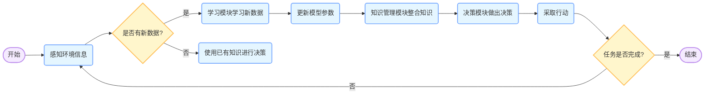

# AI Agent的终身学习与知识累积机制

> 关键词：AI Agent、终身学习、知识累积机制、机器学习、持续学习

> 摘要：本文围绕AI Agent的终身学习与知识累积机制展开深入探讨。首先介绍了该主题的背景，包括目的、预期读者、文档结构和相关术语。接着阐述了核心概念及其联系，通过文本示意图和Mermaid流程图进行清晰展示。详细讲解了核心算法原理，并用Python代码进行说明，同时给出了数学模型和公式，并举例阐释。通过项目实战展示了代码的实际应用和详细解读。分析了AI Agent终身学习与知识累积机制在不同领域的实际应用场景。推荐了相关的学习资源、开发工具框架和论文著作。最后总结了未来发展趋势与挑战，还提供了常见问题解答和扩展阅读参考资料，旨在为读者全面理解和研究AI Agent的终身学习与知识累积机制提供有价值的参考。

## 1. 背景介绍 
### 1.1 目的和范围
随着人工智能技术的不断发展，AI Agent在各个领域的应用越来越广泛。然而，传统的AI系统往往在固定的数据集上进行训练，缺乏持续学习和适应新环境的能力。本文的目的在于深入研究AI Agent的终身学习与知识累积机制，探讨如何使AI Agent能够在不断变化的环境中持续学习新知识、累积经验，从而提高其智能水平和适应性。

本文的范围涵盖了AI Agent终身学习与知识累积机制的核心概念、算法原理、数学模型、实际应用场景以及相关的工具和资源推荐等方面。

### 1.2 预期读者
本文预期读者包括人工智能领域的研究人员、开发者、学生以及对AI Agent技术感兴趣的专业人士。对于希望深入了解AI Agent终身学习与知识累积机制的原理、实现方法和应用前景的读者，本文将提供有价值的参考。

### 1.3 文档结构概述
本文将按照以下结构进行组织：
- 核心概念与联系：介绍AI Agent终身学习与知识累积机制的核心概念，通过文本示意图和Mermaid流程图展示其架构和联系。
- 核心算法原理 & 具体操作步骤：详细讲解核心算法原理，并用Python代码进行具体实现和说明。
- 数学模型和公式 & 详细讲解 & 举例说明：给出相关的数学模型和公式，并进行详细讲解和举例。
- 项目实战：代码实际案例和详细解释说明：通过实际项目案例展示AI Agent终身学习与知识累积机制的应用，包括开发环境搭建、源代码实现和代码解读。
- 实际应用场景：分析AI Agent终身学习与知识累积机制在不同领域的实际应用场景。
- 工具和资源推荐：推荐相关的学习资源、开发工具框架和论文著作。
- 总结：未来发展趋势与挑战：总结AI Agent终身学习与知识累积机制的未来发展趋势和面临的挑战。
- 附录：常见问题与解答：提供常见问题的解答。
- 扩展阅读 & 参考资料：列出扩展阅读的相关资料和参考文献。

### 1.4 术语表
#### 1.4.1 核心术语定义
- **AI Agent**：人工智能代理，是一种能够感知环境、做出决策并采取行动以实现特定目标的软件实体。
- **终身学习**：指AI Agent在其生命周期内持续学习新知识、适应新环境的能力。
- **知识累积机制**：用于管理和整合AI Agent在学习过程中获取的知识，以便在后续的决策和行动中有效利用。

#### 1.4.2 相关概念解释
- **持续学习**：与终身学习类似，强调在时间维度上的连续学习过程，不断更新模型以适应新的数据和任务。
- **元学习**：学习如何学习的方法，旨在使AI Agent能够快速适应新的任务和环境，通过学习通用的学习策略来提高学习效率。

#### 1.4.3 缩略词列表
- **ML**：Machine Learning，机器学习
- **DL**：Deep Learning，深度学习
- **RL**：Reinforcement Learning，强化学习

## 2. 核心概念与联系 
### 核心概念原理
AI Agent的终身学习与知识累积机制的核心原理在于使AI Agent能够在不断变化的环境中持续学习新知识，并将这些知识有效地累积和整合到已有的知识体系中。这涉及到多个方面的技术和方法，包括持续学习算法、知识表示和管理、元学习等。

持续学习算法是实现终身学习的关键，它允许AI Agent在面对新的数据和任务时，不断更新其模型参数，而不会忘记之前学习到的知识。常见的持续学习算法包括增量学习、多任务学习和元学习等。

知识表示和管理用于将AI Agent学习到的知识以一种合适的方式进行表示和存储，以便在需要时能够快速检索和使用。常见的知识表示方法包括符号表示、神经网络表示和图表示等。

元学习则是一种更高级的学习方法，它通过学习如何学习，使AI Agent能够在面对新的任务时更快地适应和学习。元学习可以学习到通用的学习策略和模型初始化参数，从而提高学习效率和泛化能力。

### 架构的文本示意图
AI Agent的终身学习与知识累积机制的架构可以分为以下几个主要部分：
- **感知模块**：负责感知环境中的信息，包括传感器数据、文本数据等。
- **学习模块**：使用持续学习算法对感知到的数据进行学习和更新模型参数。
- **知识管理模块**：对学习到的知识进行表示、存储和管理，包括知识的整合、检索和更新。
- **决策模块**：根据学习到的知识和当前的环境信息做出决策和采取行动。

### Mermaid流程图


## 3. 核心算法原理 & 具体操作步骤 
### 增量学习算法原理
增量学习是一种常见的持续学习算法，它允许AI Agent在面对新的数据时，逐步更新其模型参数，而不需要重新训练整个模型。增量学习的核心思想是在已有模型的基础上，利用新的数据对模型进行微调。

以下是一个简单的增量学习示例，使用Python和Scikit-learn库实现：
```python
from sklearn.linear_model import SGDClassifier
import numpy as np

# 初始化模型
model = SGDClassifier()

# 模拟已有数据
X_train_1 = np.array([[1, 2], [2, 3], [3, 4]])
y_train_1 = np.array([0, 0, 1])

# 训练模型
model.partial_fit(X_train_1, y_train_1, classes=[0, 1])

# 模拟新数据
X_train_2 = np.array([[4, 5], [5, 6]])
y_train_2 = np.array([1, 1])

# 使用新数据增量训练模型
model.partial_fit(X_train_2, y_train_2)

# 预测新数据
X_test = np.array([[6, 7]])
y_pred = model.predict(X_test)
print("预测结果:", y_pred)
```
### 具体操作步骤
1. **初始化模型**：选择合适的机器学习模型，并进行初始化。
2. **训练已有数据**：使用已有数据对模型进行训练。
3. **获取新数据**：在实际应用中，不断获取新的数据。
4. **增量训练模型**：使用新的数据对模型进行增量训练，更新模型参数。
5. **预测和决策**：使用更新后的模型对新的数据进行预测和决策。

## 4. 数学模型和公式 & 详细讲解 & 举例说明 
### 损失函数的更新公式
在增量学习中，常用的损失函数是交叉熵损失函数。假设已有模型的参数为 $\theta$，新的数据为 $(x_{new}, y_{new})$，则更新后的损失函数可以表示为：

$$L(\theta) = \lambda L_{old}(\theta) + (1 - \lambda) L_{new}(\theta)$$

其中，$L_{old}(\theta)$ 是已有数据的损失函数，$L_{new}(\theta)$ 是新数据的损失函数，$\lambda$ 是一个权重参数，用于控制已有数据和新数据的相对重要性。

### 详细讲解
- **已有数据的损失函数 $L_{old}(\theta)$**：表示模型在已有数据上的损失，反映了模型对已有知识的拟合程度。
- **新数据的损失函数 $L_{new}(\theta)$**：表示模型在新数据上的损失，反映了模型对新数据的适应能力。
- **权重参数 $\lambda$**：用于平衡已有数据和新数据的影响。当 $\lambda$ 接近 1 时，模型更倾向于保留已有知识；当 $\lambda$ 接近 0 时，模型更倾向于适应新数据。

### 举例说明
假设已有数据的损失函数 $L_{old}(\theta) = 0.5$，新数据的损失函数 $L_{new}(\theta) = 0.3$，权重参数 $\lambda = 0.7$，则更新后的损失函数为：

$$L(\theta) = 0.7 \times 0.5 + (1 - 0.7) \times 0.3 = 0.35 + 0.09 = 0.44$$

## 5. 项目实战：代码实际案例和详细解释说明 
### 5.1  开发环境搭建
本项目使用Python进行开发，需要安装以下库：
- **Scikit-learn**：用于机器学习模型的实现和训练。
- **Numpy**：用于数值计算。
- **Pandas**：用于数据处理和分析。

可以使用以下命令进行安装：
```bash
pip install scikit-learn numpy pandas
```

### 5.2  源代码详细实现和代码解读
以下是一个完整的项目实战代码示例，实现了一个简单的AI Agent的终身学习与知识累积机制：
```python
import numpy as np
from sklearn.linear_model import SGDClassifier
import pandas as pd

# 初始化模型
model = SGDClassifier()

# 模拟已有数据
data_1 = pd.DataFrame({
    'feature_1': [1, 2, 3],
    'feature_2': [2, 3, 4],
    'label': [0, 0, 1]
})
X_train_1 = data_1[['feature_1', 'feature_2']].values
y_train_1 = data_1['label'].values

# 训练模型
model.partial_fit(X_train_1, y_train_1, classes=[0, 1])

# 模拟新数据
data_2 = pd.DataFrame({
    'feature_1': [4, 5],
    'feature_2': [5, 6],
    'label': [1, 1]
})
X_train_2 = data_2[['feature_1', 'feature_2']].values
y_train_2 = data_2['label'].values

# 使用新数据增量训练模型
model.partial_fit(X_train_2, y_train_2)

# 预测新数据
X_test = np.array([[6, 7]])
y_pred = model.predict(X_test)
print("预测结果:", y_pred)
```
### 代码解读与分析
1. **导入必要的库**：导入Scikit-learn、Numpy和Pandas库。
2. **初始化模型**：使用SGDClassifier初始化一个线性分类器模型。
3. **准备已有数据**：使用Pandas创建一个DataFrame表示已有数据，并将其转换为Numpy数组。
4. **训练模型**：使用已有数据对模型进行训练。
5. **准备新数据**：使用Pandas创建一个DataFrame表示新数据，并将其转换为Numpy数组。
6. **增量训练模型**：使用新数据对模型进行增量训练。
7. **预测新数据**：使用更新后的模型对新数据进行预测，并输出预测结果。

## 6. 实际应用场景 
### 智能客服
在智能客服系统中，AI Agent需要不断学习用户的问题和需求，以便提供更准确的回答和解决方案。通过终身学习与知识累积机制，AI Agent可以在与用户的交互过程中持续学习新的知识，提高其服务质量和效率。

### 自动驾驶
在自动驾驶领域，AI Agent需要实时感知环境信息，并做出相应的决策和行动。由于道路环境和交通规则不断变化，AI Agent需要具备终身学习的能力，以便适应新的情况和挑战。通过知识累积机制，AI Agent可以将学习到的经验和知识应用到后续的驾驶过程中，提高驾驶安全性和可靠性。

### 医疗诊断
在医疗诊断领域，AI Agent可以帮助医生分析患者的病历和检查结果，提供诊断建议。随着医学知识的不断更新和新的疾病的出现，AI Agent需要持续学习新的医学知识，以提高其诊断准确性和可靠性。通过知识累积机制，AI Agent可以将学习到的知识整合到已有的诊断模型中，为医生提供更全面和准确的诊断支持。

## 7. 工具和资源推荐
### 7.1 学习资源推荐
#### 7.1.1 书籍推荐
- 《机器学习》（周志华）：全面介绍了机器学习的基本概念、算法和应用，是机器学习领域的经典教材。
- 《深度学习》（Ian Goodfellow、Yoshua Bengio和Aaron Courville）：详细介绍了深度学习的原理、算法和应用，是深度学习领域的权威著作。
- 《强化学习：原理与Python实现》（智能系统学习与应用系列）：系统介绍了强化学习的基本概念、算法和应用，通过Python代码实现了多个强化学习算法。

#### 7.1.2 在线课程
- Coursera上的“机器学习”课程（Andrew Ng教授主讲）：是一门经典的机器学习在线课程，介绍了机器学习的基本概念、算法和应用。
- edX上的“深度学习”课程（由多个知名教授联合授课）：详细介绍了深度学习的原理、算法和应用，通过实际案例和编程作业帮助学生掌握深度学习技术。
- Udemy上的“强化学习实战”课程：通过实际项目案例介绍了强化学习的应用，帮助学生快速掌握强化学习技术。

#### 7.1.3 技术博客和网站
- Medium：是一个技术博客平台，上面有很多关于人工智能、机器学习和深度学习的优质文章。
- arXiv：是一个预印本论文平台，上面有很多最新的人工智能研究成果和论文。
- Towards Data Science：是一个专注于数据科学和人工智能的技术博客，上面有很多实用的技术文章和案例分析。

### 7.2 开发工具框架推荐
#### 7.2.1 IDE和编辑器
- PyCharm：是一款专业的Python集成开发环境，提供了丰富的功能和插件，适合Python开发。
- Jupyter Notebook：是一个交互式的编程环境，适合数据探索、模型开发和可视化。
- Visual Studio Code：是一款轻量级的代码编辑器，支持多种编程语言和插件，适合快速开发和调试。

#### 7.2.2 调试和性能分析工具
- TensorBoard：是TensorFlow提供的一个可视化工具，用于监控模型的训练过程和性能指标。
- PyTorch Profiler：是PyTorch提供的一个性能分析工具，用于分析模型的性能瓶颈和优化模型。
- cProfile：是Python标准库中的一个性能分析工具，用于分析Python代码的性能瓶颈。

#### 7.2.3 相关框架和库
- TensorFlow：是一个开源的深度学习框架，提供了丰富的工具和库，支持多种深度学习模型的开发和训练。
- PyTorch：是一个开源的深度学习框架，具有动态图和静态图两种模式，适合快速开发和研究。
- Scikit-learn：是一个开源的机器学习库，提供了丰富的机器学习算法和工具，适合机器学习模型的开发和训练。

### 7.3 相关论文著作推荐
#### 7.3.1 经典论文
- “Learning without Forgetting”（Li and Hoiem, 2016）：提出了一种基于弹性权重巩固（EWC）的持续学习方法，用于解决灾难性遗忘问题。
- “Model-Agnostic Meta-Learning for Fast Adaptation of Deep Networks”（Finn et al., 2017）：提出了一种模型无关的元学习方法（MAML），用于快速适应新的任务。
- “An Overview of Lifelong Learning in Neural Networks: Progress and Challenges”（Parisi et al., 2019）：对神经网络中的终身学习进行了全面的综述，介绍了终身学习的发展历程、挑战和未来趋势。

#### 7.3.2 最新研究成果
- 关注arXiv上的最新研究论文，特别是关于持续学习、元学习和终身学习的研究成果。
- 参加人工智能领域的顶级学术会议，如NeurIPS、ICML、CVPR等，了解最新的研究动态和成果。

#### 7.3.3 应用案例分析
- 关注行业内的实际应用案例，了解AI Agent的终身学习与知识累积机制在不同领域的应用情况和效果。
- 阅读相关的技术报告和白皮书，了解企业在实际应用中遇到的问题和解决方案。

## 8. 总结：未来发展趋势与挑战
### 未来发展趋势
- **更强大的学习能力**：未来的AI Agent将具备更强大的终身学习能力，能够更快地适应新的环境和任务，学习效率和泛化能力将得到进一步提高。
- **知识的深度整合**：AI Agent将不仅仅是简单地累积知识，而是能够对知识进行深度整合和推理，形成更高级的智能。
- **跨领域的应用**：AI Agent的终身学习与知识累积机制将在更多的领域得到应用，如金融、教育、农业等，为各行业带来新的发展机遇。

### 挑战
- **灾难性遗忘问题**：如何避免AI Agent在学习新的知识时忘记之前学习到的知识，是终身学习领域面临的一个重要挑战。
- **知识的表示和管理**：如何有效地表示和管理AI Agent学习到的知识，以便在需要时能够快速检索和使用，是一个需要解决的问题。
- **计算资源和时间成本**：终身学习需要不断地更新模型参数，这会带来较大的计算资源和时间成本，如何优化算法和模型结构，降低计算资源和时间成本，是一个亟待解决的问题。

## 9. 附录：常见问题与解答
### 问题1：什么是灾难性遗忘？
灾难性遗忘是指AI Agent在学习新的知识时，忘记了之前学习到的知识，导致模型在旧任务上的性能急剧下降。这是终身学习领域面临的一个重要挑战。

### 问题2：如何解决灾难性遗忘问题？
目前有多种方法可以解决灾难性遗忘问题，如弹性权重巩固（EWC）、渐进式神经网络（PNN）、记忆回放（Replay）等。这些方法的核心思想是在学习新的知识时，保留之前学习到的重要信息，避免模型忘记旧知识。

### 问题3：AI Agent的终身学习与传统的机器学习有什么区别？
传统的机器学习通常在固定的数据集上进行训练，模型训练完成后就不再更新。而AI Agent的终身学习强调在不断变化的环境中持续学习新知识，模型可以随着时间的推移不断更新和优化。

## 10. 扩展阅读 & 参考资料
### 扩展阅读
- 《人工智能：一种现代的方法》（Stuart Russell和Peter Norvig）：全面介绍了人工智能的基本概念、算法和应用，是人工智能领域的经典教材。
- 《人工智能时代》（李开复、王咏刚）：介绍了人工智能的发展历程、现状和未来趋势，以及人工智能对社会和人类的影响。

### 参考资料
- 相关的学术论文和研究报告，如arXiv上的论文、IEEE和ACM等学术组织的会议论文。
- 开源项目和代码库，如GitHub上的相关项目。
- 行业内的技术博客和网站，如Towards Data Science、Medium等。

作者：AI天才研究院/AI Genius Institute & 禅与计算机程序设计艺术 /Zen And The Art of Computer Programming