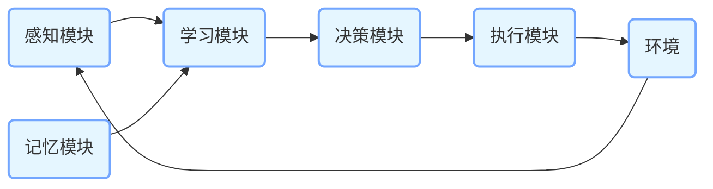

# AI Agent的终身学习系统实现

> 关键词：AI Agent、终身学习系统、机器学习、持续学习、算法原理、项目实战

> 摘要：本文深入探讨了AI Agent的终身学习系统的实现。首先介绍了该领域的背景信息，包括目的、预期读者、文档结构和相关术语。接着阐述了核心概念及其联系，通过文本示意图和Mermaid流程图进行直观展示。详细讲解了核心算法原理，并使用Python源代码进行说明。给出了相关的数学模型和公式，并举例解释。通过项目实战展示了开发环境搭建、源代码实现与解读。分析了实际应用场景，推荐了学习资源、开发工具框架和相关论文著作。最后总结了未来发展趋势与挑战，还提供了常见问题解答和扩展阅读参考资料，旨在为读者全面深入地了解和实现AI Agent的终身学习系统提供指导。

## 1. 背景介绍 
### 1.1 目的和范围
在当今快速发展的人工智能领域，AI Agent需要具备不断适应新环境、学习新知识的能力，终身学习系统的实现就显得尤为重要。本文的目的是详细阐述AI Agent终身学习系统的实现方法，从理论原理到实际项目应用，为开发者和研究人员提供全面的技术指导。范围涵盖了核心概念的解释、算法原理的分析、数学模型的构建、项目实战的演示以及实际应用场景的探讨等多个方面。

### 1.2 预期读者
本文预期读者包括人工智能领域的开发者、研究人员、高校相关专业的学生以及对AI Agent终身学习系统感兴趣的技术爱好者。开发者可以从中获取具体的实现思路和代码示例，研究人员可以得到理论和方法上的启发，学生可以作为学习参考资料，技术爱好者可以了解该领域的前沿知识。

### 1.3 文档结构概述
本文首先介绍背景信息，让读者对AI Agent终身学习系统有初步的了解。接着讲解核心概念与联系，通过示意图和流程图帮助读者建立直观的认识。然后详细分析核心算法原理，用Python代码进行具体说明。给出数学模型和公式，并举例加深理解。通过项目实战展示系统的具体实现过程。探讨实际应用场景，为读者提供应用方向。推荐相关的学习资源、开发工具框架和论文著作。最后总结未来发展趋势与挑战，提供常见问题解答和扩展阅读参考资料。

### 1.4 术语表
#### 1.4.1 核心术语定义
- **AI Agent**：人工智能代理，是一种能够感知环境、根据感知信息做出决策并执行相应动作的实体。它可以是软件程序、机器人等。
- **终身学习系统**：使AI Agent能够在其生命周期内持续学习新知识、适应新环境，避免灾难性遗忘的学习系统。
- **灾难性遗忘**：指在机器学习中，当模型学习新任务时，会忘记之前学习的任务相关知识的现象。

#### 1.4.2 相关概念解释
- **持续学习**：与终身学习类似，强调模型在不断获取新数据的过程中持续更新和改进，以适应环境的变化。
- **元学习**：学习如何学习的方法，通过在多个任务上进行训练，使模型能够快速适应新的任务。

#### 1.4.3 缩略词列表
- **ML**：Machine Learning，机器学习
- **DL**：Deep Learning，深度学习
- **RL**：Reinforcement Learning，强化学习

## 2. 核心概念与联系 

### 核心概念原理
AI Agent的终身学习系统主要基于几个核心概念。首先是持续学习，AI Agent需要不断地从新的数据中学习，更新自己的知识和技能。为了避免灾难性遗忘，需要采用一些特殊的技术，如弹性权重巩固（EWC）、记忆回放等。元学习也是一个重要的概念，它可以帮助AI Agent快速适应新的任务，通过学习任务之间的共性，在面对新任务时能够更高效地学习。

### 架构的文本示意图
AI Agent的终身学习系统架构可以分为几个主要部分。感知模块负责收集环境信息，将其转换为AI Agent可以处理的数据。学习模块是核心部分，它包含了各种学习算法，如深度学习、强化学习等，用于从数据中提取知识。决策模块根据学习到的知识和当前的感知信息做出决策。执行模块将决策转化为实际的动作。此外，还有一个记忆模块，用于存储之前学习到的知识和经验，以防止灾难性遗忘。

### Mermaid流程图

这个流程图展示了AI Agent终身学习系统的基本工作流程。感知模块从环境中获取信息，传递给学习模块进行学习。学习模块结合记忆模块中的知识进行更新。决策模块根据学习结果做出决策，执行模块将决策付诸实践。执行的结果又会影响环境，形成一个闭环。

## 3. 核心算法原理 & 具体操作步骤 

### 弹性权重巩固（EWC）算法原理
弹性权重巩固（EWC）是一种用于缓解灾难性遗忘的算法。其核心思想是在学习新任务时，对模型中那些对旧任务比较重要的参数进行约束，使其在学习新任务时不会发生太大的变化。

#### 数学原理
设 $\theta$ 是模型的参数，$L(\theta, D)$ 是在数据集 $D$ 上的损失函数。EWC算法通过在损失函数中添加一个正则化项来约束参数的变化：
$$\mathcal{L}_{EWC}(\theta)=\mathcal{L}(\theta, D_{new})+\lambda\sum_{i}\frac{F_{i}}{2}(\theta_{i}-\theta_{A}^{i})^{2}$$
其中，$\mathcal{L}(\theta, D_{new})$ 是在新数据集 $D_{new}$ 上的损失函数，$\lambda$ 是一个超参数，用于控制正则化项的权重，$F_{i}$ 是Fisher信息矩阵的第 $i$ 个对角元素，$\theta_{A}^{i}$ 是在学习完旧任务后第 $i$ 个参数的值。

#### Python代码实现
```python
import torch
import torch.nn as nn
import torch.optim as optim

# 定义一个简单的神经网络模型
class SimpleNet(nn.Module):
    def __init__(self):
        super(SimpleNet, self).__init__()
        self.fc1 = nn.Linear(10, 20)
        self.fc2 = nn.Linear(20, 1)

    def forward(self, x):
        x = torch.relu(self.fc1(x))
        x = self.fc2(x)
        return x

# 计算Fisher信息矩阵
def compute_fisher(model, dataset):
    fisher = {}
    for n, p in model.named_parameters():
        fisher[n] = torch.zeros_like(p.data)
    model.train()
    criterion = nn.MSELoss()
    optimizer = optim.SGD(model.parameters(), lr=0.01)
    for inputs, targets in dataset:
        optimizer.zero_grad()
        outputs = model(inputs)
        loss = criterion(outputs, targets)
        loss.backward()
        for n, p in model.named_parameters():
            if p.grad is not None:
                fisher[n] += p.grad.data ** 2
    for n in fisher.keys():
        fisher[n] /= len(dataset)
    return fisher

# EWC训练函数
def ewc_train(model, new_dataset, old_params, fisher, lambda_ewc=1000):
    criterion = nn.MSELoss()
    optimizer = optim.SGD(model.parameters(), lr=0.01)
    for inputs, targets in new_dataset:
        optimizer.zero_grad()
        outputs = model(inputs)
        loss = criterion(outputs, targets)
        # 添加EWC正则化项
        for n, p in model.named_parameters():
            if n in old_params:
                loss += 0.5 * lambda_ewc * (fisher[n] * (p - old_params[n]) ** 2).sum()
        loss.backward()
        optimizer.step()
    return model

# 示例使用
model = SimpleNet()
# 模拟旧数据集
old_dataset = [(torch.randn(10), torch.randn(1)) for _ in range(100)]
# 计算Fisher信息矩阵
fisher = compute_fisher(model, old_dataset)
old_params = {n: p.clone() for n, p in model.named_parameters()}
# 模拟新数据集
new_dataset = [(torch.randn(10), torch.randn(1)) for _ in range(100)]
# 使用EWC训练模型
model = ewc_train(model, new_dataset, old_params, fisher)
```
### 具体操作步骤
1. **模型定义**：首先定义一个神经网络模型，如上述代码中的 `SimpleNet`。
2. **计算Fisher信息矩阵**：使用旧数据集计算Fisher信息矩阵，这一步可以确定哪些参数对旧任务比较重要。
3. **保存旧参数**：记录学习完旧任务后的模型参数。
4. **训练新任务**：在新数据集上训练模型，同时在损失函数中添加EWC正则化项，约束参数的变化。

## 4. 数学模型和公式 & 详细讲解 & 举例说明 

### 强化学习中的终身学习模型
在强化学习中，AI Agent通过与环境进行交互来学习最优策略。终身学习在强化学习中的目标是让Agent能够在不断变化的环境中持续学习。

#### 马尔可夫决策过程（MDP）
马尔可夫决策过程是强化学习的基础模型，它可以用一个五元组 $(S, A, P, R, \gamma)$ 表示：
- $S$ 是状态空间，表示环境的所有可能状态。
- $A$ 是动作空间，表示Agent可以采取的所有动作。
- $P(s'|s, a)$ 是状态转移概率，表示在状态 $s$ 采取动作 $a$ 后转移到状态 $s'$ 的概率。
- $R(s, a, s')$ 是奖励函数，表示在状态 $s$ 采取动作 $a$ 转移到状态 $s'$ 时获得的奖励。
- $\gamma \in [0, 1]$ 是折扣因子，用于衡量未来奖励的重要性。

#### 价值函数
价值函数用于评估在某个状态下采取某个动作或遵循某个策略的好坏。常用的价值函数有状态价值函数 $V^{\pi}(s)$ 和动作价值函数 $Q^{\pi}(s, a)$。

状态价值函数 $V^{\pi}(s)$ 表示在策略 $\pi$ 下，从状态 $s$ 开始的期望累积折扣奖励：
$$V^{\pi}(s)=\mathbb{E}_{\pi}\left[\sum_{t=0}^{\infty}\gamma^{t}R_{t+1}|S_{0}=s\right]$$

动作价值函数 $Q^{\pi}(s, a)$ 表示在策略 $\pi$ 下，在状态 $s$ 采取动作 $a$ 后，从下一个状态开始的期望累积折扣奖励：
$$Q^{\pi}(s, a)=\mathbb{E}_{\pi}\left[\sum_{t=0}^{\infty}\gamma^{t}R_{t+1}|S_{0}=s, A_{0}=a\right]$$

#### 贝尔曼方程
贝尔曼方程描述了价值函数之间的递归关系。对于状态价值函数，贝尔曼方程为：
$$V^{\pi}(s)=\sum_{a\in A}\pi(a|s)\sum_{s'\in S}P(s'|s, a)[R(s, a, s')+\gamma V^{\pi}(s')]$$

对于动作价值函数，贝尔曼方程为：
$$Q^{\pi}(s, a)=\sum_{s'\in S}P(s'|s, a)[R(s, a, s')+\gamma\sum_{a'\in A}\pi(a'|s')Q^{\pi}(s', a')]$$

### 举例说明
假设一个机器人在一个二维网格环境中移动，每个网格可以是空地、障碍物或目标点。机器人的状态可以用其在网格中的坐标表示，动作可以是上下左右移动。奖励函数可以设置为：到达目标点获得正奖励，撞到障碍物获得负奖励，每移动一步获得一个小的负奖励以鼓励尽快到达目标。

设折扣因子 $\gamma = 0.9$，当前状态 $s$ 是机器人位于 $(2, 3)$ 位置，采取动作 $a$ 是向右移动。如果移动后到达状态 $s'=(2, 4)$ 是目标点，奖励 $R(s, a, s') = 10$。根据贝尔曼方程，我们可以计算动作价值函数 $Q^{\pi}(s, a)$。假设在状态 $s'$ 下，机器人采取最优策略，其状态价值函数 $V^{\pi}(s') = 0$（因为已经到达目标），则：
$$Q^{\pi}(s, a)=P(s'|s, a)[R(s, a, s')+\gamma V^{\pi}(s')]$$
如果移动成功的概率 $P(s'|s, a) = 1$，则：
$$Q^{\pi}(s, a)=1\times(10 + 0.9\times0)=10$$

## 5. 项目实战：代码实际案例和详细解释说明 

### 5.1  开发环境搭建
#### 系统环境
本文使用的是Ubuntu 20.04操作系统，你也可以使用其他操作系统如Windows或macOS。

#### Python环境
安装Python 3.8或以上版本。可以使用以下命令检查Python版本：
```bash
python3 --version
```
如果没有安装Python，可以使用以下命令安装：
```bash
sudo apt update
sudo apt install python3 python3-pip
```

#### 安装必要的库
使用 `pip` 安装以下必要的库：
```bash
pip install torch numpy matplotlib
```
- `torch`：用于深度学习模型的构建和训练。
- `numpy`：用于数值计算。
- `matplotlib`：用于数据可视化。

### 5.2  源代码详细实现和代码解读
#### 项目概述
我们将实现一个简单的AI Agent终身学习系统，让Agent在一个简单的环境中持续学习。环境是一个一维网格，Agent可以在网格中左右移动，目标是到达网格的另一端。

#### 代码实现
```python
import torch
import torch.nn as nn
import torch.optim as optim
import numpy as np
import matplotlib.pyplot as plt

# 定义环境
class OneDGridEnv:
    def __init__(self, grid_size=10):
        self.grid_size = grid_size
        self.reset()

    def reset(self):
        self.agent_pos = 0
        return self.agent_pos

    def step(self, action):
        if action == 0:  # 向左移动
            if self.agent_pos > 0:
                self.agent_pos -= 1
        elif action == 1:  # 向右移动
            if self.agent_pos < self.grid_size - 1:
                self.agent_pos += 1
        done = self.agent_pos == self.grid_size - 1
        reward = 1 if done else -0.1
        return self.agent_pos, reward, done

# 定义神经网络模型
class QNetwork(nn.Module):
    def __init__(self, input_size, output_size):
        super(QNetwork, self).__init__()
        self.fc1 = nn.Linear(input_size, 128)
        self.fc2 = nn.Linear(128, output_size)

    def forward(self, x):
        x = torch.relu(self.fc1(x))
        x = self.fc2(x)
        return x

# 定义Agent
class Agent:
    def __init__(self, input_size, output_size, learning_rate=0.001, gamma=0.9):
        self.q_network = QNetwork(input_size, output_size)
        self.optimizer = optim.Adam(self.q_network.parameters(), lr=learning_rate)
        self.gamma = gamma

    def get_action(self, state, epsilon=0.1):
        if np.random.rand() < epsilon:
            return np.random.randint(0, 2)
        state = torch.FloatTensor([state]).unsqueeze(0)
        q_values = self.q_network(state)
        action = torch.argmax(q_values).item()
        return action

    def train(self, state, action, reward, next_state, done):
        state = torch.FloatTensor([state]).unsqueeze(0)
        next_state = torch.FloatTensor([next_state]).unsqueeze(0)
        q_values = self.q_network(state)
        next_q_values = self.q_network(next_state)
        target_q_values = q_values.clone()
        if done:
            target_q_values[0][action] = reward
        else:
            target_q_values[0][action] = reward + self.gamma * torch.max(next_q_values).item()
        loss = nn.MSELoss()(q_values, target_q_values)
        self.optimizer.zero_grad()
        loss.backward()
        self.optimizer.step()

# 训练过程
env = OneDGridEnv()
agent = Agent(input_size=1, output_size=2)
num_episodes = 1000
rewards = []
for episode in range(num_episodes):
    state = env.reset()
    total_reward = 0
    done = False
    while not done:
        action = agent.get_action(state)
        next_state, reward, done = env.step(action)
        agent.train(state, action, reward, next_state, done)
        state = next_state
        total_reward += reward
    rewards.append(total_reward)
    if episode % 100 == 0:
        print(f"Episode {episode}: Total Reward = {total_reward}")

# 可视化训练结果
plt.plot(rewards)
plt.xlabel('Episode')
plt.ylabel('Total Reward')
plt.title('Training Results')
plt.show()
```
#### 代码解读
1. **环境定义**：`OneDGridEnv` 类定义了一维网格环境，包含 `reset` 方法用于重置环境状态，`step` 方法用于执行动作并返回下一个状态、奖励和是否完成的信息。
2. **神经网络模型**：`QNetwork` 类定义了一个简单的两层神经网络，用于估计动作价值函数。
3. **Agent定义**：`Agent` 类包含了神经网络模型和优化器，`get_action` 方法用于根据当前状态选择动作，`train` 方法用于训练神经网络。
4. **训练过程**：在训练过程中，Agent与环境进行交互，不断更新神经网络的参数，以提高性能。
5. **可视化**：使用 `matplotlib` 库将训练过程中的总奖励进行可视化，方便观察训练效果。

### 5.3  代码解读与分析
#### 算法分析
该项目使用了Q学习算法，这是一种基于值函数的强化学习算法。Q学习的目标是学习一个最优的动作价值函数 $Q(s, a)$，使得Agent在每个状态下都能选择最优的动作。

#### 性能分析
通过观察训练过程中的总奖励曲线，可以判断Agent的学习效果。如果总奖励逐渐增加，说明Agent在不断学习和改进。如果总奖励波动较大，可能需要调整超参数，如学习率、折扣因子等。

## 6. 实际应用场景 
### 机器人导航
在机器人导航领域，AI Agent的终身学习系统可以让机器人在不同的环境中持续学习。例如，在一个仓库中，机器人需要不断适应新的货物布局和障碍物分布。通过终身学习，机器人可以在长期运行过程中不断优化自己的导航策略，提高工作效率。

### 智能客服
智能客服系统需要不断学习新的用户问题和回答方式。随着业务的发展和用户需求的变化，客服系统需要能够及时更新自己的知识。AI Agent的终身学习系统可以让智能客服持续学习新的问答对，提高回答的准确性和效率。

### 金融投资
在金融投资领域，市场环境不断变化，投资策略也需要不断调整。AI Agent可以通过终身学习系统，不断分析新的市场数据，学习新的投资模式，为投资者提供更准确的投资建议。

### 医疗诊断
医疗领域的数据不断更新，新的疾病和治疗方法不断出现。AI Agent的终身学习系统可以让医疗诊断系统持续学习新的病例和诊断方法，提高诊断的准确性和效率。

## 7. 工具和资源推荐
### 7.1 学习资源推荐
#### 7.1.1 书籍推荐
- 《深度学习》（Deep Learning）：由Ian Goodfellow、Yoshua Bengio和Aaron Courville撰写，是深度学习领域的经典教材，涵盖了深度学习的基本原理、算法和应用。
- 《强化学习：原理与Python实现》：详细介绍了强化学习的基本概念、算法和实现方法，适合初学者入门。
- 《终身机器学习》（Lifelong Machine Learning）：专门探讨了终身学习的理论和方法，对于深入研究AI Agent的终身学习系统有很大帮助。

#### 7.1.2 在线课程
- Coursera上的“深度学习专项课程”（Deep Learning Specialization）：由Andrew Ng教授授课，包括深度学习基础、卷积神经网络、循环神经网络等内容。
- edX上的“强化学习基础”（Fundamentals of Reinforcement Learning）：介绍了强化学习的基本概念和算法。
- Udemy上的“终身学习系统实战”（Lifelong Learning Systems in Practice）：结合实际项目，讲解AI Agent终身学习系统的实现方法。

#### 7.1.3 技术博客和网站
- Medium上的AI相关博客：有很多关于人工智能、机器学习和深度学习的文章，涵盖了最新的研究成果和技术应用。
- arXiv.org：提供了大量的学术论文，包括终身学习、强化学习等领域的最新研究。
- OpenAI博客：OpenAI发布的关于人工智能研究和应用的博客文章，具有很高的参考价值。

### 7.2 开发工具框架推荐
#### 7.2.1 IDE和编辑器
- PyCharm：一款功能强大的Python集成开发环境，提供了代码编辑、调试、版本控制等功能，适合开发Python项目。
- Jupyter Notebook：交互式的开发环境，方便进行代码编写、实验和文档记录，常用于数据科学和机器学习项目。
- Visual Studio Code：轻量级的代码编辑器，支持多种编程语言，具有丰富的插件扩展功能。

#### 7.2.2 调试和性能分析工具
- TensorBoard：用于可视化深度学习模型的训练过程和性能指标，方便调试和优化模型。
- PyTorch Profiler：可以对PyTorch模型的性能进行分析，找出性能瓶颈，提高模型的运行效率。
- cProfile：Python自带的性能分析工具，可以分析Python代码的运行时间和函数调用情况。

#### 7.2.3 相关框架和库
- PyTorch：一个开源的深度学习框架，提供了丰富的神经网络层和优化算法，方便进行模型的构建和训练。
- TensorFlow：另一个广泛使用的深度学习框架，具有强大的分布式训练和部署能力。
- Stable Baselines3：一个基于PyTorch的强化学习库，提供了多种强化学习算法的实现，方便进行强化学习实验。

### 7.3 相关论文著作推荐
#### 7.3.1 经典论文
- "Overcoming catastrophic forgetting in neural networks"：提出了弹性权重巩固（EWC）算法，用于缓解神经网络的灾难性遗忘问题。
- "Playing Atari with Deep Reinforcement Learning"：首次将深度学习与强化学习相结合，用于玩Atari游戏，开创了深度强化学习的先河。
- "Lifelong Machine Learning"：对终身机器学习的概念和方法进行了系统的阐述。

#### 7.3.2 最新研究成果
- 关注NeurIPS、ICML、CVPR等顶级学术会议上关于终身学习、强化学习的最新论文，了解该领域的最新研究动态。
- 在arXiv.org上搜索相关关键词，获取最新的预印本论文。

#### 7.3.3 应用案例分析
- 一些知名科技公司的技术博客会分享他们在实际项目中应用AI Agent终身学习系统的案例，如Google、Facebook、Microsoft等。
- 行业报告和白皮书也会介绍一些实际应用案例和经验分享。

## 8. 总结：未来发展趋势与挑战
### 未来发展趋势
- **多模态学习**：未来的AI Agent终身学习系统将不仅仅局限于单一的数据类型，而是会结合图像、语音、文本等多种模态的数据进行学习，以更全面地理解环境和任务。
- **与人类协作**：AI Agent将更多地与人类进行协作，通过与人类的交互不断学习和改进。例如，在医疗领域，AI Agent可以与医生协作，辅助诊断和治疗。
- **自主学习和探索**：AI Agent将具备更强的自主学习和探索能力，能够主动发现新的任务和知识，而不仅仅是被动地接受数据。

### 挑战
- **数据隐私和安全**：在终身学习过程中，AI Agent需要不断获取新的数据，这可能涉及到用户的隐私和数据安全问题。如何在保护数据隐私和安全的前提下进行有效的学习是一个重要的挑战。
- **计算资源需求**：终身学习系统需要不断更新模型参数，对计算资源的需求较大。如何在有限的计算资源下实现高效的学习是一个亟待解决的问题。
- **灾难性遗忘问题**：尽管已经有一些方法可以缓解灾难性遗忘，但目前还没有完全解决这个问题。未来需要进一步研究和开发更有效的方法来避免灾难性遗忘。

## 9. 附录：常见问题与解答
### 什么是灾难性遗忘？
灾难性遗忘是指在机器学习中，当模型学习新任务时，会忘记之前学习的任务相关知识的现象。例如，一个神经网络在学习了手写数字识别任务后，再学习图像分类任务时，可能会忘记之前学习的手写数字识别的知识。

### 如何缓解灾难性遗忘？
可以使用一些方法来缓解灾难性遗忘，如弹性权重巩固（EWC）、记忆回放等。EWC通过在损失函数中添加正则化项来约束模型参数的变化，记忆回放则是通过重新训练之前的数据集来巩固之前学习的知识。

### AI Agent终身学习系统需要哪些计算资源？
AI Agent终身学习系统的计算资源需求取决于模型的复杂度和数据量。一般来说，需要使用GPU进行加速训练，同时需要足够的内存来存储模型参数和数据。

### 如何评估AI Agent终身学习系统的性能？
可以使用一些指标来评估AI Agent终身学习系统的性能，如任务准确率、学习效率、遗忘率等。任务准确率表示Agent在完成任务时的正确程度，学习效率表示Agent学习新知识的速度，遗忘率表示Agent忘记之前学习知识的程度。

## 10. 扩展阅读 & 参考资料
- Goodfellow, I., Bengio, Y., & Courville, A. (2016). Deep Learning. MIT Press.
- Sutton, R. S., & Barto, A. G. (2018). Reinforcement Learning: An Introduction. MIT Press.
- Kirkpatrick, J., Pascanu, R., Rabinowitz, N., Veness, J., Desjardins, G., Rusu, A. A.,... & Hassabis, D. (2017). Overcoming catastrophic forgetting in neural networks. Proceedings of the national academy of sciences, 114(13), 3521-3526.
- Mnih, V., Kavukcuoglu, K., Silver, D., Graves, A., Antonoglou, I., Wierstra, D., & Riedmiller, M. (2013). Playing atari with deep reinforcement learning. arXiv preprint arXiv:1312.5602.

作者：AI天才研究院/AI Genius Institute & 禅与计算机程序设计艺术 /Zen And The Art of Computer Programming