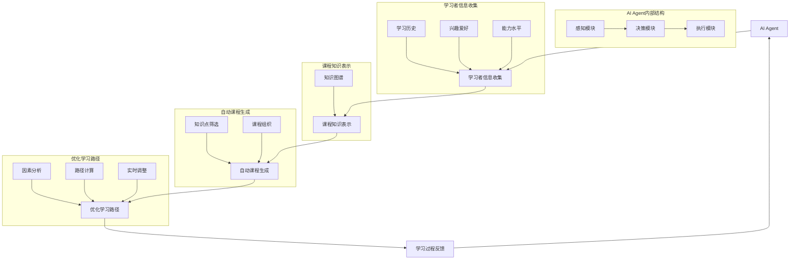

# AI Agent的自动课程生成：优化学习路径

> 关键词：AI Agent、自动课程生成、优化学习路径、教育技术、个性化学习

> 摘要：本文聚焦于AI Agent在自动课程生成以及优化学习路径方面的应用。首先介绍了相关背景知识，包括目的范围、预期读者等。接着阐述了核心概念及其联系，给出了原理和架构的文本示意图与Mermaid流程图。详细讲解了核心算法原理并通过Python代码说明具体操作步骤，同时引入数学模型和公式进行深入分析。通过项目实战展示代码实际案例并解读。探讨了实际应用场景，推荐了相关工具和资源。最后总结了未来发展趋势与挑战，解答常见问题并提供扩展阅读和参考资料，旨在为读者全面深入地呈现AI Agent在教育领域自动课程生成与学习路径优化的技术原理和应用。

## 1. 背景介绍 
### 1.1 目的和范围
在当今信息爆炸的时代，教育领域面临着如何高效、个性化地为学习者提供优质课程的挑战。传统的课程设置往往是统一化的，难以满足每个学习者的独特需求和学习进度。AI Agent的自动课程生成旨在利用人工智能技术，根据学习者的特点、目标和学习情况，自动生成适合他们的课程内容，并优化学习路径，提高学习效果和效率。

本文章的范围涵盖了AI Agent自动课程生成的核心概念、算法原理、数学模型、实际应用案例，以及相关的工具和资源推荐。我们将深入探讨如何利用AI Agent实现课程的个性化生成和学习路径的优化，为教育工作者、技术开发者和学习者提供全面的技术指导和实践参考。

### 1.2 预期读者
本文预期读者包括但不限于以下几类人群：
- **教育工作者**：希望了解如何利用AI技术改进课程设计和教学方法，提高教学质量和学生的学习效果。
- **技术开发者**：对人工智能在教育领域的应用感兴趣，希望学习和掌握AI Agent自动课程生成的相关技术和算法。
- **学习者**：关注个性化学习体验，想了解如何借助AI Agent获得更适合自己的学习课程和路径。
- **教育研究者**：致力于研究教育技术的发展趋势和应用效果，为教育改革提供理论和实践支持。

### 1.3 文档结构概述
本文将按照以下结构进行详细阐述：
1. **背景介绍**：介绍文章的目的、范围、预期读者和文档结构，以及相关术语的定义和解释。
2. **核心概念与联系**：解释AI Agent、自动课程生成和优化学习路径的核心概念，给出原理和架构的文本示意图和Mermaid流程图。
3. **核心算法原理 & 具体操作步骤**：详细讲解实现自动课程生成和学习路径优化的核心算法原理，并通过Python代码说明具体操作步骤。
4. **数学模型和公式 & 详细讲解 & 举例说明**：引入数学模型和公式，对算法原理进行深入分析，并通过具体例子进行说明。
5. **项目实战：代码实际案例和详细解释说明**：通过实际项目案例，展示AI Agent自动课程生成和学习路径优化的代码实现和详细解读。
6. **实际应用场景**：探讨AI Agent自动课程生成和学习路径优化在不同教育场景中的实际应用。
7. **工具和资源推荐**：推荐相关的学习资源、开发工具框架和论文著作，帮助读者进一步深入学习和研究。
8. **总结：未来发展趋势与挑战**：总结AI Agent自动课程生成和学习路径优化的发展趋势，分析面临的挑战和问题。
9. **附录：常见问题与解答**：解答读者在学习和实践过程中可能遇到的常见问题。
10. **扩展阅读 & 参考资料**：提供相关的扩展阅读材料和参考资料，方便读者进一步深入研究。

### 1.4 术语表
#### 1.4.1 核心术语定义
- **AI Agent（人工智能代理）**：是一种能够感知环境、自主决策并采取行动以实现特定目标的人工智能实体。在自动课程生成中，AI Agent可以根据学习者的信息和环境数据，自动生成课程内容和学习路径。
- **自动课程生成**：指利用人工智能技术，根据学习者的特点、目标和学习情况，自动创建适合他们的课程内容和结构。
- **优化学习路径**：通过分析学习者的学习数据和能力水平，为他们规划出最有效的学习路径，以提高学习效果和效率。
- **个性化学习**：根据每个学习者的独特需求、兴趣、学习风格和能力水平，提供定制化的学习内容和学习方式。

#### 1.4.2 相关概念解释
- **机器学习**：是一门多领域交叉学科，涉及概率论、统计学、逼近论、凸分析、算法复杂度理论等多门学科。它专门研究计算机怎样模拟或实现人类的学习行为，以获取新的知识或技能，重新组织已有的知识结构使之不断改善自身的性能。在自动课程生成中，机器学习算法可以用于分析学习者的数据，预测学习需求和效果。
- **深度学习**：是机器学习的一个分支领域，它是一种基于对数据进行表征学习的方法。深度学习通过构建具有很多层的神经网络模型，自动从大量数据中学习特征和模式。在自动课程生成中，深度学习可以用于处理文本、图像、视频等多模态数据，生成更加丰富和个性化的课程内容。
- **知识图谱**：是一种语义网络，它以实体和关系为节点，构建了一个大规模的知识网络。在自动课程生成中，知识图谱可以用于表示课程知识的结构和关系，帮助AI Agent更好地理解和组织课程内容。

#### 1.4.3 缩略词列表
- **AI（Artificial Intelligence）**：人工智能
- **ML（Machine Learning）**：机器学习
- **DL（Deep Learning）**：深度学习
- **KG（Knowledge Graph）**：知识图谱

## 2. 核心概念与联系 

### 核心概念原理
#### AI Agent
AI Agent是实现自动课程生成和优化学习路径的核心。它可以看作是一个智能的决策者，通过感知学习者的各种信息，如学习历史、兴趣爱好、能力水平等，结合预设的课程目标和知识体系，做出决策来生成合适的课程内容和学习路径。AI Agent通常由感知模块、决策模块和执行模块组成。感知模块负责收集学习者的信息，决策模块根据这些信息进行分析和推理，生成课程和路径规划，执行模块则将决策结果转化为实际的课程内容和学习任务。

#### 自动课程生成
自动课程生成的原理是基于对学习者特征和课程知识的理解。首先，需要对课程知识进行结构化表示，例如使用知识图谱将知识点及其关系进行清晰的展示。然后，根据学习者的信息，如学习目标、已有知识水平、学习风格等，从知识图谱中筛选出合适的知识点，并按照一定的逻辑顺序组织成课程内容。在这个过程中，可能会使用到机器学习算法来预测学习者对不同知识点的掌握难度和学习效果，从而优化课程的生成。

#### 优化学习路径
优化学习路径的核心在于为学习者找到一条最有效的学习路线。这需要考虑多个因素，如学习者的当前知识水平、学习目标、时间限制、学习资源的可用性等。通过分析这些因素，可以使用算法（如最短路径算法、遗传算法等）来计算出最优的学习路径。在学习过程中，还可以根据学习者的实时反馈不断调整学习路径，以适应学习者的动态变化。

### 架构的文本示意图
```plaintext
+-------------------+
|   AI Agent        |
| +---------------+ |
| |  感知模块     | |
| +---------------+ |
| |  决策模块     | |
| +---------------+ |
| |  执行模块     | |
| +---------------+ |
+-------------------+
       |
       v
+-------------------+
| 学习者信息收集   |
| +---------------+ |
| | 学习历史      | |
| | 兴趣爱好      | |
| | 能力水平      | |
| +---------------+ |
+-------------------+
       |
       v
+-------------------+
| 课程知识表示     |
| +---------------+ |
| | 知识图谱      | |
| +---------------+ |
+-------------------+
       |
       v
+-------------------+
| 自动课程生成     |
| +---------------+ |
| | 知识点筛选    | |
| | 课程组织      | |
| +---------------+ |
+-------------------+
       |
       v
+-------------------+
| 优化学习路径     |
| +---------------+ |
| | 因素分析      | |
| | 路径计算      | |
| | 实时调整      | |
| +---------------+ |
+-------------------+
```

### Mermaid流程图


## 3. 核心算法原理 & 具体操作步骤 

### 核心算法原理
#### 基于规则的课程生成算法
基于规则的课程生成算法是一种较为简单直接的方法。它通过预先定义一系列的规则来生成课程内容。例如，可以根据学习者的学习目标和已有知识水平，制定规则来选择合适的知识点。规则可以是“如果学习者的目标是掌握编程语言Python，且已有基础的编程知识，那么选择Python高级编程的知识点”。这种算法的优点是简单易懂，易于实现，但缺点是灵活性较差，难以适应复杂多变的学习情况。

#### 基于机器学习的课程生成算法
基于机器学习的课程生成算法则更加灵活和智能。常见的方法是使用监督学习算法，如决策树、神经网络等。首先，需要收集大量的学习者数据和对应的课程生成结果作为训练数据。然后，使用这些数据训练机器学习模型，模型可以学习到学习者特征和课程内容之间的映射关系。在实际应用中，将新的学习者信息输入到训练好的模型中，模型就可以输出适合该学习者的课程内容。

#### 学习路径优化算法
学习路径优化算法通常使用图论中的最短路径算法或启发式搜索算法。将课程中的知识点看作图中的节点，知识点之间的学习顺序和难度关系看作边，那么学习路径就可以看作是图中的一条路径。通过计算从起始知识点到目标知识点的最短路径或最优路径，可以得到优化的学习路径。常见的算法有Dijkstra算法、A*算法等。

### 具体操作步骤（Python代码实现）
#### 基于规则的课程生成示例
```python
# 定义课程知识点
knowledge_points = {
    "Python基础": ["变量与数据类型", "控制语句", "函数"],
    "Python高级": ["面向对象编程", "模块与包", "异常处理"],
    "数据分析基础": ["数据清洗", "数据可视化"],
    "数据分析高级": ["机器学习算法", "深度学习基础"]
}

# 定义规则函数
def generate_course(learning_goal, prior_knowledge):
    if learning_goal == "Python编程" and "编程基础" in prior_knowledge:
        return knowledge_points["Python高级"]
    elif learning_goal == "Python编程" and "编程基础" not in prior_knowledge:
        return knowledge_points["Python基础"]
    elif learning_goal == "数据分析" and "Python编程" in prior_knowledge:
        return knowledge_points["数据分析高级"]
    elif learning_goal == "数据分析" and "Python编程" not in prior_knowledge:
        return knowledge_points["数据分析基础"]
    else:
        return []

# 示例调用
learning_goal = "Python编程"
prior_knowledge = ["编程基础"]
course = generate_course(learning_goal, prior_knowledge)
print("生成的课程内容：", course)
```

#### 基于机器学习的课程生成示例（简化版）
```python
import numpy as np
from sklearn.tree import DecisionTreeClassifier

# 模拟训练数据
# 学习者特征：[是否有编程基础, 是否有数据分析基础, 学习目标（0: Python编程, 1: 数据分析）]
X_train = np.array([
    [1, 0, 0],
    [0, 0, 0],
    [1, 1, 1],
    [1, 0, 1]
])
# 对应的课程标签：[Python基础, Python高级, 数据分析高级, 数据分析基础]
y_train = np.array([0, 1, 3, 2])

# 训练决策树模型
model = DecisionTreeClassifier()
model.fit(X_train, y_train)

# 新的学习者信息
new_learner = np.array([[1, 0, 0]])
# 预测课程
predicted_course = model.predict(new_learner)
course_labels = ["Python基础", "Python高级", "数据分析基础", "数据分析高级"]
print("预测的课程：", course_labels[predicted_course[0]])
```

#### 学习路径优化示例（Dijkstra算法）
```python
import heapq

# 定义知识点图
graph = {
    "Python基础": {"Python高级": 2, "数据分析基础": 3},
    "Python高级": {"数据分析高级": 4},
    "数据分析基础": {"数据分析高级": 3},
    "数据分析高级": {}
}

def dijkstra(graph, start, end):
    distances = {node: float('inf') for node in graph}
    distances[start] = 0
    priority_queue = [(0, start)]
    previous_nodes = {node: None for node in graph}

    while priority_queue:
        current_distance, current_node = heapq.heappop(priority_queue)

        if current_distance > distances[current_node]:
            continue

        for neighbor, weight in graph[current_node].items():
            distance = current_distance + weight

            if distance < distances[neighbor]:
                distances[neighbor] = distance
                previous_nodes[neighbor] = current_node
                heapq.heappush(priority_queue, (distance, neighbor))

    path = []
    current_node = end
    while current_node is not None:
        path.append(current_node)
        current_node = previous_nodes[current_node]
    path.reverse()

    return path

# 示例调用
start_node = "Python基础"
end_node = "数据分析高级"
optimal_path = dijkstra(graph, start_node, end_node)
print("优化的学习路径：", optimal_path)
```

## 4. 数学模型和公式 & 详细讲解 & 举例说明 

### 基于机器学习的课程生成数学模型
#### 线性回归模型
在线性回归模型中，我们假设课程生成结果 $y$ 与学习者特征 $x_1, x_2, \cdots, x_n$ 之间存在线性关系，可以表示为：
$$y = \theta_0 + \theta_1x_1 + \theta_2x_2 + \cdots + \theta_nx_n + \epsilon$$
其中，$\theta_0, \theta_1, \cdots, \theta_n$ 是模型的参数，$\epsilon$ 是误差项。我们的目标是通过最小化误差平方和来估计这些参数，即：
$$\min_{\theta_0, \theta_1, \cdots, \theta_n} \sum_{i=1}^{m} (y^{(i)} - (\theta_0 + \theta_1x_1^{(i)} + \theta_2x_2^{(i)} + \cdots + \theta_nx_n^{(i)}))^2$$
其中，$m$ 是训练数据的数量，$y^{(i)}$ 和 $x_j^{(i)}$ 分别是第 $i$ 个训练样本的课程生成结果和第 $j$ 个学习者特征。

#### 逻辑回归模型
当课程生成结果是分类问题时，例如判断生成的课程是“Python基础”还是“Python高级”，可以使用逻辑回归模型。逻辑回归模型通过逻辑函数将线性组合的结果映射到概率值，公式如下：
$$P(y = 1 | x) = \frac{1}{1 + e^{-(\theta_0 + \theta_1x_1 + \theta_2x_2 + \cdots + \theta_nx_n)}}$$
其中，$P(y = 1 | x)$ 表示在给定学习者特征 $x$ 的情况下，课程生成结果为类别 1 的概率。我们的目标是最大化似然函数：
$$\max_{\theta_0, \theta_1, \cdots, \theta_n} \prod_{i=1}^{m} P(y^{(i)} | x^{(i)})$$

### 学习路径优化的数学模型
#### 图论模型
在学习路径优化中，我们可以将课程知识点看作图 $G = (V, E)$ 中的节点 $V$ 和边 $E$。每条边 $(u, v) \in E$ 都有一个权重 $w(u, v)$，表示从知识点 $u$ 到知识点 $v$ 的学习难度或所需时间。我们的目标是找到从起始节点 $s$ 到目标节点 $t$ 的最短路径，即最小化路径上所有边的权重之和：
$$\min_{p = (v_0, v_1, \cdots, v_k)} \sum_{i = 0}^{k - 1} w(v_i, v_{i + 1})$$
其中，$p$ 是从 $s = v_0$ 到 $t = v_k$ 的路径。

### 举例说明
#### 线性回归示例
假设我们有以下训练数据：
| 学习时长（小时） $x_1$ | 学习成绩 $y$ |
| --- | --- |
| 10 | 60 |
| 20 | 70 |
| 30 | 80 |
| 40 | 90 |

我们使用线性回归模型 $y = \theta_0 + \theta_1x_1$ 来拟合这些数据。通过最小化误差平方和，我们可以得到 $\theta_0 = 50$，$\theta_1 = 1$。那么，当一个学习者的学习时长为 25 小时时，我们可以预测他的学习成绩为 $y = 50 + 1 \times 25 = 75$。

#### 逻辑回归示例
假设我们要判断一个学习者是否适合学习“Python高级”课程，根据他的编程基础和学习时间作为特征。我们有以下训练数据：
| 编程基础（0: 无，1: 有） $x_1$ | 学习时间（小时） $x_2$ | 是否适合学习“Python高级”（0: 否，1: 是） $y$ |
| --- | --- | --- |
| 0 | 10 | 0 |
| 1 | 20 | 1 |
| 0 | 30 | 0 |
| 1 | 40 | 1 |

使用逻辑回归模型进行训练，得到参数 $\theta_0 = -5$，$\theta_1 = 3$，$\theta_2 = 0.1$。当一个新的学习者有编程基础（$x_1 = 1$），学习时间为 25 小时（$x_2 = 25$）时，我们可以计算他适合学习“Python高级”课程的概率为：
$$P(y = 1 | x) = \frac{1}{1 + e^{-(-5 + 3 \times 1 + 0.1 \times 25)}} \approx 0.73$$
由于概率大于 0.5，我们可以预测该学习者适合学习“Python高级”课程。

#### 图论示例
在前面的学习路径优化示例中，我们有以下知识点图：
| 起始知识点 | 目标知识点 | 学习难度（权重） |
| --- | --- | --- |
| Python基础 | Python高级 | 2 |
| Python基础 | 数据分析基础 | 3 |
| Python高级 | 数据分析高级 | 4 |
| 数据分析基础 | 数据分析高级 | 3 |

使用Dijkstra算法，我们可以计算出从“Python基础”到“数据分析高级”的最短路径为“Python基础 -> 数据分析基础 -> 数据分析高级”，总权重为 $3 + 3 = 6$。

## 5. 项目实战：代码实际案例和详细解释说明 

### 5.1  开发环境搭建
#### 操作系统
本项目可以在常见的操作系统上进行开发，如Windows、Linux（Ubuntu、CentOS等）和macOS。

#### Python环境
建议使用Python 3.7及以上版本。可以从Python官方网站（https://www.python.org/downloads/）下载并安装Python。

#### 依赖库安装
本项目需要安装一些常用的Python库，如`numpy`、`scikit-learn`等。可以使用`pip`命令进行安装：
```sh
pip install numpy scikit-learn
```

### 5.2  源代码详细实现和代码解读
#### 完整项目代码
```python
import numpy as np
from sklearn.tree import DecisionTreeClassifier
import heapq

# 定义课程知识点
knowledge_points = {
    "Python基础": ["变量与数据类型", "控制语句", "函数"],
    "Python高级": ["面向对象编程", "模块与包", "异常处理"],
    "数据分析基础": ["数据清洗", "数据可视化"],
    "数据分析高级": ["机器学习算法", "深度学习基础"]
}

# 定义规则函数
def generate_course_by_rules(learning_goal, prior_knowledge):
    if learning_goal == "Python编程" and "编程基础" in prior_knowledge:
        return knowledge_points["Python高级"]
    elif learning_goal == "Python编程" and "编程基础" not in prior_knowledge:
        return knowledge_points["Python基础"]
    elif learning_goal == "数据分析" and "Python编程" in prior_knowledge:
        return knowledge_points["数据分析高级"]
    elif learning_goal == "数据分析" and "Python编程" not in prior_knowledge:
        return knowledge_points["数据分析基础"]
    else:
        return []

# 模拟训练数据
# 学习者特征：[是否有编程基础, 是否有数据分析基础, 学习目标（0: Python编程, 1: 数据分析）]
X_train = np.array([
    [1, 0, 0],
    [0, 0, 0],
    [1, 1, 1],
    [1, 0, 1]
])
# 对应的课程标签：[Python基础, Python高级, 数据分析高级, 数据分析基础]
y_train = np.array([0, 1, 3, 2])

# 训练决策树模型
model = DecisionTreeClassifier()
model.fit(X_train, y_train)

# 基于机器学习的课程生成函数
def generate_course_by_ml(learner_features):
    predicted_course = model.predict([learner_features])
    course_labels = ["Python基础", "Python高级", "数据分析基础", "数据分析高级"]
    return knowledge_points[course_labels[predicted_course[0]]]

# 定义知识点图
graph = {
    "Python基础": {"Python高级": 2, "数据分析基础": 3},
    "Python高级": {"数据分析高级": 4},
    "数据分析基础": {"数据分析高级": 3},
    "数据分析高级": {}
}

# Dijkstra算法实现
def dijkstra(graph, start, end):
    distances = {node: float('inf') for node in graph}
    distances[start] = 0
    priority_queue = [(0, start)]
    previous_nodes = {node: None for node in graph}

    while priority_queue:
        current_distance, current_node = heapq.heappop(priority_queue)

        if current_distance > distances[current_node]:
            continue

        for neighbor, weight in graph[current_node].items():
            distance = current_distance + weight

            if distance < distances[neighbor]:
                distances[neighbor] = distance
                previous_nodes[neighbor] = current_node
                heapq.heappush(priority_queue, (distance, neighbor))

    path = []
    current_node = end
    while current_node is not None:
        path.append(current_node)
        current_node = previous_nodes[current_node]
    path.reverse()

    return path

# 主函数
def main():
    # 基于规则的课程生成
    learning_goal = "Python编程"
    prior_knowledge = ["编程基础"]
    course_by_rules = generate_course_by_rules(learning_goal, prior_knowledge)
    print("基于规则生成的课程内容：", course_by_rules)

    # 基于机器学习的课程生成
    learner_features = [1, 0, 0]
    course_by_ml = generate_course_by_ml(learner_features)
    print("基于机器学习生成的课程内容：", course_by_ml)

    # 学习路径优化
    start_node = "Python基础"
    end_node = "数据分析高级"
    optimal_path = dijkstra(graph, start_node, end_node)
    print("优化的学习路径：", optimal_path)

if __name__ == "__main__":
    main()
```

#### 代码解读
1. **课程知识点定义**：`knowledge_points` 字典存储了不同课程的知识点，方便后续生成课程内容时使用。
2. **基于规则的课程生成函数**：`generate_course_by_rules` 函数根据学习者的学习目标和已有知识水平，使用预先定义的规则生成课程内容。
3. **机器学习模型训练**：使用 `DecisionTreeClassifier` 训练一个决策树模型，根据学习者的特征预测适合的课程标签。
4. **基于机器学习的课程生成函数**：`generate_course_by_ml` 函数使用训练好的模型对新的学习者特征进行预测，并返回对应的课程知识点。
5. **知识点图定义**：`graph` 字典表示知识点之间的关系和学习难度，用于学习路径优化。
6. **Dijkstra算法实现**：`dijkstra` 函数实现了Dijkstra算法，用于计算从起始知识点到目标知识点的最短路径。
7. **主函数**：`main` 函数调用上述函数，分别进行基于规则的课程生成、基于机器学习的课程生成和学习路径优化，并输出结果。

### 5.3  代码解读与分析
#### 优点
- **灵活性**：结合了基于规则和基于机器学习的课程生成方法，既可以利用简单的规则进行快速生成，又可以通过机器学习模型处理复杂的情况。
- **可扩展性**：代码结构清晰，各个功能模块独立，可以方便地进行扩展和修改。例如，可以添加更多的课程知识点和规则，或者使用更复杂的机器学习模型。
- **实用性**：学习路径优化使用了经典的Dijkstra算法，能够有效地找到最短路径，提高学习效率。

#### 缺点
- **数据局限性**：机器学习模型的性能依赖于训练数据的质量和数量。如果训练数据不足或不准确，可能会导致预测结果不准确。
- **规则的局限性**：基于规则的课程生成方法比较固定，难以适应复杂多变的学习情况。
- **模型复杂度**：对于大规模的课程知识和学习者数据，当前的算法和模型可能无法满足性能要求，需要进一步优化。

## 6. 实际应用场景 
### 在线教育平台
在线教育平台可以利用AI Agent自动课程生成和优化学习路径的技术，为每个学习者提供个性化的课程。例如，根据学习者的注册信息、学习历史和测试成绩，自动生成适合他们的课程内容和学习计划。学习者可以按照优化后的学习路径进行学习，提高学习效果和效率。同时，平台可以根据学习者的实时反馈不断调整课程和学习路径，实现动态优化。

### 企业培训
企业在进行员工培训时，也可以应用这项技术。不同的员工具有不同的技能水平和培训需求，AI Agent可以根据员工的岗位要求、工作经验和学习能力，自动生成个性化的培训课程。例如，对于新入职的员工，可以提供基础技能培训课程；对于有一定经验的员工，可以提供高级技能提升课程。通过优化学习路径，员工可以更快地掌握所需技能，提高工作效率和质量。

### 学校教育
在学校教育中，教师可以利用AI Agent辅助课程设计和教学。例如，根据学生的学习成绩、学习风格和兴趣爱好，为学生提供个性化的学习任务和辅导资料。教师还可以根据学生的学习进度和反馈，及时调整教学策略和课程内容。此外，AI Agent还可以帮助教师评估学生的学习效果，提供针对性的建议和指导。

### 自学平台
自学平台为学习者提供了丰富的学习资源，但学习者往往面临着如何选择合适的学习内容和规划学习路径的问题。AI Agent可以根据学习者的学习目标和已有知识水平，为他们筛选出适合的学习资源，并优化学习路径。学习者可以在自学平台上按照推荐的课程和路径进行学习，提高自学的效果和动力。

## 7. 工具和资源推荐
### 7.1 学习资源推荐
#### 7.1.1 书籍推荐
- 《人工智能：一种现代的方法》：这是一本经典的人工智能教材，全面介绍了人工智能的各个领域，包括机器学习、知识表示、推理等，对于理解AI Agent的原理和算法有很大帮助。
- 《Python机器学习》：详细介绍了Python在机器学习中的应用，包括各种机器学习算法的原理和实现，适合初学者学习和实践。
- 《教育数据挖掘》：专注于教育领域的数据挖掘技术，介绍了如何利用数据挖掘方法分析学习者数据，优化教学过程和课程设计。

#### 7.1.2 在线课程
- Coursera上的“人工智能基础”课程：由知名高校的教授授课，系统地介绍了人工智能的基本概念、算法和应用。
- edX上的“Python数据科学手册”课程：通过实际案例讲解Python在数据科学中的应用，包括数据处理、机器学习等方面。
- Udemy上的“个性化学习与教育技术”课程：专门探讨了如何利用技术实现个性化学习，包括自动课程生成和学习路径优化等内容。

#### 7.1.3 技术博客和网站
- Medium：上面有很多关于人工智能和教育技术的优质博客文章，涵盖了最新的研究成果和实践经验。
- arXiv：一个预印本服务器，提供了大量的学术论文，包括人工智能、机器学习和教育技术等领域的最新研究。
- Towards Data Science：专注于数据科学和机器学习领域，有很多实用的教程和案例分析。

### 7.2 开发工具框架推荐
#### 7.2.1 IDE和编辑器
- PyCharm：一款专业的Python集成开发环境，提供了丰富的代码编辑、调试和项目管理功能，适合Python开发。
- Jupyter Notebook：一个交互式的开发环境，可以方便地编写和运行Python代码，同时支持可视化展示和文档编写，非常适合数据分析和机器学习项目。
- Visual Studio Code：一款轻量级的代码编辑器，支持多种编程语言和插件扩展，具有强大的代码编辑和调试功能。

#### 7.2.2 调试和性能分析工具
- PDB：Python自带的调试工具，可以帮助开发者在代码中设置断点、查看变量值等，进行代码调试。
- cProfile：Python标准库中的性能分析工具，可以分析代码的执行时间和函数调用次数，帮助开发者找出性能瓶颈。
- TensorBoard：一个可视化工具，主要用于深度学习模型的训练过程监控和性能分析，可以展示模型的损失函数、准确率等指标的变化情况。

#### 7.2.3 相关框架和库
- Scikit-learn：一个简单易用的机器学习库，提供了各种机器学习算法的实现，如分类、回归、聚类等，适合初学者快速上手。
- TensorFlow：一个开源的深度学习框架，广泛应用于图像识别、自然语言处理等领域，提供了丰富的工具和接口，方便开发者构建和训练深度学习模型。
- PyTorch：另一个流行的深度学习框架，具有动态图的特点，易于使用和调试，在学术界和工业界都有广泛的应用。

### 7.3 相关论文著作推荐
#### 7.3.1 经典论文
- “Learning to Rank for Information Retrieval”：介绍了信息检索中的排序学习方法，对于理解如何根据学习者的需求对课程内容进行排序有一定的参考价值。
- “A Survey on Personalized Learning Technologies in E-Learning Systems”：对电子学习系统中的个性化学习技术进行了全面的综述，涵盖了自动课程生成、学习路径优化等方面的研究成果。
- “Deep Learning”：由深度学习领域的三位先驱者Yoshua Bengio、Ian Goodfellow和Aaron Courville撰写的综述论文，系统地介绍了深度学习的基本概念、算法和应用。

#### 7.3.2 最新研究成果
- 关注顶级学术会议如AAAI（Association for the Advancement of Artificial Intelligence）、ICML（International Conference on Machine Learning）、EDM（Educational Data Mining）等的最新论文，了解AI Agent在自动课程生成和优化学习路径方面的最新研究进展。
- 查阅相关学术期刊如Journal of Artificial Intelligence in Education、IEEE Transactions on Learning Technologies等的最新文章，获取前沿的研究成果和应用案例。

#### 7.3.3 应用案例分析
- 一些知名的在线教育平台如Coursera、Udemy等会发布关于个性化学习和课程优化的案例分析报告，可以从中了解实际应用中的经验和挑战。
- 企业培训领域的一些研究机构和咨询公司也会发布相关的应用案例，分析AI Agent在企业培训中的应用效果和实践经验。

## 8. 总结：未来发展趋势与挑战
### 未来发展趋势
#### 多模态数据融合
未来的AI Agent自动课程生成将不仅仅依赖于文本数据，还会融合图像、视频、音频等多模态数据。例如，通过分析学习者的面部表情、语音语调等信息，更准确地了解他们的学习状态和情绪，从而生成更加个性化的课程内容和学习路径。

#### 强化学习应用
强化学习可以使AI Agent在与学习者的交互过程中不断学习和优化。通过设置合适的奖励机制，AI Agent可以根据学习者的实时反馈动态调整课程和学习路径，以达到最佳的学习效果。例如，当学习者成功掌握一个知识点时，给予正奖励；当学习者遇到困难时，调整学习策略并给予适当的指导。

#### 与虚拟现实和增强现实技术结合
虚拟现实（VR）和增强现实（AR）技术可以为学习者提供更加沉浸式的学习体验。AI Agent可以根据学习者的需求和学习情况，生成适合VR/AR环境的课程内容和学习任务。例如，在学习历史课程时，通过VR技术让学习者身临其境地感受历史场景，提高学习的趣味性和效果。

#### 跨领域知识融合
随着知识的不断融合和交叉，未来的课程将不再局限于单一领域。AI Agent可以整合不同领域的知识，为学习者生成跨学科的课程内容和学习路径。例如，将计算机科学、生物学和数学等领域的知识结合起来，培养学习者的综合能力和创新思维。

### 挑战
#### 数据隐私和安全
AI Agent自动课程生成需要收集大量的学习者数据，包括个人信息、学习记录等。如何保障这些数据的隐私和安全是一个重要的挑战。需要建立严格的数据保护机制，确保数据不被泄露和滥用。

#### 算法可解释性
深度学习等复杂的机器学习算法在AI Agent中得到了广泛应用，但这些算法往往具有较高的黑盒性，难以解释其决策过程。在教育领域，算法的可解释性尤为重要，因为教师和学习者需要了解为什么会生成这样的课程和学习路径。因此，需要研究和开发可解释的算法，提高AI Agent的透明度和可信度。

#### 课程质量评估
如何评估自动生成的课程质量是一个难题。传统的课程评估方法可能不适用于个性化的课程，需要建立新的评估指标和方法。例如，考虑学习者的满意度、学习效果的长期影响等因素，综合评估课程的质量。

#### 技术普及和应用成本
虽然AI Agent自动课程生成和优化学习路径的技术具有很大的潜力，但目前在一些地区和教育机构的普及程度还不高。一方面，需要加强技术的宣传和推广，提高教育工作者和学习者对这项技术的认识和接受度；另一方面，降低技术的应用成本，使更多的教育机构和学习者能够受益于这项技术。

## 9. 附录：常见问题与解答
### 1. AI Agent自动课程生成是否能完全替代教师？
不能。虽然AI Agent可以根据学习者的信息自动生成课程和优化学习路径，但教师在教育过程中仍然具有不可替代的作用。教师可以给予学习者情感上的支持和鼓励，进行面对面的交流和指导，解决学习者在学习过程中遇到的复杂问题。AI Agent更多地是作为教师的辅助工具，帮助教师提高教学效率和质量。

### 2. 如何保证自动生成的课程适合每个学习者？
为了保证自动生成的课程适合每个学习者，需要收集全面准确的学习者信息，包括学习历史、兴趣爱好、能力水平等。同时，使用先进的机器学习算法和模型对这些信息进行分析和处理，以提高课程生成的准确性和个性化程度。此外，还可以根据学习者的实时反馈不断调整课程内容和学习路径，实现动态优化。

### 3. 学习路径优化算法是否适用于所有类型的课程？
学习路径优化算法适用于大多数具有明确知识点和学习顺序的课程。但对于一些强调创造性和开放性思维的课程，如艺术、文学等，可能不太适用。在这些课程中，学习者的学习路径更加灵活多样，难以用传统的算法进行优化。不过，可以通过结合其他方法，如推荐系统、案例分析等，为学习者提供一些参考和建议。

### 4. 如何获取足够的训练数据来训练机器学习模型？
可以通过以下几种方式获取训练数据：
- **教育平台收集**：在线教育平台可以收集学习者的注册信息、学习记录、测试成绩等数据。
- **问卷调查**：通过设计问卷，向学习者和教育工作者收集相关信息。
- **模拟数据生成**：在数据不足的情况下，可以使用模拟数据生成方法，根据已知的规则和模式生成一些虚拟的训练数据。

### 5. AI Agent自动课程生成和优化学习路径的技术是否会增加教育成本？
在短期内，引入AI Agent自动课程生成和优化学习路径的技术可能会增加一定的教育成本，包括技术研发、数据收集和处理、系统维护等方面的费用。但从长期来看，这项技术可以提高学习效率和效果，减少学习者的学习时间和成本，同时也可以提高教育机构的教学质量和竞争力，带来更大的经济效益和社会效益。

## 10. 扩展阅读 & 参考资料
### 扩展阅读
- 《智能教育：人工智能时代的教育创新与变革》：探讨了人工智能在教育领域的应用和发展趋势，包括智能教学系统、个性化学习等方面的内容。
- 《教育中的大数据：方法与应用》：介绍了大数据在教育领域的应用方法和案例，如学习分析、教学评价等，对于理解如何利用数据优化课程和学习路径有一定的帮助。
- 《人工智能教育应用蓝皮书》：每年发布的蓝皮书，总结了人工智能在教育领域的最新应用成果和发展趋势，提供了丰富的案例和数据支持。

### 参考资料
- 相关学术论文和研究报告：可以通过学术数据库如IEEE Xplore、ACM Digital Library、Web of Science等搜索和查阅。
- 教育技术相关的行业报告和白皮书：如中国教育技术协会发布的行业报告、各大在线教育平台发布的白皮书等。
- 开源项目和代码库：如GitHub上的相关项目，可以学习和参考其他开发者的实现思路和代码。

作者：AI天才研究院/AI Genius Institute & 禅与计算机程序设计艺术 /Zen And The Art of Computer Programming